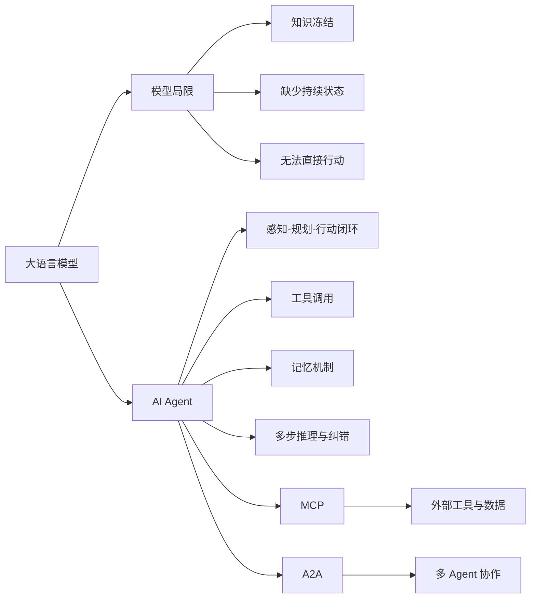

# AI Agent 知识图谱

本仓库用于系统梳理 AI Agent 的核心概念、架构、协议与工程实践，并采用便于 DeepWiki 索引的分层文档结构。

## 目录

1. [从大模型到 AI Agent](docs/01-agent-foundations.md)

## 知识图谱

```mermaid
flowchart LR
    LLM[大语言模型] --> LIMIT[模型局限]
    LIMIT --> FREEZE[知识冻结]
    LIMIT --> STATE[缺少持续状态]
    LIMIT --> ACTION[无法直接行动]

    LLM --> AGENT[AI Agent]
    AGENT --> LOOP[感知-规划-行动闭环]
    AGENT --> TOOL[工具调用]
    AGENT --> MEMORY[记忆机制]
    AGENT --> REASON[多步推理与纠错]

    AGENT --> MCP[MCP]
    AGENT --> A2A[A2A]
    MCP --> EXT[外部工具与数据]
    A2A --> MULTI[多 Agent 协作]
```

