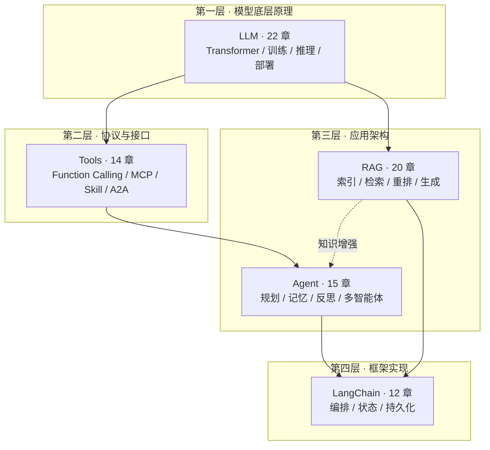
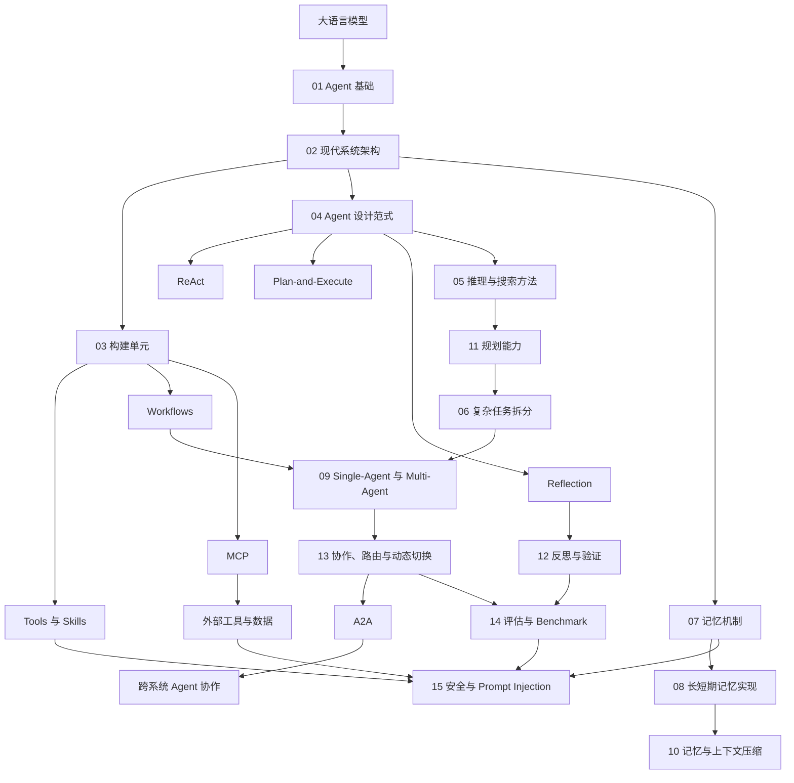
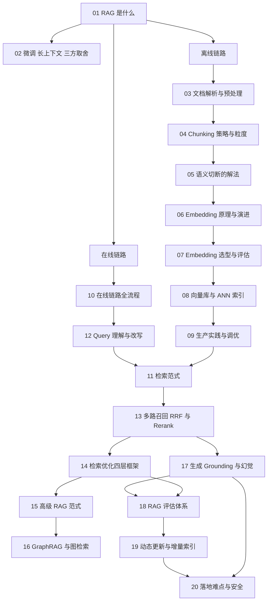
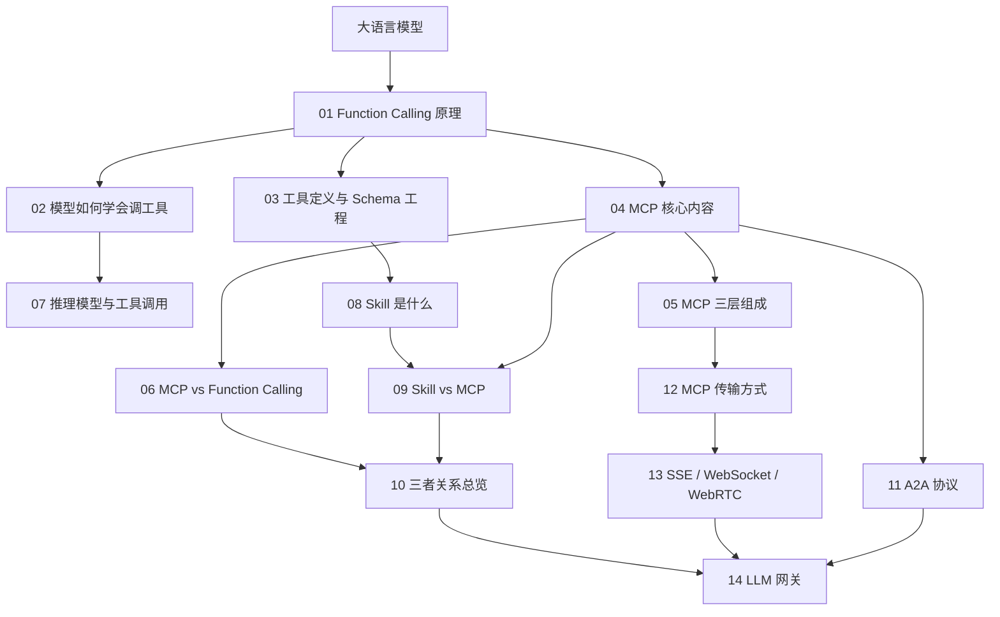
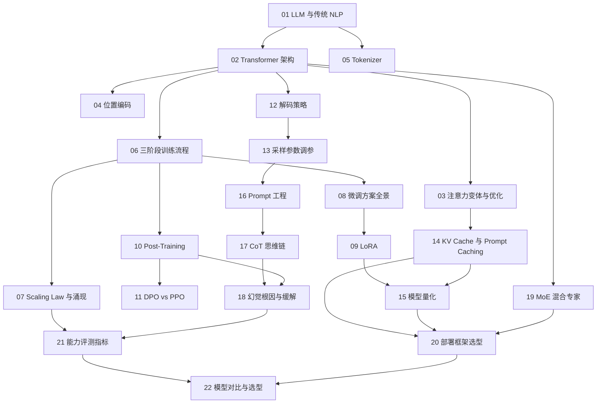

# AI 知识图谱

本仓库用于系统梳理 LLM、RAG、Agent 和应用框架等 AI 知识，并采用便于 DeepWiki 索引的分层文档结构。

## 总体策略图

本仓库按「抽象层次」组织知识，五个主题自下而上构成一条完整的栈。

## 主题目录

| 层次 | 主题 | 目录 | 状态 |
|---|---|---|---|
| 底层原理 | LLM 相关知识点 | [`docs/llm/`](docs/llm/README.md) | 已完成 22 章 |
| 协议接口 | Tools 相关知识点 | [`docs/tools/`](docs/tools/README.md) | 已完成 14 章 |
| 应用架构 | Agent 相关知识点 | [`docs/agent/`](docs/agent/README.md) | 已完成 15 章 |
| 应用架构 | RAG 相关知识点 | [`docs/rag/`](docs/rag/README.md) | 已完成 20 章 |
| 框架实现 | LangChain 相关知识点 | [`docs/langchain/`](docs/langchain/README.md) | 规划 12 章，撰写中 |

完整文档索引与主题间交叉引用约定见 [`docs/README.md`](docs/README.md)。

## Agent 相关知识点

1. [从大模型到 AI Agent](docs/agent/01-agent-foundations.md)
2. [Agent 的现代系统架构](docs/agent/02-agent-architecture.md)
3. [Tools、Skills、Agents、Workflows 与 AGENTS.md](docs/agent/03-agentic-building-blocks.md)
4. [Agent 设计范式](docs/agent/04-agent-design-patterns.md)
5. [Agent 的模型推理与搜索方法](docs/agent/05-agent-reasoning-methods.md)
6. [复杂任务拆分与调度](docs/agent/06-task-decomposition.md)
7. [AI Agent 的记忆机制](docs/agent/07-agent-memory.md)
8. [Agent 长短期记忆系统的工程实现](docs/agent/08-agent-memory-implementation.md)
9. [Single-Agent 与 Multi-Agent 系统](docs/agent/09-single-vs-multi-agent.md)
10. [Agent 记忆与上下文压缩](docs/agent/10-agent-memory-compression.md)
11. [如何赋予 LLM 与 Agent 规划能力](docs/agent/11-llm-agent-planning.md)
12. [Agent 的反思、验证与自我改进](docs/agent/12-agent-reflection.md)
13. [Multi-Agent 协作、路由与动态切换](docs/agent/13-multi-agent-coordination.md)
14. [Agent 评估与 Benchmark](docs/agent/14-agent-evaluation.md)
15. [Agent 安全与 Prompt Injection](docs/agent/15-agent-security.md)

## Agent 知识图谱

## RAG 相关知识点

1. [RAG 是什么，解决什么问题](docs/rag/01-what-is-rag.md)
2. [RAG、微调与长上下文的三方取舍](docs/rag/02-rag-finetune-longcontext.md)
3. [文档解析与预处理](docs/rag/03-document-parsing.md)
4. [Chunking 策略与粒度选择](docs/rag/04-chunking-strategy.md)
5. [语义被切断怎么办](docs/rag/05-semantic-truncation.md)
6. [Embedding 原理与技术演进](docs/rag/06-embedding-principles.md)
7. [Embedding 模型选型与评估](docs/rag/07-embedding-selection.md)
8. [向量数据库与 ANN 索引](docs/rag/08-vector-database.md)
9. [向量库生产实践与性能调优](docs/rag/09-vectordb-production.md)
10. [RAG 在线链路全流程](docs/rag/10-online-pipeline.md)
11. [检索范式：稀疏、稠密与后期交互](docs/rag/11-retrieval-paradigms.md)
12. [Query 理解与改写](docs/rag/12-query-rewriting.md)
13. [多路召回、RRF 融合与 Rerank](docs/rag/13-hybrid-retrieval-rerank.md)
14. [检索优化的四层框架](docs/rag/14-retrieval-optimization.md)
15. [高级 RAG 范式](docs/rag/15-advanced-rag-paradigms.md)
16. [GraphRAG 与图检索](docs/rag/16-graphrag.md)
17. [生成、Grounding 与幻觉规避](docs/rag/17-generation-hallucination.md)
18. [RAG 评估体系](docs/rag/18-rag-evaluation.md)
19. [知识库的动态更新与增量索引](docs/rag/19-dynamic-update.md)
20. [RAG 落地难点与安全](docs/rag/20-rag-challenges-security.md)

## RAG 知识图谱

## Tools 相关知识点

1. [Function Calling 是什么，原理是什么](docs/tools/01-function-calling.md)
2. [LLM 如何学会调用工具](docs/tools/02-tool-learning.md)
3. [工具定义与 Schema 工程](docs/tools/03-tool-schema-design.md)
4. [MCP 模型上下文协议的核心内容](docs/tools/04-what-is-mcp.md)
5. [MCP 的三层组成](docs/tools/05-mcp-components.md)
6. [MCP 与 Function Calling 的区别与选型](docs/tools/06-mcp-vs-function-calling.md)
7. [为什么有些推理模型不支持 MCP](docs/tools/07-reasoning-models-and-tools.md)
8. [Skill 是什么](docs/tools/08-what-is-skill.md)
9. [Skill 与 MCP 的区别](docs/tools/09-skill-vs-mcp.md)
10. [Function Calling、Skill、MCP 三者关系](docs/tools/10-fc-skill-mcp.md)
11. [A2A 协议与 Agent 间通信](docs/tools/11-a2a-protocol.md)
12. [MCP 的传输方式](docs/tools/12-mcp-transport.md)
13. [SSE、WebSocket 与 WebRTC](docs/tools/13-sse-websocket-webrtc.md)
14. [LLM 网关](docs/tools/14-llm-gateway.md)

## Tools 知识图谱

## LLM 相关知识点

1. [大语言模型与传统 NLP 的本质区别](docs/llm/01-what-is-llm.md)
2. [Transformer 架构原理](docs/llm/02-transformer-architecture.md)
3. [MHA 的局限与 MQA、GQA、Flash Attention](docs/llm/03-attention-variants.md)
4. [位置编码：sin/cos、RoPE 与 ALiBi](docs/llm/04-position-encoding.md)
5. [Tokenizer 分词器原理](docs/llm/05-tokenizer.md)
6. [大模型的三阶段训练流程](docs/llm/06-llm-training.md)
7. [Scaling Law 与涌现能力](docs/llm/07-scaling-law-emergence.md)
8. [微调方案全景](docs/llm/08-finetuning.md)
9. [LoRA 技术详解](docs/llm/09-lora.md)
10. [Post-Training：RLHF、DPO、GRPO 与拒绝采样](docs/llm/10-post-training.md)
11. [DPO 与 PPO 的区别](docs/llm/11-dpo-vs-ppo.md)
12. [解码策略：贪心、Beam Search 与采样](docs/llm/12-decoding-strategies.md)
13. [Temperature、Top-P 与 Top-K](docs/llm/13-temperature-top-p-top-k.md)
14. [KV Cache 与 Prompt Caching](docs/llm/14-kv-cache.md)
15. [模型量化：INT8、INT4、GPTQ 与 AWQ](docs/llm/15-quantization.md)
16. [Prompt 工程实践](docs/llm/16-prompt-engineering.md)
17. [CoT 思维链的原理与局限](docs/llm/17-cot.md)
18. [大模型幻觉的根因与缓解](docs/llm/18-hallucination.md)
19. [MoE 混合专家模型](docs/llm/19-moe.md)
20. [部署方案：vLLM、SGLang、TGI 与 llama.cpp](docs/llm/20-deployment-frameworks.md)
21. [大模型能力评测指标](docs/llm/21-evaluation-metrics.md)
22. [主流大模型对比与选型](docs/llm/22-model-selection.md)

## LLM 知识图谱

