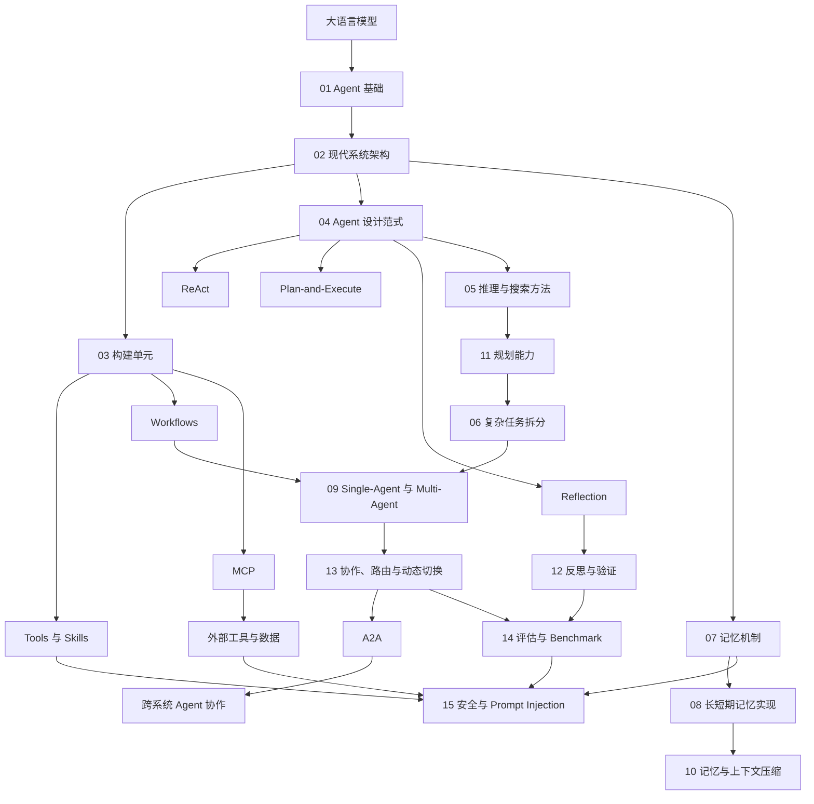

# AI 知识图谱

本仓库用于系统梳理 LLM、RAG、Agent 和应用框架等 AI 知识，并采用便于 DeepWiki 索引的分层文档结构。

## 主题目录

| 主题 | 目录 | 状态 |
|---|---|---|
| Agent 相关知识点 | [`docs/agent/`](docs/agent/README.md) | 持续更新，现有 15 章 |
| LLM 相关知识点 | [`docs/llm/`](docs/llm/README.md) | 已建立目录 |
| RAG 相关知识点 | [`docs/rag/`](docs/rag/README.md) | 已建立目录 |
| LangChain 相关知识点 | [`docs/langchain/`](docs/langchain/README.md) | 已建立目录 |

完整文档索引见 [`docs/README.md`](docs/README.md)。

## Agent 相关知识点

1. [从大模型到 AI Agent](docs/agent/01-agent-foundations.md)
2. [Agent 的现代系统架构](docs/agent/02-agent-architecture.md)
3. [Tools、Skills、Agents、Workflows 与 AGENTS.md](docs/agent/03-agentic-building-blocks.md)
4. [Agent 设计范式](docs/agent/04-agent-design-patterns.md)
5. [Agent 的模型推理与搜索方法](docs/agent/05-agent-reasoning-methods.md)
6. [复杂任务拆分与调度](docs/agent/06-task-decomposition.md)
7. [AI Agent 的记忆机制](docs/agent/07-agent-memory.md)
8. [Agent 长短期记忆系统的工程实现](docs/agent/08-agent-memory-implementation.md)
9. [Single-Agent 与 Multi-Agent 系统](docs/agent/09-single-vs-multi-agent.md)
10. [Agent 记忆与上下文压缩](docs/agent/10-agent-memory-compression.md)
11. [如何赋予 LLM 与 Agent 规划能力](docs/agent/11-llm-agent-planning.md)
12. [Agent 的反思、验证与自我改进](docs/agent/12-agent-reflection.md)
13. [Multi-Agent 协作、路由与动态切换](docs/agent/13-multi-agent-coordination.md)
14. [Agent 评估与 Benchmark](docs/agent/14-agent-evaluation.md)
15. [Agent 安全与 Prompt Injection](docs/agent/15-agent-security.md)

## Agent 知识图谱

