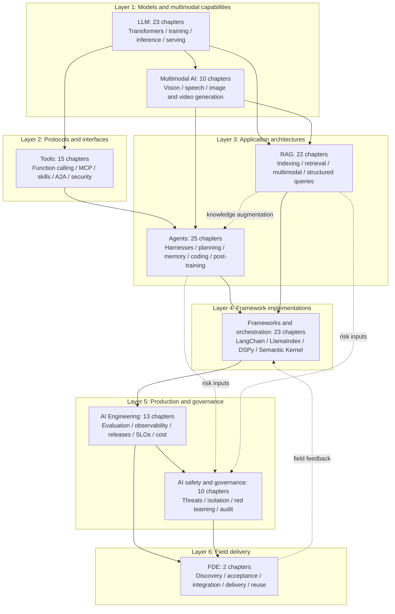

# Awesome AI Roadmap

**English** | [简体中文](README.zh.md)

An English-first, bilingual handbook for AI engineering interviews, covering model foundations, application development, and production operations. Each topic explains mechanisms, design choices, failure cases, and practical trade-offs so you can move from foundational questions to system design. The searchable MkDocs site organizes the material as topics, modules, and chapters.

For a continuous reading path, start with the [book contents](docs/book/README.md): front matter, nine parts, and closing matter. Every chapter has an English source and a complete Simplified Chinese companion. Each language uses the same source text for its website and EPUB editions.

Start changes in English and review the corresponding Chinese update in **the same PR**. CI checks coverage and synchronization; it does not secretly translate the book or refresh stale records. After merge, separate workflows publish the site and produce downloadable EPUBs. Do not maintain separate prose for web and EPUB or commit generated `.epub` files. Nothing is uploaded to KDP automatically.

**Download an EPUB:** open [Build EPUB](https://github.com/zongyangbigpolo/awesome-ai-roadmap/actions/workflows/epub.yml), select a successful run, and download the English or Chinese artifact from **Artifacts**. The names are `ai-engineering-interview-en-epub` and `ai-engineering-interview-zh-CN-epub`. Unzip it to obtain the book and its build reports. Artifacts are retained for up to 90 days; a maintainer can use **Run workflow** to rebuild an expired download. With the export dependencies installed, run `python3 scripts/build_epub.py --language en` or use `--language zh-CN`. See the [maintenance guide](book/README.md). A valid EPUB is not, by itself, evidence of KDP eligibility or visual acceptance.

**Read online:** [English](https://zongyangbigpolo.github.io/awesome-ai-roadmap/) | [简体中文](https://zongyangbigpolo.github.io/awesome-ai-roadmap/zh/)

**Author:** [Polo Li](https://github.com/zongyangbigpolo) | **License:** [CC BY 4.0](LICENSE)

> **Chinese technical review: 2026-09-15. English-first migration: 2026-09-20.** Technical versions, experiment conditions, and source-check dates belong to the individual chapters. Editorial dates do not mean every interface has been updated to its latest version.

## How the topics fit together

The handbook has nine topics and 143 logical chapters, each available in both languages. The progression is from model capabilities and interfaces to application architectures, frameworks, production governance, and field delivery.

This is a way to organize knowledge and reading, not a request flow or a stack that every project must adopt. Evaluation, safety, and customer acceptance belong in requirements and design, not as additions after the model or application is finished.

## Topics

| Layer | Topic | Directory | Coverage |
|---|---|---|---|
| Foundations | LLM | [`docs/llm/`](docs/llm/README.md) | 23 chapters |
| Model capabilities | Multimodal AI | [`docs/multimodal/`](docs/multimodal/README.md) | 10 chapters |
| Protocols and interfaces | Tools | [`docs/tools/`](docs/tools/README.md) | 15 chapters |
| Application architectures | Agents | [`docs/agent/`](docs/agent/README.md) | 25 chapters |
| Application architectures | RAG | [`docs/rag/`](docs/rag/README.md) | 22 chapters |
| Framework implementations | Frameworks and orchestration | [`docs/frameworks/`](docs/frameworks/README.md) | 23 chapters |
| Production engineering | AI Engineering / LLMOps | [`docs/engineering/`](docs/engineering/README.md) | 13 chapters |
| Safety and governance | AI safety and governance | [`docs/safety/`](docs/safety/README.md) | 10 chapters |
| Field delivery | FDE | [`docs/fde/`](docs/fde/README.md) | 2 chapters |

The [documentation index](docs/README.md) provides the full topic map, ownership of shared concepts, and suggested reading paths. Topic indexes introduce their modules and relationships; module indexes list the chapters.

## Using the handbook for interview preparation

Choose topics for the role you are preparing for; there is no need to memorize 143 chapters. After reviewing a concept, close the page and explain how it works. Then change a constraint: more data, a tighter latency target, different permissions, or a failed tool. Does the design still hold? Return to the chapter and its original sources for anything you cannot explain.

System design questions connect topics. An internal knowledge assistant, for example, involves not only RAG but also tool permissions, offline evaluation, release and rollback, and customer acceptance. Discuss projects you actually worked on; the hypothetical cases here are for practicing design and follow-up questions.

## Contributing and quality

Repository checks cover paired-language coverage and synchronization, chapter numbering, headings, code and math fences, unsupported LaTeX macros, links, navigation counts, and Mermaid syntax. See [CONTRIBUTING.md](CONTRIBUTING.md) for the editing workflow and the [editorial policy](docs/editorial-policy.md) for sources, citations, and corrections.
