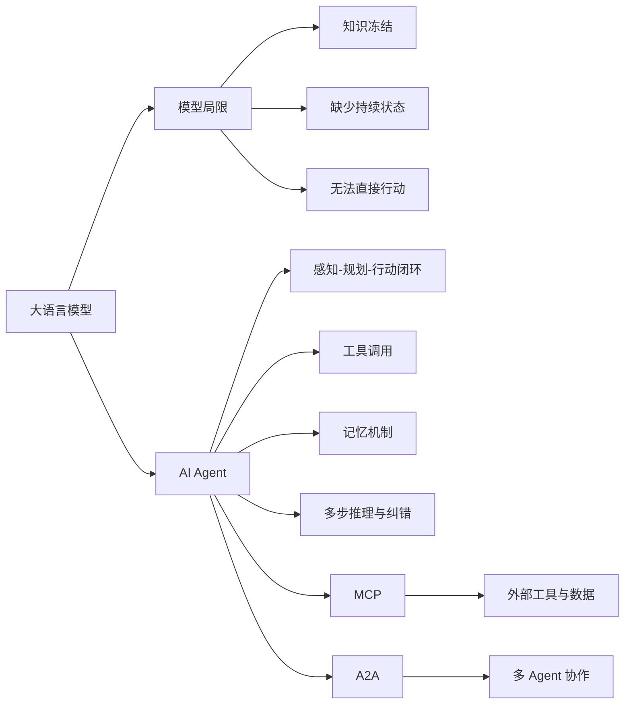

# AI Agent 知识图谱

本仓库用于系统梳理 AI Agent 的核心概念、架构、协议与工程实践，并采用便于 DeepWiki 索引的分层文档结构。

## 目录

1. [从大模型到 AI Agent](docs/01-agent-foundations.md)
2. [Agent 的现代系统架构](docs/02-agent-architecture.md)
3. [Tools、Skills、Agents、Workflows 与 AGENTS.md](docs/03-agentic-building-blocks.md)
4. [Agent 设计范式](docs/04-agent-design-patterns.md)
5. [Agent 的模型推理与搜索方法](docs/05-agent-reasoning-methods.md)
6. [复杂任务拆分与调度](docs/06-task-decomposition.md)
7. [AI Agent 的记忆机制](docs/07-agent-memory.md)
8. [Agent 长短期记忆系统的工程实现](docs/08-agent-memory-implementation.md)
9. [Single-Agent 与 Multi-Agent 系统](docs/09-single-vs-multi-agent.md)

## 知识图谱

