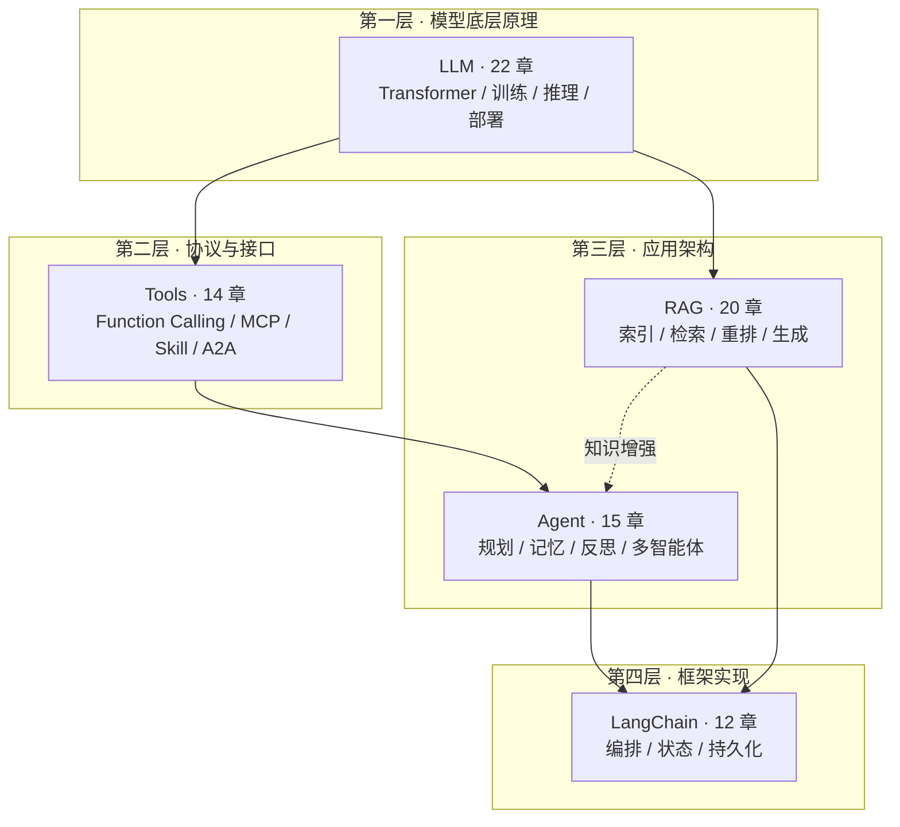
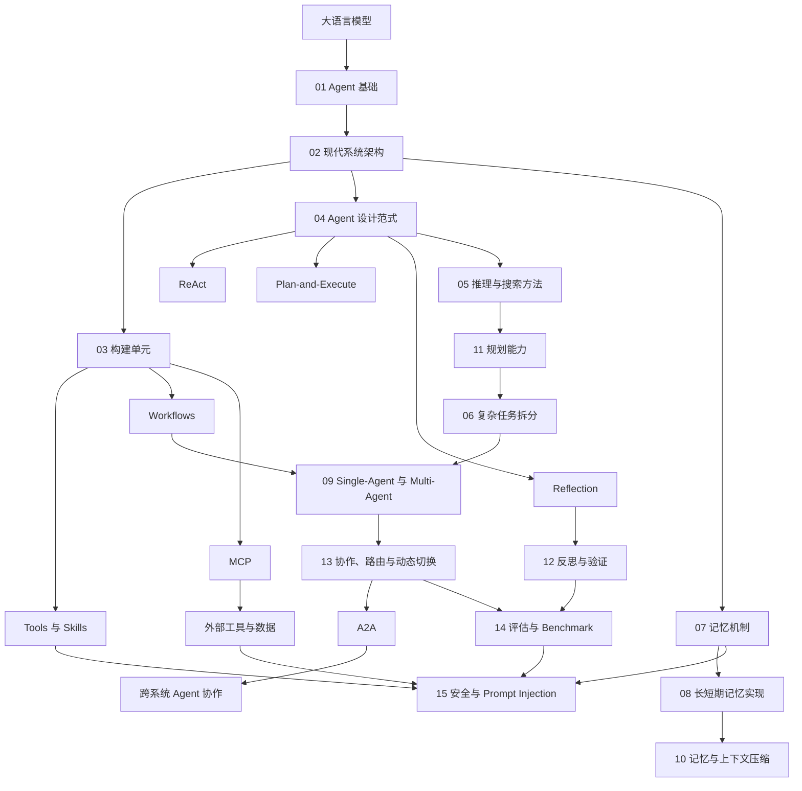
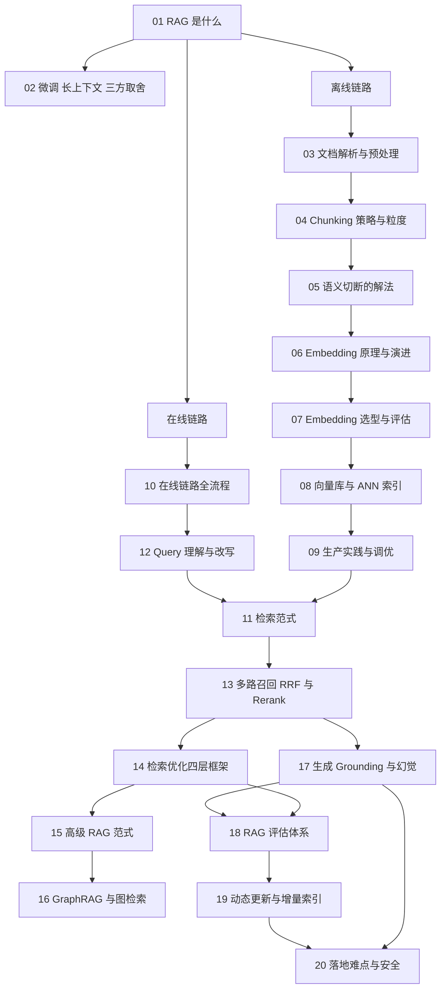

# AI 知识图谱

本仓库用于系统梳理 LLM、RAG、Agent 和应用框架等 AI 知识，并采用便于 DeepWiki 索引的分层文档结构。

## 总体策略图

本仓库按「抽象层次」组织知识，五个主题自下而上构成一条完整的栈。

## 主题目录

| 层次 | 主题 | 目录 | 状态 |
|---|---|---|---|
| 底层原理 | LLM 相关知识点 | [`docs/llm/`](docs/llm/README.md) | 规划 22 章，撰写中 |
| 协议接口 | Tools 相关知识点 | [`docs/tools/`](docs/tools/README.md) | 规划 14 章，撰写中 |
| 应用架构 | Agent 相关知识点 | [`docs/agent/`](docs/agent/README.md) | 已完成 15 章 |
| 应用架构 | RAG 相关知识点 | [`docs/rag/`](docs/rag/README.md) | 已完成 20 章 |
| 框架实现 | LangChain 相关知识点 | [`docs/langchain/`](docs/langchain/README.md) | 规划 12 章，撰写中 |

完整文档索引与主题间交叉引用约定见 [`docs/README.md`](docs/README.md)。

## Agent 相关知识点

1. [从大模型到 AI Agent](docs/agent/01-agent-foundations.md)
2. [Agent 的现代系统架构](docs/agent/02-agent-architecture.md)
3. [Tools、Skills、Agents、Workflows 与 AGENTS.md](docs/agent/03-agentic-building-blocks.md)
4. [Agent 设计范式](docs/agent/04-agent-design-patterns.md)
5. [Agent 的模型推理与搜索方法](docs/agent/05-agent-reasoning-methods.md)
6. [复杂任务拆分与调度](docs/agent/06-task-decomposition.md)
7. [AI Agent 的记忆机制](docs/agent/07-agent-memory.md)
8. [Agent 长短期记忆系统的工程实现](docs/agent/08-agent-memory-implementation.md)
9. [Single-Agent 与 Multi-Agent 系统](docs/agent/09-single-vs-multi-agent.md)
10. [Agent 记忆与上下文压缩](docs/agent/10-agent-memory-compression.md)
11. [如何赋予 LLM 与 Agent 规划能力](docs/agent/11-llm-agent-planning.md)
12. [Agent 的反思、验证与自我改进](docs/agent/12-agent-reflection.md)
13. [Multi-Agent 协作、路由与动态切换](docs/agent/13-multi-agent-coordination.md)
14. [Agent 评估与 Benchmark](docs/agent/14-agent-evaluation.md)
15. [Agent 安全与 Prompt Injection](docs/agent/15-agent-security.md)

## Agent 知识图谱

## RAG 相关知识点

1. [RAG 是什么，解决什么问题](docs/rag/01-what-is-rag.md)
2. [RAG、微调与长上下文的三方取舍](docs/rag/02-rag-finetune-longcontext.md)
3. [文档解析与预处理](docs/rag/03-document-parsing.md)
4. [Chunking 策略与粒度选择](docs/rag/04-chunking-strategy.md)
5. [语义被切断怎么办](docs/rag/05-semantic-truncation.md)
6. [Embedding 原理与技术演进](docs/rag/06-embedding-principles.md)
7. [Embedding 模型选型与评估](docs/rag/07-embedding-selection.md)
8. [向量数据库与 ANN 索引](docs/rag/08-vector-database.md)
9. [向量库生产实践与性能调优](docs/rag/09-vectordb-production.md)
10. [RAG 在线链路全流程](docs/rag/10-online-pipeline.md)
11. [检索范式：稀疏、稠密与后期交互](docs/rag/11-retrieval-paradigms.md)
12. [Query 理解与改写](docs/rag/12-query-rewriting.md)
13. [多路召回、RRF 融合与 Rerank](docs/rag/13-hybrid-retrieval-rerank.md)
14. [检索优化的四层框架](docs/rag/14-retrieval-optimization.md)
15. [高级 RAG 范式](docs/rag/15-advanced-rag-paradigms.md)
16. [GraphRAG 与图检索](docs/rag/16-graphrag.md)
17. [生成、Grounding 与幻觉规避](docs/rag/17-generation-hallucination.md)
18. [RAG 评估体系](docs/rag/18-rag-evaluation.md)
19. [知识库的动态更新与增量索引](docs/rag/19-dynamic-update.md)
20. [RAG 落地难点与安全](docs/rag/20-rag-challenges-security.md)

## RAG 知识图谱

