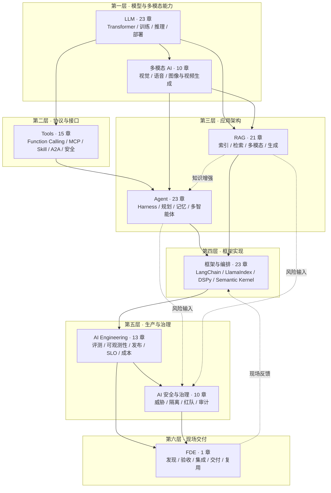

# AI 知识图谱

这是一份面向 AI 工程面试准备的中文知识图谱，覆盖模型原理、应用开发和生产治理。每个主题既解释概念，也讨论选型条件、失败场景和工程取舍，方便从基础问答深入到系统设计。文档按“主题 → 子模块 → 章节”组织，通过 MkDocs Material 发布为可搜索的 Wiki。

**在线 Wiki：** <https://zongyangbigpolo.github.io/awesome-ai-roadmap/>

**作者：** [Polo Li](https://github.com/zongyangbigpolo) · **许可：** [CC BY 4.0](LICENSE)

> **资料更新：2026-09-08。** 版本信息、实验条件和参考来源见各章正文。

## 总体策略图

九个主题按“模型能力 → 协议接口 → 应用架构 → 框架实现 → 生产治理 → 现场交付”组织，共 139 章。

这是知识组织与阅读顺序，不是请求调用链，也不是必须逐层采用的技术栈。评测、安全和客户验收应从需求设计阶段参与，而不是等模型或应用做完后再补。

## 主题目录

| 层次 | 主题 | 目录 | 状态 |
|---|---|---|---|
| 底层原理 | LLM 相关知识点 | [`docs/llm/`](docs/llm/README.md) | 23 章 |
| 模型能力 | 多模态 AI | [`docs/multimodal/`](docs/multimodal/README.md) | 10 章 |
| 协议接口 | Tools 相关知识点 | [`docs/tools/`](docs/tools/README.md) | 15 章 |
| 应用架构 | Agent 相关知识点 | [`docs/agent/`](docs/agent/README.md) | 23 章 |
| 应用架构 | RAG 相关知识点 | [`docs/rag/`](docs/rag/README.md) | 21 章 |
| 框架实现 | AI 框架与编排 | [`docs/frameworks/`](docs/frameworks/README.md) | 23 章 |
| 生产工程 | AI Engineering / LLMOps | [`docs/engineering/`](docs/engineering/README.md) | 13 章 |
| 安全治理 | AI 安全与治理 | [`docs/safety/`](docs/safety/README.md) | 10 章 |
| 现场交付 | FDE | [`docs/fde/`](docs/fde/README.md) | 1 章 |

完整目录、跨主题归属约定与推荐阅读路径见 [`docs/README.md`](docs/README.md)。每个主题 README 维护子模块入口与模块关系，每个子模块 README 维护具体章节顺序。

## 如何用于面试准备

先按目标岗位选择主题，不必从头背完 139 章。复习一个概念时，合上文档解释它如何工作，再换一个约束试着推演：数据变大、延迟变紧、权限变化或工具失败后，原来的方案还成立吗？讲不清的部分再回到对应章节和原始资料。

系统设计题需要把几个主题连起来：例如企业知识助手不止涉及 RAG，还涉及工具权限、离线评测、发布回滚和客户验收。项目题则应结合自己实际做过的工作；文中的假设案例只用于练习设计和追问。

## 文档质量

仓库提供 `scripts/check_docs.py` 与 `scripts/check_mermaid.mjs`，用于检查章节编号、标题、代码与数学围栏、禁用 LaTeX 宏、内部链接、导航计数和 Mermaid 语法。写作与贡献约定见 [`CONTRIBUTING.md`](CONTRIBUTING.md)，来源选择、引用和纠错方式见[编辑规范](docs/editorial-policy.md)。
