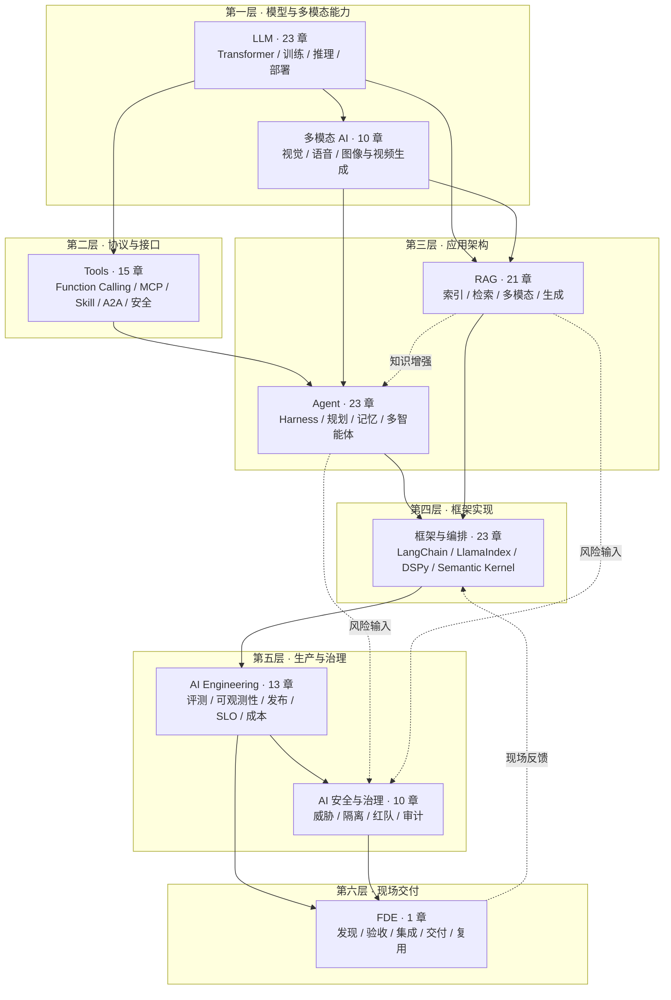

# AI 知识图谱

本仓库系统梳理从模型原理到生产治理的 AI 技术栈。文档采用“主题 → 子模块 → 章节”的知识图谱结构，并通过 MkDocs Material 发布为可搜索的 Wiki。

**在线 Wiki：** <https://zongyangbigpolo.github.io/awesome-ai-roadmap/>

> **内容基线：2026-08-31。** 高时效性章节应结合文中链接的官方文档和实际版本再次核验。

## 总体策略图

九个主题按“模型能力 → 协议接口 → 应用架构 → 框架实现 → 生产治理 → 现场交付”组织，共 139 章。

## 主题目录

| 层次 | 主题 | 目录 | 状态 |
|---|---|---|---|
| 底层原理 | LLM 相关知识点 | [`docs/llm/`](docs/llm/README.md) | 23 章 |
| 模型能力 | 多模态 AI | [`docs/multimodal/`](docs/multimodal/README.md) | 10 章 |
| 协议接口 | Tools 相关知识点 | [`docs/tools/`](docs/tools/README.md) | 15 章 |
| 应用架构 | Agent 相关知识点 | [`docs/agent/`](docs/agent/README.md) | 23 章 |
| 应用架构 | RAG 相关知识点 | [`docs/rag/`](docs/rag/README.md) | 21 章 |
| 框架实现 | AI 框架与编排 | [`docs/frameworks/`](docs/frameworks/README.md) | 23 章 |
| 生产工程 | AI Engineering / LLMOps | [`docs/engineering/`](docs/engineering/README.md) | 13 章 |
| 安全治理 | AI 安全与治理 | [`docs/safety/`](docs/safety/README.md) | 10 章 |
| 现场交付 | FDE | [`docs/fde/`](docs/fde/README.md) | 1 章 |

完整目录、跨主题归属约定与推荐阅读路径见 [`docs/README.md`](docs/README.md)。每个主题 README 维护子模块入口与模块关系，每个子模块 README 维护具体章节顺序。

## 文档质量

仓库提供 `scripts/check_docs.py` 与 `scripts/check_mermaid.mjs`，用于检查章节编号、标题、代码与数学围栏、禁用 LaTeX 宏、内部链接、导航计数和 Mermaid 语法。写作与贡献约定见 [`CONTRIBUTING.md`](CONTRIBUTING.md)。
