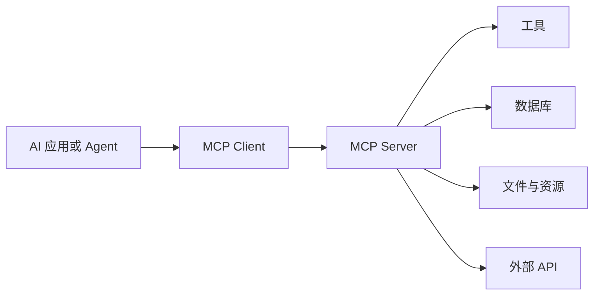
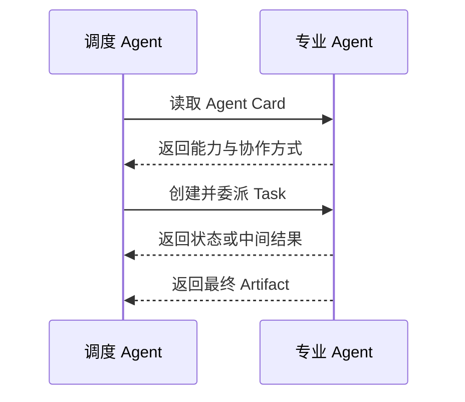
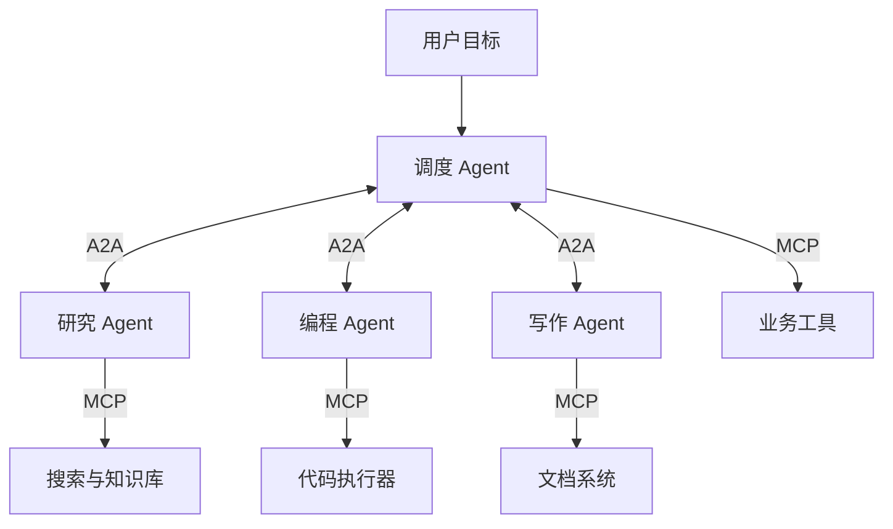

# 第一章：从大模型到 AI Agent

## 1.1 普通大模型的三类局限

大语言模型擅长理解和生成文本，但单独使用时仍存在三个重要局限。

### 1.1.1 知识冻结

模型的参数知识主要来自训练数据，无法天然感知训练结束后发生的新事件。若要获得实时信息，必须接入搜索引擎、数据库或 RAG 系统。

### 1.1.2 缺少持续状态

大模型本身是无状态的。一次普通调用可以表示为：

$$
y_t \sim P_{\theta}(y\mid x_t)
$$

模型只根据本次输入 $x_t$ 生成输出 $y_t$。如果应用程序不重新传入历史记录，模型就不知道此前发生过什么。

### 1.1.3 无法直接行动

大模型默认只能生成文本，不能独立完成以下操作：

- 查询实时数据；
- 执行代码；
- 访问数据库；
- 调用业务 API；
- 发送邮件或修改文件。

因此，普通大模型主要解决的是：

$$
\text{输入} \rightarrow \text{内容生成}
$$

而不是：

$$
\text{目标} \rightarrow \text{现实世界中的任务完成}
$$

## 1.2 什么是 Agent

AI Agent 是一种以大模型为推理核心，能够围绕目标持续感知环境、制定计划、调用工具，并根据反馈调整行动的智能系统。

它的核心并不是某一次回答，而是一个持续运行的闭环：

$$
\boxed{
\text{感知}
\rightarrow
\text{规划}
\rightarrow
\text{行动}
\rightarrow
\text{再感知}
}
$$

设 Agent 在时刻 $t$ 的状态为：

$$
S_t=(G,O_t,M_t,H_t)
$$

其中：

- $G$：任务目标；
- $O_t$：当前环境观察；
- $M_t$：可用记忆；
- $H_t$：此前的执行历史。

Agent 根据当前状态制定计划并选择动作：

$$
P_t=\operatorname{Plan}(S_t)
$$

$$
A_t=\operatorname{Act}(S_t,P_t)
$$

动作改变外部环境，产生新的观察：

$$
O_{t+1}=\operatorname{Environment}(A_t)
$$

随后，Agent 更新自身状态并进入下一轮循环：

$$
S_{t+1}=\operatorname{Update}(S_t,O_{t+1})
$$

直到目标完成、达到资源限制，或者需要人工介入。

## 1.3 Agent 的三大核心能力

### 1.3.1 工具调用（Tool Use）

工具调用是 Agent 从“会说话”走向“能做事”的关键。

Agent 可以使用的工具包括：

- 搜索引擎；
- 代码执行器；
- 文件系统；
- 数据库；
- 浏览器；
- 外部 API；
- 邮件和企业业务系统。

$$
\text{LLM}+\text{Tools}
\Rightarrow
\text{可执行能力}
$$

大模型负责理解目标、选择工具和生成参数，工具负责真正改变外部世界。

### 1.3.2 记忆机制（Memory）

模型本身不会永久保存对话。Agent 的记忆能力来自模型之外的系统设计。

#### 短期记忆

短期记忆保存当前任务中的状态，例如：

- 当前目标；
- 已完成的步骤；
- 工具调用结果；
- 中间计算结果；
- 尚未解决的问题。

它通常存放在上下文窗口、任务状态或临时存储中。

#### 长期记忆

长期记忆保存跨任务信息，例如：

- 用户偏好；
- 历史操作；
- 领域知识；
- 过去任务的经验。

长期记忆可以存储在关系数据库、文档数据库或向量数据库中，并通过关键词、条件查询或语义检索取回。

$$
\text{Agent Memory}
=
\text{Short-term Memory}
+
\text{Long-term Memory}
$$

### 1.3.3 多步推理与自我纠错

Agent 能够把复杂目标拆解为多个步骤，并根据执行反馈调整策略：

$$
\text{执行}
\rightarrow
\text{反馈}
\rightarrow
\text{分析}
\rightarrow
\text{调整}
\rightarrow
\text{重试}
$$

例如：

- 搜索关键词无效时，重新生成查询词；
- API 返回错误时，根据错误信息修改参数；
- 代码执行失败时，分析异常并修正代码；
- 当前方案不可行时，重新规划任务路径。

这也是 Agent 与固定自动化脚本的重要区别：

$$
\text{自动化脚本}
=
\text{预设流程}
$$

$$
\text{Agent}
=
\text{目标驱动}
+
\text{动态决策}
+
\text{反馈调整}
$$

不过，自我纠错并不意味着 Agent 一定能解决问题。实际系统仍需设置最大重试次数、权限边界、资源预算和人工确认机制。

## 1.4 从单 Agent 到 Agent 生态

随着 Agent 和工具数量增加，两个新的问题随之出现：

1. Agent 如何统一连接大量外部工具？
2. 不同厂商、不同框架开发的 Agent 如何相互协作？

这两个问题分别推动了 MCP 和 A2A 协议的发展。

## 1.5 MCP：连接 Agent 与外部工具

Anthropic 在 2024 年底提出了 MCP：

$$
\text{MCP}=\text{Model Context Protocol}
$$

MCP 为 AI 应用连接外部工具和数据源提供了标准接口，可以将它类比为 AI 工具生态中的“USB-C 接口”。

MCP 主要包含三个角色：

- **Host**：运行模型或 Agent 的 AI 应用；
- **Client**：维护与 MCP Server 的连接；
- **Server**：向 AI 应用暴露工具、资源和提示模板。

其核心价值是降低工具集成成本。原本 $N$ 个 Agent 与 $M$ 个工具之间可能需要：

$$
N \times M
$$

组定制集成，而标准化之后可以分别实现为：

$$
N\text{ 个 MCP Client}+M\text{ 个 MCP Server}
$$

## 1.6 A2A：连接 Agent 与 Agent

Google 在 2025 年 4 月推出了 A2A：

$$
\text{A2A}=\text{Agent-to-Agent Protocol}
$$

如果说 MCP 解决的是“Agent 如何调用外部工具”，那么 A2A 解决的就是“Agent 如何发现并与另一个 Agent 协作”。

A2A 中的重要概念包括：

- **Agent Card**：描述 Agent 的身份、能力、技能、服务地址和认证要求；
- **Task**：需要协作完成的任务及其生命周期；
- **Message**：Agent 之间交换的消息；
- **Artifact**：Agent 执行任务后产生的结构化结果。

> Agent Card 更像一份“能力名片”，而“正在做什么”和执行进度主要由 Task 等对象表达。

## 1.7 MCP 与 A2A 的关系

| 维度 | MCP | A2A |
|---|---|---|
| 连接对象 | Agent 与工具 | Agent 与 Agent |
| 核心问题 | 如何使用外部能力 | 如何发现、委派和协作 |
| 主要抽象 | Tools、Resources、Prompts | Agent Card、Task、Message、Artifact |
| 典型场景 | 查询数据库、执行代码 | 多 Agent 分工与结果传递 |
| 类比 | 使用工具 | 与同事协作 |

二者并不是竞争关系，而是位于不同层次的互补协议：

$$
\boxed{
\text{Agent 生态}
=
\text{MCP 工具连接层}
+
\text{A2A Agent 协作层}
}
$$

MCP 让每个 Agent 能够方便地“伸手拿工具”，A2A 则让多个 Agent 能够“相互沟通与分工”。二者共同构成多 Agent 系统走向标准化和互操作的重要基础。
