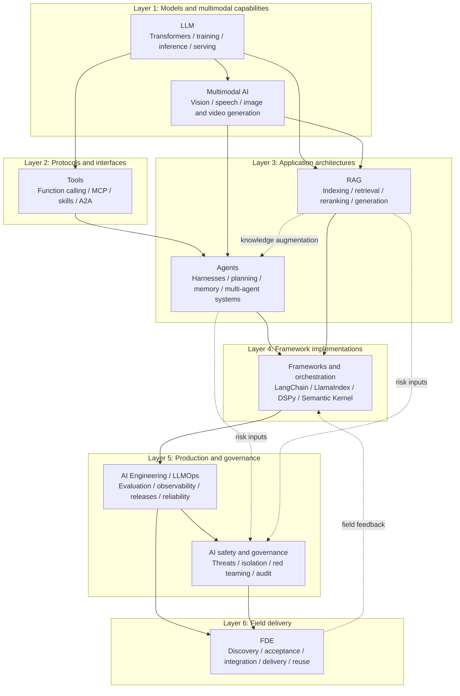

# Handbook Topic Index

This handbook prepares you for AI engineering interviews through the layers of a system, not a catalog of products. Its nine topics cover model foundations, multimodal capabilities, protocols, application architectures, frameworks, production engineering, safety and governance, and field delivery. A useful answer explains both how a mechanism works and what limits the design.

The hierarchy is **topic, module, chapter**. A topic index shows how its modules relate; a module index lists its chapters. Relative links connect related explanations across topics. English is the primary manuscript, and every reader-facing page has a Simplified Chinese companion.

For a continuous reading path, start with the [book contents](book/README.md). The book has nine parts and preserves chapter numbering within each part. The title page, preface, reading guide, and acknowledgments are separate from the technical chapters. Choose a language on the website or download that language's EPUB; neither format has its own independently maintained prose.

## The overall structure

The layers organize the material; they do not require a project to adopt every component. Evaluation, safety, and customer acceptance run through design and delivery. A simple task may need only a model API call, not an agent or an orchestration framework.

## Topics

| Layer | Topic | Coverage | Chapters | Start here |
|---|---|---|---|---|
| Foundations | LLM | Transformers, training and alignment, decoding, quantization, MoE, serving, evaluation, and model selection | 23 | [LLM](llm/README.md) |
| Model capabilities | Multimodal AI | Fusion, VLMs, Document AI, speech, image and video generation, evaluation, and serving | 10 | [Multimodal AI](multimodal/README.md) |
| Protocols and interfaces | Tools | Function calling, tool learning, MCP, skills, A2A, transports, security, and model gateways | 15 | [Tools](tools/README.md) |
| Application architectures | Agents | Architecture, harnesses, memory, planning, multi-agent systems, evaluation, safety, code editing, and post-training | 25 | [Agents](agent/README.md) |
| Application architectures | RAG | Document processing, indexing, retrieval and reranking, multimodal data, generation, evaluation, updates, security, and Text-to-SQL | 22 | [RAG](rag/README.md) |
| Framework implementations | Frameworks and orchestration | LangChain, LangGraph, LlamaIndex, DSPy, Semantic Kernel, lightweight agent frameworks, and migration | 23 | [Frameworks](frameworks/README.md) |
| Production engineering | AI Engineering | LLMOps, gateways and fallback, evaluation, observability, CI/CD, SLOs, cost, and feedback data | 13 | [AI Engineering](engineering/README.md) |
| Safety and governance | AI safety and governance | Threat modeling, prompt attacks, supply chains, privacy, execution isolation, red teaming, governance, and audit | 10 | [Safety and governance](safety/README.md) |
| Field delivery | FDE | Discovery, product collaboration, acceptance, integration, delivery, scope changes, proofs of concept, project memory, and handover | 2 | [FDE](fde/README.md) |

## Where shared concepts are explained

A concept can appear at several layers without needing several copies of its full explanation. The following ownership keeps those explanations consistent:

| Concept | Main explanation | Referenced by | Difference in focus |
|---|---|---|---|
| Chain of thought | LLM | Agent planning, RAG generation | LLM covers mechanisms; Agents explains their role in planning |
| Hallucination | LLM | RAG generation, Agent safety | LLM covers causes; RAG covers generation constrained by retrieved evidence |
| KV cache / prompt caching | LLM | Agent context, AI Engineering | LLM covers mechanisms; application and engineering chapters cover usage |
| VLMs / speech / generative models | Multimodal AI | Agent computer use, multimodal RAG | Multimodal AI covers model capabilities; applications show how they fit into tasks |
| Function calling / MCP | Tools | Agent harnesses, frameworks | Tools covers interfaces and protocols; Agents covers execution; frameworks provide implementations |
| Runtime / harness | Agents | Frameworks, AI Engineering | Agents covers the general runtime; frameworks cover implementations; engineering covers operations |
| Memory | Agents | LangChain modules | Agents explains layers and trade-offs; framework chapters show specific implementations |
| Vector retrieval | RAG | Frameworks | RAG covers indexing and retrieval; frameworks cover component abstractions |
| Observability and releases | AI Engineering | Application topics | Engineering connects production feedback to change management; applications define domain signals |
| Cross-layer safety governance | AI safety and governance | LLM, Tools, Agents, RAG | Local controls belong to each layer; governance connects threat models, red teaming, and audit |
| Delivery in customer environments | FDE | All technical topics | Technical topics explain capabilities; FDE combines them to deliver measurable outcomes |
| Agent post-training | Agents, Chapter 25 | LLM, Tools, AI Engineering | LLM covers optimization; Tools covers call data; Agents connects failure analysis, training examples, and acceptance |
| Structured-data questions | RAG, Chapter 22 | Tools, FDE | Complete-data aggregation calls for a constrained query, not a total guessed from a few retrieved chunks |

## Suggested reading paths

- **Getting started:** LLM Chapters 1-5, Tools Chapters 1 and 4, Agent Chapters 1-2, then RAG Chapter 1.
- **Agent and harness engineering:** Agents, Tools, Frameworks and orchestration, then AI Engineering.
- **RAG and knowledge systems:** RAG, LLM Chapters 5, 18, 21, and 23, then Frameworks Chapters 14-15.
- **Multimodal applications:** Multimodal AI, Agent Chapters 16-23 or RAG Chapter 21, then AI Engineering.
- **Production platforms and SRE:** AI Engineering, LLM inference and serving, Tools gateways, then safety and governance.
- **Safety and governance:** the safety topic, followed by the relevant Agent, Tools, and RAG safety chapters.
- **Customer delivery and solutions:** FDE, AI Engineering, then Agents, RAG, harnesses, and governance as the project requires.

## Connecting topics through interview questions

For foundational questions, explain the concept accurately. For system design, also explain where data comes from, who may take an action, and what happens after a failure. These paths help practice questions that span chapters.

| Practice question | Suggested chapters | What the answer should distinguish |
|---|---|---|
| How would you choose an approach for an internal knowledge assistant? | [RAG, fine-tuning, and long context](rag/01-foundations/02-rag-finetune-longcontext.md), [RAG evaluation](rag/05-generation-evaluation/18-rag-evaluation.md), [offline evaluation](engineering/04-evaluation-observability/07-offline-eval-eval-driven-development.md) | Missing knowledge versus unwanted behavior, and evidence from a representative business query set |
| How can an agent continue after a tool timeout? | [Harness responsibilities](agent/02-runtime-harness/16-harness-definition-and-boundaries.md), [checkpointing and recovery](agent/02-runtime-harness/21-checkpoint-persistence-recovery.md), [retries and idempotency](engineering/02-request-reliability/04-retry-timeout-idempotency-circuit-breaker.md) | Restoring computation is not the same as preventing duplicate business writes |
| Who is responsible for permissions after MCP is connected? | [MCP and function calling](tools/02-mcp/06-mcp-vs-function-calling.md), [tool protocol security](tools/02-mcp/15-tool-protocol-security.md), [least privilege and identity](safety/04-agent-execution-isolation/07-agent-tool-mcp-a2a-least-privilege-identity.md) | Protocol capabilities, proposed calls, and backend authorization |
| Why might a high-scoring model still be unsuitable for production? | [Model evaluation](llm/05-evaluation-selection/21-evaluation-metrics.md), [output contracts](engineering/03-output-safety/05-structured-output-contracts.md), [SLOs and incident response](engineering/06-performance-operations/12-slo-capacity-incident-response.md) | Benchmark scores, structural validity, business correctness, and service reliability |
| How do you turn a vague customer request into a deliverable project? | [FDE foundations](fde/01-foundations/01-forward-deployed-engineering.md), [field lessons](fde/02-field-practice/02-delivery-lessons.md), [versioning](engineering/05-release-pipeline/09-prompt-model-data-versioning.md) | Who approves changes, what a proof of concept establishes, and how the customer accepts and takes over the system |
| Why can an agent change code without fixing the problem? | [Code search, editing, and verification](agent/06-coding-agents/24-code-search-edit-verification.md), [agent post-training](agent/07-post-training/25-agent-post-training.md) | Search omissions, edit failures, weak verification, and model errors before deciding whether training is appropriate |
| How can an assistant count orders accurately rather than guess a total? | [Text-to-SQL](rag/07-structured-queries/22-text-to-sql.md), [tool schemas](tools/01-function-calling/03-tool-schema-design.md), [offline evaluation](engineering/04-evaluation-observability/07-offline-eval-eval-driven-development.md) | Business definitions, table relationships, query authorization, and independent result checks |

For project questions, choose a concrete change: what was not working, which alternatives you tried, and why you made that decision. Reviewing the code, failure examples, and before-and-after results together reveals gaps in your understanding more effectively than memorizing an architecture diagram.

## Frequently asked questions

### Who is this handbook for?

It is primarily for readers preparing for roles in AI application development, agents and RAG, model engineering, and FDE. Beginners can follow the suggested paths to learn the foundations. Experienced readers can start with a practical problem and use the links to revisit evaluation, reliability, permissions, and other easily missed concerns.

### Should I start with LLMs, agents, or RAG?

Start with LLMs to understand model capabilities and limitations. Start with Agents and Tools to build systems that call tools and carry tasks across multiple steps. Start with RAG for private or changing knowledge. Bring in production engineering and safety during design to establish evaluation, permission, and reliability requirements.

### How often is the content updated?

There is no fixed release schedule. Significant changes to protocols, frameworks, or model capabilities lead to updates in the relevant chapters. Page dates come from the history of their current file paths and may not indicate the original publication date. Check time-sensitive claims against the versions and official references cited in the text.
