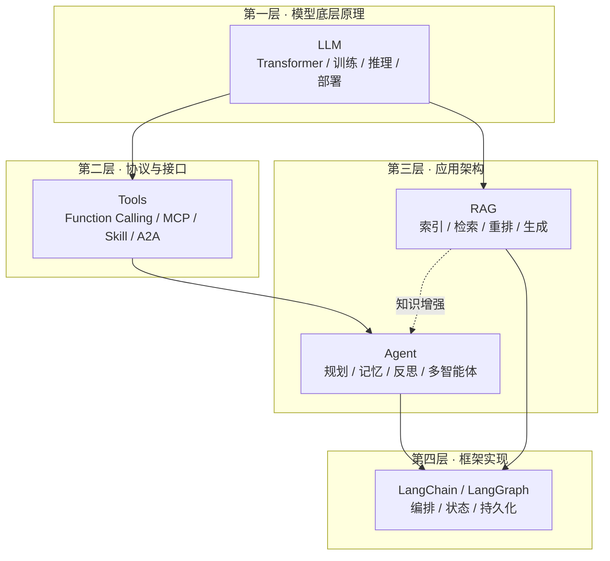

# 文档主题索引

本仓库按「抽象层次」而非「技术名词」组织知识。五个主题自下而上构成一条完整的栈：底层的模型原理决定了能力上限，中间的协议层决定了模型怎么接触外部世界，应用层决定了怎么把能力组织成能干活的系统，框架层决定了这一切用什么轮子落地。

## 总体分层

## 主题目录

| 层次 | 主题 | 内容范围 | 章数 | 入口 |
|---|---|---|---|---|
| 底层原理 | LLM | Transformer、注意力优化、位置编码、训练与对齐、解码与量化、多模态、MoE 与部署、评测选型 | 23 | [进入 LLM 相关知识点](llm/README.md) |
| 协议接口 | Tools | Function Calling、工具学习与训练、MCP、Skill、A2A、传输协议、安全与 LLM 网关 | 15 | [进入 Tools 相关知识点](tools/README.md) |
| 应用架构 | Agent | 架构、工具、记忆、规划、反思、多 Agent、评估与安全 | 15 | [进入 Agent 相关知识点](agent/README.md) |
| 应用架构 | RAG | 文档处理、切分、Embedding、向量库、检索、重排、多模态、生成、评估、更新与安全 | 21 | [进入 RAG 相关知识点](rag/README.md) |
| 框架实现 | LangChain | Chain 与 LCEL、v1 架构、Agent 构建、工具注册、记忆、LangGraph、Deep Agents 与 LangSmith | 13 | [进入 LangChain 相关知识点](langchain/README.md) |

## 主题之间的关系

同一个概念在不同层次会被反复提到，但视角完全不同。为避免重复展开，仓库约定了「详解归属地」，其他章节只做交叉引用：

| 概念 | 详解归属 | 引用方 | 视角差异 |
|---|---|---|---|
| CoT 思维链 | LLM | Agent 规划章、RAG 生成章 | LLM 讲为什么有效，Agent 讲怎么变成规划能力 |
| 幻觉 | LLM | RAG 生成章、Agent 安全章 | LLM 讲生成机制根因，RAG 讲怎么用外部知识压制 |
| KV Cache / Prompt Caching | LLM | Agent 上下文压缩章、RAG 语义切断章 | LLM 讲缓存机制，应用层讲怎么摆放上下文吃到缓存 |
| Function Calling / MCP | Tools | Agent 构建单元章、LangChain 工具注册章 | Tools 讲协议本身，Agent 讲怎么用，LangChain 讲怎么注册 |
| MCP / A2A 安全 | Tools | Agent 协作章、Agent 安全章 | Tools 讲身份与协议边界，Agent 讲任务级授权与运行时隔离 |
| 记忆 | Agent | LangChain 记忆章 | Agent 讲分层与取舍，LangChain 讲这个框架的具体实现 |
| 评测与选型 | LLM | Agent 评估章、RAG 评估章 | LLM 讲通用能力评测，应用层讲端到端任务评测 |
| 向量检索 | RAG | LangChain 框架选型章 | RAG 讲索引与召回原理，LangChain 讲组件封装 |

## 阅读建议

- **零基础入门**：LLM 第 1–5 章 → Tools 第 1、4 章 → Agent 第 1–2 章 → RAG 第 1 章；
- **面向 Agent 岗位**：Agent 全部 → Tools 全部 → LLM 第 3、10、14、17、18、23 章 → LangChain 全部；
- **面向 RAG / 知识库岗位**：RAG 全部 → LLM 第 5、18、21、23 章 → LangChain 第 7、13 章；
- **面向推理与部署岗位**：LLM 第 3、12–15、19、20 章 → Tools 第 14 章。
