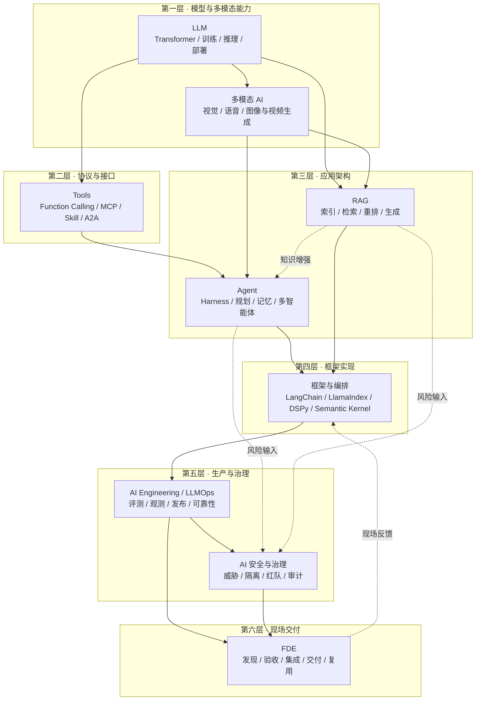

# 文档主题索引

这份知识图谱用于 AI 工程面试准备，按技术层次而非产品清单组织。九个主题覆盖模型原理、多模态能力、协议接口、应用架构、框架实现、生产工程、安全治理与现场交付；复习时既要能解释机制，也要能说明方案的限制。

目录采用三级结构：**主题 → 子模块 → 章节**。主题 README 负责展示模块关系，子模块 README 负责维护具体章节顺序，章节之间通过相对链接形成跨主题知识图谱。

## 总体分层

图中的层次用于组织知识，不代表项目必须采用全部组件。评测、安全和客户验收贯穿设计与交付；简单任务可以直接使用模型 API，不必先搭建 Agent 或引入编排框架。

## 主题目录

| 层次 | 主题 | 内容范围 | 章数 | 入口 |
|---|---|---|---|---|
| 底层原理 | LLM | Transformer、训练与对齐、解码、量化、MoE、部署与评测选型 | 23 | [进入 LLM](llm/README.md) |
| 模型能力 | 多模态 AI | 融合架构、VLM、Document AI、语音、图像与视频生成、评测与服务 | 10 | [进入多模态 AI](multimodal/README.md) |
| 协议接口 | Tools | Function Calling、工具学习、MCP、Skill、A2A、传输协议、安全与 LLM 网关 | 15 | [进入 Tools](tools/README.md) |
| 应用架构 | Agent | 架构、Runtime/Harness、工具、记忆、规划、反思、多 Agent、评估与安全 | 23 | [进入 Agent](agent/README.md) |
| 应用架构 | RAG | 文档处理、Embedding、向量库、检索、重排、多模态、生成、评估、更新与安全 | 21 | [进入 RAG](rag/README.md) |
| 框架实现 | 框架与编排 | LangChain、LangGraph、LlamaIndex、DSPy、Semantic Kernel、轻量 Agent 框架与迁移 | 23 | [进入框架与编排](frameworks/README.md) |
| 生产工程 | AI Engineering | LLMOps、网关与回退、评测、可观测性、CI/CD、SLO、成本与数据飞轮 | 13 | [进入 AI Engineering](engineering/README.md) |
| 安全治理 | AI 安全与治理 | 威胁建模、Prompt 攻击、供应链、隐私、执行隔离、红队、治理与审计 | 10 | [进入 AI 安全与治理](safety/README.md) |
| 现场交付 | FDE | 岗位边界、需求发现、Eval 验收、方案选型、系统集成、生产交付与产品化复用 | 1 | [进入 FDE](fde/README.md) |

## 主题之间的关系

同一个概念在不同层次会被反复提到，但视角不同。仓库通过「详解归属地」避免重复维护：

| 概念 | 详解归属 | 引用方 | 视角差异 |
|---|---|---|---|
| CoT 思维链 | LLM | Agent 规划章、RAG 生成章 | LLM 讲机制，Agent 讲如何转化为规划能力 |
| 幻觉 | LLM | RAG 生成章、Agent 安全章 | LLM 讲根因，RAG 讲如何通过知识约束生成 |
| KV Cache / Prompt Caching | LLM | Agent 上下文、AI Engineering | LLM 讲缓存机制，应用与工程层讲使用策略 |
| VLM / 语音 / 生成模型 | 多模态 AI | Agent Computer Use、RAG 多模态章 | 多模态讲模型能力，应用层讲如何进入任务链路 |
| Function Calling / MCP | Tools | Agent Harness、框架与编排 | Tools 讲调用接口与协议，Agent 讲运行时，框架讲具体封装 |
| Runtime / Harness | Agent | 框架与编排、AI Engineering | Agent 讲通用运行时，框架讲实现，工程层讲生产运营 |
| 记忆 | Agent | 框架与编排的 LangChain 模块 | Agent 讲分层与取舍，框架主题讲具体实现 |
| 向量检索 | RAG | 框架与编排 | RAG 讲索引与召回原理，框架主题讲组件封装 |
| 可观测性与发布 | AI Engineering | 各应用主题 | 工程层讲跨应用生产闭环，应用主题定义领域信号 |
| 跨层安全治理 | AI 安全与治理 | LLM、Tools、Agent、RAG | 各层讲局部控制，治理主题统一威胁模型、红队和审计 |
| 客户现场交付 | FDE | 全部技术主题 | 技术主题讲能力，FDE 讲如何组合能力并交付可衡量结果 |

## 阅读建议

- **零基础入门**：LLM 第 1–5 章 → Tools 第 1、4 章 → Agent 第 1–2 章 → RAG 第 1 章；
- **Agent / Harness 工程**：Agent 全部 → Tools 全部 → 框架与编排 → AI Engineering；
- **RAG / 知识系统**：RAG 全部 → LLM 第 5、18、21、23 章 → 框架与编排第 14–15 章；
- **多模态应用**：多模态 AI → Agent 第 16–23 章或 RAG 第 21 章 → AI Engineering；
- **生产平台与 SRE**：AI Engineering → LLM 推理部署 → Tools 网关 → AI 安全与治理；
- **安全与治理**：AI 安全与治理 → Agent、Tools、RAG 各自的安全章节。
- **客户交付与解决方案**：FDE → AI Engineering → 按项目需要回查 Agent、RAG、Harness 与安全治理。

## 按面试题型串联知识

基础题先把概念解释准确，系统设计题则需要把数据流、控制流和故障处理接起来。下面几条路径可以用来练习跨主题追问，不代表所有公司都会按同一套题目面试。

| 练习题 | 建议串联的章节 | 需要说清楚的取舍 |
|---|---|---|
| 如何给企业内部知识助手选方案？ | [RAG、微调与长上下文](rag/01-foundations/02-rag-finetune-longcontext.md) → [RAG 评测](rag/05-generation-evaluation/18-rag-evaluation.md) → [离线 Eval](engineering/04-evaluation-observability/07-offline-eval-eval-driven-development.md) | 知识缺失和行为问题如何区分，如何用业务查询集证明改动有效 |
| 如何让 Agent 在工具超时后继续执行？ | [Harness 边界](agent/02-runtime-harness/16-harness-definition-and-boundaries.md) → [Checkpoint 与恢复](agent/02-runtime-harness/21-checkpoint-persistence-recovery.md) → [重试与幂等](engineering/02-request-reliability/04-retry-timeout-idempotency-circuit-breaker.md) | 恢复计算状态与避免重复业务写入不是同一个问题 |
| MCP 接入后，权限由谁负责？ | [MCP 与 Function Calling](tools/02-mcp/06-mcp-vs-function-calling.md) → [Tool Protocol 安全](tools/02-mcp/15-tool-protocol-security.md) → [最小权限与身份](safety/04-agent-execution-isolation/07-agent-tool-mcp-a2a-least-privilege-identity.md) | 协议能力、模型调用意图与服务端授权的边界 |
| 模型效果不错，为什么线上还是不能用？ | [模型评测](llm/05-evaluation-selection/21-evaluation-metrics.md) → [输出契约](engineering/03-output-safety/05-structured-output-contracts.md) → [SLO 与故障响应](engineering/06-performance-operations/12-slo-capacity-incident-response.md) | 榜单成绩、结构合法、业务正确和服务可靠分别如何衡量 |
| 如何把客户的模糊需求变成可交付项目？ | [FDE](fde/01-foundations/01-forward-deployed-engineering.md) → [版本管理](engineering/05-release-pipeline/09-prompt-model-data-versioning.md) → [数据飞轮](engineering/06-performance-operations/13-feedback-loop-data-flywheel.md) | 验收口径、客户系统集成、灰度回滚与可复用边界 |

项目题应以自己真正做过的工作为准：当时有哪些约束，为什么没有选另一种方案，结果怎么测，失败后怎么定位。没有做过的部分可以作为方案推演讨论，不把假设写成经历。

## 常见问题

### 这份路线图适合什么读者？

它主要面向准备 AI 应用开发、Agent/RAG、模型工程和 FDE 等岗位面试的读者。初学者可以按推荐路径理解原理；有项目经验的读者可以从实际问题出发，沿交叉链接补齐评测、可靠性和权限等容易漏掉的环节。

### 应该从 LLM、Agent 还是 RAG 开始？

想理解模型能力边界，应先读 LLM；想构建能调用工具并持续执行任务的系统，从 Agent 和 Tools 开始；想让模型使用私有或持续更新的知识，从 RAG 开始。设计方案时就应结合 AI Engineering 和安全治理确定评测、权限与可靠性要求。

### 内容多久更新一次？

项目不采用固定发布周期。协议、框架或模型能力出现重要变化时更新对应章节，页面日期来自当前文件路径的 Git 历史，不一定对应内容最初公开的日期。高时效性结论仍应结合正文标注的版本与官方链接核验。
