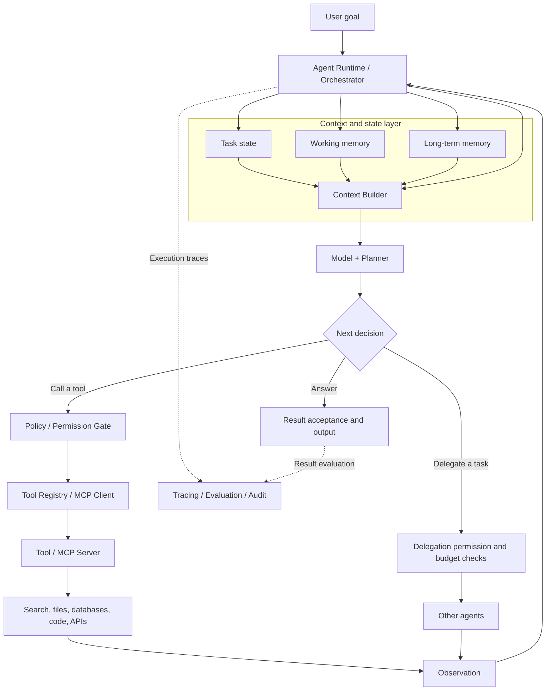
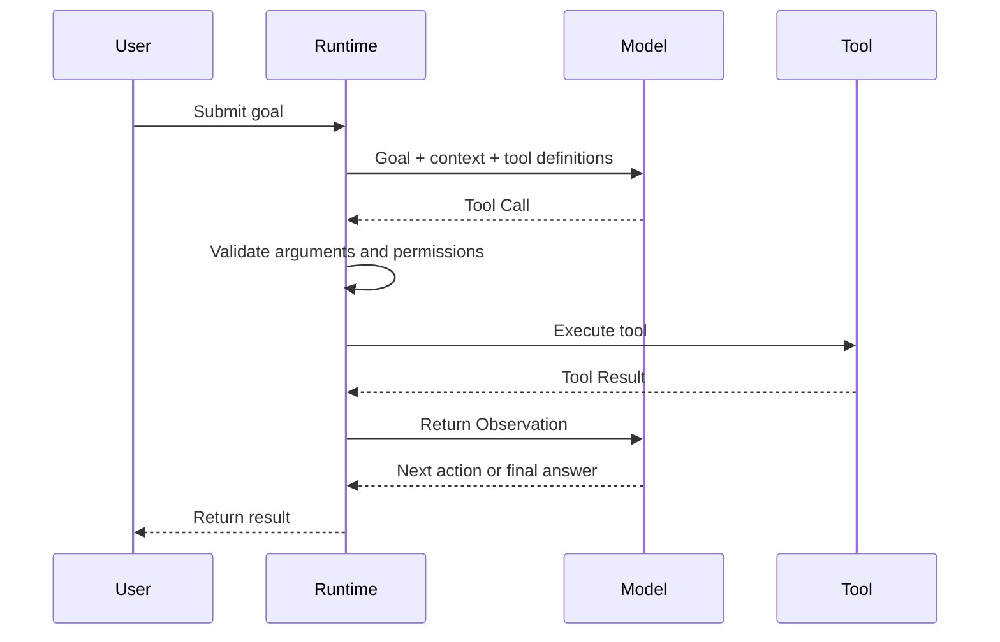
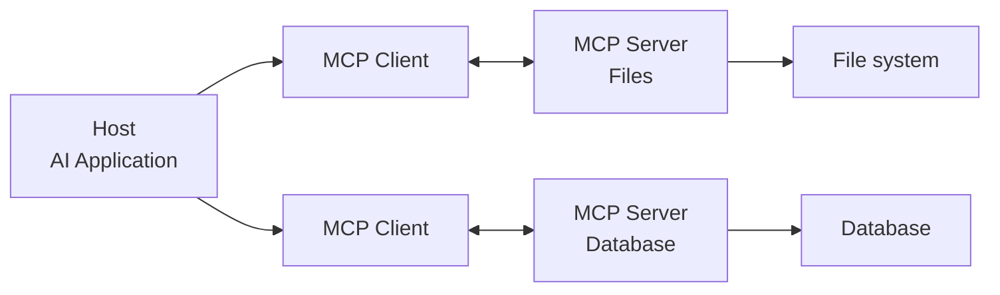
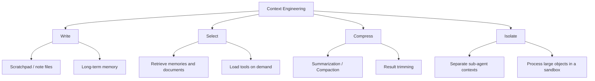
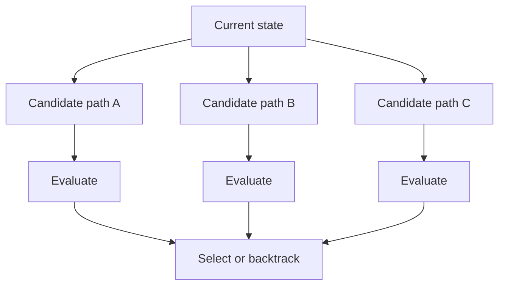
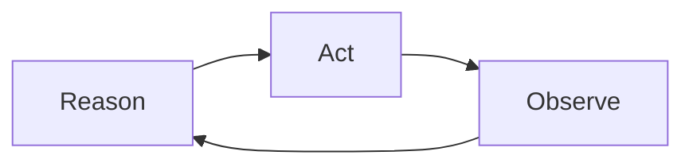
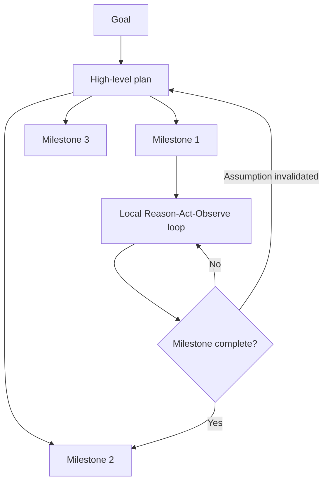

# Chapter 2: Modern Agent System Architecture

## 2.1 From the Four-Component Model to Production Architecture

If a model can already select tools, why design a separate architecture? Because a prompt alone cannot decide who recovers from a failed call, who checks permissions before a write, or what counts as completion. Introductory material often describes an agent as four components:

> **Model + Tools + Memory + Planning**

This is a useful starting point, but it does not fully describe a production agent that can be operated, controlled, and observed. A more complete modern architecture is:

> **Model + Tools + State/Memory + Planning/Control + Runtime/Guardrails**

The responsibilities are:

| Component | Core responsibility |
|---|---|
| Model | Interpret goals, reason, generate plans, and select actions |
| Tools | Query information or change the external environment |
| State/Memory | Preserve current task state and reusable historical information |
| Planning/Control | Decompose tasks, schedule steps, replan, and determine when to stop |
| Runtime/Guardrails | Execute tools, manage permissions, limit resources, and record execution |

One distinction is essential: the LLM does not personally access a database or execute code. It proposes a tool call; the agent runtime performs the actual execution.

## 2.2 How the Components Work Together



A typical execution proceeds as follows:

1. The runtime receives the user's goal and initializes task state.
2. The context builder assembles context from current state, working memory, and long-term memory.
3. The model decides whether to answer, call a tool, delegate a task, or replan.
4. A tool call first passes argument validation, permission checks, and risk controls.
5. The runtime executes the tool and returns the result to the model as an observation.
6. The system updates task state, applies its write policies to decide what enters memory, and starts the next decision cycle.
7. It finishes after acceptance checks pass. If the budget is exhausted, it reports that the task is incomplete. If approval is needed, it persists state and pauses; waiting for approval is not successful completion.

## 2.3 Model: Reasoning and Policy Generation

Calling the LLM an agent's “brain” is intuitive, but not entirely accurate. Modern models may process text, images, audio, and other inputs, so they are more than language processors.

Within an agent, the model primarily:

- Interprets user intent and constraints;
- Analyzes current task state;
- Generates or revises plans;
- Selects tools and generates arguments;
- Determines the next step from tool feedback;
- Decides whether it can produce the final result.

The model can generate tool call requests, but by default it cannot directly produce external side effects. Generating JSON does not itself transfer money, send an email, or delete a file.

> **The model proposes actions; the runtime validates and executes them.**

This separation allows the system to add permission checks, argument validation, human confirmation, and audit records before execution.

## 2.4 Tools: Connecting the Model to the Outside World

Tools can wrap search, database queries, code execution, file operations, and business APIs. In principle, any external capability that can be expressed through a stable interface can be exposed as a tool.

A production tool is more than a function, however. It should also provide:

- A unique, clear name;
- A precise description of its purpose;
- Structured input and output schemas;
- Authentication and authorization scope;
- Argument validation;
- Timeout, retry, and cancellation mechanisms;
- An explanation of idempotency and side effects;
- Errors the model can interpret;
- Logs and audit records.

### 2.4.1 Defining a Tool

The following is a function tool definition for OpenAI's **Chat Completions API**, placed in the request's `tools` array. It uses a nested `function` object. The Responses API places the corresponding fields at the top level of the tool object, so the two formats are not interchangeable:

```json
{
  "type": "function",
  "function": {
    "name": "search_web",
    "description": "搜索公开网页并返回与查询相关的结果",
    "strict": true,
    "parameters": {
      "type": "object",
      "properties": {
        "query": {
          "type": "string",
          "description": "需要搜索的关键词"
        }
      },
      "required": ["query"],
      "additionalProperties": false
    }
  }
}
```

The Chinese descriptions mean “Search public web pages and return results relevant to the query” for the tool and “Keywords to search for” for `query`.

`strict: true` constrains generated arguments to conform to the supported schema. It does not guarantee factual accuracy, business authorization, or successful execution. The runtime must still validate and authorize the call. When the model decides to use a tool, it returns a call proposal. The following illustrates the core meaning, not the raw response from a particular API:

```json
{
  "tool_call": {
    "name": "search_web",
    "arguments": {
      "query": "2026 年 Agent 技术最新进展"
    }
  }
}
```

The sample query is Chinese for “the latest advances in agent technology in 2026.”

The application then follows this flow:



### 2.4.2 Safety Boundaries for Tool Calls

Not every tool call should execute automatically. Production systems typically apply different controls by risk level:

| Risk level | Examples | Recommended policy |
|---|---|---|
| Read-only | Search, reading documents | Verify data access and egress permissions first; automatic execution may be appropriate for authorized access to low-sensitivity data |
| Reversible writes | Creating drafts, modifying temporary files | Show changes before execution or retain a rollback capability |
| High-risk writes | Sending email, publishing content, modifying production data | Require explicit confirmation |
| Irreversible or sensitive operations | Transferring money, deleting data, changing permissions | Require strong authentication, least privilege, and human approval |

## 2.5 MCP: Standardizing Tool and Context Connections

> This section focuses on architectural integration boundaries. For the protocol itself, see [Tools: MCP](../../tools/02-mcp/04-what-is-mcp.md). For agent collaboration across systems, see [Tools: A2A](../../tools/04-agent-communication/11-a2a-protocol.md).

MCP (Model Context Protocol) provides a standard protocol for connecting AI applications to tools and data sources.

Anthropic introduced MCP in 2024. In December 2025, it became a founding project of the Agentic AI Foundation under the Linux Foundation. The foundation provides vendor-neutral organizational governance, while MCP community maintainers continue to manage the protocol's technical direction.

MCP has three main roles:

- **Host**: the user-facing AI application, responsible for the model, permissions, and overall interaction;
- **Client**: created and managed by the host to maintain a connection to a particular MCP server;
- **Server**: exposes capabilities such as Tools, Resources, and Prompts to the client.



“MCP is USB-C for tools” is a useful analogy, with two qualifications:

1. MCP servers typically still need to be installed, configured, or connected by the host. MCP does not automatically discover every tool on the internet.
2. A standardized interface does not grant permissions. The system remains responsible for authentication, authorization, and user confirmation.

MCP reduces protocol adaptation effort; it does not eliminate security governance or business integration work.

## 2.6 State and Memory Are Not the Same

### 2.6.1 Task State

State describes where execution currently stands, including:

- The original goal;
- The current plan;
- Completed and pending steps;
- Tool calls and their results;
- Errors, retry counts, and budgets;
- Pending human approvals.

State usually needs structured storage, with support for checkpoints, recovery, and concurrency control. An agent that must recover across processes should be able to resume from a checkpoint, but restoring state does not ensure that an external action happens exactly once. Suppose a refund succeeds, but the process exits before saving the result: blindly repeating the action after recovery could issue a second refund. The system must also query business state or use an idempotency key supported by the server. See the failure handling discussion in [Chapter 6](../02-reasoning-planning/06-task-decomposition.md), §6.17.

### 2.6.2 Working Memory

Working memory serves the current task. It holds information the model needs for its current decision, such as recent messages, key observations, and intermediate conclusions.

Working memory is constrained by the context window, but it does not necessarily disappear as soon as the task ends. The system may summarize it, archive it, or convert it into long-term memory.

### 2.6.3 Long-Term Memory

Long-term memory preserves information that can be reused across tasks. It is not synonymous with a vector database. Common storage options include:

- Relational databases: user profiles, permissions, and structured facts;
- Key-value or document databases: preferences, configuration, and task snapshots;
- Vector databases: semantic retrieval of unstructured content;
- Event stores: complete operation histories and audit trails;
- Knowledge graphs: entity relationships and explainable relationship queries.

Vector retrieval is useful for finding semantically similar content. Exact facts, time constraints, and permission restrictions usually also require metadata filtering or structured queries.

## 2.7 Cognitive Categories of Long-Term Memory

Categories borrowed from cognitive science can help explain agent memory. They are a conceptual model, not a requirement to build three separate databases.

### 2.7.1 Semantic Memory

Semantic memory stores reusable facts and concepts, such as:

- The user works in finance;
- An API allows 60 calls per minute;
- The project uses PostgreSQL as its primary database.

### 2.7.2 Episodic Memory

Episodic memory stores specific experiences with their time and context, such as:

- The previous refund task revealed that the order was outside its refund window;
- A deployment failed because database migrations ran in the wrong order.

### 2.7.3 Procedural Memory

Procedural memory stores knowledge of how to perform tasks, such as:

- Check order status and the payment channel before processing a refund;
- Run tests, build the project, and review changes in that order before a release.

In engineering practice, procedural memory may take the form of workflows, skills, policy templates, or validated runbooks, rather than ordinary text stored as vectors.

## 2.8 Context Engineering: Managing Limited Context

### 2.8.1 Context Is a Finite Budget, Not a Bucket to Fill

Complex tasks produce large volumes of tool results. Continually appending everything to the prompt can:

- Exceed the context window;
- Increase inference cost and latency;
- Bury critical information in noise;
- Cause the model to lose track of information in the middle or attend to the wrong content.

A common misconception is that ever-larger context windows will automatically solve this problem.

They do not. Chroma's Context Rot experiments observed that performance in the tested models could decline unevenly as input length increased across different tasks, sometimes before reaching the window limit. This is not a universal law of monotonic decline for every model and task. A simple lexical needle-in-a-haystack test does not stand in for multi-hop retrieval, semantic judgment, or long-horizon execution. Effective context length still needs to be tested on the actual business task.

A better mental model is:

> **Retain the goals, constraints, and evidence needed for the current decision. Choose context based on task performance, rather than filling the window.**

### 2.8.2 Four Ways Context Can Fail

Treating “too much context” as one generic problem does not help locate a failure. Engineering diagnosis should distinguish four failure modes, each with different causes and remedies:

| Failure mode | Symptoms | Cause | Remedy |
|---|---|---|---|
| Context Poisoning | A hallucination or mistaken conclusion enters context and gains apparent credibility through repeated citation | Incorrect content is retained without validation | Remove the mistaken conclusion from active context while retaining its source, correction record, and audit history |
| Context Distraction | As context grows, the model relies excessively on past trajectories instead of adapting its decisions | Historical information outweighs the current task's needs | Compress history and emphasize the current goal |
| Context Confusion | Irrelevant tools or documents interfere with selection | Context includes material the current task does not need | Load tools and documents on demand |
| Context Clash | Context contains contradictory information | Clarifications across turns or information from multiple sources have not been reconciled | Detect conflicts and resolve them explicitly; retain conclusions rather than the entire process |

Larger tool sets and more similar descriptions can make tool selection and argument generation harder, but there is no universal threshold at which “a few dozen tools cause failure.” RAG-MCP's experiments support retrieving candidate tools first for the models and tool sets it tested. A business deployment must also measure candidate recall, final call accuracy, and the additional retrieval latency. Small, stable tool sets can be provided in full.

### 2.8.3 Four Basic Operations: Write / Select / Compress / Isolate

LangChain's context engineering article organizes common techniques into four operations:



| Operation | Meaning | Typical techniques |
|---|---|---|
| Write | Store information **outside** the context window | Write to `NOTES.md`, task lists, or long-term memory stores |
| Select | **Retrieve** information into context when needed | Memory retrieval, document retrieval, tool retrieval |
| Compress | Retain only necessary tokens | Summarization, compaction, result trimming |
| Isolate | **Separate** contexts | Sub-agents, sandbox execution, partitioning across environments |

Specific strategies map to this framework:

| Strategy | Category | Approach | Main risk |
|---|---|---|---|
| Sliding window | Compress | Retain only the most recent turns | Losing critical early constraints |
| Summarization / compaction | Compress | Condense history into a summary | Omitting or distorting information |
| Selective retrieval | Select | Retrieve relevant content for the current task | Missing relevant information |
| Externalization | Write | Store large results in files or artifacts | Requiring reliable references and read mechanisms |
| Hierarchical summarization | Compress | Maintain summaries at task, phase, and step levels | Greater implementation complexity |
| Sub-agent isolation | Isolate | Give subtasks separate contexts and return only conclusions | The main agent loses intermediate detail |

### 2.8.4 Just-in-Time Retrieval: Keep References, Fetch Content When Needed

One approach already used successfully in production is to **keep only lightweight references in context**—file paths, queries, URLs, or IDs—and load the actual content dynamically through tools when needed.

This mirrors how people use a file system: you do not memorize an entire codebase. You remember its directory structure and open specific files as needed.

A **hybrid approach** is a useful starting point:

- **Preload** a small amount of stable, high-value content, such as project instruction files (`AGENTS.md` / `CLAUDE.md`) and core business rules;
- **Load just in time** content that is large or changes frequently, such as specific source files, search results, and database records.

JIT retrieval has its own cost: every load adds a tool call round and increases latency. **If every task will inevitably need a piece of content, preloading it may be cheaper.**

### 2.8.5 Compaction: Rebuild Context Near the Limit

When context approaches the window limit, compress the history into a summary and reinitialize the session with the summary plus a small recent working set. A typical working set includes a few recently accessed files, the current task list, and hypotheses that have not yet been verified.

Preserve key decisions, constraints, and evidence references before tightening the wording. If the original records remain retrievable, omitted details can be fetched again. If the originals have also been deleted, those details may be lost permanently. A summary cannot replace persistent state.

Compaction has two important risks:

1. **A summary can turn an uncertain conclusion into an apparent fact.** A command might time out after producing only partial output, yet the summary could record it as a confirmed execution result, causing the next session to skip verification. **Preserve explicit status markers**—verified, unverified, or failed—and evidence references in the summary, rather than recording conclusions alone.
2. **Repeated compaction accumulates information loss.** Over a long project, critical early decisions may disappear after multiple rounds of compaction, creating historical gaps that are difficult to reconstruct. **Also write important decisions to external files**—the Write operation—instead of relying solely on a chain of in-context summaries.

### 2.8.6 Structured Notes: Keep State Outside the Context Window

An agent can maintain external notes on progress, confirmed facts, pending work, and failed attempts to carry information across compaction boundaries. This requires persistent storage, recoverable paths, and access permissions for later sessions. Files in a temporary sandbox disappear when that environment is destroyed.

Rereading notes can restore an understanding of task progress. Pending calls, approvals, idempotency keys, and budgets should still be preserved in structured checkpoints, not inferred from natural-language notes.

### 2.8.7 Sub-Agent Isolation: Separation of Concerns, Not Just Parallelism

Delegate exploratory subtasks to sub-agents working in independent contexts, then have them return conclusions, evidence references, and unresolved issues. The required response length depends on the task; do not sacrifice critical evidence to meet a fixed token count.

Sub-agents can provide context isolation, parallelism, or both. Their relative value depends on the task. Isolating exploration may help even in serial execution; conversely, for tightly dependent tasks, handoff costs can outweigh the benefits of isolation.

The main agent's context then contains the goal and subtask conclusions, rather than the goal and every intermediate step. This helps it stay focused during long tasks.

### 2.8.8 Progressive Disclosure of Tools and Knowledge

For material such as tools and skills that may be useful but is unnecessary for most tasks, use **tiered loading**:

1. **Level one**: load only names and one-sentence descriptions to judge relevance;
2. **Level two**: load full instructions and usage details after determining relevance;
3. **Level three**: read associated reference files or scripts when further detail is needed.

This keeps most material outside the context window, although indexing, retrieval, and storage still cost resources. The Agent Skills open format follows this approach. Exactly when a skill is activated and which tools it may use remain host-specific.

For large tool sets, a `search_tools` tool can retrieve candidates first. Alternatively, tools can be exposed as code APIs, with results filtered and aggregated in a controlled execution environment. The example in Anthropic's Code execution with MCP article reduces token usage from 150,000 to 2,000. Those are context usage figures for a specific example, not average savings across all tasks, and they do not imply a proportional reduction in end-to-end cost.

Progressive disclosure introduces the risk of missing relevant candidates and the overhead of additional routing. Do not measure only the tokens saved. Compare full injection, tool retrieval, and code execution on success rate, latency, and call cost using the same task set, model, and budget. Existing navigation capabilities may reduce the benefit of an additional routing layer.

### 2.8.9 Summary

These strategies can be combined, but they need not all be enabled. A short task may require only recent messages and structured state. Add retrieval, summarization, or isolation only when they provide measurable benefits.

> Context engineering is not about keeping as much as possible. It is about providing the smallest sufficient context for the current decision at the right time.

## 2.9 Writing, Retrieving, and Decaying Memory

### 2.9.1 What Is Worth Retaining?

Writing everything to long-term memory allows noise, duplication, and errors to accumulate. Before writing, consider:

- Whether the information is relevant to future tasks;
- Whether it is stable and has a trustworthy source;
- Whether it contains sensitive or regulated data;
- Whether a duplicate record already exists;
- Whether user consent is required;
- Whether it needs an expiration date.

Importance, novelty, trustworthiness, and reusability can jointly inform the decision to persist information.

### 2.9.2 Basic Time Decay

A simple time-decay function is:

$$
D(\Delta t)=e^{-\lambda \Delta t}
$$

Where:

- $\Delta t$ is the elapsed time since the memory;
- $\lambda$ controls the decay rate;
- $D(\Delta t)$ is the time weight.

The simplest retrieval score can be written as:

$$
Score(m,q)=S(m,q)\cdot D(\Delta t)
$$

Here, $S(m,q)$ is a nonnegative relevance score between memory $m$ and query $q$. If cosine similarity is used directly and can be negative, multiplying by the decay factor can instead push an old negative score toward zero. Define the normalization or reranking semantics first.

### 2.9.3 More Robust Production Ranking

Similarity multiplied by time decay can incorrectly downrank important older facts. A more common approach combines several signals:

$$
Score(m,q)=
\alpha S_{sem}
+\beta S_{time}
+\gamma S_{importance}
+\delta S_{task}
+\epsilon S_{trust}
$$

These signals represent semantic relevance, recency, importance, task fit, and trustworthiness. This is only a ranking heuristic; scales and weights require calibration. Tenant boundaries, permissions, revocation, and expiration must be enforced as hard filters first, not traded away for high relevance.

Different applications need different policies:

- Customer support conversations may emphasize recency;
- Long-term user preferences may decay slowly;
- Legal, audit, and compliance records should follow the applicable retention periods; a retrieval freshness score must not decide whether to destroy them;
- Security policies must use the currently valid version, rather than merely assigning it a higher trust weight to compete against obsolete versions.

Memory updates, conflicts, deduplication, deletion, privacy, and data retention policies also need explicit handling.

## 2.10 Planning: From Reasoning to Executable Control

Planning is responsible for:

- Decomposing goals into subtasks;
- Identifying dependencies between steps;
- Choosing execution order and tools;
- Tracking completion;
- Replanning from feedback;
- Deciding when to stop or request human help.

Planning is usually not a wholly independent module. It is implemented jointly by the model, state machines, workflow engines, and runtime.

### 2.10.1 CoT: Chain of Thought

CoT (Chain of Thought) helps models solve complex problems through intermediate reasoning steps. Historically, prompts such as “Let's think step by step” were commonly used to elicit stepwise reasoning.

Modern agent systems need to distinguish:

- **Internal reasoning**: the model's internal computation used to reach a decision;
- **User-facing rationale**: concise reasons, evidence, and execution records provided to the user.

A system should not depend on the model exposing its complete hidden reasoning to users. A more reliable approach is to request structured plans, evidence citations, tool traces, and verifiable conclusions.

### 2.10.2 ToT: Searching Multiple Candidate Paths

ToT (Tree of Thoughts) expands, evaluates, and backtracks among multiple candidate reasoning paths:



It suits tasks with large search spaces and multiple possible solutions, but typically requires more calls, latency, and cost than linear reasoning. Production systems more often use budget-constrained candidate generation, scoring, and fallback than unbounded expansion of a complete thought tree.

## 2.11 Two Basic Execution Patterns

### 2.11.1 Plan-and-Execute

Plan-and-Execute generates an overall plan first, then executes it step by step:


Advantages:

- A clear global structure;
- Easier estimation of costs and dependencies;
- Human review before execution.

Disadvantages:

- The initial plan may rely on incorrect assumptions;
- Environmental changes may require partial or complete replanning.

### 2.11.2 ReAct

ReAct interleaves reasoning, action, and observation:



Advantages:

- Dynamic adaptation to the latest feedback;
- A good fit for tasks with incomplete information or frequently changing environments.

Disadvantages:

- A tendency to focus only on the immediate next step;
- Possible loops, drift, or repeated tool calls;
- Less predictable costs and completion times.

Modern implementations do not necessarily expose the complete ReAct “Thought” to users, but they retain structured actions, observations, and execution traces.

### 2.11.3 Hierarchical Hybrid Planning

When a task has both global dependencies and local unknowns, the two patterns can be combined:

1. Generate high-level milestones and constraints;
2. Execute dynamically within each milestone;
3. Replan after failures or changes to critical assumptions;
4. Continually check the goal, budget, and stopping conditions.



This preserves global direction and local adaptability, but adds plan maintenance overhead. Short tasks may not benefit. Compare it against plain ReAct or deterministic workflows under the same budget.

## 2.12 Runtime and Guardrails

The runtime is the execution layer that turns model capabilities into a reliable system. Its responsibilities typically include:

- Scheduling model and tool calls;
- Persisting state and checkpoints;
- Timeouts, cancellation, and retries;
- Concurrency and queue management;
- Token, time, and monetary budgets;
- Human approval;
- Error propagation and recovery;
- Traces, logs, and audits.

Guardrails constrain what the agent can do, through measures such as:

- Input and output validation;
- Tool allowlists;
- Least privilege;
- Sensitive data protection;
- Confirmation of high-risk operations;
- Prompt injection defenses;
- Sandboxing and network access restrictions;
- Maximum step counts and loop detection.

Prompts alone are unlikely to meet production requirements without execution-layer controls for permissions, budgets, and recovery. Those controls need not live in a separate component named “Guardrails.” In particular, model-based screening can miss problems and cannot replace server-side authorization or sandbox isolation.

## 2.13 Observability and Evaluation

Agent outcomes are nondeterministic, so checking whether an answer was eventually produced is usually insufficient. The system should also record and evaluate:

- Whether the plan was sensible;
- Whether the right tools were selected;
- Whether arguments were valid;
- Whether unproductive loops occurred;
- Whether evidence supports the result;
- Success rate, latency, and cost;
- Whether permissions or safety policies were violated.

Common evaluation levels include:

1. **Outcome evaluation**: was the task actually completed?
2. **Trajectory evaluation**: was the execution path correct and efficient?
3. **Tool evaluation**: were tool selection and arguments appropriate?
4. **Safety evaluation**: did execution exceed authorization or produce high-risk side effects?
5. **Production monitoring**: how do failure rates, latency, and costs change after deployment?

## 2.14 Where Major Frameworks Focus

Frameworks cover several agent components, but emphasize different areas:

| Framework | Primary focus |
|---|---|
| LangChain | Integration of models, tools, retrieval, and agent components |
| LangGraph | Stateful workflows, graph execution, checkpoints, and human-in-the-loop interaction |
| LlamaIndex | Data connections, indexing, retrieval, context engineering, and agents |
| Microsoft Agent Framework | Agents, Harness Agent, workflows, state, context providers, and integrations; verify the release stage of each language implementation and feature separately |
| AutoGen / Semantic Kernel | Official migration paths to Microsoft Agent Framework are available; check maintenance policies, API compatibility, and migration costs for each project rather than choosing solely by framework age |

A framework is an implementation choice. First define state, control flow, permissions, and evaluation, then select an appropriate framework. Do not let a framework substitute for system architecture.

## 2.15 Chapter Summary

A modern agent typically follows this chain:

> **Receive goal → Read state and memory → Plan the next step → Request a tool or agent → Execute safely through the runtime → Receive observations → Update state → Evaluate and continue**

The four-component model explains an agent's basic capabilities. Runtime controls, guardrails, and observability determine whether those capabilities can operate safely and reliably in real environments.

## References

- [OpenAI: Function calling—Chat Completions and Responses tool definitions, strict mode](https://developers.openai.com/api/docs/guides/function-calling)
- [MCP Governance and Stewardship](https://modelcontextprotocol.io/community/governance)
- [MCP joins the Agentic AI Foundation](https://blog.modelcontextprotocol.io/posts/2025-12-09-mcp-joins-agentic-ai-foundation/)
- [Microsoft Agent Framework Overview](https://learn.microsoft.com/en-us/agent-framework/overview/)
- [AutoGen Maintenance Mode](https://github.com/microsoft/autogen)
- [Anthropic: Effective context engineering for AI agents](https://www.anthropic.com/engineering/effective-context-engineering-for-ai-agents)
- [Chroma Research: Context Rot — How Increasing Input Tokens Impacts LLM Performance](https://research.trychroma.com/context-rot)
- [LangChain: Context Engineering for Agents](https://blog.langchain.com/context-engineering-for-agents/)
- [Drew Breunig: How Contexts Fail and How to Fix Them](https://www.dbreunig.com/2025/06/22/how-contexts-fail-and-how-to-fix-them.html)
- [Anthropic: Equipping agents for the real world with Agent Skills](https://www.anthropic.com/engineering/equipping-agents-for-the-real-world-with-agent-skills)
- [Anthropic: Code execution with MCP](https://www.anthropic.com/engineering/code-execution-with-mcp)
- [Cloudflare: Code Mode — the better way to use MCP](https://blog.cloudflare.com/code-mode/)
- [RAG-MCP: Mitigating Prompt Bloat in LLM Tool Selection via Retrieval-Augmented Generation](https://arxiv.org/abs/2505.03275)
