# 第三章：Tools、Skills、Agents、Workflows 与 AGENTS.md

## 3.1 先建立整体认识

Tools、Skills、Agents、Workflows 和 AGENTS.md 经常同时出现在 Agent 产品中，但它们解决的是不同层次的问题：

> **Tool 是能力，Skill 是方法，Agent 是决策者，Workflow 是控制结构，AGENTS.md 是仓库级工作约定。**

MCP 则位于另一条维度：

> **MCP 不是 Tool 的替代品，而是 AI 应用连接 Tools、Resources 和 Prompts 的标准协议。**

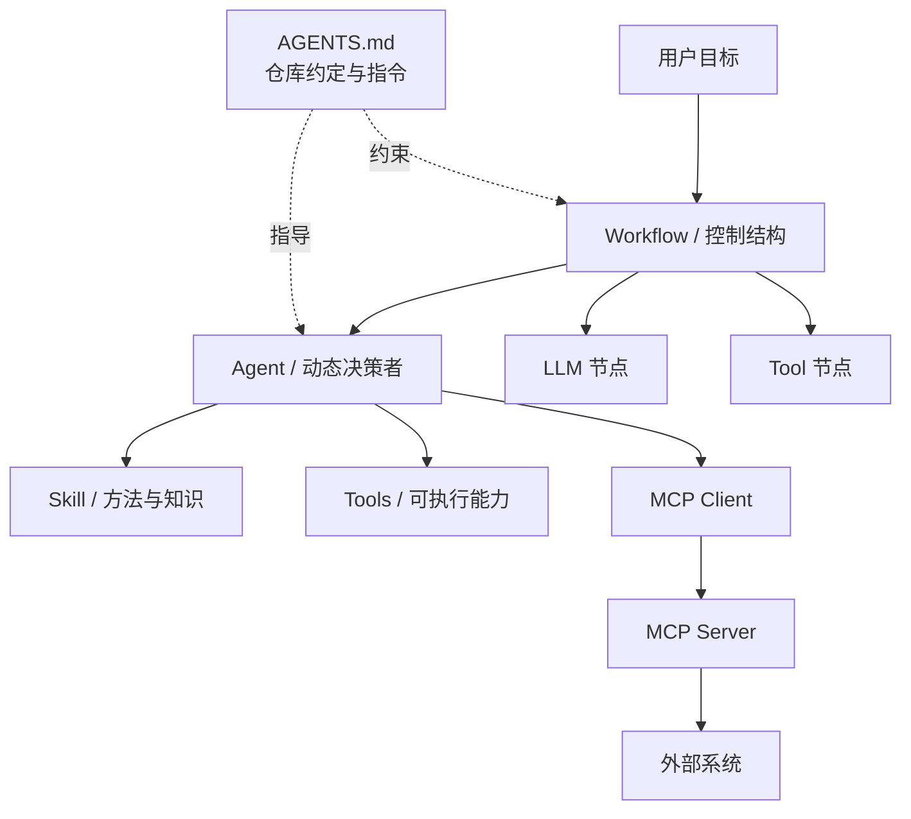

## 3.2 核心区别

| 概念 | 回答的问题 | 是否执行动作 | 是否自主决策 | 典型载体 |
|---|---|---:|---:|---|
| Tool | “我能调用什么能力？” | 是 | 否 | 函数、API、命令、MCP Tool |
| Skill | “这类任务应该怎样完成？” | 可通过 Tool 或脚本执行 | 有限，由 Agent 决定是否采用 | `SKILL.md`、脚本、参考资料 |
| Agent | “为了目标，下一步应该做什么？” | 通过 Tool 执行 | 是 | Agent Runtime + Model + State |
| Workflow | “允许按什么结构和路径执行？” | 通过节点执行 | 由代码、规则或受限模型节点共同决定 | DAG、状态机、工作流代码 |
| AGENTS.md | “在这个代码仓库里应遵守什么约定？” | 否 | 否 | 仓库中的 `AGENTS.md` 文件 |
| MCP | “AI 应用如何标准化连接外部能力？” | 传递调用 | 否 | Host、Client、Server 协议 |

这里最容易出现的误区是把它们看成同一层级。实际上，一个 Agent 可以读取 AGENTS.md，按 Skill 中的方法工作，通过 MCP 调用 Tool，同时运行在 Workflow 规定的控制结构中。

## 3.3 Tools：最小可执行能力

### 3.3.1 Tool 的职责

Tool 是供 Agent 或 Workflow 调用的可执行能力，例如：

- 搜索网页；
- 查询数据库；
- 执行代码；
- 读取或写入文件；
- 发送邮件；
- 调用支付、工单或内部业务 API。

Tool 本身不负责判断：

- 当前是否应该使用它；
- 应该先调用哪个 Tool；
- 当前结果是否足够；
- 整个任务何时结束。

这些决策由 Agent、Workflow 或上层业务代码负责。

### 3.3.2 Tool 不只是“普通函数加说明书”

将 Tool 理解为“附带 Schema 的函数”适合入门，但不够完整。Tool 的执行端可以是：

- 本地函数；
- 命令行程序；
- 远程 HTTP API；
- 数据库操作；
- 浏览器或桌面交互；
- MCP Server 暴露的远程能力。

一个生产级 Tool 通常包含：

1. 名称与功能描述；
2. 输入输出 Schema；
3. 执行器；
4. 认证与授权；
5. 超时和取消机制；
6. 重试与幂等策略；
7. 副作用和风险等级；
8. 错误与审计信息。

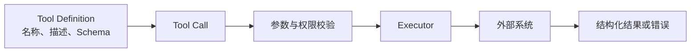

### 3.3.3 Tool Schema

普通函数的签名主要服务于编译器和程序员；Tool Schema 还需要帮助模型理解“何时使用”和“如何正确使用”。

```json
{
  "type": "function",
  "function": {
    "name": "search_web",
    "description": "搜索公开网页。需要实时信息或外部事实时使用。",
    "parameters": {
      "type": "object",
      "properties": {
        "query": {
          "type": "string",
          "description": "具体、完整的搜索查询"
        }
      },
      "required": ["query"],
      "additionalProperties": false
    }
  }
}
```

高质量 Tool 描述应明确：

- 适用场景；
- 不适用场景；
- 参数语义；
- 返回值结构；
- 失败方式；
- 是否产生外部副作用。

### 3.3.4 Tool Call 不等于 Tool Execution

模型返回的只是调用意图：

```json
{
  "tool_call": {
    "name": "search_web",
    "arguments": {
      "query": "2026 年 Agent 技术进展"
    }
  }
}
```

真正的调用过程是：

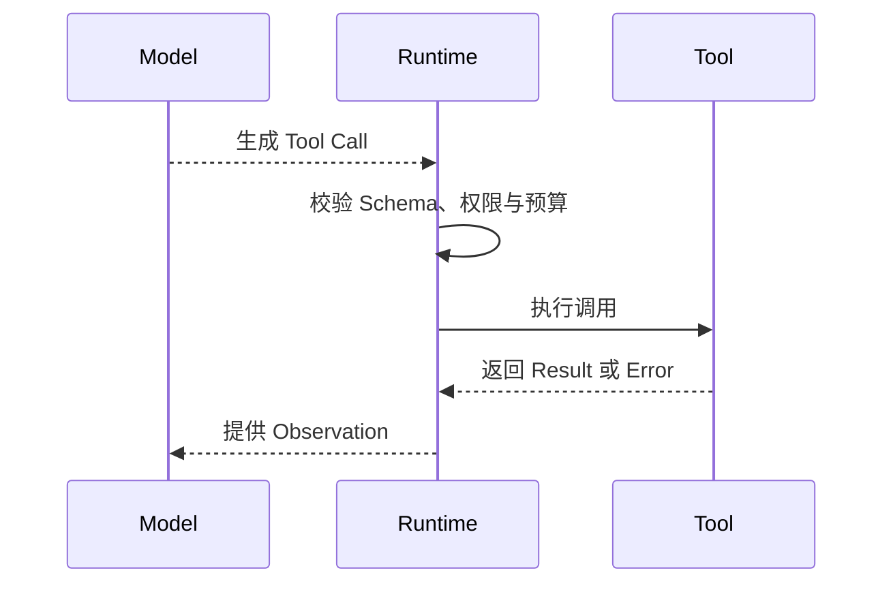

因此，不能因为模型生成了“发送邮件”的 JSON，就认为邮件已经发送成功。Runtime 必须执行工具，并用真实结果更新状态。

## 3.4 MCP：标准化连接，而不是替代 Tool

> 本章不重复协议规范；工具连接、传输与授权细节见[Tools：MCP](../../tools/02-mcp/04-what-is-mcp.md)，Agent 间互操作见[Tools：A2A](../../tools/04-agent-communication/11-a2a-protocol.md)。

MCP（Model Context Protocol）是连接 AI 应用与外部系统的开放标准。它可以暴露：

- **Tools**：可执行动作；
- **Resources**：可读取的数据和上下文；
- **Prompts**：可复用的提示模板。

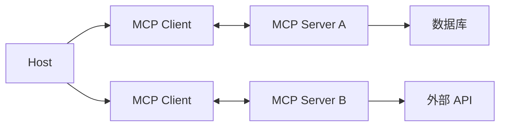

MCP 的价值是统一连接方式、能力描述和消息交换，从而减少重复适配。

但“支持 MCP 就能直接调用所有工具”并不准确：

- Host 仍需连接或配置相应 Server；
- Server 仍需完成认证和授权；
- 高风险操作仍可能要求用户确认；
- 客户端是否支持某项协议能力仍需协商；
- Tool 的质量、安全性和业务语义不会因采用 MCP 自动得到保证。

## 3.5 Skills：可复用的任务方法

### 3.5.1 Skill 解决什么问题

Tool 告诉 Agent“可以做什么”，Skill 告诉 Agent“这类事情应该怎样做”。

例如：

- `search_web` 是一个 Tool；
- “如何进行有来源交叉验证的行业研究”是一项 Skill；
- `read_file`、`run_tests`、`git_diff` 是 Tools；
- “如何完成一次可靠的代码审查”是一项 Skill。

一个 Skill 可以：

- 编排多个 Tools；
- 提供步骤、检查清单和领域规则；
- 附带可执行脚本；
- 附带模板、示例和参考资料；
- 规定输出格式和质量标准。

### 3.5.2 Agent Skills 标准结构

Agent Skills 是一种开放格式。一个 Skill 至少是一个包含 `SKILL.md` 的目录：

```text
code-review/
├── SKILL.md
├── scripts/
├── references/
└── assets/
```

`SKILL.md` 使用 YAML Frontmatter 声明元数据，正文使用 Markdown 编写操作说明：

```markdown
---
name: code-review
description: Review code changes for correctness and security. Use when inspecting a pull request or git diff.
---

# Code Review

1. Read the complete diff.
2. Trace affected call paths.
3. Run targeted validation.
4. Report only actionable findings.
```

标准中的关键字段包括：

| 字段 | 是否必需 | 作用 |
|---|---:|---|
| `name` | 是 | Skill 的稳定标识 |
| `description` | 是 | 描述能力以及何时触发 |
| `license` | 否 | 许可证信息 |
| `compatibility` | 否 | 环境和依赖要求 |
| `metadata` | 否 | 扩展元数据 |
| `allowed-tools` | 否 | 可预授权的工具，仍属于实验能力 |

### 3.5.3 渐进式披露

Skill 的重要设计原则是 Progressive Disclosure：

1. 启动时只加载名称和描述；
2. Agent 判断任务匹配后，再加载完整 `SKILL.md`；
3. 脚本、参考资料和资源只在需要时读取。

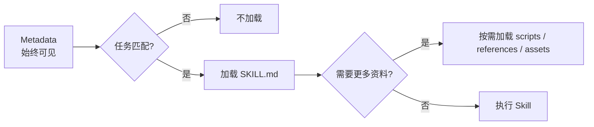

这可以避免把所有领域知识一次性塞入上下文。

### 3.5.4 Skill 与 Tool 的区别

| Tool | Skill |
|---|---|
| 原子能力 | 复合方法 |
| 强调输入、执行和输出 | 强调步骤、经验和质量标准 |
| 通常无任务策略 | 包含任务策略 |
| 由 Runtime 调用 | 由 Agent 按需加载和遵循 |
| 例：执行测试 | 例：如何定位并修复测试失败 |

Skill 本身不一定拥有独立决策权。它更像一个可复用的“操作手册 + 资源包”，最终仍由 Agent 决定何时加载，并由 Runtime 执行其中需要的 Tools 或脚本。

## 3.6 AGENTS.md：写给编码 Agent 的仓库说明

用户提到的 `agent.md`，当前开放格式使用的是全大写、复数形式：

> **`AGENTS.md`**

它可以理解为“写给编码 Agent 的 README”，用于告诉 Agent 如何在某个代码仓库中工作。

典型内容包括：

- 项目结构；
- 开发环境和依赖安装方式；
- 构建、测试与格式化命令；
- 编码规范；
- 安全注意事项；
- 提交和 PR 约定；
- 不应修改的目录；
- 任务完成标准。

```markdown
# Repository Instructions

## Development

- Use `pnpm install` to restore dependencies.
- Run `pnpm test` after changing application code.

## Conventions

- Use TypeScript for new source files.
- Do not edit generated files in `dist/`.
```

### 3.6.1 作用域

大型仓库可以放置多个嵌套的 `AGENTS.md`：

```text
repository/
├── AGENTS.md
├── frontend/
│   └── AGENTS.md
└── backend/
    └── AGENTS.md
```

Agent 通常读取目录树中与当前文件最近的指令文件，更深层的 `AGENTS.md` 可以为子项目提供更具体的约定。

### 3.6.2 AGENTS.md 不是什么

`AGENTS.md`：

- 不是一个 Agent；
- 不是 Tool Schema；
- 不是可执行 Workflow；
- 不是 Skill 的替代品；
- 不会自动赋予 Agent 新权限。

它只提供项目上下文和长期有效的工作指令。Agent 是否读取以及如何处理冲突，仍取决于具体产品的支持方式。

### 3.6.3 AGENTS.md 与 Skill 的区别

| AGENTS.md | Skill |
|---|---|
| 面向一个代码仓库或目录 | 面向一类可复用任务 |
| 提供常驻项目约定 | 按任务匹配并加载 |
| 通常不附带执行资源 | 可以附带脚本、资料和模板 |
| 例：本仓库使用 `pnpm test` | 例：如何系统地进行代码审查 |

## 3.7 Agent：动态决策者

Agent 接收的是目标，而不是一条完全确定的执行路径。

例如，用户提出：

> 调研最近的竞品动态，并给出有来源支持的结论。

Agent 需要在运行时判断：

- 搜索哪些关键词；
- 是否拆分为多个竞品；
- 使用哪些信息源；
- 是否需要继续搜索；
- 信息是否相互矛盾；
- 证据是否足以形成结论；
- 什么时候应该停止。

### 3.7.1 Agent 控制循环

Agent 的循环更适合表示为：

> **Observe → Decide/Plan → Act → Observe**

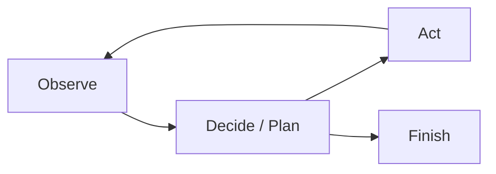

有些资料使用 Thought → Action → Observation 描述 ReAct，但生产系统不必向用户暴露模型完整的隐藏思维过程。更值得保存和展示的是：

- 结构化计划；
- Tool Call；
- Observation；
- 引用和证据；
- 状态变化；
- 简洁、可验证的决策依据。

### 3.7.2 谁决定下一步

Agent 中的下一步主要由模型策略动态产生：

$$
a_t \sim \pi_{\theta}(a \mid s_t, g, c_t)
$$

其中：

- $a_t$ 是下一步动作；
- $s_t$ 是当前状态；
- $g$ 是目标；
- $c_t$ 是当前可用上下文；
- $\pi_{\theta}$ 是模型驱动的决策策略。

即使温度设置为零，也不应假设整个 Agent 系统完全确定。模型版本、上下文排序、外部数据、工具结果和并发时序都可能改变执行轨迹。

## 3.8 Agent 的停止机制

“模型认为完成了”只是停止条件之一。成熟系统通常同时设置多种边界：

| 停止条件 | 作用 |
|---|---|
| 成功判定 | 目标和验收条件已经满足 |
| 最大步骤数 | 防止无限循环 |
| Token 或费用预算 | 防止成本失控 |
| 总运行时间 | 避免任务长期占用资源 |
| 无进展检测 | 识别重复动作和状态停滞 |
| 重复 Tool Call 检测 | 阻止相同参数被不断调用 |
| 策略或权限违规 | 在高风险行为前终止 |
| 人工审批点 | 等待用户授权后继续 |
| 用户取消 | 及时停止并清理资源 |

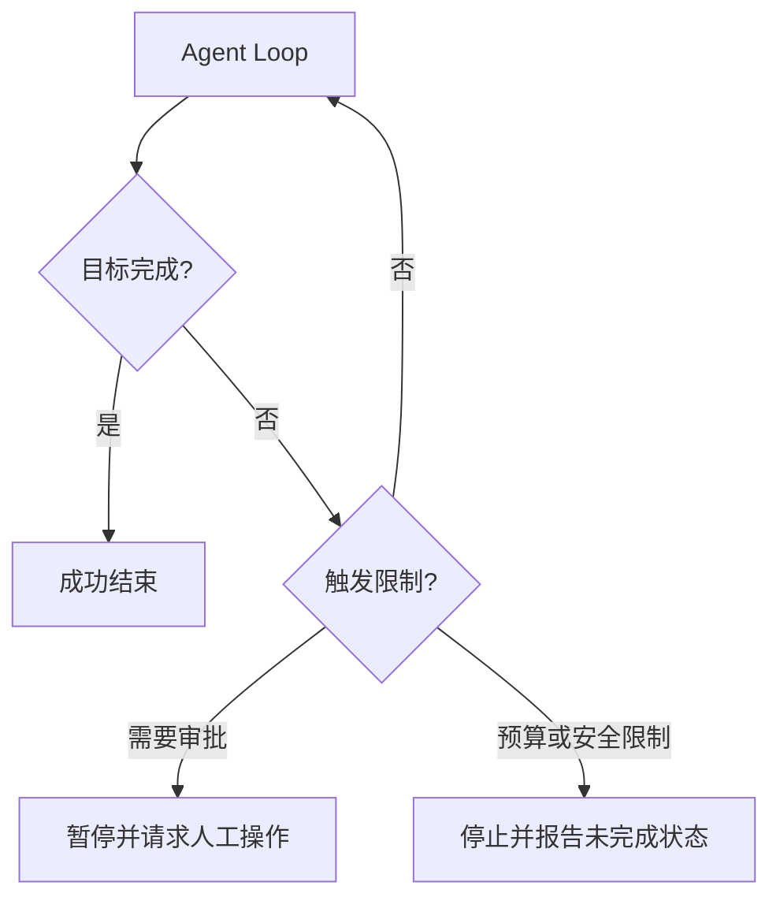

如果因预算、超时或最大步数而终止，系统不应把部分结果伪装成成功，而应明确报告：

- 已完成什么；
- 尚未完成什么；
- 为什么停止；
- 如何继续。

## 3.9 Workflow：预定义控制结构

Workflow 将 LLM、Agent、Tools 和普通代码组织成可管理的执行图。

将 Workflow 描述为“开发者把所有决策全部写死”过于绝对。更准确地说：

> **开发者预先定义允许的节点、状态和控制边界；具体节点内部仍可以使用概率模型，某些分支也可以由模型分类结果驱动。**

在确定性 Workflow 中，下一步由代码决定：

$$
n_{t+1}=f(s_t, r_t)
$$

其中：

- $n_{t+1}$ 是下一个节点；
- $s_t$ 是工作流状态；
- $r_t$ 是当前节点结果；
- $f$ 是开发者定义的转移规则。

### 3.9.1 Workflow 的优势

- 执行路径可预测；
- 权限边界清晰；
- 容易测试和调试；
- 成本与延迟更容易估算；
- 适合审计和合规；
- 失败恢复更容易设计。

### 3.9.2 Workflow 的限制

- 难以处理未预见的输入；
- 分支数量增加后维护成本上升；
- 面对开放式任务时灵活性不足；
- 业务变化时需要修改代码或配置。

## 3.10 Agent 与 Workflow 的关键区别

最核心的问题不是“有没有使用 LLM”，而是：

> **谁拥有控制流的决定权？**

| 维度 | Agent | Workflow |
|---|---|---|
| 输入 | 目标和约束 | 结构化输入 |
| 下一步 | 模型运行时决定 | 预定义图和转移规则决定 |
| 路径 | 动态 | 有界、可枚举或半动态 |
| 灵活性 | 高 | 中低 |
| 可预测性 | 较低 | 较高 |
| 成本估算 | 较难 | 较容易 |
| 调试方式 | 观察轨迹与状态 | 检查节点和转移 |
| 适合场景 | 开放式、路径未知的任务 | 规则清晰、稳定重复的任务 |

Agent 和 Workflow 不是互斥关系。一个 Workflow 节点可以运行 Agent，一个 Agent 也可以调用预定义 Workflow 作为高层 Tool。

## 3.11 Agentic Workflow：生产系统的常见选择

生产系统通常采用 Agentic Workflow：

> **用 Workflow 固定主流程、权限和验收边界，在确实需要灵活判断的位置嵌入 Agent。**

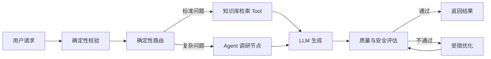

这种架构的优势是：

- 主流程可控；
- 高风险操作可以放在审批节点之后；
- 开放式子任务仍具有适应性；
- 每个 Agent 节点都能设置局部预算和停止条件；
- 失败更容易定位到具体节点。

使用原则是：

> **能用普通代码解决，就不用 LLM；能用单次 LLM 调用解决，就不用 Workflow；能用 Workflow 解决，就不要默认升级为完全自主 Agent。**

## 3.12 Anthropic 总结的五种 Workflow 模式

### 3.12.1 Prompt Chaining

Prompt Chaining 将任务拆分为固定步骤，前一步输出成为后一步输入：

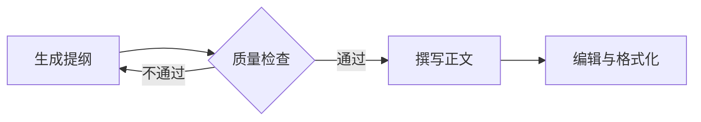

适合：

- 步骤可以清晰拆分；
- 每一步都能定义检查条件；
- 愿意用额外延迟换取准确率。

风险：

- 上游错误会传播到下游；
- 固定链条不擅长处理意外情况。

### 3.12.2 Routing

Routing 先判断输入类别，再分发给专门分支：

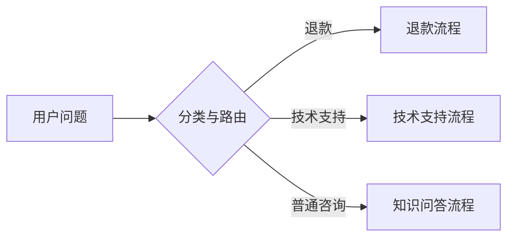

路由决策可以由：

- 规则；
- 传统分类模型；
- LLM；
- 多种方法组合。

适合类别边界相对清晰、不同类别需要不同处理策略的任务。

### 3.12.3 Parallelization

Parallelization 同时运行多个独立子任务：

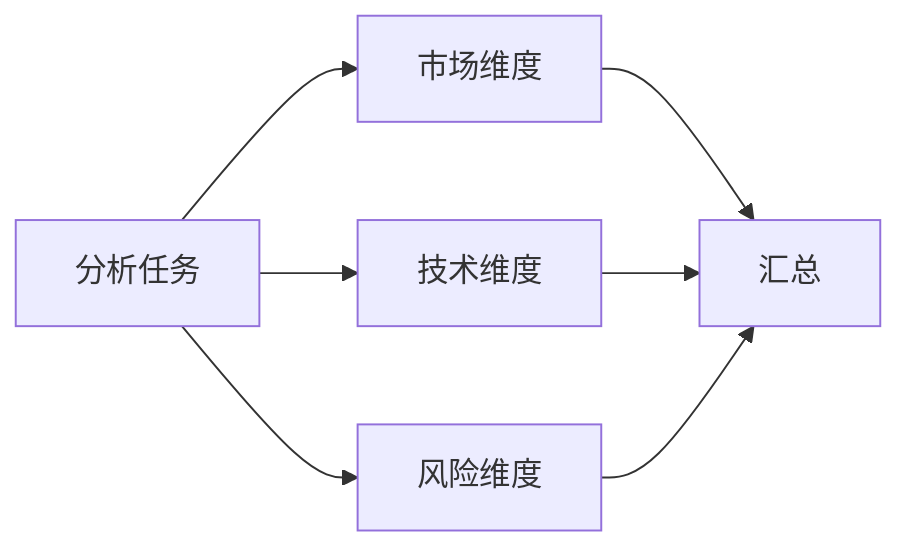

它有两种常见形式：

- **Sectioning**：不同 Worker 处理不同子任务；
- **Voting**：多个 Worker 独立处理同一任务，再投票或聚合。

适合：

- 子任务相互独立；
- 希望降低总体延迟；
- 需要多视角或提高置信度。

并行任务仍需设置并发上限、超时、取消和聚合策略。

### 3.12.4 Orchestrator-Workers

Orchestrator 动态拆分任务并分配给多个 Worker：

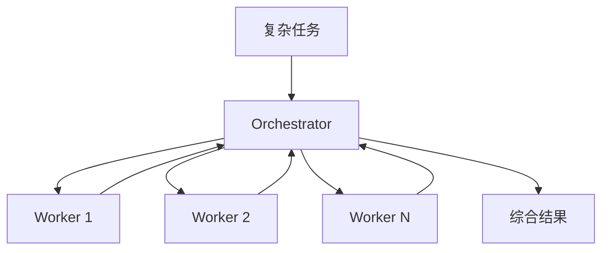

它与普通并行化的区别是：

- Parallelization 的子任务通常由开发者预先定义；
- Orchestrator-Workers 的子任务由 Orchestrator 根据输入动态生成。

适合编码、研究和多文档分析等无法提前确定子任务数量的场景。

### 3.12.5 Evaluator-Optimizer

Evaluator-Optimizer 使用生成者和评估者进行迭代优化：

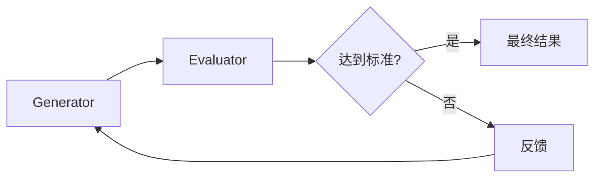

适合：

- 存在明确质量标准；
- 评估者能够识别具体问题；
- 根据反馈迭代能显著改善结果。

常见场景包括翻译、代码生成、研究报告和复杂搜索。

必须设置：

- 最大优化轮数；
- 最低改进阈值；
- Token 和费用预算；
- 防止生成者与评估者形成无效循环的机制。

## 3.13 如何选择

| 场景 | 推荐方案 |
|---|---|
| 单一、确定的外部操作 | Tool |
| 可复用的领域方法和操作手册 | Skill |
| 稳定、可枚举的业务流程 | Workflow |
| 开放式且无法预先确定路径 | Agent |
| 主流程固定、局部需要灵活性 | Agentic Workflow |
| 为编码 Agent 提供仓库约定 | AGENTS.md |
| 让不同 AI 应用标准化连接外部系统 | MCP |

可以使用以下决策顺序：

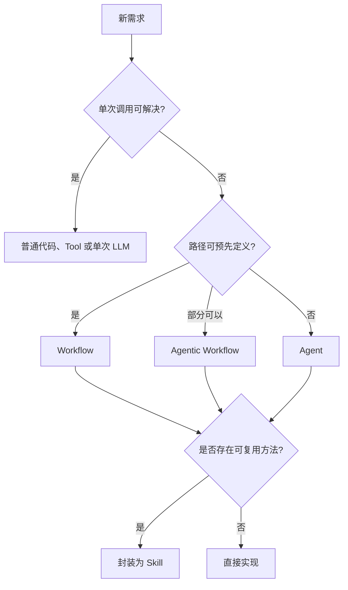

## 3.14 客服系统示例

假设需要实现一个客服系统：

1. 判断问题类别；
2. 查询知识库或订单系统；
3. 生成回答；
4. 对退款等高风险操作进行人工确认。

可以这样划分：

| 部分 | 实现 |
|---|---|
| 分类和分支边界 | Workflow |
| 查询知识库、订单和退款 | Tools |
| 处理复杂、未预见的问题 | Agent |
| 标准退款处理方法 | Skill |
| 客服项目的测试和安全约定 | AGENTS.md |
| 连接订单系统和知识库 | MCP 或业务 API |

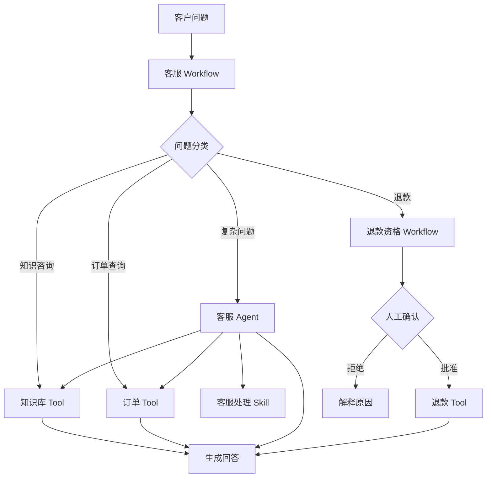

该系统不是纯 Workflow，也不是让一个 Agent 控制所有事情。它将动态判断限制在合适范围内，并把退款等高风险操作保留在确定性流程和人工审批中。

## 3.15 本章总结

这一组概念可以压缩为五句话：

1. **Tool 封装可执行能力，但不决定何时执行。**
2. **Skill 封装完成一类任务的方法、知识和资源。**
3. **Agent 围绕目标动态选择下一步行动。**
4. **Workflow 规定可控的执行结构和边界。**
5. **AGENTS.md 为编码 Agent 提供仓库级工作约定。**

MCP 则负责让 AI 应用以标准方式连接外部系统。生产环境通常不会在 Agent 和 Workflow 之间二选一，而是使用 Workflow 控制主流程，在必要节点引入 Agent，并用 Tools、Skills、Runtime 和 Guardrails 支撑执行。

## 参考资料

- [Anthropic: Building Effective Agents](https://www.anthropic.com/engineering/building-effective-agents)
- [Model Context Protocol](https://modelcontextprotocol.io/docs/getting-started/intro)
- [Agent Skills Specification](https://agentskills.io/specification)
- [AGENTS.md](https://agents.md/)
