# Chapter 3: Tools, Skills, Agents, Workflows, and AGENTS.md

## 3.1 Start with the Overall Picture

Tools, skills, agents, workflows, and AGENTS.md often appear together in agent products, but they address different layers of the problem:

> **A tool provides a capability; a skill provides a method; an agent makes decisions; a workflow defines control structure; AGENTS.md sets repository-level working conventions.**

MCP addresses a different dimension:

> **MCP does not replace tools. It is a standard protocol for connecting AI applications to Tools, Resources, and Prompts.**

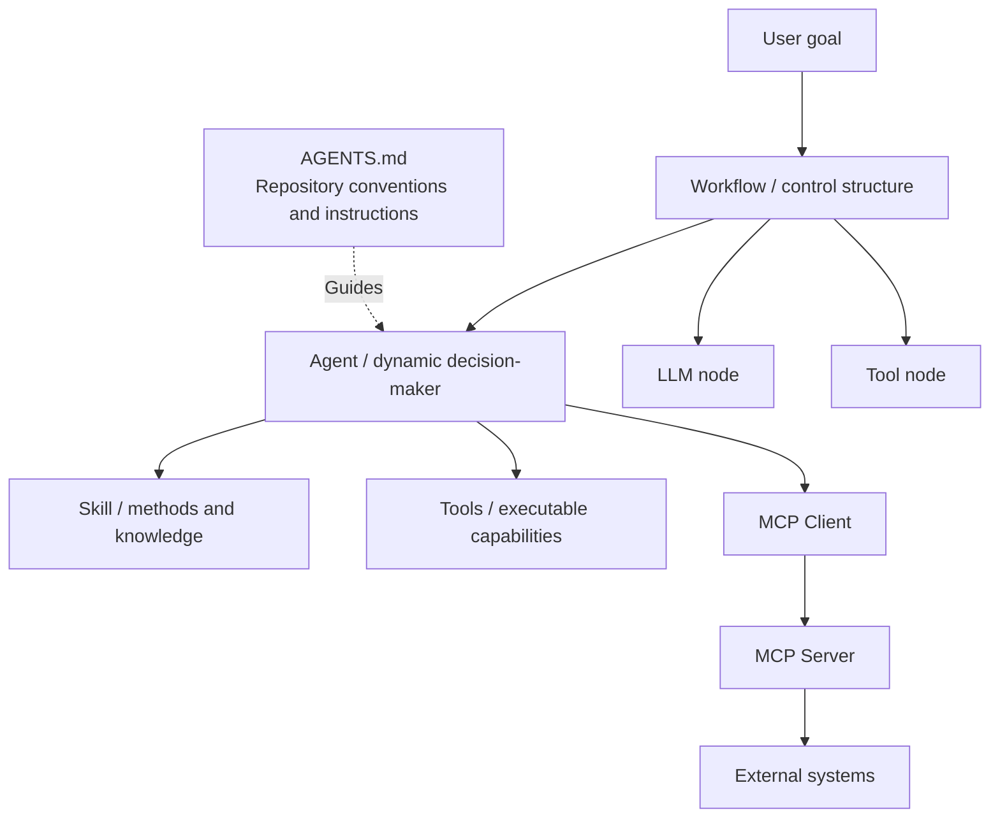

Solid lines represent orchestration or invocation; the dotted line represents instructions. `AGENTS.md` can ask developers or coding agents to modify a workflow, but the file itself is not a runtime permission gate. Rules that must be enforced still belong in code, tool permissions, or deployment configuration.

## 3.2 The Core Distinctions

| Concept | Question it answers | Does it execute actions? | Does it decide autonomously? | Typical form |
|---|---|---:|---:|---|
| Tool | “What capability can I invoke?” | Yes | No | Function, API, command, MCP tool |
| Skill | “How should this kind of task be completed?” | May include scripts that the host must execute | The format itself grants no autonomous decision-making authority | `SKILL.md`, scripts, reference material |
| Agent | “What should I do next to achieve the goal?” | Through tools | Yes | Agent Runtime + Model + State |
| Workflow | “Which execution structures and paths are allowed?” | Through nodes | Determined jointly by code, rules, or constrained model nodes | DAG, state machine, workflow code |
| AGENTS.md | “What conventions should I follow in this repository?” | No | No | An `AGENTS.md` file in the repository |
| MCP | “How does an AI application connect to external capabilities in a standard way?” | Transmits calls | No | Host, client, and server protocol |

The most common mistake is to treat these as alternatives at the same level. An agent can read AGENTS.md, follow a skill's method, call a tool through MCP, and operate within a workflow's control structure—all at once.

## 3.3 Tools: The Smallest Callable Capabilities

### 3.3.1 A Tool's Responsibility

A tool is an executable capability that an agent or workflow can invoke, such as:

- Searching the web;
- Querying a database;
- Executing code;
- Reading or writing files;
- Sending email;
- Calling payment, ticketing, or internal business APIs.

A tool itself does not decide:

- Whether it should be used now;
- Which tool should be called first;
- Whether the current result is sufficient;
- When the overall task should end.

Those decisions belong to the agent, workflow, or higher-level application code.

This describes the responsibility of the calling interface, not a restriction on the tool's implementation. A tool can wrap an entire workflow or even another agent. “Smallest callable capability” is relative to the caller; it does not mean the implementation must contain only one step.

### 3.3.2 A Tool Is More Than a Function with Instructions

Thinking of a tool as a function with a schema is a useful introduction, but incomplete. Its execution endpoint may be:

- A local function;
- A command-line program;
- A remote HTTP API;
- A database operation;
- A browser or desktop interaction;
- A remote capability exposed by an MCP server.

A production tool typically includes:

1. A name and functional description;
2. Input and output schemas;
3. An executor;
4. Authentication and authorization;
5. Timeouts and cancellation;
6. Retry and idempotency policies;
7. Side-effect information and a risk level;
8. Errors and audit information.

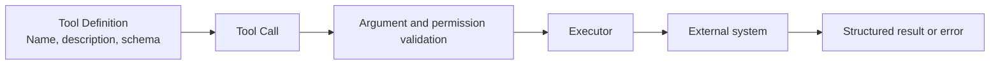

### 3.3.3 Tool Schemas

An ordinary function signature primarily serves compilers and programmers. A tool schema must also help the model understand when and how to use the tool.

The following uses the OpenAI Chat Completions function tool format introduced in Chapter 2. The Responses API does not use this nested `function` structure, and MCP tools have their own definition format.

```json
{
  "type": "function",
  "function": {
    "name": "search_web",
    "description": "搜索公开网页。需要实时信息或外部事实时使用。",
    "parameters": {
      "type": "object",
      "properties": {
        "query": {
          "type": "string",
          "description": "具体、完整的搜索查询"
        }
      },
      "required": ["query"],
      "additionalProperties": false
    }
  }
}
```

The Chinese descriptions mean “Search public web pages. Use when real-time information or external facts are needed” for the tool and “A specific, complete search query” for `query`.

A good tool description makes the following clear:

- When to use it;
- When not to use it;
- What its arguments mean;
- The structure of its return value;
- How it can fail;
- Whether it produces external side effects.

### 3.3.4 A Tool Call Is Not Tool Execution

The model returns only a proposed call. The following is a readable illustration of its meaning, not a raw API response. Actual responses also include call IDs, and arguments may be JSON strings that need parsing:

```json
{
  "tool_call": {
    "name": "search_web",
    "arguments": {
      "query": "2026 年 Agent 技术进展"
    }
  }
}
```

The sample query is Chinese for “advances in agent technology in 2026.”

The actual invocation proceeds as follows:

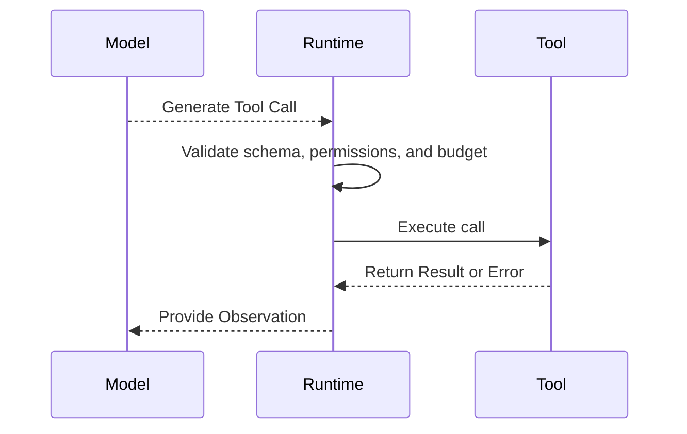

Generating JSON that requests sending an email does not mean the email was successfully sent. The runtime must execute the tool and update state from the actual result.

## 3.4 MCP: Standardizing Connections, Not Replacing Tools

> This chapter does not repeat the protocol specification. For tool connections, transport, and authorization, see [Tools: MCP](../../tools/02-mcp/04-what-is-mcp.md). For agent interoperability, see [Tools: A2A](../../tools/04-agent-communication/11-a2a-protocol.md).

MCP (Model Context Protocol) is an open standard for connecting AI applications to external systems. It can expose:

- **Tools**: executable actions;
- **Resources**: readable data and context;
- **Prompts**: reusable prompt templates.

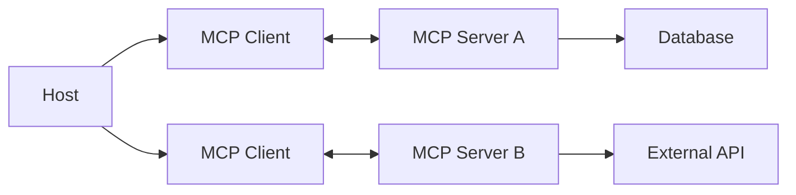

MCP reduces duplicated integration work by standardizing connections, capability descriptions, and message exchange.

But “MCP support lets you immediately call every tool” is inaccurate:

- The host must still connect to or configure the relevant server;
- The server must still handle authentication and authorization;
- High-risk operations may still require user confirmation;
- Support for individual protocol capabilities must still be negotiated with the client;
- Adopting MCP does not automatically guarantee tool quality, safety, or correct business semantics.

## 3.5 Skills: Reusable Task Methods

### 3.5.1 What Problem Does a Skill Solve?

A tool tells an agent what it can do; a skill tells it how to approach a particular kind of task.

For example:

- `search_web` is a tool;
- “How to conduct industry research with cross-checked sources” is a skill;
- `read_file`, `run_tests`, and `git_diff` are tools;
- “How to perform a reliable code review” is a skill.

A skill can:

- Coordinate multiple tools;
- Provide steps, checklists, and domain rules;
- Include executable scripts;
- Include templates, examples, and reference material;
- Specify output formats and quality standards.

### 3.5.2 The Standard Agent Skills Structure

Agent Skills is an open file format, not a remote invocation or message transport protocol. At minimum, a skill is a directory containing `SKILL.md`:

```text
code-review/
├── SKILL.md
├── scripts/
├── references/
└── assets/
```

`SKILL.md` declares metadata in YAML front matter and provides operational instructions in a Markdown body:

```markdown
---
name: code-review
description: Review code changes for correctness and security. Use when inspecting a pull request or git diff.
---

# Code Review

1. Read the complete diff.
2. Trace affected call paths.
3. Run targeted validation.
4. Report only actionable findings.
```

Key fields in the standard include:

| Field | Required? | Purpose |
|---|---:|---|
| `name` | Yes | A stable identifier for the skill |
| `description` | Yes | Describes the capability and when to activate it |
| `license` | No | License information |
| `compatibility` | No | Environment and dependency requirements |
| `metadata` | No | Additional metadata |
| `allowed-tools` | No | A space-separated declaration of preapproved tools; an experimental field whose support depends on the host |

`name` must match the directory name. `description` should explain both what the skill does and when to use it. If `metadata.version` is present, it is package-author metadata, not an Agent Skills protocol version. Loading a skill cannot elevate the user's permissions. Scripts and external references still require source review, permission checks, and execution isolation.

### 3.5.3 Progressive Disclosure

An important design principle of skills is progressive disclosure:

1. Load only the name and description at startup;
2. Load the complete `SKILL.md` after the agent determines that it matches the task;
3. Read scripts, references, and resources only when needed.

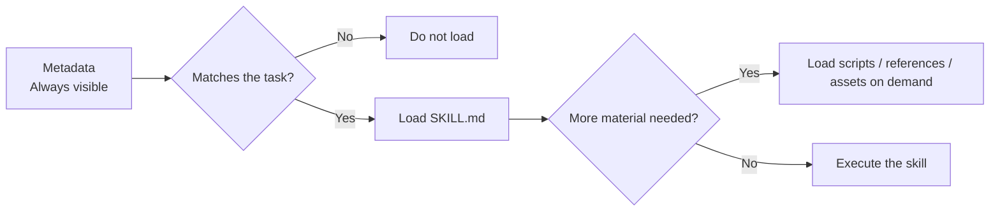

This avoids loading all domain knowledge into context at once.

### 3.5.4 Skills Versus Tools

| Tool | Skill |
|---|---|
| A callable capability interface | A loadable method for a task |
| Emphasizes input, execution, and output | Emphasizes steps, experience, and quality standards |
| Usually has no task strategy | Contains a task strategy |
| Invoked by the runtime | Loaded and followed by the agent as needed |
| Example: run tests | Example: how to diagnose and fix failing tests |

The Agent Skills format does not itself provide independent decision-making authority. It is more like a reusable runbook bundled with resources, selected explicitly by the user or matched and loaded by the host or agent. The runtime then executes any required tools or scripts. Instructions in a runbook do not automatically acquire the scheduling, recovery, or permission guarantees of a workflow engine.

## 3.6 AGENTS.md: Repository Instructions for Coding Agents

This open format uses an uppercase, plural filename:

> **`AGENTS.md`**

Think of it as a README for coding agents: it tells an agent how to work in a particular repository.

Typical contents include:

- Project structure;
- Development environment and dependency installation;
- Build, test, and formatting commands;
- Coding conventions;
- Security considerations;
- Commit and pull request conventions;
- Directories that must not be modified;
- Task completion criteria.

```markdown
# Repository Instructions

## Development

- Use `pnpm install` to restore dependencies.
- Run `pnpm test` after changing application code.

## Conventions

- Use TypeScript for new source files.
- Do not edit generated files in `dist/`.
```

### 3.6.1 Scope

Large repositories can contain several nested `AGENTS.md` files:

```text
repository/
├── AGENTS.md
├── frontend/
│   └── AGENTS.md
└── backend/
    └── AGENTS.md
```

Nesting should not be interpreted as “read only the nearest file and ignore its ancestors.” Applicable parent conventions generally remain in effect, while deeper files refine them or override conflicting instructions. Discovery scope and merge rules depend on the host. For example, official Codex documentation describes reading from the project root along the path to the current working directory, combining files from top to bottom, and supporting `AGENTS.override.md`. This does not mean every product automatically scans every ancestor of every file it is about to modify.

If the root says “do not edit generated files” and a subdirectory adds only test commands, the root restriction remains in effect. When instructions appear ineffective, first check which files the host actually loaded, not merely whether those files exist.

### 3.6.2 What AGENTS.md Is Not

`AGENTS.md`:

- Is not an agent;
- Is not a tool schema;
- Is not an executable workflow;
- Does not replace a skill;
- Does not automatically grant the agent new permissions.

It provides project context and persistent working instructions. Whether an agent reads it, and how conflicts are resolved, depend on the product's implementation.

### 3.6.3 AGENTS.md Versus a Skill

| AGENTS.md | Skill |
|---|---|
| Applies to a repository or directory | Applies to a reusable class of tasks |
| Provides standing project conventions | Matched and loaded according to the task |
| Usually does not bundle executable resources | Can bundle scripts, material, and templates |
| Example: this repository uses `pnpm test` | Example: how to conduct a systematic code review |

## 3.7 Agents: Dynamic Decision-Makers

An agent receives a goal, rather than a completely predetermined execution path.

For example, a user might ask:

> Research recent competitor developments and provide conclusions supported by sources.

At runtime, the agent must decide:

- Which search terms to use;
- Whether to divide the work by competitor;
- Which sources to consult;
- Whether further searching is needed;
- Whether the information is contradictory;
- Whether the evidence is sufficient for a conclusion;
- When to stop.

### 3.7.1 The Agent Control Loop

A useful representation of the agent loop is:

> **Observe → Decide/Plan → Act → Observe**

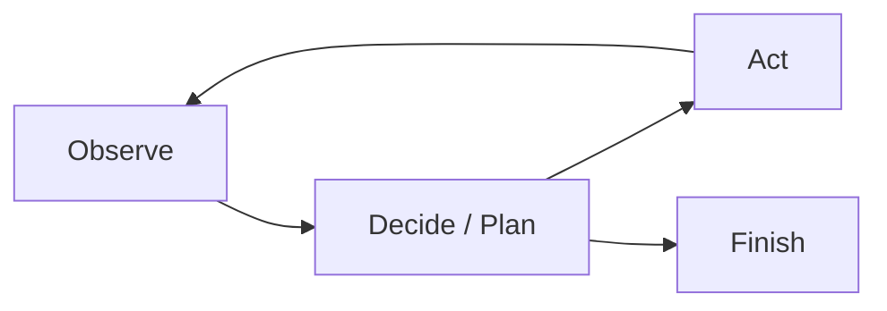

Some material describes ReAct as Thought → Action → Observation, but production systems do not need to expose complete hidden reasoning to users. What the control loop needs to preserve is structured plans, tool calls, returned evidence, and state changes, while giving users concise reasons for decisions. This distinguishes what the model intended from what the executor actually did.

### 3.7.2 Who Decides the Next Step?

In an agent, the next step is primarily generated dynamically by the model's policy:

$$
a_t \sim \pi_{\theta}(a \mid s_t, g, c_t)
$$

Where:

- $a_t$ is the next action;
- $s_t$ is the current state;
- $g$ is the goal;
- $c_t$ is the currently available context;
- $\pi_{\theta}$ is the model-driven decision policy.

Even with temperature set to zero, do not assume that the entire agent system is deterministic. Model versions, context ordering, external data, tool results, and concurrency timing can all change the execution trajectory.

## 3.8 How Agents Stop

“The model thinks it is finished” is only one stopping condition. Mature systems usually enforce several boundaries:

| Stopping condition | Purpose |
|---|---|
| Success determination | The goal and acceptance criteria have been met |
| Maximum step count | Prevent infinite loops |
| Token or monetary budget | Prevent runaway costs |
| Total runtime limit | Prevent tasks from occupying resources indefinitely |
| Lack-of-progress detection | Identify repeated actions and stalled state |
| Repeated tool call detection | Detect repeated calls that make no progress, while distinguishing permitted polling and idempotent retries |
| Policy or permission violation | Stop before a high-risk action |
| Human approval point | Wait for user authorization before continuing |
| User cancellation | Stop promptly and clean up resources |

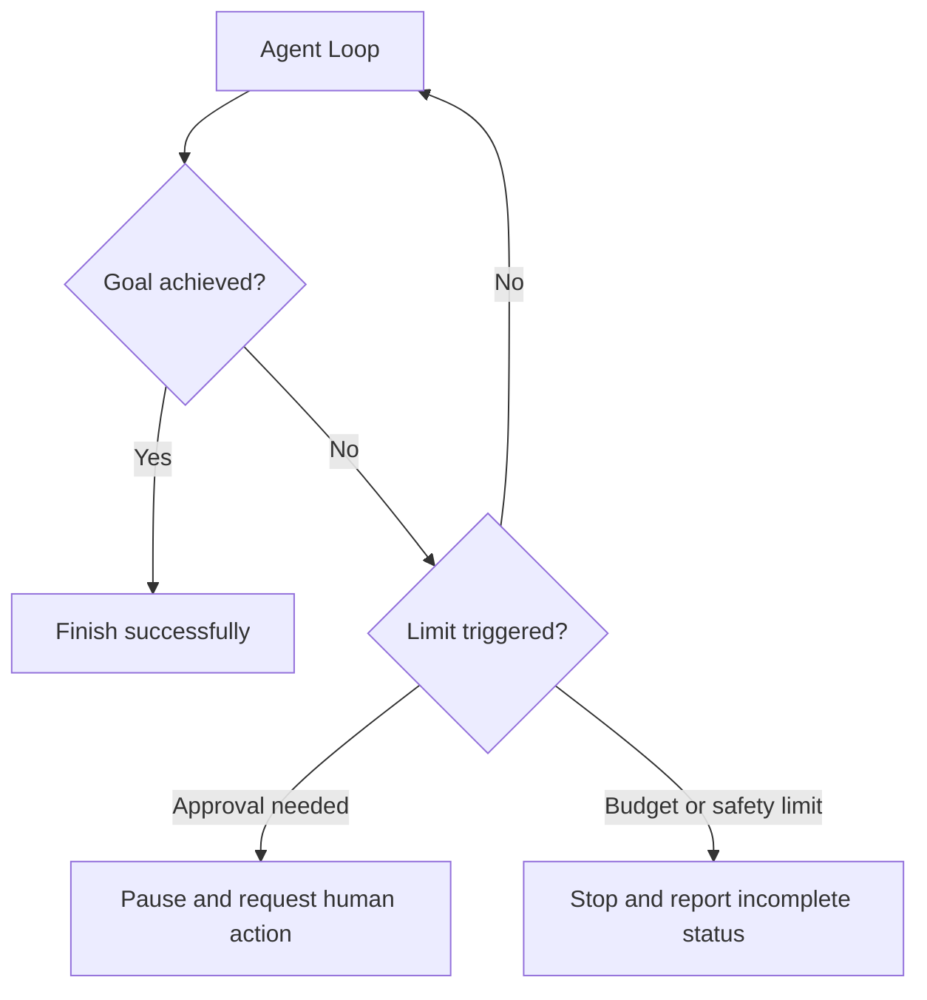

If execution stops because of a budget, timeout, or step limit, the system must not present partial results as success. It should explicitly report:

- What has been completed;
- What remains incomplete;
- Why it stopped;
- How to continue.

## 3.9 Workflows: Predefined Control Structures

A workflow organizes LLMs, agents, tools, and ordinary code into a manageable execution graph.

Saying that a workflow requires developers to hardcode every decision is too absolute. More precisely:

> **Developers define the allowed nodes, states, and control boundaries in advance. Individual nodes may still use probabilistic models, and some branches may be driven by model classification results.**

In a deterministic workflow, code determines the next step:

$$
n_{t+1}=f(s_t, r_t)
$$

Where:

- $n_{t+1}$ is the next node;
- $s_t$ is the workflow state;
- $r_t$ is the current node's result;
- $f$ is the developer-defined transition rule.

### 3.9.1 Workflow Advantages

- Allowed execution paths can be inspected, even if node outputs are not deterministic;
- Clear permission boundaries;
- Easier testing and debugging;
- More predictable cost and latency;
- A good fit for audit and compliance requirements;
- Easier design of failure recovery.

### 3.9.2 Workflow Limitations

- Difficulty handling unforeseen inputs;
- Increasing maintenance effort as branches proliferate;
- Limited flexibility for open-ended tasks;
- Code or configuration changes when the business process changes.

## 3.10 The Key Difference Between Agents and Workflows

To distinguish an agent from a workflow, first ask who determines the control flow:

> **Who has the authority to decide the control flow?**

| Dimension | Agent | Workflow |
|---|---|---|
| Input | Goals and constraints, expressed as text or structured data | Text or structured input; input format is not the distinguishing factor |
| Next step | Decided by the model at runtime | Determined by a predefined graph and transition rules |
| Path | Selected dynamically at runtime | Control structure is predefined, but can include loops and dynamic subtasks |
| Flexibility | High | Medium to low |
| Predictability | Lower | Higher |
| Cost estimation | Harder | Easier |
| Debugging | Inspect trajectories and state | Inspect nodes and transitions |
| Suitable tasks | Open-ended tasks with unknown paths | Stable, repetitive tasks with clear rules |

Agents and workflows are not mutually exclusive. A workflow node can run an agent, and an agent can invoke a predefined workflow as a higher-level tool.

## 3.11 Agentic Workflows: A Common Production Choice

An agentic workflow is useful when the main business process is clear but some local paths require exploration:

> **Use a workflow to fix the main process, permissions, and acceptance boundaries. Embed agents where flexible judgment is genuinely needed.**

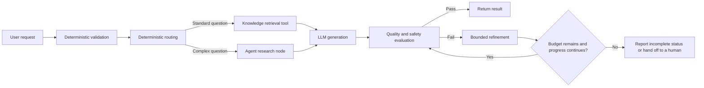

This architecture offers:

- Control over the main process;
- Approval nodes before high-risk operations;
- Adaptability within open-ended subtasks;
- Local budgets and stopping conditions for each agent node;
- Easier attribution of failures to specific nodes.

The guiding principle is:

> **First determine whether ordinary code or a single LLM call is sufficient, then decide whether multi-step orchestration and autonomous decisions are needed.**

Even when the core task needs only one model call, authentication, approval, and asynchronous recovery may still require an outer workflow. Remove reasoning and orchestration layers that add no value, not necessary business controls.

## 3.12 Anthropic's Five Workflow Patterns

### 3.12.1 Prompt Chaining

Prompt chaining divides a task into fixed steps, with each step's output becoming the next step's input:

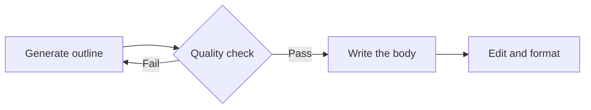

Suitable when:

- The task separates cleanly into steps;
- Each step has definable checks;
- Additional latency is an acceptable tradeoff for accuracy.

Risks:

- Upstream errors propagate downstream;
- A fixed chain handles unexpected situations poorly.

The diagram's retry after a failed check must be bounded by attempt, time, and cost limits. If repeated generation still fails the checks, report what is missing or hand off to a human instead of returning to the first step indefinitely.

### 3.12.2 Routing

Routing classifies an input and sends it to a specialized branch:

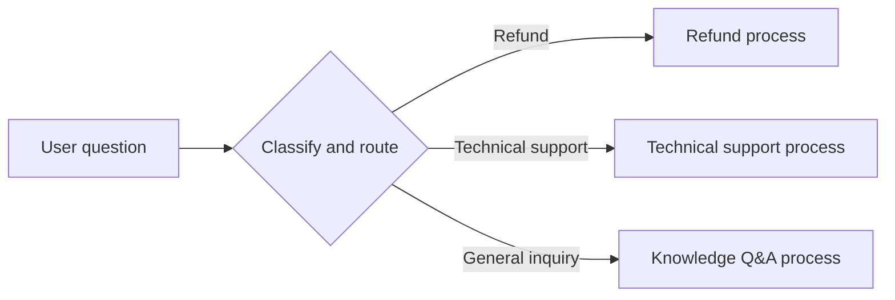

The routing decision can use:

- Rules;
- Traditional classification models;
- LLMs;
- A combination of methods.

It suits tasks with reasonably clear category boundaries and different handling strategies for different categories.

### 3.12.3 Parallelization

Parallelization runs independent subtasks concurrently:

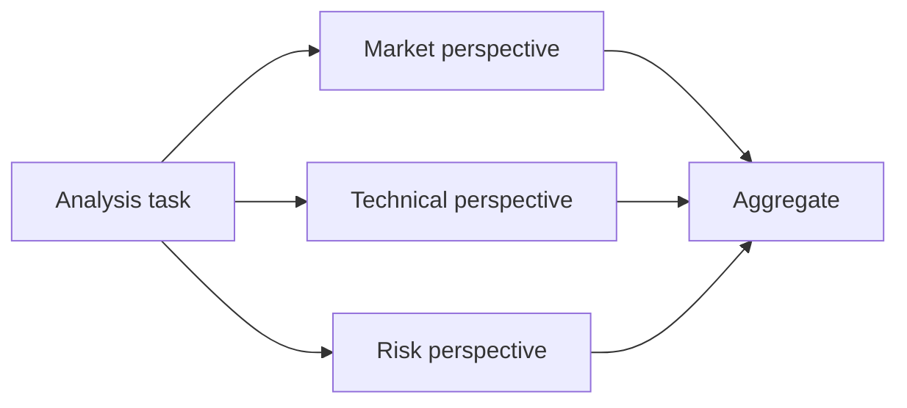

Two common forms are:

- **Sectioning**: different workers handle different subtasks;
- **Voting**: multiple workers independently handle the same task, followed by voting or aggregation.

Suitable when:

- Subtasks are independent;
- Lower overall latency is desirable;
- Multiple perspectives or greater confidence are needed.

Parallel tasks still require concurrency limits, timeouts, cancellation, and aggregation policies.

### 3.12.4 Orchestrator-Workers

An orchestrator dynamically decomposes a task and assigns work to multiple workers:

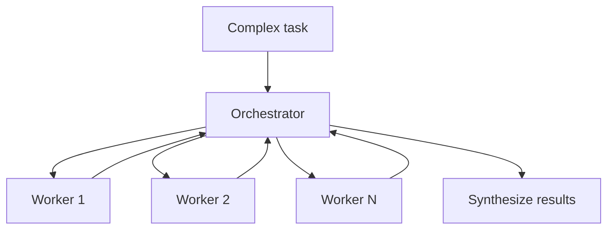

It differs from ordinary parallelization in that:

- Parallelization usually uses subtasks predefined by the developer;
- Orchestrator-workers generates subtasks dynamically from the input.

Anthropic still classifies this as a workflow because the outer structure—decompose, delegate, aggregate—can be fixed in advance. Dynamically generating task content is not the same as allowing an agent to decide the entire execution process freely. If workers also contain autonomous tool loops, the system combines both approaches.

It suits coding, research, and multi-document analysis where the number of subtasks cannot be known in advance.

### 3.12.5 Evaluator-Optimizer

Evaluator-optimizer uses a generator and an evaluator for iterative improvement:

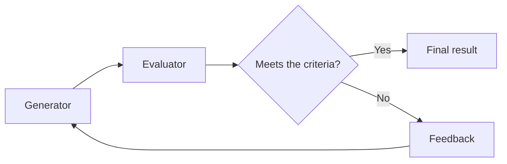

Suitable when:

- Quality criteria are clear;
- The evaluator can identify specific problems;
- Iterating on feedback can substantially improve the result.

Common applications include translation, code generation, research reports, and complex search.

Required controls include:

- A maximum number of refinement rounds;
- A minimum improvement threshold;
- Token and monetary budgets;
- A mechanism to prevent unproductive generator-evaluator loops.

## 3.13 Choosing the Right Building Block

| Situation | Recommended approach |
|---|---|
| A single, deterministic external operation | Tool |
| Reusable domain methods and runbooks | Skill |
| A stable business process with enumerable paths | Workflow |
| An open-ended task whose path cannot be predetermined | Agent |
| A fixed main process with local flexibility | Agentic workflow |
| Repository conventions for coding agents | AGENTS.md |
| Standardized connections from different AI applications to external systems | MCP |

The following decision sequence can help:

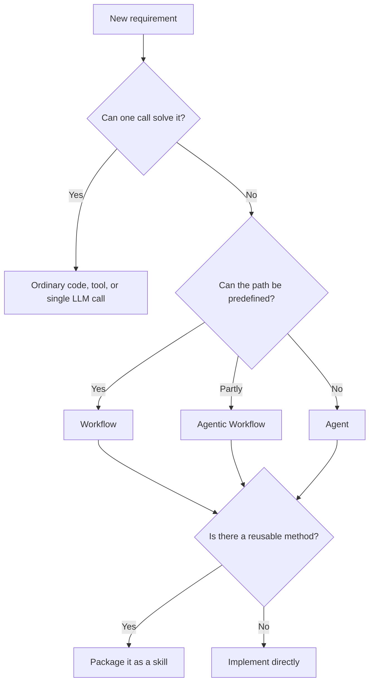

## 3.14 A Customer Support Example

The following fictional order-support system brings these components together; it is not a project from the author's work history. It needs to:

1. Classify the question;
2. Query a knowledge base or order system;
3. Generate a response;
4. Obtain human confirmation for high-risk operations such as refunds.

The implementation can be divided as follows:

| Part | Implementation |
|---|---|
| Classification and branch boundaries | Workflow |
| Knowledge and order queries, and refund operations | Tools |
| Handling complex, unforeseen questions | Agent |
| Standard refund handling method | Skill |
| Testing and security conventions for the support project | AGENTS.md |
| Connecting to the order system and knowledge base | MCP or business APIs |

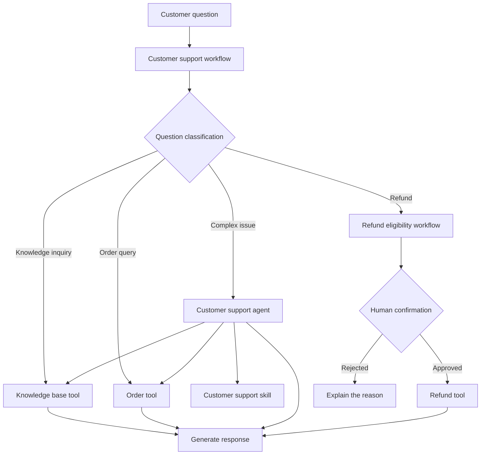

This system is neither a pure workflow nor an agent in control of everything. It confines dynamic judgment to suitable areas and keeps high-risk actions such as refunds within deterministic processes and human approval.

## 3.15 Chapter Summary

Five distinctions provide a practical starting point:

1. **A tool wraps an executable capability but does not decide when to execute it.**
2. **A skill packages methods, knowledge, and resources for a class of tasks.**
3. **An agent dynamically selects its next action toward a goal.**
4. **A workflow defines a controlled execution structure and boundaries.**
5. **AGENTS.md provides repository-level working conventions for coding agents.**

MCP, meanwhile, standardizes how AI applications connect to external systems. Production systems usually do not choose exclusively between agents and workflows. They use workflows to control the main process, introduce agents where needed, and support execution with tools, skills, runtime controls, and guardrails.

## References

- [Anthropic: Building Effective Agents](https://www.anthropic.com/engineering/building-effective-agents)
- [Model Context Protocol](https://modelcontextprotocol.io/docs/getting-started/intro)
- [Agent Skills Specification](https://agentskills.io/specification)
- [AGENTS.md](https://agents.md/)
- [OpenAI Codex: Custom instructions with AGENTS.md](https://developers.openai.com/codex/guides/agents-md)
- [OpenAI: Function calling](https://developers.openai.com/api/docs/guides/function-calling)

The Agent Skills format and host instruction-discovery behavior were checked against official pages accessed on 2026-09-15. That access date is not a format version number.
