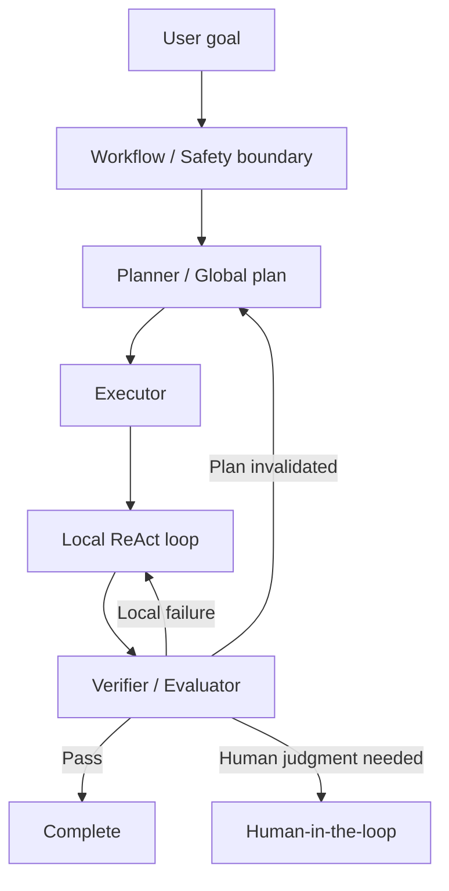
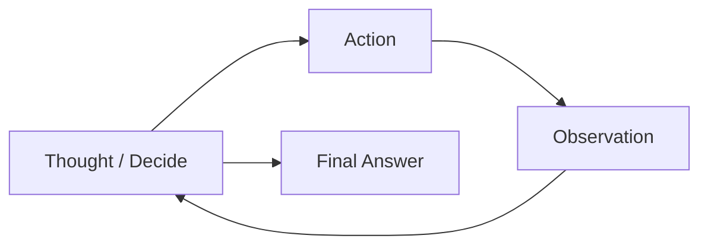
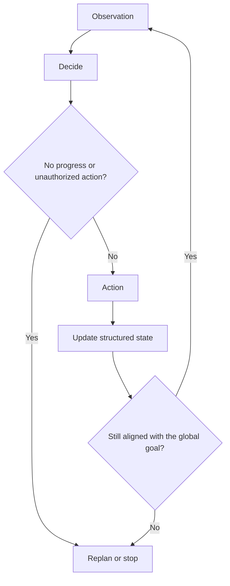
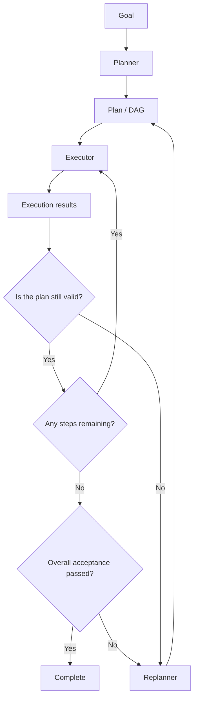
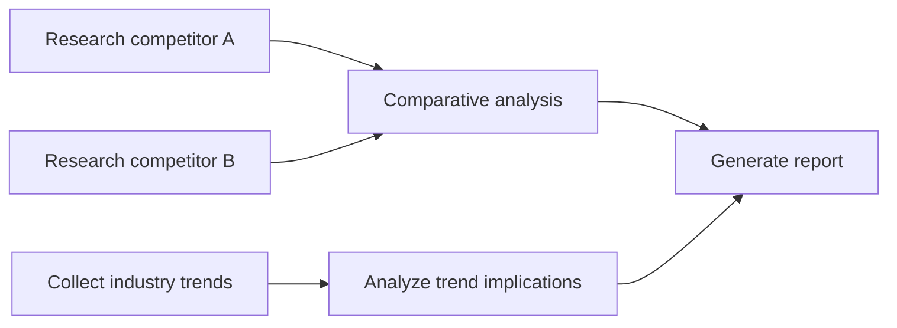
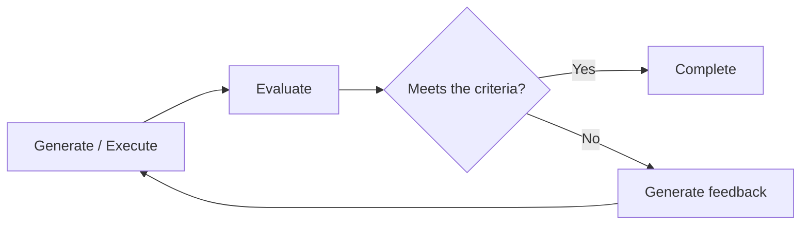
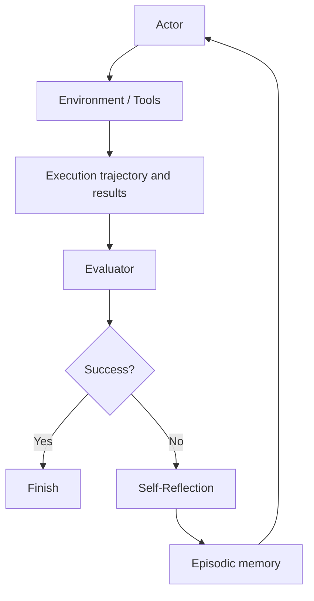
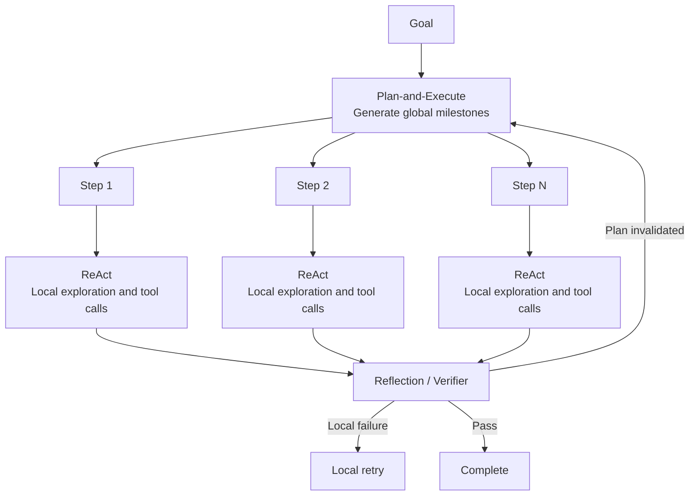
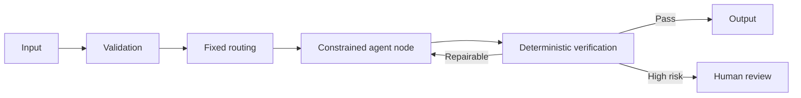
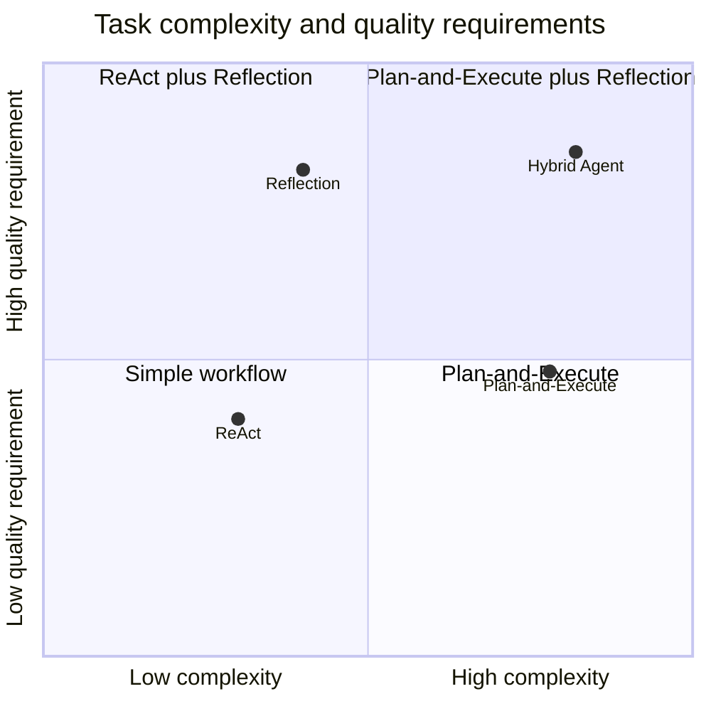

# Chapter 4: Agent Design Patterns

## 4.1 What is an agent design pattern?

Even a task as simple as “research a topic and write a report” admits several approaches. The system might decide its next move after every search result, make a plan before acting, or repeatedly verify a draft. Agent design patterns describe these forms of control:

> **How an agent organizes reasoning, planning, action, observation, verification, and retries.**

A pattern is neither a particular framework nor merely a prompt template. It is a runtime control strategy.

This chapter compares three foundational families. They are neither mutually exclusive nor exhaustive:

1. **ReAct**: observe and decide the next step as the task unfolds.
2. **Plan-and-Execute**: establish a global plan, then execute and dynamically replan.
3. **Reflection / Reflexion**: revise results using evaluation and feedback; Reflexion is a specific research method with episodic memory.

These patterns are often combined, usually in layers:



## 4.2 ReAct: alternating reasoning and action

ReAct (Reasoning and Acting) combines reasoning with external actions. Its classic formulation is:

> **Thought → Action → Observation → Thought**

This is a schematic view of the [original ReAct paper](https://arxiv.org/abs/2210.03629), not a requirement to emit a Thought before every action. For decision-making tasks, the paper allows sparse reasoning steps, which can also generate, track, and update plans. Its main experiments use in-context examples rather than updating model weights after each tool call. The paper also includes fine-tuning experiments; those should not be confused with prompting-based ReAct.



### 4.2.1 How one ReAct iteration works

#### Thought

The model analyzes the current goal, state, and observations, then chooses its next strategy.

#### Action

The model proposes a structured action, such as a search tool call. The following illustrates the call's semantics; actual fields and call IDs depend on the API. The query asks for competitor A's latest product updates.

```json
{
  "tool_call": {
    "name": "search_web",
    "arguments": {
      "query": "竞品 A 最新产品更新"
    }
  }
}
```

#### Observation

The runtime executes the tool and returns its actual result or error to the model. The model starts its next decision using that new evidence.

### 4.2.2 Modern implementations should not expose complete Thoughts

Early ReAct examples had models explicitly output Thoughts. An engineering implementation should not treat that free-form text as a stable control interface, nor should debugging depend on showing users the model's complete hidden chain of thought.

Suppose the model says, “I found the latest price,” but the trace contains only a failed search call. The tool result takes precedence. Record goals, plans, call arguments, actual return values, and state changes, and express “why continue searching” as a brief, checkable rationale. A more useful description of the loop is:

> **Observe → Decide → Act → Observe**

These records support inspection and traceability, but they are not a complete explanation of the model's internal computation. See [Chapter 5](05-agent-reasoning-methods.md), §5.5.3, for the faithfulness of reasoning text.

### 4.2.3 A decision model for ReAct

Let the current goal be $g$, the state $s_t$, the observation $o_t$, and the available context $c_t$. The next action can be written as:

$$
a_t \sim \pi_{\theta}(a\mid g,s_t,o_t,c_t)
$$

Executing the action produces a new observation. Use `eₜ` for the environment's actual state, distinct from the agent's saved state `sₜ`:

$$
(e_{t+1},o_{t+1})\sim Env(\cdot\mid e_t,a_t)
$$

The agent then updates its state:

$$
s_{t+1}=Update(s_t,a_t,o_{t+1})
$$

Observations may be incomplete, stale, or indicate only that a request was accepted. The update changes the agent's record of the environment; it does not establish that the agent knows the environment's complete actual state.

### 4.2.4 Strengths of ReAct

- Straightforward implementation.
- Prompt use of fresh environmental feedback.
- Suitable for tasks whose full information is unavailable in advance.
- Immediate adjustment after tool failures.
- Useful for short or exploratory tasks, provided the tools return useful information.

The original paper evaluates HotpotQA, FEVER, ALFWorld, and WebShop. Retrieval can supply facts, but bad queries or irrelevant results can also mislead later decisions. These findings do not establish that ReAct outperforms CoT on every task, or that more tool calls always improve accuracy.

### 4.2.5 Limitations of ReAct

ReAct is often described as “taking one step, then deciding the next.” Its main risks include:

- It does not require a schedulable global task structure by default, although reasoning can include planning.
- Serial tool-call/decision cycles require model round trips; batching calls can reduce some overhead.
- Searches or identical tool calls may be repeated.
- Context noise can dilute goals and constraints during long tasks.
- Locally plausible actions may not form a globally optimal path.
- Ambiguous completion criteria can cause premature stopping or endless loops.

“Local optimum” is only an analogy here, not an optimization guarantee. The model's proposed action may not even be locally optimal; it is simply a candidate generated from the current context.

### 4.2.6 Improving ReAct

Production systems commonly add:

- Goals and acceptance criteria that remain visible.
- Structured task state.
- A to-do list or phase checkpoints.
- Tool-call deduplication.
- No-progress detection.
- Step, time, and cost budgets.
- Periodic checks against the global goal.
- External verification of critical steps.



## 4.3 Plan-and-Execute: separating planning from execution

Plan-and-Execute separates global planning from local execution. Mature implementations usually have three roles:

1. **Planner**: generates a plan with dependencies.
2. **Executor**: carries out one or more plan steps.
3. **Replanner**: updates the remaining plan from results or ends the task.

Different models can fill these roles, or the same model can fill them with different contexts.



### 4.3.1 A plan should be more than a natural-language list

A reliable plan step should ideally specify:

- A unique ID.
- Its goal.
- Prerequisite steps.
- Required inputs.
- A recommended tool or executor.
- Expected outputs.
- Acceptance criteria.
- Risk level.
- Failure and fallback strategies.

The example retains Chinese task data: compare competitors A and B, cover features, pricing, and target users, and cite each key conclusion.

```json
{
  "id": "compare-products",
  "goal": "比较竞品 A 与竞品 B 的核心能力",
  "depends_on": ["research-a", "research-b"],
  "inputs": ["artifact://research-a", "artifact://research-b"],
  "success_criteria": [
    "至少覆盖功能、定价和目标用户",
    "每项关键结论包含来源"
  ]
}
```

Structured plans are easier to schedule, validate, and recover than free-form lists.

But “every item is done” does not mean the user's goal has been achieved. Reports on competitors A and B may both cite sources while using annual pricing for one and monthly pricing for the other, making the comparison invalid. Overall acceptance in the diagram must therefore check cross-step constraints, not merely count `done` states.

### 4.3.2 Dynamic replanning

A one-time plan can work for stable, well-understood tasks. When the environment or assumptions may change, a replanning mechanism is needed. After each critical step, the replanner should assess:

- Whether the result meets its acceptance criteria.
- Whether key assumptions still hold.
- Whether later steps remain necessary.
- Whether steps should be inserted, removed, or reordered.
- Whether work can run in parallel.
- Whether human confirmation is needed.

For current plan $P_t$ and new observation $o_{t+1}$, replanning can be represented as:

$$
P_{t+1}=R(P_t,o_{t+1},g,s_t)
$$

Here, $R$ denotes the replanner.

### 4.3.3 Example: inserting a step dynamically

Original plan:

```text
1. Search for competitor A
2. Search for competitor B
3. Compare the findings
```

After the first step reveals a major new release from competitor A, update the plan:

```text
1. Search for competitor A
2. Investigate competitor A's major release
3. Search for competitor B
4. Compare the findings
```

The plan still provides global direction, but evolves in response to environmental feedback.

### 4.3.4 Strengths of Plan-and-Execute

- A stronger global view of complex tasks.
- Explicit step dependencies.
- Human review of the plan before execution.
- Straightforward assignment of different models and tools.
- Parallel execution of independent steps.
- Better support for checkpoints and failure recovery.

### 4.3.5 Limitations of Plan-and-Execute

- Planning and replanning add latency and cost.
- The initial plan may rely on false assumptions.
- The planner may produce infeasible or excessively detailed steps.
- Frequent replanning may degenerate into expensive ReAct.
- The planner and executor may interpret a step differently.
- Long plans can become obsolete quickly as the environment changes.

Plan granularity should therefore match task stability: the faster the environment changes, the more high-level and short-horizon the plan should be.

## 4.4 Variants that reduce round trips and support parallelism

### 4.4.1 ReWOO

ReWOO (Reasoning WithOut Observation) separates the Planner, Worker, and Solver. Before receiving tool observations, the Planner creates a plan with variable references; the Worker executes it and binds results; the Solver combines the plan and evidence into an answer. “Without Observation” applies to the planning stage, not to the final answer's need for tool observations.

The Chinese query data below asks for this year's finalists in a specified competition, extracts the first team, and requests statistics for that team's key player.

```text
#E1 = Search["指定赛事本年度决赛队伍"]
#E2 = LLM["从 #E1 中提取第一支队伍"]
#E3 = Search["#E2 的核心球员数据"]
```

This is teaching pseudocode, not a universal tool protocol. The Worker must substitute actual outputs for `#E1` and `#E2` and check references and dependencies rather than send variable names literally to the search tool. This reduces planning-model round trips, but cannot anticipate every conditional branch. If returned content determines whether a new step is needed, the system still needs replanning or a fallback to interactive execution.

### 4.4.2 DAG planning

A plan with explicit dependencies can be represented as a directed acyclic graph:



Steps can run concurrently when their data dependencies are satisfied, they have no shared-write conflicts, and resources permit. A DAG captures acyclic dependencies within one version of a plan; an outer state machine should manage retry and replanning loops.

### 4.4.3 LLMCompiler

LLMCompiler-style architectures commonly include:

- Planner: generates or streams a task DAG.
- Task Fetching Unit: schedules tasks as soon as their dependencies are satisfied.
- Executor: actually executes ready tool tasks.

These are the three components listed in the [LLMCompiler paper](https://arxiv.org/abs/2312.04511). Implementations with replanning may also add a Joiner to aggregate results and decide whether to finish or continue. Do not confuse the Joiner with the tool-executing Executor.

Such designs address not just planning quality but also execution parallelism, model-call count, and total latency.

## 4.5 Reflection: improving results through feedback

Reflection adds evaluation after generation or execution:



Evaluation can occur:

- After an individual step.
- After a milestone.
- After the entire task.
- Only when risk is high or confidence is low.

### 4.5.1 Choosing verifiers

In an engineering system, reflection must go beyond asking the same LLM to “look again.” Prefer deterministic or external verification signals whenever they are available:

1. Compilers, unit tests, and static analysis.
2. Schema, rule, and constraint checks.
3. Actual state returned by databases or APIs.
4. Human review.
5. Independent models or LLM-as-a-Judge.
6. The same model's self-evaluation.

This is not a fixed trust ranking. Compilation does not establish business correctness, tests may miss cases, and API success may mean only acceptance of a request. Choose evidence for each acceptance criterion. An LLM judge must not override failed tests or denied permissions because “overall quality looks good.”

### 4.5.2 When reflection is useful

- Code generation and repair.
- Improving copy and reports.
- Translation.
- Research requiring complete source attribution.
- Structured outputs with explicit scoring rules.
- Tasks that can be checked in a simulator or test environment.

### 4.5.3 Risks of reflection

- The evaluator may share the generator's blind spots.
- Without clear criteria, reflection may amount to mere rewriting.
- Repeated optimization can degrade quality.
- Reflection text can contaminate subsequent context.
- The agent may game the scoring rule instead of achieving the goal.
- Cost and latency grow with the number of rounds.

Set a maximum number of reflection rounds, a minimum improvement threshold, and clear success criteria.

## 4.6 Reflexion: reflection with experiential memory

Reflexion is a specific reflection method. Rather than updating model weights, it converts task feedback into natural-language lessons and stores them in episodic memory for the next attempt.

The original method has three functional modules—Actor, Evaluator, and Self-Reflection—and uses episodic memory to retain feedback:

- **Actor**: performs the task.
- **Evaluator**: evaluates the trajectory or result.
- **Self-Reflection**: turns failure signals into actionable lessons.
- **Episodic Memory**: supplies those lessons on subsequent attempts.

This does not require four separate models. Memory is storage, and the Evaluator can use environmental rewards, rules, or tests. The implementation depends on the feedback available for the task.



### 4.6.1 The “mistake notebook” analogy

An ordinary retry may simply generate again. Reflexion first identifies:

- Which assumption was wrong.
- Which action was ineffective.
- Which feedback was ignored.
- Which different strategy to try next.

These lessons become additional context for the next attempt, much like solving a problem incorrectly, analyzing the mistake, and trying again with that experience.

### 4.6.2 Interpreting the HumanEval results

The Reflexion paper reports **91.0% pass@1** on HumanEval Python with GPT-4-based Reflexion under its 2023 experimental setup. Table 1 gives **80.1%** for the GPT-4 single-generation baseline, rounded to 80% in the abstract.

Here, `pass@1` means submitting one final candidate for evaluation, not generating once or making one model call in the entire system. Reflexion uses self-generated tests, execution feedback, and repeated revision, then evaluates the final program against held-out benchmark tests. The reflection loop must not access the hidden tests used for final scoring. The single-generation baseline and this loop have different compute budgets, so the entire difference cannot be attributed to a “reflection prompt.”

These numbers show the value of reflection and execution feedback in a particular experiment. They do not imply that:

- Every model can improve from 80% to 91%.
- Every coding task will see the same gain.
- Repository-level production tasks will benefit equally.
- More reflection rounds always improve quality.

In the same paper, MBPP Python performance instead falls from 80.1% to 77.1%, showing that test quality and task distribution can even reverse the effect. Model version, prompts, test generation, and benchmark contamination also matter. Practical evaluations should include controls such as equal-budget resampling and test-driven repair without reflection.

### 4.6.3 Memory contamination

Model-generated reflections are not necessarily correct. Writing them to long-term memory without verification can spread bad lessons to future tasks.

A safer approach is:

1. Keep reflections in temporary, task-local memory by default.
2. Validate them with tests, environmental feedback, or human review.
3. Promote only stable, reusable lessons to long-term memory, skills, or rules.
4. Record the source, version, and scope of long-term lessons.

## 4.7 Combining the three patterns

A common layered composition is:



Responsibilities are divided as follows:

- **Plan-and-Execute**: maintain global direction.
- **ReAct**: handle local uncertainty and tool feedback.
- **Reflection**: check quality and produce improvement feedback.
- **Workflow**: constrain the overall path, permissions, and budget.

The completion exit still requires overall acceptance: all necessary nodes in the current plan must be complete, artifact versions must agree, and cross-step constraints must hold. One subtask passing a verifier does not complete the entire goal.

## 4.8 Agentic workflows: a common production approach

An agentic workflow surrounds probabilistic decisions with deterministic process control.

In the terminology of Anthropic's December 2024 *Building Effective Agents*, routing, fixed parallel branches, and evaluator-optimizer loops can all be workflows: they dispatch inputs, aggregate independent work, and iterate on feedback, respectively. A loop or multiple LLM calls alone do not make an autonomous agent. The key distinction is whether code predetermines subsequent paths or a model chooses them dynamically at runtime.



For example, in customer support:

- A workflow controls intent classification, authorization checks, and output review.
- A knowledge-retrieval node can use ReAct to choose queries dynamically.
- Complex issues can be decomposed with Plan-and-Execute.
- The final answer can undergo citation checks or reflection.
- Writes such as refunds and price changes must pass authorization and business-rule checks; actions beyond preauthorized limits then require human confirmation.

This confines autonomy to the parts of the task that genuinely need flexibility.

## 4.9 Choosing a pattern

| Task characteristic | Recommended pattern |
|---|---|
| Few steps; information must be gathered along the way | ReAct |
| Many steps, complex dependencies, need for a global view | Plan-and-Execute |
| Explicit subtask dependencies with parallelizable work | DAG planning |
| Consulting a large model for every tool call is too expensive | ReWOO or hierarchical execution |
| High output-quality requirements with acceptance criteria | Reflection |
| The next attempt should learn from failures | Reflexion |
| Stable main process with local uncertainty | Agentic workflow |
| High risk, strict compliance, fully known path | Deterministic workflow |

Two basic dimensions can also help:



This two-dimensional chart is only a conceptual aid. A real decision must also consider risk, latency, cost, verifiability, and the rate of environmental change.

## 4.10 Stopping, budgets, and no-progress detection

Every pattern needs stopping conditions:

- Explicit success criteria have been met.
- The maximum step count has been reached.
- The token or cost budget has been exhausted.
- The runtime limit has been exceeded.
- Several consecutive rounds have produced no new information.
- The same tool call repeats without new information, legitimate polling, or a recoverable error.
- Reflection no longer improves the score.
- A safety policy has been triggered.
- Human judgment is required.
- The user cancels the task.

A bounded execution budget can be defined as:

$$
B=(N_{max},T_{max},C_{max},R_{max})
$$

Where:

- $N_{max}$: maximum number of steps.
- $T_{max}$: maximum runtime.
- $C_{max}$: maximum cost or token count.
- $R_{max}$: maximum retries or reflection rounds.

When the budget runs out, the system should report that the task is incomplete and show the results obtained so far, rather than pretend it succeeded.

## 4.11 Production design checklist

### ReAct

- Do the goal and success criteria remain available throughout execution?
- Are repeated actions and no-progress loops detected?
- Do observations come from actual tool results?
- Are tool errors returned in a structured form?

### Plan-and-Execute

- Does the plan specify dependencies, inputs, and acceptance criteria?
- Is there a replanning entry point when assumptions can change?
- Which events trigger replanning?
- Can replanning be limited to affected steps?

### Reflection / Reflexion

- Is an objective verifier available?
- Are evaluation criteria explicit?
- What is the maximum number of optimization rounds?
- Could reflections contaminate long-term memory?
- Is the improvement worth the extra latency and cost?

### Agentic workflow

- Which nodes must be controlled by deterministic code?
- Which nodes genuinely need agent autonomy?
- Do high-risk actions undergo approval?
- Are complete traces, state, and audit records retained?

## 4.12 Interpreting Anthropic's principle accurately

“If a workflow can solve it, do not use an agent” is a colloquial summary of Anthropic's engineering advice, not an absolute rule stated in the article.

A closer paraphrase is:

> **Start with the simplest solution that meets the requirements. Move to a multistep workflow or autonomous agent only when greater complexity produces measurable benefits.**

Anthropic distinguishes the cases as follows:

- Prefer workflows when paths are well defined and consistency and predictability matter.
- Use agents when paths cannot be determined in advance and models must make dynamic decisions.
- Many problems can be solved by improving a single LLM call with retrieval and examples.

Complexity is not capability. Greater agent autonomy is worthwhile only when it yields a verifiable improvement in task success, quality, or scalability.

## 4.13 Chapter summary

ReAct, Plan-and-Execute, and Reflection address three different questions:

1. **ReAct**: how to choose the next step using fresh environmental feedback.
2. **Plan-and-Execute**: how to maintain the global structure of a complex task.
3. **Reflection / Reflexion**: how to improve quality using verification and lessons from failure.

When combining them, specify which state each control loop changes, who accepts its results, and when it stops. Short tasks do not need every role. After adding a planner or critic, check whether its benefit exceeds the costs of round trips, state management, and mistaken judgments.

## References

- [ReAct: Synergizing Reasoning and Acting in Language Models](https://arxiv.org/abs/2210.03629)
- [Reflexion: Language Agents with Verbal Reinforcement Learning](https://arxiv.org/abs/2303.11366)
- [Reflexion: original experimental setup and Tables 1–2](https://arxiv.org/html/2303.11366v4)
- [ReWOO: Decoupling Reasoning from Observations for Efficient Augmented Language Models](https://arxiv.org/abs/2305.18323)
- [An LLM Compiler for Parallel Function Calling](https://arxiv.org/abs/2312.04511)
- [LangChain: Planning Agents](https://www.langchain.com/blog/planning-agents)
- [Anthropic: Building Effective Agents](https://www.anthropic.com/engineering/building-effective-agents) — the architectural distinction cited here comes from the December 2024 article; the live page now notes that parts of its tooling discussion have changed.
