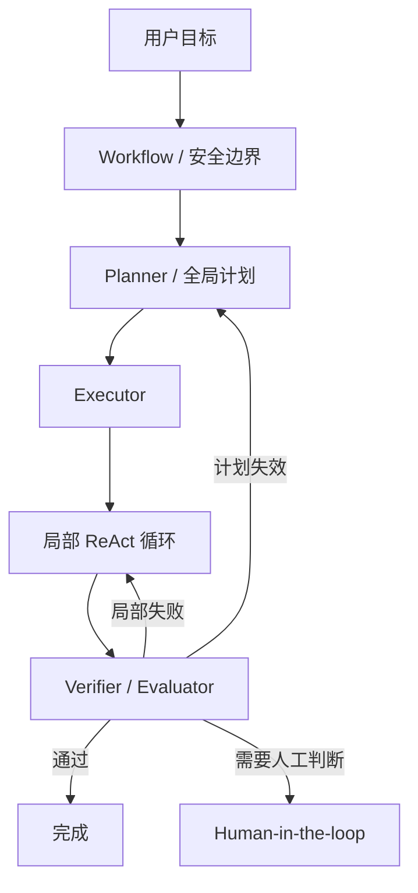
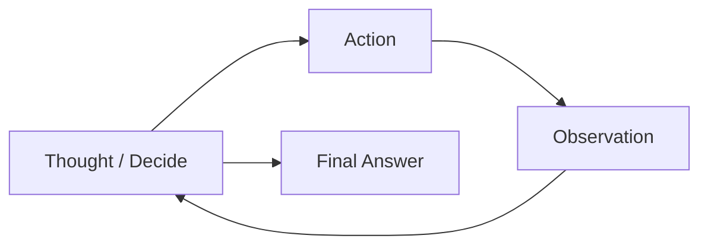
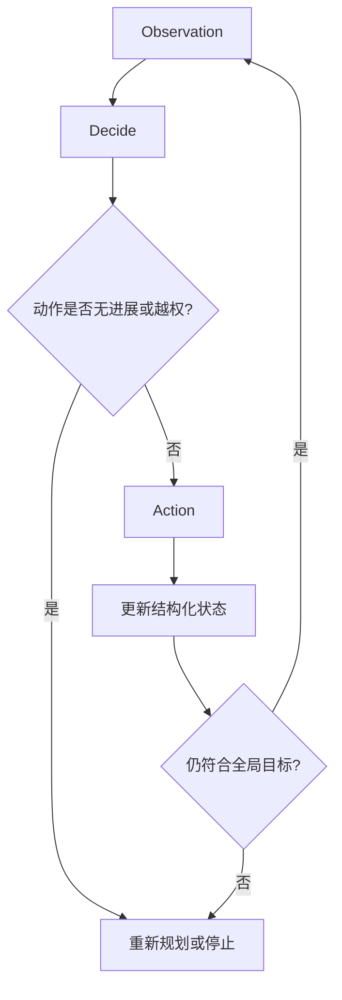
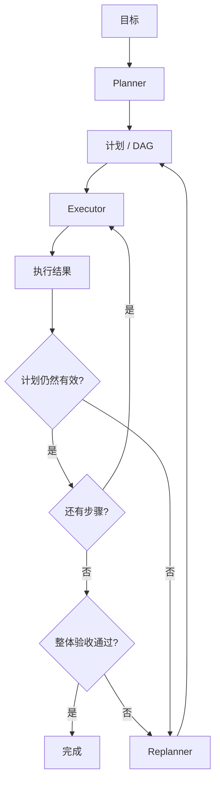
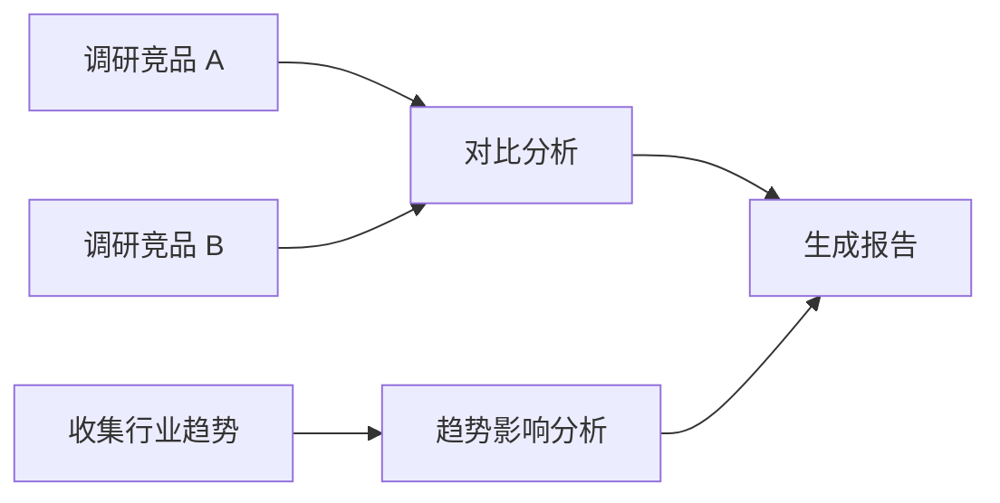
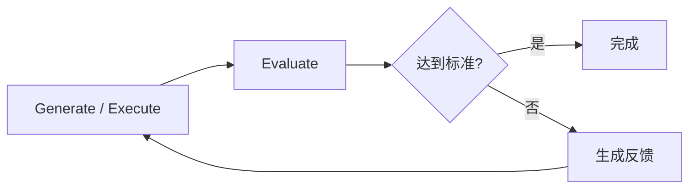
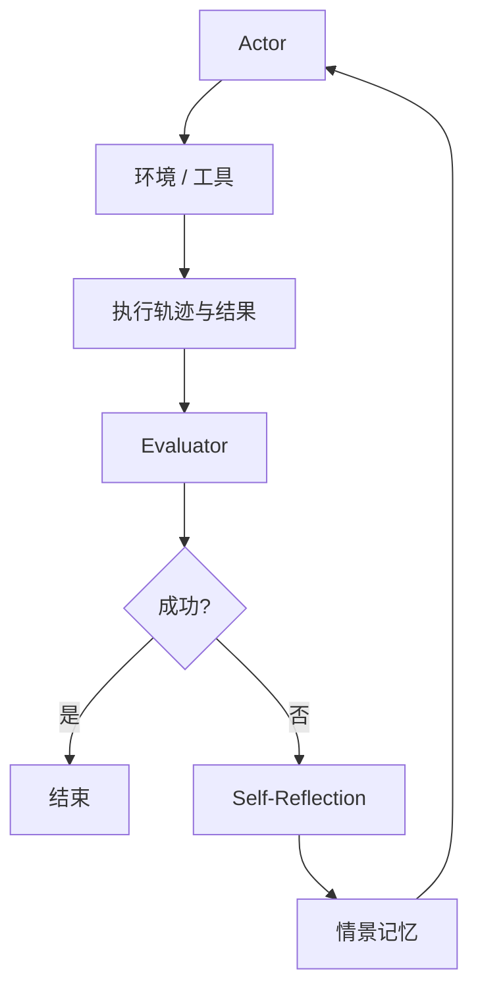
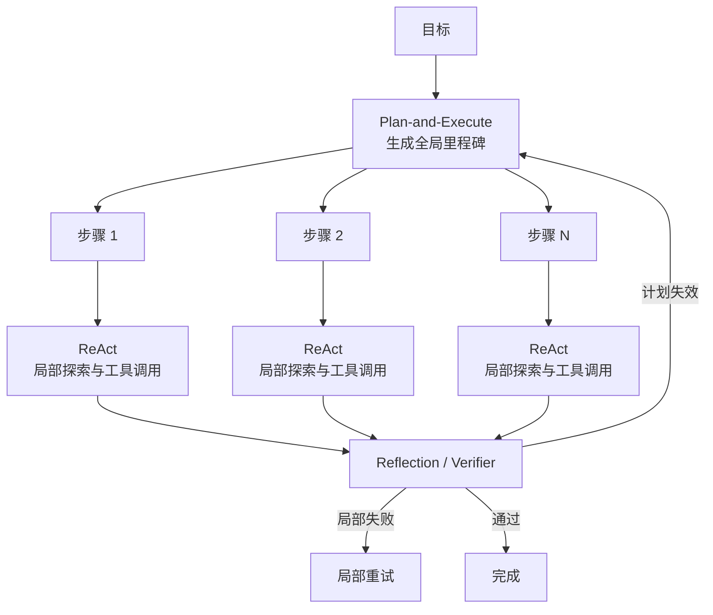
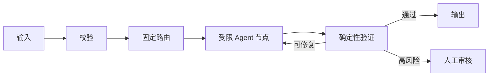
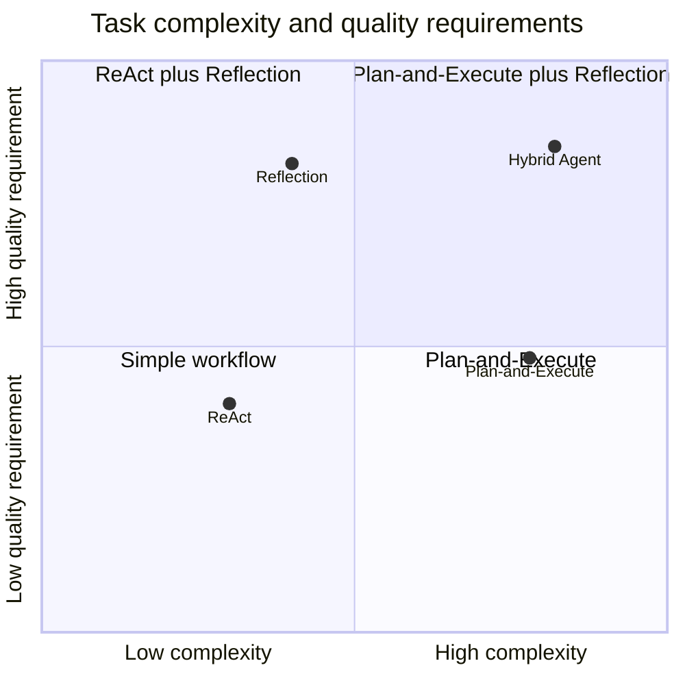

# 第四章：Agent 设计范式

## 4.1 什么是 Agent 设计范式

同样是“搜索资料后生成报告”，可以每查到一条结果就决定下一步，也可以先列计划再执行，还可以对初稿反复核验。Agent 设计范式描述的正是这些控制方式：

> **Agent 如何组织推理、规划、行动、观察、验证与重试。**

它不是某个特定框架，也不只是一个 Prompt 模板，而是一种运行时控制策略。

本章选取三类便于比较的基础范式，它们不是互斥或穷尽的分类：

1. **ReAct**：一边观察、一边决定下一步；
2. **Plan-and-Execute**：先建立全局计划，再执行和动态重规划；
3. **Reflection / Reflexion**：通过评估和反馈修订结果；其中 Reflexion 是带情景记忆的具体研究方法。

这三类范式经常混用，实际系统里更常见的是分层组合：



## 4.2 ReAct：推理与行动交替

ReAct（Reasoning and Acting）将推理与外部行动结合起来。经典表达是：

> **Thought → Action → Observation → Thought**

这是 [ReAct 原论文](https://arxiv.org/abs/2210.03629)的示意，不要求每次行动前都输出一段 Thought：原文在决策任务中允许稀疏出现推理步骤，也用这些步骤生成、跟踪和更新计划。其主要实验通过上下文示例运行，不在每次工具调用后更新模型权重；论文另有微调实验，不能与提示式 ReAct 混为一谈。



### 4.2.1 一轮 ReAct 如何运行

#### Thought

模型分析当前目标、状态和观察结果，并决定下一步策略。

#### Action

模型生成结构化动作，例如调用搜索工具。以下是调用语义示意，实际字段和调用 ID 由所用 API 决定：

```json
{
  "tool_call": {
    "name": "search_web",
    "arguments": {
      "query": "竞品 A 最新产品更新"
    }
  }
}
```

#### Observation

Runtime 执行 Tool，并将真实结果或错误返回给模型。模型基于新证据进入下一轮决策。

### 4.2.2 现代实现不应暴露完整 Thought

早期 ReAct 示例会让模型显式输出 Thought。工程实现不应把这段自由文本当成稳定的控制接口，更不必依赖向用户展示完整隐藏思维链来调试。

例如模型说“已经查到最新版价格”，运行轨迹却只有一次失败的搜索调用，应以工具结果为准。系统应记录目标、计划、调用参数、真实返回值及状态变化，并把“为什么继续搜索”表达为可核验的简短理由。循环因此更适合写成：

> **Observe → Decide → Act → Observe**

这些记录支持检查与追溯，但不等于模型内部计算的完整解释；推理文本的忠实性问题见[第五章](05-agent-reasoning-methods.md#553-不要把完整思维链当作可靠解释)。

### 4.2.3 ReAct 的决策形式

设当前目标为 $g$、状态为 $s_t$、观察为 $o_t$、可用上下文为 $c_t$，下一步动作可表示为：

$$
a_t \sim \pi_{\theta}(a\mid g,s_t,o_t,c_t)
$$

Runtime 执行动作后得到新的观察。用 `eₜ` 表示环境真实状态，区别于 Agent 保存的状态 `sₜ`：

$$
(e_{t+1},o_{t+1})\sim Env(\cdot\mid e_t,a_t)
$$

Agent 随后更新状态：

$$
s_{t+1}=Update(s_t,a_t,o_{t+1})
$$

观察可能不完整、过期或只表示请求已受理。更新的是 Agent 对环境的记录，不能据此假设它已经掌握全部真实状态。

### 4.2.4 ReAct 的优势

- 实现简单；
- 能及时利用最新环境反馈；
- 适合无法预先获得完整信息的任务；
- 工具失败后可以立即调整；
- 可用于短任务和探索性任务，收益取决于工具返回的信息是否有用。

原论文覆盖 HotpotQA、FEVER、ALFWorld 和 WebShop。检索可补充事实，但错误查询或无关结果也会误导后续决策；这些结果不证明 ReAct 在所有任务上优于 CoT，更不保证工具调用次数越多越准确。

### 4.2.5 ReAct 的局限

ReAct 常被概括为“走一步看一步”，其主要风险包括：

- 默认不强制维护可调度的全局任务结构，但可以在推理中制定计划；
- 串行的“调用工具后再决策”需要模型往返，批量调用可减少部分开销；
- 容易重复搜索或调用相同工具；
- 长任务中目标和约束可能被上下文噪音稀释；
- 局部合理的动作未必形成全局最优路径；
- 完成条件模糊时容易过早停止或持续循环。

这里的“局部最优”是一个直观类比，不是严格的优化保证。模型选择的动作甚至不一定是当前局部最优，只是根据当前上下文生成的候选动作。

### 4.2.6 改进 ReAct

生产系统通常加入：

- 始终可见的目标和验收条件；
- 结构化任务状态；
- Todo 或阶段检查点；
- Tool Call 去重；
- 无进展检测；
- 最大步骤、时间和费用预算；
- 周期性全局目标复核；
- 关键步骤的外部验证。



## 4.3 Plan-and-Execute：规划与执行解耦

Plan-and-Execute 将全局规划与局部执行分开。成熟实现通常包含三个角色：

1. **Planner**：生成带依赖关系的计划；
2. **Executor**：执行一个或多个计划步骤；
3. **Replanner**：根据结果更新剩余计划或结束任务。

Planner、Executor 和 Replanner 可以使用不同模型，也可以由同一个模型在不同上下文中承担。



### 4.3.1 计划不应只是自然语言列表

一个可靠的计划步骤最好包含：

- 唯一 ID；
- 目标；
- 依赖步骤；
- 所需输入；
- 推荐 Tool 或执行器；
- 预期输出；
- 验收条件；
- 风险等级；
- 失败和回退策略。

```json
{
  "id": "compare-products",
  "goal": "比较竞品 A 与竞品 B 的核心能力",
  "depends_on": ["research-a", "research-b"],
  "inputs": ["artifact://research-a", "artifact://research-b"],
  "success_criteria": [
    "至少覆盖功能、定价和目标用户",
    "每项关键结论包含来源"
  ]
}
```

结构化计划比自由文本列表更容易调度、验证和恢复。

但“列表中的步骤都做完了”不等于用户目标已经完成。例如竞品 A 和 B 各自的报告都有来源，却分别使用年付价和月付价，比较结果仍然不成立。因此图中的整体验收要检查跨步骤约束，而不能只数 `done` 状态。

### 4.3.2 动态重规划

稳定、充分已知的任务可以执行一次性计划；环境或前提会变化时，需要重规划机制。每个关键步骤完成后，Replanner 应判断：

- 执行结果是否达到验收条件；
- 关键假设是否仍然成立；
- 后续步骤是否仍有必要；
- 是否需要插入、删除或重排步骤；
- 是否可以并行执行；
- 是否需要人工确认。

设当前计划为 $P_t$，新观察为 $o_{t+1}$，重规划可以表示为：

$$
P_{t+1}=R(P_t,o_{t+1},g,s_t)
$$

其中 $R$ 表示 Replanner。

### 4.3.3 动态插入步骤示例

原始计划：

```text
1. 搜索竞品 A
2. 搜索竞品 B
3. 对比分析
```

执行第一步后发现竞品 A 刚发布重大版本，计划更新为：

```text
1. 搜索竞品 A
2. 调研竞品 A 的重大版本更新
3. 搜索竞品 B
4. 对比分析
```

此时计划仍提供全局方向，但可以根据环境反馈演化。

### 4.3.4 Plan-and-Execute 的优势

- 对复杂任务具有更强的全局视野；
- 可以显式表达步骤依赖；
- 计划可以在执行前由人工审核；
- 容易分配不同模型和工具；
- 可以将独立步骤并行化；
- 更适合 checkpoint 和故障恢复。

### 4.3.5 Plan-and-Execute 的局限

- 规划和重规划增加延迟与成本；
- 初始计划可能建立在错误假设上；
- 规划器可能生成不可执行或过度细化的步骤；
- 频繁重规划可能退化成高成本 ReAct；
- Planner 与 Executor 之间可能出现语义偏差；
- 长计划可能在环境变化后迅速失效。

因此，计划粒度应与任务稳定性匹配：环境变化越快，计划越应保持高层和短周期。

## 4.4 减少往返与支持并行的变体

### 4.4.1 ReWOO

ReWOO（Reasoning WithOut Observation）将 Planner、Worker 和 Solver 解耦：Planner 在获取工具观察前生成带变量引用的计划，Worker 执行并绑定结果，Solver 结合计划与证据生成答案。“Without Observation”限定规划阶段，不表示最终答案无需工具观察。

```text
#E1 = Search["指定赛事本年度决赛队伍"]
#E2 = LLM["从 #E1 中提取第一支队伍"]
#E3 = Search["#E2 的核心球员数据"]
```

以上是教学伪代码，不是通用工具协议。Worker 必须把 `#E1`、`#E2` 替换为实际输出，检查引用与依赖，而不是把变量名原样送给搜索工具。它减少了规划模型的往返，但无法预知所有条件分支；依赖返回内容才能决定是否添加新步骤时，仍需重规划或退回交互式执行。

### 4.4.2 DAG Planning

当计划包含明确依赖时，可以将其表示为有向无环图：



数据依赖已满足、没有共享写冲突且资源允许的步骤可以并行执行。DAG 只表达一版计划内的无环依赖；重试和重规划循环应由外层状态机管理。

### 4.4.3 LLMCompiler

LLMCompiler 类架构通常包含：

- Planner：生成或流式输出任务 DAG；
- Task Fetching Unit：依赖满足后立即调度任务；
- Executor：实际执行已就绪的工具任务。

这是 [LLMCompiler 论文](https://arxiv.org/abs/2312.04511)列出的三个组件；带重规划的实现还可以加入 Joiner，汇总结果并决定结束或继续。不要把 Joiner 当作执行工具的 Executor。

这类设计关注的不只是规划质量，也关注执行并行度、模型调用次数和总体延迟。

## 4.5 Reflection：通过反馈改进结果

Reflection 在生成或执行之后加入评估环节：



评估可以发生在：

- 单个步骤完成后；
- 一个里程碑完成后；
- 整个任务完成后；
- 只有高风险或低置信度时。

### 4.5.1 验证器的优先级

在工程实现里，Reflection 不能停留在“让同一个 LLM 再看一遍”。只要拿得到确定性或外部验证信号，就优先用这些信号：

1. 编译器、单元测试和静态分析；
2. Schema、规则和约束检查；
3. 数据库或 API 返回的真实状态；
4. 人工审核；
5. 独立模型或 LLM-as-a-Judge；
6. 同一模型的自我评价。

这不是固定的可信度排名。编译通过不等于业务正确，测试可能漏测，API 成功可能只代表受理；应按每项验收条件选择证据。LLM Judge 不得以“总体质量不错”为由覆盖测试失败或权限拒绝。

### 4.5.2 Reflection 的适用场景

- 代码生成与修复；
- 文案和报告优化；
- 翻译；
- 需要来源完整性的研究；
- 具有明确评分规则的结构化输出；
- 可以通过模拟器或测试环境验证的任务。

### 4.5.3 Reflection 的风险

- 评估模型可能与生成模型共享相同盲点；
- 没有明确标准时，反思可能只是改写；
- 多轮优化可能出现质量退化；
- 反思文本可能污染后续上下文；
- Agent 可能针对评分规则“投机”而非真正完成目标；
- 成本和延迟随轮数增加。

因此，需要最大反思轮数、最低改进阈值和清晰的成功标准。

## 4.6 Reflexion：带经验记忆的反思

Reflexion 是 Reflection 的一种具体范式。它不更新模型权重，而是把任务反馈转化为自然语言经验，并将其保存在情景记忆中供下一次尝试使用。

原方法包含 Actor、Evaluator、Self-Reflection 三个功能模块，并用情景记忆保存反馈：

- **Actor**：执行任务；
- **Evaluator**：评价轨迹或结果；
- **Self-Reflection**：将失败信号总结为可操作经验；
- **Episodic Memory**：在后续尝试中提供这些经验。

这里不是要求调用四个独立模型：记忆是存储，Evaluator 也可以使用环境奖励、规则或测试。模块如何实现取决于任务能提供什么反馈。



### 4.6.1 “错题本”类比

普通重试可能只是再次生成；Reflexion 会先总结：

- 哪个假设错误；
- 哪一步行动无效；
- 哪个反馈被忽略；
- 下一次应该采用什么不同策略。

这些经验作为额外上下文加入下一次尝试，因此类似“做错题、分析原因、带着经验重做”。

### 4.6.2 HumanEval 结果应如何解读

Reflexion 论文报告：在其 2023 年的实验设置中，基于 GPT-4 的 Reflexion 在 HumanEval Python 上达到 **91.0% pass@1**，表 1 中 GPT-4 单次生成基线为 **80.1%**（摘要取整为 80%）。

这里的 `pass@1` 指最终提交一个候选接受评测，不表示整个系统只生成一次或只调用一次模型。Reflexion 使用自生成测试、执行反馈和多次修订，再以保留的基准测试评价最终程序；反思循环不能访问用于最终计分的隐藏测试。单次生成基线与这个循环的计算预算不同，因此不能把差值全部归因于“反思提示词”。

这个数字说明反思与执行反馈在特定实验中具有价值，但不能直接推导为：

- 所有模型都能从 80% 提升到 91%；
- 所有代码任务都能获得相同提升；
- 生产项目中的仓库级任务也有相同效果；
- 增加反思轮次一定持续提高质量。

同一论文的 MBPP Python 结果反而从 80.1% 降到 77.1%，说明测试质量和任务分布会改变效果方向。模型版本、Prompt、测试生成方式和基准污染也会影响结果；实际评估应增加等预算重采样、仅测试修复等对照。

### 4.6.3 记忆污染问题

模型生成的反思不一定正确。如果未经验证就写入长期记忆，错误经验可能影响未来任务。

更安全的策略是：

1. 默认将反思保留在当前任务的临时记忆中；
2. 使用测试、环境反馈或人工审核验证；
3. 只有稳定、可复用的经验才晋升为长期记忆、Skill 或规则；
4. 为长期经验记录来源、版本和适用范围。

## 4.7 三种范式如何组合

实际系统里常见的分层组合如下：



职责划分为：

- **Plan-and-Execute**：保持全局方向；
- **ReAct**：处理局部未知和工具反馈；
- **Reflection**：检查质量并产生改进反馈；
- **Workflow**：限制整体路径、权限和预算。

图中的完成出口还需要整体验收：确认当前计划的必要节点已完成、Artifact 版本一致，且跨步骤约束满足。单个子任务通过 Verifier，不代表整个目标完成。

## 4.8 Agentic Workflow：生产环境里的常见做法

Agentic Workflow 用确定性流程包围概率性决策：

按 Anthropic《Building Effective Agents》的术语，Router、固定并行分支和 Evaluator-Optimizer 都可以是 Workflow：分别负责分流、聚合独立工作、按反馈迭代。循环或多次 LLM 调用本身不构成自主 Agent；关键在于后续路径是预先编码，还是由模型在运行时动态选择。



以客服系统为例：

- 意图识别、权限检查和输出审核由 Workflow 控制；
- 知识检索节点可以使用 ReAct 动态决定查询方式；
- 复杂问题使用 Plan-and-Execute 拆分；
- 最终答案使用引用检查或 Reflection；
- 退款、改价等写操作必须经过权限和业务规则检查；超出预授权范围时再转人工确认。

这种方式将自主性限制在真正需要灵活性的局部范围内。

## 4.9 如何选择范式

| 任务特征 | 推荐范式 |
|---|---|
| 步骤少、信息需要边做边获取 | ReAct |
| 步骤多、依赖复杂、需要全局视野 | Plan-and-Execute |
| 子任务存在明确依赖且可并行 | DAG Planning |
| 每次工具调用都咨询大模型成本过高 | ReWOO 或分层执行 |
| 输出质量要求高且存在验收标准 | Reflection |
| 希望从失败经验中改进下一次尝试 | Reflexion |
| 主流程稳定、局部存在未知 | Agentic Workflow |
| 高风险、强合规、路径完全已知 | 确定性 Workflow |

还可以从两个基础维度判断：



二维图只是帮助理解。实际选择还需考虑风险、延迟、成本、可验证性和环境变化速度。

## 4.10 停止、预算与无进展检测

所有范式都必须具有停止条件：

- 达到明确成功标准；
- 达到最大步骤数；
- 达到 Token 或费用预算；
- 超过运行时间；
- 连续多轮没有产生新信息；
- 在没有新信息、合理轮询或可恢复错误的情况下重复相同 Tool Call；
- 反思后评分不再改善；
- 触发安全策略；
- 需要人工判断；
- 用户主动取消。

可以定义一个受限执行预算：

$$
B=(N_{max},T_{max},C_{max},R_{max})
$$

其中：

- $N_{max}$：最大步骤数；
- $T_{max}$：最大运行时间；
- $C_{max}$：最大费用或 Token；
- $R_{max}$：最大重试或反思次数。

当预算耗尽时，系统应明确报告未完成状态和已有结果，而不是伪装成成功。

## 4.11 生产级设计检查表

### ReAct

- 是否持续保留目标和成功标准？
- 是否检测重复动作和无进展循环？
- Observation 是否来自真实工具结果？
- Tool 错误是否以结构化形式返回？

### Plan-and-Execute

- 计划是否具有依赖、输入和验收条件？
- 任务前提会变化时，是否有重规划入口？
- 什么事件会触发重规划？
- 能否只重规划受影响的局部步骤？

### Reflection / Reflexion

- 是否有客观验证器？
- 评价标准是否明确？
- 最大优化轮数是多少？
- 反思是否可能污染长期记忆？
- 改进是否值得额外延迟和成本？

### Agentic Workflow

- 哪些节点必须由确定性代码控制？
- 哪些节点确实需要 Agent 自主性？
- 高风险动作是否经过审批？
- 是否保留完整 Trace、状态和审计记录？

## 4.12 Anthropic 原则的准确理解

“能用 Workflow 解决，就不要用 Agent”是对 Anthropic 工程建议的通俗概括，但不是原文中的绝对规则。

更接近原意的说法是：

> **从能够满足需求的最简单方案开始，只有在更高复杂度能够带来可测量收益时，才升级为多步 Workflow 或自主 Agent。**

Anthropic 的区分是：

- 路径明确、需要一致性和可预测性时，优先使用 Workflow；
- 路径无法预先确定、需要模型动态决策时，才使用 Agent；
- 很多问题通过单次 LLM 调用、检索和示例优化就能解决。

复杂度本身不是能力。只有当任务成功率、质量或可扩展性得到可验证提升时，增加 Agent 自主性才有价值。

## 4.13 本章总结

ReAct、Plan-and-Execute 与 Reflection 分别解决三个不同问题：

1. **ReAct**：如何根据最新环境反馈选择下一步；
2. **Plan-and-Execute**：如何维持复杂任务的全局结构；
3. **Reflection / Reflexion**：如何利用验证和失败经验提升质量。

组合时应明确每个控制环修改什么状态、由谁验收，以及何时停止。短任务不必配置全部角色；增加 Planner 或 Critic 后，仍要检验其收益是否超过往返延迟、状态管理和误判成本。

## 参考资料

- [ReAct: Synergizing Reasoning and Acting in Language Models](https://arxiv.org/abs/2210.03629)
- [Reflexion: Language Agents with Verbal Reinforcement Learning](https://arxiv.org/abs/2303.11366)
- [Reflexion 原文实验设置与表 1–2](https://arxiv.org/html/2303.11366v4)
- [ReWOO: Decoupling Reasoning from Observations for Efficient Augmented Language Models](https://arxiv.org/abs/2305.18323)
- [An LLM Compiler for Parallel Function Calling](https://arxiv.org/abs/2312.04511)
- [LangChain: Planning Agents](https://www.langchain.com/blog/planning-agents)
- [Anthropic: Building Effective Agents](https://www.anthropic.com/engineering/building-effective-agents)
