# Chapter 5: Model Reasoning and Search Methods for Agents

## 5.1 How reasoning methods relate to agent patterns

Must you choose between ReAct and CoT? No. ReAct organizes an action-and-feedback loop; CoT can help solve a problem within one iteration. Reasoning methods and agent design patterns operate at different levels:

> **A reasoning method determines how an individual problem-solving attempt generates, searches, and selects candidates. An agent pattern determines how the system organizes models, tools, state, and environmental feedback.**

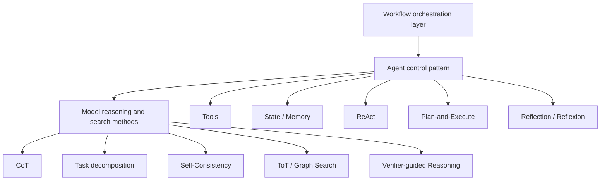

For example:

- Each ReAct iteration can use internal sequential reasoning to select a tool.
- A Plan-and-Execute planner can decompose a task or search over several plans.
- Reflection can use verifiers, scoring models, or Self-Refine.
- A workflow's routing node may need only simple classification, not elaborate reasoning.

Reasoning methods are an agent's “local decision algorithms”; agent patterns are its “system-level control loops.”

## 5.2 What is model reasoning?

The Chinese term *推理* often corresponds to two different concepts. **Inference** means running a trained model to compute outputs and generate tokens. **Reasoning** means working through a problem in multiple steps. This chapter concerns the latter and the test-time compute strategies that support it. Not every model inference involves identifiable multistep reasoning.

For a typical autoregressive language model, given input `x`, the joint probability of output token sequence `y = (y₁, …, yₙ)` factors as:

$$
P(y \mid x)=\prod_{t=1}^{n}P(y_t \mid x,y_1,\ldots,y_{t-1})
$$

A “reasoning method” does not magically add a new capability outside the model. It changes computation at inference time by:

- Generating intermediate representations.
- Decomposing a problem into subproblems.
- Sampling multiple candidates.
- Searching multiple reasoning paths.
- Obtaining external feedback from programs, retrieval, or tools.
- Scoring candidates with verifiers.
- Regenerating in response to feedback.

In an engineering system, the process is closer to:

> **Generate candidates → obtain evidence → verify candidates → allocate more compute → select a result**

Also distinguish when the computation happens:

| Mechanism | What it changes | Does applying this step update parameters? |
|---|---|---|
| SFT, RL, distillation | The model's generation policy or a verifier | Yes |
| CoT prompts, in-context examples | The current conditioning input and intermediate generation | No |
| Self-Consistency, ToT, Best-of-N | Candidate count, search state, and selection | Usually not |
| Tool feedback, Reflexion memory | Evidence, context, and the next attempt | No |

A trained reasoning model can also use test-time search. Using test feedback to select or revise candidates is different from using test scores as RL rewards and updating parameters with an optimizer.

## 5.3 A broad classification of reasoning methods

Common methods fall into four groups according to how they organize test-time computation. These are not rungs on a capability ladder that every system must climb; they can also be combined:

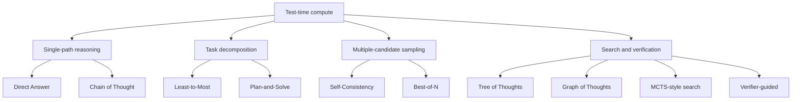

For the same base model and similar per-generation lengths, costs can be compared roughly:

| Method | Number of candidate paths | Search? | Cost |
|---|---:|---:|---:|
| Direct Answer | 1 | No | Low |
| CoT | 1 | No | Low to medium |
| Task decomposition | 1 main path, multiple subproblems | Limited | Medium |
| Self-Consistency | Multiple | Aggregation only | Medium to high |
| ToT / Graph Search | Multiple | Yes | High |
| Verifier-guided Search | Multiple | Yes, with repeated scoring | High |

More complex methods are not necessarily better. Additional complexity is worthwhile only when the extra reasoning compute improves task success.

This is not a fixed ranking. One long internal reasoning sequence may cost more than several short candidates. Batching reduces round trips but does not eliminate generated tokens, and caching does not make verification free.

## 5.4 Direct Answer: establish the simplest baseline

Direct Answer asks the model to produce an answer without explicitly requesting intermediate reasoning.

This describes the prompt and output style, not proof that “the model did no reasoning.” A model with a hidden reasoning budget may consume many internal reasoning tokens even when its visible answer is one sentence.

Suitable uses include:

- Simple fact extraction.
- Rewriting and format conversion.
- Classification with clear boundaries.
- Patterns the model already knows well.
- Strict latency requirements.

First test whether this is a sufficient baseline. If a direct call already works reliably, there is no need to add multiround reasoning, search, or an agent loop.

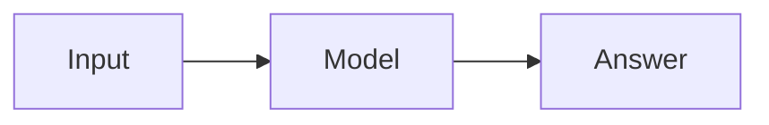

## 5.5 Chain of Thought: sequential reasoning

This section focuses on CoT's reasoning mechanism and limitations. See [Chapter 11](11-llm-agent-planning.md) for the boundary between CoT and action planning, and [Chapter 14](../05-production/14-agent-evaluation.md) for why a recordable trace is not hidden CoT.

### 5.5.1 Basic idea

CoT (Chain of Thought) generates intermediate reasoning steps, breaking a complex problem into a continuous reasoning chain:

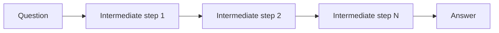

In probabilistic terms, the intermediate reasoning sequence can be represented by an auxiliary variable $z$. Marginalizing it out gives the distribution of the final answer:

$$
P(y\mid x)=\sum_z P(y,z\mid x)
$$

Single-path CoT actually generates just one candidate reasoning sequence $z$, then an answer $y$ conditioned on it.

The equation is a decomposition of a joint distribution. It does not mean that one CoT decoding run enumerates all `z`, or that the generated text captures all of the model's internal computation. Original CoT prompting changes the input through worked examples; it does not update parameters.

### 5.5.2 Few-shot CoT and zero-shot CoT

#### Few-shot CoT

Provide examples with intermediate steps in the prompt so the model can follow a similar reasoning structure.

#### Zero-shot CoT

Instead of complete examples, use a short instruction requesting stepwise analysis. A historically common prompt is “Let's think step by step.”

For models trained for reasoning, repeatedly asking them to “think step by step” does not necessarily help. [OpenAI's reasoning prompting guidance](https://developers.openai.com/api/docs/guides/reasoning-best-practices) explicitly recommends direct, clear task instructions for its reasoning models without an additional request to elaborate CoT. That is not a universal rule for every vendor or model version.

### 5.5.3 Do not treat a complete chain of thought as a reliable explanation

Model-generated CoT:

- May rationalize an answer after the fact.
- May omit factors that actually influenced the answer.
- May include plausible but incorrect steps.
- Need not faithfully reflect the model's internal computation.
- May disclose context or security information that should remain private.

Production systems should therefore not equate “a long reasoning output” with “a reliable answer.”

For users, prefer to show:

- A concise basis for the conclusion.
- Citations and data sources.
- Structured plans.
- Tool calls and observations.
- Reproducible calculations.
- Verification results.

> **Verifiable evidence matters more than a lengthy chain of thought.**

### 5.5.4 When CoT is useful

- Multistep mathematical and logical problems.
- Rule-based tasks requiring sequential analysis.
- Simple task decomposition.
- Problems for which a single path is sufficient.

### 5.5.5 Limitations of CoT

- Early mistakes can propagate through the entire chain.
- Only one path is explored.
- Longer reasoning does not imply greater correctness.
- Tokens, latency, and cost increase.
- Without external verification, an answer can be internally consistent but wrong.

The [original paper](https://arxiv.org/abs/2201.11903) reports gains for the tested models, scales, and arithmetic, commonsense, and symbolic tasks. It does not establish that adding one instruction gives any model reliable planning ability. Research on explanation faithfulness also finds that biased information in prompts can influence models without those influences being acknowledged in CoT.

## 5.6 Task decomposition: make the problem smaller first

Decomposition aims to make each subproblem easier, not to make reasoning longer.

### 5.6.1 Least-to-Most

Least-to-Most Prompting first identifies simpler subproblems, then solves them in dependency order.

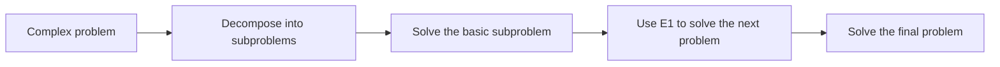

It is suitable when:

- Later steps depend on earlier results.
- The problem decomposes naturally.
- A single direct reasoning attempt is likely to miss conditions.

### 5.6.2 Plan-and-Solve

Plan-and-Solve first generates a solution plan, then reasons through it:

```text
Plan:
1. Extract the known conditions
2. Identify the variables to calculate
3. Select the formulas
4. Perform the calculations and check them
```

It resembles Plan-and-Execute at the agent level, but operates at a different layer:

| Plan-and-Solve | Plan-and-Execute |
|---|---|
| Primarily solves problems within a model's response | Executes tasks in an agent system |
| Substeps are usually still model reasoning | Steps may invoke tools, agents, or workflows |
| Usually does not change the external environment | Receives actual environmental feedback |
| Usually short-lived | Can run for a long time with persistent state |

### 5.6.3 When decomposition fails

Decomposition can introduce problems of its own:

- Incorrect subproblem boundaries.
- Overlooked cross-step constraints.
- Subproblem answers that cannot be combined.
- Decomposition costs exceeding the task's own cost.
- Incorrect intermediate results treated as facts by later steps.

Dependencies, interfaces, and the final combined result still need checking.

## 5.7 Self-Consistency: voting across multiple paths

Self-Consistency samples multiple candidate reasoning paths rather than generating just one, then aggregates their final answers.

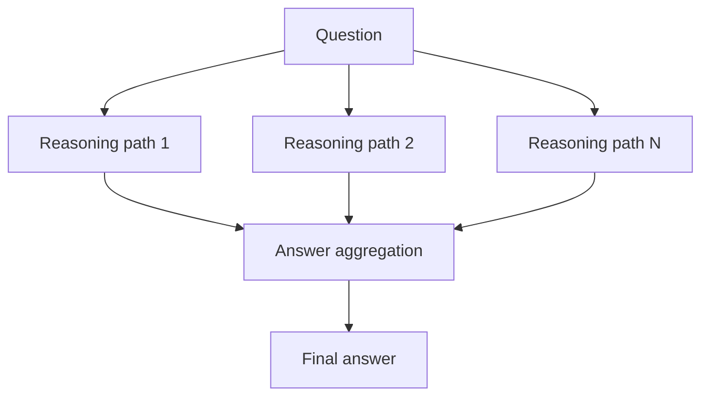

If path $i$ produces answer $y_i$, majority voting can be written as:

$$
\hat{y}=\arg\max_y \sum_{i=1}^{N} I(y_i=y)
$$

Here, $I$ is an indicator function.

Implementations must normalize answers first. Units, equivalent fractions, letter case, and option identifiers cannot simply be compared as raw strings. Define fallback rules for ties and unparseable answers. The vote share is not a calibrated probability of correctness. Even with independent random samples, the same model may assign most of its probability to one wrong answer; voting cannot remove that systematic bias.

For example, candidates answering “0.5 hours,” “30 minutes,” and “60 minutes” should place the first two in the same group. But if one means a one-way trip and another a round trip, numerical conversion alone is insufficient. Normalization must retain the object and scope requested by the question.

### 5.7.1 Why it can work

If different reasoning paths make different mistakes, the correct answer may appear more consistently across samples.

### 5.7.2 Suitable conditions

- Final answers can be normalized and compared.
- Multiple plausible reasoning paths exist.
- A single sample has a relatively high error rate.
- Several times the model-call cost is acceptable.

### 5.7.3 Limitations

- The majority can agree on a wrong answer.
- Candidates may be highly correlated rather than genuinely diverse.
- Open-ended text is difficult to vote on directly.
- Call cost grows roughly with sample count.
- Voting cannot replace external fact verification.

## 5.8 Best-of-N: generate candidates, then score them

Best-of-N generates $N$ candidates and selects the best using a scoring function or verifier:

$$
y^*=\arg\max_{y_i} V(x,y_i)
$$

Here, $V$ is the verifier or scoring function.

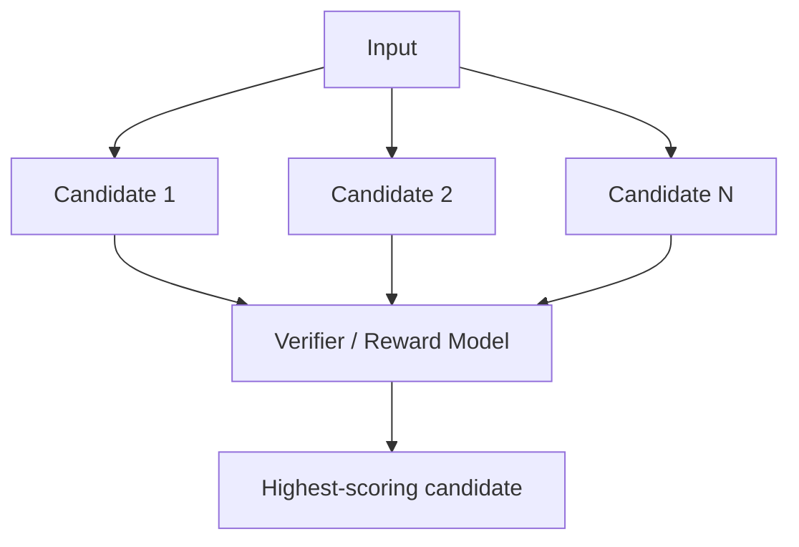

The distinction from Self-Consistency is:

| Self-Consistency | Best-of-N |
|---|---|
| Usually aggregates final answers | Scores complete candidates |
| Does not necessarily need a separate verifier | Depends on a scoring function or verifier |
| Fits tasks whose answers can be voted on | Fits tasks whose candidate quality can be compared |

Verifiers can include:

- Unit tests.
- Compilers.
- Mathematical or rule checkers.
- Simulators.
- Human scoring.
- Independent models.
- LLM-as-a-Judge.

Prefer verifiers that closely match the real success criteria.

Distinguish “a correct answer exists among the candidates” from “the system selected it.” Oracle best-of-N, which selects using hidden answers, is an upper bound, not a deployable system result. Increasing `N` may also make it easier to find candidates that fool the scorer. Keep final acceptance data separate from search-time tests and scorer-training data.

## 5.9 Tree of Thoughts: searching a reasoning tree

ToT (Tree of Thoughts) treats intermediate reasoning states as search-tree nodes, expands several candidates at each node, then scores, selects, or backtracks.

In the original method, an external controller maintains partial solutions, candidates, and the search strategy; the model generates and evaluates units of text. A single prompt saying “simulate three experts and backtrack” does not implement the paper's ToT search.

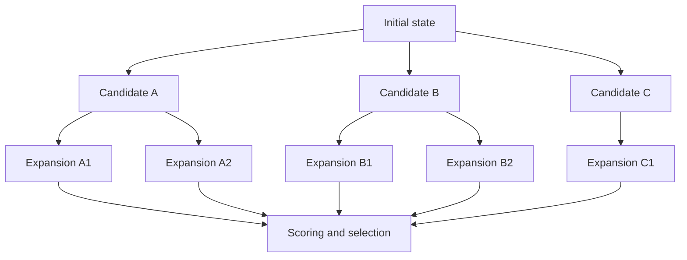

### 5.9.1 Core components

ToT usually needs:

1. **State**: the current partial solution.
2. **Generator**: expands candidate thoughts.
3. **Evaluator**: evaluates candidate states.
4. **Search algorithm**: BFS, DFS, beam search, or similar.
5. **Termination**: an acceptable solution is found or the budget runs out.

### 5.9.2 How it differs from CoT

| CoT | ToT |
|---|---|
| One reasoning chain | Multiple candidate paths |
| Usually no backtracking | Can backtrack |
| Lower cost | Higher cost |
| Fits linear problems | Fits problems requiring exploration and selection |

### 5.9.3 Suitable uses

- Planning problems.
- Puzzles and combinatorial search.
- Exploring creative proposals.
- Complex tasks with several intermediate decisions.
- Tasks where partial solutions can be evaluated.

### 5.9.4 Limitations

- The number of branches may grow exponentially.
- Intermediate-state scores may be unreliable.
- LLM-generated candidates may lack diversity.
- Search has high cost and latency.
- Partial-solution quality is hard to define for many real tasks.

Production implementations commonly constrain search with beam width, maximum depth, and budget-based pruning.

The original paper's main experiments cover Game of 24, creative writing, and mini crosswords—not general web or repository tasks. Its Game of 24 result—GPT-4, 4% for CoT and 74% for ToT—belongs to a particular problem set, search width, and evaluation setup, not an equal-budget comparison with single-path CoT. Specifically, the reported 74% uses breadth-first search with `b=5` on 100 games indexed 901–1,000; the CoT figure is average sampled performance. Being able to score partial solutions is an important precondition: if the evaluator prematurely prunes a correct branch that needs a temporary detour, search may fail to find a solution.

## 5.10 Graph of Thoughts and graph search

A tree assumes that paths expand independently downward. Real reasoning may need to combine, reuse, or iteratively improve intermediate results.

Graph of Thoughts organizes reasoning states as a graph:

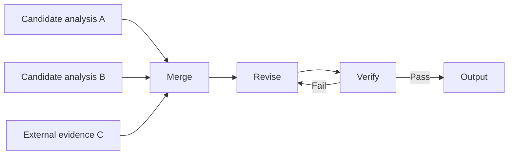

A graph can represent:

- Merging multiple candidates.
- Reusing intermediate results.
- Dependencies.
- Repeated revision.
- Parallel reasoning.

Its orchestration and state management are more complex than ToT's. An engineering system can implement some similar operations with a DAG workflow, state graph, or task graph. But these general graph structures do not automatically implement the original Graph of Thoughts method. A task dependency graph describes “what must happen first”; a reasoning graph must also define how candidates are transformed, merged, and scored. Using a graph framework does not justify importing the paper's experimental conclusions.

## 5.11 MCTS-style reasoning search

Monte Carlo tree search methods commonly repeat four operations over candidate states:

1. Selection: choose a node worth exploring.
2. Expansion: generate new candidate steps.
3. Evaluation: assess candidate quality.
4. Backpropagation: propagate the evaluation to ancestor nodes.

Selection usually balances exploration of new branches against exploitation of high-scoring ones using visit counts and accumulated values. Evaluation may use environmental returns from rollouts or a learned value estimate. Here, backpropagation updates tree-node statistics; it is not neural-network backpropagation and does not automatically update LLM weights.

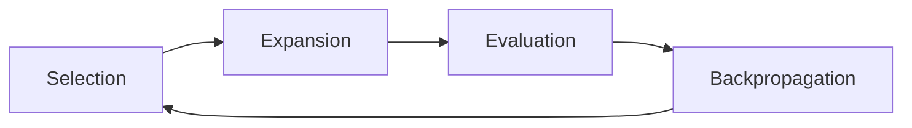

Such methods are suitable when:

- There is a clear goal or reward signal.
- Outcomes can be simulated step by step.
- The search space is large.
- A substantial inference-time budget is acceptable.

For open-ended knowledge tasks, an unreliable evaluation function may mean that complex search only amplifies scoring bias at greater expense.

Action search also requires states that can be copied, reset, or simulated. Backtracking through text does not undo sent emails, payments, or database writes. Real tools with side effects cannot be treated as an unrestricted rollout environment for arbitrary branches.

## 5.12 Program-aided reasoning: delegate computation to programs

Models are not reliable executors of long arithmetic, exact state updates, or complex symbolic operations. Program-Aided Language Models (PAL) and Program of Thoughts (PoT) have the model generate a program, then delegate execution to an interpreter.

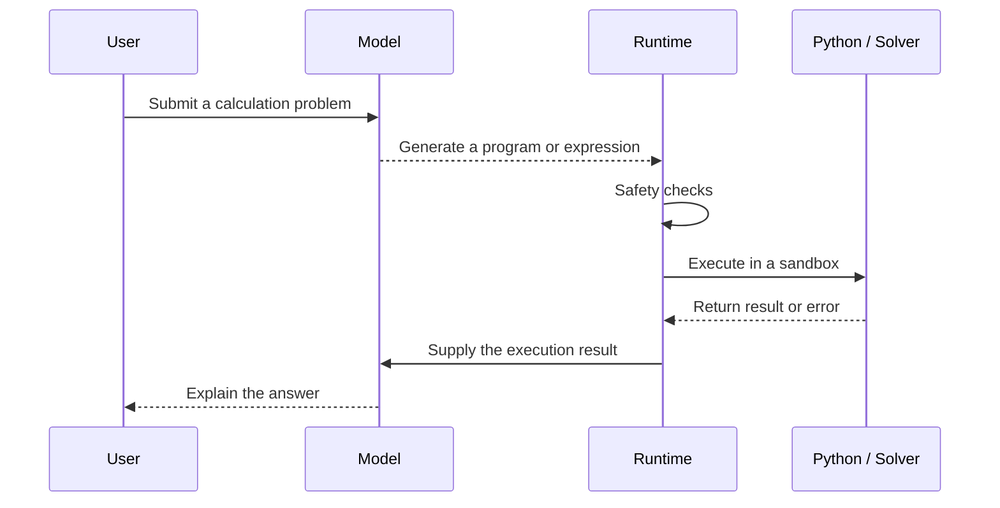

Suitable tasks include:

- Mathematical calculations.
- Data analysis.
- Date and unit conversions.
- Logical constraint solving.
- Problems that can be encoded as programs.

Important safeguards:

- Run code in a constrained sandbox.
- Prohibit unauthorized network and file access.
- Set time, memory, and output limits.
- Do not equate executable code with correct problem modeling.

Program execution does not automatically guarantee numerical exactness either. For an amount calculated from a unit price of 19.99 yuan and quantity 3, first decide whether to use decimal amounts or integer fen, and when to round. Binary floating point can introduce representation error; decimal arithmetic still has precision and rounding constraints. More importantly, if the model omits a discount or tax, the program merely computes the wrong formula more consistently. Acceptance checks should cover the business formula, numerical rules, and boundary inputs.

## 5.13 Tool-augmented reasoning: get facts from the environment

Reasoning cannot compensate for missing or outdated facts. Agents can obtain external evidence from search, databases, code executors, and domain APIs.

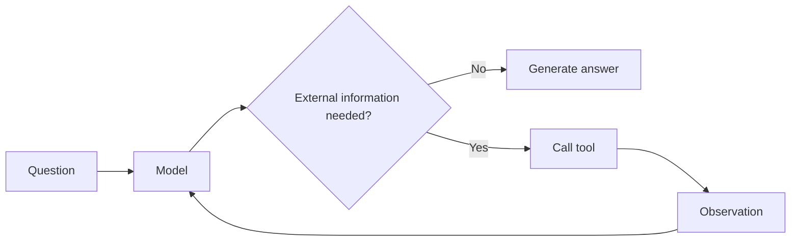

The main engineering work lies in:

- Deciding when a tool is needed.
- Choosing the correct tool.
- Generating valid arguments.
- Validating tool results.
- Handling conflicts and failures.
- Citing evidence in the answer.

Strong internal reasoning does not make external facts reliable. Prefer authoritative sources for real-time information and high-risk factual claims.

## 5.14 Retrieval-augmented reasoning

RAG supplies external knowledge, but retrieval and reasoning still need to work together:

1. Decide whether retrieval is needed.
2. Generate or rewrite the query.
3. Retrieve candidate documents.
4. Filter and rerank.
5. Reason from the evidence.
6. Check whether citations support the conclusions.
7. Retrieve again if necessary.

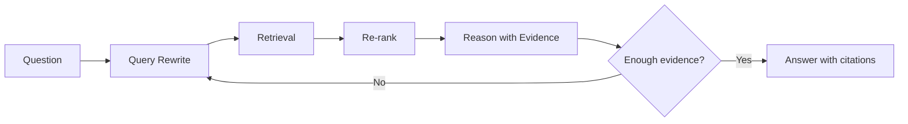

Multiple retrieval rounds may improve coverage but also introduce noise. Record which evidence supports each conclusion.

## 5.15 Verifier-guided reasoning

Verifier-guided reasoning uses a verifier to guide candidate generation, selection, and revision.

For candidate set $Y=\lbrace y_1,\dots,y_N\rbrace$, verifier scores are:

$$
v_i=V(x,y_i,e_i)
$$

Here, $e_i$ may contain test results, execution trajectories, or external evidence.

An outcome reward model (ORM) usually scores a complete candidate. A process reward model (PRM) supplies finer-grained signals for intermediate steps, useful for pruning or allocating search budgets. [Let's Verify Step by Step](https://arxiv.org/abs/2305.20050) studies training verifiers with process supervision. Training a PRM updates its parameters; ranking candidates with a fixed PRM does not. A PRM score is not a formal proof, and scores for correlated steps cannot simply be multiplied into an “answer correctness probability” without assumptions.

The system can:

- Select the highest-scoring candidate.
- Generate feedback for low-scoring candidates.
- Include that feedback in the next generation round.
- Stop when a threshold is reached.

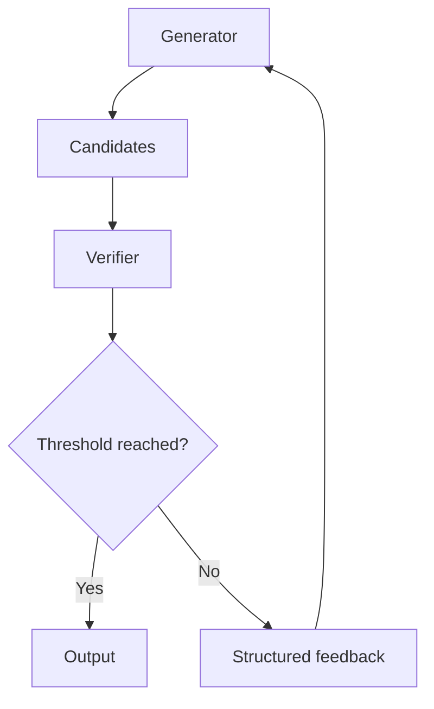

### 5.15.1 Choosing verification signals

Consider these signals according to the task's success criteria, rather than treating them as a fixed trust ranking:

1. Actual environmental outcomes.
2. Unit tests, compilers, and constraint solvers.
3. Deterministic rules and schemas.
4. Specially trained reward models.
5. Independent LLM judges.
6. The same model's self-scoring.

The closer the verifier is to actual task success, the more meaningful the search.

A schema checks structure, a compiler checks the relevant language rules, and passing tests covers only tested behavior. A failed safety policy or deterministic acceptance check must be a hard rejection, not something a high aggregate model score can offset.

### 5.15.2 Verifier risks

- Reward hacking.
- Incomplete coverage of the scoring rules.
- Judges favoring verbosity or particular phrasing.
- Shared errors between generator and judge.
- Adversarial candidates fooling the scorer.

Do not optimize a single automated score alone. Include sampled human review and monitoring of production outcomes.

## 5.16 Self-Refine and reflection

Self-Refine has a model generate feedback on its own output, then revise using that feedback:

> **Generate → Feedback → Refine**

It is a test-time feedback-and-revision method and can be part of the reflection control loop in Chapter 4. A fixed “generate–critique–revise” loop can still be a workflow. Whether it constitutes an autonomous agent depends on whether the model dynamically determines the action path, not merely on the presence of a loop.

| Reasoning-level Self-Refine | Agent-level reflection |
|---|---|
| Improves one candidate output | Improves actions, trajectories, or an entire task |
| Usually short-lived | May span multiple tool steps |
| Little state | Retains task state and observations |
| Does not necessarily use external tools | Usually incorporates actual environmental feedback |

## 5.17 Reasoning models and test-time scaling

A reasoning model usually undergoes post-training that strengthens multistep reasoning; applications do not necessarily need to explicitly request lengthy CoT. For example, the January 2025 [DeepSeek-R1 technical report](https://arxiv.org/abs/2501.12948) discusses incentivizing reasoning with RL and distillation. A model generating text that checks or backtracks does not establish that the service internally runs ToT or MCTS. Do not infer undisclosed architecture from the appearance of an answer.

Inference-time scaling allocates more reasoning compute to difficult problems, for example by:

- Increasing the internal reasoning budget.
- Generating more candidates.
- Using search.
- Adding verification and revision rounds.
- Calling more tools or simulators.

An abstract total reasoning budget is:

$$
B=(T,N,D,K)
$$

Where:

- $T$: token or internal reasoning budget.
- $N$: number of candidates.
- $D$: search depth.
- $K$: verification or revision rounds.

A larger budget does not guarantee a better answer. Allocate compute dynamically according to difficulty instead of applying maximum reasoning effort to every request.

[Research on test-time compute allocation](https://arxiv.org/abs/2408.03314) finds that the relative benefits of sequential revision and parallel search vary with problem difficulty. This supports routing based on measurement, not shrinking budgets solely because the model claims confidence. Higher risk should first strengthen acceptance checks and approval requirements, not automatically enlarge the search tree.

The runtime must decide whether to let one candidate reason longer or generate several candidates and select among them. Increasing per-attempt budget `T` is different from increasing candidate count `N`: the former gives one path more reasoning room, while the latter also requires candidate comparison and verification. See [LLM Chapter 17, §17.6.7](../../llm/04-prompt-reliability/17-cot.md) for concrete controls. To choose, follow §5.22: fix the total budget, include verification overhead, and compare task success and latency.

Do not arbitrarily discard state around tool calls. OpenAI does not expose raw CoT. Claude's returned thinking content may be full text or a summary, depending on model version and interface. Continuing a tool interaction requires retaining and returning the reasoning/thinking state items required by the protocol, unchanged, including opaque items.

Retaining protocol data is not the same as putting reasoning text into ordinary audit logs, nor does it make that text reliable evidence. As described in [Chapter 14, §14.7.1](../05-production/14-agent-evaluation.md), auditing relies on tool calls, visible observations, state changes, and separately generated brief rationales that may be logged. It does not require the model to disclose private reasoning that the interface does not expose.

A one-sentence answer does not mean a cheap call. OpenAI bills reasoning tokens as output tokens, and they occupy context-window space. Include them when accounting for the actual cost of `T`.

## 5.18 Adaptive reasoning: allocate budgets by difficulty

Adaptive reasoning first estimates task difficulty or confidence, then selects a strategy:

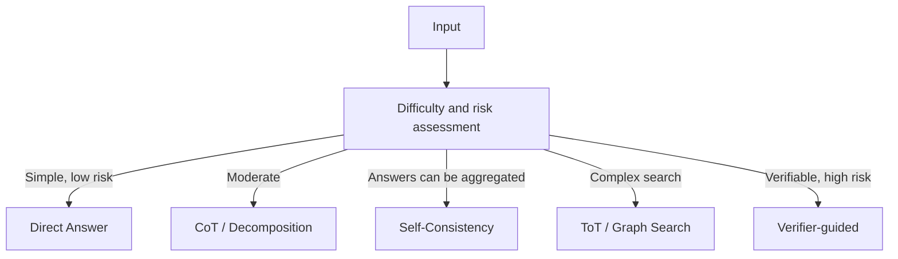

Dynamic routing can lower average cost:

- Answer simple questions directly.
- Use single-path reasoning for moderately difficult questions.
- Add candidates and verification for difficult tasks.
- Require tools, rules, or human review for high-risk tasks.

The difficulty router itself needs evaluation so that model overconfidence does not misclassify hard problems as easy.

## 5.19 Embedding reasoning methods in agent patterns

| Agent pattern | Reasoning methods it can use |
|---|---|
| ReAct | Direct, CoT, tool-augmented reasoning |
| Plan-and-Execute | Decomposition, Plan-and-Solve, ToT, DAG planning |
| Reflection | Self-Refine, Best-of-N, verifier-guided reasoning |
| Reflexion | Reflection + episodic memory |
| Orchestrator-workers | Decomposition, routing, parallel sampling |
| Evaluator-optimizer | Best-of-N, verifier-guided reasoning, Self-Refine |

A complete combination might look like:

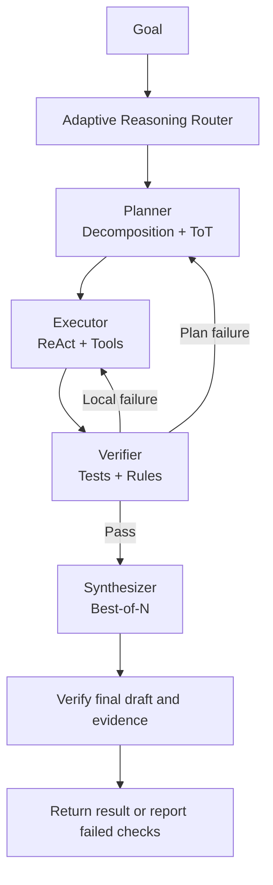

Final synthesis can introduce new errors. Passing earlier tests does not automatically validate a newly generated answer. Check the final draft's citations, numbers, and task constraints; if it fails, revise within the remaining budget or report incompleteness.

## 5.20 Choosing a reasoning method

| Task characteristic | Recommended method |
|---|---|
| Simple, stable, low risk | Direct Answer |
| Requires sequential analysis | CoT |
| Can be divided into dependent subproblems | Least-to-Most / Plan-and-Solve |
| Single answers are unstable, and voting is possible | Self-Consistency |
| Multiple candidates can be generated and objectively scored | Best-of-N |
| Multiple intermediate decisions and backtracking | ToT |
| Intermediate results need merging and reuse | Graph / DAG reasoning |
| Substantial calculation or symbolic operations | PAL / PoT |
| Depends on real-time or external facts | Tool-augmented / retrieval-augmented reasoning |
| Explicit tests or rules exist | Verifier-guided reasoning |
| Input difficulty varies widely | Adaptive reasoning |

Also consider:

- Task risk.
- Latency targets.
- Token and cost budgets.
- Availability of a reliable verifier.
- Whether parallelism is allowed.
- Whether external facts are needed.
- Whether errors are reversible.

## 5.21 A production reasoning controller

A practical reasoning controller usually needs at least these elements:

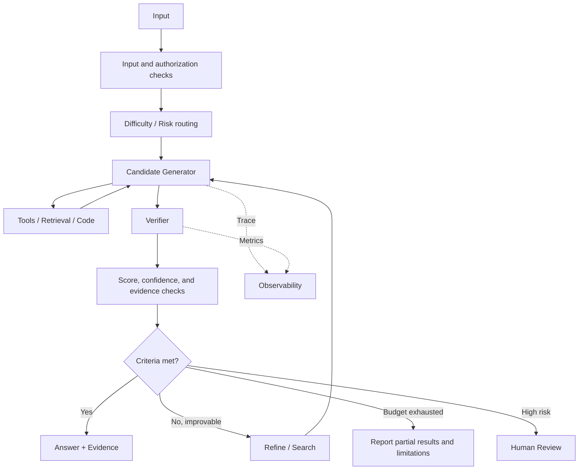

A reasoning system is responsible not only for generation, but also for verification, budget allocation, and failure reporting.

## 5.22 Evaluating reasoning quality

It is not enough for the final answer to “look correct.” Evaluate at least:

| Metric | Meaning |
|---|---|
| Task success | Was the task actually completed? |
| Accuracy | Are the conclusions correct? |
| Evidence grounding | Does evidence support the conclusions? |
| Tool correctness | Are tool selection and arguments correct? |
| Robustness | Does performance remain stable under input changes? |
| Calibration | Does confidence match correctness? |
| Latency | Time spent on reasoning and tool execution |
| Cost | Token, model, and tool costs |
| Search efficiency | How many unproductive candidates were expanded? |
| Safety | Were actions unauthorized or dangerous? |

For agents, evaluate both outcome and trajectory:

- Was the final answer correct, but obtained through unnecessary high-risk tools?
- Did the task succeed only through a lucky path?
- Did extra reasoning rounds actually improve the result?
- Could the verifier detect critical errors?

When comparing Self-Consistency with Best-of-N, first give both the same candidates, then apply voting and scoring separately. This distinguishes “better candidates were generated” from “the selector was more effective.” For full-system evaluation, include internal reasoning, verifiers, retrieval, and revision costs. Report success under equal budgets, not just final output length.

## 5.23 Common misconceptions

### Misconception 1: longer reasoning means a more correct answer

Long output can be repetition or error propagation. Judge quality by verification, not length.

### Misconception 2: CoT is the best default for every task

Extra reasoning can slow simple tasks and even lead to overanalysis.

### Misconception 3: more samples always improve accuracy

If samples share the same bias, majority voting can still be wrong.

### Misconception 4: an LLM judge is an objective verifier

An LLM judge may still be biased, deceived, or share the generator's blind spots.

### Misconception 5: search can compensate for an incorrect evaluation function

Search optimizes the evaluation function. With bad criteria, stronger search may find “high-scoring but wrong” answers more efficiently.

### Misconception 6: explainability requires exposing complete Thoughts

Production explainability should rely more on evidence, actions, state, citations, and reproducible verification.

## 5.24 Design checklist

### Task analysis

- Does the problem genuinely need complex reasoning?
- Can it be decomposed into simpler deterministic steps?
- Are external facts or real-time data missing?
- Are success criteria executable?

### Strategy selection

- Is one path sufficient?
- Can multiple candidates be reliably aggregated or scored?
- Are search and backtracking needed?
- Can programs or tools replace language-based reasoning?

### Verification

- Are compilers, tests, rules, or authoritative data sources available?
- Is the judge independent of the generator?
- Are citations checked against conclusions?
- Are there defenses against reward hacking?

### Budgets and termination

- What is the maximum candidate count?
- What is the maximum search depth?
- What is the maximum number of verification and revision rounds?
- How are timeouts and exhausted budgets reported?

### Safety and privacy

- Is hidden chain of thought kept private?
- Does the reasoning context contain sensitive information?
- Do generated programs run in a sandbox?
- Do high-risk conclusions require human review?

## 5.25 Chapter summary

Distinguish these methods by what they do, not by a fixed cost or capability ranking:

1. **Direct Answer**: generate directly.
2. **CoT**: reason step by step along one path.
3. **Decomposition**: split a complex problem into subproblems.
4. **Self-Consistency / Best-of-N**: generate and aggregate multiple candidates.
5. **ToT / Graph Search**: search, score, and backtrack across paths.
6. **Program / tool / retrieval augmentation**: bring in external computation and facts.
7. **Verifier-guided reasoning**: select and improve results with verifiable feedback.
8. **Adaptive reasoning**: choose methods dynamically by difficulty, risk, and budget.

These methods ultimately support the agent's system-level control:

> **An agent pattern determines when to reason, act, and stop; a reasoning method determines how much compute each decision receives and how its result is selected.**

## References

- [Chain-of-Thought Prompting Elicits Reasoning in Large Language Models](https://arxiv.org/abs/2201.11903)
- [Large Language Models are Zero-Shot Reasoners](https://arxiv.org/abs/2205.11916)
- [Self-Consistency Improves Chain of Thought Reasoning in Language Models](https://arxiv.org/abs/2203.11171)
- [Least-to-Most Prompting Enables Complex Reasoning in Large Language Models](https://arxiv.org/abs/2205.10625)
- [Tree of Thoughts: Deliberate Problem Solving with Large Language Models](https://arxiv.org/abs/2305.10601) — Game of 24 conditions checked against [v2, §4.1 and Table 2](https://arxiv.org/html/2305.10601v2).
- [Graph of Thoughts: Solving Elaborate Problems with Large Language Models](https://arxiv.org/abs/2308.09687)
- [PAL: Program-aided Language Models](https://arxiv.org/abs/2211.10435)
- [Self-Refine: Iterative Refinement with Self-Feedback](https://arxiv.org/abs/2303.17651)
- [Plan-and-Solve Prompting](https://arxiv.org/abs/2305.04091)
- [Program of Thoughts Prompting](https://arxiv.org/abs/2211.12588)
- [Language Models Don't Always Say What They Think: Unfaithful Explanations in Chain-of-Thought Prompting](https://arxiv.org/abs/2305.04388)
- [Let's Verify Step by Step](https://arxiv.org/abs/2305.20050)
- [DeepSeek-R1](https://arxiv.org/abs/2501.12948) — the discussion refers to the [January 2025 v1 technical report](https://arxiv.org/html/2501.12948v1), not an inference about a current hosted service.
- [Scaling LLM Test-Time Compute Optimally can be More Effective than Scaling Model Parameters](https://arxiv.org/abs/2408.03314)
- [s1: Simple test-time scaling](https://arxiv.org/abs/2501.19393)
- [OpenAI: Reasoning best practices](https://developers.openai.com/api/docs/guides/reasoning-best-practices) — vendor-specific guidance, including historical o-series examples; not a universal prompting rule.
- [OpenAI: Reasoning models](https://developers.openai.com/api/docs/guides/reasoning) — reasoning-token accounting and opaque continuation state; supported behavior depends on the model and API.
- [Amazon Bedrock: Extended thinking](https://docs.aws.amazon.com/bedrock/latest/userguide/claude-messages-extended-thinking.html) — returned thinking forms and tool-continuation requirements; the page distinguishes full output for Claude 3.7 Sonnet from summarized output for Claude 4.
- [Python 3.13: decimal — precision, rounding, and decimal arithmetic](https://docs.python.org/3.13/library/decimal.html)
