# 第五章：Agent 的模型推理与搜索方法

## 5.1 推理方法与 Agent 范式的关系

推理方法和 Agent 设计范式位于不同层级：

> **推理方法决定模型如何分析和选择候选答案，Agent 范式决定系统如何组织模型、工具、状态和环境反馈。**

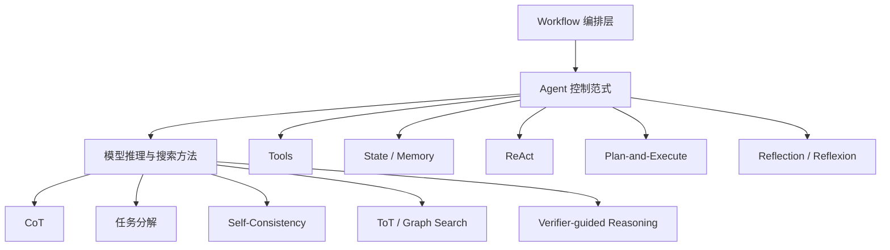

例如：

- ReAct 每轮可以使用内部链式推理选择 Tool；
- Plan-and-Execute 的 Planner 可以使用任务分解或搜索多个计划；
- Reflection 可以使用验证器、评分模型或 Self-Refine；
- Workflow 的路由节点可以使用简单分类，不一定需要复杂推理。

推理方法是 Agent 的“局部决策算法”，Agent 范式是“系统级控制循环”。

## 5.2 什么是模型推理

大语言模型以自回归方式逐 Token 生成输出。给定输入 `x`，输出 Token 序列 `y = (y₁, …, yₙ)` 的联合概率可以分解为：

$$
P(y \mid x)=\prod_{t=1}^{n}P(y_t \mid x,y_1,\ldots,y_{t-1})
$$

所谓“推理方法”，并不是在模型外突然增加一种神秘能力，而是通过以下方式改变推理时的计算过程：

- 生成中间表示；
- 将问题分解为子问题；
- 采样多个候选；
- 搜索多个推理路径；
- 调用程序、检索或工具获得外部反馈；
- 使用验证器评分；
- 根据反馈重新生成。

放到工程系统里，更接近下面这个过程：

> **生成候选 → 获取证据 → 验证候选 → 分配更多计算 → 选择结果**

## 5.3 推理方法的总体分类

可以按照推理时探索的范围，将常见方法分成四层：

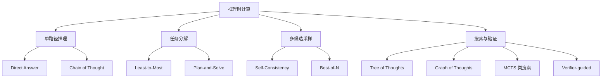

计算量通常从上到下逐步增加：

| 类型 | 候选路径数 | 是否搜索 | 成本 |
|---|---:|---:|---:|
| Direct Answer | 1 | 否 | 低 |
| CoT | 1 | 否 | 低到中 |
| 任务分解 | 1 条主路径，多个子问题 | 有限 | 中 |
| Self-Consistency | 多条 | 仅聚合 | 中到高 |
| ToT / Graph Search | 多条 | 是 | 高 |
| Verifier-guided Search | 多条 | 是，并反复评分 | 高 |

更复杂的方法并不必然更好。只有当额外推理计算能够提升任务成功率时，增加复杂度才有价值。

## 5.4 Direct Answer：建立最简单基线

Direct Answer 让模型直接生成答案，不显式要求中间推理。

适合：

- 简单事实提取；
- 文本改写和格式转换；
- 分类边界清晰的任务；
- 模型已经非常熟悉的模式；
- 延迟要求严格的场景。

工程上先看它能不能当基线。直接调用如果已经稳定，就没必要再引入多轮推理、搜索或 Agent 循环。

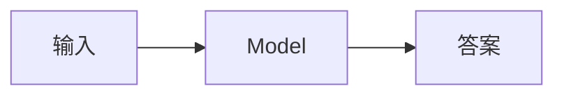

## 5.5 Chain of Thought：链式推理

这里主要讨论 CoT 在推理层的机制与局限。CoT 与行动规划的边界见[第十一章](11-llm-agent-planning.md)；可记录的轨迹不等于隐藏 CoT，见[第十四章](../05-production/14-agent-evaluation.md)。

### 5.5.1 基本思想

CoT（Chain of Thought）通过生成中间推理步骤，将复杂问题拆成一条连续推理链：

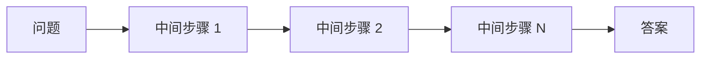

从概率角度，可以将中间推理表示为隐变量 $z$：

$$
P(y\mid x)=\sum_z P(y,z\mid x)
$$

单路径 CoT 实际上只生成一个候选推理 $z$，再根据它得到答案 $y$。

### 5.5.2 Few-shot CoT 与 Zero-shot CoT

#### Few-shot CoT

在 Prompt 中提供带有中间步骤的示例，让模型模仿类似推理结构。

#### Zero-shot CoT

不提供完整示例，只通过简短指令要求模型分步骤分析。历史上常见的提示是“Let's think step by step”。

但对现代推理模型而言，反复要求“逐步思考”不一定继续带来收益，甚至可能干扰模型原生的推理策略。应以具体模型的官方建议和评估结果为准。

### 5.5.3 不要把完整思维链当作可靠解释

模型生成的 CoT：

- 可能是事后合理化；
- 可能省略真正影响答案的因素；
- 可能包含看似合理但错误的步骤；
- 不一定忠实反映模型内部计算；
- 可能泄露不应公开的上下文或安全信息。

因此，生产系统不应把“输出了很长的推理过程”等同于“答案可靠”。

面向用户更推荐展示：

- 简洁的结论依据；
- 引用和数据来源；
- 结构化计划；
- Tool Call 与 Observation；
- 可复现的计算过程；
- 验证结果。

> **可验证证据比冗长思维链更重要。**

### 5.5.4 CoT 的适用场景

- 多步数学和逻辑问题；
- 需要顺序分析的规则任务；
- 简单任务分解；
- 单条路径足以解决的问题。

### 5.5.5 CoT 的局限

- 早期步骤错误会沿整条链传播；
- 只探索一条路径；
- 推理越长不代表越正确；
- 增加 Token、延迟和成本；
- 缺少外部验证时容易自洽但错误。

## 5.6 任务分解：先把问题变小

任务分解的目标不是让推理变得更长，而是降低每个子问题的难度。

### 5.6.1 Least-to-Most

Least-to-Most Prompting 先识别较简单的子问题，再按依赖顺序逐步解决。

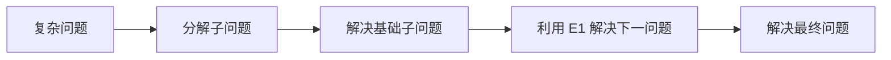

适合：

- 后续步骤依赖前一步结果；
- 问题可以自然分解；
- 单次直接推理容易遗漏条件。

### 5.6.2 Plan-and-Solve

Plan-and-Solve 先生成解题计划，再按计划完成推理：

```text
Plan:
1. 提取已知条件
2. 确定需要计算的变量
3. 选择公式
4. 执行计算并检查
```

它与 Agent 层的 Plan-and-Execute 有相似思想，但层级不同：

| Plan-and-Solve | Plan-and-Execute |
|---|---|
| 主要用于模型内部问题求解 | 用于 Agent 系统任务执行 |
| 子步骤通常仍是模型推理 | 步骤可以调用 Tool、Agent 或 Workflow |
| 通常不改变外部环境 | 会接收真实环境反馈 |
| 生命周期较短 | 可以长时间运行并持久化状态 |

### 5.6.3 分解失败

分解也可能引入问题：

- 子问题划分错误；
- 忽略跨步骤约束；
- 子问题答案无法组合；
- 分解成本超过任务本身；
- 错误中间结果被后续步骤当作事实。

因此，分解后仍需要检查依赖、接口和最终组合结果。

## 5.7 Self-Consistency：多路径投票

Self-Consistency 不只生成一条推理链，而是通过采样得到多个候选路径，再聚合最终答案。

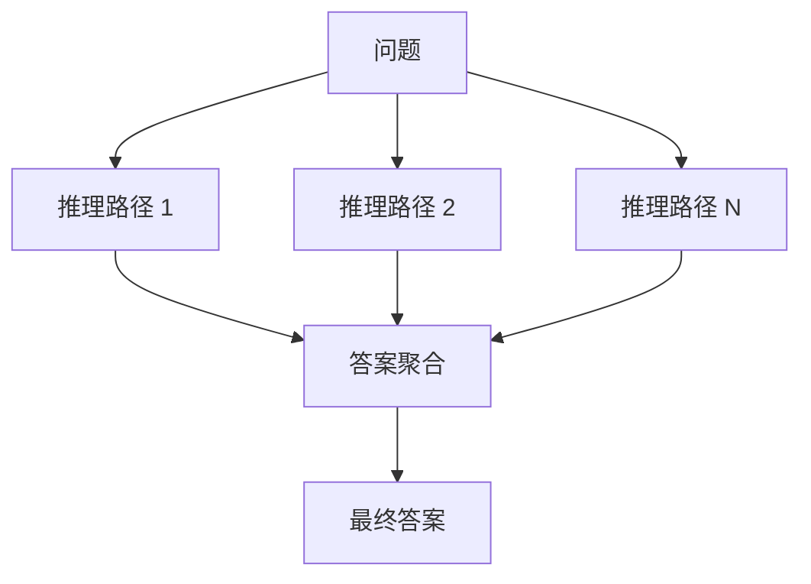

若第 $i$ 条路径得到答案 $y_i$，多数投票可以写为：

$$
\hat{y}=\arg\max_y \sum_{i=1}^{N} I(y_i=y)
$$

其中 $I$ 是指示函数。

### 5.7.1 为什么可能有效

如果不同推理路径犯错的方式不完全相同，正确答案可能在多个样本中更稳定地出现。

### 5.7.2 适用条件

- 最终答案可以规范化和比较；
- 存在多个合理推理路径；
- 单次采样错误率较高；
- 可以接受多倍模型调用成本。

### 5.7.3 局限

- 多数意见也可能一致地错误；
- 候选之间可能高度相关，缺乏真正多样性；
- 开放式文本很难直接投票；
- 调用成本约随样本数增长；
- 不能替代外部事实验证。

## 5.8 Best-of-N：生成多个候选再评分

Best-of-N 生成 $N$ 个候选，再由评分函数或验证器选择最佳结果：

$$
y^*=\arg\max_{y_i} V(x,y_i)
$$

其中 $V$ 是验证器或评分函数。

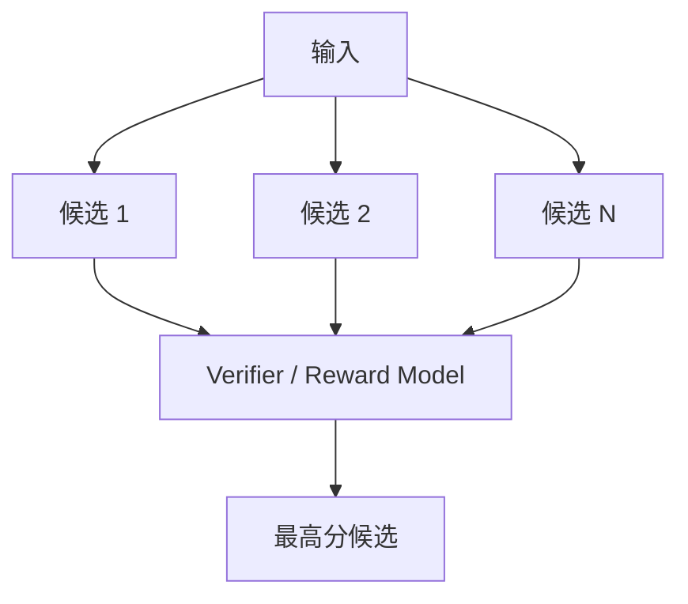

Self-Consistency 与 Best-of-N 的区别：

| Self-Consistency | Best-of-N |
|---|---|
| 通常聚合最终答案 | 对完整候选进行评分 |
| 不一定需要独立验证器 | 依赖评分函数或验证器 |
| 适合答案可投票的任务 | 适合候选质量可比较的任务 |

验证器可以是：

- 单元测试；
- 编译器；
- 数学或规则检查器；
- 模拟器；
- 人工评分；
- 独立模型；
- LLM-as-a-Judge。

应优先使用更接近真实成功标准的验证器。

## 5.9 Tree of Thoughts：搜索推理树

ToT（Tree of Thoughts）把中间推理状态视为搜索树节点，在每个节点扩展多个候选，并进行评分、选择或回溯。

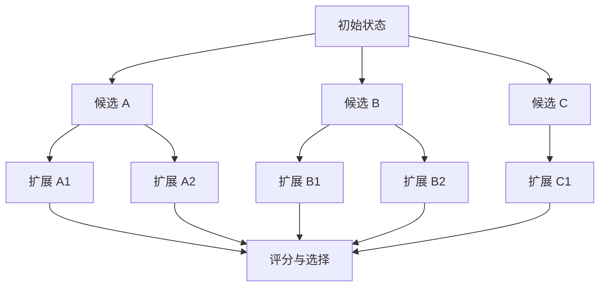

### 5.9.1 核心组件

ToT 通常需要：

1. **State**：当前部分解；
2. **Generator**：扩展候选 Thought；
3. **Evaluator**：评价候选状态；
4. **Search Algorithm**：BFS、DFS、Beam Search 等；
5. **Termination**：找到可接受解或预算耗尽。

### 5.9.2 与 CoT 的区别

| CoT | ToT |
|---|---|
| 一条推理链 | 多条候选路径 |
| 通常不回溯 | 可以回溯 |
| 成本较低 | 成本较高 |
| 适合线性问题 | 适合需要探索和选择的问题 |

### 5.9.3 适用场景

- 规划问题；
- 谜题和组合搜索；
- 创意方案探索；
- 存在多个中间决策的复杂任务；
- 可以评价部分解质量的任务。

### 5.9.4 局限

- 分支数量可能指数增长；
- 中间状态评分可能不可靠；
- LLM 生成的候选可能缺乏多样性；
- 搜索成本和延迟高；
- 很多现实任务难以定义部分解评分。

生产实现通常使用 Beam Width、最大深度和预算剪枝限制搜索规模。

## 5.10 Graph of Thoughts 与图搜索

树结构假设每条路径独立向下展开，但现实推理可能需要合并、复用或循环改进中间结果。

Graph of Thoughts 将推理状态组织成图：

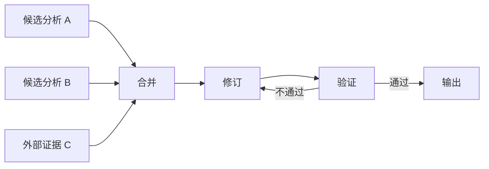

图结构可以表达：

- 多个候选合并；
- 中间结果复用；
- 依赖关系；
- 反复修订；
- 并行推理。

但其编排和状态管理比 ToT 更复杂。很多工程系统会直接使用 DAG Workflow、状态图或任务图实现类似能力，而不必显式称为 Graph of Thoughts。

## 5.11 MCTS 类推理搜索

蒙特卡洛树搜索类方法通常在候选状态之间反复执行：

1. Selection：选择值得探索的节点；
2. Expansion：生成新的候选步骤；
3. Evaluation：评估候选质量；
4. Backpropagation：将评价反馈到祖先节点。

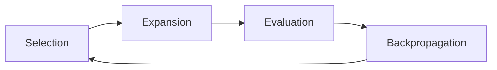

这类方法适合：

- 存在明确目标或奖励信号；
- 可以逐步模拟结果；
- 搜索空间较大；
- 允许较高推理预算。

对于开放式知识任务，如果评价函数本身不可靠，复杂搜索可能只是更昂贵地放大评分偏差。

## 5.12 Program-Aided Reasoning：把计算交给程序

模型不擅长稳定执行长算术、精确状态更新和复杂符号操作。Program-Aided Language Models（PAL）或 Program of Thoughts（PoT）让模型生成程序，再由解释器执行。

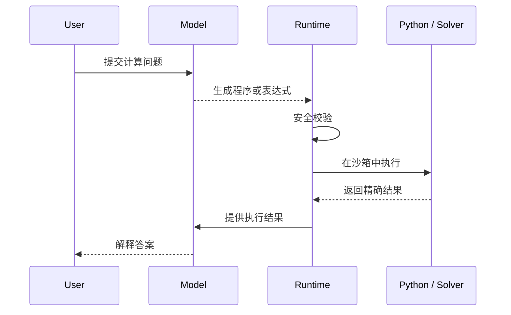

适合：

- 数学计算；
- 数据分析；
- 日期和单位换算；
- 逻辑约束求解；
- 可以编码为程序的问题。

需要注意：

- 代码必须在受限沙箱中执行；
- 禁止未授权网络和文件访问；
- 应设置时间、内存和输出限制；
- 程序可执行不代表问题建模正确。

## 5.13 Tool-Augmented Reasoning：用环境提供事实

推理不能弥补缺失或过时的事实。Agent 可以通过搜索、数据库、代码执行器和领域 API 获取外部证据。

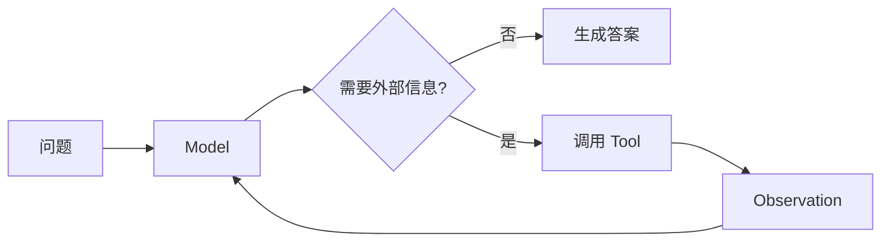

工程上的工作主要集中在这些环节：

- 判断何时需要 Tool；
- 选择正确 Tool；
- 生成有效参数；
- 验证 Tool 返回值；
- 处理冲突和失败；
- 在答案中引用证据。

内部推理强，不代表外部事实可靠。对于实时信息和高风险事实，应优先使用权威数据源。

## 5.14 Retrieval-Augmented Reasoning

RAG 为模型提供外部知识，但检索与推理之间仍需协同：

1. 判断问题是否需要检索；
2. 生成或改写查询；
3. 检索候选文档；
4. 过滤和重排；
5. 基于证据推理；
6. 检查引用是否支持结论；
7. 必要时继续检索。

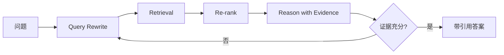

多轮检索可以提升覆盖率，但也可能增加噪音。系统应记录哪些结论由哪些证据支持。

## 5.15 Verifier-Guided Reasoning

Verifier-Guided Reasoning 使用验证器指导候选生成、选择和修订。

设候选集合为 $Y=\{y_1,\dots,y_N\}$，验证器分数为：

$$
v_i=V(x,y_i,e_i)
$$

其中 $e_i$ 可以是测试结果、执行轨迹或外部证据。

系统可以：

- 选择最高分候选；
- 对低分候选生成反馈；
- 将反馈加入下一轮生成；
- 在达到阈值后停止。

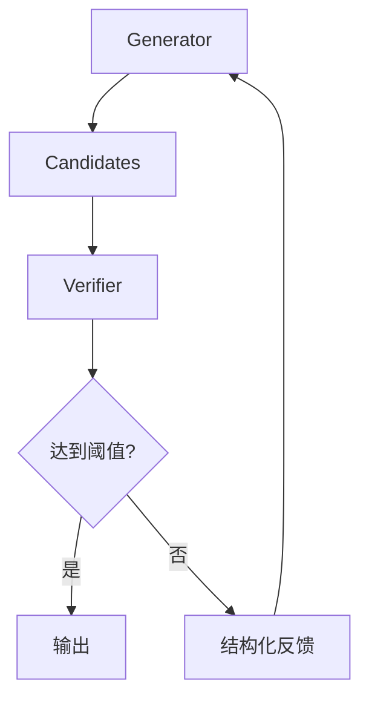

### 5.15.1 验证信号优先级

通常应优先使用：

1. 真实环境结果；
2. 单元测试、编译器和约束求解器；
3. 确定性规则与 Schema；
4. 专门训练的 Reward Model；
5. 独立 LLM Judge；
6. 同一模型自我评分。

验证器越接近真实任务成功标准，搜索越有意义。

### 5.15.2 Verifier 的风险

- Reward Hacking；
- 评分规则覆盖不完整；
- Judge 偏好冗长或特定表达；
- Generator 与 Judge 共享相同错误；
- 对抗性候选欺骗评分器。

因此，不应只优化单一自动分数，还需要抽样人工审核和线上结果监控。

## 5.16 Self-Refine 与 Reflection

Self-Refine 让模型对自己的输出生成反馈，再根据反馈修订：

> **Generate → Feedback → Refine**

它属于推理层技术；当这一过程扩展为跨步骤、带状态和环境反馈的持续循环时，就进入第四章所说的 Reflection Agent 范式。

| 推理层 Self-Refine | Agent 层 Reflection |
|---|---|
| 优化一个候选输出 | 优化动作、轨迹或整个任务 |
| 生命周期通常较短 | 可以跨多个工具步骤 |
| 状态较少 | 保存任务状态和 Observation |
| 不一定调用外部工具 | 通常结合真实环境反馈 |

## 5.17 Reasoning Models 与推理时扩展

新一代 Reasoning Model 通常在训练或推理系统中强化了多步推理能力。使用这类模型时，应用不一定需要手工要求它输出冗长 CoT。

推理时扩展（Inference-time Scaling）指为困难问题分配更多推理计算，例如：

- 增加内部推理预算；
- 生成更多候选；
- 使用搜索；
- 增加验证与修订轮次；
- 调用更多工具或模拟器。

可以将总推理预算抽象为：

$$
B=(T,N,D,K)
$$

其中：

- $T$：Token 或内部推理预算；
- $N$：候选数量；
- $D$：搜索深度；
- $K$：验证或修订轮数。

预算越高不意味着结果必然越好。系统需要根据任务难度动态分配计算，而不是对所有请求使用最大推理强度。

## 5.18 Adaptive Reasoning：按难度分配预算

Adaptive Reasoning 先估计任务难度或置信度，再选择推理策略：

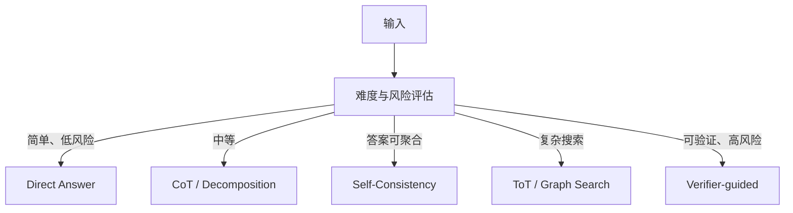

动态路由可以降低平均成本：

- 简单问题直接回答；
- 中等问题采用单路径推理；
- 高难任务增加候选和验证；
- 高风险任务强制使用工具、规则或人工审核。

难度路由本身也需要评估，避免模型过度自信地把困难问题判断为简单问题。

## 5.19 推理方法如何嵌入 Agent 范式

| Agent 范式 | 可使用的推理方法 |
|---|---|
| ReAct | Direct、CoT、Tool-Augmented Reasoning |
| Plan-and-Execute | Decomposition、Plan-and-Solve、ToT、DAG Planning |
| Reflection | Self-Refine、Best-of-N、Verifier-guided |
| Reflexion | Reflection + 情景记忆 |
| Orchestrator-Workers | Decomposition、Routing、Parallel Sampling |
| Evaluator-Optimizer | Best-of-N、Verifier-guided、Self-Refine |

一种完整组合可能是：

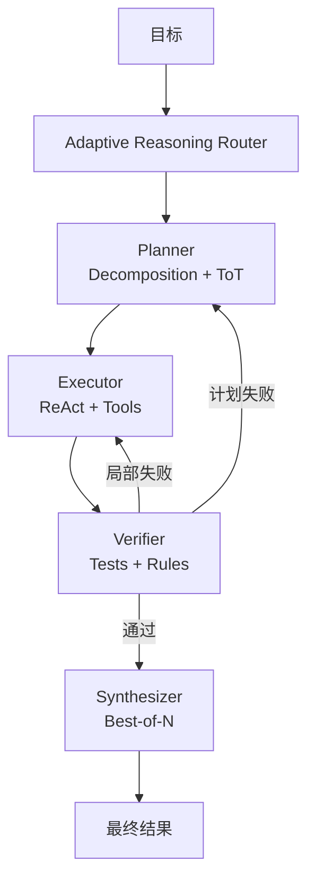

## 5.20 如何选择推理方法

| 任务特征 | 推荐方法 |
|---|---|
| 简单、稳定、低风险 | Direct Answer |
| 需要顺序分析 | CoT |
| 可以拆成依赖子问题 | Least-to-Most / Plan-and-Solve |
| 单次答案不稳定且可投票 | Self-Consistency |
| 能生成多个候选并客观评分 | Best-of-N |
| 存在多个中间决策和回溯 | ToT |
| 中间结果需要合并和复用 | Graph / DAG Reasoning |
| 计算或符号操作较多 | PAL / PoT |
| 依赖实时或外部事实 | Tool-Augmented / Retrieval-Augmented |
| 有明确测试或规则 | Verifier-Guided |
| 输入难度差异很大 | Adaptive Reasoning |

还应考虑：

- 任务风险；
- 延迟目标；
- Token 和费用预算；
- 是否存在可靠验证器；
- 是否允许并行；
- 是否需要外部事实；
- 错误是否可逆。

## 5.21 生产级推理控制器

一个能落地的推理控制器通常至少有这些环节：

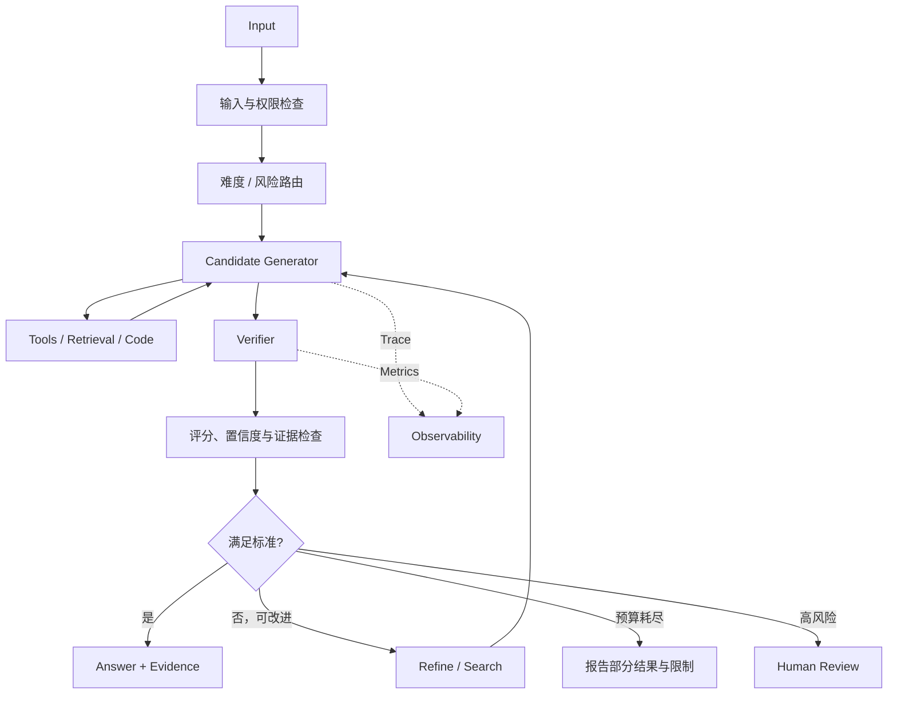

推理系统不只负责生成，还要负责验证、预算分配和失败报告。

## 5.22 推理质量评估

不能只看最终答案是否“像是正确”。至少应评估：

| 指标 | 含义 |
|---|---|
| Task Success | 是否真正完成任务 |
| Accuracy | 结论是否正确 |
| Evidence Grounding | 结论是否有证据支持 |
| Tool Correctness | Tool 选择和参数是否正确 |
| Robustness | 输入变化后是否保持稳定 |
| Calibration | 置信度是否与正确率匹配 |
| Latency | 推理和工具执行耗时 |
| Cost | Token、模型和工具费用 |
| Search Efficiency | 扩展了多少无效候选 |
| Safety | 是否越权或产生危险动作 |

对于 Agent，还应同时评估结果和轨迹：

- 最终答案正确，但是否调用了不必要的高风险工具？
- 任务完成了，但是否通过偶然路径成功？
- 多轮推理是否真正改善结果？
- 验证器是否能发现关键错误？

## 5.23 常见误区

### 误区一：推理过程越长，答案越正确

长输出可能只是重复或错误扩散。应通过验证结果而不是长度判断质量。

### 误区二：CoT 是所有任务的默认最佳方案

简单任务可能因额外推理而变慢，甚至出现过度分析。

### 误区三：多采样一定能提高正确率

如果多个样本共享相同偏差，多数投票仍会错误。

### 误区四：LLM Judge 就是客观验证器

LLM Judge 仍可能偏置、被欺骗或与生成器共享盲点。

### 误区五：搜索算法可以弥补错误评价函数

搜索会优化评价函数。如果评价标准错误，更强搜索可能更高效地找到“高分但错误”的答案。

### 误区六：暴露完整 Thought 才算可解释

生产可解释性更应依赖证据、动作、状态、引用和可复现验证。

## 5.24 设计检查表

### 任务分析

- 问题是否真的需要复杂推理？
- 能否拆成更简单的确定性步骤？
- 是否缺少外部事实或实时数据？
- 是否存在可执行的成功标准？

### 策略选择

- 单路径是否足够？
- 多候选能否被可靠聚合或评分？
- 是否需要搜索和回溯？
- 是否可以使用程序或 Tool 替代语言推理？

### 验证

- 是否有编译器、测试、规则或权威数据源？
- Judge 是否独立于 Generator？
- 是否检查引用与结论的一致性？
- 是否防范 Reward Hacking？

### 预算与终止

- 最大候选数是多少？
- 最大搜索深度是多少？
- 最大验证和修订轮数是多少？
- 超时或预算耗尽时如何报告？

### 安全与隐私

- 是否避免暴露隐藏思维链？
- 推理上下文是否包含敏感信息？
- 生成的程序是否在沙箱中运行？
- 高风险结论是否需要人工审核？

## 5.25 本章总结

可以把这些方法看成一条从低成本到高计算量的梯度：

1. **Direct Answer**：直接生成；
2. **CoT**：沿一条路径分步推理；
3. **Decomposition**：将复杂问题拆成子问题；
4. **Self-Consistency / Best-of-N**：生成并聚合多个候选；
5. **ToT / Graph Search**：搜索、评分和回溯多个路径；
6. **Program / Tool / Retrieval-Augmented**：引入外部计算和事实；
7. **Verifier-Guided**：用可验证反馈选择和改进结果；
8. **Adaptive Reasoning**：按难度、风险和预算动态选择方法。

这些方法最终服务于 Agent 的系统控制：

> **Agent 范式决定何时思考、行动和停止；推理方法决定每次决策投入多少计算以及如何选择结果。**

## 参考资料

- [Chain-of-Thought Prompting Elicits Reasoning in Large Language Models](https://arxiv.org/abs/2201.11903)
- [Large Language Models are Zero-Shot Reasoners](https://arxiv.org/abs/2205.11916)
- [Self-Consistency Improves Chain of Thought Reasoning in Language Models](https://arxiv.org/abs/2203.11171)
- [Least-to-Most Prompting Enables Complex Reasoning in Large Language Models](https://arxiv.org/abs/2205.10625)
- [Tree of Thoughts: Deliberate Problem Solving with Large Language Models](https://arxiv.org/abs/2305.10601)
- [Graph of Thoughts: Solving Elaborate Problems with Large Language Models](https://arxiv.org/abs/2308.09687)
- [PAL: Program-aided Language Models](https://arxiv.org/abs/2211.10435)
- [Self-Refine: Iterative Refinement with Self-Feedback](https://arxiv.org/abs/2303.17651)
