# Chapter 6: Decomposing and Scheduling Complex Tasks

## 6.1 What problem does task decomposition solve?

A user asks, “Research three competitors and write a comparison report.” Why not hand that directly to one model call? If the system must find current material, reconcile inconsistent source definitions, and continue after failures, it needs trackable execution steps. Complex tasks may involve:

- Many steps.
- Many intermediate states.
- Information available only after execution.
- Dependencies between subtasks.
- Different tools or expertise for different steps.
- Individual steps that can fail and need retries.
- Multiple model or tool calls before completion.

Task decomposition turns a complex goal into units that are:

> **Executable, verifiable, schedulable, and recoverable.**

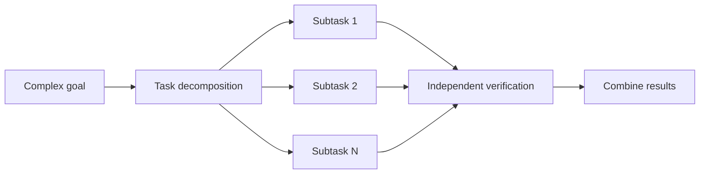

This chapter uses a fictional competitor-research task: examine the past six months of product, pricing, and market developments, then deliver a sourced report. Parameters and durations are illustrative, not measured project results: three research branches take 40, 50, and 60 seconds, and merging takes 10 seconds.

## 6.2 Why decompose?

### 6.2.1 Reduce context pressure

The longer an agent runs, the more messages, tool results, and intermediate conclusions it produces. Continually adding everything to context can:

- Exceed the context window.
- Increase token cost and latency.
- Dilute important constraints with noise.
- Compress away or lose earlier information.
- Make current progress harder for the model to assess.

After decomposition, each subtask needs only the minimum sufficient context and passes results through artifacts, state, or references.

### 6.2.2 Make each reasoning step easier

Packing research, analysis, comparison, verification, and report writing into one call can blur evidence gathering with conclusion generation. Decomposition may make each attempt easier, but also introduces handoff errors. Compare final report quality, not merely whether each subtask succeeded.

With separate steps, each model call has a more focused goal and input, a more constrained output format, and more readily defined success criteria.

### 6.2.3 Support independent verification

When a whole task fails, it can be difficult to tell whether search, analysis, or synthesis caused the problem. Decomposition allows each step to have its own acceptance criteria:

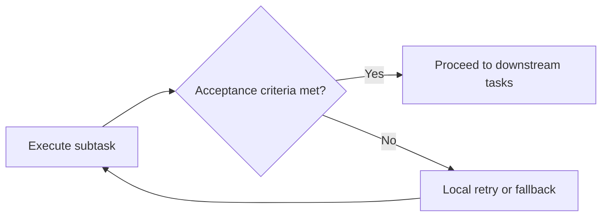

### 6.2.4 Support local retries and recovery

If step 8 fails, first determine which completed results remain valid, then retry affected steps instead of always restarting at step 1. If upstream inputs, permissions, or business state have changed, a `done` marker alone does not justify reusing old results.

This requires:

- Stable subtask IDs.
- Persistent intermediate results.
- Checkpoints for completed steps.
- Idempotent writes wherever possible.
- Traceable failure impact.

### 6.2.5 Support parallel execution

Subtasks can run concurrently when their data dependencies are satisfied and they do not conflict over shared resources. The absence of a dependency edge does not establish independence. Two tasks modifying the same configuration file, for example, need serialization, locking, or version checks.

### 6.2.6 Support specialization

Different subtasks can use different executors:

- Small models for classification and extraction.
- More capable models for complex planning.
- Search agents for collecting material.
- Coding agents for implementation.
- Deterministic programs for calculation and verification.

## 6.3 When not to decompose

Decomposition has overhead:

- Planner calls.
- State persistence.
- Subtask scheduling.
- Context switching.
- Serialization of intermediate results.
- Final result merging.
- More points of failure.

Elaborate decomposition is usually unnecessary when:

- A single model call can complete the task reliably.
- The task consists of one atomic operation.
- Subtasks are so tightly coupled that they require constant synchronization.
- Splitting and merging cost more than execution itself.
- There are no independent acceptance criteria.

> **Decomposition is a cost and reliability technique, not a ritual required for every complex task.**

## 6.4 What makes a good task unit?

“Use atomic operations as the boundary” is a useful starting point, but a more precise engineering definition is:

> **Once its inputs and preconditions are satisfied, a task unit should be independently executable, verifiable, and recoverable, with explicit output and side-effect boundaries.**

A complete task contract usually includes:

| Field | Purpose |
|---|---|
| `id` | Stable identifier |
| `goal` | Subtask objective |
| `inputs` | Required inputs and references |
| `dependencies` | Prerequisite tasks |
| `executor` | Tool, model, agent, or workflow |
| `outputs` | Structured output or artifact |
| `success_criteria` | Acceptance criteria |
| `side_effects` | Whether the task writes to external systems |
| `timeout_seconds` | Maximum execution time, explicitly in seconds |
| `retry_policy` | Retry and fallback strategy |
| `risk_level` | Authorization and approval level |
| `plan_version` / `input_versions` | Identify the current plan and input versions to prevent stale-result reuse |
| `idempotency_key` | Preserve the meaning of the same side-effecting business operation across retries |

The Chinese goal and criteria below require collecting competitor A's product updates over the last six months, preferring official release notes, marking unconfirmed material for verification, and including each update's date and link.

```json
{
  "id": "research-competitor-a",
  "goal": "收集竞品 A 最近六个月的产品更新",
  "inputs": {
    "competitor": "A",
    "time_range": {
      "start": "2026-02-28T00:00:00Z",
      "end_exclusive": "2026-08-28T00:00:00Z"
    }
  },
  "dependencies": [],
  "executor": "research-agent",
  "outputs": {
    "type": "artifact",
    "schema": "competitor-update-list"
  },
  "success_criteria": [
    "产品更新优先使用官方发布说明；无法证实的内容标为待核实",
    "每项更新包含发布日期和链接"
  ],
  "timeout_seconds": 120,
  "retry_policy": {
    "max_attempts": 2
  },
  "risk_level": "read-only"
}
```

This is a teaching contract, not a complete API for any framework. The time and retry values are configuration examples. Source count does not guarantee factual reliability either: two reposts may repeat the same error. Acceptance rules should match business standards, not be left entirely to the planner's ad hoc judgment.

The contract fixes “the last six months” to UTC start and end times, including the start and excluding the end. A retry several days later therefore cannot silently change the research scope. Here, `max_attempts: 2` includes the initial attempt, allowing at most one further try. Such semantics also need to be explicit.

## 6.5 Granularity: neither too coarse nor too fine

### 6.5.1 Too coarse

For example:

> Research all competitors and write a complete strategy report.

Problems include:

- Input and output scope is too broad.
- Success for one step is difficult to define.
- Failure requires retrying the whole task.
- Parallelism cannot be used effectively.
- Intermediate work is not observable.

### 6.5.2 Too fine

For example:

1. Open the search tool.
2. Enter a keyword.
3. Click Search.
4. Read the first result.
5. Copy one sentence.

Problems include:

- Excessive scheduling overhead.
- More model calls.
- Fragmented state.
- Little independent business value in each step.
- Reduced coherence across the task.

### 6.5.3 Appropriate granularity

A better subtask is:

> Find competitor A's official product updates from the past six months and produce a structured list with sources.

It has:

- A clear objective.
- Bounded scope.
- An independent output.
- Verifiable criteria.
- Retryability.
- The ability to run alongside research on other competitors.

### 6.5.4 Granularity checklist

A subtask's granularity is usually appropriate when it meets most of these conditions:

- One executor can complete it within a bounded time.
- Inputs and outputs can be described structurally.
- There is a clear definition of done.
- Failures can be retried locally.
- It interacts with other tasks through limited interfaces.
- It does not need continuous sharing of large amounts of implicit context.
- Completion produces a reusable artifact.

## 6.6 Static decomposition

Developers define steps and dependencies in advance. This fits stable processes with clear rules.

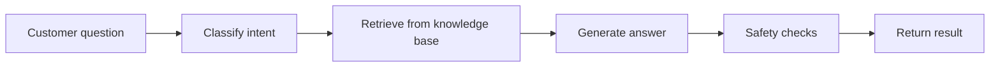

### 6.6.1 Strengths

- Predictable behavior.
- Easy testing.
- Easier cost and latency estimates.
- Clear authorization boundaries.
- Suitable for auditing and compliance.

### 6.6.2 Limitations

- Cannot cover every unknown situation.
- Process changes require code changes.
- Many branches make maintenance difficult.
- Poor fit for open-ended goals.

Static decomposition is usually implemented with a workflow, DAG, or state machine.

## 6.7 Dynamic decomposition

A planner generates subtasks from the goal and current environment.

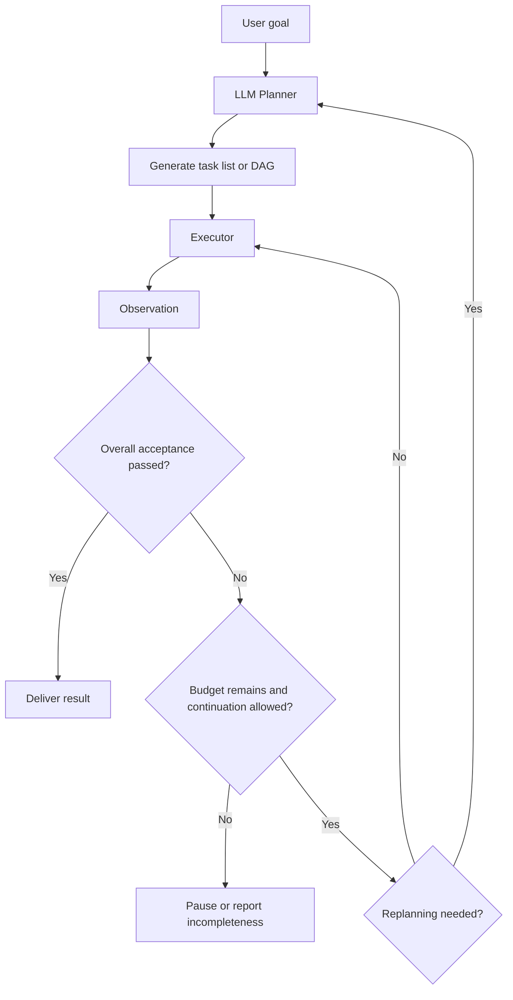

It is suitable when:

- The number of steps cannot be determined in advance.
- Different inputs need completely different execution paths.
- The task depends on external feedback.
- Exploration and dynamic decisions are required.

### 6.7.1 Strengths

- Flexibility.
- Support for open-ended tasks.
- Adaptation to new information.
- Suitability for long-running research and coding tasks.

### 6.7.2 Limitations

- Inconsistent planning quality.
- Missing critical steps.
- Generating tasks that cannot be executed.
- Over- or under-decomposition.
- Extra cost and latency from planner calls.

Dynamic plans therefore need schema validation, dependency checks, and feasibility checks.

## 6.8 Hierarchical decomposition

Complex tasks should not be expanded to the lowest level all at once. A more robust approach is hierarchical planning:

1. Generate high-level milestones first.
2. Expand only the current milestone.
3. Execute and verify.
4. Expand the next level afterward.

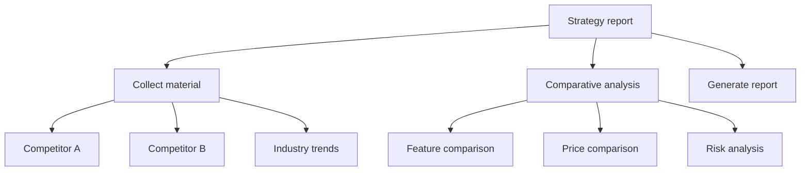

This borrows the hierarchical idea of Hierarchical Task Networks (HTN):

- High-level tasks describe objectives.
- Methods define how to decompose them.
- Leaf tasks are eventually executed by tools, models, or agents.

A multilevel natural-language checklist is not a complete HTN planner. Classical HTN planning also requires explicit decomposition methods, their applicability conditions, task-ordering constraints, and primitive-action semantics. Generating an arbitrary hierarchy does not inherit the guarantees of formal planning.

Edges in this diagram show decomposition, not execution order. Collection, comparison, and report generation are all subtasks of the goal, but data dependencies must still be established separately; the diagram does not justify starting them simultaneously.

### Strengths of hierarchical decomposition

- Avoids generating an excessively long plan at once.
- Limits the impact of early mistakes.
- Preserves global direction.
- Supports per-stage budgets.
- Better fits long-running agents.

## 6.9 Incremental decomposition and rolling-horizon planning

Rolling-horizon planning does not try to plan the entire future at once. Instead:

1. Plan the next few steps.
2. Execute one step or phase.
3. Obtain actual feedback.
4. Update the remaining plan.
5. Extend the horizon again.

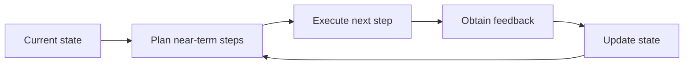

It fits rapidly changing environments where distant-future information is unreliable.

Compared with a full Plan-and-Execute plan:

| Full plan | Rolling-horizon planning |
|---|---|
| Generates relatively complete steps at the start | Plans only a bounded horizon each time |
| Strong global visibility | Strong adaptability to environmental change |
| Distant steps may become invalid | More planning rounds are needed |

## 6.10 Adaptive decomposition

Adaptive decomposition uses runtime conditions to decide:

- Whether to decompose further.
- Whether to merge overly fine tasks.
- Whether to replan.
- Whether to change executors.
- Whether to increase or decrease parallelism.

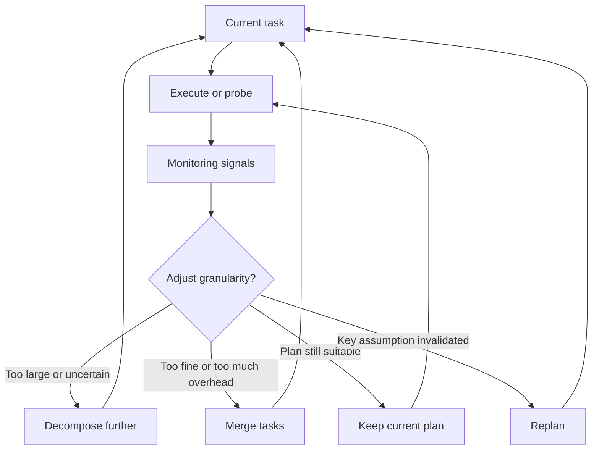

### 6.10.1 Adaptation signals

#### Uncertainty

- Low model confidence.
- Large differences between candidate approaches.
- Insufficient input information.
- Unclear dependencies.

Self-reported confidence is only a clue, not a probability of correctness. More dependable triggers include missing inputs, conflicting candidates, and reproducible verification failures.

#### Execution feedback

- Repeated tool failures.
- Outputs failing acceptance checks.
- Actual results diverging from the plan.
- Discovery of new critical facts.

#### Resource pressure

- The context window is nearly full.
- Tokens or money are being consumed too quickly.
- A single task runs too long.
- Insufficient concurrency capacity.

#### Progress signals

- Several rounds add no useful information.
- The same step is repeated.
- Tasks duplicate one another's work.
- Some subtasks remain blocked for a long time.

### 6.10.2 Adaptive strategies

| Signal | Possible strategy |
|---|---|
| Subtask objective is too broad | Decompose further |
| Many tiny tasks pass very little information | Merge tasks |
| External environment changes | Replan the affected portion |
| Excessive context pressure | Externalize artifacts, compress context, or work in stages |
| Critical path is blocked | Raise priority or change executor |
| Several tasks repeat retrieval | Share artifacts or combine retrieval |
| Repeated verification failures | Change method, upgrade model, or request human help |

## 6.11 Dependencies and task DAGs

After decomposition, analyze dependencies between subtasks.

Let each node represent a task and each directed edge mean “the later task depends on the earlier one.” Only after checking for cycles do you have a task DAG:

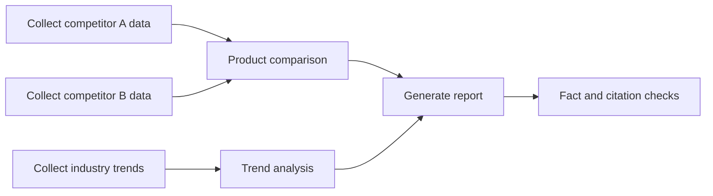

### 6.11.1 Dependency types

#### Data dependencies

A downstream task needs an upstream task's output.

#### Control dependencies

A downstream task runs only when a condition holds.

#### Resource dependencies

Tasks compete for the same rate-limited API, database connections, or execution environment.

Contention is usually handled with capacity limits, semaphores, or locks; it does not necessarily require an ordering edge between every pair of tasks. Conditional branches also need rules for marking unselected branches `skipped` and for whether a join waits for all branches, any branch, or a specified subset. Otherwise it may wait forever for nodes that will never run.

#### Safety dependencies

A step must wait until approval, authentication, or a required check succeeds.

### 6.11.2 DAG validation

Before execution, check at least:

- Cyclic dependencies.
- Missing nodes.
- Whether prerequisite steps supply required inputs.
- Conditions that can never be satisfied.
- Safe ordering of writes.
- Races caused by concurrent execution.

Keep each DAG version acyclic. An outer state machine records retry counts, replanning versions, and loop exit conditions. Task states need more than `pending/done`: at least distinguish ready, running, successful, failed, blocked, skipped, and canceled. Claim tasks atomically or use leases. Merely querying to-do items and then executing them lets multiple workers claim the same work.

Leases are not sufficient on their own: an old worker may keep running after its lease expires. Update the claim identifier on every reassignment; at commit time, the result store must atomically validate that identifier and the plan version, rejecting stale executors' results. External writes still need concurrency control and an idempotency contract at the tool boundary. Discarding a late result at the scheduler does not undo its side effects.

## 6.12 Parallel execution

Tasks with satisfied dependencies and sufficient concurrency resources can use fan-out/fan-in: dispatch to several branches, then aggregate their results.

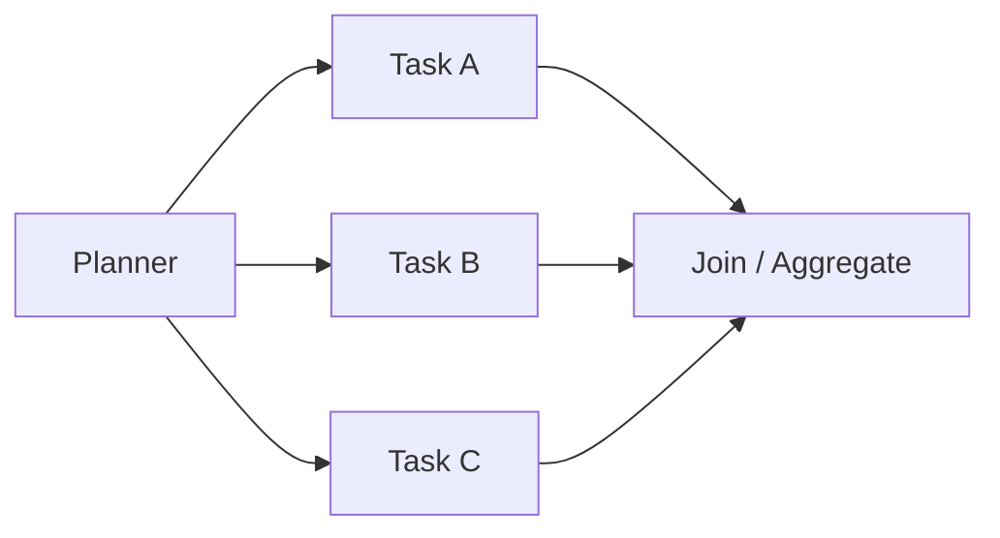

### 6.12.1 Sequential execution time

If tasks run sequentially, ignoring scheduling overhead:

$$
T_{seq}=\sum_{i=1}^{n}d_i
$$

Here, `dᵢ` is the duration of task `i`.

### 6.12.2 Ideal parallel execution time

If all tasks are independent and resources are sufficient, ideal parallel time is close to the slowest task's duration:

$$
T_{parallel}\approx \max(d_1,d_2,\ldots,d_n)+T_{overhead}
$$

`T_overhead` includes scheduling, communication, and result-merging overhead.

### 6.12.3 Speedup

$$
Speedup=\frac{T_{seq}}{T_{parallel}}
$$

The fraction of time saved is:

$$
Saving=1-\frac{T_{parallel}}{T_{seq}}
$$

### 6.12.4 Limits on parallelism's benefit

The benefit depends on:

- The parallelizable fraction of the work.
- The slowest branch.
- Task dependencies.
- API rate limits.
- Model concurrency limits.
- Scheduling and merging overhead.
- Failures and retries.

Amdahl's law expresses a theoretical upper bound:

$$
Speedup(k)=\frac{1}{(1-p)+\frac{p}{k}}
$$

Where:

- `p` is the parallelizable fraction.
- `k` is the number of parallel execution units.

This model assumes a fixed workload, evenly divisible parallel work, and no communication or contention costs. Actual agent branch lengths, model rate limits, and retries may vary, so a fixed savings percentage is not a reliable prediction. Parallel scheduling usually reduces total completion time; it does not automatically shorten the DAG's dependency critical path.

### 6.12.5 Worked example

In the earlier example, three independent research tasks take 40, 50, and 60 seconds, and merging takes 10 seconds.

Including the merge time needed in both approaches, sequential execution takes:

$$
T_{seq}=40+50+60+10=160
$$

Ideal parallel execution takes:

$$
T_{parallel}=60+10=70
$$

The saved fraction in this example is:

$$
Saving=1-\frac{70}{160}=0.5625
$$

The 56.25% saving comes from these particular numbers. It is not a fixed gain available to every task.

## 6.13 The critical path

The longest dependency path in a task DAG, weighted by execution duration, is the **critical path**. Total completion time equals this path's length when resources are sufficient, ready tasks start immediately, and extra overhead is ignored. With concurrency limits, queues, or contention, it is only a lower bound.

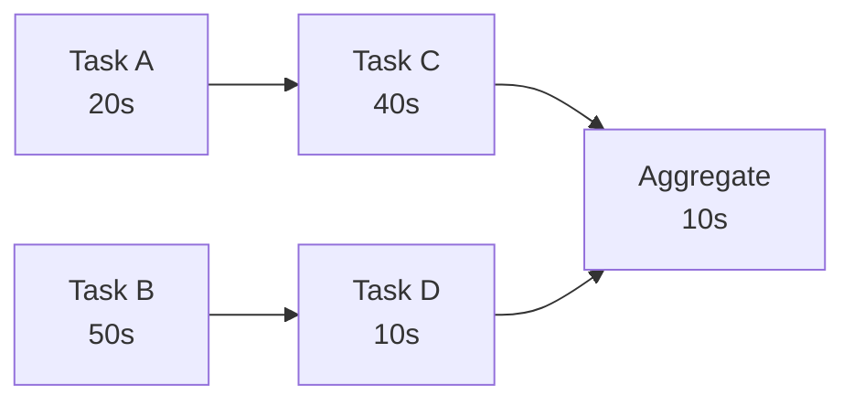

The two main paths are:

- A → C → E: 70 seconds.
- B → D → E: 70 seconds.

With only one executor, total time is 130 seconds, not 70. Both paths are critical, so shortening only one cannot beat the other path's 70-second lower bound.

Optimizing tasks off the critical path may not reduce overall completion time. The scheduler should prioritize:

- Slow tasks on the critical path.
- Tasks blocking several downstream nodes.
- Tasks with high failure rates.
- Tasks using scarce resources.

## 6.14 Concurrency does not mean unlimited parallelism

Increasing concurrency without bounds can cause:

- API rate limiting.
- Exhausted database connections.
- Sudden spikes in token usage and cost.
- Conflicts from multiple tasks writing the same resource.
- Retry-driven traffic amplification.
- An aggregation node overwhelmed by results.

Production systems need:

- Maximum concurrency limits.
- Per-tool rate limits.
- Priority queues.
- Backpressure.
- Timeout and cancellation propagation.
- Concurrent-write control.
- Failure isolation.

## 6.15 Passing results between tasks

Do not copy each subtask's entire conversation into every downstream task. Produce structured artifacts instead.

The Chinese summary in this example states that competitor A released three major updates in the past six months.

```json
{
  "artifact_id": "competitor-a-updates",
  "schema": "competitor-update-list",
  "producer": "research-competitor-a",
  "created_at": "2026-08-28T16:00:00Z",
  "summary": "竞品 A 最近六个月发布了三个主要更新",
  "data_uri": "artifact://competitor-a-updates.json",
  "sources": [
    "https://example.com/source-1",
    "https://example.com/source-2"
  ]
}
```

Downstream tasks read only:

- The artifact summary.
- Required fields.
- Traceable sources.
- Full content when needed.

This reduces duplicated context and information contamination.

Artifacts should also be bound to input versions, producing tasks, and validation results. Consumers must check freshness and permissions, not just read summaries. Summaries can omit exceptions, and source pages may contain untrusted instructions. Inclusion in an internal artifact must not elevate such content into system instructions.

## 6.16 Planner, scheduler, executor, and verifier

Systems for decomposing complex tasks commonly separate four responsibilities:

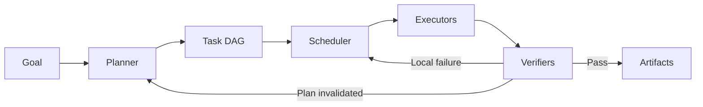

### Planner

Responsible for:

- Generating tasks.
- Establishing dependencies.
- Specifying acceptance criteria.
- Replanning from feedback.

### Scheduler

Responsible for:

- Finding currently executable tasks.
- Controlling concurrency.
- Managing priorities.
- Handling resources and rate limits.
- Scheduling retries.

### Executor

May be:

- A tool.
- An ordinary program.
- An LLM.
- A ReAct agent.
- A specialized worker agent.

### Verifier

Checks:

- Output schemas.
- Facts and citations.
- Tests and rules.
- Task success criteria.
- Safety and authorization.

Separating these responsibilities is easier to control than having one LLM plan, execute, verify, and schedule everything.

## 6.17 Handling failures

“Retry forever” should not be the only response to a failed subtask.

### 6.17.1 Local retries

Suitable for transient network errors, rate limiting, and occasional invalid model outputs.

For read-only requests, use error-specific backoff with jitter. A timed-out write may have succeeded on the server while its response was lost. Query its status using the operation ID or retry with the same idempotency key; do not immediately create a new request and execute it again. Authorization denials, invalid input, and exhausted budgets usually should not be retried unchanged.

### 6.17.2 Adjust parameters

Use structured errors to change queries, arguments, or timeouts.

### 6.17.3 Change executors

For example:

- Escalate from a small model to a more capable one.
- Switch to a backup data source after a search API fails.
- Hand off to a person after an agent fails.

### 6.17.4 Decompose again

If the task is too large, split it into smaller steps.

### 6.17.5 Replan

When key assumptions fail, change dependencies and the remaining plan.

Keep historical versions rather than overwrite an executing plan in place. Compute the affected subgraph, cancel old nodes that have not started, request cancellation of running tasks, and quarantine their late results. Reuse completed artifacts only if inputs and assumptions remain valid. A cancellation request does not guarantee reversal of external side effects.

### 6.17.6 Compensating actions

Operations that have already caused side effects cannot simply be retried. Design for:

- Rollback.
- Compensating transactions.
- Idempotency keys.
- Human confirmation.

[AWS's guidance on idempotent API design](https://aws.amazon.com/builders-library/making-retries-safe-with-idempotent-APIs/) emphasizes caller-provided request identifiers that express the same operation, with server-side coordination between deduplication records and committing side effects. A task ID does not by itself guarantee exactly-once effects. Define an idempotency key's lifetime, parameter-consistency rules, and scope. Compensation does not turn back time: a refund is not the same as reversing shipment, and a sent email generally cannot be rolled back.

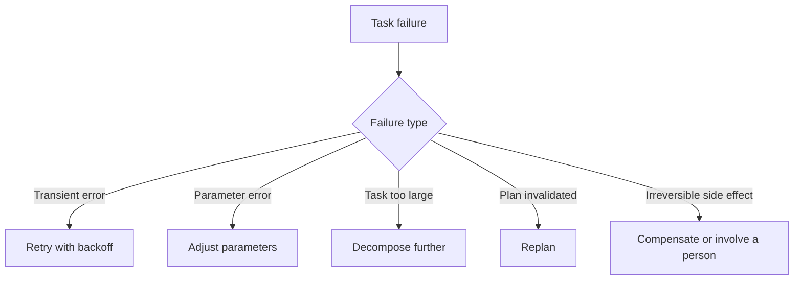

## 6.18 An adaptive decomposition controller

A practical adaptive decomposition controller might operate as follows:

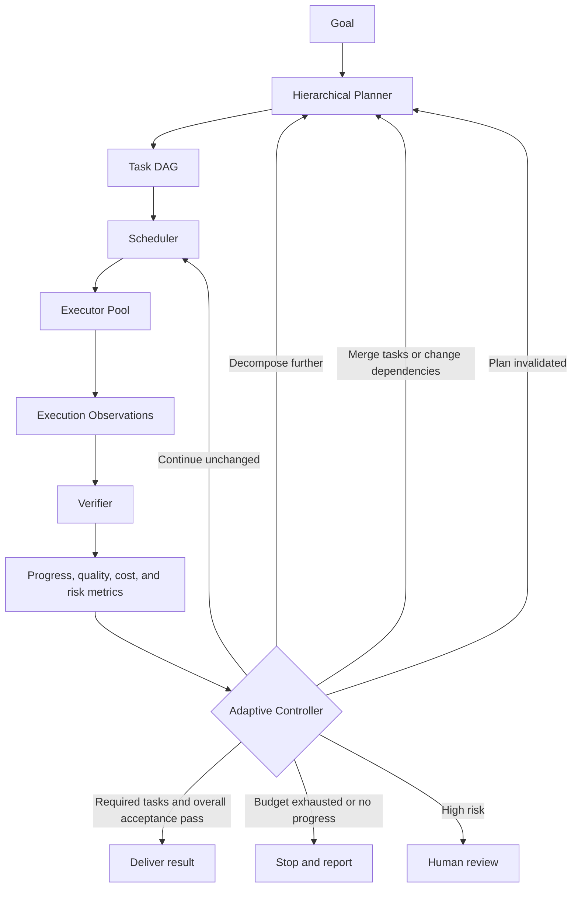

Changing granularity or dependencies creates a new DAG version for validation; it does not directly mutate the running graph. The controller should use observable metrics, not just the planner's natural-language judgment:

- Task completion rate.
- Verification pass rate.
- Retry count.
- Repeated-call ratio.
- Context usage.
- Tokens and cost.
- Changes to the critical path.
- Time spent blocked.
- Risk level.

## 6.19 Example: a complex research task

Goal:

> Research three competitors' product, pricing, and market developments over the past six months, then produce a sourced comparison report.

### 6.19.1 High-level decomposition

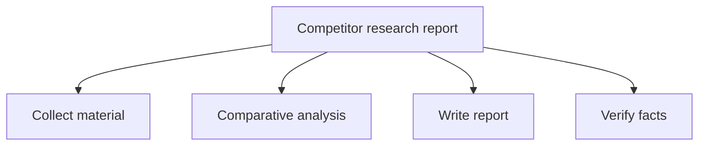

This diagram lists the work, not a parallel schedule. Comparison depends on research, and the report depends on analysis. Sources can be checked during collection, but the conclusions assembled in the final draft still need another check.

### 6.19.2 Expand material collection

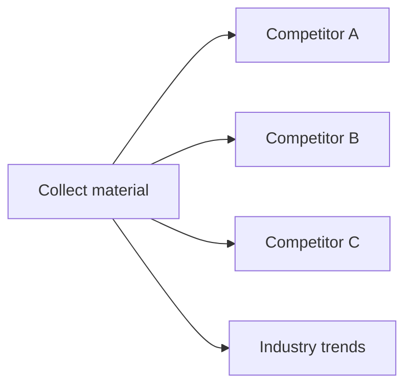

These four tasks can run in parallel when data access is authorized, they do not write the same resources, and the concurrency budget is sufficient.

### 6.19.3 Structured outputs

Each competitor-research task produces an artifact with a common structure:

```json
{
  "competitor": "A",
  "product_updates": [],
  "pricing_changes": [],
  "market_events": [],
  "sources": [],
  "open_questions": []
}
```

### 6.19.4 Dynamic adjustments

If a major acquisition involving competitor A is discovered:

1. The planner inserts a dedicated acquisition-research task.
2. The scheduler assigns it high priority.
3. Analysis waits for that artifact.
4. The report gains a “Strategic implications” section.

### 6.19.5 Verification

Check the research material first, then the completed report, so synthesis does not introduce unchecked errors:

- Does each key conclusion have at least one reliable source?
- Are time ranges consistent?
- Are competitors compared along the same dimensions?
- Are facts, inferences, and recommendations distinguished?
- Is any information stale or conflicting?

## 6.20 Common anti-patterns

### Generate dozens of detailed steps at once

Distant steps rest on unverified assumptions and soon become invalid.

### Give tasks names but no contracts

“Research competitors” does not define how to judge completion.

### Share full context with every subtask

This can increase cost, interfere with decisions, and expose sensitive content a subtask does not need. Greater data visibility does not confer legitimate authorization. Filter context according to each executor's permissions.

### Assign everything to the same large model

This overlooks the cost advantages of ordinary code, small models, tools, and specialized agents.

### Parallelize without dependency analysis

Tasks may read incomplete data or race on writes.

### Start over after every failure

This wastes completed work and makes errors harder to locate.

### Have the planner verify its own plan

The same blind spots are likely to persist. Use rules, schemas, an independent verifier, or human review.

### Claim a fixed percentage benefit from concurrency

Calculate parallel gains from the DAG, critical path, and actual measurements.

## 6.21 Choosing a decomposition strategy

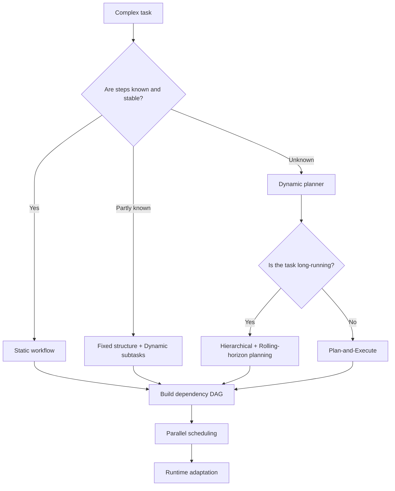

A practical design usually converges in this order:

1. Prefer deterministic static decomposition.
2. Use a dynamic planner for unknown portions.
3. Use hierarchical and rolling-horizon planning for long tasks.
4. Build dependency graphs for schedulable steps; represent loops with bounded state machines or versioned DAGs.
5. Parallelize only genuinely independent tasks.
6. Drive adaptive decomposition with runtime metrics.

## 6.22 Evaluating decomposition quality

| Metric | Meaning |
|---|---|
| Completion rate | Completion of subtasks and the overall task |
| Validation pass rate | Fraction of subtasks accepted on the first attempt |
| Retry locality | Whether retries are limited to affected work |
| Parallel efficiency | Whether resource use reduces completion time, subject to critical-path and capacity lower bounds |
| Planning overhead | Planning cost as a fraction of total cost |
| Context efficiency | Whether each task receives only necessary context |
| Artifact reuse | Effective reuse of intermediate results |
| Replan rate | Frequency of plan invalidation and replanning |
| Duplicate work | Fraction of duplicated work across tasks |
| Recovery time | Time needed to recover from failure |

More tasks do not necessarily make a better decomposition. The objective is:

> **Improve overall task success and recoverability at lower total cost and risk.**

## 6.23 Chapter summary

Complex-task decomposition can be understood at three levels:

### Why decompose?

- Reduce context and reasoning pressure.
- Support independent verification.
- Support local retries.
- Support parallelism and specialization.

### How to decompose

- Static decomposition fits stable processes.
- Dynamic decomposition fits open-ended goals.
- Hierarchical decomposition avoids expanding too deeply at once.
- Rolling-horizon planning uses fresh feedback.
- Adaptive decomposition adjusts granularity from runtime metrics.

### After decomposition

- Define task contracts.
- Build a dependency DAG.
- Analyze the critical path.
- Schedule parallelizable tasks.
- Persist artifacts.
- Set up verification, retries, fallbacks, and human intervention.

Ultimately, granularity must satisfy two requirements:

> **Each task should be small enough to execute, verify, and retry independently, yet large enough to produce a meaningful, reusable business result.**

## References

- [Anthropic: Building Effective Agents](https://www.anthropic.com/engineering/building-effective-agents)
- [LangChain: Planning Agents](https://www.langchain.com/blog/planning-agents)
- [LLMCompiler: An LLM Compiler for Parallel Function Calling](https://arxiv.org/abs/2312.04511)
- [ReWOO: Decoupling Reasoning from Observations for Efficient Augmented Language Models](https://arxiv.org/abs/2305.18323)
- [AWS Builders' Library: Making retries safe with idempotent APIs](https://aws.amazon.com/builders-library/making-retries-safe-with-idempotent-APIs/)
- [SHOP planners: the authors' project page and implementations](https://www.cs.umd.edu/projects/shop/)
- [Martin Kleppmann: How to do distributed locking](https://martin.kleppmann.com/2016/02/08/how-to-do-distributed-locking.html) — late writes after lease expiration and fencing, from the 2016 article.
