# 第六章：复杂任务拆分与调度

## 6.1 任务拆分解决什么问题

复杂任务通常具有以下特征：

- 步骤数量多；
- 中间状态多；
- 部分信息需要执行后才能获得；
- 子任务之间存在依赖；
- 不同步骤需要不同工具或专业能力；
- 单个步骤可能失败并需要重试；
- 整体任务无法放入一次模型调用。

任务拆分要做的是把复杂目标改写成一组：

> **可执行、可验证、可调度、可恢复的任务单元。**

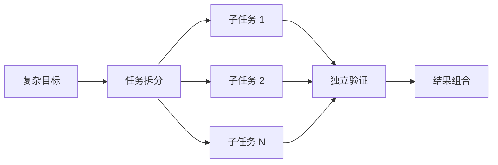

## 6.2 为什么要拆分

### 6.2.1 降低上下文压力

Agent 执行时间越长，产生的消息、工具结果和中间结论越多。如果把所有内容都持续加入上下文，会导致：

- 超出 Context Window；
- Token 成本和延迟上升；
- 重要约束被噪音稀释；
- 早期信息被压缩或遗忘；
- 模型更难判断当前进度。

拆分后，每个子任务只需要最小充分上下文，并通过 Artifact、状态或引用传递结果。

### 6.2.2 降低单步推理难度

让模型一次完成“调研、分析、比较、验证、写报告”通常比让它分别完成这些步骤更不稳定。

拆开后，每次模型调用的目标和输入都会更聚焦，输出格式也更容易约束，成功标准也更容易定义。

### 6.2.3 支持独立验证

完整任务失败时，很难定位问题来自搜索、分析还是结果合成。拆分后，可以为每个步骤设置验收条件：

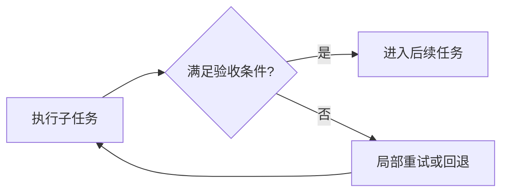

### 6.2.4 支持局部重试和恢复

如果第 8 个步骤失败，可靠系统应只重试受影响的步骤，而不是从第 1 步重新执行。

这要求：

- 子任务具有稳定 ID；
- 中间结果可以持久化；
- 已完成步骤支持 checkpoint；
- 写操作尽量幂等；
- 失败影响范围可以追踪。

### 6.2.5 支持并行执行

没有依赖关系的子任务可以并发执行，从而降低总耗时。

### 6.2.6 支持专业化

不同子任务可以分配给不同执行器：

- 小模型处理分类和提取；
- 强模型处理复杂规划；
- 搜索 Agent 负责资料收集；
- 代码 Agent 负责实现；
- 确定性程序负责计算和验证。

## 6.3 什么时候不应该拆

任务拆分也会产生额外成本：

- Planner 调用；
- 状态持久化；
- 子任务调度；
- 上下文切换；
- 中间结果序列化；
- 最终结果合并；
- 更多失败点。

以下情况通常不需要复杂拆分：

- 单次模型调用即可稳定完成；
- 任务只有一个原子操作；
- 子任务之间高度耦合，拆分后需要反复同步；
- 拆分和合并成本高于执行本身；
- 不存在独立验收标准。

> **拆分是一种成本优化和可靠性手段，不是复杂任务的固定仪式。**

## 6.4 好的任务单元是什么

“以原子操作为标准”是一个好的起点，但工程上更准确的定义是：

> **一个任务单元应当能够独立执行、独立验证、独立重试，并具有明确输入、输出和副作用边界。**

一个完整的 Task Contract 通常包含：

| 字段 | 作用 |
|---|---|
| `id` | 稳定标识 |
| `goal` | 子任务目标 |
| `inputs` | 必需输入和引用 |
| `dependencies` | 前置任务 |
| `executor` | Tool、模型、Agent 或 Workflow |
| `outputs` | 结构化输出或 Artifact |
| `success_criteria` | 验收条件 |
| `side_effects` | 是否写入外部系统 |
| `timeout` | 最大执行时间 |
| `retry_policy` | 重试与回退策略 |
| `risk_level` | 权限和审批等级 |

```json
{
  "id": "research-competitor-a",
  "goal": "收集竞品 A 最近六个月的产品更新",
  "inputs": {
    "competitor": "A",
    "time_range": "6 months"
  },
  "dependencies": [],
  "executor": "research-agent",
  "outputs": {
    "type": "artifact",
    "schema": "competitor-update-list"
  },
  "success_criteria": [
    "至少包含两个独立来源",
    "每项更新包含发布日期和链接"
  ],
  "timeout_seconds": 120,
  "retry_policy": {
    "max_attempts": 2
  },
  "risk_level": "read-only"
}
```

## 6.5 粒度：不能太粗，也不能太细

### 6.5.1 粒度过粗

例如：

> 调研所有竞品并写一份完整战略报告。

问题包括：

- 输入和输出范围过大；
- 很难定义单步成功标准；
- 失败后只能整体重试；
- 无法充分并行；
- 中间过程不可观测。

### 6.5.2 粒度过细

例如：

1. 打开搜索工具；
2. 输入一个关键词；
3. 点击搜索；
4. 读取第一条结果；
5. 复制一句话。

问题包括：

- 调度开销过高；
- 模型调用次数增加；
- 状态过于碎片化；
- 每个步骤缺乏独立业务价值；
- 整体连贯性下降。

### 6.5.3 合理粒度

更合理的子任务是：

> 搜索竞品 A 最近六个月的官方产品更新，并输出带来源的结构化列表。

它同时具备：

- 明确目标；
- 有限范围；
- 独立输出；
- 可验证标准；
- 可重试性；
- 可与其他竞品调研并行。

### 6.5.4 粒度判断清单

一个子任务如果同时满足多数条件，通常粒度较合适：

- 可以由一个执行器在有限时间内完成；
- 输入和输出能够结构化描述；
- 有明确的 Done Definition；
- 失败后可以局部重试；
- 与其他任务通过有限接口交互；
- 不需要持续共享大量隐含上下文；
- 完成后能产生可复用的 Artifact。

## 6.6 静态拆分

静态拆分由开发者预先定义步骤和依赖，适合流程稳定、规则清晰的场景。


### 6.6.1 优势

- 行为可预测；
- 容易测试；
- 成本和延迟容易估算；
- 权限边界清晰；
- 适合审计和合规。

### 6.6.2 局限

- 无法覆盖所有未知情况；
- 流程变化需要修改代码；
- 分支过多时维护复杂；
- 不适合开放式目标。

静态拆分通常由 Workflow、DAG 或状态机实现。

## 6.7 动态拆分

动态拆分由 Planner 根据目标和当前环境生成子任务。

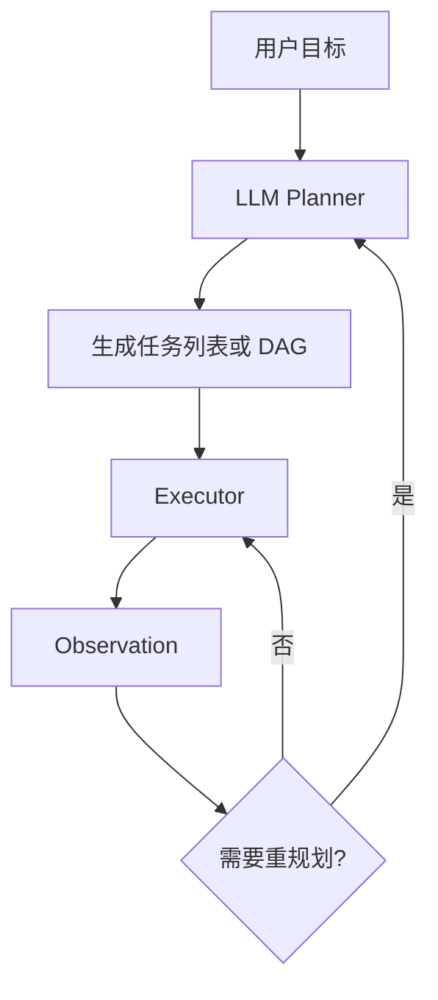

适合：

- 无法预先确定步骤数量；
- 不同输入需要完全不同的执行路径；
- 任务依赖外部环境反馈；
- 需要探索和动态决策。

### 6.7.1 优势

- 灵活；
- 能处理开放式任务；
- 可以根据新信息调整；
- 适合长周期研究和编码任务。

### 6.7.2 局限

- 规划质量不稳定；
- 可能遗漏关键步骤；
- 可能产生无法执行的任务；
- 容易过度拆分或拆分不足；
- Planner 调用增加成本和延迟。

因此，动态计划必须经过 Schema 校验、依赖检查和可执行性检查。

## 6.8 分层拆分

复杂任务不适合一次性拆到最底层。更稳健的方法是分层规划：

1. 先生成高层里程碑；
2. 只展开当前里程碑；
3. 执行并验证；
4. 再展开下一层。

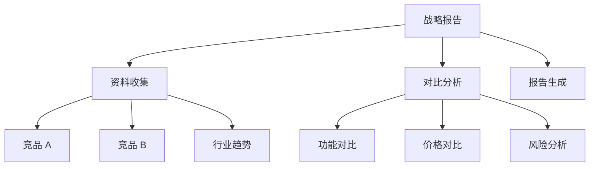

这和 Hierarchical Task Network 的思路很接近：

- 高层任务描述目标；
- 方法定义如何展开；
- 叶子任务最终由 Tool、模型或 Agent 执行。

### 分层拆分的优势

- 避免一次生成过长计划；
- 降低早期错误影响范围；
- 保留全局方向；
- 可以按阶段分配预算；
- 更适合长时间运行的 Agent。

## 6.9 增量拆分与滚动规划

滚动规划（Rolling Horizon Planning）不试图一次规划整个未来，而是：

1. 规划最近的若干步骤；
2. 执行其中一步或一个阶段；
3. 获取真实反馈；
4. 更新剩余计划；
5. 再向前展开。


它适合环境变化快、远期信息不可靠的任务。

与完整 Plan-and-Execute 相比：

| 完整计划 | 滚动规划 |
|---|---|
| 一开始生成较完整步骤 | 每次只规划有限范围 |
| 全局可见性强 | 对环境变化适应性强 |
| 远期计划容易失效 | 需要更多规划轮次 |

## 6.10 自适应拆分

自适应拆分根据运行情况动态决定：

- 是否继续拆分；
- 是否合并过细任务；
- 是否重新规划；
- 是否改变执行器；
- 是否提高或降低并行度。

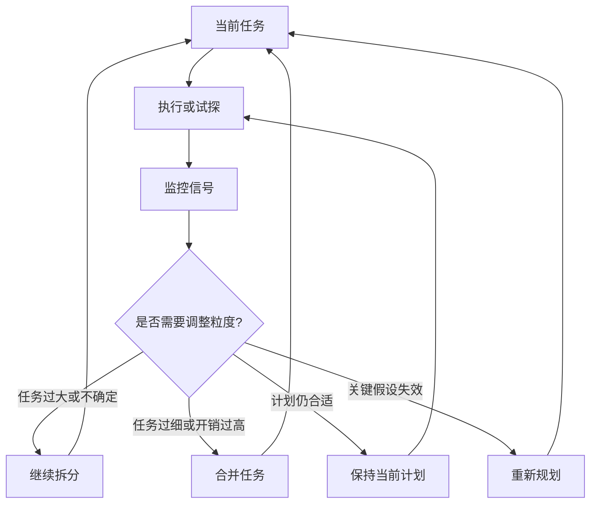

### 6.10.1 自适应信号

#### 不确定性

- 模型置信度低；
- 候选方案差异大；
- 输入信息不足；
- 依赖关系不清晰。

#### 执行反馈

- Tool 连续失败；
- 输出无法通过验收；
- 实际结果偏离计划；
- 发现新的关键事实。

#### 资源压力

- Context Window 接近上限；
- Token 或费用消耗过快；
- 单个任务运行时间过长；
- 并发资源不足。

#### 进度信号

- 多轮没有新增有效信息；
- 相同步骤反复执行；
- 任务之间出现重复工作；
- 某些子任务长期阻塞。

### 6.10.2 自适应策略

| 信号 | 可选策略 |
|---|---|
| 子任务目标过于宽泛 | 继续向下拆分 |
| 大量微任务只传递少量信息 | 合并任务 |
| 外部环境发生变化 | 重规划受影响部分 |
| Context 压力过高 | 外部化 Artifact、压缩或分阶段 |
| 关键路径阻塞 | 提高优先级或更换执行器 |
| 多个任务重复检索 | 共享 Artifact 或合并检索 |
| 验证连续失败 | 改变方法、升级模型或请求人工帮助 |

## 6.11 依赖关系与任务 DAG

拆分完成后，必须分析子任务之间的依赖关系。

设每个节点表示任务，每条有向边表示“后一个任务依赖前一个任务”，可以得到任务 DAG：

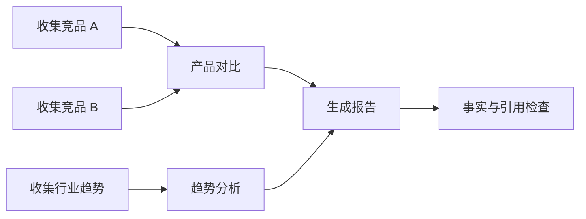

### 6.11.1 依赖类型

#### 数据依赖

后续任务需要前置任务的输出。

#### 控制依赖

只有满足某个条件才执行后续任务。

#### 资源依赖

多个任务竞争相同的限流 API、数据库连接或执行环境。

#### 安全依赖

某个步骤必须在审批、认证或检查通过后执行。

### 6.11.2 DAG 校验

执行前至少需要检查：

- 是否存在循环依赖；
- 是否存在缺失节点；
- 输入是否由前置步骤提供；
- 是否有永远无法满足的条件；
- 写操作顺序是否安全；
- 并发执行是否会产生竞争。

## 6.12 并行执行

没有依赖的任务可以采用 Fan-out / Fan-in：

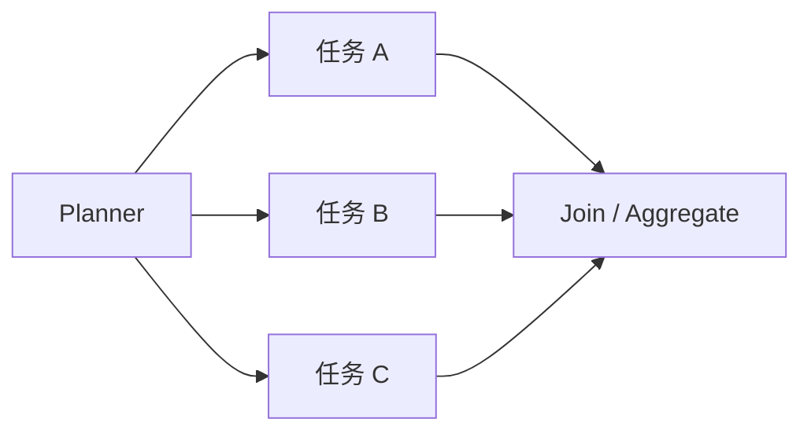

### 6.12.1 顺序执行时间

若任务依次执行，忽略调度开销时：

$$
T_{seq}=\sum_{i=1}^{n}d_i
$$

其中 `dᵢ` 是第 `i` 个任务的执行时间。

### 6.12.2 理想并行时间

若所有任务互不依赖且资源充足，理想并行时间接近最慢任务：

$$
T_{parallel}\approx \max(d_1,d_2,\ldots,d_n)+T_{overhead}
$$

其中 `T_overhead` 包含调度、通信和结果合并开销。

### 6.12.3 加速比

$$
Speedup=\frac{T_{seq}}{T_{parallel}}
$$

并行节省比例为：

$$
Saving=1-\frac{T_{parallel}}{T_{seq}}
$$

### 6.12.4 为什么不能保证降低 40% 到 60%

并行收益取决于：

- 可并行任务比例；
- 最慢分支；
- 任务依赖；
- API 限流；
- 模型并发限制；
- 调度与合并开销；
- 失败和重试。

Amdahl 定律可以表示理论上限：

$$
Speedup(k)=\frac{1}{(1-p)+\frac{p}{k}}
$$

其中：

- `p` 是可并行部分比例；
- `k` 是并行执行单元数量。

因此，“关键路径时间降低 40% 到 60%”只能作为某个系统的实测结果，不能作为通用规律。

### 6.12.5 具体示例

三个独立调研任务分别耗时 40 秒、50 秒和 60 秒，结果合并耗时 10 秒。

顺序执行：

$$
T_{seq}=40+50+60+10=160
$$

理想并行执行：

$$
T_{parallel}=60+10=70
$$

该示例中的节省比例约为：

$$
Saving=1-\frac{70}{160}=56.25\%
$$

这里的 56.25% 来自这组具体数据，并不是所有任务都能达到的固定收益。

## 6.13 关键路径

任务 DAG 的总完成时间由最长依赖路径决定，这条路径称为 Critical Path。

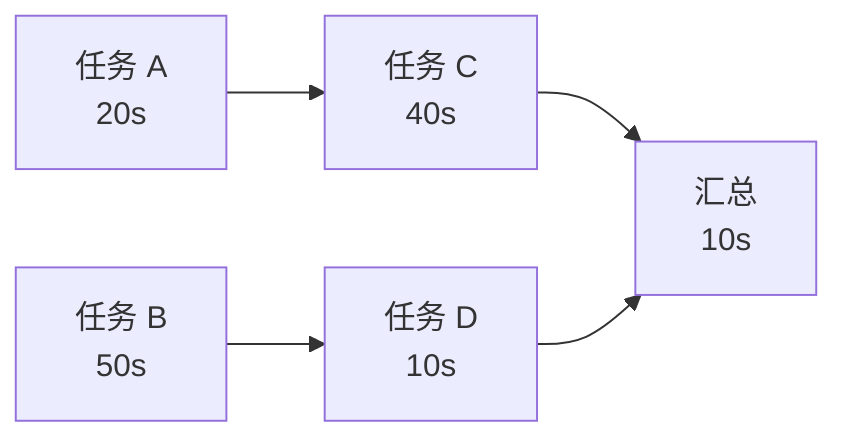

两条主要路径：

- A → C → E：70 秒；
- B → D → E：70 秒。

优化不在关键路径上的任务，可能不会降低整体完成时间。调度器应优先关注：

- 关键路径上的慢任务；
- 阻塞多个后续节点的任务；
- 高失败率任务；
- 稀缺资源任务。

## 6.14 并发不等于无限并行

无限提高并发可能导致：

- API 限流；
- 数据库连接耗尽；
- Token 和费用瞬间增长；
- 多个任务写入同一资源产生冲突；
- 失败重试形成流量放大；
- 汇总节点被大量结果淹没。

生产系统需要：

- 最大并发数；
- 每个 Tool 的独立限流；
- 优先级队列；
- Backpressure；
- 超时和取消传播；
- 并发写入控制；
- 失败隔离。

## 6.15 任务之间如何传递结果

不应把每个子任务的完整对话直接复制给所有后续任务。更好的方式是生成结构化 Artifact。

```json
{
  "artifact_id": "competitor-a-updates",
  "schema": "competitor-update-list",
  "producer": "research-competitor-a",
  "created_at": "2026-08-28T16:00:00Z",
  "summary": "竞品 A 最近六个月发布了三个主要更新",
  "data_uri": "artifact://competitor-a-updates.json",
  "sources": [
    "https://example.com/source-1",
    "https://example.com/source-2"
  ]
}
```

后续任务只读取：

- Artifact 摘要；
- 必需字段；
- 可追溯来源；
- 需要时再加载完整内容。

这可以降低上下文重复和信息污染。

## 6.16 Planner、Scheduler、Executor 与 Verifier

复杂任务的拆分系统，通常会把下面四类职责分开：

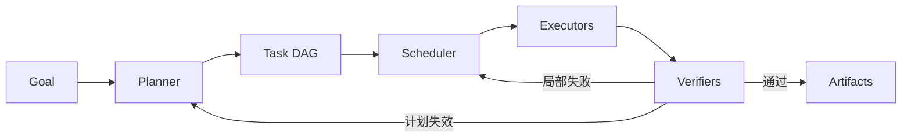

### Planner

负责：

- 生成任务；
- 确定依赖；
- 指定验收条件；
- 根据反馈重新规划。

### Scheduler

负责：

- 找出当前可执行任务；
- 控制并发；
- 管理优先级；
- 处理资源和限流；
- 调度重试。

### Executor

可以是：

- Tool；
- 普通程序；
- LLM；
- ReAct Agent；
- 专业 Worker Agent。

### Verifier

负责检查：

- 输出 Schema；
- 事实和引用；
- 测试和规则；
- 任务成功标准；
- 安全和权限。

将这些职责分开，比让一个 LLM 同时规划、执行、验证和调度更容易控制。

## 6.17 失败处理

子任务失败后不应只有“无限重试”一种策略。

### 6.17.1 局部重试

适合临时网络错误、限流和偶发模型输出错误。

### 6.17.2 参数调整

根据结构化错误修改查询、参数或超时。

### 6.17.3 更换执行器

例如：

- 小模型失败后升级强模型；
- 搜索 API 失败后切换备用数据源；
- Agent 失败后进入人工处理。

### 6.17.4 重新拆分

如果任务本身过大，可以拆成更小步骤。

### 6.17.5 重新规划

如果关键假设失效，需要修改依赖和后续计划。

### 6.17.6 补偿操作

对于已经产生副作用的操作，不能简单重试。需要设计：

- 回滚；
- 补偿事务；
- 幂等键；
- 人工确认。

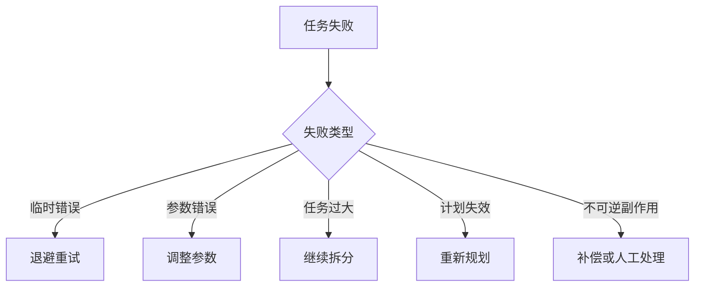

## 6.18 自适应拆分控制器

一个能落地的自适应拆分控制器大致会这样运行：

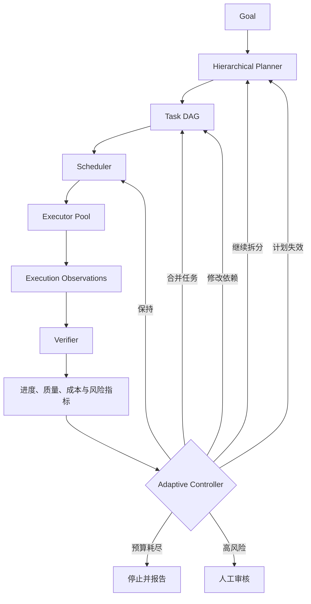

控制器不应只听 Planner 的自然语言判断，还应使用可观测指标：

- 任务完成率；
- 验证通过率；
- 重试次数；
- 重复调用比例；
- Context 使用量；
- Token 和费用；
- 关键路径变化；
- 阻塞时间；
- 风险等级。

## 6.19 复杂研究任务示例

目标：

> 调研三家竞品最近半年的产品、定价和市场动态，并形成带来源的比较报告。

### 6.19.1 高层拆分

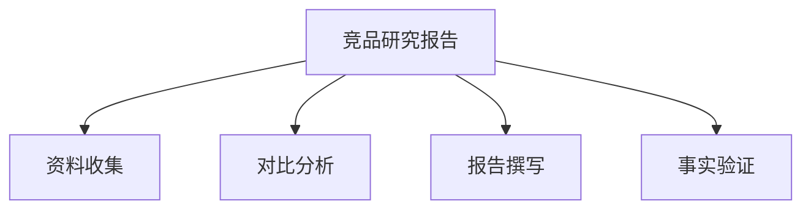

### 6.19.2 展开资料收集

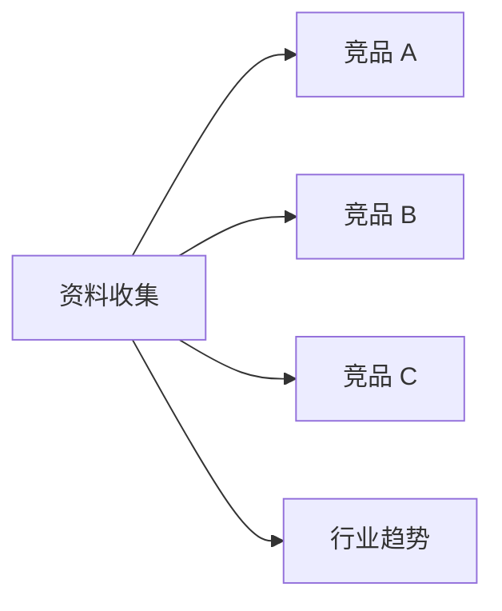

四个任务可以并行执行。

### 6.19.3 结构化输出

每个竞品调研任务输出统一 Artifact：

```json
{
  "competitor": "A",
  "product_updates": [],
  "pricing_changes": [],
  "market_events": [],
  "sources": [],
  "open_questions": []
}
```

### 6.19.4 动态调整

如果竞品 A 出现重大收购事件：

1. Planner 插入“收购事件专项调研”；
2. Scheduler 将它设为高优先级；
3. 分析任务等待该 Artifact；
4. 报告结构增加“战略影响”章节。

### 6.19.5 验证

最终报告生成前检查：

- 关键结论是否至少有一个可靠来源；
- 时间范围是否一致；
- 不同竞品是否使用同一比较维度；
- 是否区分事实、推断和建议；
- 是否存在过时或冲突信息。

## 6.20 常见反模式

### 一次性生成几十个详细步骤

远期步骤建立在尚未验证的假设上，很快会失效。

### 只有任务名称，没有 Task Contract

“调研竞品”无法明确判断是否完成。

### 所有子任务共享完整上下文

导致成本上升、信息污染和权限扩大。

### 所有任务都交给同一个大模型

忽略了普通代码、小模型、Tool 和专业 Agent 的成本优势。

### 没有依赖分析就并行

可能读取未完成数据，或产生写入竞争。

### 失败后从头开始

浪费已完成结果，也难以定位错误。

### Planner 自己验证自己的计划

容易共享相同盲点。应使用规则、Schema、独立 Verifier 或人工审核。

### 把并发收益写成固定百分比

并行收益必须根据 DAG、关键路径和真实指标计算。

## 6.21 如何选择拆分策略

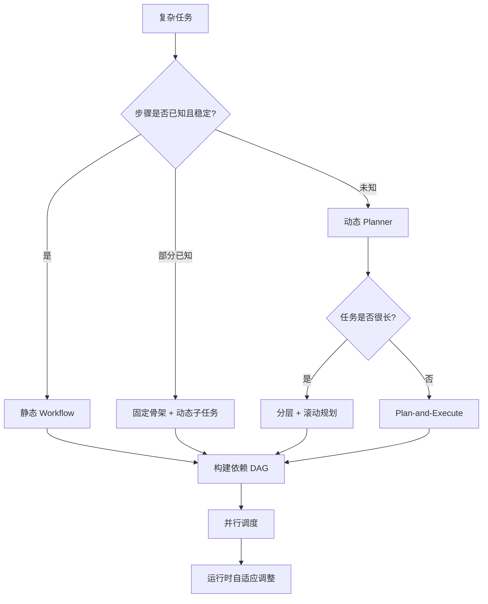

落地时通常按这个顺序收敛：

1. 优先确定性静态拆分；
2. 对未知部分使用动态 Planner；
3. 长任务采用分层和滚动规划；
4. 所有任务建立依赖 DAG；
5. 只并行真正独立的任务；
6. 用运行指标驱动自适应拆分。

## 6.22 评估任务拆分质量

| 指标 | 含义 |
|---|---|
| Completion Rate | 子任务和整体任务完成率 |
| Validation Pass Rate | 子任务首次通过验收的比例 |
| Retry Locality | 失败是否只重试受影响部分 |
| Parallel Efficiency | 并行资源是否真正降低关键路径 |
| Planning Overhead | 规划成本占总成本的比例 |
| Context Efficiency | 每个任务是否只获得必要上下文 |
| Artifact Reuse | 中间结果是否被有效复用 |
| Replan Rate | 计划失效和重规划频率 |
| Duplicate Work | 不同任务重复工作的比例 |
| Recovery Time | 失败后恢复所需时间 |

一个拆分方案不是任务数越多越好，而是：

> **以更低的总成本和风险，提高整体任务成功率与可恢复性。**

## 6.23 本章总结

复杂任务拆分可以分为三个层次：

### 为什么拆

- 降低上下文和推理压力；
- 支持独立验证；
- 支持局部重试；
- 支持并行和专业化。

### 怎么拆

- 静态拆分适合稳定流程；
- 动态拆分适合开放目标；
- 分层拆分避免一次展开过深；
- 滚动规划利用最新反馈；
- 自适应拆分根据运行指标调整粒度。

### 拆完之后

- 定义 Task Contract；
- 建立依赖 DAG；
- 分析关键路径；
- 调度可并行任务；
- 持久化 Artifact；
- 设置验证、重试、回退和人工介入。

归根结底，粒度要同时满足两个要求：

> **每个任务应当足够小，以便独立执行、验证和重试；同时足够大，能够产生有意义、可复用的业务结果。**

## 参考资料

- [Anthropic: Building Effective Agents](https://www.anthropic.com/engineering/building-effective-agents)
- [LangChain: Planning Agents](https://www.langchain.com/blog/planning-agents)
- [LLMCompiler: An LLM Compiler for Parallel Function Calling](https://arxiv.org/abs/2312.04511)
- [ReWOO: Decoupling Reasoning from Observations for Efficient Augmented Language Models](https://arxiv.org/abs/2305.18323)
