# Chapter 11: Giving LLMs and Agents the Ability to Plan

## 11.1 Planning Is Not the Same as CoT

Does asking a model to “think through the steps before executing” give it planning ability? Not by itself. Chain of thought (CoT) helps a model develop intermediate reasoning along one path. Planning also connects those steps to actions in an environment: what can be executed, what will happen afterward, and what to do if something fails.

Consider releasing a service. “Test, approve, deploy” is an initial plan. If the code changes after approval, the original approval cannot simply authorize deployment of the new code. A reliable planning system must detect the version change and rerun the affected tests and approval process, rather than continue down the old list.

Planning therefore needs to make the following explicit:

- The goal;
- The current state;
- Available actions;
- Dependencies;
- Resources and permissions;
- Possible action outcomes;
- Risks and fallback options;
- Completion conditions.

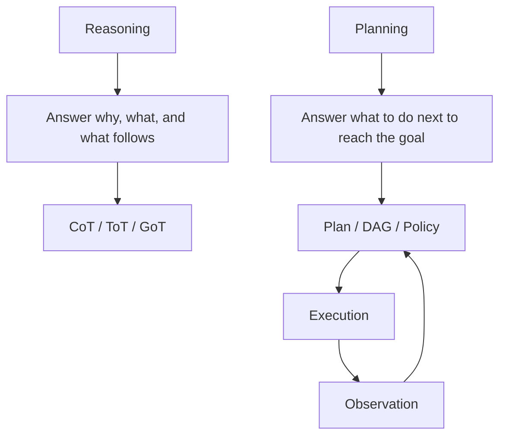

Reasoning methods can help generate plans, but do not constitute a reliable planning system on their own.

## 11.2 Reasoning versus Planning

| Dimension | Reasoning | Planning |
|---|---|---|
| Primary goal | Derive a conclusion | Select a sequence of actions |
| Inputs | Questions, facts, rules | Goals, state, actions, constraints |
| Outputs | Answers or judgments | Executable plans or policies |
| Does it change the environment? | Usually not directly | An executor applies the plan to the environment |
| Does it need feedback? | Not necessarily | Usually |
| Does it need replanning? | Less often | When the environment changes |
| Success criterion | Correct reasoning | Achieving the goal within the constraints |

For example:

- “Why did the API call fail?” is reasoning;
- “What steps should we take next to fix the API?” is planning;
- “Execute the fix and adjust based on test results” is an agent control loop.

## 11.3 Why Make Plans Explicit?

An LLM can generate answers or actions directly, but complex tasks are prone to:

- Skipping essential steps;
- Ignoring dependencies;
- Calling tools in the wrong order;
- Lacking success criteria;
- Stopping too early;
- Repeatedly circling around a local problem;
- Failing to estimate cost and risk.

Explicit planning can expose these problems before execution:

- Turn goals into executable steps;
- Reveal dependencies and opportunities for parallel work;
- Check permissions and risks before execution;
- Define acceptance criteria for each step;
- Support local retries and failure recovery;
- Adjust dynamically based on actual observations.

> **A planning mechanism should produce a control structure that can be executed, verified, and updated. Expanding the reasoning is only one way to support that structure.**

## 11.4 Planning Ability Comes from Two Levels

### 11.4.1 Model-level Planning

Model-level capabilities include:

- Understanding goals;
- Decomposing problems;
- Predicting action outcomes;
- Comparing candidate approaches;
- Generating steps;
- Identifying dependencies;
- Revising based on feedback.

Methods for strengthening these capabilities belong to either training or inference:

- Pretraining and post-training;
- High-quality planning examples, which do not update parameters when placed in context but do when used for training;
- Instruction tuning;
- Tool-use training;
- Reinforcement learning;
- RL with rewards based on verifiable outcomes, which updates parameters during training;
- Inference-time search and verification, which usually leave parameters unchanged while changing candidates, state, and selection.

Improvements on math or code rewards do not automatically transfer to long-horizon tool planning. Action preconditions, permissions, environmental changes, and failure recovery need separate evaluation; a single reasoning benchmark score cannot stand in for them.

### 11.4.2 System-level Planning

The system layer turns model outputs into reliable plans through:

- A plan schema;
- A planner;
- A plan validator;
- A scheduler;
- An executor;
- A state store;
- A verifier;
- A replanner;
- Budgets and guardrails.

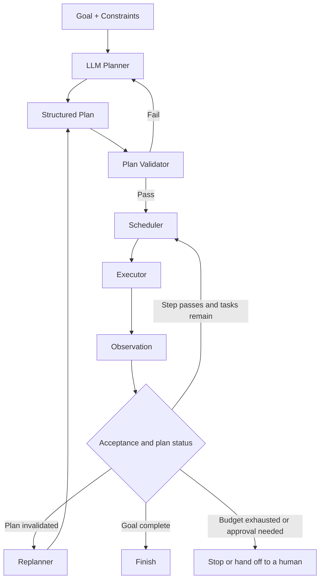

A strong model can still produce an unexecutable plan without a runtime and verification. A less capable model paired with a well-designed schema, tools, and verifier may be more reliable.

## 11.5 The Basic Elements of a Planning Problem

A planning problem can be represented by:

- `G`: the goal;
- `S₀`: the initial state;
- `A`: the set of available actions;
- `F`: a state-transition model describing the conditions under which actions produce particular outcomes;
- `C`: constraints;
- `B`: the budget;
- `T`: termination conditions.

An action should declare:

- Preconditions;
- Inputs;
- Expected effects;
- Side effects;
- Cost and duration;
- Risk level;
- Failure modes.

```json
{
  "action": "deploy_service",
  "preconditions": [
    "tests_passed",
    "human_approval_received"
  ],
  "inputs": {
    "service": "payment",
    "version": "v2.4.1"
  },
  "effects": [
    "production_version_updated"
  ],
  "risk_level": "high",
  "timeout_seconds": 600
}
```

An agent that does not know an action's preconditions and effects will struggle to plan reliably.

Classical deterministic planning typically assumes observable state and known action effects. Web pages, robots, and business APIs often do not satisfy those assumptions. In such cases, maintain known facts separately from uncertain assumptions. When necessary, first gather information or generate a policy that branches on observations, rather than treating a fixed action list as a guaranteed path to the goal. The JSON field `human_approval_received` is only a field: the runtime must verify the actual approval, including the object and version it covers and its expiration.

## 11.6 CoT: Single-path Reasoning, Not a Complete Planner

> [Chapter 5](05-agent-reasoning-methods.md) explains CoT's mechanism, suitable tasks, and interpretability limitations in detail. Here, the focus is why it cannot replace a stateful, verifiable planner.

CoT (chain of thought) leads a model toward a conclusion through a chain of intermediate reasoning:


It can help the model:

- Extract constraints;
- Decompose simple steps;
- Avoid jumping straight to an answer;
- Generate an initial list of actions.

CoT prompting alone does not provide the following system mechanisms:

- Exploration of multiple paths;
- Backtracking;
- Feedback from the real environment;
- Persistent state;
- Plan validation;
- Dynamic replanning;
- Permission management and resource scheduling.

### 11.6.1 Engineering Boundaries

CoT text may include “reconsidering” or preliminary checks, but that does not mean a controller has actually saved branches, rolled back the environment, or run a verifier. A planning system should output verifiable steps, dependencies, success criteria, tools, and risks without requiring disclosure of hidden reasoning. See [Chapter 5](05-agent-reasoning-methods.md) for costs and [Chapter 14](../05-production/14-agent-evaluation.md) for principles of recording auditable traces.

## 11.7 Task Decomposition: From a Goal to Subtasks

The first step in planning is usually to break a goal into executable tasks.

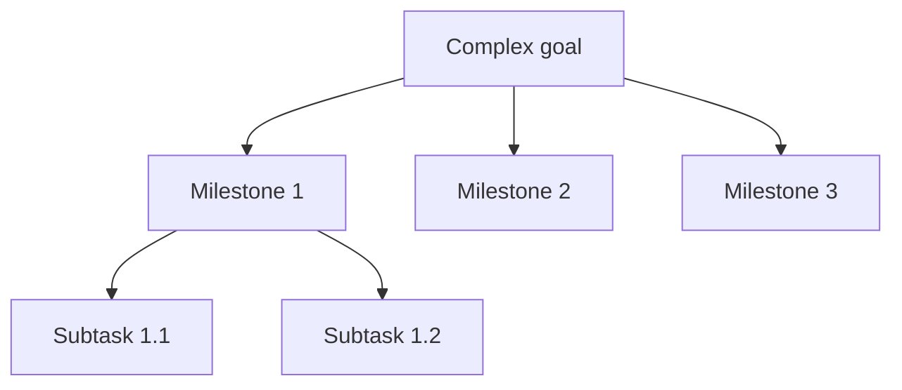

A well-defined subtask should have:

- A clear goal;
- Its own inputs and outputs;
- Dependencies;
- An executor;
- Acceptance criteria;
- Risks and a budget;
- A defined ability to retry.

Decomposition only produces the structure of a plan; it does not make the plan correct. Dependencies, executability, and completeness still need validation.

## 11.8 Plan-and-Solve: Form a Problem-solving Plan First

Plan-and-Solve first generates a plan for solving a problem, then reasons through that plan.

```text
Plan:
1. Extract the goal and constraints
2. Identify the facts needed
3. Calculate intermediate results
4. Check whether the answer satisfies the constraints
```

Compared with basic CoT, it distinguishes more explicitly between:

- Planning;
- Solving.

However, it still operates mainly at the model reasoning level and does not necessarily include external tools, state, or replanning.

## 11.9 ToT: Search Multiple Candidate Directions

ToT (Tree of Thoughts) organizes intermediate reasoning states into a tree. At each node, it:

1. Generates multiple candidates;
2. Evaluates them;
3. Selects a subset to continue;
4. Backtracks when necessary.

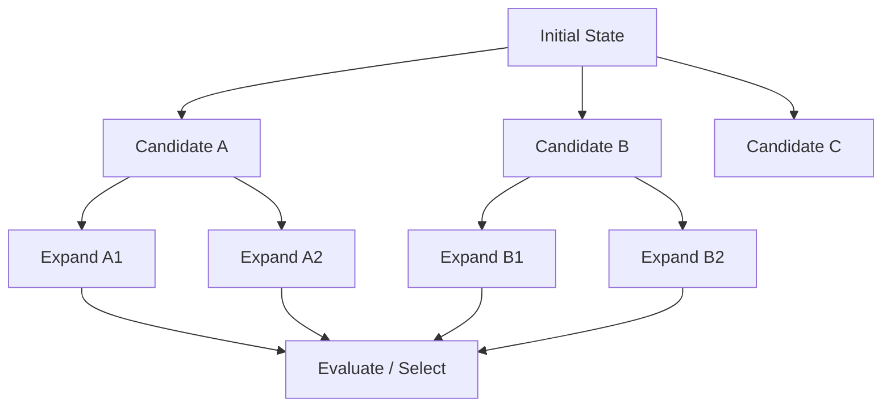

ToT provides a framework for exploring, selecting, and backtracking through candidate paths:

> **The system can explore multiple directions, then select and backtrack when its evaluation function is effective.**

If candidates are poor or the evaluator judges them incorrectly, ToT can still select the wrong path.

In the original paper, nodes are task-specific partial solutions, and a search program organizes evaluation and BFS or DFS. A model has not performed search merely by producing a “tree of ideas.” The paper reports results on tasks such as Game of 24, creative writing, and crosswords; it does not guarantee correct plans for arbitrary business tasks. When branches involve real actions, the environment must also be clonable or resettable. Irreversible actions such as payments cannot be tried speculatively and then backtracked.

## 11.10 The Cost of ToT Search

ToT's cost depends on:

- The branching factor `b` at each node;
- Search depth `d`;
- The retained beam width `k`;
- The number of model calls used to generate candidates at each node;
- The number of evaluator calls;
- Whether calls are batched;
- Pruning and early termination.

The number of nodes in a complete tree is:

$$
N=\sum_{i=0}^{d}b^i
$$

When the branching factor exceeds 1, the number of nodes can grow rapidly with depth.

With beam search, at most `k` states are retained at each level, each state expands into `b` candidates, and the depth is `d`. The order of the number of candidate expansions is:

$$
N_{expand}=O(kbd)
$$

This is not a formula for model-call count or token cost. One call may generate several candidates in a batch, while each candidate may trigger additional evaluations. Longer paths also increase input length. A cost comparison with CoT requires fixing the branching factor, depth, pruning, context reuse, and model-call strategy first.

### 11.10.1 Controlling ToT Costs

- Limit search depth;
- Limit beam width;
- Generate candidates in batches;
- Use a smaller model for initial screening;
- Verify with rules or programs;
- Prune low-scoring nodes early;
- Stop when the task passes acceptance checks or reaches its budget limit;
- Enable search only where useful evaluation signals exist and benefits can be measured; high-risk tasks need approval and hard constraints first.

## 11.11 GoT: Merge and Reuse Intermediate Results

GoT (Graph of Thoughts) allows multiple reasoning paths to:

- Branch;
- Merge;
- Reuse results;
- Undergo iterative revision;
- Establish dependencies.

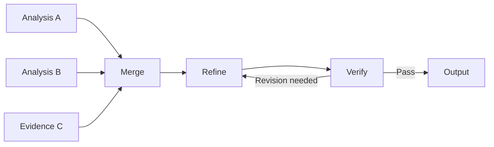

It addresses limitations of tree structures:

- Different branches have difficulty sharing intermediate results;
- The same subproblem may be computed repeatedly;
- Multiple candidate conclusions cannot be merged naturally.

### 11.11.1 GoT's Production Maturity

Two concepts need to be distinguished:

#### The Graph of Thoughts Research Paradigm

“Thoughts” are graph nodes generated, aggregated, and transformed by a model. The original paper has a code implementation, but graph-shaped orchestration alone does not make a system an implementation of that paper's GoT.

#### Graph-based Agent Orchestration

DAGs, state graphs, task graphs, and workflows are already widely used to represent plans in production systems.

The ideas are similar, but engineering systems typically operate on:

- Tasks;
- State;
- Artifacts;
- Dependencies;
- Transitions.

They do not rely solely on free-form thought text. A textual partial solution can also be checked by a program, and a structured task can still be semantically wrong. The distinction lies in what the nodes mean and how they are verified—not in a claim that “text is unreliable, whereas graphs are inherently reliable.”

## 11.12 Representing Execution Plans with Task Graphs

For production systems, it is more useful to define graph nodes as executable tasks:

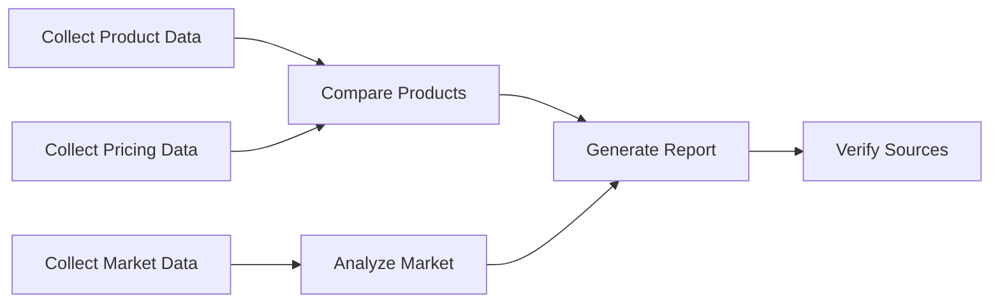

Each node should include:

- Inputs;
- Outputs;
- Dependencies;
- An executor;
- Success criteria;
- A retry policy;
- An artifact.

A scheduler, verifier, and runtime can use this graph directly.

## 11.13 Planner-Executor-Replanner

One possible system architecture is:

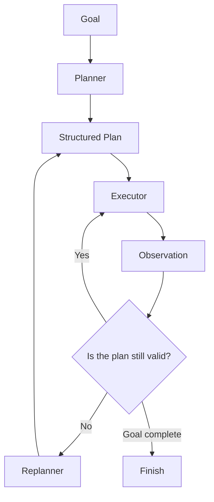

### 11.13.1 Planner

Its responsibilities are to:

- Understand the goal;
- Generate milestones;
- Break work into tasks;
- Establish dependencies;
- Specify acceptance criteria;
- Estimate risks and resources.

### 11.13.2 Executor

Its responsibilities are to:

- Execute the current step;
- Invoke tools;
- Return actual observations;
- Save artifacts;
- Report structured errors.

### 11.13.3 Replanner

It determines:

- Whether results match expectations;
- Which assumptions no longer hold;
- Whether steps need to be added, removed, or reordered;
- Whether the task can finish early;
- Whether human intervention is needed.

## 11.14 Dynamic Replanning

Given an original plan `Pₜ` and a new observation `oₜ₊₁` obtained through execution, the replanner updates the plan:

$$
P_{t+1}=R(P_t,o_{t+1},s_t,g)
$$

Here, `sₜ` is the state saved before execution, `g` is the goal, and `R` is the process that incorporates the new observation into the plan. The runtime must also update its state record to reflect what actually happened, rather than merely changing the plan text.

Common events that should trigger replanning include:

- A tool returning an unexpected result;
- A prerequisite assumption proving false;
- A new constraint appearing;
- A task failing;
- A budget change;
- The user changing the goal;
- The external environment changing;
- A verifier determining that the plan cannot achieve the goal.

### 11.14.1 Do Not Replan Everything after Every Step

Rewriting the entire plan after every step can:

- Increase cost;
- Cause plan drift;
- Discard validated structure;
- Lose the global structure, leaving only more expensive step-by-step decisions.

A better approach is to:

- Update only the affected subgraph;
- Retain completed nodes;
- Lock stable milestones;
- Record the plan diff;
- Replan globally only when major assumptions change.

“Retain” means preserving the historical record, not reusing old results forever. When inputs, authorization, or goals change, mark affected artifacts as invalid. Old and new plans need version identifiers, and the system must handle cancellation of running tasks and late results so that old execution results cannot overwrite the new plan's state.

## 11.15 Hierarchical Planning

Hierarchical planning establishes high-level milestones first, then expands the current phase as needed:

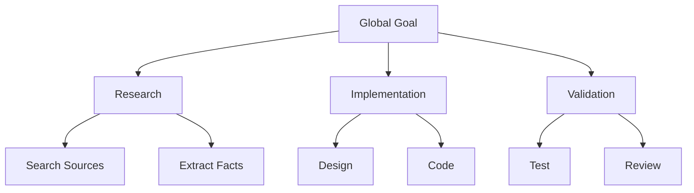

Advantages:

- Preserves the overall direction;
- Avoids generating an excessively long plan at once;
- Reduces the risk of distant plans becoming obsolete;
- Supports phase-specific budgets;
- Suits long-running tasks.

## 11.16 Rolling Horizon Planning

Rolling horizon planning plans only the near-term steps in detail:


It is suitable when:

- The environment changes quickly;
- Information about the distant future is unreliable;
- Tool results determine the subsequent path;
- The user may adjust the task at any time.

It can be combined with hierarchical planning: retain the global milestones and expand only near-term actions. Its distinction from ReAct is not whether the agent “thinks about the future,” but whether the controller explicitly maintains a multistep planning horizon and updates it after execution.

Rolling planning can also be shortsighted. A focus on deploying as quickly as possible might omit compatibility checks that fall outside the current horizon. Even when distant steps have not yet been expanded, global constraints such as “old clients must remain usable” and final acceptance criteria must remain in force.

## 11.17 ReAct's Role in Planning

ReAct can formulate and update plans within its reasoning, but does not inherently require a global DAG, scheduler, or formal verification. It can also execute local, open-ended tasks within an explicit plan:

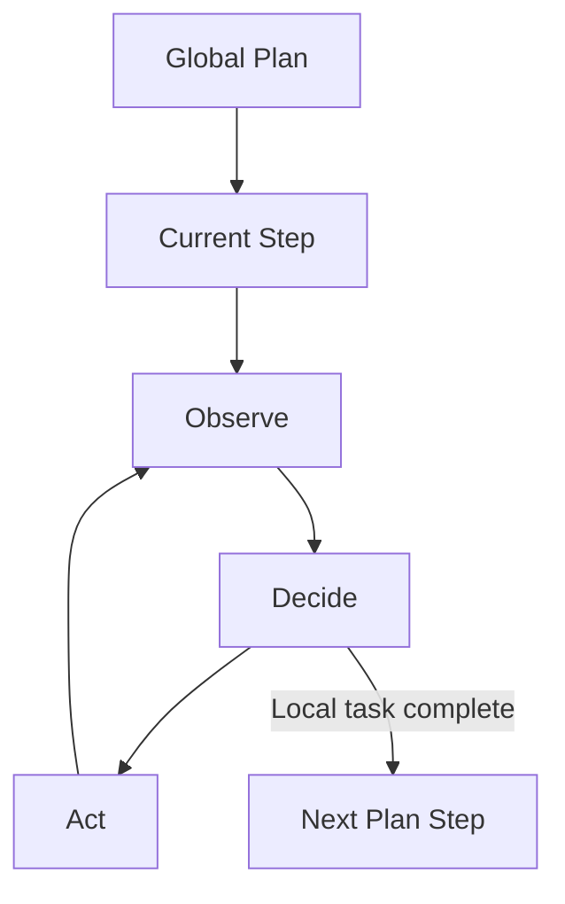

A recommended combination is:

- The planner manages the global structure;
- ReAct selects tools locally;
- The replanner handles invalidated plans;
- The verifier checks step results.

## 11.18 Reflection and Plan Quality

Reflection can add quality checks before and after planning.

### 11.18.1 Plan Critique

Check:

- Whether any steps are missing;
- Whether dependencies are correct;
- Whether the plan can be executed;
- Whether there are permission issues;
- Whether success conditions are defined;
- Whether a lower-cost path exists.

### 11.18.2 Execution Reflection

Use execution results to check:

- Which step failed;
- Whether the cause was a planning error or an execution error;
- Whether the strategy needs to change;
- Which lessons can inform later planning.

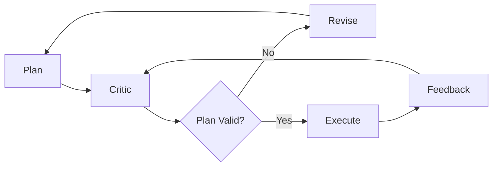

Reflection should prioritize actual tool feedback, rules, tests, and human review, rather than relying only on the same model to evaluate itself.

## 11.19 Verifier-guided Planning

Before execution, check a plan along the following five dimensions. “Pass” means an execution attempt is permitted, not that reaching the goal is guaranteed. Static validation covers conditions that can be checked in advance. Current permissions, resource versions, and action preconditions must be checked again immediately before execution; permission granted when the plan was generated cannot be reused indefinitely.

### 11.19.1 Schema Validation

- All required fields are present;
- Types are correct;
- Referenced tasks exist;
- The output format is valid.

### 11.19.2 Dependency Validation

- Check that a task-dependency DAG is acyclic; for a state machine that allows cycles, check the cycle budgets and exit conditions;
- Required inputs have sources;
- Preconditions can be satisfied;
- Parallel tasks have no write conflicts.

### 11.19.3 Capability Validation

- The specified tools exist;
- The agent has the required skills;
- Permissions are sufficient;
- Parameters can be produced.

### 11.19.4 Risk Validation

- Do high-risk operations have approval?
- Is least privilege being used?
- Is rollback or compensation defined?
- Does the plan involve sensitive data?

### 11.19.5 Budget Validation

- Tokens;
- Time;
- Cost;
- Maximum steps;
- Concurrency limits.


## 11.20 Using External Planners

Not all planning should be delegated to an LLM.

### 11.20.1 Deterministic Workflow

When the process is known, implement it directly in code, a DAG, or a state machine.

### 11.20.2 Constraint Solver

Suitable for:

- Shift scheduling;
- Resource allocation;
- Path constraints;
- Combinatorial optimization;
- Problems governed by strict rules.

### 11.20.3 Classical Planner

Classical planning algorithms can be used when actions have clearly defined preconditions and effects.

### 11.20.4 LLM + Solver

The LLM is responsible for:

- Understanding the natural-language goal;
- Extracting constraints;
- Generating solver input;
- Explaining the results.

Within the given formal model, the solver is responsible for:

- Exact search;
- Constraint satisfaction;
- Providing a proof of optimality or infeasibility when the algorithm, objective function, and budget support it.

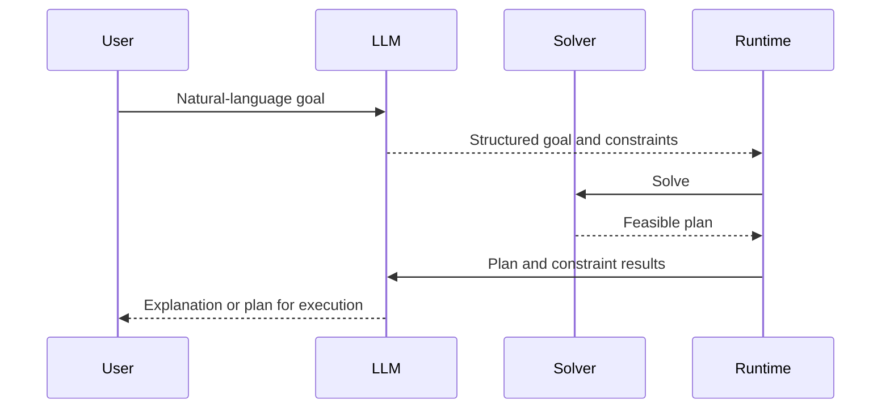

> **For these problems, language models are better used for modeling and explanation, while deterministic algorithms handle search or solving.**

Check separately whether “the solver solved the model correctly” and whether “the model correctly represents the user's requirements.” If a budget is omitted, units are mistranslated, or action effects are wrong, a solver may still return a formally valid plan that is unusable in practice. For example, in [OR-Tools CP-SAT](https://developers.google.com/optimization/cp/cp_solver), `FEASIBLE` is not the same as `OPTIMAL`, and `UNKNOWN` after a timeout does not mean infeasibility has been proved.

[LLM-Modulo](https://arxiv.org/abs/2402.01817) proposes a more tightly coupled loop of candidate generation and external verification. The LLM does more than convert formats: it can also propose plans or augment the model, while verifiers return specific constraint violations to guide revision. The paper's strong claims about LLM planning abilities reflect its research position, not a permanent conclusion about every subsequent model. The transferable mechanism is the feedback between generation and independent checking.

## 11.21 Ways to Represent a Plan

### 11.21.1 Natural Language List

Simple and intuitive, but difficult to validate and schedule.

### 11.21.2 Structured JSON

Suitable for task management and API integration. The example's `goal` means “release a new version”:

```json
{
  "plan_id": "plan-42",
  "goal": "发布新版本",
  "tasks": [
    {
      "id": "test",
      "depends_on": [],
      "executor": "test-tool",
      "success_criteria": ["all tests pass"]
    },
    {
      "id": "approval",
      "depends_on": ["test"],
      "executor": "human-approval-gate",
      "success_criteria": ["approval bound to the tested release artifact"]
    },
    {
      "id": "deploy",
      "depends_on": ["test", "approval"],
      "executor": "deployment-agent",
      "success_criteria": ["health checks pass"]
    }
  ]
}
```

This example illustrates dependency structure only; it is not a deployment configuration ready for execution. Testing, approval, and deployment must bind to the same immutable release artifact. Authorization, idempotency keys, and rollback strategy must be checked again before deployment. A model-generated approval string cannot replace an approval record.

### 11.21.3 DAG

Suitable for dependencies and parallel scheduling.

### 11.21.4 State Machine

Suitable for business processes with a finite set of states and explicit transition rules.

### 11.21.5 Policy

Rather than generating fixed steps, a policy chooses the next action based on state, making it suitable for dynamic environments.

## 11.22 Plan Granularity

If a plan is too coarse:

- It cannot be executed;
- It cannot be verified;
- Failures affect too much of the task.

If a plan is too fine-grained:

- Scheduling overhead is high;
- There are too many model calls;
- State becomes fragmented;
- The global goal is easily lost.

A useful task unit should:

- Be independently executable;
- Be independently verifiable;
- Be independently retryable;
- Have explicit inputs and outputs;
- Have bounded side effects;
- Produce a meaningful artifact.

## 11.23 Planning Memory

Planning needs to retain:

- The current goal;
- Completed steps;
- The plan version;
- Key assumptions;
- Observations;
- Failures and retries;
- Unresolved issues;
- The budget.

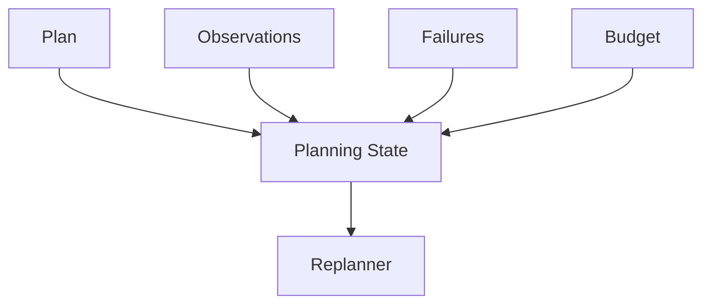

If a plan lives only in a single prompt, it is difficult to track versions, restore runtime state, or restart safely during execution. A more robust approach is to store it in a structured state store with checkpoint support.

## 11.24 World Model

Planning requires estimating how actions will change the environment. This predictive model is called a world model.

An LLM can implicitly predict:

- What a tool call might return;
- Whether an action's preconditions are satisfied;
- What side effects the next step might produce.

In high-risk settings, however, language-model predictions alone are insufficient. They usually need to be combined with:

- API schemas;
- Simulators;
- Test environments;
- Digital twins;
- Rule engines;
- Actual read-only queries.

World-model errors accumulate with prediction depth, especially in unfamiliar states or after shifts in the distribution of tools encountered. An API schema describes parameter structure, not a complete environment-transition model. Simulators, read-only queries, and feedback from real execution also have different coverage limits.

[SayCan](https://arxiv.org/abs/2204.01691) provides a concrete example. A language model estimates how well a skill fits the goal, while a skill value function estimates whether it can succeed in the current environment; these estimates are combined to select a skill. This depends on an existing skill library and corresponding feasibility estimates. A language model's ability to describe an action does not imply that a robot can perform it.

## 11.25 Uncertainty in Planning

A plan should distinguish:

- Known facts;
- Assumptions;
- Uncertain information;
- Conditions that must be verified through tools.

In this example, the assumption is “Competitor A still offers a free version”:

```json
{
  "assumption": "竞品 A 仍提供免费版本",
  "confidence_label": "unverified",
  "verification_task": "check-current-pricing",
  "on_failure": "revise-comparison-plan"
}
```

Prioritize assumptions that affect many later steps and are reasonably affordable to verify. An uncalibrated, model-reported number such as `0.6` should not be interpreted as an actual probability of success. Record the source, timestamp, and reason for uncertainty instead.

## 11.26 Risk-aware Planning

Different actions need different controls:

| Risk | Example | Planning strategy |
|---|---|---|
| Low | Searching public web pages | May execute automatically |
| Medium | Editing local code | Retain a diff and rollback path |
| High | Sending email or publishing content | Confirm before execution |
| Very high | Transferring money, deleting databases, changing permissions | Strong authentication, approval, and least privilege |

The planner should favor:

- Reversible actions;
- Read-only probes;
- Minimal side effects;
- Verifiable intermediate steps;
- Explicit rollback paths.

## 11.27 Planning Budgets

Represent this section's budget as five upper bounds:

$$
B=(N,D,K,T_{max},C_{max})
$$

Where:

- `N`: the number of candidate plans;
- `D`: search depth;
- `K`: the number of replanning attempts;
- `T_max`: maximum time;
- `C_max`: maximum cost.

Possible budget policies include:

- Generate only one plan for simple tasks;
- Generate a plan and run one critique for moderately complex tasks;
- For high-risk tasks, establish permissions, approval, and verification first. Multiple candidates may be compared, but more search cannot replace authorization gates;
- When the budget is exhausted, return the partial plan and unresolved risks.

## 11.28 Adaptive Planning

An adaptive planner chooses planning effort based on task difficulty and risk:

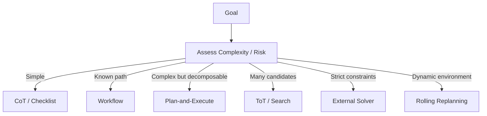

Applying expensive search indiscriminately to every task is usually not worthwhile.

## 11.29 Adapting and Training Planning Capabilities

### 11.29.1 In-context Examples

Provide high-quality example plans, including dependencies, success criteria, and failure handling. This is conditioning at inference time, not training; it does not change model parameters.

### 11.29.2 Supervised Fine-tuning

Train the model on goal-to-plan and state-to-next-action trajectories.

### 11.29.3 Tool-use Training

Train the model to understand tool schemas, parameters, and observations.

### 11.29.4 Reinforcement Learning

Optimize the policy for task success, cost, risk, and step efficiency.

### 11.29.5 Verifiable Rewards

Use tests, simulators, rules, and environmental outcomes to provide verifiable feedback. This is a source of rewards, not a separate training algorithm. It becomes parameter learning only when an optimizer updates the parameters. Using that feedback only to retry or select plans is inference-time control.

### 11.29.6 Curriculum

Progressively train from short plans to long tasks and dynamic environments.

Training can strengthen model capabilities, but the system still needs a runtime, state, a verifier, and guardrails.

Distinguish offline trajectory training, online RL, and in-context adaptation within the current task. Training and evaluation must also guard against reward leakage, invalid tests, and reward hacking that “achieves the goal while violating constraints.” Improvements from verifiable math rewards do not imply improvements on long trajectories involving business tools.

## 11.30 How to Evaluate Planning Quality

| Metric | Meaning |
|---|---|
| Goal Completion | Whether the goal is ultimately achieved |
| Plan Validity | Whether the plan's structure is valid |
| Executability | Whether the steps can actually be executed |
| Completeness | Whether all necessary steps are covered |
| Dependency Accuracy | Whether dependencies are correct |
| Replan Rate | How often plans become invalid |
| Step Efficiency | Whether redundant steps exist |
| Recovery | Whether local recovery is possible after failure |
| Cost | Planning and execution costs |
| Safety | Whether permission and risk constraints are respected |

Compare against baselines as well:

- A single LLM call;
- ReAct;
- A fixed workflow;
- Plan-and-Execute;
- A search-based planner.

Controlled comparisons should hold the model version, tool permissions, task inputs, and success criteria constant, while reporting budgets, latency, sample size, and uncertainty. Gains after adding search may come from more attempts rather than the plan structure itself. An additional comparison can use ReAct retries or a multiple-candidate baseline under the same budget.

Greater planning complexity should deliver measurable benefits: higher success rates, lower total costs, or safety and auditability requirements that the original approach could not satisfy. More nodes and more search are not benefits by themselves.

## 11.31 Common Failure Modes

### 11.31.1 The Plan Looks Complete but Cannot Be Executed

Causes include:

- A tool does not exist;
- Parameters cannot be obtained;
- Permissions are insufficient;
- A step's output is not consumed downstream.

### 11.31.2 The Plan Omits Implicit Dependencies

For example, forgetting tests or approval before deployment.

### 11.31.3 The Planner Produces Too Many Microtasks

Scheduling and communication costs exceed the benefits.

### 11.31.4 Initial Assumptions Are Wrong

Every subsequent step proceeds in the wrong direction.

### 11.31.5 Frequent Full Replanning

This causes plan drift and escalating costs.

### 11.31.6 The Planner and Executor Interpret the Plan Differently

The executor does not understand a step's goal or output format.

### 11.31.7 Self-evaluation Replaces Actual Verification

The plan appears logically plausible but fails environmental tests.

### 11.31.8 There Are No Stopping Conditions

Decomposition, search, and replanning continue indefinitely.

## 11.32 A Recommended Production Architecture

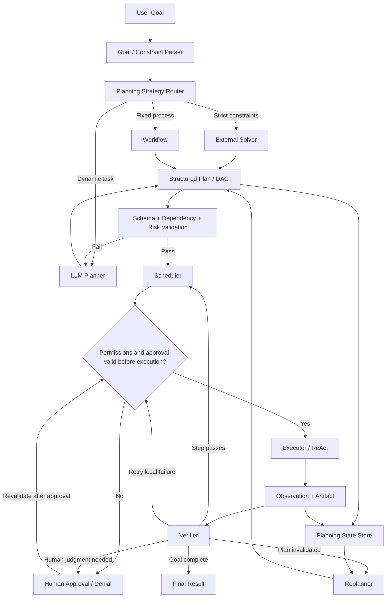

The scheduler dispatches only tasks whose dependencies have passed acceptance checks. The verifier distinguishes a passing step from a completed goal. Validation failures, retries, and replanning share a hard budget. Unrecoverable failures, denied approval, and exhausted budgets must all have stopping paths; the system must not follow the diagram's cycles indefinitely.

## 11.33 Implementation Steps

### 11.33.1 Define the Goal and Success Criteria

Do not provide only a vague goal.

### 11.33.2 Build an Action Catalog

Define preconditions, effects, risks, and costs for every action.

### 11.33.3 Define a Plan Schema

Make plans programmatically validatable and schedulable.

### 11.33.4 Add a Plan Validator

Check dependencies, capabilities, permissions, and budgets.

### 11.33.5 Execute and Save Observations

Update recorded state using actual tool results, user confirmations, or other traceable events. Mark model predictions separately as assumptions; do not record “expected to have deployed” as “deployed.”

### 11.33.6 Add a Replanner

Define explicit triggers and a maximum number of replanning attempts.

### 11.33.7 Add a Verifier

Prioritize tests, rules, simulators, and the real environment.

### 11.33.8 Add Guardrails

Limit steps, time, cost, permissions, and side effects.

### 11.33.9 Build an Evaluation Set

Measure success rate, cost, latency, and recovery capability.

## 11.34 Choosing an Approach

| Scenario | Recommended approach |
|---|---|
| Simple linear problem | Direct / CoT |
| Decomposition needed before solving | Plan-and-Solve |
| Many candidate directions that can be evaluated | ToT |
| Intermediate results need merging and reuse | Task Graph / DAG |
| Long task in a changing environment | Rolling Replanning |
| Fixed path | Workflow |
| Optimization under strict constraints | External Solver |
| Global plan with local exploration | Planner + ReAct |
| Demanding quality requirements | Planner + Verifier + Reflection |

## 11.35 Chapter Summary

To judge whether an LLM can plan, do not look only at whether it can “think step by step.” Ask whether its plans can be executed, verified, and updated.

### 11.35.1 Model Level

- CoT provides single-path intermediate reasoning;
- Task decomposition generates subproblems;
- ToT searches multiple candidate directions;
- GoT allows intermediate results to be merged and reused;
- Training and verifiable rewards can strengthen planning capabilities.

### 11.35.2 System Level

- Express executable tasks with a plan schema;
- Use a validator to check dependencies, capabilities, and risks;
- Execute through a scheduler and executor;
- Update the state record from actual observations;
- Modify plans dynamically through a replanner;
- Use verifiers and guardrails to check quality and safety conditions, while retaining explicit records of uncovered risks and paths for human handling.

> **In an engineering implementation, planning should take the form of a budget-constrained action structure that can be executed, verified, and updated.**

## References

- [Chain-of-Thought Prompting Elicits Reasoning in Large Language Models](https://arxiv.org/abs/2201.11903)
- [Tree of Thoughts: Deliberate Problem Solving with Large Language Models](https://arxiv.org/abs/2305.10601)
- [Graph of Thoughts: Solving Elaborate Problems with Large Language Models](https://arxiv.org/abs/2308.09687)
- [Plan-and-Solve Prompting](https://arxiv.org/abs/2305.04091)
- [LLMCompiler: An LLM Compiler for Parallel Function Calling](https://arxiv.org/abs/2312.04511)
- [Anthropic: Building Effective Agents](https://www.anthropic.com/engineering/building-effective-agents)
- [LLMs Can't Plan, But Can Help Planning in LLM-Modulo Frameworks](https://arxiv.org/abs/2402.01817)
- [Do As I Can, Not As I Say: Grounding Language in Robotic Affordances](https://arxiv.org/abs/2204.01691)
- [OR-Tools: CP-SAT Solver](https://developers.google.com/optimization/cp/cp_solver)
- [DeepSeek-R1](https://arxiv.org/abs/2501.12948)
