# 第十一章：如何赋予 LLM 与 Agent 规划能力

## 11.1 规划不等于 CoT

让模型“先想好步骤再执行”，就有规划能力了吗？还不够。CoT 帮助模型沿一条路径展开中间推理；规划还要把步骤与环境中的动作连接起来，判断什么可以执行、执行后会怎样，以及失败后怎么办。

例如发布服务，“测试、审批、部署”是一个初步计划。如果审批通过后代码又被修改，原审批不能直接授权部署新代码。可靠的规划系统必须发现版本变化，让受影响的测试和审批重新执行，而不是照着旧列表继续。

因此，规划需要明确：

- 目标；
- 当前状态；
- 可用动作；
- 依赖关系；
- 资源和权限；
- 动作可能产生的结果；
- 风险和回退；
- 完成条件。

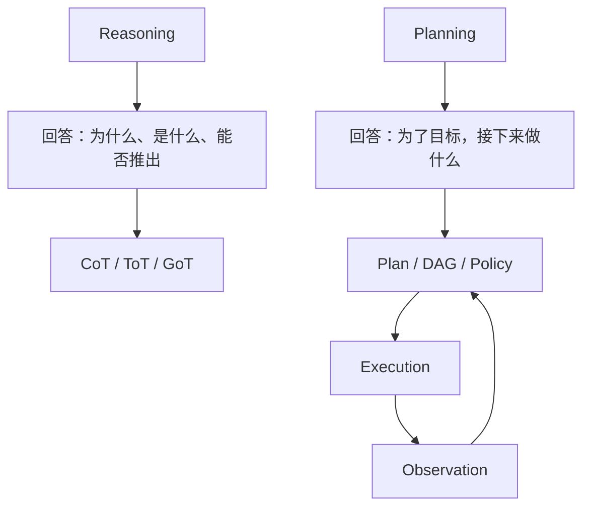

推理方法可以帮助生成计划，但不能单独构成可靠规划系统。

## 11.2 Reasoning 与 Planning 的区别

| 维度 | Reasoning | Planning |
|---|---|---|
| 核心目标 | 推导结论 | 选择行动序列 |
| 输入 | 问题、事实、规则 | 目标、状态、动作、约束 |
| 输出 | 答案或判断 | 可执行计划或策略 |
| 是否改变环境 | 通常不直接改变 | 计划由执行器作用于环境 |
| 是否需要反馈 | 不一定 | 通常需要 |
| 是否需要重规划 | 较少 | 环境变化时需要 |
| 成功标准 | 推理正确 | 目标在约束内完成 |

例如：

- “为什么 API 调用失败？”是 Reasoning；
- “接下来按什么步骤修复 API？”是 Planning；
- “执行修复并根据测试结果调整”是 Agent Control Loop。

## 11.3 为什么需要显式规划

LLM 可以直接生成答案或动作，但复杂任务容易出现：

- 跳过关键步骤；
- 忽略依赖；
- 工具调用顺序错误；
- 缺少成功标准；
- 过早结束；
- 在局部问题上反复循环；
- 无法估算成本和风险。

显式规划能把这些问题前置暴露出来：

- 将目标转化为可执行步骤；
- 暴露依赖和并行机会；
- 在执行前检查权限与风险；
- 为每一步定义验收条件；
- 支持局部重试和故障恢复；
- 根据真实 Observation 动态调整。

> **规划机制要产出可执行、可验证、可更新的控制结构；把思路展开只是其中一种手段。**

## 11.4 规划能力来自两个层次

### 11.4.1 Model-level Planning

模型层能力包括：

- 理解目标；
- 分解问题；
- 预测动作结果；
- 比较候选方案；
- 生成步骤；
- 识别依赖；
- 根据反馈修订。

增强这些能力的方法分属训练与推理两个阶段：

- 预训练和后训练；
- 高质量规划示例（放入上下文不更新参数，用于训练则更新参数）；
- Instruction Tuning；
- Tool-use Training；
- Reinforcement Learning；
- 以可验证结果作为奖励的 RL（训练时更新参数）；
- 推理时搜索和验证（通常保持参数不变，改变候选、状态和选择）。

数学或代码奖励上的进步不自动迁移为长程工具规划能力。动作前提、权限、环境变化和失败恢复需要单独评估，不能用一个推理基准分数替代。

### 11.4.2 System-level Planning

系统层负责将模型输出变成可靠计划：

- 计划 Schema；
- Planner；
- Plan Validator；
- Scheduler；
- Executor；
- State Store；
- Verifier；
- Replanner；
- Budget 与 Guardrails。

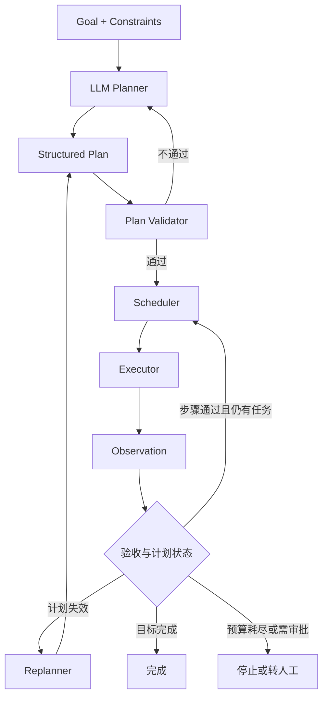

一个强模型如果缺少 Runtime 和验证，仍可能生成不可执行计划；一个中等模型配合良好 Schema、Tools 和 Verifier，反而可能更可靠。

## 11.5 规划问题的基本元素

可以将一个规划问题抽象为：

- `G`：目标；
- `S₀`：初始状态；
- `A`：可用动作集合；
- `F`：状态转移模型，描述动作在什么条件下产生哪些结果；
- `C`：约束；
- `B`：预算；
- `T`：终止条件。

一个动作应声明：

- 前置条件；
- 输入；
- 预期效果；
- 副作用；
- 费用和时间；
- 风险等级；
- 失败方式。

```json
{
  "action": "deploy_service",
  "preconditions": [
    "tests_passed",
    "human_approval_received"
  ],
  "inputs": {
    "service": "payment",
    "version": "v2.4.1"
  },
  "effects": [
    "production_version_updated"
  ],
  "risk_level": "high",
  "timeout_seconds": 600
}
```

如果 Agent 不知道动作前置条件和效果，就很难真正进行可靠规划。

经典确定性规划通常假设状态可观测、动作效果已知；网页、机器人或业务 API 往往不满足这些条件。此时应维护已知事实与不确定假设，必要时先执行信息收集动作，或生成依观察分支的策略，而不是把固定行动列表当作必然可达的路径。JSON 中的 `human_approval_received` 只是字段，Runtime 必须核验真实审批及其绑定的对象、版本和有效期。

## 11.6 CoT：单路径推理，不是完整规划器

> CoT 的机制、适用任务与解释性局限已在[第五章](05-agent-reasoning-methods.zh.md)详述；这里仅说明它为何不能替代有状态、可验证的规划器。

CoT（Chain of Thought）让模型沿一条中间推理链得到结论：


它可以帮助模型：

- 提取约束；
- 分解简单步骤；
- 减少直接跳到答案；
- 生成初步行动列表。

单独使用 CoT 提示不提供以下系统机制：

- 多路径探索；
- 回溯；
- 真实环境反馈；
- 状态持久化；
- 计划验证；
- 动态重规划；
- 权限和资源调度。

### 11.6.1 工程边界

CoT 文本可以出现“重新考虑”或初步验证，但这不等于控制器真的保存分支、回滚环境或执行了验证器。规划系统应输出可验证的步骤、依赖、成功标准、工具和风险，而不要求公开隐藏 Thought。其成本与可审计轨迹的记录原则分别见[第五章](05-agent-reasoning-methods.zh.md)和[第十四章](../05-production/14-agent-evaluation.zh.md)。

## 11.7 Task Decomposition：从目标生成子任务

规划的第一步通常是将目标分解为可执行任务。

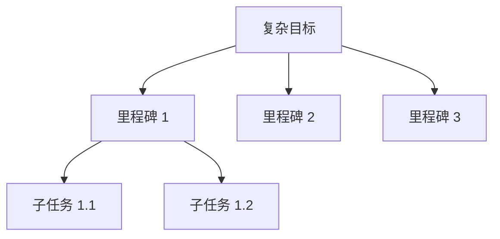

高质量子任务应具有：

- 明确目标；
- 独立输入输出；
- 依赖；
- 执行器；
- 验收条件；
- 风险和预算；
- 可重试性。

分解只是产生计划结构，不代表计划正确。还需要验证依赖、可执行性和完整性。

## 11.8 Plan-and-Solve：先形成解题计划

Plan-and-Solve 先生成问题求解计划，再沿计划完成推理。

```text
Plan:
1. 提取目标和约束
2. 识别所需事实
3. 计算中间结果
4. 检查答案是否满足约束
```

它比简单 CoT 更明确地区分：

- Planning；
- Solving。

但它主要仍工作在模型推理层，不一定包含外部 Tool、状态和重规划。

## 11.9 ToT：搜索多个候选方向

ToT（Tree of Thoughts）把中间推理状态组织成树，在每个节点：

1. 生成多个候选；
2. 评价候选；
3. 选择部分候选继续；
4. 必要时回溯。

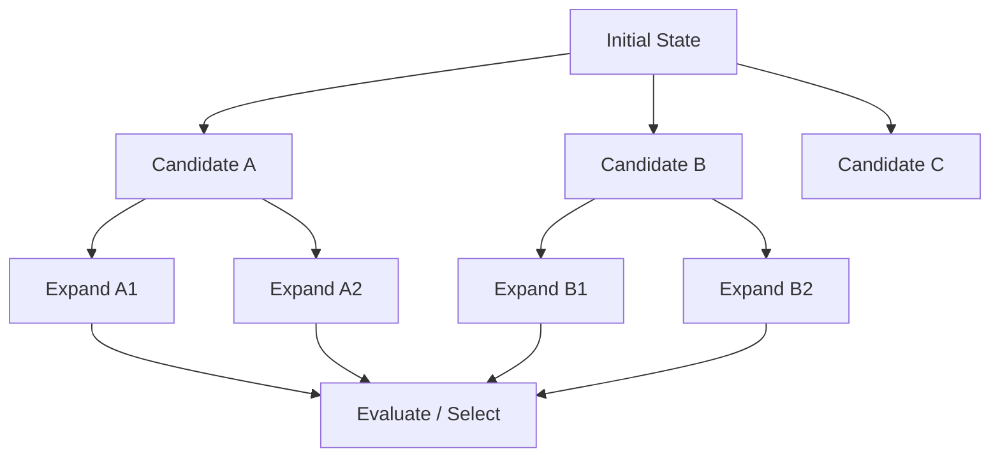

ToT 给系统提供的是一套探索、选择和回溯候选路径的框架：

> **允许系统探索多个方向，并在评价函数有效时进行选择和回溯。**

如果候选质量差或 Evaluator 判断错误，ToT 仍可能选择错误路径。

原论文的节点是任务相关的部分解，评价与 BFS／DFS 由搜索程序组织；不是模型输出一个“树状思路”就完成了搜索。它展示的是 24 点、创意写作和填字等任务上的结果，不保证任意业务计划正确。涉及真实行动时，分支还需要可复制或可重置的环境；不能对支付等不可逆动作做试探式回溯。

## 11.10 ToT 的搜索成本

ToT 成本取决于：

- 每个节点的分支数 `b`；
- 搜索深度 `d`；
- 保留的 Beam Width `k`；
- 每个节点生成候选的模型调用数；
- Evaluator 调用数；
- 是否批处理；
- 剪枝和提前终止。

完整树节点数为：

$$
N=\sum_{i=0}^{d}b^i
$$

当分支数大于 1 时，节点数可能随深度快速增长。

若使用 Beam Search，每层最多保留 `k` 个状态，每个状态扩展 `b` 个候选，深度为 `d`，候选扩展数的量级为：

$$
N_{expand}=O(kbd)
$$

这不是模型调用数或 Token 成本公式：一次调用可能批量生成多个候选，而每个候选可能触发额外评价；路径增长还会增加输入长度。只有固定分支数、深度、剪枝、上下文复用和模型调用策略后，才能与 CoT 比较成本。

### 11.10.1 控制 ToT 成本

- 限制搜索深度；
- 限制 Beam Width；
- 批量生成候选；
- 使用小模型初筛；
- 使用规则或程序验证；
- 低分节点提前剪枝；
- 通过任务验收或达到预算上限后停止；
- 只对有可用评价信号且收益可测的问题启用；高风险首先需要审批与硬约束。

## 11.11 GoT：合并和复用中间结果

GoT（Graph of Thoughts）允许多个推理路径：

- 分叉；
- 合并；
- 复用；
- 迭代修订；
- 建立依赖。

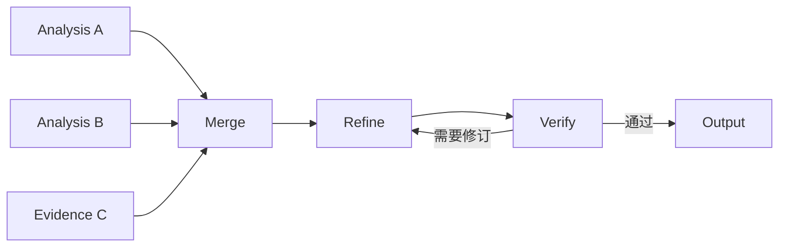

它针对树结构的局限：

- 树中不同分支难以共享中间结果；
- 相同子问题可能被重复计算；
- 多个候选结论无法自然合并。

### 11.11.1 GoT 的生产成熟度

需要区分两个概念：

#### Graph of Thoughts 研究范式

将“Thought”作为图节点，由模型生成、聚合和转换。原论文已有代码实现，但不能仅凭使用了图状编排就把系统归类为该论文的 GoT。

#### Graph-based Agent Orchestration

使用 DAG、状态图、任务图或 Workflow 表示计划，已经广泛用于生产系统。

两者思想相似，但工程系统通常操作的是：

- Task；
- State；
- Artifact；
- Dependency；
- Transition。

而不是仅靠自由文本 Thought。文本部分解也可以通过程序验证，结构化 Task 也可能语义错误；区别在节点含义和验证机制，不是“文本不可靠、图必然可靠”。

## 11.12 用 Task Graph 表示执行计划

生产系统更适合把图节点定义为可执行 Task：

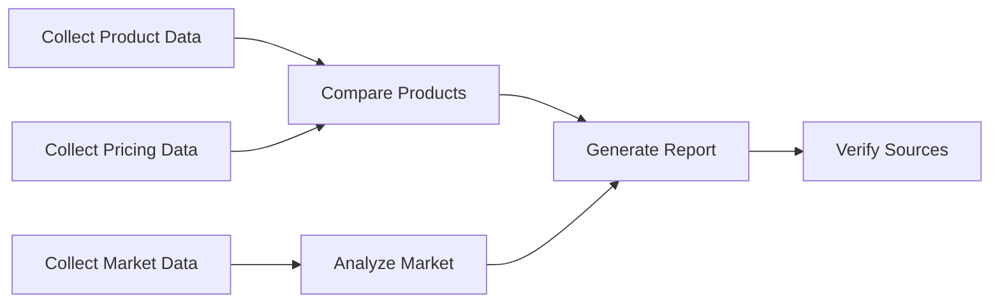

每个节点应包含：

- 输入；
- 输出；
- 依赖；
- Executor；
- Success Criteria；
- Retry Policy；
- Artifact。

这种图可以被 Scheduler、Verifier 和 Runtime 直接使用。

## 11.13 Planner-Executor-Replanner

一种可采用的系统架构是：

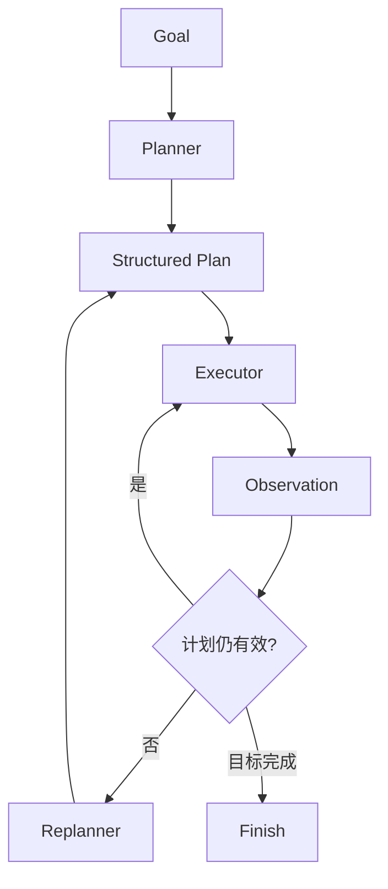

### 11.13.1 Planner

负责：

- 理解目标；
- 生成里程碑；
- 拆分任务；
- 建立依赖；
- 指定验收条件；
- 估算风险和资源。

### 11.13.2 Executor

负责：

- 执行当前步骤；
- 调用 Tool；
- 返回真实 Observation；
- 保存 Artifact；
- 报告结构化错误。

### 11.13.3 Replanner

负责判断：

- 结果是否符合预期；
- 哪个假设已经失效；
- 是否需要新增、删除或重排步骤；
- 是否可以提前结束；
- 是否需要人工介入。

## 11.14 动态重规划

原始计划为 `Pₜ`，执行获得新观察 `oₜ₊₁` 后，Replanner 更新计划：

$$
P_{t+1}=R(P_t,o_{t+1},s_t,g)
$$

这里 `sₜ` 是执行前保存的状态，`g` 是目标，`R` 是结合新观察更新计划的过程；Runtime 还应据实更新状态，不能只改计划文本。

需要触发重规划的常见事件：

- Tool 返回意外结果；
- 前置假设错误；
- 新约束出现；
- 某个任务失败；
- 预算变化；
- 用户修改目标；
- 外部环境变化；
- Verifier 判断计划无法达到目标。

### 11.14.1 不要每一步都完整重规划

每一步都重写全计划会：

- 增加成本；
- 造成计划漂移；
- 丢失已验证结构；
- 失去全局结构，只剩成本更高的逐步决策。

更好的方式是：

- 只更新受影响子图；
- 保留已完成节点；
- 对稳定里程碑加锁；
- 记录 Plan Diff；
- 重大假设变化才整体重规划。

“保留”指保留历史记录，不等于永远复用旧结果。输入、授权或目标变化时，应标记受影响 Artifact 失效；新旧计划要有版本号，并处理运行中任务取消及迟到返回，避免旧执行结果覆盖新计划状态。

## 11.15 Hierarchical Planning

分层规划先确定高层里程碑，再按需展开当前阶段：

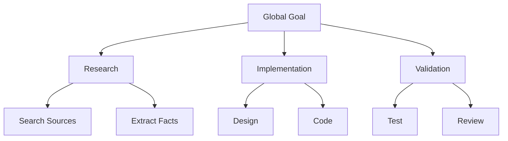

优势：

- 保留全局方向；
- 避免一次生成过长计划；
- 降低远期计划失效；
- 支持阶段预算；
- 适合长任务。

## 11.16 Rolling Horizon Planning

滚动规划只详细规划近期步骤：


适合：

- 环境变化快；
- 远期信息不可靠；
- 工具结果决定后续路径；
- 任务可能随时被用户调整。

它可以与分层规划组合：保留全局里程碑，只展开近期动作。与 ReAct 的区别不在于“有没有思考未来”，而在于控制器显式维护多步规划窗口，并在执行后更新它。

滚动规划也可能短视。例如只顾尽快部署，可能省掉当前窗口之外的兼容性检查。即使远期步骤暂不展开，也必须保留“旧客户端仍可用”这类全局约束和最终验收条件。

## 11.17 ReAct 在规划中的作用

ReAct 可以在推理中制定和更新计划，但本身不要求提供全局 DAG、调度器或形式化验证。它也可以用来执行显式计划中的局部开放任务：

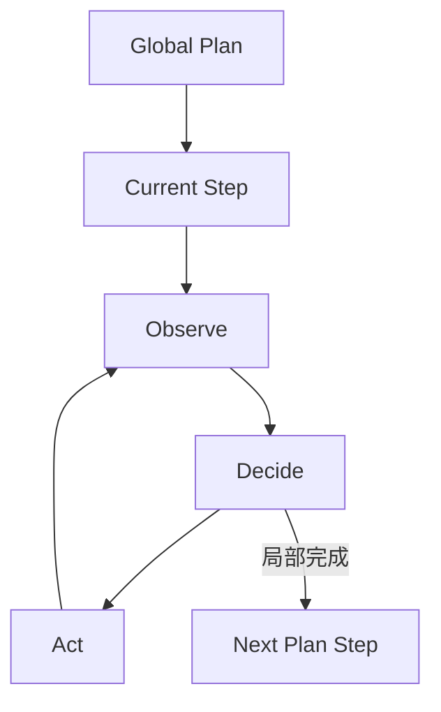

推荐组合：

- Planner 负责全局结构；
- ReAct 负责局部 Tool 选择；
- Replanner 处理计划失效；
- Verifier 检查步骤结果。

## 11.18 Reflection 与规划质量

Reflection 可以在规划前后加入质量检查。

### 11.18.1 Plan Critique

检查：

- 是否遗漏步骤；
- 依赖是否正确；
- 是否可执行；
- 是否存在权限问题；
- 是否定义成功条件；
- 是否存在更低成本路径。

### 11.18.2 Execution Reflection

根据执行结果检查：

- 哪个步骤失败；
- 原因是计划错误还是执行错误；
- 是否需要改变策略；
- 哪些经验可以用于后续规划。

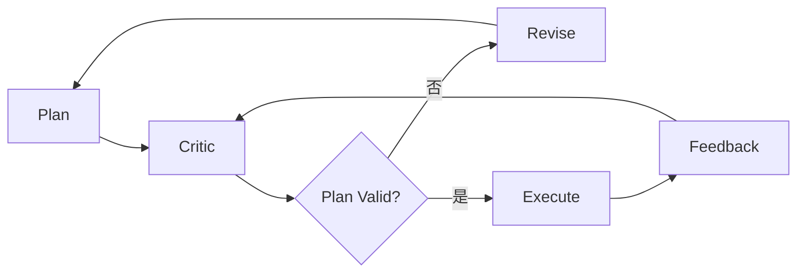

Reflection 应优先使用真实工具反馈、规则、测试和人工审核，而不是只让同一个模型自我评价。

## 11.19 Verifier-guided Planning

执行前，应从下面五个维度检查计划。“通过”是允许尝试执行，不是目标必然可达。静态校验覆盖可提前判断的条件；实时权限、资源版本及动作前置条件还要在执行前再次检查，不能把计划生成时的许可长期复用。

### 11.19.1 Schema Validation

- 字段完整；
- 类型正确；
- 引用的 Task 存在；
- 输出格式合法。

### 11.19.2 Dependency Validation

- 对任务依赖 DAG 检查无环；若使用允许循环的状态机，则检查循环的预算与退出条件；
- 所需输入有来源；
- 前置条件可满足；
- 并行任务没有写冲突。

### 11.19.3 Capability Validation

- 指定 Tool 存在；
- Agent 拥有所需 Skill；
- 权限足够；
- 参数可以生成。

### 11.19.4 Risk Validation

- 高风险操作是否有审批；
- 是否使用最小权限；
- 是否定义回滚或补偿；
- 是否触及敏感数据。

### 11.19.5 Budget Validation

- Token；
- 时间；
- 费用；
- 最大步骤；
- 并发限制。


## 11.20 使用外部规划器

并非所有规划都应交给 LLM。

### 11.20.1 Deterministic Workflow

流程已知时直接使用代码、DAG 或状态机。

### 11.20.2 Constraint Solver

适合：

- 排班；
- 资源分配；
- 路径约束；
- 组合优化；
- 满足严格规则的问题。

### 11.20.3 Classical Planner

当动作具有清晰前置条件和效果时，可以使用经典规划算法。

### 11.20.4 LLM + Solver

LLM 负责：

- 理解自然语言目标；
- 提取约束；
- 生成 Solver 输入；
- 解释结果。

Solver 在给定形式化模型内负责：

- 精确搜索；
- 约束满足；
- 在算法、目标函数和预算支持时给出最优性或不可行性证明。

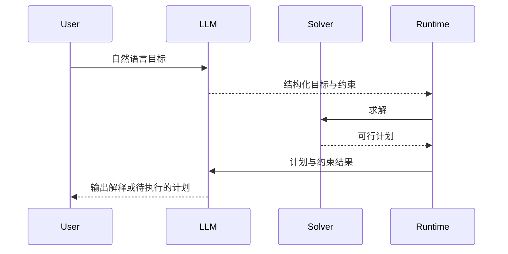

> **这类问题更适合让语言模型负责建模和解释，把搜索或求解交给确定性算法。**

要分开检查“求解器求对了模型”和“模型正确表达了用户需求”。遗漏预算、误译单位或错误动作效果时，求解器仍可能给出形式上有效、现实中不可用的计划。以 [OR-Tools CP-SAT](https://developers.google.com/optimization/cp/cp_solver) 为例，`FEASIBLE` 不等于 `OPTIMAL`，超时后的 `UNKNOWN` 也不等于已证明无解。

[LLM-Modulo](https://arxiv.org/abs/2402.01817)提出更紧密的候选生成—外部验证循环：LLM 不只做格式转换，也可以提出计划或补充模型，Verifier 返回具体违反的约束供修订。该论文对 LLM 规划能力的强判断是其研究立场，不宜当作对所有后续模型的永久结论；可采用的是让生成与独立检查互相反馈的机制。

## 11.21 计划的表示方式

### 11.21.1 Natural Language List

简单直观，但难以验证和调度。

### 11.21.2 Structured JSON

适合任务管理和 API 集成：

```json
{
  "plan_id": "plan-42",
  "goal": "发布新版本",
  "tasks": [
    {
      "id": "test",
      "depends_on": [],
      "executor": "test-tool",
      "success_criteria": ["all tests pass"]
    },
    {
      "id": "approval",
      "depends_on": ["test"],
      "executor": "human-approval-gate",
      "success_criteria": ["approval bound to the tested release artifact"]
    },
    {
      "id": "deploy",
      "depends_on": ["test", "approval"],
      "executor": "deployment-agent",
      "success_criteria": ["health checks pass"]
    }
  ]
}
```

示例只展示依赖结构，不是可直接执行的部署配置。测试、审批和部署必须绑定同一不可变发布产物；部署前还需复核授权、幂等键和回滚策略，不能用模型生成的审批字符串代替审批记录。

### 11.21.3 DAG

适合依赖和并行调度。

### 11.21.4 State Machine

适合状态有限、转移规则明确的业务流程。

### 11.21.5 Policy

不生成固定步骤，而是根据状态选择下一动作，适合动态环境。

## 11.22 计划粒度

计划过粗：

- 无法执行；
- 无法验证；
- 失败影响范围大。

计划过细：

- 调度成本高；
- 模型调用过多；
- 状态碎片化；
- 容易丢失全局目标。

合理任务单元应：

- 独立执行；
- 独立验证；
- 独立重试；
- 输入输出明确；
- 副作用有边界；
- 产生有意义 Artifact。

## 11.23 Planning Memory

规划需要记住：

- 当前目标；
- 已完成步骤；
- 计划版本；
- 关键假设；
- Observation；
- 失败和重试；
- 未解决问题；
- 预算。

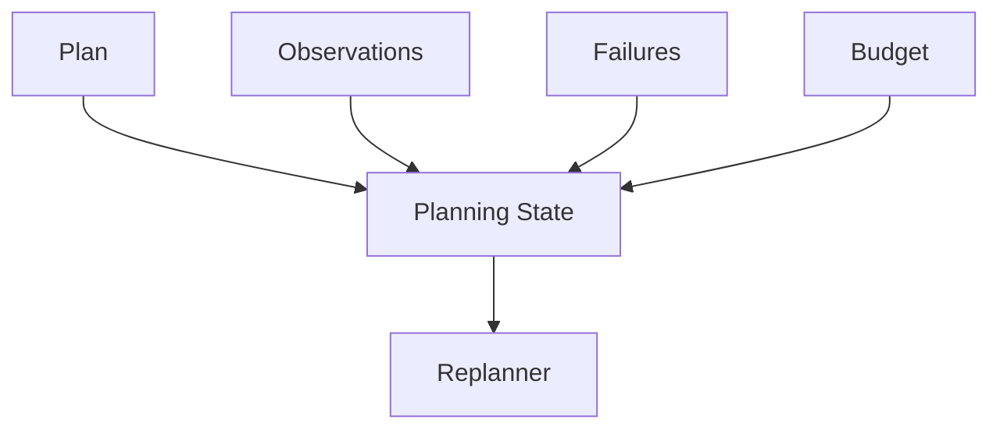

计划若只留在单次 Prompt 中，执行过程中就很难追踪版本、恢复状态或安全重启。更稳妥的做法是把它存入结构化 State Store，并支持 Checkpoint。

## 11.24 World Model

规划需要估计动作会如何改变环境。这个预测模型称为 World Model。

LLM 可以隐式预测：

- 调用 Tool 后可能得到什么；
- 某个动作是否满足前置条件；
- 下一步会产生什么副作用。

但在高风险场景里，仅靠语言模型预测还不够，通常还要结合：

- API Schema；
- 模拟器；
- 测试环境；
- 数字孪生；
- 规则引擎；
- 真实只读查询。

World Model 的误差会随预测深度累积，尤其是在陌生状态或工具分布变化后。API Schema 描述参数形状，不是完整的环境转移模型；模拟器、只读查询和真实执行反馈也各有覆盖范围。

[SayCan](https://arxiv.org/abs/2204.01691)提供了一个具体例子：用语言模型估计技能对目标的适合程度，用技能价值函数估计在当前环境中能否成功，再组合选择。它依赖已有技能库及相应可行性估计，不能由“语言模型能描述动作”推断机器人就具备该动作能力。

## 11.25 规划中的不确定性

计划应区分：

- 已知事实；
- 假设；
- 不确定信息；
- 必须通过 Tool 验证的条件。

```json
{
  "assumption": "竞品 A 仍提供免费版本",
  "confidence_label": "unverified",
  "verification_task": "check-current-pricing",
  "on_failure": "revise-comparison-plan"
}
```

优先验证影响后续大量步骤且验证成本可接受的假设。模型自报 `0.6` 一类数字未经校准时，不应解释为实际成功概率；应记录来源、时间和未确定原因。

## 11.26 风险感知规划

不同动作需要不同控制：

| 风险 | 示例 | 规划策略 |
|---|---|---|
| 低 | 搜索公开网页 | 可自动执行 |
| 中 | 修改本地代码 | 保留 Diff 和回滚 |
| 高 | 发邮件、发布内容 | 执行前确认 |
| 极高 | 转账、删库、改权限 | 强认证、审批和最小权限 |

规划器应优先选择：

- 可逆动作；
- 只读探测；
- 最小副作用；
- 可验证中间步骤；
- 明确回滚路径。

## 11.27 规划预算

把本节的预算写成五个上限：

$$
B=(N,D,K,T_{max},C_{max})
$$

其中：

- `N`：候选计划数量；
- `D`：搜索深度；
- `K`：重规划次数；
- `T_max`：最大时间；
- `C_max`：最大费用。

预算策略可以是：

- 简单任务只生成一个计划；
- 中等任务生成计划并做一次 Critique；
- 高风险任务先落实权限、审批和验证，可比较多个候选，但不能用更多搜索替代准入控制；
- 预算耗尽时返回部分计划和未解决风险。

## 11.28 Adaptive Planning

Adaptive Planner 根据任务难度和风险选择规划强度：

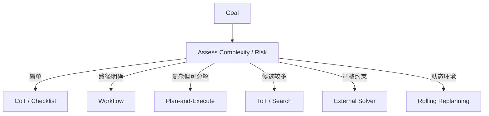

对所有任务一律启用昂贵搜索，通常得不偿失。

## 11.29 规划能力的适配与训练

### 11.29.1 In-context Examples

提供高质量计划示例，包括依赖、成功标准和失败处理。这是推理时条件化，不是训练，不改变模型参数。

### 11.29.2 Supervised Fine-tuning

使用目标到计划、状态到下一动作的轨迹训练模型。

### 11.29.3 Tool-use Training

训练模型理解 Tool Schema、参数和 Observation。

### 11.29.4 Reinforcement Learning

根据任务成功、成本、风险和步骤效率优化策略。

### 11.29.5 Verifiable Rewards

使用测试、模拟器、规则和环境结果提供可验证反馈。这是奖励来源，不是独立训练算法；只有经过优化器更新参数才属于参数学习。如果只是据此重试或筛选计划，则是推理时控制。

### 11.29.6 Curriculum

从短计划逐步训练到长任务和动态环境。

训练可以增强模型能力，但系统仍需要 Runtime、State、Verifier 和 Guardrails。

应区分离线轨迹训练、在线 RL 与当前任务的上下文适应。训练或评测时还需防止奖励泄漏、无效测试和“完成目标但违反约束”的奖励投机；数学可验证奖励上的提升，不等于对业务工具长轨迹的提升。

## 11.30 规划质量如何评估

| 指标 | 含义 |
|---|---|
| Goal Completion | 最终是否完成目标 |
| Plan Validity | 计划结构是否合法 |
| Executability | 步骤是否可以实际执行 |
| Completeness | 是否覆盖必要步骤 |
| Dependency Accuracy | 依赖是否正确 |
| Replan Rate | 计划失效频率 |
| Step Efficiency | 是否存在冗余步骤 |
| Recovery | 失败后是否能局部恢复 |
| Cost | 规划和执行成本 |
| Safety | 是否遵守权限和风险约束 |

还需要与基线比较：

- 单次 LLM；
- ReAct；
- 固定 Workflow；
- Plan-and-Execute；
- Search-based Planner。

对照应固定模型版本、工具权限、任务输入和成功标准，同时报告预算、延迟、样本量及不确定性。增加搜索后的提升可能来自更多尝试而非计划结构；可以再比较等预算的 ReAct 重试或多候选基线。

增加规划复杂度应有可测收益：提高成功率、降低总体成本，或满足原方案无法满足的安全与可审计要求。更多节点、更多搜索本身不是收益。

## 11.31 常见失败模式

### 11.31.1 计划看起来完整但不可执行

原因：

- Tool 不存在；
- 参数无法获得；
- 权限不足；
- 步骤输出没有被后续消费。

### 11.31.2 计划遗漏隐含依赖

例如部署前忘记测试或审批。

### 11.31.3 Planner 产生过多微任务

调度和通信成本超过收益。

### 11.31.4 初始假设错误

后续所有步骤建立在错误方向上。

### 11.31.5 频繁完整重规划

产生 Plan Drift 和成本膨胀。

### 11.31.6 Planner 与 Executor 语义不一致

Executor 不理解步骤目标或输出格式。

### 11.31.7 自我评价取代真实验证

计划逻辑看似合理，但无法通过环境测试。

### 11.31.8 没有停止条件

不断拆分、搜索和重规划。

## 11.32 推荐的生产架构

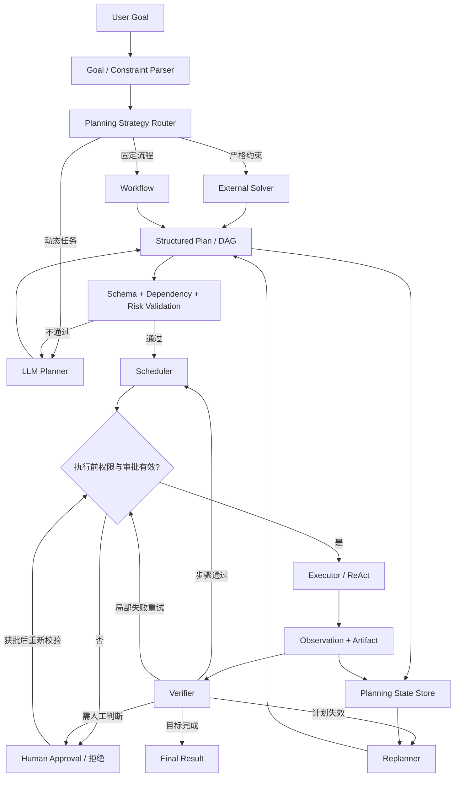

图中的 Scheduler 只派发依赖已验收的任务，Verifier 区分步骤通过与目标完成。校验失败、重试和重规划共用硬性预算；不可修复的失败、审批拒绝或预算耗尽都应有停止出口，不能沿图中的回路无限运行。

## 11.33 实现步骤

### 11.33.1 定义目标与成功标准

不要只传入模糊目标。

### 11.33.2 建立 Action Catalog

为每个动作定义前置条件、效果、风险和成本。

### 11.33.3 定义 Plan Schema

让计划可以被程序验证和调度。

### 11.33.4 添加 Plan Validator

检查依赖、能力、权限和预算。

### 11.33.5 执行并保存 Observation

用真实 Tool Result、用户确认或其他可追溯事件更新状态；将模型预测单独标成假设，不要把“预计已部署”写成“已经部署”。

### 11.33.6 添加 Replanner

定义明确的触发条件和最大重规划次数。

### 11.33.7 添加 Verifier

优先使用测试、规则、模拟器和真实环境。

### 11.33.8 加入 Guardrails

限制步骤、时间、费用、权限和副作用。

### 11.33.9 建立评估集

测量成功率、成本、延迟和恢复能力。

## 11.34 选型表

| 场景 | 推荐方案 |
|---|---|
| 简单线性问题 | Direct / CoT |
| 需要先分解再求解 | Plan-and-Solve |
| 候选方向较多且可评价 | ToT |
| 中间结果需要合并复用 | Task Graph / DAG |
| 长任务且环境变化 | Rolling Replanning |
| 路径固定 | Workflow |
| 严格约束优化 | External Solver |
| 全局计划 + 局部探索 | Planner + ReAct |
| 高质量要求 | Planner + Verifier + Reflection |

## 11.35 本章总结

判断 LLM 有没有规划能力，不能只看它会不会“按步骤思考”，还要看计划能否执行、验证和更新。

### 11.35.1 模型层

- CoT 提供单路径中间推理；
- Task Decomposition 生成子问题；
- ToT 搜索多个候选方向；
- GoT 允许合并和复用中间结果；
- 训练和 Verifiable Reward 可以增强规划能力。

### 11.35.2 系统层

- 用 Plan Schema 表达可执行任务；
- 用 Validator 检查依赖、能力和风险；
- 用 Scheduler 与 Executor 执行；
- 用 Observation 更新真实状态；
- 用 Replanner 动态修改计划；
- 用 Verifier 和 Guardrails 检查质量与安全条件，保留未覆盖风险和人工处理出口。

> **落到工程实现，规划应表现为受预算约束的行动结构，能够执行、验证、更新。**

## 参考资料

- [Chain-of-Thought Prompting Elicits Reasoning in Large Language Models](https://arxiv.org/abs/2201.11903)
- [Tree of Thoughts: Deliberate Problem Solving with Large Language Models](https://arxiv.org/abs/2305.10601)
- [Graph of Thoughts: Solving Elaborate Problems with Large Language Models](https://arxiv.org/abs/2308.09687)
- [Plan-and-Solve Prompting](https://arxiv.org/abs/2305.04091)
- [LLMCompiler: An LLM Compiler for Parallel Function Calling](https://arxiv.org/abs/2312.04511)
- [Anthropic: Building Effective Agents](https://www.anthropic.com/engineering/building-effective-agents)
- [LLMs Can't Plan, But Can Help Planning in LLM-Modulo Frameworks](https://arxiv.org/abs/2402.01817)
- [Do As I Can, Not As I Say: Grounding Language in Robotic Affordances](https://arxiv.org/abs/2204.01691)
- [OR-Tools: CP-SAT Solver](https://developers.google.com/optimization/cp/cp_solver)
- [DeepSeek-R1](https://arxiv.org/abs/2501.12948)
