# Chapter 12: Agent Reflection, Verification, and Self-improvement

## 12.1 What Is Agent Reflection?

Agent reflection is better understood as a feedback-driven control mechanism than as abstract “introspection”:

> **Generate or execute → Evaluate → Locate problems → Make targeted revisions → Verify again**

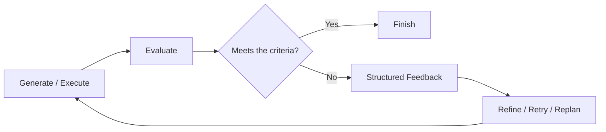

Reflection requires a sufficiently useful correction signal, but not necessarily new external evidence in every round: checking explicit criteria again can also reveal omissions. Feedback can come from:

- Tool results;
- Compilers;
- Unit tests;
- Schemas;
- Rules;
- Simulators;
- Authoritative data;
- Human review;
- Critic models;
- LLM-as-a-judge.

Without new evidence or evaluation criteria, asking the same model to generate repeatedly may produce only another equally unreliable answer.

Here, reflection is an umbrella term for control mechanisms, not a single algorithm. Self-Refine modifies the current candidate; Reflexion retains verbal feedback between attempts. Methods specifically trained for self-correction update parameters during training. A trained self-correction model usually still does not update its weights while answering the current question. These different mechanisms should not all be described as “learning while running.”

## 12.2 Why Use Reflection?

### 12.2.1 Find Problems Missed during Generation

When generating content, a model focuses primarily on “completing the task” and may not simultaneously cover:

- Factual accuracy;
- Full coverage of constraints;
- Citation consistency;
- Safety requirements;
- Output format;
- Boundary cases.

A separate evaluation stage can focus attention on these dimensions.

### 12.2.2 Stop Errors from Propagating

In tasks with strong dependencies, an early error can become the input to later steps:

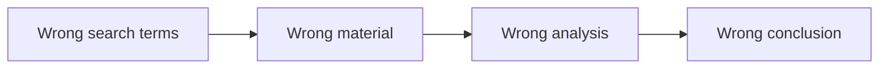

Verification at key points creates an opportunity to intervene:

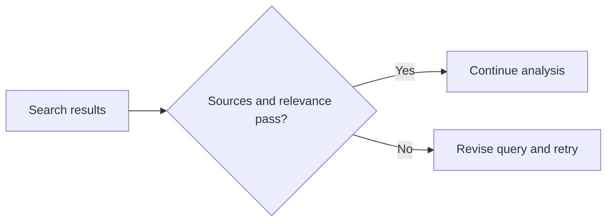

This can stop an error before it enters downstream analysis, provided that the verifier actually checks sources and relevance rather than merely checking whether the search interface returned success.

### 12.2.3 Improve Outputs That Are Hard to Get Right in One Attempt

Suitable tasks include:

- Code generation;
- Research reports;
- Translation;
- Legal or business writing;
- Complex data analysis;
- Content generation with explicit scoring criteria.

### 12.2.4 Turn Failures into Reusable Lessons

Verified failure diagnoses can:

- Improve the current retry;
- Update the current task plan;
- Form an episode;
- Be promoted to long-term memory;
- Become a skill, rule, or test.

Unverified reflections should not directly become long-term rules.

## 12.3 Reflection versus Verification

| Reflection | Verification |
|---|---|
| Explains what might be wrong and how to change it | Determines whether explicit criteria are met |
| Feedback is usually generated by a model | Can be performed by programs, rules, the environment, or people |
| May be subjective | Provides a conclusion only within the criteria and coverage of the checks |
| Guides revision | Supports acceptance, rejection, or blocking |

A more reliable approach is to let verification establish whether problems exist, then use reflection to turn those problems into actionable revisions.

For example:

- A unit test shows that a function fails on empty input;
- A critic summarizes the failure as “missing an empty-input branch”;
- A refiner modifies the code;
- The test verifies it again.

## 12.4 Choosing Verifiers by the Evidence Needed

First ask, “What evidence can establish whether this requirement is met?” Then decide who or what should check it, rather than assigning all verifiers a fixed ranking:

| Requirement to assess | Preferred evidence | Additional checks still needed |
|---|---|---|
| Whether a tool completed a write | Business state in the target system and the operation receipt | Object identity, version, duplicate side effects |
| Whether code meets known behavioral requirements | Compilers, tests, constraint solvers | Uncovered requirements and regression risks |
| Whether the format meets the contract | Schemas and deterministic rules | Whether field contents are true and valid |
| Whether a factual claim is supported | Traceable authoritative data sources | Recency, applicability, conflicting sources |
| Whether wording is clear or an approach is appropriate | Human domain review or calibrated model evaluation | Scoring consistency and evidence coverage |

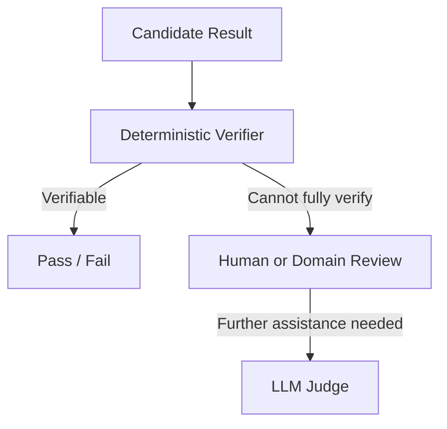

Language-model evaluation is useful for quality dimensions that are difficult to formalize completely, but should not replace available objective verification.

HTTP 200 may mean only that a request was accepted, and a real system may return stale state. Successful compilation does not guarantee business correctness, and generated tests may contain incorrect expected values. When choosing a verifier, explain what it checks, what it misses, and whether a failure can block delivery. Irreversible actions require approval before execution; reflection afterward cannot supply missing authorization retroactively.

## 12.5 Four Levels for Triggering Reflection

Beyond step-level and task-level reflection, a system can include milestone-level checks and cross-task consolidation.

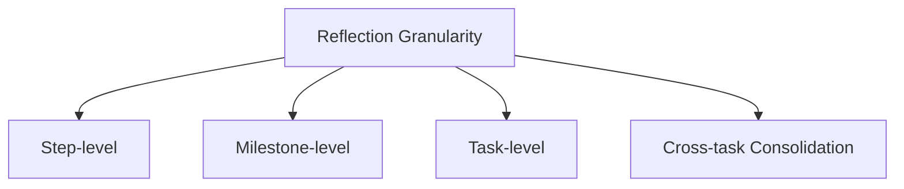

## 12.6 Step-level Reflection

Step-level reflection checks results after a tool call, reasoning step, or state transition.

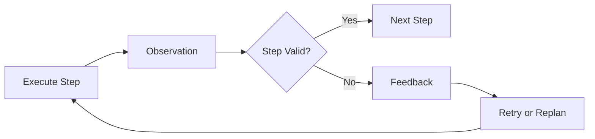

### 12.6.1 Suitable Scenarios

- Steps have strong dependencies;
- Early errors affect substantial downstream work;
- Tool results are easy to verify;
- Operations carry high risk or side effects;
- Local retries are relatively inexpensive.

Examples of checks include:

- Whether search results are relevant to the question;
- Whether an API returned a success status;
- Whether code compiles;
- Whether data conforms to a schema;
- Before a high-risk action, whether approval is valid and bound to the current parameters.

### 12.6.2 Advantages

- Errors are detected early;
- Failures affect a smaller portion of the task;
- Local retries are possible;
- Recorded state is easier to keep accurate;
- Suits tasks with strong dependencies.

### 12.6.3 Costs

- Additional verification latency;
- More model or tool calls;
- Potentially excessive checking of low-risk steps;
- A critic may keep proposing nonessential changes;
- Lower task throughput.

### 12.6.4 An Extra LLM Call Is Not Required at Every Step

“Adding step-level reflection to a ten-step task requires twenty LLM calls” is not a universal rule.

Step verification can use:

- A tool's own status code;
- A schema validator;
- Unit tests;
- A rule engine;
- The current agent's next decision round;
- A critic evaluating several steps in a batch;
- Model evaluation triggered only by anomalies.

The call count may approach twice the original only when an LLM critic is invoked separately for every step.

## 12.7 Milestone-level Reflection

Milestone-level reflection evaluates a completed phase rather than checking every microstep.

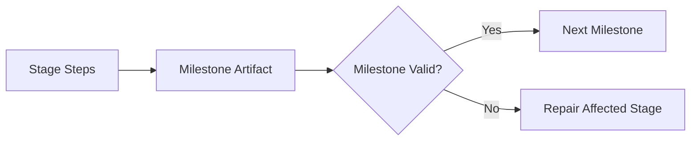

This reduces the number of checks but does not guarantee lower total cost: discovering an error at the end of a phase may require repeating more steps. It generally catches deviations earlier than checking only the final result, provided that the phase has a clear artifact that can be accepted or repaired as a whole.

Suitable when:

- A phase contains many internal steps;
- The phase produces an independent artifact;
- Per-step verification is too expensive;
- Dependencies between phases are clear.

For example:

- Check source coverage after information collection is complete;
- Run a full group of tests after implementing a feature;
- Check the structure after completing a report outline.

## 12.8 Task-level Reflection

Task-level reflection evaluates the whole task after it is complete.

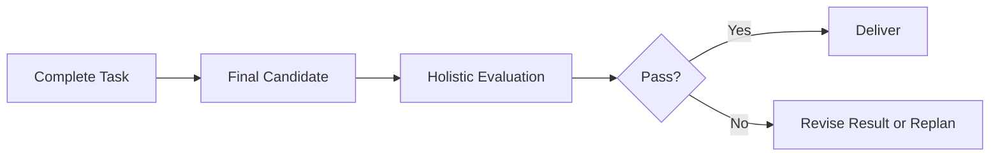

### 12.8.1 Suitable Scenarios

- Steps are relatively independent;
- A single-step error has limited impact;
- Overall consistency matters most;
- The final result is easy to evaluate as a whole;
- Intermediate verification is expensive.

Examples of checks include:

- Whether a report's structure and conclusions are consistent;
- Whether writing style is uniform;
- Whether chapters repeat or contradict one another;
- Whether the final proposal satisfies every requirement.

### 12.8.2 Advantages

- Fewer additional calls;
- A view of global consistency;
- Suits problems that span multiple sections;
- Simple to implement.

### 12.8.3 Costs

- Errors are detected late;
- Earlier execution costs may be wasted;
- Repairing just one local part can be difficult;
- The final output may conceal the root cause.

## 12.9 Cross-task Consolidation

Cross-task reflection resembles a retrospective. It focuses on identifying:

- Which strategies worked;
- Which errors recur;
- Which rules deserve long-term retention;
- Which tools or prompts need improvement.

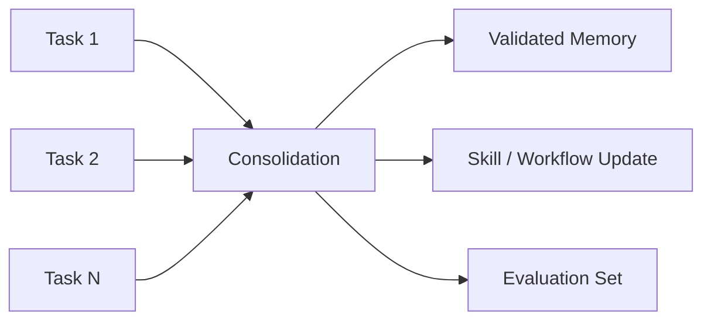

Cross-task lessons must be validated, deduplicated, and checked for applicability. A model's one-time self-evaluation must not automatically become a permanent rule.

## 12.10 Choosing Reflection Granularity

| Task characteristic | Recommended granularity |
|---|---|
| Strong dependencies; errors propagate through successive steps | Step-level |
| Phases have independent outputs | Milestone-level |
| Relatively independent steps; focus on overall quality | Task-level |
| Need to accumulate experience from repeated tasks | Cross-task Consolidation |
| High-risk action | Step-level + Human Gate |
| Cost-sensitive | Triggered Milestone / Task-level |

Production systems usually combine these approaches:

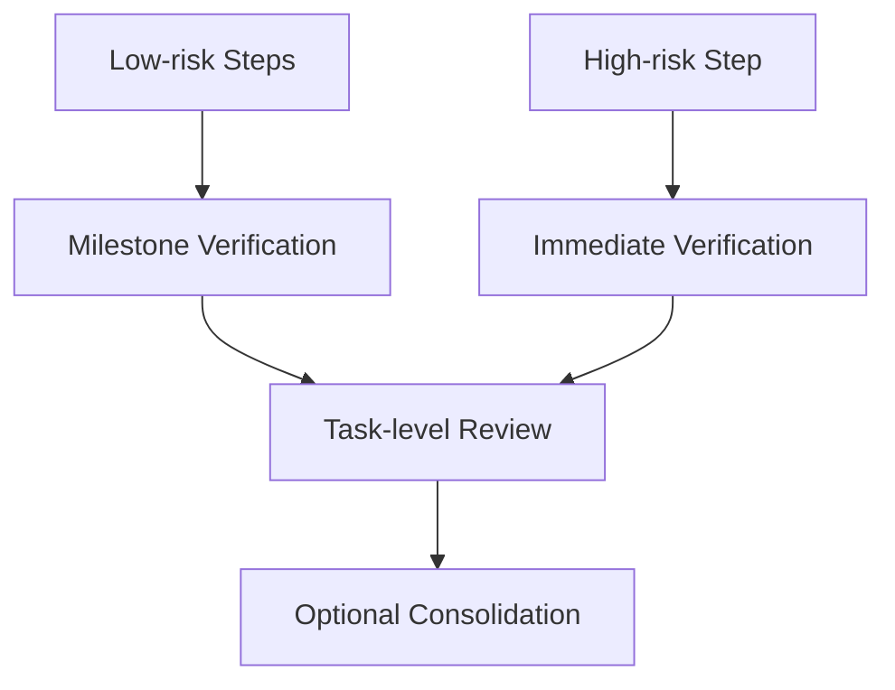

## 12.11 Adaptive Reflection

Reflection need not run after every step. It can be triggered dynamically by risks and anomalies.

Trigger signals include:

- A tool returning an error;
- Output violating a schema;
- A low calibrated confidence signal, or missing required evidence;
- Conflicting sources;
- Repeated calls to the same tool;
- A plan drifting away from the goal;
- An imminent high-risk action;
- Unusual phase duration or cost;
- A low verifier score.

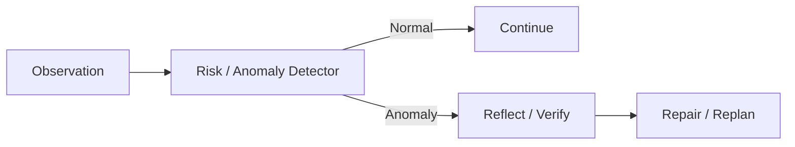

Compared with a fixed “one critic call per step” policy, adaptive triggering usually makes costs easier to control.

## 12.12 The Basic Components of a Reflection System

A complete implementation usually includes:

1. A generator / executor;
2. A verifier / critic;
3. A feedback formatter;
4. A refiner;
5. A stop controller;
6. An optional memory writer.

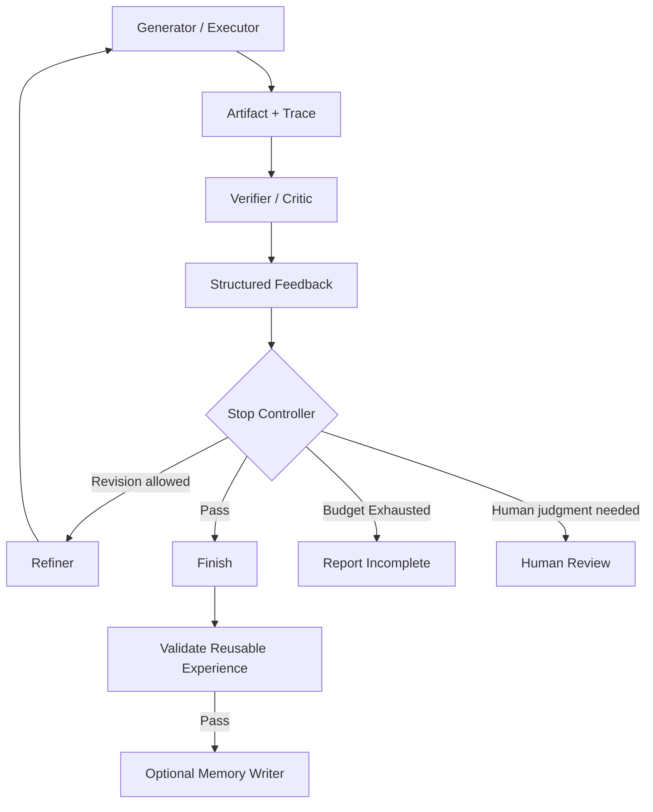

The stop controller decides whether continuation is allowed before invoking the refiner, preventing revisions from being triggered after a stop signal. Raw feedback can remain in task-local diagnostic records. Long-term memory should receive validated lessons with an explicit scope of applicability, not every critic opinion.

## 12.13 Separate Evaluation from Refinement

Reflection requires at least two logical stages:

### 12.13.1 Evaluate

This stage is responsible only for:

- Checking against criteria;
- Identifying specific problems;
- Providing evidence;
- Assessing severity;
- Giving actionable suggestions.

### 12.13.2 Refine

This stage is responsible for:

- Reading the original task;
- Reading the original output;
- Reading structured feedback;
- Making targeted changes;
- Preserving correct content;
- Returning a result that can be verified again.

The two roles can be implemented through:

- Two different prompts;
- Two model calls;
- Different models;
- An LLM plus a deterministic verifier;
- Different workflow nodes within the same agent.

What matters is the separation of responsibilities and input/output boundaries—not the existence of exactly two prompt files.

## 12.14 What Should a Critic Prompt Include?

### 12.14.1 The Original Task and Success Criteria

The critic must know what counts as completion. Break success conditions into checkable evaluation criteria—a rubric—and identify hard requirements that cannot be offset by strengths elsewhere.

### 12.14.2 Specific Dimensions to Check

For example:

- Correctness;
- Completeness;
- Evidence;
- Consistency;
- Safety;
- Format;
- Efficiency.

### 12.14.3 Verifiable Evidence

Require each finding to cite:

- An output passage;
- A tool result;
- A test;
- A source;
- An explicit rule.

### 12.14.4 A PASS Exit

If the result already meets the requirements, the critic must be able to return PASS. Otherwise, it may continually invent low-value comments just to satisfy the instruction to “find problems.”

### 12.14.5 Structured Output

In this example, the finding says that a key market-share claim lacks a source, points to section 3, paragraph 2 of the report, and recommends adding an authoritative source or removing the specific number:

```json
{
  "verdict": "REVISE",
  "score": 0.78,
  "findings": [
    {
      "criterion": "evidence",
      "severity": "high",
      "location": "section-3",
      "problem": "关键市场份额结论没有来源",
      "evidence": "报告第 3 节第 2 段",
      "suggestion": "补充权威来源，或删除该具体数字"
    }
  ],
  "next_action": "revise"
}
```

The `score` is an illustrative placeholder, not a calibrated probability of correctness. Define the scoring scale, rubric version, and evidence coverage. `PASS` means only that this critic found no problems within its remit; it cannot override failed deterministic tests, a safety rejection, or missing approval.

Allowed verdicts might include:

- `PASS`;
- `REVISE`;
- `REPLAN`;
- `BLOCKED`;
- `NEEDS_HUMAN_REVIEW`.

## 12.15 What Should a Refiner Prompt Include?

The refiner needs:

- The original task;
- The current candidate;
- Critic findings;
- Constraints that must not change;
- The permitted scope of modification;
- The output schema.

Recommended requirements:

1. Address only valid findings;
2. Preserve parts that are already correct;
3. Do not introduce new facts without sources;
4. Return the complete revised artifact or an explicit patch;
5. Explain which findings cannot be resolved.

Do not merely say, “Please improve it based on the feedback.” That leaves the direction of revision unstable.

## 12.16 Stop Controller

A system cannot rely on the model reflecting indefinitely until it is satisfied.

Stopping conditions include:

- All mandatory hard acceptance checks and required quality checks pass;
- A soft quality threshold is reached with no unresolved hard failures;
- The maximum number of rounds is reached;
- The token or cost budget is exhausted;
- A timeout occurs;
- Several consecutive rounds produce no significant improvement;
- The same finding recurs;
- Human judgment is required;
- The user cancels.

Let the score in round `r` be `sᵣ`. The improvement is:

$$
\Delta_r=s_r-s_{r-1}
$$

If the following holds for several consecutive rounds:

$$
\Delta_r\le\epsilon
$$

The system can trigger a “no measurable improvement” stopping policy rather than continuing to consume its budget.

This requires comparable scoring scales across rounds and a tolerance that accounts for the judge's random variation. One small score difference does not establish that true quality is unchanged. Save candidates and verification records rather than simply delivering “the last version”: revisions may introduce regressions into previously correct content. If thresholds remain unmet or hard failures remain, stopping means incomplete work or a human handoff—not success.

### 12.16.1 How to Set the Maximum Number of Rounds

There is no universally optimal default number of rounds. A small number can be an experimental starting point, but “one to three rounds” is not an established general-benefit claim.

Determine the round limit through evaluation of:

- Cost per round;
- Task risk;
- Verifier reliability;
- Average improvement per round;
- The user's latency target;
- Whether deterministic success conditions exist.

A high-risk operation may allow only one revision before human escalation. An automatically testable code repair may allow more bounded iterations.

## 12.17 The Cost of Reflection

If each round includes evaluation, refinement, and verification, total cost can be expressed as:

$$
C_{reflection}=
\sum_{r=1}^{R}
\left(
C_{eval,r}
+C_{refine,r}
+C_{verify,r}
\right)
$$

Here, evaluation to locate problems, refinement to modify candidates, and verification after revision are accounted for separately. If one check serves two roles, do not count it twice. Each stage should also include the resources it consumes:

- Tool execution;
- Tests;
- Context;
- Communication with critic agents;
- Artifact storage;
- Human review.

Ways to reduce cost include:

- Trigger reflection only on anomalies or high risk;
- Use deterministic verifiers;
- Use smaller models for initial screening;
- Check multiple steps in a batch;
- Reflect at milestones rather than after every microstep;
- Stop as soon as the threshold is met;
- Repair only the affected parts.

## 12.18 Self-Reflection

Self-reflection uses the same model or agent to evaluate its own results.

### 12.18.1 Advantages

- Simple implementation;
- No additional agent required;
- Low context-transfer overhead;
- Suitable for preliminary, low-risk checks.

### 12.18.2 Limitations

- The generator and critic share model biases;
- The original assumptions are easily repeated;
- The model may favor its own wording;
- There may be no genuinely new evidence;
- Changes may be superficial.

Self-reflection can serve as an initial screen, but should not be treated as objective verification.

Experimental conclusions need their scope attached. [Huang et al.](https://arxiv.org/abs/2310.01798) found that, for the models tested at the time, attempts to correct reasoning without external feedback often produced no gains or even degraded performance. This is not a theorem that “models can never self-correct.” [SCoRe](https://arxiv.org/abs/2409.12917) subsequently used multi-turn online RL specifically to train self-correction, without requiring external corrective feedback at test time. That differs from merely adding “check your answer” to a frozen model's prompt: rewards were used and parameters were updated during training.

## 12.19 Critic Agent

A critic agent specializes in checking an executor's artifacts or trajectories.

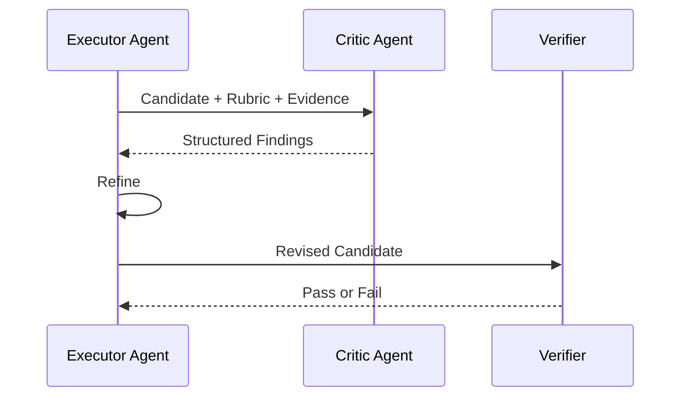

### 12.19.1 Why It Might Work Better

- The critic uses a separate prompt;
- The critic is not responsible for generating the artifact;
- The generator's explanation can be hidden to reduce anchoring;
- Different models and tools can be used;
- The critic can focus on one quality dimension;
- It can access independent verification data.

### 12.19.2 Why It Is Not Necessarily More Objective

If the critic:

- Uses the same model;
- Sees the same context;
- Uses a vague rubric;
- Has no external evidence;
- Is instructed only to “find problems”;

It may still share the generator's errors or criticize merely for the sake of criticism.

> **Separating a critic into its own agent does not automatically provide independent evidence or eliminate correlated errors.**

Ways to improve independence include:

- Use different models or model versions;
- Use different data sources;
- Conduct blind reviews;
- Define an explicit rubric;
- Provide tests and factual sources;
- Evaluate the critic itself.

## 12.20 Multi-Critic

Multiple critics can check different dimensions:

- Facts;
- Safety;
- Logic;
- Format;
- Domain compliance.

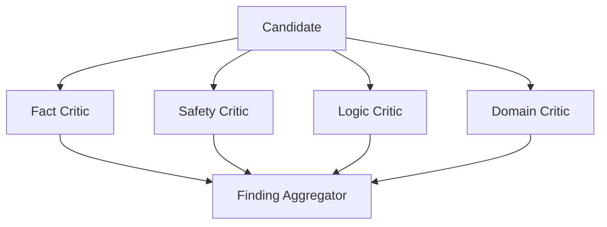

Advantages:

- Each critic is more focused;
- Checks can run in parallel;
- Permission and data isolation are clearer.

Costs:

- Higher expense;
- Findings may conflict;
- Aggregation and prioritization are needed;
- Multiple instances of the same model may still share biases.

## 12.21 Debate

Debate has multiple agents challenge one another's candidate proposals.

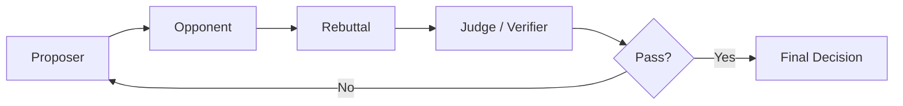

Suitable when:

- Several reasonable viewpoints exist;
- Assumptions need to be exposed;
- Risk analysis is needed;
- Conclusions cannot be fully verified through deterministic rules.

### 12.21.1 Risks of Debate

- Being more persuasive does not mean being more correct;
- A judge may favor a style of presentation;
- Agents may share the same knowledge gaps;
- Discussion may loop;
- Token and latency costs are high;
- Voting should not replace data on factual questions.

Important business or legal decisions still require authoritative facts, domain experts, and clearly assigned responsibility.

## 12.22 Self-Refine

The basic Self-Refine process is:

> **Generate → Feedback → Refine**

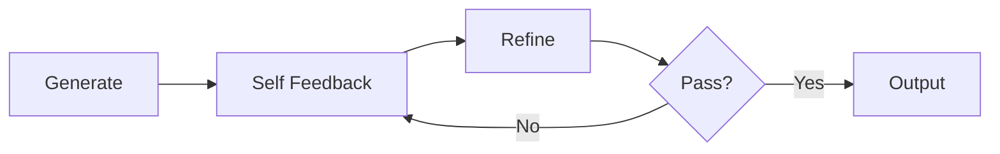

The original Self-Refine method uses the same LLM for generation, feedback, and refinement. It requires no additional training or RL and primarily improves the current candidate rather than model weights. The paper reports gains across seven types of tasks, but evaluation criteria, models, and stopping methods vary by task. Its average gain should not be treated as a universal improvement for any business application.

Self-feedback can reveal problems in style, format, or explicit constraints, but does not guarantee that missing facts will be supplied. Outputs may improve without external feedback, yet the effectiveness of factual and logical correction still needs independent testing.

Suitable for:

- Improving text quality;
- Correcting formats;
- Generation tasks with a rubric;
- Low-risk iteration.

## 12.23 Reflexion

Reflexion converts task feedback into natural-language reflections and stores them in episodic memory for subsequent attempts. The original paper permits scalar or textual feedback, from external sources or internal simulation. “Verbal reinforcement learning” means influencing subsequent policies through verbal memory, not updating actor weights through gradients.

Its classic components are:

- An actor;
- An evaluator;
- Self-reflection;
- Episodic memory.

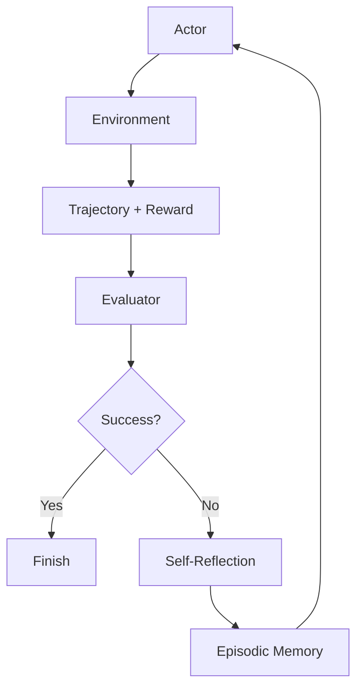

### 12.23.1 Memory Scope in the Original Reflexion

The original method focuses on retaining verbal reflections across trials of the same task so that the next attempt can avoid repeating mistakes.

Trials can reinitialize the environment while retaining bounded reflection memory. This differs both from continuing to polish the same answer and from automatically acquiring long-term, cross-task skills. The paper's final single-candidate HumanEval `pass@1` includes generated tests and multiple revisions; it must not be interpreted as a single-model-call success rate. The paper also reports a regression on MBPP Python. See [Chapter 4, §4.6.2: How to Interpret the HumanEval Results](04-agent-design-patterns.md).

It does not require:

- A vector database;
- Cross-task semantic retrieval;
- Automatically saving all experience permanently.

Production systems can extend it to cross-task memory, but need:

- Validation of lessons;
- A defined scope of applicability;
- Deduplication;
- Provenance;
- Retrieval of similar tasks;
- Expiration and deletion policies.

### 12.23.2 Promoting a Reflection to a Skill

If a lesson:

- Has proved useful repeatedly;
- Has value across tasks;
- Has an explicit scope of applicability;
- Contains no sensitive information;

It can be promoted into:

- A skill;
- A workflow;
- A rule;
- A test;
- A runbook.

## 12.24 LATS

LATS (Language Agent Tree Search) combines the following in a single Monte Carlo tree search (MCTS) process:

- Tree search;
- Actions;
- Environmental feedback;
- Value evaluation;
- Reflection;

Selection balances exploring less-visited branches against exploiting branches with high estimated value. Expansion generates actions; simulated trajectories (rollouts) or execution in the environment produce feedback; value estimates and returns are then propagated back through the tree nodes. This is not neural-network gradient backpropagation, and the original method does not update LLM parameters through online fine-tuning.

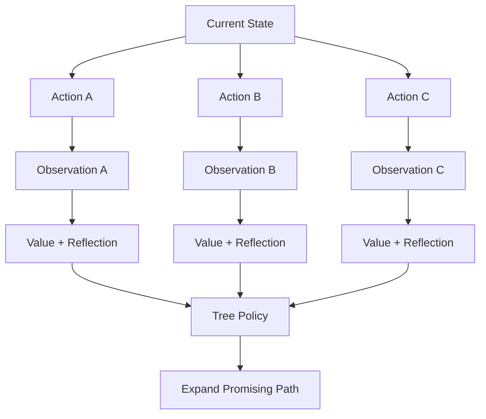

### 12.24.1 Main Benefits

- Explore multiple action paths;
- Evaluate paths using environmental feedback;
- Extract reflections from failed trajectories;
- Use evaluations to guide subsequent search.

### 12.24.2 Costs

Cost depends on:

- Branching factor;
- Search depth;
- Number of rollouts;
- Value evaluation;
- Reflection calls;
- Tool execution.

It can be much higher than linear ReAct or simple reflection; no fixed multiplier captures the difference.

Comparing branches implicitly requires an environment that can be reset, cloned, or safely simulated. Backtracking from node B to node A does not undo a real external write. For irreversible operations, evaluate candidates in an isolated environment first, then execute the approved proposal once. Real payments or email sends must not be used as rollouts.

### 12.24.3 Engineering Role

LATS is an important research architecture whose ideas can inform:

- Candidate-solution search;
- Code repair;
- Simulatable environments;
- High-value decision support.

If a request's latency budget cannot accommodate multibranch execution, first compare bounded beam search, best-of-N, verifiers, and local retries. Whether full MCTS plus reflection is necessary should be decided through equal-budget comparisons, not by the architecture's name.

## 12.25 Reflection and Planning

Reflection can target different objects:

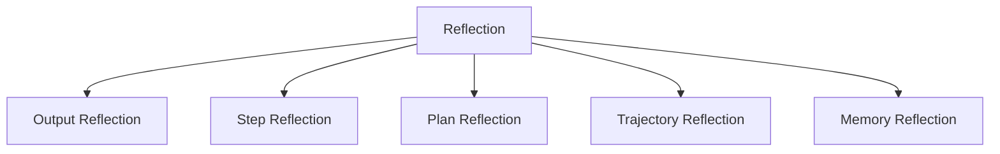

- Output reflection: is the result correct?
- Step reflection: is the current step valid?
- Plan reflection: does the plan still apply?
- Trajectory reflection: does the full execution path make sense?
- Memory reflection: which lessons are worth retaining?

In Plan-and-Execute, reflection may trigger a replanner rather than merely rewrite the current answer.

## 12.26 Reflection and Agentic Workflows

Production systems usually confine reflection to workflow nodes:

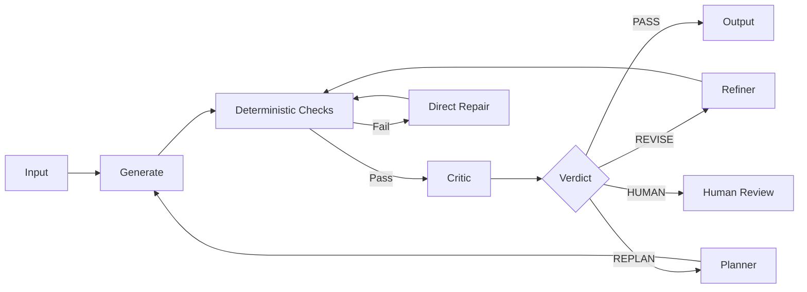

Both repair and replanning in the diagram are constrained by the same stop controller. Required checks must run again after revision and cannot be skipped because a critic returns PASS. Actions such as sending, deploying, and paying need separate pre-execution authorization gates; they cannot rely solely on this quality loop after the fact.

The workflow controls:

- Maximum rounds;
- Allowed verdicts;
- Permissions;
- Budgets;
- Human approval;
- Final stopping.

The LLM handles:

- Finding problems that are difficult to formalize;
- Generating specific feedback;
- Making targeted revisions.

## 12.27 A Coding Agent Example

Goal:

> Fix a function that crashes on empty input.

First reproduce the `IndexError` with an empty list, then inspect where it fails. If the exception comes from directly accessing the first element, the next step is still not to immediately decide that “empty input should return 0.” Check the function's contract first: should it return an empty result, raise a specified exception, or use a default value? Reflection proposes a root cause and a repair hypothesis; tests check whether that hypothesis satisfies the requirements.

```mermaid
flowchart TB
    G[Generate Patch] --> T[Run Tests]
    T --> D{Tests Pass?}
    D -->|Yes| R[Code Review]
    D -->|No| F[Extract Failure]
    F --> REF[Reflect on Root Cause]
    REF --> G
    R --> Q{Review Pass?}
    Q -->|Yes| DONE[Finish]
    Q -->|No| G
```

Key points:

- Tests are the verifier;
- A failing test provides new evidence;
- Reflection summarizes the root cause;
- The refiner modifies the patch;
- The runtime controls the maximum number of attempts;
- Even after tests pass, review is needed to examine uncovered risks.

## 12.28 A Research Report Example

### 12.28.1 Step-level

- Are search results relevant?
- Are sources credible?
- Do key numbers come from the original source?

### 12.28.2 Milestone-level

- Does coverage of each competitor include the same dimensions?
- Is any information missing?
- Is the artifact schema complete?

### 12.28.3 Task-level

- Are conclusions consistent throughout?
- Do citations support the claims?
- Are facts, inferences, and recommendations distinguished?
- Is the report's structure complete?

### 12.28.4 Cross-task

- Which sources remain reliable over time?
- Which retrieval strategies frequently fail?
- Which checking rules should be added to a skill?

## 12.29 A Data Structure for Reflection Memory

The example diagnoses a missing empty-list check before accessing the first element and recommends adding an empty-input branch and tests. Verification still needs to reproduce the failure and confirm that the patched target tests and relevant regression tests pass:

```json
{
  "reflection_id": "ref-42",
  "task_id": "task-101",
  "scope": "step",
  "trigger": "test_failure",
  "evidence": {
    "test": "test_empty_input",
    "error": "IndexError"
  },
  "diagnosis": "函数在访问首元素前没有检查空列表",
  "recommended_action": "增加空输入分支并补充测试",
  "verified": false,
  "verification_needed": ["复现失败", "确认修补后的目标测试与相关回归测试通过"],
  "applicability": "functions that access the first list element",
  "retention": "task-local"
}
```

An error message establishes only that a particular execution failed; it does not establish that the diagnosis or proposed repair is correct. The example therefore keeps `verified: false`. After verification, record the candidate version, test version, and results, and let a trusted process set the verification status. The model generating the reflection must not simply declare it verified.

Key fields:

- Scope;
- Trigger;
- Evidence;
- Diagnosis;
- Action;
- Verification;
- Applicability;
- Retention.

## 12.30 Preventing Endless Reflection Loops

```mermaid
flowchart TB
    R[Reflection Round] --> V[Verify]
    V --> P{Pass?}
    P -->|Yes| DONE[Finish]
    P -->|No| B{Budget Remaining?}
    B -->|No| STOP[Stop and Report]
    B -->|Yes| I{Finding Changed?}
    I -->|No| ESC[Escalate / Human]
    I -->|Yes| FIX[Refine]
    FIX --> R
```

Hard controls include:

- Maximum rounds;
- Maximum tokens and cost;
- Timeouts;
- Finding deduplication;
- Detection of no improvement;
- A limit on repetitions of the same error;
- Human escalation;
- Unrecoverable states.

On stopping, report clearly:

- Problems resolved;
- Unresolved findings;
- The reason for stopping;
- The current artifact;
- Recommended next steps.

## 12.31 How to Evaluate a Reflection System

| Metric | Meaning |
|---|---|
| First-pass Success | Success rate without reflection |
| Post-reflection Success | Success rate after reflection |
| Finding Precision | Proportion of critic findings that are genuine problems |
| Finding Recall | Proportion of known problems detected |
| Fix Success | Whether feedback leads to a correct repair |
| Regression Rate | Whether revisions damage correct content |
| Average Rounds | Average number of reflection rounds |
| Cost per Success | Total cost per successful task |
| Time to Detect | Time taken to detect an error |
| Escalation Rate | Proportion requiring human handling |

Evaluation should focus on whether reflection improves final task success and reduces risk at an acceptable cost, rather than merely counting how many comments a critic produces.

In particular, measure both “incorrect to correct” and “correct to incorrect” changes. Measuring repair rates only on known-bad examples hides the risk that a critic misclassifies and damages a correct result. A real system has no oracle telling it which answers need revision.

## 12.32 A/B Evaluation

Choose controls based on the hypothesis being tested; there is no need to run every combination at once:

1. No reflection;
2. Self-reflection;
3. A deterministic verifier;
4. A critic agent;
5. Verifier + critic;
6. Step-level;
7. Milestone-level;
8. Task-level.

Observe:

- Quality improvement;
- Latency;
- Tokens;
- Tool cost;
- False positives;
- Regressions;
- User satisfaction.

If a critic increases cost without producing consistent improvements, it should not be retained.

Add resampling or test-only repair controls with equal token, tool-call, or latency budgets to distinguish gains from reflection content from gains due to more attempts. Use development tests within the revision loop and an independent held-out set for final scoring. Do not leak hidden-test answers or detailed feedback from the final judge to the refiner.

## 12.33 Common Antipatterns

### 12.33.1 Asking Only “Please Check for Problems”

Without a rubric, feedback easily becomes superficial.

### 12.33.2 The Critic Can Return Only Problems

Without a PASS exit, it can keep finding fault indefinitely.

### 12.33.3 The Refiner Cannot See the Original Task

Revising only from annotations may drift away from the user's goal.

### 12.33.4 The Same Model Rewrites Repeatedly

Without effective checking criteria or new evidence, this may produce only textual changes. “It has been revised” is not a substitute for quality evaluation.

### 12.33.5 Calling a Large Critic Model at Every Step

This makes low-risk steps unnecessarily expensive.

### 12.33.6 Treating a Critic Agent as Objective Truth

A separate role can still share the model's biases.

### 12.33.7 Automatically Writing Reflections to Long-term Memory

Incorrect lessons can poison memory.

### 12.33.8 No Maximum Round Count

This allows endless revision.

### 12.33.9 Using Debate Instead of Fact Retrieval

Discussion among multiple agents cannot replace authoritative data.

## 12.34 A Recommended Production Architecture

```mermaid
flowchart TB
    TASK[Task] --> BUDGET{Budget remains and continuation allowed?}
    BUDGET -->|Yes| GATE{Permissions and approval pass before execution?}
    BUDGET -->|No| PARTIAL[Report Incomplete]
    GATE -->|Yes| EXEC[Executor]
    GATE -->|No| HUMAN[Human Review / Denial]
    HUMAN -->|Authorization obtained again| GATE
    EXEC --> ART[Artifact + Trace]

    ART --> DV[Deterministic Verifiers]
    DV --> HARD{Required checks pass?}
    HARD -->|No| FAILURE[Record hard failure and generate repair feedback]
    HARD -->|Yes| NEED{Subjective quality evaluation needed?}
    NEED -->|No| DONE[Finish]
    NEED -->|Yes| CRITIC[Critic]

    CRITIC --> VERDICT{Verdict}
    VERDICT -->|PASS| DONE
    VERDICT -->|REVISE| REFINE[Refiner]
    VERDICT -->|REPLAN| PLAN[Replanner]
    VERDICT -->|BLOCKED| HUMAN
    FAILURE --> REFINE

    REFINE --> BUDGET
    PLAN --> BUDGET

    DONE --> CONS{Lesson worth retaining?}
    CONS -->|No| END[End]
    CONS -->|Yes| VALIDATE[Validate Reflection]
    VALIDATE -->|Pass| MEMORY[Memory / Skill Candidate]
    VALIDATE -->|Unverified| END
```

There is no shortcut from a hard failure to a critic's PASS in this diagram. The entry point shows the overall gate, but the runtime must also check remaining budget before every model or tool call, including calls to the critic, refiner, and replanner. Every change must be bound to a new candidate version and pass acceptance checks again. The executor here consumes the current candidate or plan; it should not unconditionally discard the refiner's changes and generate from scratch.

Recommended principles:

1. Use deterministic verifiers first;
2. Invoke critics only for necessary dimensions;
3. Use structured findings;
4. Separate evaluation from refinement;
5. Verify high-risk steps and strongly dependent steps early;
6. Apply task-level review to the overall output;
7. Enforce hard limits on rounds, budgets, and time;
8. Allow only validated lessons into long-term memory.

## 12.35 Chapter Summary

Agent reflection is a feedback-driven quality-control loop:

> **Execute → Verify → Provide feedback → Revise or replan → Verify again**

Trigger granularities include:

- Step-level: stop errors from propagating as early as possible;
- Milestone-level: balance cost and correction speed;
- Task-level: check overall consistency;
- Cross-task: extract reusable lessons.

Several implementation details matter:

- The critic has an explicit rubric;
- It returns structured findings;
- PASS is an allowed outcome;
- The refiner retains the original task and correct content;
- Objective verifiers take priority;
- Stopping conditions are enforced as hard limits;
- Unverified reflections are not written directly into long-term memory.

Self-Refine, Reflexion, critic agents, debate, and LATS provide feedback mechanisms of different depths. They can be useful, but all add cost, and none replaces real environments, tests, authoritative data, or human accountability.

## References

- [Self-Refine: Iterative Refinement with Self-Feedback](https://arxiv.org/abs/2303.17651)
- [Reflexion: Language Agents with Verbal Reinforcement Learning (v4)](https://arxiv.org/abs/2303.11366v4)
- [Language Agent Tree Search Unifies Reasoning, Acting, and Planning (v3)](https://arxiv.org/abs/2310.04406v3)
- [Improving Factuality and Reasoning in Language Models through Multiagent Debate](https://arxiv.org/abs/2305.14325)
- [Anthropic: Building Effective Agents](https://www.anthropic.com/engineering/building-effective-agents)
- [Large Language Models Cannot Self-Correct Reasoning Yet](https://arxiv.org/abs/2310.01798)
- [Training Language Models to Self-Correct via Reinforcement Learning (SCoRe, v1)](https://arxiv.org/abs/2409.12917v1)
