# 第十二章：Agent 的反思、验证与自我改进

## 12.1 什么是 Agent Reflection

Agent Reflection 更接近一套反馈驱动的控制机制，而不是抽象的“自省”：

> **生成或执行 → 评价 → 定位问题 → 定向修订 → 再验证**

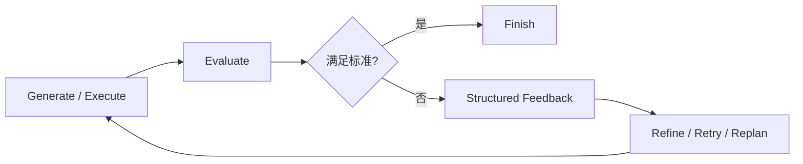

反思需要足够有用的纠错信号，但不一定每轮都有新外部证据：重新对照明确标准也可能发现遗漏。反馈可以来自：

- Tool Result；
- 编译器；
- 单元测试；
- Schema；
- 规则；
- 模拟器；
- 权威数据；
- 人工审核；
- Critic Model；
- LLM-as-a-Judge。

如果没有新的证据或评价标准，让同一个模型重复生成可能只会得到另一个同样不可靠的答案。

这里的 Reflection 是控制机制的统称，不是一种统一算法。Self-Refine 修改当前候选，Reflexion 在尝试之间保留语言反馈；专门训练自纠错能力的方法则在训练阶段更新参数。已经训练好的自纠错模型在回答当前问题时，通常仍不更新权重，不能把这几种机制都叫作“边运行边学习”。

## 12.2 为什么需要反思

### 12.2.1 发现生成阶段遗漏的问题

模型生成内容时主要关注“完成任务”，不一定同时覆盖：

- 事实正确性；
- 约束完整性；
- 引用一致性；
- 安全要求；
- 输出格式；
- 边界条件。

单独评价阶段可以把注意力集中到这些维度。

### 12.2.2 阻止错误继续传播

在强依赖任务中，早期错误可能成为后续步骤的输入：


如果在关键节点验证：

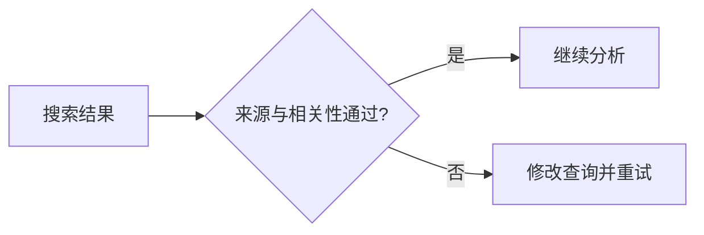

就有机会在错误进入后续分析前拦住它；前提是验证器确实检查了来源和相关性，而不只是检查搜索接口是否返回成功。

### 12.2.3 改善一次难以完成的高质量输出

适合：

- 代码生成；
- 研究报告；
- 翻译；
- 法律或商业文本；
- 复杂数据分析；
- 有明确评分标准的内容生成。

### 12.2.4 将失败转化为可复用经验

经过验证的失败原因可以：

- 改善当前重试；
- 更新当前任务计划；
- 形成 Episode；
- 晋升为长期记忆；
- 转化为 Skill、规则或测试。

未经验证的反思不应直接成为长期规则。

## 12.3 Reflection 与 Verification 的区别

| Reflection | Verification |
|---|---|
| 解释哪里可能有问题及如何改 | 判断是否满足明确标准 |
| 通常由模型生成反馈 | 可以由程序、规则、环境或人执行 |
| 可能具有主观性 | 只在检查标准及其覆盖范围内提供结论 |
| 用于指导修订 | 用于接受、拒绝或阻止 |

更稳妥的做法是让 Verification 判断问题是否成立，再由 Reflection 把这些问题转成可执行的修订动作。

例如：

- 单元测试指出函数在空输入时失败；
- Critic 将失败归纳为“缺少空输入分支”；
- Refiner 修改代码；
- 测试再次验证。

## 12.4 Verifier 的优先级

先问“这条要求能用什么证据判定”，再决定由谁检查，而不是给所有验证器排一个固定名次：

| 要判定的要求 | 优先采用的证据 | 仍需补充的检查 |
|---|---|---|
| 工具是否完成写入 | 目标系统的业务状态与操作回执 | 对象、版本、重复副作用 |
| 代码是否满足已知行为 | 编译器、测试、约束求解器 | 未覆盖需求与回归风险 |
| 格式是否符合契约 | Schema 与确定性规则 | 字段内容是否真实、合法 |
| 事实是否有依据 | 可追溯的权威数据源 | 时效、适用范围与来源冲突 |
| 表述是否清晰、方案是否适用 | 领域人工审核或经校准的模型评价 | 评分一致性与证据覆盖 |

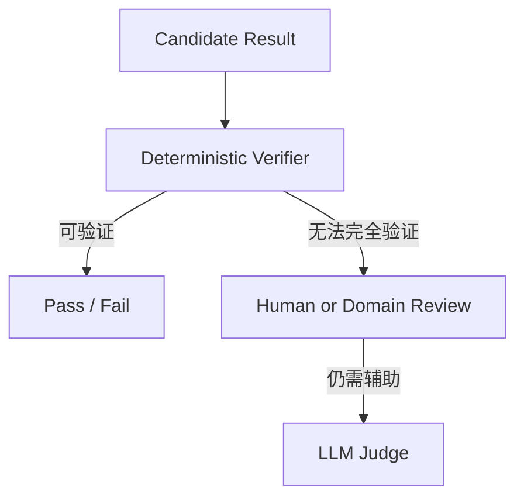

语言模型评价适合处理难以完全形式化的质量维度，但不应替代可用的客观验证。

HTTP 200 可能只代表受理，真实系统也可能返回过期状态；编译通过不保证业务正确，生成测试也可能写错预期值。选择验证器时要说明它验证了什么、漏掉什么，以及失败时能否阻止交付。对不可逆动作，审批必须在执行前，事后反思不能补回缺失的授权。

## 12.5 反思的四种触发粒度

除了步骤级和任务级，还可以加入里程碑级与跨任务 Consolidation。

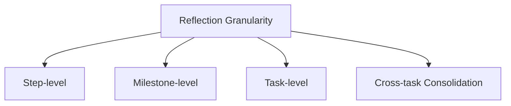

## 12.6 Step-level Reflection

Step-level Reflection 在 Tool Call、推理步骤或状态转移后检查结果。

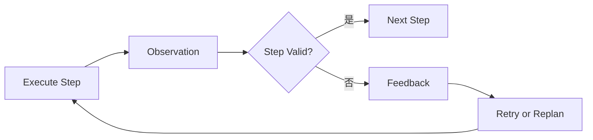

### 12.6.1 适用场景

- 步骤之间强依赖；
- 早期错误会影响大量后续工作；
- Tool 结果容易验证；
- 操作具有高风险或副作用；
- 局部重试成本较低。

例如：

- 搜索结果是否与问题相关；
- API 是否返回成功状态；
- 代码是否通过编译；
- 数据是否满足 Schema；
- 高风险操作执行前，审批是否有效并绑定当前参数。

### 12.6.2 优势

- 错误发现早；
- 失败影响范围小；
- 可以局部重试；
- 状态更容易保持正确；
- 适合强依赖任务。

### 12.6.3 代价

- 增加验证延迟；
- 增加模型或 Tool 调用；
- 可能过度检查低风险步骤；
- Critic 可能不断提出非关键修改；
- 任务吞吐下降。

### 12.6.4 不一定每步增加一次 LLM 调用

“十步任务加步骤级反思就需要二十次 LLM 调用”不是必然规律。

步骤验证可以由：

- Tool 自身状态码；
- Schema Validator；
- 单元测试；
- 规则引擎；
- 当前 Agent 的下一轮决策；
- 批量 Critic；
- 只在异常时触发的模型评价。

只有在每个步骤都单独调用 LLM Critic 时，调用次数才可能接近翻倍。

## 12.7 Milestone-level Reflection

Milestone-level Reflection 在一个阶段完成后评价，而不是检查每个微步骤。

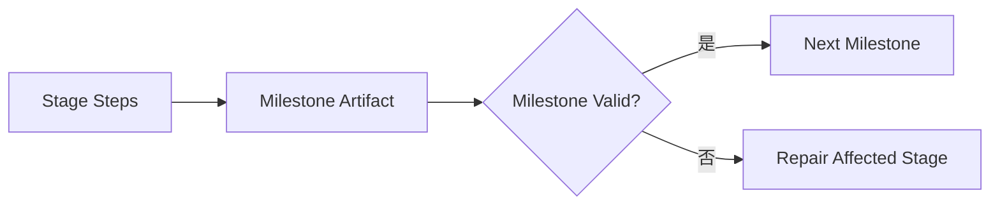

这种做法减少了检查次数，但不保证总成本一定更低：阶段末才发现错误时，可能要重做更多步骤。它通常比只看最终结果更容易尽早发现偏差，前提是阶段有清晰产物，可以整体验收和修复。

适合：

- 一个阶段内部步骤较多；
- 阶段能产生独立 Artifact；
- 每步验证过于昂贵；
- 阶段之间依赖明显。

例如：

- 资料收集完成后统一检查来源覆盖；
- 功能实现完成后运行整组测试；
- 报告提纲完成后检查结构。

## 12.8 Task-level Reflection

Task-level Reflection 在完整任务结束后进行整体评价。

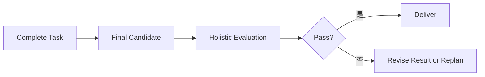

### 12.8.1 适用场景

- 步骤相对独立；
- 单步错误影响有限；
- 更关注整体一致性；
- 最终结果容易统一评价；
- 中间验证成本较高。

例如：

- 报告结构和结论是否一致；
- 文案风格是否统一；
- 多章节是否重复或矛盾；
- 最终方案是否满足全部要求。

### 12.8.2 优势

- 额外调用较少；
- 能观察全局一致性；
- 适合发现跨部分问题；
- 实现简单。

### 12.8.3 代价

- 错误发现晚；
- 可能浪费前期执行成本；
- 很难只修复一个局部；
- 根因可能被最终输出掩盖。

## 12.9 Cross-task Consolidation

跨任务反思更像一次复盘，重点是总结：

- 哪种策略有效；
- 哪种错误反复出现；
- 哪些规则值得长期保留；
- 哪些 Tool 或 Prompt 需要改进。

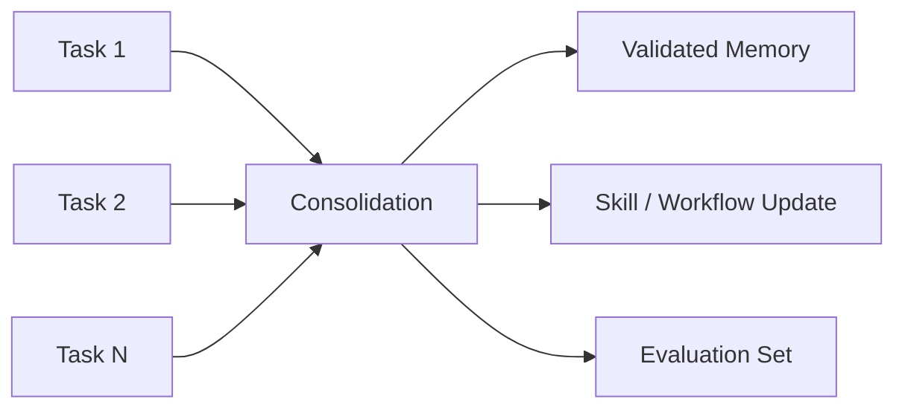

跨任务经验必须经过验证、去重和适用范围检查，不能把模型的一次自我评价自动提升为永久规则。

## 12.10 如何选择反思粒度

| 任务特征 | 推荐粒度 |
|---|---|
| 强依赖、错误会层层传播 | Step-level |
| 阶段有独立输出 | Milestone-level |
| 各步骤相对独立，关注整体质量 | Task-level |
| 需要积累重复任务经验 | Cross-task Consolidation |
| 高风险动作 | Step-level + Human Gate |
| 成本敏感 | Triggered Milestone / Task-level |

生产系统通常混合使用：

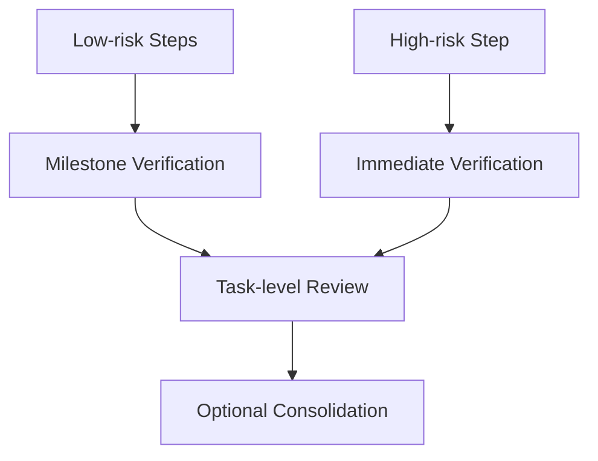

## 12.11 Adaptive Reflection

不必在每一步都反思。可以根据风险和异常动态触发。

触发信号包括：

- Tool 返回错误；
- 输出不符合 Schema；
- 经校准的置信信号较低，或缺少必需证据；
- 多个来源冲突；
- 重复调用同一 Tool；
- 计划偏离目标；
- 即将执行高风险动作；
- 阶段耗时或成本异常；
- Verifier 分数低。

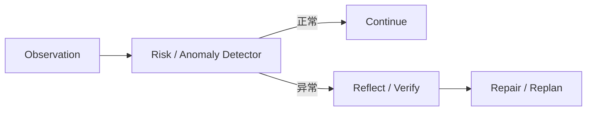

相比固定“每一步一次 Critic”，自适应触发通常更容易把成本控制住。

## 12.12 反思系统的基本组件

一个完整实现通常包含：

1. Generator / Executor；
2. Verifier / Critic；
3. Feedback Formatter；
4. Refiner；
5. Stop Controller；
6. Optional Memory Writer。

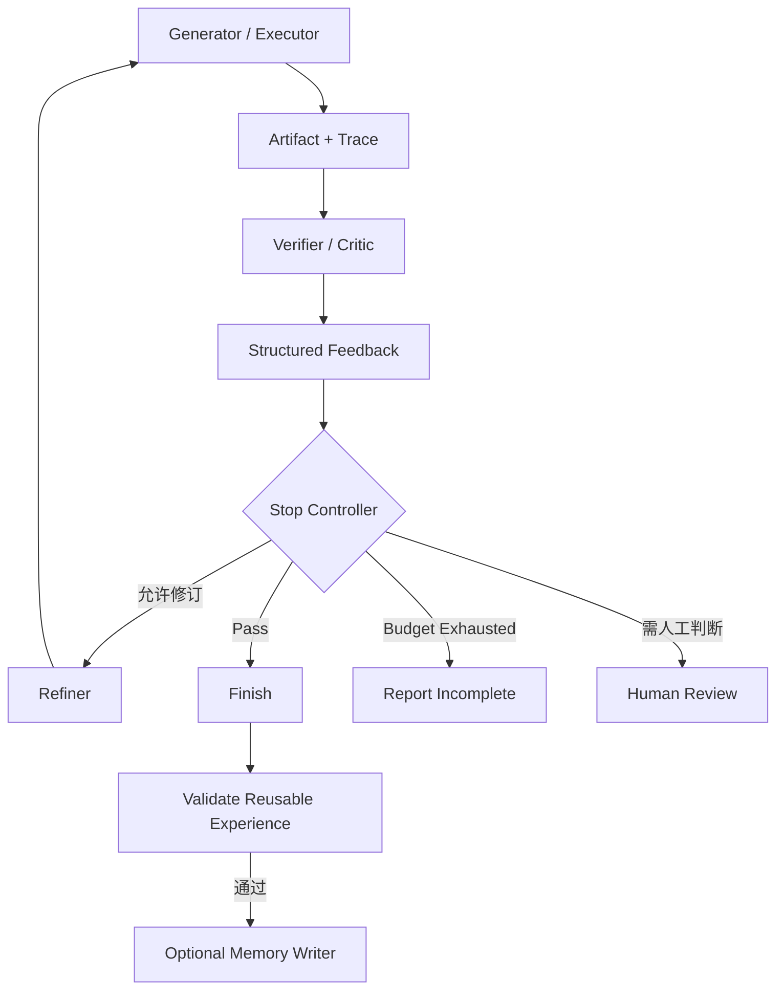

Stop Controller 先判断是否允许继续，再调用 Refiner，避免停止信号发出后仍触发修订。原始反馈可以留作任务内诊断记录；写入长期记忆的是经过验证、带适用范围的经验，不是所有 Critic 意见。

## 12.13 区分 Evaluate 与 Refine 的职责

反思至少需要两个逻辑阶段：

### 12.13.1 Evaluate

只负责：

- 对照标准检查；
- 找出具体问题；
- 提供证据；
- 判断严重程度；
- 给出可操作建议。

### 12.13.2 Refine

负责：

- 读取原始任务；
- 读取原始输出；
- 读取结构化反馈；
- 定向修改；
- 保留正确内容；
- 返回可再次验证的结果。

这两个角色可以由：

- 两个不同 Prompt；
- 两次模型调用；
- 不同模型；
- LLM + 确定性验证器；
- 同一 Agent 的不同 Workflow 节点；

实现。

重点是职责和输入输出边界，而不是必须恰好存在两个 Prompt 文件。

## 12.14 Critic Prompt 应包含什么

### 12.14.1 原始任务与成功标准

Critic 必须知道什么才算完成。把成功条件拆成可检查的评价标准（Rubric），并说明哪些是不可被其他优点抵消的硬性要求。

### 12.14.2 具体检查维度

例如：

- Correctness；
- Completeness；
- Evidence；
- Consistency；
- Safety；
- Format；
- Efficiency。

### 12.14.3 可验证证据

要求每个 Finding 引用：

- 输出片段；
- Tool Result；
- 测试；
- 来源；
- 明确规则。

### 12.14.4 PASS 出口

如果结果已经满足要求，Critic 必须能够返回 PASS。否则它会为了完成“找问题”的指令不断制造低价值意见。

### 12.14.5 结构化输出

```json
{
  "verdict": "REVISE",
  "score": 0.78,
  "findings": [
    {
      "criterion": "evidence",
      "severity": "high",
      "location": "section-3",
      "problem": "关键市场份额结论没有来源",
      "evidence": "报告第 3 节第 2 段",
      "suggestion": "补充权威来源，或删除该具体数字"
    }
  ],
  "next_action": "revise"
}
```

`score` 是教学占位值，不是校准后的正确概率；应定义评分尺度、Rubric 版本及证据范围。`PASS` 也只表示该 Critic 在职责范围内未发现问题，不能覆盖确定性测试失败、安全拒绝或审批缺失。

允许的 Verdict 可以是：

- `PASS`；
- `REVISE`；
- `REPLAN`；
- `BLOCKED`；
- `NEEDS_HUMAN_REVIEW`。

## 12.15 Refiner Prompt 应包含什么

Refiner 需要：

- 原始任务；
- 当前候选；
- Critic Findings；
- 不可改变的约束；
- 允许修改的范围；
- 输出 Schema。

推荐要求：

1. 只处理有效 Finding；
2. 保留已经正确的部分；
3. 不引入无来源新事实；
4. 返回修改后的完整 Artifact 或明确 Patch；
5. 说明哪些 Finding 无法解决。

不要只说“请根据意见优化一下”，否则修改方向不稳定。

## 12.16 Stop Controller

不能依赖模型自己无限反思直到满意。

停止条件包括：

- 所有必需的硬性验收通过，且所需质量检查通过；
- 达到软质量阈值且没有未解决的硬性失败；
- 达到最大轮数；
- Token 或费用预算耗尽；
- 超时；
- 连续多轮没有显著改善；
- 相同 Finding 重复出现；
- 需要人工判断；
- 用户取消。

设第 `r` 轮评分为 `sᵣ`，改进量为：

$$
\Delta_r=s_r-s_{r-1}
$$

如果连续若干轮满足：

$$
\Delta_r\le\epsilon
$$

可以触发“没有可测改善”的停止策略，不必继续消耗预算。

前提是各轮使用可比较的评分尺度，并按 Judge 的随机波动设置容差；单次小分差不足以证明真实质量没有变化。应保存候选与验证记录，不能简单交付“最后一版”：修订可能让原本正确的部分回归。阈值未达标或存在硬性失败时，停止表示未完成或转人工，而不是成功。

### 12.16.1 如何确定最大轮数

没有适用于所有任务的默认最优轮数。可以选择少量轮次作为实验起点，但不能把“一到三轮”当作已有普遍收益的结论。

轮数应根据：

- 单轮成本；
- 任务风险；
- Verifier 可靠性；
- 每轮平均提升；
- 用户延迟目标；
- 是否存在确定性成功条件；

通过评估确定。

高风险操作可能只允许一次修订后转人工；可自动测试的代码修复则可能允许更多受限迭代。

## 12.17 反思成本

若每轮包含 Evaluate、Refine 和 Verify，总成本可表示为：

$$
C_{reflection}=
\sum_{r=1}^{R}
\left(
C_{eval,r}
+C_{refine,r}
+C_{verify,r}
\right)
$$

这里把定位问题的 Evaluate、修改候选的 Refine、修订后的 Verify 分开计费；如果一次检查同时承担两个职责，不应重复计算。每阶段还应计入它消耗的：

- Tool 执行；
- 测试；
- Context；
- Critic Agent 通信；
- Artifact 存储；
- 人工审核。

降低成本的方法：

- 只在异常或高风险时触发；
- 使用确定性验证器；
- 用小模型初筛；
- 批量检查多个步骤；
- 在 Milestone 而非每个微步骤反思；
- 达到阈值立即停止；
- 只修复受影响部分。

## 12.18 Self-Reflection

Self-Reflection 使用同一模型或同一 Agent 评价自己的结果。

### 12.18.1 优势

- 实现简单；
- 无需额外 Agent；
- Context 传递成本低；
- 适合低风险初步检查。

### 12.18.2 局限

- Generator 与 Critic 共享模型偏差；
- 容易重复原来的假设；
- 可能偏好自己的表达；
- 缺少真正的新证据；
- 可能产生表面修改。

Self-Reflection 可以作为初筛，但不能当成客观验证。

实验结论要带上范围：[Huang 等人的研究](https://arxiv.org/abs/2310.01798)发现，当时所测模型在没有外部反馈的推理纠错中经常无收益甚至退化；这不是“模型永远无法自纠错”的定理。[SCoRe](https://arxiv.org/abs/2409.12917)随后用多轮在线 RL 专门训练自纠错，测试时不要求外部纠错反馈。这与只给冻结模型加一句“检查一下”不同：训练阶段确实使用奖励并更新了参数。

## 12.19 Critic Agent

Critic Agent 专门检查 Executor 的 Artifact 或轨迹。

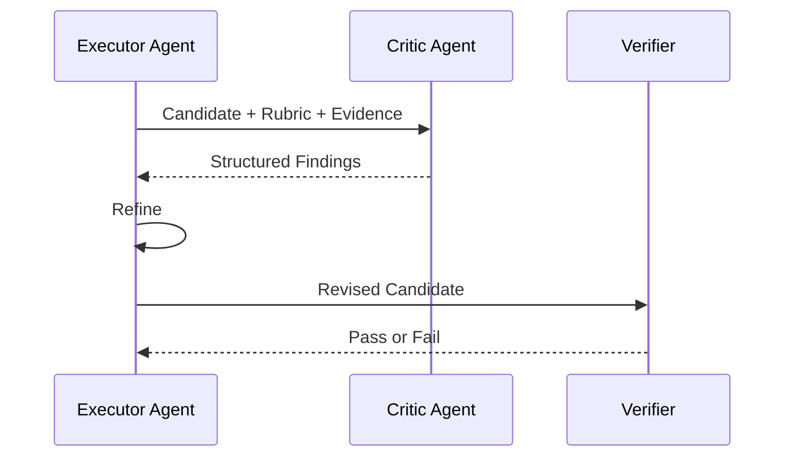

### 12.19.1 为什么可能更好

- Critic 使用独立 Prompt；
- Critic 不承担生成任务；
- 可以隐藏 Generator 的解释，减少 Anchoring；
- 可以使用不同模型和 Tools；
- 可以只关注某个质量维度；
- 可以访问独立验证数据。

### 12.19.2 为什么不一定更客观

如果 Critic：

- 使用相同模型；
- 看到相同上下文；
- 使用模糊 Rubric；
- 没有外部证据；
- 只被要求“找问题”；

它仍可能与 Generator 共享错误，或为了批评而批评。

> **拆成独立 Critic Agent，不会自动带来独立证据，也不会自动消除共享误差。**

提高独立性的方式：

- 使用不同模型或模型版本；
- 使用不同数据源；
- Blind Review；
- 明确 Rubric；
- 提供测试和事实来源；
- 对 Critic 本身做评估。

## 12.20 Multi-Critic

可以让多个 Critic 分别检查：

- 事实；
- 安全；
- 逻辑；
- 格式；
- 领域合规。

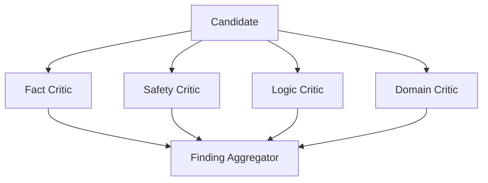

优势：

- 每个 Critic 更聚焦；
- 可以并行；
- 权限和数据隔离更清晰。

代价：

- 成本增加；
- Findings 可能冲突；
- 需要聚合和优先级；
- 多个相同模型仍可能共享偏差。

## 12.21 Debate

Debate 让多个 Agent 对候选方案进行对抗式讨论。

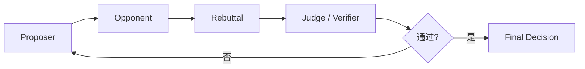

适合：

- 存在多个合理观点；
- 需要暴露假设；
- 需要风险分析；
- 结论无法完全用确定性规则验证。

### 12.21.1 Debate 的风险

- 更善辩不等于更正确；
- Judge 可能偏好表达方式；
- Agent 可能共享相同知识盲区；
- 讨论可能循环；
- Token 和延迟成本高；
- 对事实问题不应以投票替代数据。

关键商业或法律决策仍需要权威事实、领域专家和明确责任人。

## 12.22 Self-Refine

Self-Refine 的基本流程是：

> **Generate → Feedback → Refine**

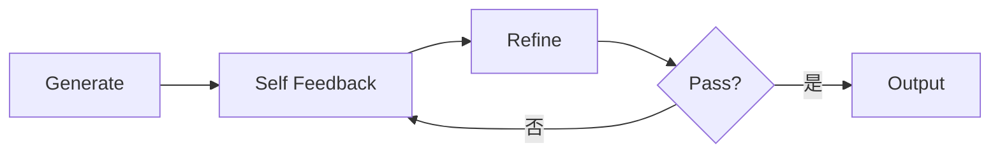

Self-Refine 原方法使用同一 LLM 生成、反馈、修订，不要求额外训练或 RL，主要优化当前候选而非模型权重。原论文在七类任务上报告收益，但任务使用的评价标准、模型与停止方式不同，不能把其平均增益当作任意业务的普遍提升。

它的自反馈可以发现风格、格式或显式约束问题，不保证补充缺失事实。没有外部反馈时也可能改善输出，但事实和逻辑纠错是否有效仍需独立测试。

适合：

- 文本质量优化；
- 格式修正；
- 有 Rubric 的生成任务；
- 低风险迭代。

## 12.23 Reflexion

Reflexion 将任务反馈转化为自然语言反思，并保存在 Episodic Memory 中，供后续尝试使用。原论文允许标量或文本、外部或内部模拟的反馈；“Verbal Reinforcement Learning”指以语言记忆影响后续策略，不是通过梯度更新 Actor 权重。

经典组件包括：

- Actor；
- Evaluator；
- Self-Reflection；
- Episodic Memory。

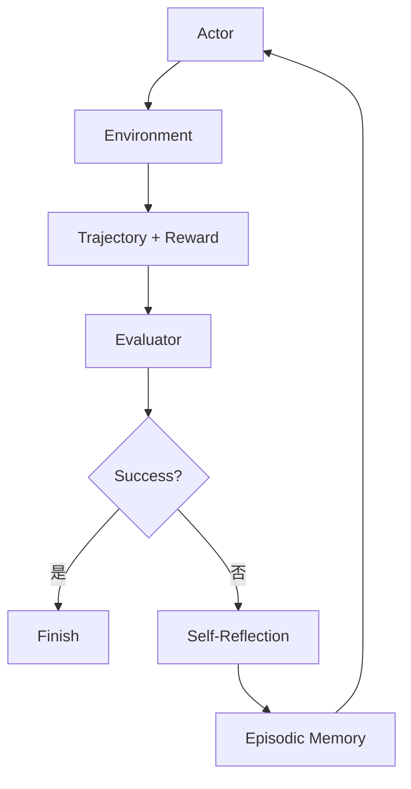

### 12.23.1 原始 Reflexion 的记忆范围

原始方法重点是在同一任务的多次 Trial 之间保留 verbal reflection，从而让下一次尝试避免重复错误。

试次可以重新初始化环境，而保留有界反思记忆。它不同于在同一答案上继续润色，也不同于自动获得跨任务长期技能。论文 HumanEval 的最终单候选 `pass@1` 包含生成测试与多次修订，不能理解为一次模型调用成功率；该论文 MBPP Python 上也出现退化，详见[第四章 §4.6.2：HumanEval 结果应如何解读](04-agent-design-patterns.zh.md)。

它不要求：

- 必须使用 Vector DB；
- 必须进行跨任务语义检索；
- 自动把所有经验永久保存。

生产系统可以扩展为跨任务记忆，但需要：

- 经验验证；
- 适用范围；
- 去重；
- 来源；
- 相似任务检索；
- 过期和删除策略。

### 12.23.2 从 Reflection 晋升为 Skill

如果一条经验：

- 多次验证有效；
- 具有跨任务价值；
- 适用范围明确；
- 不包含敏感信息；

可以晋升为：

- Skill；
- Workflow；
- Rule；
- Test；
- Runbook。

## 12.24 LATS

LATS（Language Agent Tree Search）将：

- Tree Search；
- Action；
- Environment Feedback；
- Value Evaluation；
- Reflection；

结合在同一个基于蒙特卡洛树搜索（MCTS）的过程中。Selection 在继续探索访问较少的分支与利用已有高价值分支之间取舍，Expansion 生成动作，模拟轨迹（rollout）或环境执行得到反馈，价值估计与回报再回传到树节点；这不是神经网络梯度回传，原方法不靠在线微调更新 LLM 参数。

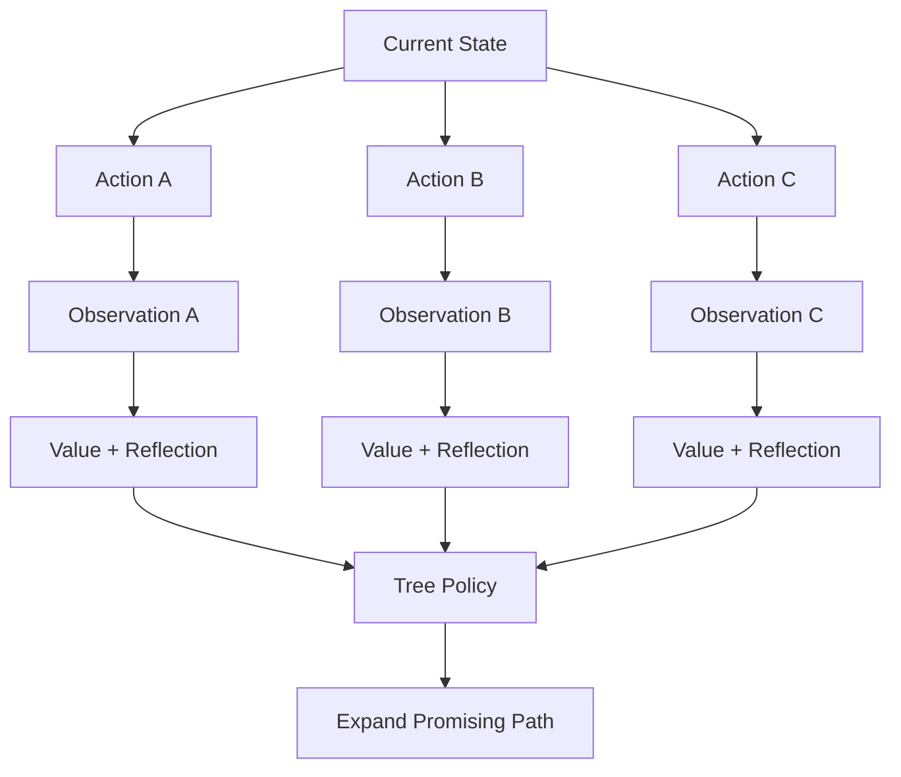

### 12.24.1 核心价值

- 同时探索多个行动路径；
- 使用环境反馈评价路径；
- 从失败轨迹中提取反思；
- 将评价用于后续搜索。

### 12.24.2 成本

成本取决于：

- 分支数；
- 搜索深度；
- Rollout 数；
- Value Evaluation；
- Reflection 调用；
- Tool 执行。

它可能远高于线性 ReAct 或简单 Reflection，不能用固定倍数概括。

多分支比较隐含环境可重置、克隆或安全模拟的条件；从节点 B 回溯到节点 A 不会撤销真实外部写入。对不可逆操作，应先在隔离环境评价候选，再对获准方案执行一次，不能把真实支付或发信当成 rollout。

### 12.24.3 工程定位

LATS 是重要的研究型架构，其思想可以用于：

- 候选方案搜索；
- 代码修复；
- 可模拟环境；
- 高价值决策辅助。

若单轮请求的延迟预算无法承担多分支执行，可以先比较受限 Beam Search、Best-of-N、Verifier 和局部重试。是否需要完整 MCTS + Reflection，应由同预算对照决定，而不是由架构名称决定。

## 12.25 反思与规划的关系

Reflection 可以作用于不同对象：

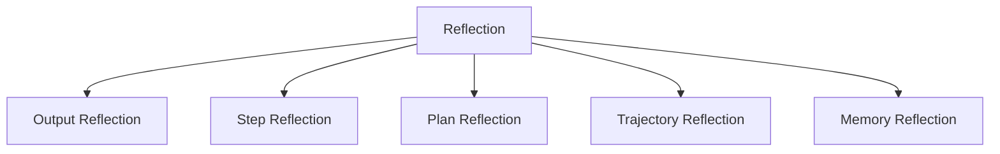

- Output Reflection：结果是否正确；
- Step Reflection：当前步骤是否有效；
- Plan Reflection：计划是否仍适用；
- Trajectory Reflection：整条执行路径是否合理；
- Memory Reflection：哪些经验值得保留。

Plan-and-Execute 中，反思结果可能触发 Replanner，而不仅是重写当前答案。

## 12.26 反思与 Agentic Workflow

生产系统通常将反思限制在 Workflow 节点中：

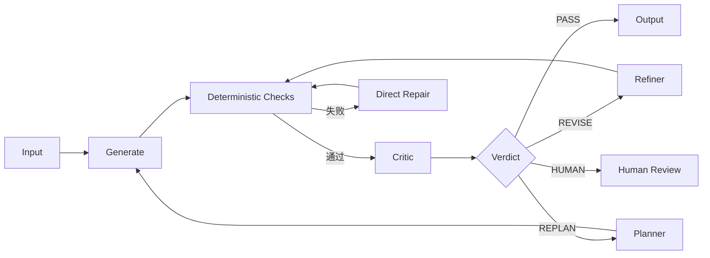

图中修复与重规划都受同一个 Stop Controller 限制；修订后重新跑必需检查，不能因 Critic 返回 PASS 而跳过。发送、部署、付款等动作另设执行前准入门，不能只在事后进入这个质量循环。

Workflow 负责：

- 最大轮数；
- 允许的 Verdict；
- 权限；
- 预算；
- 人工审批；
- 最终停止。

LLM 负责：

- 找出难以形式化的问题；
- 生成具体反馈；
- 定向修订。

## 12.27 代码 Agent 示例

目标：

> 修复一个导致空输入崩溃的函数。

先用空列表复现 `IndexError`，再查看失败位置。如果异常来自直接访问首元素，下一步也不应立刻决定“空输入返回 0”：要先查函数契约，确认应返回空结果、抛出约定异常，还是采用默认值。反思负责提出根因与修复假设，测试负责检查这个假设是否满足需求。

```mermaid
flowchart TB
    G[Generate Patch] --> T[Run Tests]
    T --> D{Tests Pass?}
    D -->|是| R[Code Review]
    D -->|否| F[Extract Failure]
    F --> REF[Reflect on Root Cause]
    REF --> G
    R --> Q{Review Pass?}
    Q -->|是| DONE[Finish]
    Q -->|否| G
```

关键点：

- Test 是 Verifier；
- 测试失败提供新证据；
- Reflection 总结根因；
- Refiner 修改 Patch；
- 最大尝试次数由 Runtime 控制；
- 测试通过后仍需 Review 检查未覆盖风险。

## 12.28 研究报告示例

### 12.28.1 Step-level

- 搜索结果是否相关；
- 来源是否可信；
- 关键数字是否来自原文。

### 12.28.2 Milestone-level

- 每个竞品是否覆盖相同维度；
- 是否存在缺失资料；
- Artifact Schema 是否完整。

### 12.28.3 Task-level

- 结论是否前后一致；
- 引用是否支持论点；
- 是否区分事实、推断与建议；
- 报告结构是否完整。

### 12.28.4 Cross-task

- 哪些来源长期可靠；
- 哪种检索策略经常失败；
- 哪些检查规则应加入 Skill。

## 12.29 反思记忆的数据结构

```json
{
  "reflection_id": "ref-42",
  "task_id": "task-101",
  "scope": "step",
  "trigger": "test_failure",
  "evidence": {
    "test": "test_empty_input",
    "error": "IndexError"
  },
  "diagnosis": "函数在访问首元素前没有检查空列表",
  "recommended_action": "增加空输入分支并补充测试",
  "verified": false,
  "verification_needed": ["复现失败", "确认修补后的目标测试与相关回归测试通过"],
  "applicability": "functions that access the first list element",
  "retention": "task-local"
}
```

错误消息本身只证明某次执行失败，不足以证明根因和修复建议成立。示例保持 `verified: false`；验证后应记录候选版本、测试版本和结果，由可信流程设置验证状态，而不是由生成反思的模型自行宣称已验证。

关键字段：

- Scope；
- Trigger；
- Evidence；
- Diagnosis；
- Action；
- Verification；
- Applicability；
- Retention。

## 12.30 防止 Reflection Loop

```mermaid
flowchart TB
    R[Reflection Round] --> V[Verify]
    V --> P{Pass?}
    P -->|是| DONE[Finish]
    P -->|否| B{Budget Remaining?}
    B -->|否| STOP[Stop and Report]
    B -->|是| I{Finding Changed?}
    I -->|否| ESC[Escalate / Human]
    I -->|是| FIX[Refine]
    FIX --> R
```

硬性机制包括：

- 最大轮数；
- 最大 Token 和费用；
- 超时；
- Finding 去重；
- 无改进检测；
- 同一错误重复阈值；
- 人工升级；
- 不可修复状态。

停止时应明确报告：

- 已解决问题；
- 未解决 Finding；
- 停止原因；
- 当前 Artifact；
- 下一步建议。

## 12.31 如何评估反思系统

| 指标 | 含义 |
|---|---|
| First-pass Success | 不反思时的成功率 |
| Post-reflection Success | 反思后的成功率 |
| Finding Precision | Critic 提出的问题中真实问题比例 |
| Finding Recall | 已知问题被发现的比例 |
| Fix Success | 反馈是否促成正确修复 |
| Regression Rate | 修订是否破坏正确内容 |
| Average Rounds | 平均反思轮数 |
| Cost per Success | 每个成功任务的总成本 |
| Time to Detect | 错误被发现的时间 |
| Escalation Rate | 需要人工处理的比例 |

评估时更该看反思是否以可接受成本提高最终任务成功率，并减少风险，而不是只统计 Critic 提了多少意见。

特别要同时统计“错改对”和“对改错”。只在已知错误样本上测修复率，会掩盖 Critic 将正确结果误判并破坏的风险；实际系统没有 oracle 告诉它哪些答案需要修订。

## 12.32 A/B 评估

按待验证假设选择对照，不必一次运行全部组合：

1. 无 Reflection；
2. Self-Reflection；
3. Deterministic Verifier；
4. Critic Agent；
5. Verifier + Critic；
6. Step-level；
7. Milestone-level；
8. Task-level。

观察：

- 质量提升；
- 延迟；
- Token；
- Tool 成本；
- False Positive；
- Regression；
- 用户满意度。

如果 Critic 只增加成本而没有稳定提升，就不应保留。

增加等 Token、等工具调用或等时延预算的重采样／仅测试修复对照，才能分清收益来自反思内容还是更多尝试。修订循环使用开发测试，最终计分使用独立保留集；不能把隐藏测试答案或最终 Judge 的详细反馈泄漏给 Refiner。

## 12.33 常见反模式

### 12.33.1 只说“请检查有没有问题”

缺少 Rubric，反馈容易流于表面。

### 12.33.2 Critic 只能返回问题

没有 PASS 出口，会无限挑毛病。

### 12.33.3 Refiner 看不到原始任务

只根据批注修改，可能偏离用户目标。

### 12.33.4 同一个模型反复重写

若既没有有效检查标准，也没有新证据，可能只产生文本变化；不能用“改过了”代替质量评估。

### 12.33.5 每个步骤都调用大型 Critic

低风险步骤成本过高。

### 12.33.6 Critic Agent 被假设为客观真相

独立角色仍可能共享模型偏差。

### 12.33.7 反思自动写入长期记忆

错误经验会形成 Memory Poisoning。

### 12.33.8 没有最大轮次

形成无限修订。

### 12.33.9 Debate 用于替代事实查询

多个 Agent 讨论不能替代权威数据。

## 12.34 推荐生产架构

```mermaid
flowchart TB
    TASK[Task] --> BUDGET{仍有预算且可继续?}
    BUDGET -->|是| GATE{执行前权限与审批通过?}
    BUDGET -->|否| PARTIAL[Report Incomplete]
    GATE -->|是| EXEC[Executor]
    GATE -->|否| HUMAN[Human Review / 拒绝]
    HUMAN -->|重新获得授权| GATE
    EXEC --> ART[Artifact + Trace]

    ART --> DV[Deterministic Verifiers]
    DV --> HARD{必需检查通过?}
    HARD -->|否| FAILURE[记录硬性失败并生成修复反馈]
    HARD -->|是| NEED{需要主观质量评价?}
    NEED -->|否| DONE[Finish]
    NEED -->|是| CRITIC[Critic]

    CRITIC --> VERDICT{Verdict}
    VERDICT -->|PASS| DONE
    VERDICT -->|REVISE| REFINE[Refiner]
    VERDICT -->|REPLAN| PLAN[Replanner]
    VERDICT -->|BLOCKED| HUMAN
    FAILURE --> REFINE

    REFINE --> BUDGET
    PLAN --> BUDGET

    DONE --> CONS{经验值得沉淀?}
    CONS -->|否| END[End]
    CONS -->|是| VALIDATE[Validate Reflection]
    VALIDATE -->|通过| MEMORY[Memory / Skill Candidate]
    VALIDATE -->|未证实| END
```

图中硬性失败没有通向 Critic PASS 的捷径。入口展示了整体准入检查，Runtime 还必须在每个模型／工具调用前检查剩余预算，包括 Critic、Refiner 和 Replanner；任何修改都要绑定新候选版本重新验收。这里的 Executor 消费当前候选或计划，不应在 Refiner 修改后无条件丢弃它重新生成。

推荐原则：

1. 先使用确定性 Verifier；
2. 只在必要维度调用 Critic；
3. 使用结构化 Finding；
4. 将 Evaluate 与 Refine 分开；
5. 对高风险和强依赖步骤提前验证；
6. 对整体输出进行 Task-level Review；
7. 硬性限制轮数、预算和时间；
8. 只有经过验证的经验才能进入长期记忆。

## 12.35 本章总结

Agent Reflection 是反馈驱动的质量控制环：

> **执行 → 验证 → 反馈 → 修订或重规划 → 再验证**

触发粒度包括：

- Step-level：尽早阻止错误传播；
- Milestone-level：平衡成本和纠错速度；
- Task-level：检查整体一致性；
- Cross-task：提炼可复用经验。

落地时要看几件事：

- Critic 具有明确 Rubric；
- 输出结构化 Finding；
- 允许 PASS；
- Refiner 保留原始任务和正确内容；
- 优先使用客观 Verifier；
- 设置硬性停止条件；
- 不把未经验证的反思直接写入长期记忆。

Self-Refine、Reflexion、Critic Agent、Debate 和 LATS 提供的是不同深度的反馈机制。它们有用，但都会增加成本，也都不能替代真实环境、测试、权威数据和人工责任。

## 参考资料

- [Self-Refine: Iterative Refinement with Self-Feedback](https://arxiv.org/abs/2303.17651)
- [Reflexion: Language Agents with Verbal Reinforcement Learning（v4）](https://arxiv.org/abs/2303.11366v4)
- [Language Agent Tree Search Unifies Reasoning, Acting, and Planning（v3）](https://arxiv.org/abs/2310.04406v3)
- [Improving Factuality and Reasoning in Language Models through Multiagent Debate](https://arxiv.org/abs/2305.14325)
- [Anthropic: Building Effective Agents](https://www.anthropic.com/engineering/building-effective-agents)
- [Large Language Models Cannot Self-Correct Reasoning Yet](https://arxiv.org/abs/2310.01798)
- [Training Language Models to Self-Correct via Reinforcement Learning（SCoRe，v1）](https://arxiv.org/abs/2409.12917v1)
