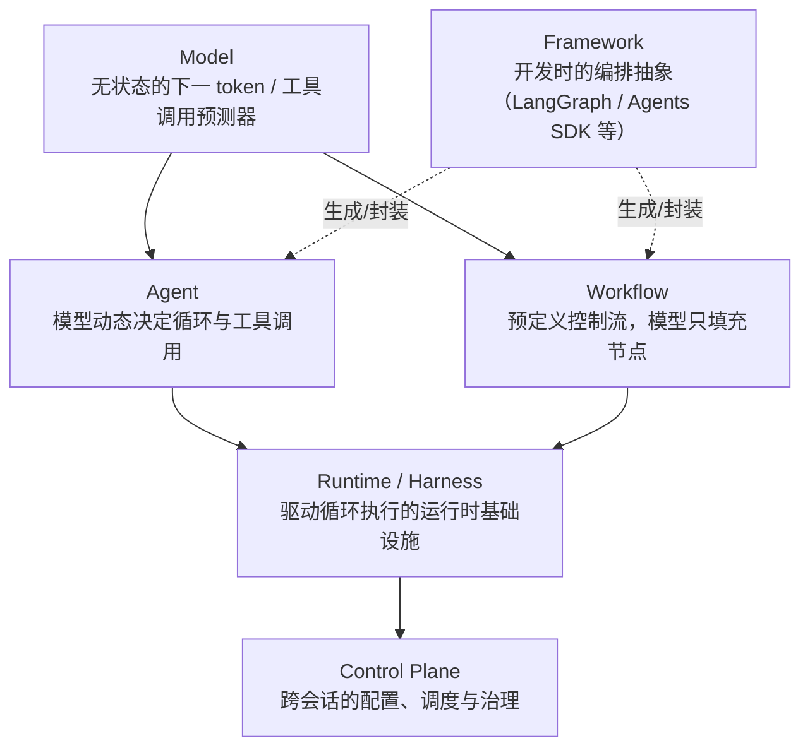
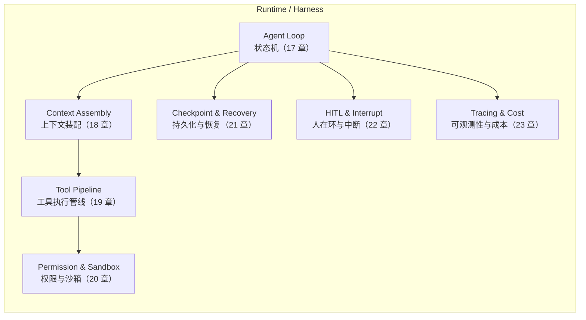

# 第十六章：Agent Harness 的定义、边界与分层

## 16.1 问题背景：模型变强之后，短板在哪里

第一章到第十五章讨论的是"Agent 应该怎么想、怎么记、怎么和别的 Agent 协作、怎么评估、怎么防护"。这些都假设了一个前提：有一个东西持续地把模型的输出接回来、把工具的结果喂回去、决定什么时候停、出错了怎么办、要不要问人。这个东西通常不出现在"Agent 设计模式"的讨论里，但它是所有讨论能够成立的地基——业界把它称为 **runtime** 或 **harness**。

同一个 Claude 或 GPT 模型，配上不同的 harness，就会落成完全不同的产品：命令行里的 Claude Code、IDE 里的 Copilot、云端异步跑的 Coding Agent、Slack 里的客服机器人。模型可能相同，系统提示词也可能高度相似，但可靠性、可恢复性和可审计性往往差别很大。决定这些差别的，主要就是 harness：它如何组织 Agent Loop、装配上下文、调度工具、隔离风险、处理失败、决定是否停下来问人，以及如何记录和计费。第 16–23 章展开的就是这一层，用来补足第一章 2.12 节对 "Runtime 与 Guardrails" 的简要介绍。

## 16.2 六个术语的精确定义

行业里 model、agent、workflow、framework、runtime/harness、control plane 六个词经常被混用。混用的代价是：讨论"要不要用框架"的时候，其实有人在说模型能力，有人在说编排逻辑，有人在说部署基础设施，谁都说服不了谁。这里给出可操作的边界。

### 16.2.1 Model

模型是一个无状态的函数：输入一段 token 序列（可能带工具定义），输出下一段 token 序列（文本或结构化的工具调用请求）。模型本身不知道"上一轮说了什么""这是第几步""要不要重试"——这些都是调用方维护的。模型只回答"给定这些输入，下一步最可能的输出是什么"。

### 16.2.2 Agent

Agent 是"模型 + 工具 + 循环"这三者的组合，其中模型动态决定循环执行多少轮、调用哪些工具、什么时候停（[Anthropic: Building Effective Agents](https://www.anthropic.com/engineering/building-effective-agents) 给出的定义是：workflow 用预定义代码路径编排模型和工具，agent 则是模型自己动态指挥这个过程）。Agent 是一种**控制关系**：谁在决定下一步——是模型还是预先写好的代码。第三章 3.7 节已经从"控制循环"的角度定义过这一点，本章在这个定义之上继续往下拆分执行这个控制循环所需要的基础设施。

### 16.2.3 Workflow

Workflow 是预定义的控制流：步骤、分支、循环条件都写在代码或流程图里，模型只负责填充某些节点的内容（比如生成一段摘要、做一次分类）。Workflow 可靠、可预测、成本可控，但不能处理设计时没预见到的情况。第三章 3.9–3.12 节已详细讨论 Workflow 的形态与五种模式，此处不再重复。

### 16.2.4 Framework

Framework（LangChain/LangGraph、OpenAI Agents SDK、Microsoft Agent Framework 等）是**开发时**的抽象：类、DSL、构建器 API，用来更快地拼出 Agent 或 Workflow。Framework 关心的是"开发者写多少代码、代码长什么样"。同一个 Framework 背后可以用不同的 harness 实现真正的执行；反过来同一个 harness 能力也可能被多个 Framework 包装（例如 LangGraph 既提供 Graph API 也提供 Functional API，二者共享同一套持久化和执行引擎，见 [LangGraph: Graph API](https://docs.langchain.com/oss/python/langgraph/use-graph-api) 与 [LangGraph: Functional API](https://docs.langchain.com/oss/python/langgraph/functional-api)）。

### 16.2.5 Runtime / Harness

Runtime 或 harness 是**运行时**的执行宿主：真正驱动 Agent Loop 一轮一轮跑下去、管理上下文窗口、调度工具执行、做权限判定、写 checkpoint、处理超时重试、决定要不要暂停等人审批、上报 trace 和成本的那部分代码。"harness" 一词在 Coding Agent 场景里尤其常见——SWE-agent 论文把连接模型与真实计算机之间的这套机制称为 **Agent-Computer Interface（ACI）**，强调"给模型设计一个好用的执行环境，和给模型设计一个好的 prompt 同等重要"（[SWE-agent: Agent-Computer Interfaces Enable Automated Software Engineering](https://arxiv.org/abs/2405.15793)）；METR 在评估长时程任务时同样使用 "scaffolding" 指代这层执行骨架，并指出同一个模型换一套 scaffolding 完成任务的时长上限可以差好几倍（[METR: Measuring AI Ability to Complete Long Software Tasks](https://arxiv.org/abs/2503.14499)）。Simon Willison 把这层的本质总结得更直白："An agent is an LLM wrecking its environment in a loop"——harness 就是决定这个循环**在多大范围内、以什么规则**去"折腾环境"的那套机制（[Simon Willison: Designing agentic loops](https://simonwillison.net/2025/Sep/30/designing-agentic-loops/)）。Claude Code、Claude Agent SDK、OpenAI Codex CLI、GitHub Copilot Coding Agent，本质上都是"某个模型 + 某一套 harness"的具体产品化实例。

### 16.2.6 Control Plane

Control Plane 是**管理和治理**这层：多个 harness 实例之上，负责下发配置（模型选择、权限策略、密钥）、调度资源（并发数、Runner 类型）、汇总跨会话的可观测性数据、执行组织级策略（哪些工具允许、哪些仓库可以跑）。它不参与单次 Agent Loop 内部的每一步决策，而是"决定 harness 以什么姿态启动、以及事后能看到什么"。GitHub Copilot Coding Agent 里，组织管理员配置 Runner 类型、防火墙规则、密钥这一层就是 control plane 的具体体现（参见 20.8 节案例）；LangGraph Platform 的 Agent Server 把持久化基础设施从单个 graph 里剥离出来统一托管，也是 control plane 思路的一种实现（[LangGraph: Persistence](https://docs.langchain.com/oss/python/langgraph/persistence) 中 "Agent Server handles persistence automatically" 一节）。

## 16.3 分层视图：从 Model 到 Control Plane

六个术语不是并列关系，而是自下而上的分层——下层为上层提供能力，上层约束下层的使用方式：

Agent 和 Workflow 都跑在 Harness 之上——区别只在于"谁决定下一步"，而不在于"由谁执行下一步"。Framework 是一层横向的开发工具，既可以用来构建 Agent 也可以用来构建 Workflow，它本身不是执行宿主。Control Plane 位于 Harness 之上，管理的是"多个 harness 实例"而不是"一次循环里的一步"。

## 16.4 Harness 的边界：三条判定规则

面对一个具体功能，判断它属于 Harness 还是属于 Agent/Model 层，可以用三条规则：

1. **是否跨越了"一次模型调用"的边界。** 模型调用内部的推理方式（CoT、ToT，见第五章）属于 Model/Agent 层；决定"这次调用之后该不该再调用一次"属于 Harness。
2. **是否需要在没有模型参与的情况下也能运行。** 权限校验、超时熔断、checkpoint 写入即使模型完全不参与也要执行，这是 Harness 职责；任务分解、反思批评需要模型参与，属于 Agent 层。
3. **是否需要在进程重启后仍然成立。** 会话能否在崩溃后从中断点恢复，是 Harness 的职责边界；模型"记不记得"某个事实、要不要检索记忆，是记忆系统（第七、八、十章）的职责。

## 16.5 Harness 的六大子系统（本模块地图）

一个生产级 harness 至少要覆盖六类职责，对应本模块剩余七章：

这六个子系统不是严格顺序执行的流水线，而是 Agent Loop 每一轮都会触碰到的横切关注点：装配上下文是为了发起下一次模型调用，工具管线和权限沙箱在模型请求工具时触发，checkpoint 和可观测性贯穿整个生命周期，HITL 是在其中任意一点插入的暂停点。

## 16.6 案例对照：两种 Harness 的分层落地

**Claude Agent SDK** 把 Claude Code 本身的执行内核暴露为一个可编程的库："The SDK gives you the same tools, agent loop, and context management that power Claude Code, programmable in Python and TypeScript"（[Claude Agent SDK: Overview](https://code.claude.com/docs/en/agent-sdk/overview)）。它的能力表直接对应 16.5 节的子系统：内置工具与 MCP 对应工具管线，Hooks 和 Permissions 对应权限与沙箱，Sessions 对应持久化，Subagents 对应嵌套的 Agent Loop。

**GitHub Copilot Coding Agent** 则把 harness 落地为一次性的、隔离的 GitHub Actions 运行：模型驱动的循环运行在"由 GitHub Actions 提供的一次性开发环境"里，开发者可以用 `copilot-setup-steps.yml` 预装依赖、切换 Runner 规格、启用 LFS，但不能改写循环本身的调度逻辑（[GitHub Docs: Configure the development environment for Copilot cloud agent](https://docs.github.com/en/copilot/how-tos/copilot-on-github/customize-copilot/customize-cloud-agent/customize-the-agent-environment)）。这里能清楚看到 harness（一次性环境 + 循环调度）和 control plane（组织级 Runner 与防火墙配置，见 20.8 节）的分工。

两个案例的共同点：**harness 对上层暴露的是"能力开关"，而不是循环内部的实现细节**——开发者配置权限模式、超时、Runner，但不会（也不需要）重新实现"下一步该不该继续调用工具"这件事。

## 16.7 常见混淆与误区

- **把 Framework 等同于 Harness。** 用了 LangGraph 不代表自动获得持久化、人在环、可观测性——这些是 LangGraph 提供的**能力**，仍需要显式配置 checkpointer、interrupt、tracer（呼应 [LangGraph 第十章 10.11.1 节](../../frameworks/01-langchain/04-langgraph/10-langgraph-advantages.md)的同类提醒）。
- **把 Agent 等同于 Harness。** "这个 Agent 支持重试"这句话通常是错的定位——重试是 harness 对某一类工具调用失败的处理策略，Agent 本身（模型 + 提示词）并不知道自己被重试过。
- **把 Runtime 和 Control Plane 混为一谈。** Runtime 关心单次会话怎么跑，Control Plane 关心多少个会话在跑、谁能跑、跑在哪。把组织级策略硬编码进单个 Agent 的循环逻辑里，会让权限变更必须改代码而不是改配置。
- **认为 Harness 只是"胶水代码"，不值得单独设计。** 第 20–22 章会说明，权限判定顺序、checkpoint 写入时机、中断点选择，都是会直接影响安全性和正确性的架构决策，不是可以随意堆砌的样板代码。

## 16.8 本章总结

Model 是无状态的推理函数，Agent 是"模型动态决定下一步"的控制关系，Workflow 是预定义控制流，Framework 是开发时的编排抽象，Runtime/Harness 是驱动这一切执行的运行时基础设施，Control Plane 是跨会话的治理层。Harness 的边界可以用三条规则判定：是否跨越单次模型调用、是否需要在无模型参与时也能运行、是否需要在进程重启后仍然成立。一个生产级 harness 至少覆盖六个子系统——Agent Loop、上下文装配、工具执行管线、权限与沙箱、持久化与恢复、人在环与中断，外加贯穿始终的可观测性——这也是本模块第 17–23 章的展开顺序。

## 参考资料

- [Anthropic: Building Effective Agents](https://www.anthropic.com/engineering/building-effective-agents)
- [SWE-agent: Agent-Computer Interfaces Enable Automated Software Engineering](https://arxiv.org/abs/2405.15793)
- [METR: Measuring AI Ability to Complete Long Software Tasks](https://arxiv.org/abs/2503.14499)
- [Simon Willison: Designing agentic loops](https://simonwillison.net/2025/Sep/30/designing-agentic-loops/)
- [Claude Agent SDK: Overview](https://code.claude.com/docs/en/agent-sdk/overview)
- [GitHub Docs: Configure the development environment for Copilot cloud agent](https://docs.github.com/en/copilot/how-tos/copilot-on-github/customize-copilot/customize-cloud-agent/customize-the-agent-environment)
- [LangGraph: Persistence](https://docs.langchain.com/oss/python/langgraph/persistence)
- [Microsoft Agent Framework Overview](https://learn.microsoft.com/en-us/agent-framework/overview/)
