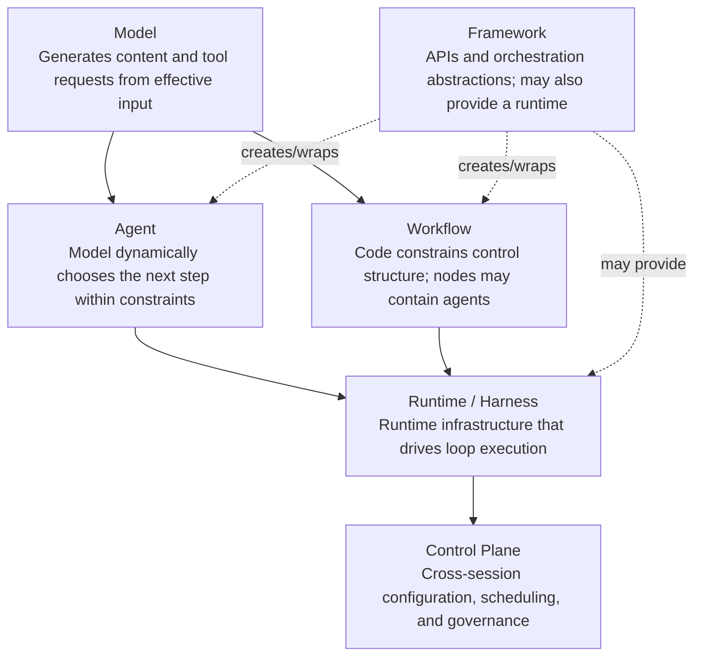
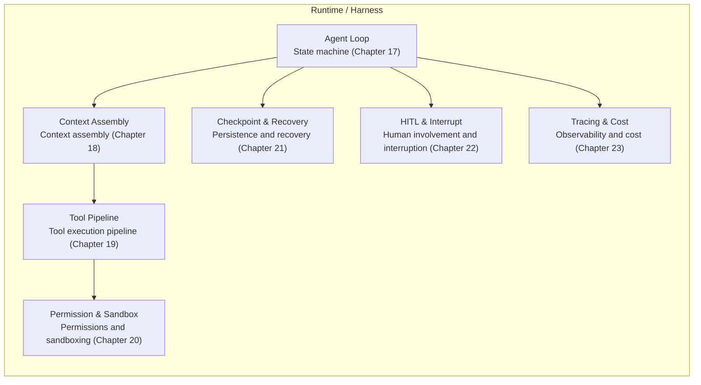

# Chapter 16: Agent Harnesses—Definitions, Boundaries, and Layers

## 16.1 If a model can call tools, why does it need a harness?

Generating a tool request does not mean that the request has been executed safely and reliably. Whether to retry a timed-out tool, require approval before writing a file, or resume from a particular point after a process restart must be handled by an execution host outside the model. This host is commonly called a **runtime** or **harness**. The reasoning, memory, and collaboration discussed in Chapters 1–15 all rely on it to interact with external systems.

The same model can support terminal-based coding, asynchronous cloud tasks, or customer support when paired with different harnesses. Reliability depends not only on model capability but also on loop scheduling, context, tools, isolation, and recovery. Chapters 16–23 examine this layer, extending the introduction to runtimes and guardrails in Section 2.12.

## 16.2 Precise definitions of six terms

The industry often uses model, agent, workflow, framework, runtime/harness, and control plane interchangeably. This creates a practical problem: in a discussion about “whether to use a framework,” one person may mean model capabilities, another orchestration logic, and another deployment infrastructure. They cannot resolve the disagreement because they are discussing different things. The following boundaries make the terms useful in engineering discussions.

### 16.2.1 Model

For an ordinary inference call, a model can be treated as a computational component that generates output from the effective context it receives. Its output may include text, multimodal content, or tool requests. The application or the provider's session service maintains messages, step counts, and business state across requests; a KV cache, a server-side session, and parameter learning are different things. A model can use supplied history to decide whether to retry, but it does not automatically make retries safe.

### 16.2.2 Agent

In this topic, an LLM agent combines **a model, tools, and a loop**: the model dynamically selects the next tool call or proposes stopping, within the actions and budget permitted by the runtime. [Anthropic's Building Effective Agents](https://www.anthropic.com/engineering/building-effective-agents) distinguishes workflows with predefined code paths from agents whose processes are dynamically directed by a model. The model does not have exclusive control. The harness can still reject an action, require further work, or stop the task because of permissions, acceptance criteria, or budget. Here, “agent” describes a **control relationship**, not a system that delegates every decision to the model.

### 16.2.3 Workflow

A workflow's control structure is constrained by code or a flowchart; individual nodes may use models, dynamic branches, or agents. Workflows are often easier to test and to keep within cost limits, but their reliability still depends on node implementations, error handling, and coverage. They are not inherently unable to handle new inputs. Sections 3.9–3.12 discuss their forms and five common patterns.

### 16.2.4 Framework

A framework organizes capabilities through developer-facing APIs, DSLs, and components. **It is not limited to development-time responsibilities.** LangGraph's Graph API and Functional API share runtime and persistence capabilities; the OpenAI Agents SDK includes a Runner; Microsoft Agent Framework also provides a Harness Agent. A single product can provide both a framework and a harness. The distinction is a matter of perspective, not mutually exclusive software categories (see the [Graph API](https://docs.langchain.com/oss/python/langgraph/use-graph-api) and [Functional API](https://docs.langchain.com/oss/python/langgraph/functional-api)).

### 16.2.5 Runtime / Harness

Runtime/harness refers to the responsibilities of the execution host: driving the loop, assembling context, executing tools, managing permissions and budgets, persisting state, handling interruptions, and recording traces. Projects draw the boundaries between harness, runtime, and scaffolding differently. This chapter uses them as engineering terms, not standardized product categories.

[SWE-agent's](https://arxiv.org/abs/2405.15793) **agent-computer interface (ACI)** focuses on how a model uses commands, editors, and feedback. It is an important part of a harness, not the entire runtime. [METR's evaluation of long tasks](https://arxiv.org/abs/2503.14499) also reminds us to distinguish the time a human takes to complete a task from the agent's own execution time. Task-duration capability depends jointly on the model, task set, success threshold, and scaffolding; it cannot be reduced to a fixed multiplier.

### 16.2.6 Control Plane

A control plane manages configuration, resource scheduling, policy, and governance across instances; a runtime executes an individual task. They can interact while a task is running—for example, to revoke permissions, update a budget, or cancel a task—not only before startup and after completion. A centrally hosted persistence service is a platform capability, but “hosted storage” alone is not enough to classify a service as a control plane.

## 16.3 A layered view: from model to control plane

These six terms answer different questions: what capabilities the model provides, who chooses the next step, and who executes and governs the work. We can diagram their responsibilities, but they do not form six strict vertical layers:

Both agents and workflows need an execution host; the main difference is who determines the next step. A framework is a cross-cutting development abstraction that can also include an execution host. A control plane manages multiple running instances and organizational policies. This diagram shows responsibilities, not a six-layer architecture that must be deployed as six separate services.

## 16.4 Where the harness ends: three tests

To decide whether a particular capability belongs to the harness or the agent/model layer, use three tests:

1. **Separate policy from execution.** A CoT prompt is a reasoning strategy. Classical ToT typically uses an external program to call models repeatedly, score candidates, and search; it is not a capability contained in a single model call. Choosing candidates belongs to the strategy, whereas scheduling, budgeting, and saving search state belong to the runtime. The two can overlap.
2. **Ask whether it must work without model participation.** Permission checks, timeout-triggered circuit breaking, and checkpoint writes must run even if the model is not involved at all, making them harness responsibilities. Model-generated task decomposition and critique are agent-policy decisions. Decomposition can also be predefined in a workflow or supplied by an external planner, as Sections 6.6 and 11.20 explain; scheduling and persisting the resulting plan remain runtime responsibilities.
3. **Separate recovery guarantees from memory use.** The harness and persistence infrastructure determine whether a session can recover after a crash. Memory policy determines which experiences to retain and retrieve. Long-term memory must also survive across processes, so “needs persistence” is not sufficient reason to assign all memory capabilities to the harness.

## 16.5 Seven harness subsystems: a map of this module

This module divides the harness into seven responsibilities, covered by the remaining seven chapters. A concrete system may combine components:

These subsystems are not a strictly sequential pipeline. Context assembly prepares model calls; the tool pipeline and permission/sandbox mechanisms are invoked when execution is requested; checkpointing and observability span the lifecycle; and human-in-the-loop handling provides resumable pause points.

## 16.6 Case comparison: how two harnesses implement these layers

The **Claude Agent SDK** exposes Claude Code's execution core as a programmable library: “The SDK gives you the same tools, agent loop, and context management that power Claude Code, programmable in Python and TypeScript” ([Claude Agent SDK: Overview](https://code.claude.com/docs/en/agent-sdk/overview)). Its capability table maps directly to the subsystems in Section 16.5: built-in tools and MCP correspond to the tool pipeline, hooks and permissions to permission and sandbox controls, sessions to persistence, and subagents to nested agent loops.

**GitHub Copilot Coding Agent** implements its harness as an ephemeral, isolated GitHub Actions run. The model-driven loop runs in an “ephemeral development environment, powered by GitHub Actions.” Developers can use `copilot-setup-steps.yml` to preinstall dependencies, change runner capacity, and enable LFS, but cannot rewrite the loop's scheduling logic ([GitHub Docs: Configure the development environment for Copilot cloud agent](https://docs.github.com/en/copilot/how-tos/copilot-on-github/customize-copilot/customize-cloud-agent/customize-the-agent-environment)). This illustrates the division between the harness—the ephemeral environment and loop scheduling—and the control plane—organization-level runner and firewall configuration, discussed in Section 20.8.

Both products let developers reuse an existing loop through configuration and extension points rather than implement scheduling from scratch. That is not a restriction in the definition of a harness: with a custom harness or explicit graph orchestration, developers may still directly define how the next step is chosen and when execution stops.

## 16.7 Common confusions and mistakes

- **Equating a framework with a harness.** Using LangGraph does not automatically give you persistence, human-in-the-loop handling, or observability. These are **capabilities** it offers; checkpointers, interrupts, and tracers still need explicit configuration. This echoes the warning in [Section 10.11.1 of the LangGraph chapter](../../frameworks/01-langchain/04-langgraph/10-langgraph-advantages.md).
- **Confusing two kinds of retries.** A runtime can retry transmission of a request that is safe to resend. An agent can also inspect a failure observation, change the arguments, and try again. The latter is a new decision, may create a new operation ID, and requires renewed checks on permissions and side effects.
- **Conflating runtime and control plane.** A runtime concerns how one session runs; a control plane concerns how many sessions run, who may run them, and where they run. Hard-coding organizational policy into an individual agent's loop means permission changes require code changes rather than configuration changes.
- **Treating a harness as mere “glue code” that does not deserve deliberate design.** Chapters 20–22 show why permission evaluation order, checkpoint timing, and interruption points are architectural decisions that directly affect safety and correctness, not arbitrary boilerplate.

## 16.8 Chapter summary

The model provides inference capabilities; agents and workflows describe forms of control; the harness handles execution; and the control plane governs across instances. A framework can provide both development abstractions and a runtime, so it is not a product category mutually exclusive with a harness. When discussing a concrete system, examining its loop, context, tools, permissions, recovery, approval, and observability responsibilities is more reliable than drawing boundaries around product names.

## References

- [Anthropic: Building Effective Agents](https://www.anthropic.com/engineering/building-effective-agents)
- [SWE-agent: Agent-Computer Interfaces Enable Automated Software Engineering](https://arxiv.org/abs/2405.15793)
- [METR: Measuring AI Ability to Complete Long Software Tasks](https://arxiv.org/abs/2503.14499)
- [Simon Willison: Designing agentic loops](https://simonwillison.net/2025/Sep/30/designing-agentic-loops/)
- [Claude Agent SDK: Overview](https://code.claude.com/docs/en/agent-sdk/overview)
- [GitHub Docs: Configure the development environment for Copilot cloud agent](https://docs.github.com/en/copilot/how-tos/copilot-on-github/customize-copilot/customize-cloud-agent/customize-the-agent-environment)
- [LangGraph: Persistence](https://docs.langchain.com/oss/python/langgraph/persistence)
- [Microsoft Agent Framework Overview](https://learn.microsoft.com/en-us/agent-framework/overview/)
