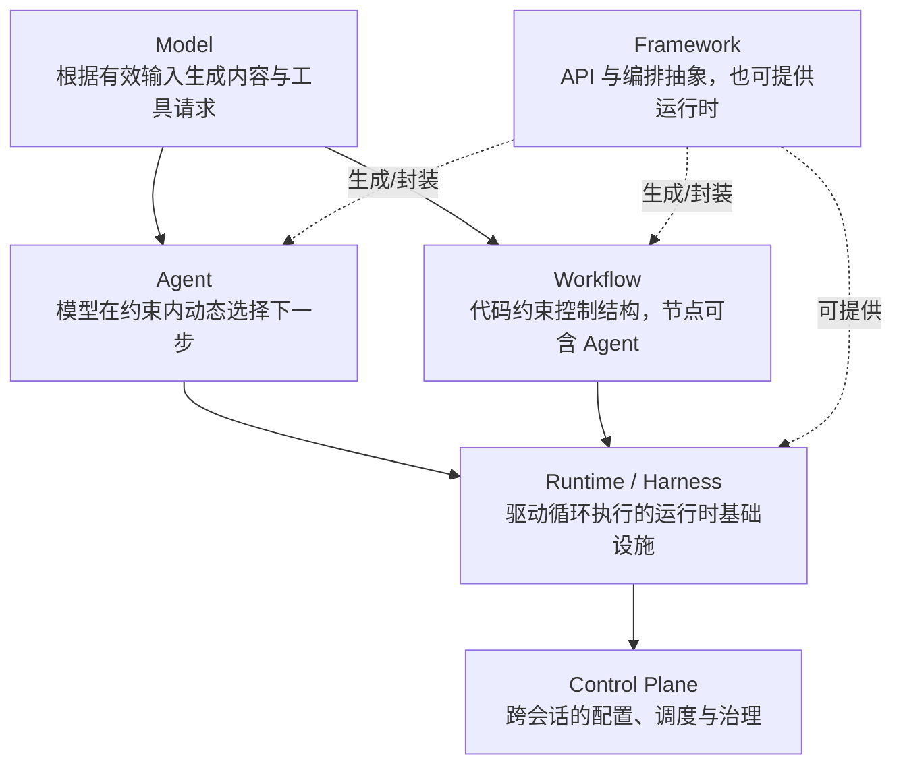
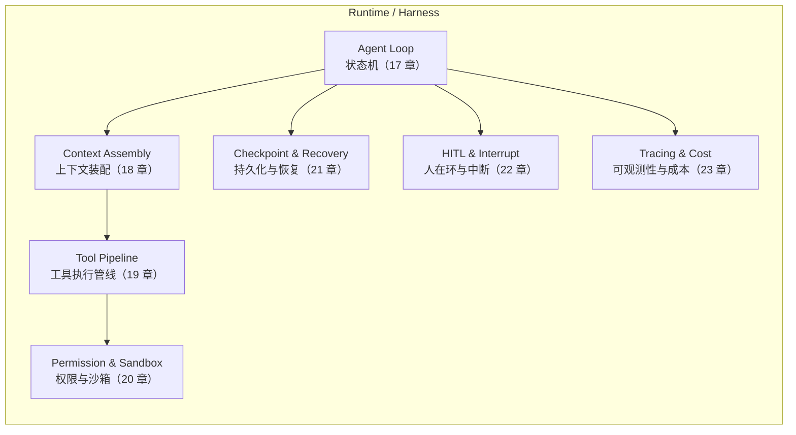

# 第十六章：Agent Harness 的定义、边界与分层

## 16.1 模型能调用工具，为什么还需要 Harness？

因为模型生成工具请求，不等于请求已经被安全、可靠地执行。工具超时后该不该重试、写文件前要不要审批、进程重启后从哪里继续，都需要模型之外的执行宿主处理。这个宿主通常称为 **Runtime** 或 **Harness**；第一章到第十五章讨论的推理、记忆和协作，都要通过它与外部系统交互。

同一个模型配上不同的 harness，可以用于终端编码、云端异步任务或客服。除了模型能力，循环调度、上下文、工具、隔离与恢复也影响可靠性。第 16–23 章展开这一层，补足第二章 2.12 节对 Runtime 与 Guardrails 的介绍。

## 16.2 六个术语的精确定义

行业里 model、agent、workflow、framework、runtime/harness、control plane 六个词经常被混用。混用的代价是：讨论"要不要用框架"的时候，其实有人在说模型能力，有人在说编排逻辑，有人在说部署基础设施，谁都说服不了谁。这里给出可操作的边界。

### 16.2.1 Model

对普通推理调用，可以把模型视为“给定有效上下文，生成输出”的计算组件，输出可包含文本、多模态内容或工具请求。跨请求的消息、步数和业务状态由应用或提供商会话服务维护；KV Cache、服务端会话与参数学习不是一回事。模型能根据传入历史判断是否重试，但不会自动保证重试安全。

### 16.2.2 Agent

本主题讨论的 LLM Agent 是"模型 + 工具 + 循环"这三者的组合：模型在运行时允许的动作和预算内，动态选择下一步工具调用或提出结束（[Anthropic: Building Effective Agents](https://www.anthropic.com/engineering/building-effective-agents)区分了预定义代码路径的 workflow 与由模型动态指挥的 agent）。模型并不独占控制权，Harness 仍可因权限、验收或预算而拒绝动作、要求继续或停止任务。Agent 在这里描述一种**控制关系**，不是说系统的每一个决定都交给模型。

### 16.2.3 Workflow

Workflow 的控制结构由代码或流程图约束，节点内部可以使用模型、动态分支或 Agent。它通常更便于测试和约束成本，但可靠性仍取决于节点实现、错误处理与覆盖范围；并非天然不能处理新输入。第三章 3.9–3.12 节讨论其形态与五种模式。

### 16.2.4 Framework

Framework 从开发者使用的 API、DSL 和组件来组织能力，**不代表只在开发时起作用**。LangGraph 的 Graph API 与 Functional API 共享运行时和持久化能力；OpenAI Agents SDK 内含 Runner；Microsoft Agent Framework 也提供 Harness Agent。框架与 Harness 可以由同一产品提供，区别是观察视角，不是互斥的软件分类（见 [Graph API](https://docs.langchain.com/oss/python/langgraph/use-graph-api)、[Functional API](https://docs.langchain.com/oss/python/langgraph/functional-api)）。

### 16.2.5 Runtime / Harness

Runtime/Harness 指执行宿主的职责：驱动循环、装配上下文、执行工具、管理权限与预算、持久化状态、处理中断并记录轨迹。不同项目对 Harness、Runtime、Scaffolding 的边界并不完全一致，本章把它们作为工程术语，而不是标准化产品类别。

[SWE-agent](https://arxiv.org/abs/2405.15793) 的 **Agent-Computer Interface（ACI）** 重点研究模型如何使用命令、编辑器和反馈，它是 Harness 的重要组成部分，不等同于整个运行时。[METR 的长任务评测](https://arxiv.org/abs/2503.14499)还提醒读者区分人类完成任务的时长与 Agent 自身运行时间；任务时长能力受模型、任务集、成功阈值和 scaffolding 共同影响，不能归结为某个固定倍数。

### 16.2.6 Control Plane

Control Plane 负责跨实例的配置、资源调度、策略与治理，Runtime 执行单次任务。两者可以在运行期间交互，例如权限撤销、预算更新和取消任务，并非只有启动前和结束后才能通信。统一托管持久化服务属于平台能力，但仅凭“托管存储”还不足以认定某个服务就是 Control Plane。

## 16.3 分层视图：从 Model 到 Control Plane

六个术语回答不同的问题：模型提供什么能力，谁选择下一步，谁执行和治理。它们可以画成职责关系，但不是严格的上下六层：

Agent 和 Workflow 都需要执行宿主，区别主要在于谁决定下一步。Framework 是横向的开发抽象，也可以附带执行宿主；Control Plane 管理多个运行实例及组织策略。这张图表示职责关系，不是必须分开部署的六层架构。

## 16.4 Harness 的边界：三条判定规则

面对一个具体功能，判断它属于 Harness 还是属于 Agent/Model 层，可以用三条规则：

1. **区分策略与执行。** CoT 提示是推理策略；经典 ToT 通常由外部程序多次调用模型、评分和搜索，不是一次模型调用内部的能力。选择候选属于策略，调度、预算和保存搜索状态属于运行时，两者会交叉。
2. **是否需要在没有模型参与的情况下也能运行。** 权限校验、超时熔断、checkpoint 写入即使模型完全不参与也要执行，这是 Harness 职责；任务分解、反思批评需要模型参与，属于 Agent 层。
3. **区分恢复保证与记忆使用。** 会话能否在崩溃后恢复，由 Harness 和持久化设施保证；要保留、检索哪些经验，由记忆策略决定。长期记忆同样要跨进程存在，因此“需要持久化”不是把所有记忆能力都归入 Harness 的充分条件。

## 16.5 Harness 的七类子系统（本模块地图）

本模块按七类职责拆解 Harness，对应剩余七章；具体系统可以合并组件：

这些子系统不是严格顺序执行的流水线：装配上下文服务于模型调用，工具管线和权限沙箱在请求执行时触发，checkpoint 和可观测性贯穿生命周期，HITL 提供可恢复的暂停点。

## 16.6 案例对照：两种 Harness 的分层落地

**Claude Agent SDK** 把 Claude Code 本身的执行内核暴露为一个可编程的库："The SDK gives you the same tools, agent loop, and context management that power Claude Code, programmable in Python and TypeScript"（[Claude Agent SDK: Overview](https://code.claude.com/docs/en/agent-sdk/overview)）。它的能力表直接对应 16.5 节的子系统：内置工具与 MCP 对应工具管线，Hooks 和 Permissions 对应权限与沙箱，Sessions 对应持久化，Subagents 对应嵌套的 Agent Loop。

**GitHub Copilot Coding Agent** 则把 harness 落地为一次性的、隔离的 GitHub Actions 运行：模型驱动的循环运行在"由 GitHub Actions 提供的一次性开发环境"里，开发者可以用 `copilot-setup-steps.yml` 预装依赖、切换 Runner 规格、启用 LFS，但不能改写循环本身的调度逻辑（[GitHub Docs: Configure the development environment for Copilot cloud agent](https://docs.github.com/en/copilot/how-tos/copilot-on-github/customize-copilot/customize-cloud-agent/customize-the-agent-environment)）。这里能清楚看到 harness（一次性环境 + 循环调度）和 control plane（组织级 Runner 与防火墙配置，见 20.8 节）的分工。

这两个产品都让开发者通过配置和扩展点复用已有循环，不必从零实现调度。但这不是 Harness 的定义限制：自建 Harness 或使用显式图编排时，开发者仍可能直接定义下一步如何选择、何时停止。

## 16.7 常见混淆与误区

- **把 Framework 等同于 Harness。** 用了 LangGraph 不代表自动获得持久化、人在环、可观测性——这些是 LangGraph 提供的**能力**，仍需要显式配置 checkpointer、interrupt、tracer（呼应 [LangGraph 第十章 10.11.1 节](../../frameworks/01-langchain/04-langgraph/10-langgraph-advantages.zh.md)的同类提醒）。
- **混淆两种重试。** Runtime 可以对可安全重发的请求做传输重试；Agent 也可以看到失败观察后修改参数再试。后者是新决策，可能产生新的操作 ID，必须重新校验权限和副作用。
- **把 Runtime 和 Control Plane 混为一谈。** Runtime 关心单次会话怎么跑，Control Plane 关心多少个会话在跑、谁能跑、跑在哪。把组织级策略硬编码进单个 Agent 的循环逻辑里，会让权限变更必须改代码而不是改配置。
- **认为 Harness 只是"胶水代码"，不值得单独设计。** 第 20–22 章会说明，权限判定顺序、checkpoint 写入时机、中断点选择，都是会直接影响安全性和正确性的架构决策，不是可以随意堆砌的样板代码。

## 16.8 本章总结

Model 提供推理，Agent/Workflow 描述控制方式，Harness 承担执行职责，Control Plane 负责跨实例治理。Framework 可以同时提供开发抽象和运行时，不是与 Harness 互斥的产品类别。讨论具体系统时，沿着循环、上下文、工具、权限、恢复、审批和观测七类职责检查，比按产品名划边界更可靠。

## 参考资料

- [Anthropic: Building Effective Agents](https://www.anthropic.com/engineering/building-effective-agents)
- [SWE-agent: Agent-Computer Interfaces Enable Automated Software Engineering](https://arxiv.org/abs/2405.15793)
- [METR: Measuring AI Ability to Complete Long Software Tasks](https://arxiv.org/abs/2503.14499)
- [Simon Willison: Designing agentic loops](https://simonwillison.net/2025/Sep/30/designing-agentic-loops/)
- [Claude Agent SDK: Overview](https://code.claude.com/docs/en/agent-sdk/overview)
- [GitHub Docs: Configure the development environment for Copilot cloud agent](https://docs.github.com/en/copilot/how-tos/copilot-on-github/customize-copilot/customize-cloud-agent/customize-the-agent-environment)
- [LangGraph: Persistence](https://docs.langchain.com/oss/python/langgraph/persistence)
- [Microsoft Agent Framework Overview](https://learn.microsoft.com/en-us/agent-framework/overview/)
