# Chapter 17: The Agent Loop and Runtime State Machine

## 17.1 Why express the control loop as a state machine?

To distinguish “the model has not decided yet,” “a tool is running,” “the result has arrived,” and “waiting for human approval.” Even if these stages display identical chat text, the actions permitted next are different. The perception–decision–action loop in Chapter 3 explains who chooses an action. An explicit state machine lets the harness keep track of which actions have occurred through failures, concurrency, and recovery, providing the foundation for the recovery and pause mechanisms in Chapters 21 and 22.

## 17.2 A state-machine view: what state does the harness maintain?

Without depending on any framework's class names, we can start with these fields:

| State field | Meaning | Who updates it |
|---|---|---|
| `messages` | Messages currently available to continue the conversation; may include summaries or references to history | The harness updates them after model calls and tool execution; complete audit events may be stored separately |
| `turn_index` | The current turn number | The harness increments it after each completed model-call → execution cycle |
| `pending_tool_calls` | Tool calls requested by the model this turn that have not finished being processed | The harness parses them from model output and clears them after execution completes |
| `phase` | The current stage of the loop (see Section 17.3) | The harness state machine itself |
| `stop_reason` | Why the loop ended: normal completion, limit reached, interruption, or error | The harness writes it when the loop exits |
| `budget` | Remaining turns, time, tokens, or cost budget | The harness reserves budget before a call and settles actual usage afterward; concurrent branches share a root budget |

This is a minimal teaching example, not a field specification shared by every framework. Production systems may also store structured plans, acceptance status, identity, approvals, and operation idempotency keys. The runtime should validate dependencies, invariants, and completion conditions, not merely move messages and update counters.

## 17.3 State transitions within a turn

The Claude Agent SDK describes the internal cycle as four steps: “Receive prompt → Evaluate and respond → Execute tools → Repeat.” Steps 2 and 3 repeat until the model produces a final response without tool calls ([Claude Agent SDK: How the agent loop works](https://code.claude.com/docs/en/agent-sdk/agent-loop)). The OpenAI Agents SDK's `Runner` describes the same basic loop: call the model; exit if the output is final; switch the current agent and re-enter the loop if a handoff is requested; or execute requested tool calls, append their results, and call the model again ([OpenAI Agents SDK: Running agents](https://openai.github.io/openai-agents-python/running_agents/)). Abstracted as a state machine:

```mermaid
stateDiagram-v2
    [*] --> Init
    Init --> ModelCall: Assemble context (Chapter 18)
    ModelCall --> Deciding: Receive model output
    Deciding --> FinalOutput: Output contract satisfied; no pending calls
    Deciding --> ToolExecution: Tool calls requested
    Deciding --> HandoffSwitch: Agent switch requested
    ToolExecution --> PermissionCheck: Each tool call (Chapter 20)
    PermissionCheck --> ToolRunning: Allowed
    PermissionCheck --> Blocked: Denied
    PermissionCheck --> Interrupted: Human input required
    ToolRunning --> CollectResults: Record call result
    CollectResults --> ModelCall: All calls in this turn handled
    HandoffSwitch --> ModelCall: Update current agent/input
    Blocked --> CollectResults: Return denial result (or terminate by policy)
    Interrupted --> PermissionCheck: Approval received; revalidate bound operation
    Interrupted --> Stopped: Rejected/expired; no further continuation
    Stopped --> [*]
    FinalOutput --> [*]
```

The tool branch abstracts a batch of calls: each call must pass its own permission check and have its result recorded. One tool returning does not justify abandoning the others. Ordinary tool requests and a handoff can also appear in the same model output. Whether to handle tools first, transfer control first, or reject mixed output is a contract of the particular runtime; it cannot be inferred from the order of branches in this diagram. An absence of tool calls does not necessarily imply a valid final output either: empty responses, truncation, and malformed output need separate handling.

## 17.4 Termination conditions and protective limits

A state machine needs explicit, enumerable exit paths. Otherwise, both “the agent never stops” and “the agent continues when it should stop” can become production incidents. At least four types of termination conditions are needed:

- **End of the model turn:** a Runner can treat output of the expected type with no tool calls as final output. Business success still requires state assertions or an acceptance evaluator. A refusal or a statement that information is missing can also end a turn; neither should automatically count as success.
- **Turn limit:** reaching the limit must produce an explicit stop reason or exception, rather than an infinite loop or silent truncation. For example, the OpenAI Agents SDK raises `MaxTurnsExceeded` when `max_turns` is exceeded. SDKs differ in what they count and how they return outcomes; their conventions are not interchangeable.
- **Budget exhaustion:** before a call, check that enough tokens, time, or money remain, and reserve consumption for in-flight requests. Stop when there is not enough budget to safely start the next step; there is no need to wait for the balance to reach exactly zero.
- **External interruption:** user cancellation, an upstream timeout, or system shutdown. Save state during cooperative shutdown, but remember that forced process termination may prevent cleanup code from running. Recovery must therefore rely on checkpoints already persisted, not solely on exit hooks.

Section 12.16 discusses a stop controller for reflection loops, and Section 13.34 discusses cancellation propagation in multi-agent systems. Both specialize the termination conditions described here. They follow the same principle: **termination conditions must be first-class parts of the state machine, not a fallback that exits only when something happens to go wrong.**

## 17.5 Concurrency and streaming: asynchronous events in the state machine

Production agent loops are rarely entirely synchronous and blocking:

- **Streaming output:** model output arrives as incremental events—text deltas and tool-call arguments assembled from successive chunks. The state machine must distinguish a complete, executable tool call from arguments still arriving in a stream. The latter must not trigger execution early.
- **Parallel tool calls:** one model response may contain multiple tool requests. The harness must decide whether to run them concurrently or sequentially, and whether execution order affects the result. Two tools writing the same file, for example, must not be parallelized blindly.
- **Cancellation propagation:** if the user cancels midway, the state machine must safely interrupt streaming reception or concurrent tool execution rather than leave a tool running as an orphan process.

How these asynchronous events are handled directly limits the harness's reliability. They also create some of the problems addressed by idempotency in Chapter 21: a tool call judged to have “failed” because of a network problem may actually have succeeded on the server.

## 17.6 Nested state machines: subagents and handoffs

From a state-machine perspective, the multi-agent collaboration discussed in Chapter 13 takes two forms:

- **Handoff:** another agent configuration takes over subsequent decisions. The OpenAI Agents SDK updates the current agent and input within the same Runner loop; it does not necessarily terminate an old process or create a new state machine. This corresponds to `HandoffSwitch` in Section 17.3.
- **Subagent:** within one of its own steps, the current state machine starts a new, independent child state machine with its own `turn_index`, `budget`, and `messages`. Once the child finishes, its result is inserted into the parent as a tool result, and the parent continues. The Claude Agent SDK calls this pattern subagents: “Spawn specialized agents for focused subtasks” (the capability table in [Claude Agent SDK: Overview](https://code.claude.com/docs/en/agent-sdk/overview)).

The key difference is the calling relationship. A subagent normally returns a result to its caller, which resumes decision-making; a handoff transfers the subsequent conversation to the receiving agent. Both should count toward the same root task's total budget, with costs then allocated by agent. Switching roles must not reset total steps, costs, or permission boundaries.

## 17.7 Comparing three state-machine implementations

| Dimension | Claude Agent SDK | OpenAI Agents SDK | LangGraph, for comparison |
|---|---|---|---|
| What drives the loop | Built-in agent loop driven internally by the SDK | Driven internally by `Runner.run`, with synchronous, asynchronous, and streaming entry points | Explicit graph execution engine, with developer-defined nodes and edges |
| Termination | No tool calls can end a turn; hooks can intervene | Final output or configured tool-stop behavior; `max_turns` triggers an exception | `END` ends the graph; `interrupt()` pauses it and does not mean successful completion |
| Nesting / transfer | Subagents: nesting | Handoffs: changing the current agent | Subgraphs; see [LangGraph: Subgraphs](https://docs.langchain.com/oss/python/langgraph/use-subgraphs) |
| State visibility | Exposed through streamed messages such as `SystemMessage` and `AssistantMessage` | Exposed through `RunResult` and `RunResultStreaming` | State consists of explicit graph fields; see [Section 13.15](../04-multi-agent/13-multi-agent-coordination.md) |

All three handle calls, observations, continuation, and stopping, but they do not share a field specification or an identical state machine. Map product events to your own task state during integration, and verify how turns are counted. For example, the Claude Agent SDK's `max_turns` counts tool-use turns; copying another SDK's numeric setting unchanged may not preserve the intended limit.

## 17.8 Common mistakes

- **Leaving every tool error to the model.** Recoverable business errors can be returned for the model to correct. Permission violations, exhausted budgets, and corrupted state should cause the runtime to stop according to policy; the model must not decide whether hard constraints can be ignored.
- **Choosing a turn limit by intuition without telling callers when it is reached.** Silent truncation can make upstream systems believe the task completed normally. Explicit exceptions such as `MaxTurnsExceeded` should be standard practice.
- **Parsing incomplete streamed tool arguments too early.** This can cause JSON parsing failures or execute a tool with incomplete arguments. Wait until the argument stream has been fully assembled.
- **Confusing budget ownership for handoffs and subagents.** This produces inconsistent accounting. The cost calculations in Chapter 23 depend on defining these ownership rules first.
- **Running concurrent tools without mutual exclusion.** Two calls writing the same state—a file or database row—can create a data race without mutual exclusion or serialization. This is the single-agent counterpart of the concurrent-write problem in Section 13.16.

## 17.9 Chapter summary

A state machine must distinguish the end of a model turn, business success, suspension, failure, and cancellation. Resuming after approval should continue the specific bound operation, not ask the model to guess again. Streamed arguments must be complete before execution. Subagents return results and handoffs transfer subsequent decisions, but neither may bypass the root task's budget, authorization, or audit requirements.

## References

- [Claude Agent SDK: How the agent loop works](https://code.claude.com/docs/en/agent-sdk/agent-loop)
- [OpenAI Agents SDK: Running agents](https://openai.github.io/openai-agents-python/running_agents/)
- [Anthropic: Building Effective Agents](https://www.anthropic.com/engineering/building-effective-agents)
- [LangGraph: Subgraphs](https://docs.langchain.com/oss/python/langgraph/use-subgraphs)
- [Simon Willison: Designing agentic loops](https://simonwillison.net/2025/Sep/30/designing-agentic-loops/)
