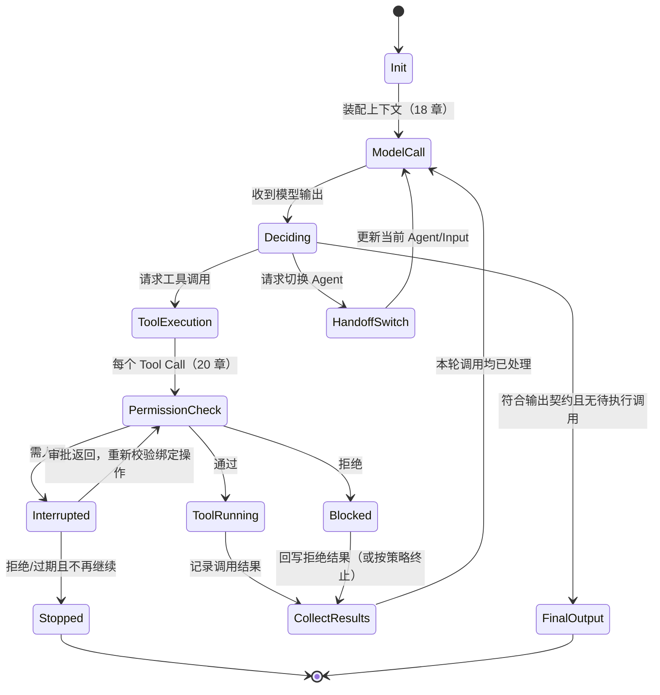

# 第十七章：Agent Loop 与运行时状态机

## 17.1 为什么要把控制循环写成状态机？

为了区分“模型还没决定”“工具正在执行”“结果已经收到”和“正在等人批准”。这几个阶段即使展示相同的聊天文本，下一步允许做的事也不同。第三章的“感知—决策—行动”解释谁选择动作；显式状态机则让 Harness 在失败、并发和恢复时仍知道哪些动作已经发生，为第 21、22 章的恢复与暂停提供依据。

## 17.2 状态机视角：Harness 在维护什么状态

不依赖具体框架的类名，可以先用下面一组字段描述循环：

| 状态字段 | 含义 | 谁更新它 |
|---|---|---|
| `messages` | 当前可用于继续对话的消息，可能包含摘要或历史引用 | Harness，在模型调用和工具执行后更新；完整审计事件可另存 |
| `turn_index` | 当前是第几轮 | Harness，每完成一次"模型调用→执行"循环递增 |
| `pending_tool_calls` | 模型本轮请求、尚未执行完的工具调用 | Harness，从模型输出中解析写入，执行完成后清空 |
| `phase` | 当前处于循环的哪个阶段（见 17.3） | Harness 状态机本身 |
| `stop_reason` | 循环为什么会结束（正常完成/达到上限/被中断/出错） | Harness，在循环退出时写入 |
| `budget` | 剩余的轮数/时间/token/成本预算 | Harness，调用前预留，完成后结算；并发分支共享根预算 |

这是教学用的最小集合，不是所有框架统一的字段规范。生产系统还可能保存结构化计划、验收状态、身份、审批和操作幂等键；运行时应校验依赖、不变量与完成条件，而非只搬运消息和计数。

## 17.3 一次 Turn 内部的状态转移

Claude Agent SDK 把每一轮的内部结构描述为四步循环："Receive prompt → Evaluate and respond → Execute tools → Repeat"，其中第 2、3 步反复进行，直到模型给出不带工具调用的最终输出（[Claude Agent SDK: How the agent loop works](https://code.claude.com/docs/en/agent-sdk/agent-loop)）。OpenAI Agents SDK 的 `Runner` 用同样的结构描述内部循环：调用模型 → 若输出是最终结果则退出；若请求 handoff 则切换当前 agent 并重新进入循环；若请求工具调用则执行并把结果并回，再次调用模型（[OpenAI Agents SDK: Running agents](https://openai.github.io/openai-agents-python/running_agents/)）。抽象成状态机：

图中工具分支按一批调用抽象：每个调用分别通过权限判定并记录结果，不能一个工具先返回就丢下其他待完成调用。普通工具请求和 Handoff 也可能出现在同一份模型输出中；是先处理工具、先交接还是拒绝混合输出，要由具体运行时约定，不能从图中的分支顺序推断。无工具调用也不必然是合法最终输出，空响应、截断或格式错误仍需单独处理。

## 17.4 Loop 的终止条件与保护性上限

状态机必须有明确、可枚举的退出路径，否则"Agent 卡住不停"和"Agent 明明该停却继续跑"都会成为线上事故。至少需要四类终止条件：

- **模型回合结束**：Runner 可把符合输出类型且无工具调用的输出作为 final output；业务是否成功还要由状态断言或验收器判断。拒绝回答、缺少信息的说明也可能结束回合，不能自动记为成功。
- **轮数上限**：达到上限后显式返回停止原因或异常，而不是无限循环或静默截断。例如 OpenAI Agents SDK 超过 `max_turns` 抛出 `MaxTurnsExceeded`；不同 SDK 的计数口径和结果载体不能混用。
- **预算耗尽**：调用前检查剩余 token、时间或金额是否足够，并为在途请求预留消耗；不足以安全发起下一步时就停止，不必等数值恰好归零。
- **外部中断**：用户取消、上游超时、系统关闭。可协作关闭时保存状态，但进程被强制终止时未必能执行清理代码，所以恢复必须依赖此前已持久化的 checkpoint，不能只靠退出钩子。

第十二章 12.16 节讨论过反思循环的 Stop Controller，第十三章 13.34 节讨论过多 Agent 场景下的取消传播——这两处都是本节"终止条件"在特定场景下的具体化，遵守同一个原则：**终止条件必须是状态机的一等公民，不能是"跑着跑着发现异常就退出"的兜底逻辑**。

## 17.5 并发与流式：状态机遇到异步事件

生产环境的 Agent Loop 很少是完全同步阻塞的：

- **流式输出**：模型输出以增量事件流的形式到达（文本 delta、工具调用参数逐步拼接完成）。状态机需要区分"收到了一个完整的可执行工具调用"和"还在流式接收参数中"，后者不能提前触发工具执行。
- **并行工具调用**：模型一次输出可能包含多个工具调用请求，harness 需要决定它们是并发执行还是顺序执行、以及执行顺序是否影响结果（例如两个工具都要写同一个文件时不能无脑并发）。
- **取消传播**：用户中途取消时，状态机需要能够安全地中断"正在流式接收"或"正在并发执行工具"的中间状态，而不是让某个工具调用变成孤儿进程继续跑。

这几类异步事件的处理方式直接决定了 harness 的可靠性上限，也是 21 章"幂等性"要解决的问题的来源之一：一次因网络问题被判定为"失败"的工具调用，服务端可能其实已经执行成功。

## 17.6 嵌套状态机：子 Agent 与 Handoff

第十三章讨论的多 Agent 协作，从状态机角度看有两种形态：

- **Handoff（切换）**：由另一个 Agent 配置接管后续决策。OpenAI Agents SDK 在同一个 Runner 循环中更新 current agent 和输入，并不必然结束旧进程或新建状态机（对应 17.3 图中 `HandoffSwitch`）。
- **Subagent（嵌套）**：当前状态机在自己的一步之内，启动一个全新的、独立的子状态机（有自己的 `turn_index`、`budget`、`messages`），等子状态机跑完拿到结果后，把结果作为一次"工具调用结果"塞回父状态机继续跑。Claude Agent SDK 把这种模式称为 Subagents："Spawn specialized agents for focused subtasks"（[Claude Agent SDK: Overview](https://code.claude.com/docs/en/agent-sdk/overview) 能力表）。

关键区别是调用关系：Subagent 通常向调用者返回结果，由调用者继续决策；Handoff 则把后续对话交给接手者。二者都应计入同一根任务的总预算，再按 Agent 分摊成本；切换角色不能重置总步数、费用或权限边界。

## 17.7 三种实现的状态机对比

| 维度 | Claude Agent SDK | OpenAI Agents SDK | LangGraph（对比参考） |
|---|---|---|---|
| 循环驱动方式 | 内置 agent loop，SDK 内部驱动 | `Runner.run` 内部驱动，暴露三种调用方式（同步/异步/流式） | 显式的图执行引擎，节点与边由开发者定义 |
| 终止判定 | 无工具调用可结束回合，hooks 可干预 | final output 或配置的工具停止行为；`max_turns` 触发异常 | `END` 表示图结束；`interrupt()` 是暂停，不等于成功终止 |
| 嵌套/切换 | Subagents（嵌套） | Handoffs（切换 current agent） | 子图（Subgraphs），见 [LangGraph: Subgraphs](https://docs.langchain.com/oss/python/langgraph/use-subgraphs) |
| 状态可见性 | 通过流式消息（`SystemMessage`/`AssistantMessage`）暴露 | 通过 `RunResult`/`RunResultStreaming` 暴露 | 状态是图上的显式字段，见[第十三章 13.15 节](../04-multi-agent/13-multi-agent-coordination.md) |

三者都要处理调用、观察、继续与停止，但不共享一份字段规范或完全相同的状态机。对接时应把产品事件映射到自己的任务状态，并核对轮数口径：例如 Claude Agent SDK 的 `max_turns` 按工具使用轮数计数，不能直接把另一 SDK 的数值原样搬来。

## 17.8 常见错误

- **把所有工具错误都交给模型决定。** 可恢复的业务错误可以回写供模型修正；权限违规、预算耗尽、状态损坏等应由 Runtime 按策略停止，不能让模型决定是否忽略硬约束。
- **轮数上限设置为"经验值"却不告知调用方触发了上限。** 静默截断会让上游误以为任务正常完成；`MaxTurnsExceeded` 这类显式异常应该是标准实践。
- **流式场景下提前解析尚未完整的工具调用参数。** 会导致 JSON 解析失败或用不完整的参数执行工具，必须等待参数流被完整拼接。
- **混淆 Handoff 与 Subagent 的预算归属。** 会导致预算统计口径不一致，第 23 章的成本核算依赖于这里的归属规则先被定义清楚。
- **并发工具调用不做互斥控制。** 两个工具调用同时写同一份状态（文件、数据库行）时，如果没有互斥或串行化策略，会产生数据竞争，这属于第 13 章 13.16 节讨论的并发写入问题在单 Agent 场景下的对应版本。

## 17.9 本章总结

状态机需要区分模型回合结束、业务成功、暂停、失败和取消。审批恢复应继续绑定的具体操作，而不是让模型重新猜；流式参数完整后才能执行。Subagent 返回结果，Handoff 转交后续决策，但二者都不能绕过根任务预算、授权和审计。

## 参考资料

- [Claude Agent SDK: How the agent loop works](https://code.claude.com/docs/en/agent-sdk/agent-loop)
- [OpenAI Agents SDK: Running agents](https://openai.github.io/openai-agents-python/running_agents/)
- [Anthropic: Building Effective Agents](https://www.anthropic.com/engineering/building-effective-agents)
- [LangGraph: Subgraphs](https://docs.langchain.com/oss/python/langgraph/use-subgraphs)
- [Simon Willison: Designing agentic loops](https://simonwillison.net/2025/Sep/30/designing-agentic-loops/)
