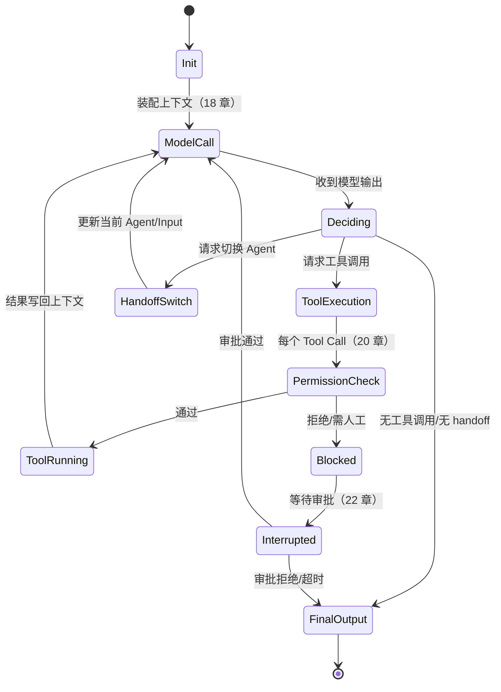

# 第十七章：Agent Loop 与运行时状态机

## 17.1 本章边界：从"控制循环"到"状态机实现"

第三章 3.7.1 节已经把 Agent 的控制循环概括为"感知—决策—行动"的往复：模型看当前状态、决定下一步、执行、把结果喂回去。那一节回答的是"谁在决定下一步"（模型 vs 预定义代码）。本章回答的是另一个问题：**harness 具体怎么把这个循环实现成一个可靠运行的状态机**——维护哪些状态、状态之间怎么转移、什么时候停、并发和流式怎么处理、失败了状态机停在哪里。这些是 harness 工程实现的核心，也是第 21、22 章（恢复、暂停）能够成立的前提。

## 17.2 状态机视角：Harness 在维护什么状态

抛开具体框架的类名，任何 Agent Loop 的实现在某一时刻都持有以下最小状态集合：

| 状态字段 | 含义 | 谁更新它 |
|---|---|---|
| `messages` | 到目前为止的完整对话/事件序列 | Harness，在每次模型调用和工具执行后追加 |
| `turn_index` | 当前是第几轮 | Harness，每完成一次"模型调用→执行"循环递增 |
| `pending_tool_calls` | 模型本轮请求、尚未执行完的工具调用 | Harness，从模型输出中解析写入，执行完成后清空 |
| `phase` | 当前处于循环的哪个阶段（见 17.3） | Harness 状态机本身 |
| `stop_reason` | 循环为什么会结束（正常完成/达到上限/被中断/出错） | Harness，在循环退出时写入 |
| `budget` | 剩余的轮数/时间/token/成本预算 | Harness，每轮消耗后递减 |

这张表里没有"任务计划""反思结果"这类内容——那些属于 Agent 的推理产物，会作为 `messages` 的一部分被状态机搬运，但状态机本身不理解其语义，只负责搬运和计数。这正是 16.4 节"是否需要在没有模型参与的情况下也能运行"这条边界规则的体现。

## 17.3 一次 Turn 内部的状态转移

Claude Agent SDK 把每一轮的内部结构描述为四步循环："Receive prompt → Evaluate and respond → Execute tools → Repeat"，其中第 2、3 步反复进行，直到模型给出不带工具调用的最终输出（[Claude Agent SDK: How the agent loop works](https://code.claude.com/docs/en/agent-sdk/agent-loop)）。OpenAI Agents SDK 的 `Runner` 用同样的结构描述内部循环：调用模型 → 若输出是最终结果则退出；若请求 handoff 则切换当前 agent 并重新进入循环；若请求工具调用则执行并把结果并回，再次调用模型（[OpenAI Agents SDK: Running agents](https://openai.github.io/openai-agents-python/running_agents/)）。抽象成状态机：

这张图里"是否有工具调用"和"是否有 handoff"是两个独立的判定分支，二者都可能同时出现在模型的一次输出里（先执行工具，再决定是否切换 agent），具体优先级由 harness 实现约定，需要在设计文档里显式写清楚，而不是留给隐式假设。

## 17.4 Loop 的终止条件与保护性上限

状态机必须有明确、可枚举的退出路径，否则"Agent 卡住不停"和"Agent 明明该停却继续跑"都会成为线上事故。至少需要四类终止条件：

- **正常完成**：模型输出不含工具调用的最终答案（"final output" 的判定标准是"产生了期望类型的文本输出，且没有工具调用"，参见 [OpenAI Agents SDK: Running agents](https://openai.github.io/openai-agents-python/running_agents/)）。
- **轮数上限**：超过 `max_turns` 直接抛出可捕获的异常（如 `MaxTurnsExceeded`），而不是无限循环或静默截断。
- **预算耗尽**：token/时间/金额预算耗尽，state 中的 `budget` 字段归零即触发终止。
- **外部中断**：用户取消、上游超时、系统关闭——这类终止必须能触发 checkpoint 写入（21 章），保证下次可以恢复而不是从零开始。

第十二章 12.16 节讨论过反思循环的 Stop Controller，第十三章 13.34 节讨论过多 Agent 场景下的取消传播——这两处都是本节"终止条件"在特定场景下的具体化，遵守同一个原则：**终止条件必须是状态机的一等公民，不能是"跑着跑着发现异常就退出"的兜底逻辑**。

## 17.5 并发与流式：状态机遇到异步事件

生产环境的 Agent Loop 很少是完全同步阻塞的：

- **流式输出**：模型输出以增量事件流的形式到达（文本 delta、工具调用参数逐步拼接完成）。状态机需要区分"收到了一个完整的可执行工具调用"和"还在流式接收参数中"，后者不能提前触发工具执行。
- **并行工具调用**：模型一次输出可能包含多个工具调用请求，harness 需要决定它们是并发执行还是顺序执行、以及执行顺序是否影响结果（例如两个工具都要写同一个文件时不能无脑并发）。
- **取消传播**：用户中途取消时，状态机需要能够安全地中断"正在流式接收"或"正在并发执行工具"的中间状态，而不是让某个工具调用变成孤儿进程继续跑。

这几类异步事件的处理方式直接决定了 harness 的可靠性上限，也是 21 章"幂等性"要解决的问题的来源之一：一次因网络问题被判定为"失败"的工具调用，服务端可能其实已经执行成功。

## 17.6 嵌套状态机：子 Agent 与 Handoff

第十三章讨论的多 Agent 协作，从状态机角度看有两种形态：

- **Handoff（切换）**：当前状态机把控制权完全转移给另一个 Agent 配置，状态（`messages` 的相关子集）随之传递，原状态机的循环终止，新循环开始（对应 17.3 图中 `HandoffSwitch`）。
- **Subagent（嵌套）**：当前状态机在自己的一步之内，启动一个全新的、独立的子状态机（有自己的 `turn_index`、`budget`、`messages`），等子状态机跑完拿到结果后，把结果作为一次"工具调用结果"塞回父状态机继续跑。Claude Agent SDK 把这种模式称为 Subagents："Spawn specialized agents for focused subtasks"（[Claude Agent SDK: Overview](https://code.claude.com/docs/en/agent-sdk/overview) 能力表）。

两者的关键区别在于**父状态机是否继续存在并等待结果**：Handoff 之后父状态机不再参与；Subagent 场景父状态机始终存在，只是把子任务的执行过程"折叠"成一次工具调用。这个区分决定了预算如何分摊——Subagent 消耗的轮数/token 通常要计入父状态机的总预算，而 Handoff 之后的消耗计入新状态机自己的预算。

## 17.7 三种实现的状态机对比

| 维度 | Claude Agent SDK | OpenAI Agents SDK | LangGraph（对比参考） |
|---|---|---|---|
| 循环驱动方式 | 内置 agent loop，SDK 内部驱动 | `Runner.run` 内部驱动，暴露三种调用方式（同步/异步/流式） | 显式的图执行引擎，节点与边由开发者定义 |
| 终止判定 | 无工具调用即视为完成一轮，可通过 hooks 干预 | 无工具调用且类型匹配即为 final output；`max_turns` 触发异常 | 图走到终止节点，或显式 `interrupt()` |
| 嵌套/切换 | Subagents（嵌套） | Handoffs（切换 current agent） | 子图（Subgraphs），见 [LangGraph: Subgraphs](https://docs.langchain.com/oss/python/langgraph/use-subgraphs) |
| 状态可见性 | 通过流式消息（`SystemMessage`/`AssistantMessage`）暴露 | 通过 `RunResult`/`RunResultStreaming` 暴露 | 状态是图上的显式字段，见[第十三章 13.15 节](../04-multi-agent/13-multi-agent-coordination.md) |

三者在"状态机长什么样"这件事上高度收敛——这不是巧合，而是因为 17.2、17.3 节描述的最小状态集合和转移逻辑，本质上是任何可靠 Agent Loop 都绕不开的工程约束，只是不同产品选择了不同的抽象层级暴露给开发者。

## 17.8 常见错误

- **把工具执行结果直接当作循环终止信号。** 工具报错不代表任务失败，也不代表循环应该终止——报错本身应该作为一条消息喂回模型，让模型决定下一步（重试、换工具、放弃），这是 Agent 层的决策，不是 Harness 层该替模型做的判断。
- **轮数上限设置为"经验值"却不告知调用方触发了上限。** 静默截断会让上游误以为任务正常完成；`MaxTurnsExceeded` 这类显式异常应该是标准实践。
- **流式场景下提前解析尚未完整的工具调用参数。** 会导致 JSON 解析失败或用不完整的参数执行工具，必须等待参数流被完整拼接。
- **混淆 Handoff 与 Subagent 的预算归属。** 会导致预算统计口径不一致，第 23 章的成本核算依赖于这里的归属规则先被定义清楚。
- **并发工具调用不做互斥控制。** 两个工具调用同时写同一份状态（文件、数据库行）时，如果没有互斥或串行化策略，会产生数据竞争，这属于第 13 章 13.16 节讨论的并发写入问题在单 Agent 场景下的对应版本。

## 17.9 本章总结

Harness 把"模型动态决定下一步"的控制循环，落地成一个维护 `messages`、`turn_index`、`pending_tool_calls`、`phase`、`stop_reason`、`budget` 六类状态的运行时状态机。一次 Turn 内部经历"模型调用→决策分支（最终输出/工具调用/Handoff）→执行→结果写回"的转移；终止条件必须显式枚举（正常完成、轮数上限、预算耗尽、外部中断）而不是隐式兜底；并发与流式给状态机引入了异步事件,需要区分"流式接收中"与"可执行"两种状态,并处理好取消传播;子 Agent 与 Handoff 是两种不同的嵌套方式,预算归属规则不同。这一层是第 18–23 章各个子系统共同依赖的执行骨架。

## 参考资料

- [Claude Agent SDK: How the agent loop works](https://code.claude.com/docs/en/agent-sdk/agent-loop)
- [OpenAI Agents SDK: Running agents](https://openai.github.io/openai-agents-python/running_agents/)
- [Anthropic: Building Effective Agents](https://www.anthropic.com/engineering/building-effective-agents)
- [LangGraph: Subgraphs](https://docs.langchain.com/oss/python/langgraph/use-subgraphs)
- [Simon Willison: Designing agentic loops](https://simonwillison.net/2025/Sep/30/designing-agentic-loops/)
