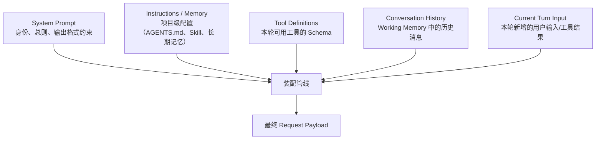

# 第十八章：Context Engineering 与上下文装配

## 18.1 本章边界：装配管线，不是压缩策略

第二章 2.8 节已经把 Context Engineering 定义为"管理有限上下文"的四类操作（Write / Select / Compress / Isolate），第十章完整展开了 Compress 这一类操作的具体方法（Sliding Window、Summarization、Structured Extraction 等）。这两处讲的是"该保留什么、该压缩什么"的**决策**问题。本章讲的是更下游的**工程**问题：harness 在每一次模型调用之前，具体把哪些来源的内容、按什么顺序、拼装成最终发给模型的那一份 payload,以及这个装配过程如何与 Prompt Cache 配合而不互相拆台。这是 17.3 节状态机图中 "装配上下文" 这一步的展开。

## 18.2 一次请求的上下文由哪些部分拼成

一次发给模型的请求，通常由五类互相独立维护的来源拼接而成：



这五类来源的生命周期不同：System Prompt 通常较稳定；Instructions/Memory 按任务或项目变化；Tool Definitions 可能随本轮上下文动态收缩（第 19 章 19.7 节）；Conversation History 追加或压缩；Current Turn Input 带来新输入。装配管线要保持消息结构和来源层级，不是把这些内容拼成同权限的一段文本。

## 18.3 装配顺序为什么重要

装配顺序不是审美问题，而是同时影响三件事：

1. **Prompt Cache 命中率。** 主流模型的 Prompt Caching 按"从头开始的最长公共前缀"匹配缓存（第十章 10.14–10.18 节已详细讨论 Prompt Caching 的机制与限制）。如果易变的内容（比如当前时间戳、本轮的工具结果）被放在前面，会导致后面几乎不变的大段内容（工具定义、系统提示词）也无法命中缓存。**装配顺序的第一条原则是：把最稳定的内容放在最前面，把最易变的内容放在最后面。**
2. **模型的注意力分配。** 位置越靠近末尾，通常获得越强的近因效应；关键指令放在系统提示词开头和当前输入结尾，往往比塞在历史消息中间更容易被遵守。
3. **工具列表序列化的稳定性。** MCP 2026-07-28 对确定性列表顺序使用的是 **SHOULD**，有助于工具列表与提示缓存；它不是 **MUST**，更不保证模型选择工具具有确定性（[Tools](https://modelcontextprotocol.io/specification/2026-07-28/server/tools)）。

这些是缓存布局原则，不能覆盖信任层级。检索文档、长期记忆、Skill 内容和模型摘要不应仅因“稳定”就被提升为系统级指令；来源与权限标签必须独立保存。不同 API 对工具字段的内部序列化顺序、显式缓存和前缀缓存支持不同，应以对应提供商为准。

## 18.4 System Prompt 的分层来源

生产级 harness 的系统提示词很少是一整块写死的字符串，而是分层拼接：

- **产品层默认指令**（harness 内置，不可被用户配置覆盖，例如安全边界）；
- **组织/项目级配置**（第三章 3.6 节讨论的 AGENTS.md 属于这一层，通常在会话开始时读取一次）；
- **技能与命令**（第三章 3.5 节的 Skill，按需渐进式披露，往往只注入摘要而非全文，直到被显式调用）；
- **运行时修改**（部分 harness 允许在会话中途追加系统级指令，例如 Claude Agent SDK 提供修改系统提示词的机制，见 [Claude Agent SDK: Modifying system prompts](https://code.claude.com/docs/en/agent-sdk/modifying-system-prompts)）。

这几层的加载时机不同：会话启动时一次性加载 vs 按需触发加载，是 18.2 节 "Instructions / Memory" 这一路输入内部还需要再拆分的子结构。

## 18.5 工具定义注入的代价

工具 Schema 占用本轮有效上下文。无状态请求常需重复提供定义，但服务端会话、工具检索与缓存可能减少传输或重复计算；“占用窗口”“网络发送字节数”和“计费 Token”不能混为一谈。第 19 章 19.7 节讨论动态工具集。预算应按实际提供商的缓存读写计价核算，不能假设每轮都按全额价格重新处理。

## 18.6 历史消息装配：从 Working Memory 到 Prompt

第七、八章定义的 Working Memory 是 harness 在进程内维护的结构化状态（近期消息、任务状态、草稿、工件引用）；装配管线要把这些结构化状态**序列化**成模型能理解的消息序列。这一步不是简单的字符串拼接，至少要处理三个问题：

- **工具调用与工具结果必须严格配对**，且 ID 匹配（第 19 章 19.3 节的调用契约）——断开配对会导致模型 API 直接拒绝请求。
- **压缩后的历史要标明是派生摘要及其来源**，保持原有信任边界，不能把包含网页指令的摘要提升为系统消息。选择消息角色时遵循 API 规则，也不能伪造没有对应调用的工具结果。
- **多模态或超大工具结果（如整份文件、长日志）不应该原样内嵌**，而应替换为引用 + 按需检索的占位符——这正是第二章 2.8.4 节 "Just-in-Time 检索" 在装配层的具体动作。

## 18.7 Just-in-Time 装配与 Prompt Cache 断点对齐

Just-in-Time 检索的思路（不预先把所有可能用到的内容塞进上下文，而是让 Agent 自己在需要时用工具去取）和 Prompt Cache 之间存在一个容易被忽略的张力：**如果 JIT 检索的结果被插入到历史消息中间，会破坏这条消息之后所有内容的缓存前缀**。因此装配管线通常约定一个显式的"缓存断点"位置——系统提示词和工具定义结束之处——只要 JIT 检索结果被追加在断点之后而不是插入断点之前，就不会使前面已经稳定的部分失效。这是 18.3 条第一条原则在实现层面的具体落地方式。

## 18.8 装配时的预算控制

装配管线在真正发起模型调用之前，需要对 18.2 节五类来源做一次预算校验。用 $B$ 表示模型上下文窗口的总预算， $b_i$ 表示第 $i$ 类来源占用的 token 数，装配必须保证：

$$
\sum_{i=1}^{5} b_i \le B - r
$$

其中 $r$ 是本轮输出与提供商计入窗口的推理 Token 预留量，还应计入多模态、消息包装等开销并留安全余量。超限时优先压缩可恢复历史、缩减工具和大结果；不可静默裁剪授权、用户硬约束或未完成调用。仍装不下时应明确报错或请求缩小任务，而不是发送语义残缺的请求。

## 18.9 一个装配管线的参考实现结构

```python
def assemble_context(session, turn_input):
    parts = []
    parts.append(load_system_prompt(session))          # 最稳定，放最前
    parts.append(load_project_instructions(session))    # AGENTS.md / Skill 摘要
    parts.append(load_tool_definitions(session))        # 稳定，紧随其后
    # --- Prompt Cache 断点 ---
    parts.append(session.working_memory.history())       # 易变，断点之后
    parts.append(turn_input)                             # 最易变，放最后
    budget_check_and_compress(parts, session.token_budget)
    return render(parts)
```

这个结构只是示意：真实实现还要处理工具调用/结果配对校验、多模态占位符展开、以及与第 21 章 checkpoint 的交互（装配前需要先从 checkpoint 恢复 Working Memory）。

## 18.10 常见错误

- **把易变内容放在提示词最前面。** 直接摧毁 Prompt Cache 命中率，是最常见也最容易被忽视的性能问题。
- **工具结果直接原样拼进历史消息，不做大小限制。** 一次调用返回的整份日志或文件会瞬间吃掉大半上下文预算，应参考第十章的压缩与摘要策略处理。
- **预算超限时统一整体截断，不分优先级。** 应该按 18.8 节的降级顺序处理，而不是简单粗暴地砍掉最早的 N 条消息（可能砍掉仍在生效的任务约束）。
- **把装配逻辑和压缩策略耦合在一起实现。** 装配管线应该只负责"按顺序拼接、校验预算、触发降级"，具体怎么压缩应该委托给独立的压缩模块（第十章），保持职责分离便于替换压缩算法。

## 18.11 本章总结

上下文装配首先保证消息合法、来源可信级别不被抬高、关键约束不丢失，再优化稳定前缀和按需检索。工具定义的窗口占用不等于每轮全价计费；缓存断点也取决于 API。预算超限不能靠静默截掉授权或待执行调用来解决。

## 参考资料

- [Anthropic: Effective context engineering for AI agents](https://www.anthropic.com/engineering/effective-context-engineering-for-ai-agents)
- [Model Context Protocol: Tools](https://modelcontextprotocol.io/specification/2026-07-28/server/tools)
- [Claude Agent SDK: Modifying system prompts](https://code.claude.com/docs/en/agent-sdk/modifying-system-prompts)
- [Anthropic Prompt Caching](https://docs.anthropic.com/en/docs/build-with-claude/prompt-caching)
- [LangChain: Context Engineering for Agents](https://blog.langchain.com/context-engineering-for-agents/)
