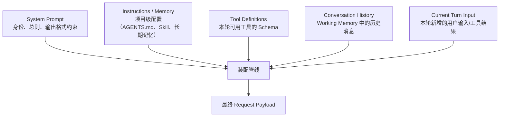

# 第十八章：Context Engineering 与上下文装配

## 18.1 一次模型调用前，Harness 要准备什么？

它要把本轮有效的指令、工具定义、历史消息和新增输入，装配成符合模型 API 契约、又不超预算的请求。内容在存储里存在，不代表模型这一轮真的看到了它；摘要写得再好，若丢了工具调用 ID 或抬高了来源权限，请求仍可能出错。第二章讨论上下文管理的选择，第十章讨论压缩策略，本章展开第 17 章状态机中的实际装配步骤。

## 18.2 一次请求的上下文由哪些部分拼成

一次发给模型的请求，通常由五类互相独立维护的来源拼接而成：



这五类来源的生命周期不同：System Prompt 通常较稳定；Instructions/Memory 按任务或项目变化；Tool Definitions 可能随本轮上下文动态收缩（第 19 章 19.7 节）；Conversation History 追加或压缩；Current Turn Input 带来新输入。装配管线要保持消息结构和来源层级，不是把这些内容拼成同权限的一段文本。

## 18.3 装配顺序为什么重要

装配顺序不是审美问题，而是同时影响三件事：

1. **Prompt Cache 命中率。** 对按前缀复用的缓存，易变内容放在前面，会使后面的稳定内容也失去复用机会。例如 OpenAI 的 Prompt Caching 要求渲染后的前缀匹配，并受模型、最小长度、断点和保留策略约束（见参考资料）。在不改变消息语义和信任层级的前提下，优先让稳定内容在前、易变内容在后；其他缓存接口不能直接套用相同参数。
2. **关键信息能否被有效利用。** 历史中间的约束可能被忽略，但效果取决于模型、任务、长度与消息角色，不能把“越靠后越好”当保证。应通过遗漏约束的回归样例判断布局是否有效，而不是只凭位置猜测。
3. **工具列表序列化的稳定性。** MCP 2026-07-28 对确定性列表顺序使用的是 **SHOULD**，有助于工具列表与提示缓存；它不是 **MUST**，更不保证模型选择工具具有确定性（[Tools](https://modelcontextprotocol.io/specification/2026-07-28/server/tools)）。

这些是缓存布局原则，不能覆盖信任层级。检索文档、长期记忆、Skill 内容和模型摘要不应仅因“稳定”就被提升为系统级指令；来源与权限标签必须独立保存。不同 API 对工具字段的内部序列化顺序、显式缓存和前缀缓存支持不同，应以对应提供商为准。

## 18.4 指令有层级，是否就都应放进 System Prompt？

不是。宿主要区分配置来源，再按消息协议和信任策略装配；“来自项目配置”不等于“具有系统级权限”。常见来源包括：

- **产品层默认指令**（表达产品行为与规则；真正不可绕过的安全边界仍由执行器强制实施）；
- **组织/项目级配置**（第三章 3.6 节讨论的 AGENTS.md 属于这一层，通常在会话开始时读取一次）；
- **技能与命令**（第三章 3.5 节的 Skill，按需渐进式披露，往往只注入摘要而非全文，直到被显式调用）；
- **应用传入的系统提示配置**（例如 Claude Agent SDK 的预设、`append` 和自定义 `system_prompt`，见 [Modifying system prompts](https://code.claude.com/docs/en/agent-sdk/modifying-system-prompts)）。配置系统提示不等于 SDK 支持任意时刻热更新；项目文件的内容也可能作为对话上下文注入，而不是改写 system 字段。

这些来源的加载时机也不同：有的在会话启动时读取，有的按需加载。来源层级、加载时机和最终消息角色是三个独立决定，不能用一次字符串拼接代替。

## 18.5 工具定义注入的代价

工具 Schema 占用本轮有效上下文。无状态请求常需重复提供定义，但服务端会话、工具检索与缓存可能减少传输或重复计算；“占用窗口”“网络发送字节数”和“计费 Token”不能混为一谈。第 19 章 19.7 节讨论动态工具集。预算应按实际提供商的缓存读写计价核算，不能假设每轮都按全额价格重新处理。

## 18.6 历史消息装配：从 Working Memory 到 Prompt

第七、八章定义的 Working Memory 包含近期消息、任务状态、草稿和工件引用，可以驻留内存，也可以由 checkpoint 持久化。装配管线要从中选择本轮所需部分，**序列化**成合法消息序列。这一步不是简单的字符串拼接，至少要处理三个问题：

- **工具调用与工具结果按 API 契约配对**，且 ID 匹配（第 19 章 19.3 节）。在要求完整调用/结果序列的接口中，断开配对可能使请求被拒绝；使用服务端会话时也要维护关联，不能凭空补出结果。
- **压缩后的历史要标明是派生摘要及其来源**，保持原有信任边界，不能把包含网页指令的摘要提升为系统消息。选择消息角色时遵循 API 规则，也不能伪造没有对应调用的工具结果。
- **超出预算或当前不需要的大结果**可保留引用，再按需读取相关片段。例如长日志先返回错误摘要与定位信息，原件保存在工件存储；当前判断确实依赖图像或完整文件且预算允许时，仍可直接提供。引用只有在后续工具可访问时才有用，不能用不可解引用的路径代替关键证据。

## 18.7 Just-in-Time 装配与 Prompt Cache 断点对齐

Just-in-Time 检索让 Agent 在需要时取内容，而不是预先塞入所有资料。对前缀缓存，**把新结果插入历史中间，会改变该位置之后的前缀**；追加到历史末尾则能保留此前的匹配条件。支持显式断点的 API 可以把断点设在合适的稳定区段；采用隐式缓存的接口则由服务端决定可复用位置。这里保住的是命中条件，不是命中保证，条目过期、路由与模型配置变化仍可能导致未命中。

## 18.8 装配时的预算控制

装配管线在真正发起模型调用之前，需要对 18.2 节五类来源做一次预算校验。用 $B$ 表示模型上下文窗口的总预算， $b_i$ 表示第 $i$ 类来源占用的 token 数，装配必须保证：

$$
\sum_{i=1}^{5} b_i \le B - r
$$

其中 $r$ 是本轮输出与提供商计入窗口的推理 Token 预留量，还应计入多模态、消息包装等开销并留安全余量。超限时优先压缩可恢复历史、缩减工具和大结果；不可静默裁剪授权、用户硬约束或未完成调用。仍装不下时应明确报错或请求缩小任务，而不是发送语义残缺的请求。

## 18.9 一个装配管线的参考实现结构

```python
def assemble_context(session, turn_input):
    parts = []
    parts.append(load_system_prompt(session))          # 最稳定，放最前
    parts.append(load_project_instructions(session))    # AGENTS.md / Skill 摘要
    parts.append(load_tool_definitions(session))        # 稳定，紧随其后
    # --- Prompt Cache 断点 ---
    parts.append(session.working_memory.history())       # 易变，断点之后
    parts.append(turn_input)                             # 最易变，放最后
    budget_check_and_compress(parts, session.token_budget)
    return render(parts)
```

这个结构只是职责示意，不是某个模型 API 的请求格式。`render` 必须分别保留消息角色、工具字段和来源标记，列表顺序不保证等于提供商内部渲染顺序；注释中的断点也不会自动启用缓存。真实实现还要校验调用/结果配对、多模态内容与引用可达性。只有恢复任务时才需要从第 21 章的 checkpoint 重建状态，不必每次装配都重新加载完整快照。

## 18.10 常见错误

- **把易变内容放在提示词最前面。** 可能让后面大段稳定内容无法复用，应按提供商返回的缓存用量观察影响。
- **工具结果直接原样拼进历史消息，不做大小限制。** 一次调用返回的整份日志或文件会瞬间吃掉大半上下文预算，应参考第十章的压缩与摘要策略处理。
- **预算超限时统一整体截断，不分优先级。** 应该按 18.8 节的降级顺序处理，而不是简单粗暴地砍掉最早的 N 条消息（可能砍掉仍在生效的任务约束）。
- **把装配逻辑和压缩策略耦合在一起实现。** 装配管线应该只负责"按顺序拼接、校验预算、触发降级"，具体怎么压缩应该委托给独立的压缩模块（第十章），保持职责分离便于替换压缩算法。

## 18.11 本章总结

上下文装配首先保证消息合法、来源可信级别不被抬高、关键约束不丢失，再优化稳定前缀和按需检索。工具定义的窗口占用不等于每轮全价计费；缓存断点也取决于 API。预算超限不能靠静默截掉授权或待执行调用来解决。

## 参考资料

- [Anthropic: Effective context engineering for AI agents](https://www.anthropic.com/engineering/effective-context-engineering-for-ai-agents)
- [Model Context Protocol: Tools](https://modelcontextprotocol.io/specification/2026-07-28/server/tools)
- [Claude Agent SDK: Modifying system prompts](https://code.claude.com/docs/en/agent-sdk/modifying-system-prompts)
- [OpenAI: Prompt caching](https://developers.openai.com/api/docs/guides/prompt-caching)：前缀匹配、模型差异与缓存断点，查阅于 2026-09-15。
- [Anthropic Prompt Caching](https://docs.anthropic.com/en/docs/build-with-claude/prompt-caching)：保留原技术来源；本轮访问跳转至区域不可用页面，未据此确认当前参数。
- [LangChain: Context Engineering for Agents](https://blog.langchain.com/context-engineering-for-agents/)
