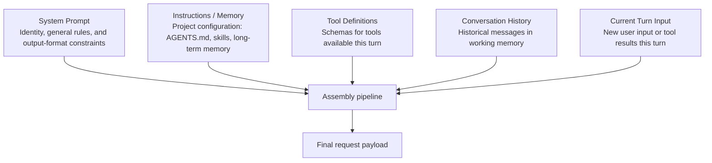

# Chapter 18: Context Engineering and Context Assembly

## 18.1 What must the harness prepare before a model call?

It must assemble the instructions, tool definitions, history, and new input that apply to this turn into a request that satisfies the model API's contract and fits the budget. Content existing in storage does not mean the model actually sees it this turn. Even an excellent summary can produce an invalid request if it loses tool-call IDs or elevates the authority of its sources. Chapter 2 discusses context-management choices, and Chapter 10 covers compression strategies. This chapter examines the actual assembly step in Chapter 17's state machine.

## 18.2 What makes up a request's context?

A request sent to a model typically combines five independently maintained sources:



These sources have different lifecycles. The system prompt is usually relatively stable; instructions and memory vary by task or project; tool definitions may be dynamically narrowed for the current context (Section 19.7); conversation history grows or is compressed; and the current turn brings new input. The assembly pipeline must preserve message structure and source authority, not flatten everything into one block of text with equal privileges.

## 18.3 Why does assembly order matter?

Assembly order is not a matter of aesthetics. It affects three things at once:

1. **Prompt-cache hit rate.** With prefix-based caching, placing volatile content first also prevents reuse of stable content that follows it. OpenAI Prompt Caching, for example, requires a matching rendered prefix and is subject to model support, minimum lengths, breakpoints, and retention policies (see References). Prefer stable content first and volatile content later, provided that this does not change message semantics or trust levels. Other caching interfaces do not necessarily accept the same parameters.
2. **Whether important information is used effectively.** Constraints in the middle of a long history may be overlooked, but the effect depends on the model, task, length, and message roles. “Later is better” is not a guarantee. Test layouts with regression cases for omitted constraints rather than judging them by position alone.
3. **Stable serialization of tool lists.** MCP 2026-07-28 uses **SHOULD** for deterministic list ordering, which helps tool-list and prompt caching. It is not **MUST**, and it certainly does not guarantee deterministic tool selection by the model ([Tools](https://modelcontextprotocol.io/specification/2026-07-28/server/tools)).

These are cache-layout principles, not a reason to override trust boundaries. Retrieved documents, long-term memory, skill content, and model-generated summaries must not become system-level instructions merely because they are “stable.” Source and permission labels must be retained independently. APIs differ in their internal serialization order for tool fields and their support for explicit and prefix caching; follow the relevant provider's contract.

## 18.4 If instructions have a hierarchy, should they all go in the system prompt?

No. The host must distinguish configuration sources, then assemble them according to the message protocol and trust policy. “Comes from project configuration” does not mean “has system-level authority.” Common sources include:

- **Product-level default instructions**, expressing product behavior and rules; genuinely non-bypassable safety boundaries still need enforcement by the executor.
- **Organization- or project-level configuration**, including the AGENTS.md files discussed in Section 3.6, typically read once at session startup.
- **Skills and commands**, such as the skills in Section 3.5, disclosed progressively on demand. Often only a summary is injected until the skill is explicitly invoked.
- **Application-supplied system-prompt configuration**, such as the Claude Agent SDK's presets, `append`, and custom `system_prompt` (see [Modifying system prompts](https://code.claude.com/docs/en/agent-sdk/modifying-system-prompts)). Configuring a system prompt does not imply support for hot updates at arbitrary times. Project-file content may also be injected into conversation context rather than rewriting the system field.

Loading times differ too: some sources are read at session startup, others on demand. Source authority, loading time, and final message role are three separate decisions; a single string concatenation cannot substitute for them.

## 18.5 The cost of injecting tool definitions

Tool schemas consume effective context for the current turn. Stateless requests often need to include the definitions again, but server-side sessions, tool retrieval, and caching may reduce transmission or repeated computation. Context-window occupancy, bytes sent over the network, and billed tokens are different quantities. Section 19.7 discusses dynamic tool sets. Budget against the provider's actual cache-read and cache-write prices rather than assuming every turn reprocesses everything at full price.

## 18.6 Assembling history: from working memory to the prompt

The working memory defined in Chapters 7 and 8 includes recent messages, task state, drafts, and artifact references. It may live in memory or be persisted through checkpoints. The assembly pipeline selects what is needed for the current turn and **serializes** it into a valid message sequence. This is not simple string concatenation; at least three issues must be handled:

- **Pair tool calls and tool results according to the API contract**, with matching IDs (Section 19.3). Interfaces that require complete call/result sequences may reject requests with broken pairs. Server-side sessions also require these associations; they do not permit inventing results.
- **Mark compressed history as a derived summary and retain its sources.** Preserve the original trust boundary: a summary containing instructions from a web page must not be elevated to a system message. Follow API rules when assigning message roles, and do not fabricate tool results without corresponding calls.
- **Keep references to large results that exceed the budget or are not currently needed**, then read relevant excerpts on demand. For example, return an error summary and location information for a long log while storing the original in artifact storage. If a current decision genuinely requires an image or a complete file and the budget permits it, supply it directly. A reference is useful only if a later tool can access it; an unresolvable path cannot replace essential evidence.

## 18.7 Just-in-time assembly and prompt-cache breakpoint alignment

Just-in-time retrieval lets an agent fetch content when needed instead of preloading every source. With prefix caching, **inserting a new result into the middle of history changes the prefix from that position onward**; appending it preserves the earlier matching conditions. APIs with explicit breakpoints can place them at suitable stable boundaries, whereas implicit caching lets the server choose reusable positions. This preserves eligibility for a cache hit, not a guarantee of one. Expiration, routing, and model-configuration changes can still cause misses.

## 18.8 Budget control during assembly

Before making the model call, the assembly pipeline must check the budget across the five sources in Section 18.2. Let $B$ be the total model context-window budget and $b_i$ the token count of source $i$. Assembly must satisfy:

$$
\sum_{i=1}^{5} b_i \le B - r
$$

Here, $r$ reserves space for this turn's output and any reasoning tokens the provider counts against the window. Also account for multimodal content, message wrappers, and other overhead, with a safety margin. If the request is too large, first compress recoverable history and reduce tool definitions and large results. Never silently trim authorization information, hard user constraints, or unfinished calls. If the content still does not fit, return an explicit error or request a narrower task rather than send a semantically incomplete request.

## 18.9 A reference structure for an assembly pipeline

```python
def assemble_context(session, turn_input):
    parts = []
    parts.append(load_system_prompt(session))          # Most stable; put first
    parts.append(load_project_instructions(session))    # AGENTS.md / skill summaries
    parts.append(load_tool_definitions(session))        # Stable; place next
    # --- Prompt-cache breakpoint ---
    parts.append(session.working_memory.history())       # Volatile; after the breakpoint
    parts.append(turn_input)                             # Most volatile; put last
    budget_check_and_compress(parts, session.token_budget)
    return render(parts)
```

This structure illustrates responsibilities; it is not a request format for a particular model API. `render` must preserve message roles, tool fields, and source labels separately. List order does not necessarily equal the provider's internal rendering order, and the breakpoint comment does not enable caching by itself. A real implementation must also validate call/result pairing, multimodal content, and reference accessibility. Rebuilding state from the checkpoints in Chapter 21 is necessary when recovering a task, not before every assembly operation.

## 18.10 Common mistakes

- **Putting volatile content at the start of the prompt.** This may prevent reuse of large stable sections that follow it. Observe the effect through the provider's reported cache usage.
- **Appending raw tool results to history without size limits.** A full log or file returned by one call can immediately consume most of the context budget. Apply the compression and summarization strategies from Chapter 10.
- **Truncating everything uniformly when the budget is exceeded.** Follow the priority order in Section 18.8 rather than simply deleting the earliest N messages, which may contain task constraints that still apply.
- **Coupling assembly logic to a particular compression strategy.** The assembly pipeline should assemble in order, validate the budget, and trigger reduction when needed. Delegate the details of compression to an independent module, as discussed in Chapter 10, so that compression algorithms can be replaced without changing assembly responsibilities.

## 18.11 Chapter summary

Context assembly must first ensure valid messages, prevent elevation of source authority, and preserve essential constraints. Stable prefixes and on-demand retrieval come afterward. Tool definitions occupying the context window does not mean full-price billing every turn, and cache breakpoints depend on the API. Silent removal of authorization information or pending calls is not an acceptable response to an oversized request.

## References

- [Anthropic: Effective context engineering for AI agents](https://www.anthropic.com/engineering/effective-context-engineering-for-ai-agents)
- [Model Context Protocol: Tools](https://modelcontextprotocol.io/specification/2026-07-28/server/tools)
- [Claude Agent SDK: Modifying system prompts](https://code.claude.com/docs/en/agent-sdk/modifying-system-prompts)
- [OpenAI: Prompt caching](https://developers.openai.com/api/docs/guides/prompt-caching): prefix matching, model differences, and cache breakpoints; accessed in the source review on 2026-09-15.
- [Anthropic Prompt Caching](https://docs.anthropic.com/en/docs/build-with-claude/prompt-caching): retained as the original technical source. Access during the source review redirected to a region-unavailable page, so it was not used to confirm current parameters.
- [LangChain: Context Engineering for Agents](https://blog.langchain.com/context-engineering-for-agents/)
