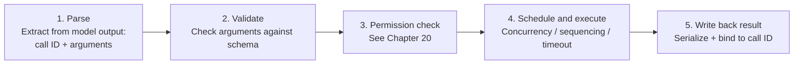

# Chapter 19: Tool Registries, Call Contracts, and Execution Pipelines

## 19.1 Once the model selects a tool, what remains before execution?

The host must still determine which executor the model selected, whether the arguments are valid, whether the current identity is authorized to invoke it, and how the result will be associated with the original request. If two servers expose `search`, the shared name does not imply equivalent capabilities. Nor does a timeout prove that a tool did not execute. This chapter follows the path from registry to result writeback, expanding Chapter 17's `ToolExecution` stage. For tool concepts, see Chapter 3; for protocol structure, see [MCP Components](../../tools/02-mcp/05-mcp-components.md).

## 19.2 Tool registry: registration, discovery, and deduplication

The registry is the harness's source of truth for tools available in the current session. It must solve at least three problems:

- **Combining multiple sources:** built-in tools, MCP server tools, and host-plugin tools all enter the registry. A skill may reference tools or include scripts, but `SKILL.md` is not itself a tool-registration protocol; the host still needs an executor adapter.
- **Naming conflicts and deduplication:** multiple MCP servers may provide tools with the same name, such as two different `search` tools. The registry needs namespace prefixes or explicit routing rules to disambiguate them. Prefixes should bind to service identities in host configuration. MCP's `serverInfo.name` is not guaranteed to be unique across servers, so a server's self-reported name is not sufficient.
- **Dynamic changes:** in MCP 2026-07-28, `listChanged` declares notification support, and the client must also open `subscriptions/listen` with `toolsListChanged: true` to receive tool-list change notifications. Lists may vary over time and by the authorization presented on a request, but must not vary by connection or as a side effect of other requests on that connection ([Tools](https://modelcontextprotocol.io/specification/2026-07-28/server/tools)). Caches must distinguish authorization scopes. Re-list tools after a notification, and never reuse a private tool list across tenants.

The specification uses **SHOULD** for deterministic ordering. This helps caching but is not the only mechanism for detecting changes. The registry should also pin tool sources, schema/description versions, and executor mappings. Recheck trust after a list update; an approved call must not silently be rebound to a new tool.

This discussion follows version 2026-07-28, officially marked **Current**: ready for use and still open to backward-compatible changes. It is neither Draft nor a frozen Final version. Tool-list caches must also honor this version's `ttlMs` and `cacheScope`; tool names alone do not determine cache validity.

## 19.3 The call contract: from tool call to tool result

Within the harness, a tool invocation must associate at least a call ID, tool name, validated arguments, and execution status. When the invocation finishes, write back its content and status under the corresponding ID. On timeout, record “outcome unknown” rather than inventing success. The central requirement is **bidirectional traceability through the call ID**: a result identifies its request, and a request identifies its processing progress. Model interfaces that require complete call/result pairing will reject a sequence with missing results. The harness must complete, reject, or explicitly terminate these calls before continuing under the interface's rules, not silently discard them.

## 19.4 Five stages in the execution pipeline

A tool call passes through five explicit stages between the model's request and the result's return to context:

- **Parse:** for streaming responses, wait until all JSON argument chunks have been assembled, as discussed in Section 17.5. Parsing too early produces invalid JSON.
- **Validate:** check argument types, required fields, and value ranges against the tool's declared `inputSchema`. A call that fails validation should not reach execution. Instead, construct an “invalid arguments” result and return it to the model so it can correct the arguments and try again.
- **Check permissions:** the subject of Chapter 20. Decide whether to allow the call automatically, require human approval, or deny it outright.
- **Schedule and execute:** run the actual tool logic, accounting for concurrency, timeouts, and resource limits (Section 19.5).
- **Write back the result:** serialize the output or error into a form the model can understand and bind it to the original call ID.

## 19.5 Scheduling: concurrency, sequencing, and timeouts

A single model output may request several tool calls. The harness must choose a scheduling policy explicitly rather than implicitly running everything in parallel whenever possible:

- **Read-only tools**, such as search and query tools, can usually run concurrently.
- **Interdependent tools with side effects**, such as successive edits to the same file, require sequential execution. Alternatively, the harness can detect target-resource conflicts and fall back to serialization.
- **Each tool call needs its own timeout budget**, nested within the larger budget for the turn and ultimately the session. Section 21.5 develops this hierarchical timeout design. A timeout should produce an explicit timeout error result, not leave the call suspended indefinitely and block the entire state machine.

Tool-level guardrails in the OpenAI Agents SDK can insert business checks before and after execution of a configured `FunctionTool` ([Guardrails](https://openai.github.io/openai-agents-python/guardrails/)). This is not a global switch that automatically covers every tool: hosted tools, handoffs, and built-in execution tools may not use the same pipeline, so verify coverage. An output check runs after execution. It can prevent further propagation of a result, but cannot undo side effects that have already occurred.

## 19.6 Result writeback and first-class errors

Recoverable tool business errors should be returned as structured results with call IDs. The runtime decides when permission violations, exhausted budgets, or corrupted state require stopping. Distinguish “not executed,” “execution failed,” and “outcome unknown”; a timeout in particular does not prove that the remote system produced no side effects. Retain error codes, retryability, and redacted summaries rather than sending credentials or complete internal stack traces to the model. MCP protocol errors and tool-level business errors marked with `isError` are also different categories.

## 19.7 Dynamic tool sets: three ways to reduce fixed overhead

Section 18.5 distinguishes the context occupancy, transmission, and billing costs of tool definitions. Three engineering mechanisms reduce the amount of unnecessary definition and result data sent to the model:

- **Progressive disclosure:** Section 3.5.3 discusses progressive disclosure for skills. The corresponding tool-level technique includes only the task-relevant subset in the current request. Other tools remain registered but unassembled until they are needed.
- **Code execution with MCP:** let the model generate code that calls tools instead of placing every tool's complete schema in context. The model initially needs to know about a code execution environment and an API index; it can read the detailed parameters on demand when preparing execution ([Anthropic: Code execution with MCP](https://www.anthropic.com/engineering/code-execution-with-mcp)). [Cloudflare's Code Mode](https://blog.cloudflare.com/code-mode/) is another implementation of this idea.
- **Retrieval-based tool selection:** when a system has hundreds or thousands of tools, use retrieval rather than full enumeration to decide which tools to expose this turn. [RAG-MCP](https://arxiv.org/abs/2505.03275) describes this approach to prompt bloat caused by excessive tool definitions.

All three turn the decision to include a tool's full definition in the current context from a static choice into a dynamic one. In effect, each is a pluggable component of Chapter 18's assembly pipeline.

## 19.8 Common mistakes

- **Reading the validation order as a requirement that every system parse business arguments first.** Outer authentication, request-size limits, and tool-visibility checks can reject requests earlier. Authorization that depends on arguments should follow side-effect-free schema validation and path normalization; object versions and permissions should then be checked again at execution.
- **Losing the call-ID association during result writeback.** After concurrent tool execution, results not strictly bound to their original call IDs can be assigned to the wrong requests. Correct pairing is a prerequisite for advancing Chapter 17's state machine.
- **Setting only a turn-level timeout, with no individual tool timeouts.** A single stuck call can ruin the responsiveness of the entire session. Use the nested timeout budgets in Section 19.5.
- **Assuming every tool call can be parallelized blindly.** Ignoring resource contention creates a single-agent version of the concurrent-write problem in Section 13.16.
- **Optimizing tool count without measuring cache behavior or retrieval misses.** A large but stable list may hit the cache; a frequently changing candidate list may disrupt the prefix instead. Evaluate dynamic tool sets on recall, success rate, tokens, and latency together.

## 19.9 Chapter summary

The registry manages tool identity, definition versions, and authorization-based visibility; the execution pipeline manages individual invocations. Check dependencies and resource conflicts before parallel execution, and retain call IDs and execution status when returning results. “Timed out, outcome unknown” must not be disguised as “not executed.” Dynamic disclosure and code execution optimize how context is handled; they must not bypass the same permission, audit, and idempotency controls.

## References

- [Model Context Protocol: Tools](https://modelcontextprotocol.io/specification/2026-07-28/server/tools)
- [Model Context Protocol: Versioning](https://modelcontextprotocol.io/specification/versioning): the Current status and revision rules for 2026-07-28; accessed in the source review on 2026-09-15.
- [OpenAI Agents SDK: Guardrails](https://openai.github.io/openai-agents-python/guardrails/)
- [Anthropic: Code execution with MCP](https://www.anthropic.com/engineering/code-execution-with-mcp)
- [Cloudflare: Code Mode — the better way to use MCP](https://blog.cloudflare.com/code-mode/)
- [RAG-MCP: Mitigating Prompt Bloat in LLM Tool Selection via Retrieval-Augmented Generation](https://arxiv.org/abs/2505.03275)
