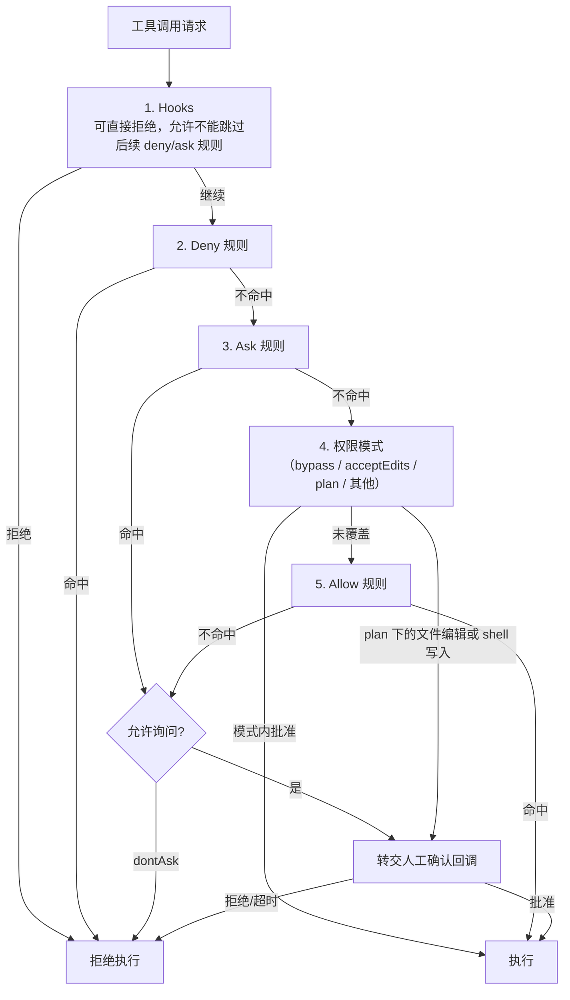

# 第二十章：权限、沙箱与隔离

## 20.1 人已经批准了，为什么还要隔离执行？

批准一次命令，只表示同意该操作，不代表命令里的程序没有缺陷，更不代表它可以访问整台机器。权限判定限制“允许做什么”，沙箱限制“执行时能接触什么”。第十五章从提示注入的威胁出发，本章继续看运行时如何落实这两种边界，即使错误不是由攻击者引起，也不能省略它们。

## 20.2 权限模型：从布尔开关到分级规则引擎

最简单的权限模型是一个全局布尔开关（"允许执行命令"/"不允许"），但生产级 harness 需要更细粒度的分级：按工具类型（读 vs 写）、按具体命令模式（`Bash(rm *)` 这类带参数模式匹配的规则）、按目标路径是否属于"关键路径"。Claude Agent SDK 的权限系统是这类分级规则引擎的典型实现，它把每一次工具请求的判定过程明确为一条**有序**的判定链（[Claude Agent SDK: Configure permissions](https://code.claude.com/docs/en/agent-sdk/permissions)）：

这张图是 Claude Agent SDK 的简化路径，不是所有 Harness 的权限标准。命中 deny 是拒绝，不是转人工；`dontAsk` 中需要确认的调用会被拒绝。`plan` 下文件编辑和 shell 写入不能靠 allow 规则自动批准。关键路径删除、`auto` 模式及禁用权限提示的配置另有分支，应按具体版本核对；官方的关键路径例外不是所有危险操作的通用保障。

还要区分 **allow 列表与能力白名单**：该 SDK 的 `allowed_tools` 表示预批准，未列出的工具未必被禁用；搭配 `bypassPermissions` 时其他工具仍可能自动执行。已在前面获准的调用通常不经过 `canUseTool`，所有调用都必须执行的检查应放在受支持的前置 Hook 或更低层执行边界，不能只放审批回调。

## 20.3 审批规则的三种粒度

- **粗粒度（按工具名）**：如 Claude Agent SDK 的 `disallowed_tools=["Bash"]` 会在请求中移除该工具定义。其他 Harness 可以只在执行端拒绝，不能把“禁用”与“模型不可见”当作普遍等价；即使隐藏了工具，也仍需拒绝越权请求。
- **细粒度（按参数模式）**：如 `Bash(rm *)`，只拦截特定参数形态的调用，其余调用正常放行，需要在权限判定之前先完成 19.4 节的参数解析。
- **需要用户交互的工具**：Claude Code 的 `_meta["anthropic/requiresUserInteraction"]` 是厂商扩展，官方标注需 v2.1.199 或更新版本，不是 MCP 通用授权字段。在支持它的宿主中可触发审批，但 `dontAsk` 会拒绝而不是弹窗。其他客户端是否识别，必须单独确认。

这三种规则可以组合，代价取决于宿主已有的审批和执行设施，并没有固定的递增顺序。参数模式只匹配约定的形式，也不能代替沙箱或资源级授权。

## 20.4 执行隔离的三种技术路线

权限判定决定是否执行，隔离限制执行时可访问的资源。下面三类技术可以组合，不能按名称简单排列安全强度；配置、内核接口、网络、挂载和凭据同样决定边界：

| 路线 | 代表技术 | 原理 | 权衡 |
|---|---|---|---|
| 内核策略 | seccomp-bpf、AppArmor、SELinux | seccomp 过滤系统调用；AppArmor/SELinux 通过 LSM 实施访问控制 | 通常开销较低，但策略覆盖与维护困难，不能替代其他隔离层 |
| 应用级内核隔离 | gVisor（`runsc`） | 用户态应用内核处理大量系统调用，缩小直接暴露的主机内核接口 | 增加隔离层，但有兼容性与 I/O 性能取舍，仍依赖主机及配置 |
| 硬件级虚拟化 | KVM/Xen、Firecracker microVM | 使用独立 guest kernel 与虚拟硬件边界 | 代价取决于实现与快照策略；共享目录、网络和密钥不会因此自动安全 |

运行不可信生成代码时，可以结合应用级内核隔离或轻量 microVM 减少主机暴露面，同时测量启动、I/O 和资源成本。选型依据是威胁模型与实际兼容性，不是把这三行当作固定的安全等级。

## 20.5 网络出口控制

即便文件系统和进程已经隔离，只要沙箱同时接触私有数据、不可信输入并能任意出网，第十五章讨论的数据外泄风险就仍然存在。网络出口控制通常采用**默认拒绝、按需放行**，而不是只给一个“能不能上网”的总开关。它与进程隔离互补：程序不用逃出沙箱，也可能把数据发出去。放行域名同样不是内容审查，合法目的地上的上传接口仍可能接收敏感内容。

GitHub Copilot cloud agent 的内置防火墙是具体产品例子，但只覆盖其支持环境中由 Agent 的 Bash 工具启动的进程，不覆盖 MCP Server 或 setup steps 启动的进程。自托管 Runner 和 Windows 也不能沿用该内置防火墙，必须另设网络控制，不能把“已打开防火墙”理解为所有流量都受控（见 20.8 节及参考资料）。

## 20.6 文件系统与凭据隔离

- **文件系统作用域**：沙箱应该只挂载任务真正需要的目录，而不是整个主机文件系统；系统配置、其他用户的工作区，以及仓库中可改变执行行为的 `.git/config`、hooks 等元数据都要单独限制，不能因为属于仓库就一律可写。
- **凭据不进入 Context**：优先由隔离的工具服务或凭据代理使用短期、限权凭据。把密钥放进可运行任意代码的进程环境变量，生成代码仍可能读取并打印它；“不写进 Prompt”不等于“模型无法取得”。日志、错误与工具结果也要脱敏。
- **多租户共享基础设施上的强隔离**：如果多个用户的 Agent 会话共享底层计算资源，文件系统和网络命名空间必须严格按租户隔离，防止一个会话内生成的恶意或有缺陷的代码影响到其他租户的会话。

## 20.7 多租户与并发会话隔离

一个 harness 实例通常要同时服务多个独立会话（不同用户、不同任务）。除了 20.6 节的资源隔离之外，还需要保证：

- 每个会话的 Working Memory、checkpoint（第 21 章）互不可见，即使它们运行在同一台物理机器上；
- 并发会话之间的资源配额（并发工具调用数、CPU/内存）需要相互隔离，防止一个失控的会话耗尽整个实例的资源导致其他会话被拖垮；
- 审计日志需要能够按会话、按租户切分，这是第 23 章可观测性能够落地问题排查和成本核算的前提。

## 20.8 案例：GitHub Copilot Coding Agent 的沙箱与防火墙

GitHub Copilot Coding Agent 把每次任务运行放在"由 GitHub Actions 提供的一次性开发环境"里执行：Copilot 在这个环境里探索代码、修改文件、跑测试和 lint（[GitHub Docs: Configure the development environment for Copilot cloud agent](https://docs.github.com/en/copilot/how-tos/copilot-on-github/customize-copilot/customize-cloud-agent/customize-the-agent-environment)）。这个设计体现了本章的多个原则：

- **一次性环境**减少运行实例残留，但外部数据库、缓存、构建产物和凭据并不会随进程销毁自动消失；是否跨租户隔离仍须查看 Runner、存储和访问控制配置；
- **`copilot-setup-steps.yml` 只能定制固定的一组字段**（`steps`、`permissions`、`runs-on`、`services`、`snapshot`、`timeout-minutes` 等），其余运行时行为不可被仓库配置覆盖——这是 16.2.6 节 "Control Plane" 与 Harness 分工的具体例子：仓库开发者能配置"环境里预装什么"，但不能改写"循环本身怎么调度"；
- **可定制的防火墙**在其覆盖的进程和环境内限制出网目的地；MCP、setup steps、自托管 Runner 等路径需另行治理，对应 20.5 节；
- **组织级 Runner 与防火墙策略**由组织管理员配置，组织决定仓库是否可覆盖默认 Runner、关闭防火墙或添加规则——不能由仓库自行解除组织锁定。这是 Control Plane 对 Harness 设置边界的例子。

## 20.9 常见错误

- **判定顺序把权限模式放在 deny 规则之前。** 会导致"自动批准一切"的模式下危险操作绕过了本应生效的黑名单，20.2 节的判定链顺序不能随意调整。
- **把网络隔离等同于文件系统隔离。** 两者是独立的攻击面，防住了文件系统逃逸不代表防住了数据外泄，需要同时设计。
- **多租户场景下审计日志不区分会话/租户。** 出现问题时无法定位是哪个会话触发的,也无法支撑第 23 章的成本核算。
- **把不进 Prompt 等同于凭据隔离。** 任意代码执行器可读取自己环境中的密钥；应尽量由独立工具服务代理凭据使用，限制权限、有效期及结果泄露。
- **认为容器化本身就是足够的隔离。** 普通容器共享主机内核，面对"运行不可信生成代码"这种场景，通常需要 20.4 节更强的隔离路线（应用级内核隔离或硬件级虚拟化）作为纵深防御。

## 20.10 本章总结

审批、授权、隔离分别回答“是否获得确认”“是否有权执行”“执行时能接触什么”。SDK 的规则顺序与扩展字段需要按版本核实，不能当成 MCP 标准。沙箱、网络出口、凭据代理和租户隔离互相补充；任何一项都不能由“用了容器”或“一次性环境”代替。

## 参考资料

- [Claude Agent SDK: Configure permissions](https://code.claude.com/docs/en/agent-sdk/permissions)
- [gVisor 文档](https://gvisor.dev/docs/)
- [GitHub Docs: Configure the development environment for Copilot cloud agent](https://docs.github.com/en/copilot/how-tos/copilot-on-github/customize-copilot/customize-cloud-agent/customize-the-agent-environment)
- [GitHub Docs: Customizing or disabling the firewall](https://docs.github.com/en/copilot/how-tos/copilot-on-github/customize-copilot/customize-the-firewall)
- [Simon Willison: Designing agentic loops](https://simonwillison.net/2025/Sep/30/designing-agentic-loops/)
- [Simon Willison: The lethal trifecta for AI agents](https://simonwillison.net/2025/Jun/16/the-lethal-trifecta/)

SDK 权限顺序与 GitHub 环境、防火墙范围按 2026-09-15 的官方文档核对；`anthropic/requiresUserInteraction` 的 v2.1.199 前提保留。未在本轮运行 SDK 权限实验或配置云端环境。
