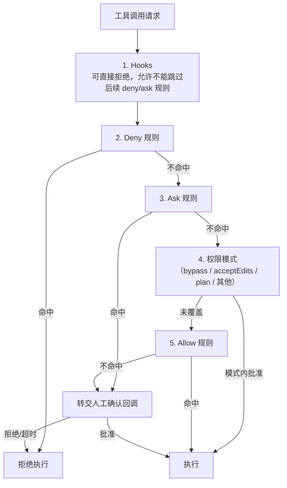

# 第二十章：权限、沙箱与隔离

## 20.1 本章边界：运行时隔离，不是提示词防御

第十五章讨论的是"如何防御 Prompt Injection"，其中 15.9、15.10 节已经提到"权限最小化"和"执行隔离与资源限制"是两类有效防御。那一章的视角是**安全威胁模型**——攻击者能通过间接注入的数据让 Agent 干什么坏事，怎么防。本章的视角是**运行时架构**——不管有没有攻击者，harness 本身应该如何设计权限判定的执行顺序、用什么技术手段实现真正的隔离边界。两者互为表里：第十五章回答"为什么需要隔离"，本章回答"隔离具体怎么实现"。

## 20.2 权限模型：从布尔开关到分级规则引擎

最简单的权限模型是一个全局布尔开关（"允许执行命令"/"不允许"），但生产级 harness 需要更细粒度的分级：按工具类型（读 vs 写）、按具体命令模式（`Bash(rm *)` 这类带参数模式匹配的规则）、按目标路径是否属于"关键路径"。Claude Agent SDK 的权限系统是这类分级规则引擎的典型实现，它把每一次工具请求的判定过程明确为一条**有序**的判定链（[Claude Agent SDK: Configure permissions](https://code.claude.com/docs/en/agent-sdk/permissions)）：

这条判定链最重要的设计原则是**顺序本身是安全语义的一部分**：Hooks 和 Deny 规则永远先于权限模式生效，这样即使运行在"批准一切"的自动化模式（`bypassPermissions`）下，针对关键路径的危险操作（例如删除关键目录）仍然会被拦下、转交人工确认，而不会被"自动批准"模式无差别放行。把判定顺序做反——比如先套用宽松模式再检查 deny 规则——会让"最危险的操作恰好最容易被自动化模式放过"。

## 20.3 审批规则的三种粒度

- **粗粒度（按工具名）**：如整体禁用 `Bash`，规则在参数还未被模型填充之前就生效，相当于把这个工具从模型可见的上下文中移除。
- **细粒度（按参数模式）**：如 `Bash(rm *)`，只拦截特定参数形态的调用，其余调用正常放行，需要在权限判定之前先完成 19.4 节的参数解析。
- **需要用户交互的工具**：一部分工具或 MCP 服务器可以显式声明"这个工具永远需要用户确认"（例如带 `requiresUserInteraction` 元数据的 MCP 工具），无论权限模式或 allow 规则如何配置，都会被路由到人工确认（第 22 章）。

三种粒度对应的实现代价依次增加，一个成熟的 harness 通常要同时支持这三层，而不是只提供全局开关。

## 20.4 执行隔离的三种技术路线

权限判定决定"允不允许执行"，隔离决定"执行时能造成多大范围的破坏"——即使权限判定完全正确，也需要隔离作为纵深防御的最后一道边界。业界常见三种隔离技术路线，安全强度和资源开销依次递增：

| 路线 | 代表技术 | 原理 | 权衡 |
|---|---|---|---|
| 规则式执行 | seccomp-bpf、AppArmor、SELinux | 内核 hook 拦截系统调用，按策略放行/拒绝 | 性能开销最低，但为任意未知程序可靠定义策略很难 |
| 应用级内核隔离 | gVisor（`runsc`） | 把系统调用接口重新实现为用户态的"应用内核"，拦截应用与真实主机内核之间的每一次系统调用 | 兼顾接近容器的启动速度与接近虚拟机的隔离强度([gVisor 文档](https://gvisor.dev/docs/)) |
| 硬件级虚拟化 | KVM/Xen、Firecracker microVM | 为每个执行单元提供独立的虚拟硬件与内核 | 隔离性最强，但资源占用和冷启动成本更高 |

Coding Agent 的"运行任意生成代码"场景通常倾向选择中间档（应用级内核隔离或轻量 microVM）：既要防止生成的代码逃逸出去影响主机或读取无关密钥，又要保证高并发场景下的启动速度和资源效率。

## 20.5 网络出口控制

即便文件系统和进程已经隔离，只要沙箱还能任意访问外网，第十五章 15.5 节提到的"致命三要素"（私有数据 + 不可信输入 + 对外通信能力）就仍然成立。网络出口就是"对外通信"这条链路最直接的载体，所以运行时隔离更合理的做法是对出网请求实行**默认拒绝、按需放行**，而不是只给一个"能不能上网"的总开关。GitHub Copilot Coding Agent 为每次任务运行提供可配置防火墙，默认限制出网目的地，组织再按需放行特定域名（见 20.8 节）。这和 20.4 节的进程隔离是互补关系：进程隔离防止"逃出沙箱"，网络出口控制防止"沙箱内部把数据发出去"。

## 20.6 文件系统与凭据隔离

- **文件系统作用域**：沙箱应该只挂载任务真正需要的目录，而不是整个主机文件系统；对关键路径（如 `.git` 之外的系统配置、其他用户的工作区）默认不可写，必要时不可读。
- **凭据不进入 Context**：第十五章 15.9.3 节已经指出"凭据不进 Context"是权限最小化的关键实践；隔离层面的对应做法是把密钥以环境变量或专用注入通道提供给执行环境，而不是作为 Prompt 的一部分让模型"看到"密钥内容——模型不需要读取密钥的值，只需要知道有一个可以使用凭据的工具。
- **多租户共享基础设施上的强隔离**：如果多个用户的 Agent 会话共享底层计算资源，文件系统和网络命名空间必须严格按租户隔离，防止一个会话内生成的恶意或有缺陷的代码影响到其他租户的会话。

## 20.7 多租户与并发会话隔离

一个 harness 实例通常要同时服务多个独立会话（不同用户、不同任务）。除了 20.6 节的资源隔离之外，还需要保证：

- 每个会话的 Working Memory、checkpoint（第 21 章）互不可见，即使它们运行在同一台物理机器上；
- 并发会话之间的资源配额（并发工具调用数、CPU/内存）需要相互隔离，防止一个失控的会话耗尽整个实例的资源导致其他会话被拖垮；
- 审计日志需要能够按会话、按租户切分，这是第 23 章可观测性能够落地问题排查和成本核算的前提。

## 20.8 案例：GitHub Copilot Coding Agent 的沙箱与防火墙

GitHub Copilot Coding Agent 把每次任务运行放在"由 GitHub Actions 提供的一次性开发环境"里执行：Copilot 在这个环境里探索代码、修改文件、跑测试和 lint（[GitHub Docs: Configure the development environment for Copilot cloud agent](https://docs.github.com/en/copilot/how-tos/copilot-on-github/customize-copilot/customize-cloud-agent/customize-the-agent-environment)）。这个设计体现了本章的多个原则：

- **一次性环境**本身就是一种隔离手段——任务结束后环境被销毁，不会有状态残留影响下一次任务（这也简化了 20.7 节的多租户隔离问题：每次任务天然运行在独立的运行实例里）；
- **`copilot-setup-steps.yml` 只能定制固定的一组字段**（`steps`、`permissions`、`runs-on`、`services`、`snapshot`、`timeout-minutes` 等），其余运行时行为不可被仓库配置覆盖——这是 16.2.6 节 "Control Plane" 与 Harness 分工的具体例子：仓库开发者能配置"环境里预装什么"，但不能改写"循环本身怎么调度"；
- **可定制的防火墙**用于控制任务运行期间的出网目的地，对应 20.5 节的网络出口控制；
- **组织级 Runner 与防火墙的默认策略**由组织管理员统一配置，个体仓库可选择是否允许覆盖——这正是 Control Plane 对 Harness 行为设置边界的例子。

## 20.9 常见错误

- **判定顺序把权限模式放在 deny 规则之前。** 会导致"自动批准一切"的模式下危险操作绕过了本应生效的黑名单，20.2 节的判定链顺序不能随意调整。
- **把网络隔离等同于文件系统隔离。** 两者是独立的攻击面，防住了文件系统逃逸不代表防住了数据外泄，需要同时设计。
- **多租户场景下审计日志不区分会话/租户。** 出现问题时无法定位是哪个会话触发的,也无法支撑第 23 章的成本核算。
- **把凭据作为 Prompt 的一部分传给模型。** 即使目的是"让模型知道有这个凭据可用",也不应该让密钥原文出现在模型能读到的上下文里,而应该通过工具执行时的环境变量注入。
- **认为容器化本身就是足够的隔离。** 普通容器共享主机内核，面对"运行不可信生成代码"这种场景，通常需要 20.4 节更强的隔离路线（应用级内核隔离或硬件级虚拟化）作为纵深防御。

## 20.10 本章总结

权限判定是一条有序的规则链——Hooks、Deny 规则、Ask 规则、权限模式、Allow 规则、人工确认回调依次生效，顺序本身就是安全语义的一部分；审批规则可以按工具名、参数模式、显式声明"需要用户交互"三种粒度设计。隔离在权限判定之外提供纵深防御，规则式执行、应用级内核隔离（gVisor）、硬件级虚拟化（microVM）是强度递增的三条技术路线；网络出口控制和文件系统/凭据隔离是互补的两个维度；多租户场景还需要资源配额和审计日志的隔离。GitHub Copilot Coding Agent 的一次性环境 + 可配置防火墙 + 组织级默认策略，是这些原则在生产系统中的具体落地。

## 参考资料

- [Claude Agent SDK: Configure permissions](https://code.claude.com/docs/en/agent-sdk/permissions)
- [gVisor 文档](https://gvisor.dev/docs/)
- [GitHub Docs: Configure the development environment for Copilot cloud agent](https://docs.github.com/en/copilot/how-tos/copilot-on-github/customize-copilot/customize-cloud-agent/customize-the-agent-environment)
- [Simon Willison: Designing agentic loops](https://simonwillison.net/2025/Sep/30/designing-agentic-loops/)
- [Simon Willison: The lethal trifecta for AI agents](https://simonwillison.net/2025/Jun/16/the-lethal-trifecta/)
