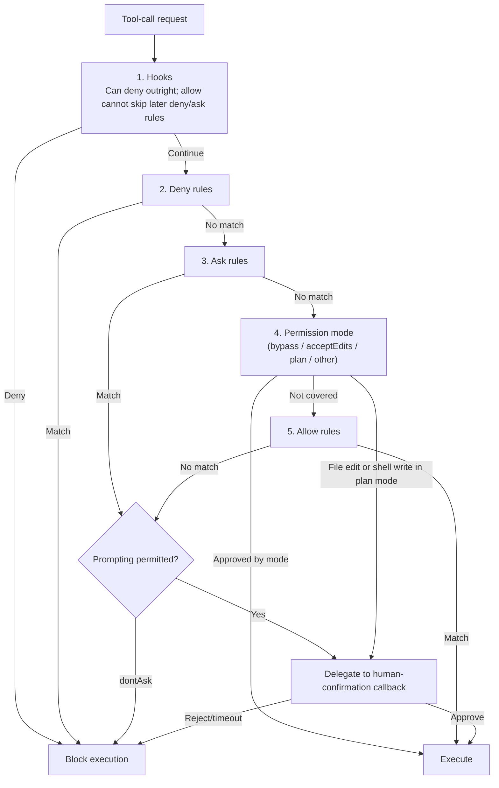

# Chapter 20: Permissions, Sandboxing, and Isolation

## 20.1 If a person has approved the operation, why isolate its execution?

Approving a command means consenting to that operation. It does not mean the program being run has no defects, nor that it may access the entire machine. Permission checks limit **what may be done**; a sandbox limits **what execution can reach**. Chapter 15 starts from the threat of prompt injection. This chapter examines how the runtime enforces these two boundaries, both of which remain necessary even when an error is not caused by an attacker.

## 20.2 Permission models: from a Boolean switch to a layered rule engine

The simplest permission model is a global Boolean switch: allow command execution or disallow it. A production harness needs finer-grained rules based on tool type (read versus write), command patterns (argument-matching rules such as `Bash(rm *)`), and whether the target is a critical path. The Claude Agent SDK is a representative implementation of this layered approach. It defines an **ordered** decision chain for every tool request ([Claude Agent SDK: Configure permissions](https://code.claude.com/docs/en/agent-sdk/permissions)):

This diagram simplifies the Claude Agent SDK's path; it is not a permission standard for all harnesses. Matching a deny rule means rejection, not referral to a person. In `dontAsk`, calls that require confirmation are denied. In `plan`, file edits and shell writes cannot be automatically approved through allow rules. Critical-path deletion, `auto` mode, and configurations that disable permission prompts have additional branches that must be checked against the specific version. The documented critical-path exceptions are not universal protection for every dangerous operation.

Also distinguish an **allow list from a capability whitelist**. In this SDK, `allowed_tools` means preapproval; tools not listed are not necessarily disabled. With `bypassPermissions`, other tools may still execute automatically. Calls approved earlier in the chain normally do not reach `canUseTool`. Checks that must run on every call belong in a supported pre-execution hook or a lower-level execution boundary, not solely in an approval callback.

## 20.3 Three granularities of approval rules

- **Coarse-grained, by tool name:** for example, the Claude Agent SDK's `disallowed_tools=["Bash"]` removes that tool definition from the request. Another harness might only reject it at execution. “Disabled” and “invisible to the model” are not universally equivalent; even a hidden tool still needs protection against unauthorized requests.
- **Fine-grained, by argument pattern:** a rule such as `Bash(rm *)` blocks only calls matching that argument form while other calls proceed normally. The argument parsing in Section 19.4 must occur before such a permission check.
- **Tools requiring user interaction:** Claude Code's `_meta["anthropic/requiresUserInteraction"]` is a vendor extension, officially requiring v2.1.199 or later, not a general MCP authorization field. Supporting hosts can use it to trigger approval, but `dontAsk` rejects the call instead of showing a prompt. Whether another client recognizes the field must be checked separately.

These rules can be combined. Their costs depend on the host's existing approval and execution facilities; they do not follow a fixed increasing order. Argument patterns match only the documented forms and cannot replace sandboxing or resource-level authorization.

## 20.4 Three approaches to execution isolation

Permission checks decide whether execution is allowed; isolation limits the resources execution can access. The following approaches can be combined and cannot be ranked by name alone. Configuration, kernel interfaces, networking, mounts, and credentials also determine the boundary:

| Approach | Representative technologies | Mechanism | Tradeoffs |
|---|---|---|---|
| Kernel policy | seccomp-bpf, AppArmor, SELinux | seccomp filters system calls; AppArmor and SELinux enforce access control through LSM | Usually low overhead, but policy coverage and maintenance are difficult; not a substitute for other isolation layers |
| Application-kernel isolation | gVisor (`runsc`) | A userspace application kernel handles many system calls, reducing the directly exposed host-kernel interface | Adds an isolation layer, with compatibility and I/O performance tradeoffs; still depends on the host and its configuration |
| Hardware-level virtualization | KVM/Xen, Firecracker microVMs | A separate guest kernel and virtual-hardware boundary | Cost depends on implementation and snapshot strategy; shared directories, networking, and keys do not become safe automatically |

When running untrusted generated code, application-kernel isolation or lightweight microVMs can reduce host exposure. Measure startup, I/O, and resource costs at the same time. Choose based on the threat model and actual compatibility, not by treating these three rows as fixed security levels.

## 20.5 Network egress controls

Even with filesystem and process isolation, the data-exfiltration risk from Chapter 15 remains if a sandbox can access private data, consume untrusted input, and send arbitrary outbound traffic. Egress control usually means **deny by default, allow as needed**, rather than a single “internet access on/off” switch. It complements process isolation: a program can send data out without escaping its sandbox. Allowing a domain is not content inspection either; an upload endpoint at an approved destination can still accept sensitive content.

The built-in firewall for GitHub Copilot cloud agent is a concrete example, but it covers only processes started through the agent's Bash tool in supported environments. It does not cover MCP server processes or those started by setup steps. Self-hosted runners and Windows cannot use that built-in firewall and need separate network controls. “Firewall enabled” must not be read as “all traffic controlled” (see Section 20.8 and References).

## 20.6 Filesystem and credential isolation

- **Filesystem scope:** mount only directories the task actually needs, not the entire host filesystem. Apply separate restrictions to system configuration, other users' workspaces, and repository metadata that can change execution behavior, such as `.git/config` and hooks. Being inside the repository does not make every file safe to write.
- **Keep credentials out of context:** prefer short-lived, narrowly scoped credentials used by an isolated tool service or credential broker. If a key is placed in the environment of a process that can execute arbitrary code, generated code may still read and print it. “Not in the prompt” does not mean “inaccessible to the model.” Redact logs, errors, and tool results too.
- **Strong isolation on shared multi-tenant infrastructure:** when multiple users' agent sessions share compute resources, filesystem and network namespaces must be strictly isolated by tenant so malicious or defective code generated in one session cannot affect another tenant's session.

## 20.7 Isolation across tenants and concurrent sessions

A harness instance often serves several independent sessions at once, involving different users or tasks. In addition to the resource isolation in Section 20.6, it needs to ensure that:

- A session cannot see another session's working memory or checkpoints (Chapter 21), even when they run on the same physical machine.
- Resource quotas, such as concurrent tool-call counts and CPU/memory limits, are isolated across sessions. One runaway session must not consume the entire instance and take down the others.
- Audit logs can be separated by session and tenant. This is a prerequisite for using Chapter 23's observability data in troubleshooting and cost accounting.

## 20.8 Case study: GitHub Copilot Coding Agent's sandbox and firewall

GitHub Copilot Coding Agent runs each task in an “ephemeral development environment, powered by GitHub Actions,” where it explores code, modifies files, and runs tests and linters ([GitHub Docs: Configure the development environment for Copilot cloud agent](https://docs.github.com/en/copilot/how-tos/copilot-on-github/customize-copilot/customize-cloud-agent/customize-the-agent-environment)). This design illustrates several principles from this chapter:

- **An ephemeral environment** reduces residue in a running instance, but external databases, caches, build artifacts, and credentials do not automatically disappear when the process is destroyed. Tenant isolation still depends on runner, storage, and access-control configuration.
- **`copilot-setup-steps.yml` supports only a fixed set of configurable fields**, including `steps`, `permissions`, `runs-on`, `services`, `snapshot`, and `timeout-minutes`. Repository configuration cannot override the remaining runtime behavior. This is a concrete example of the control-plane/harness division in Section 16.2.6: repository developers can configure what is preinstalled, but cannot rewrite how the loop is scheduled.
- **The customizable firewall** restricts outbound destinations within the processes and environments it covers. MCP, setup steps, self-hosted runners, and other uncovered paths need separate governance, as discussed in Section 20.5.
- **Organization-level runner and firewall policies** are set by organization administrators. The organization decides whether repositories may override the default runner, disable the firewall, or add rules; a repository cannot remove an organization-enforced restriction on its own. This is a control plane setting boundaries for a harness.

## 20.9 Common mistakes

- **Evaluating permission mode before deny rules.** An “automatically approve everything” mode could then let dangerous operations bypass the deny rules intended to block them. The order in Section 20.2 must not be rearranged arbitrarily.
- **Equating network isolation with filesystem isolation.** These are independent attack surfaces. Preventing filesystem escape does not prevent data exfiltration; both need explicit controls.
- **Omitting session and tenant identities from multi-tenant audit logs.** When something goes wrong, it becomes impossible to identify the responsible session or support the cost accounting in Chapter 23.
- **Equating “not in the prompt” with credential isolation.** An arbitrary-code executor can read keys in its own environment. Where possible, use a separate tool service to broker credential use and restrict permissions, lifetimes, and disclosure through results.
- **Assuming containerization alone provides sufficient isolation.** Ordinary containers share the host kernel. Running untrusted generated code typically calls for stronger isolation from Section 20.4—application-kernel isolation or hardware virtualization—as defense in depth.

## 20.10 Chapter summary

Approval, authorization, and isolation answer different questions: “Has someone confirmed this?”, “Is execution permitted?”, and “What can execution access?” Verify SDK rule order and extension fields against their versions instead of treating them as MCP standards. Sandboxing, network egress controls, credential brokering, and tenant isolation complement one another. None is replaced merely by using a container or an ephemeral environment.

## References

- [Claude Agent SDK: Configure permissions](https://code.claude.com/docs/en/agent-sdk/permissions)
- [gVisor documentation](https://gvisor.dev/docs/)
- [GitHub Docs: Configure the development environment for Copilot cloud agent](https://docs.github.com/en/copilot/how-tos/copilot-on-github/customize-copilot/customize-cloud-agent/customize-the-agent-environment)
- [GitHub Docs: Customizing or disabling the firewall](https://docs.github.com/en/copilot/how-tos/copilot-on-github/customize-copilot/customize-the-firewall)
- [Simon Willison: Designing agentic loops](https://simonwillison.net/2025/Sep/30/designing-agentic-loops/)
- [Simon Willison: The lethal trifecta for AI agents](https://simonwillison.net/2025/Jun/16/the-lethal-trifecta/)

The source review checked SDK permission order and GitHub environment/firewall coverage against official documentation on 2026-09-15. The v2.1.199 requirement for `anthropic/requiresUserInteraction` is retained. No SDK permission experiments or cloud-environment configuration were performed in that review.
