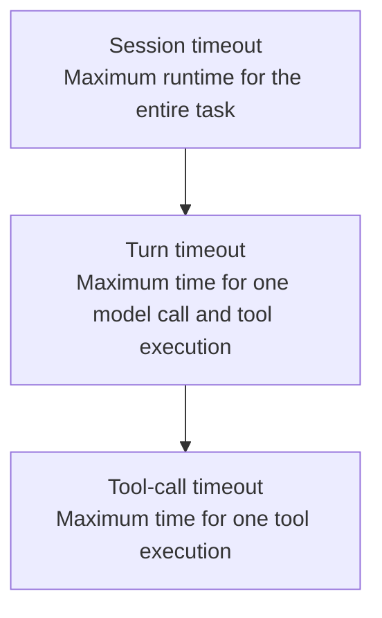

# Chapter 21: Checkpoints, Persistence, Retries, Timeouts, Idempotency, and Recovery

## 21.1 Scope: why recoverability matters more than the ability to rerun

“Run it again” does not necessarily mean “continue where it left off.” If an email is sent successfully but its response is lost in transit, the agent sees a timeout while the recipient already has the message. Restarting from scratch may send another email. Even short tasks need persistence decisions based on side effects and recovery requirements, not simply on how many minutes they run. This chapter combines checkpoints, retries, timeouts, and idempotency to distinguish completed work, unexecuted work, and unknown outcomes, avoiding duplicate business effects during recovery.

## 21.2 Checkpoints: what to save and when

A checkpoint stores enough state to recover at a defined execution boundary. It may include the messages, pending calls, phase, and budget from Section 17.2, plus artifact references and versions needed for recovery. It need not duplicate the entire history, and it does not automatically save the state of external databases, filesystems, or remote services.

Checkpoint timing depends on how much work may be repeated. After a model decision, after committing tool results, and at explicit milestones are all candidate boundaries. Side-effecting calls also need an operation key persisted before execution and an outcome persisted after the response. A framework may persist at node or super-step boundaries, not after every token or internal state change. An in-memory checkpointer cannot provide recovery after a process crash.

## 21.3 Two levels of persistence

Chapters 7 and 8 distinguish working memory from long-term memory by their **content**. This section draws the corresponding distinction in **persistence mechanisms**, which need different storage strategies:

| Level | Scope | Typical implementation | Purpose |
|---|---|---|---|
| Within-thread persistence: checkpoint | One session or task | LangGraph checkpointers “persist a thread's graph state” for “short-term, thread-scoped memory, including conversation continuity, human-in-the-loop workflows, time travel, and fault tolerance” ([LangGraph: Persistence](https://docs.langchain.com/oss/python/langgraph/persistence)) | Supports the recovery capabilities discussed here |
| Cross-thread persistence: store | Across sessions and tasks | LangGraph stores “persist application-defined data” for “long-term, cross-thread memory” | Supports the long-term memory storage in Chapters 7 and 8 |

Separate their data models, access permissions, and retention policies, even if both use the same physical storage system, such as PostgreSQL. A “thread” here is the framework's conversation identifier, not an operating-system thread. Short-term memory can be durably retained for a long time, and a cross-thread store can be updated frequently.

## 21.4 Retries: which failures can be retried?

Not every failure is suitable for automatic retry. The criteria are **whether the failure is transient and whether retrying could add duplicate side effects**:

- **Candidates for automatic retry:** rate limits and transient infrastructure failures, provided the operation is safe to resend and respects `Retry-After`, backoff, attempt limits, and a total time limit. A network timeout does not prove that execution never occurred. For side-effecting calls, query the operation's status first or use its already-persisted idempotency key.
- **Do not blindly repeat the same request:** invalid arguments need correction; unknown side-effect outcomes require a status query or a retry under the business idempotency contract; genuinely infeasible tasks need an explanation of missing prerequisites or a handoff. A model saying “I cannot do this” is not an infrastructure error classification either. Check permissions, information, and available tools.

[Temporal's default behavior](https://docs.temporal.io/encyclopedia/retry-policies) is to **retry Activities automatically, but not Workflow Executions**. Applications need to configure retry limits, non-retryable errors, and timeouts; an absent configuration does not mean retries are disabled. Workflow Task retries are yet another layer. Custom tool clients often use exponential backoff with jitter. The $n$th wait can be written as:

$$
t_n \sim \mathrm{Uniform}\left(0,\ \min\left(t_{max},\ t_0 \cdot 2^{n-1}\right)\right)
$$

Here, $t_0$ is the initial backoff base and $t_{max}$ is the maximum wait. This is a full-jitter example, not Temporal's default policy. The total wait must also fit within the remaining deadline.

## 21.5 Timeouts: nested timeout budgets

Section 19.5 establishes that every tool call needs its own timeout budget nested within a larger one. A complete hierarchy needs at least three levels:

A child call must inherit the parent's remaining deadline. Its effective duration is bounded by the smaller of its own limit and the remaining parent budget. Merely configuring three static timeouts in increasing order is not enough. On timeout, record the state explicitly and attempt to cancel remote work. Cancellation is a cooperative request, not a guarantee that remote side effects have been undone.

## 21.6 Idempotency: making retries safe

Idempotency means replaying the same logical operation does not add extra effects. A common approach is to **persist the operation key and an argument digest before execution**. The server atomically records the key's status and result, returns the same result for duplicate requests, and rejects changed arguments. The design must also address concurrent duplicates, record lifetimes, in-progress states, and atomicity between the business write and the deduplication record. [Stripe's idempotent-request documentation](https://docs.stripe.com/api/idempotent_requests) describes one specific API contract, not a guarantee shared by all tools.

**A model tool-call ID, a JSON-RPC request ID, and a business idempotency key are different identifiers.** Replanning may generate a new model call ID, and MCP multi-round-trip requests may require new JSON-RPC IDs. Use a separate, stable logical-operation key and map multiple attempts to it. If a service supports neither idempotency nor status queries, an unknown outcome may require human reconciliation or compensation. A checkpoint does not justify claiming exactly-once side effects.

## 21.7 Can recovery execute previously visited code again?

Yes. Recovery preserves confirmed state and business effects, not a guarantee that each line runs only once. LangGraph re-enters an interrupted node on resumption; Temporal may replay Workflow code to reconstruct decisions from historical results. Replaying control code and re-executing external operations are different things. Two distinctions are particularly important:

- **“Resume from the interruption” does not mean “resume from that exact source-code line.”** Recovery re-enters a clearly defined state of the state machine, such as “the last tool call completed; waiting for the next model call.” It does not attempt to restore an arbitrary program-counter position. This is why checkpoints retain explicit state fields such as those in Section 17.2 rather than an image of the entire process memory.
- **Checkpointing needs idempotency; otherwise recovery itself may repeat side effects.** If a crash occurs after a tool executes but before its result is persisted, the latest snapshot may still say “pending.” The recovery process cannot infer that execution never happened. It should query the logical operation's status or resend using the same idempotency key, as described in Section 21.6.

## 21.8 Common anti-patterns and a checklist

- **Writing a checkpoint only when the task ends.** This provides no recovery point during the task: a crash halfway through forces a restart from zero.
- **Equating “has a checkpointer” with “will not execute twice.”** [Section 10.11.7 of the LangGraph chapter](../../frameworks/01-langchain/04-langgraph/10-langgraph-advantages.md) calls out this misconception. Checkpoints restore state; they do not automatically prevent duplicate side effects during recovery. Idempotency needs its own design.
- **Retrying every failure, or none, without classifying it.** Classify failures explicitly using the criteria in Section 21.4.
- **Setting only one timeout level.** A local stall can then block the whole task. Use the hierarchy in Section 21.5.
- **Generating a new idempotency key for every attempt.** The same logical operation must reuse its persisted business key. A call ID can serve that purpose only if it is demonstrably stable across every recovery path and satisfies the service's contract.

## 21.9 Chapter summary

A checkpoint saves execution state, not the outside world, and does not guarantee that side effects occur only once. Recovery requires stable logical-operation keys, explicit unknown-outcome states, and deadline-bounded retries. Session checkpoints and cross-session memory have different semantics, even when they share an underlying database.

## References

- [LangGraph: Persistence](https://docs.langchain.com/oss/python/langgraph/persistence)
- [LangGraph: Interrupts](https://docs.langchain.com/oss/python/langgraph/interrupts): recovery re-enters the node, so code before the interruption runs again.
- [LangGraph: Fault tolerance](https://docs.langchain.com/oss/python/langgraph/fault-tolerance)
- [Temporal: Retry Policies](https://docs.temporal.io/encyclopedia/retry-policies)
- [Stripe: Idempotent requests](https://docs.stripe.com/api/idempotent_requests)
- [LangGraph Chapter 10: Core Advantages of LangGraph](../../frameworks/01-langchain/04-langgraph/10-langgraph-advantages.md)
