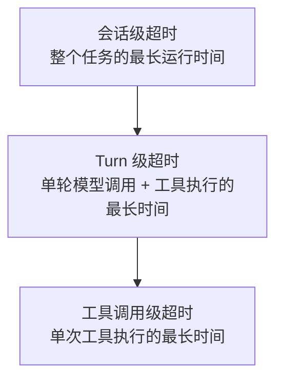

# 第二十一章：Checkpoint、持久化、重试、超时、幂等与恢复

## 21.1 本章边界：为什么"可恢复"比"能重跑"更重要

第十七章把 Agent Loop 描述为一个状态机；只要进程不崩溃、网络不中断、任务不超过几分钟，这个状态机自己维护内存里的状态就够用。但真实的 Coding Agent 任务经常运行几十分钟到几小时，中间必然会遇到进程重启、网络抖动、模型 API 限流、工具执行超时。这时候"重新跑一遍"往往不可接受——不仅浪费已完成的工作和 token 成本，某些工具调用（发邮件、创建 PR、执行数据库写操作）重跑还会产生真实的副作用。本章讨论 harness 如何做到**从中断处继续，而不是从头重来**，这需要 checkpoint、持久化、重试、超时、幂等五个机制协同工作。

## 21.2 Checkpoint：保存什么、何时保存

Checkpoint 是状态机在某个时间点的完整快照，至少要包含第 17.2 节定义的核心状态字段（`messages`、`turn_index`、`pending_tool_calls`、`phase`、`budget`）。保存时机通常选择在状态转移的边界点：每完成一次模型调用之后、每完成一次工具执行之后、或者显式的里程碑处（比如多 Agent 场景下一次 handoff 之后）。保存粒度太粗（只在任务结束时保存）等于没有 checkpoint；粒度太细（每个 token 都保存）则带来不必要的 I/O 开销——实践中"每个状态转移边界保存一次"是较为常见的折中。

## 21.3 持久化的两个层次

第七、八章已经区分过 Working Memory 与 Long-term Memory 在"内容"上的不同；本节从"持久化机制"的角度做同样的区分，二者需要用不同的存储策略实现：

| 层次 | 对应关系 | 典型实现 | 用途 |
|---|---|---|---|
| 线程内持久化（checkpoint） | 单次会话/单个任务 | LangGraph 的 Checkpointer——"持久化一个线程的图状态，用于短期的、线程范围内的记忆，包括对话连续性、人在环工作流、时间旅行、容错"([LangGraph: Persistence](https://docs.langchain.com/oss/python/langgraph/persistence)) | 支撑本章讨论的恢复能力 |
| 跨线程持久化（store） | 跨会话、跨任务 | LangGraph 的 Store——"持久化应用自定义的数据……用于长期的、跨线程的记忆" | 对应第七、八章的长期记忆存储 |

两者应分清数据模型、访问权限与保留策略，但可以共用 PostgreSQL 等物理存储。这里的“线程”是框架的会话标识，不是操作系统线程；短期记忆也可以长期持久化，跨线程 store 也可能频繁更新。

## 21.4 重试：哪些失败可以重试，哪些不能

不是所有失败都适合自动重试。区分标准是**失败是否是暂时性的、重试是否会产生副作用叠加**：

- **可考虑自动重试**：限流或瞬时基础设施故障，前提是操作可安全重发，遵循 `Retry-After`、退避、尝试次数和总时限。网络超时本身不能证明未执行，有副作用的调用需先查询状态或使用已持久化的幂等键。
- **不适合自动重试**：工具调用的参数本身有误（重试只会得到同样的错误）、工具调用已经产生了真实副作用但响应因网络问题丢失（此时重试可能造成重复执行，见 21.6 节）、模型判断任务本身不可行——这些失败应该被回写给模型（第 19 章 19.6 节）或者上报人工介入（第 22 章），而不是无脑重试。

[Temporal 的默认行为](https://docs.temporal.io/encyclopedia/retry-policies)是 **Activity 自动重试，Workflow Execution 默认不重试**。业务需覆盖重试上限、不可重试错误与超时，不能假设未配置就不会重试；Workflow Task 的重试又是不同层次。自定义工具客户端常用带抖动的指数退避，第 $n$ 次等待可写为：

$$
t_n \sim \mathrm{Uniform}\left(0,\ \min\left(t_{max},\ t_0 \cdot 2^{n-1}\right)\right)
$$

其中 $t_0$ 是初始退避基数，$t_{max}$ 是等待上限。这是 full jitter 示例，不是 Temporal 默认策略；总等待还必须受剩余 deadline 约束。

## 21.5 超时：分层设置超时预算

第 19 章 19.5 节已提到"每个工具调用应有独立的超时预算，且应嵌套在更大预算之内"。完整的分层超时至少有三级：

子调用应继承父级剩余 deadline，实际可用时长不超过自身上限与父级剩余预算的较小值；仅把三个静态超时配置成递增仍不够。超时后明确记录状态，并尝试取消远端工作；取消是协作请求，不保证远端副作用已撤销。

## 21.6 幂等：让重试变得安全

幂等性要求同一逻辑操作重放不增加额外效果。常见做法是**执行前持久化操作键与参数摘要**，服务端原子记录该键的状态和结果，重复请求返回同一结果，参数变化则拒绝。还要处理并发重复、记录有效期、处理中状态及业务写入与去重记录的原子性；[Stripe 的幂等请求文档](https://docs.stripe.com/api/idempotent_requests)是具体 API 的参考，不是所有工具共有的保证。

**模型工具调用 ID、JSON-RPC 请求 ID 与业务幂等键不同。** 模型重新规划可能生成新调用 ID；MCP 多轮请求也可能要求新的 JSON-RPC ID。因此应另设稳定的逻辑操作键，并映射多次尝试。若服务不支持幂等或查询，结果未知时可能只能人工核对或执行补偿，不能宣称 checkpoint 带来了 exactly-once 副作用。

## 21.7 恢复：从 Checkpoint 继续，而不是从头重放

恢复的正确语义是：加载最近一次 checkpoint，重建 17.2 节定义的状态，从中断点**继续**执行，而不是重新执行 checkpoint 之前的所有步骤。这里有两个容易出错的细节：

- **"从中断点继续"不等于"从中断的那一行代码继续"。** 恢复重新进入的是状态机某个明确定义的状态（比如"上一次工具调用已完成，等待下一次模型调用"），而不是试图恢复到某个任意的程序计数器位置——这也是为什么 checkpoint 需要保存的是 17.2 节的显式状态字段，而不是整个进程的内存镜像。
- **checkpoint 与幂等必须配合，否则恢复本身可能重复执行副作用。** 如果 checkpoint 保存的时间点在"工具已经真实执行"和"结果已经写回状态"之间，恢复时重新执行这个未完成的步骤就必须依赖 21.6 节的幂等保证，否则会出现同一个副作用被执行两次的风险。

## 21.8 常见反模式与检查清单

- **只在任务结束时写 checkpoint。** 等于没有恢复能力，任务运行到一半崩溃就必须从零开始。
- **把"加了 Checkpointer"等同于"不会重复执行"。** 这是[第十章（LangGraph 章）10.11.7 节](../../frameworks/01-langchain/04-langgraph/10-langgraph-advantages.md)专门点出的常见误区，checkpoint 只保证状态能恢复，不自动保证恢复过程不产生重复副作用，幂等仍需要单独设计。
- **重试策略不区分失败类型，一律重试或一律不重试。** 应按 21.4 节的标准显式分类。
- **超时只设一层。** 会导致局部卡死拖垮全局，必须按 21.5 节分层设置。
- **每次尝试生成新幂等键。** 同一逻辑操作必须复用已持久化的业务键；只有能证明调用 ID 在所有恢复路径中稳定且符合服务约定时，才可复用它。

## 21.9 本章总结

Checkpoint 保存执行状态，不自动保存外部世界，也不保证副作用只执行一次。恢复需要稳定的逻辑操作键、明确的未知状态和受 deadline 约束的重试。会话 checkpoint 与跨会话记忆要分清语义，但可共用底层数据库。

## 参考资料

- [LangGraph: Persistence](https://docs.langchain.com/oss/python/langgraph/persistence)
- [LangGraph: Fault tolerance](https://docs.langchain.com/oss/python/langgraph/fault-tolerance)
- [Temporal: Retry Policies](https://docs.temporal.io/encyclopedia/retry-policies)
- [Stripe: Idempotent requests](https://docs.stripe.com/api/idempotent_requests)
- [LangGraph 第十章：LangGraph 的核心优势](../../frameworks/01-langchain/04-langgraph/10-langgraph-advantages.md)
