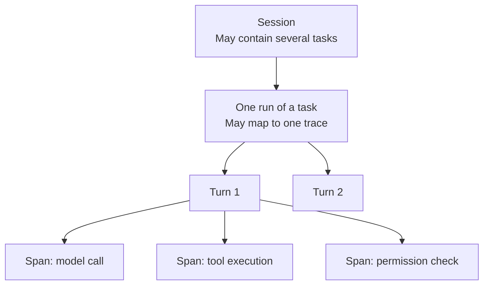

# Chapter 23: Tracing, Evaluation, Cost Control, and Coding-Agent Harness Case Studies

## 23.1 If the final answer is the same, why record execution?

The same “completed” message might reflect a genuinely successful run, a result barely achieved after repeated retries, or simply an incorrect claim by the model. Saving only the input and answer cannot distinguish tool failures, permission denials, and model decision errors. Chapter 14 defines how to evaluate task acceptance. This chapter explains how the harness records calls, approvals, recovery, and spending so that conclusions can be traced to operations that actually occurred.

## 23.2 Trace structure: spans, sessions, and turns

Business records can be organized by session, task, and turn, but these are not fixed levels in OpenTelemetry. A **session** is an application conversation that may contain several tasks. In this module, a **turn** is one model decision and its associated tool handling. A **trace** describes the operations in a run through related **spans**, each with a start and end time. Model calls and tool execution are good candidates for separate spans; instantaneous state transitions can be recorded as span events rather than creating a new span for every change.

This diagram shows business relationships; it does not require every box to be a span. When a long task resumes after a pause, the resumed run can create a new trace linked through task IDs, operation IDs, and span links. A single span need not remain open for days while waiting for approval.

## 23.3 OpenTelemetry GenAI semantic conventions

[The cited revision of the OpenTelemetry GenAI semantic conventions](https://github.com/open-telemetry/semantic-conventions-genai/blob/0c87594975195608dc91b3f702e250a7b240c151/docs/gen-ai/README.md) is still marked **Development**. Its fields must not be described as universally stable. Reuse its model, agent, tool, and MCP attributes where appropriate, but pin both semantic-convention and instrumentation versions and validate the backend mappings. Put custom approval-rule fields in a separate namespace.

Model spans record model versions, tokens, and latency; tool spans record tool identity, execution status, and duration; approval spans link rules and approval records. Minimize content collection by default. Arguments, results, user information, and secrets require redaction and access control. Do not record hidden chain of thought in pursuit of a “complete trace.”

## 23.4 Cost accounting: billing units and attribution

An agent session's cost combines several dimensions:

$$
C_{session} = \sum_{turn} \left( c_{input} \cdot n_{input} + c_{output} \cdot n_{output} \right) + \sum_{tool} c_{tool} + c_{compute}
$$

This is a simplified accounting equation. In practice, separately accumulate uncached input, cache reads and writes, output, and other provider charges, while avoiding double-counting tool compute and sandbox costs. Subagents, handoffs, retries, and failed attempts all count toward the root task's total cost, which can then be allocated by agent or tool. A role change does not create a fresh, free budget.

## 23.5 Cost-control mechanisms

Tracing and accounting make costs visible after the fact. Cost control must act during execution:

- **Make the budget first-class state:** reserve an estimated upper bound before each call, then settle actual usage afterward. Concurrent tasks cannot each read the same balance independently. Use atomic deductions or allocated budgets and leave room for in-flight requests; otherwise, post hoc checks still permit overspending.
- **Route across model tiers:** not every step needs the strongest model. Simple classification or formatting can go to cheaper models; reserve flagship models for steps requiring complex reasoning. Mechanically, this resembles the multi-agent routing in Sections 13.18–13.24, with cost rather than capability as the routing objective.
- **Deduplicate and cache tool calls:** read-only does not mean unchanging. Cache only when freshness requirements allow it, and include tenant, authorization scope, normalized arguments, and data version in the key. Invalidation and isolation of sensitive results are essential.
- **Stop low-value exploration early:** using Chapter 12's reflection mechanism, cut losses when a critic judges a direction unlikely to succeed instead of exhausting the budget before discovering that the path was wrong.

## 23.6 Connecting to Chapter 14's evaluation system

Section 14.7, “Online Evaluation and Observability,” lists the fields production systems must persist: task outcomes, trajectories, duration, cost, and more. The traces described here provide their raw data. An evaluation system typically extracts task success rates, trajectory compliance (Section 14.4.5, “Agentic trajectory”), and cost-efficiency metrics introduced here—tokens or dollars per successful task—from complete session/turn/span records. Together, these form a core production dashboard. Evaluation asks whether the outcome was good; this chapter asks whether the process was recorded adequately and spending remained controlled. They share underlying data but answer different questions.

## 23.7 Case studies: comparing three kinds of coding-agent harness

Mapping the abstractions in Chapters 16–22 to three real coding-agent harnesses makes their design decisions more concrete.

This comparison focuses on runtime and product interfaces. For how to locate code, choose an edit format, and verify a change, see [Chapter 24: Code Search, Editing, and Verification](../06-coding-agents/24-code-search-edit-verification.md).

### 23.7.1 Claude Code / Claude Agent SDK

The Claude Agent SDK exposes the loop, tools, and context management used by Claude Code ([Agent loop](https://code.claude.com/docs/en/agent-sdk/agent-loop)). Hooks provide points for audit and rule checks; subagents support delegation; sessions support resumption and forking. Permission modes, approval callbacks, and hooks have different coverage, so checks must not all be placed solely in `canUseTool`. Session recovery also does not automatically make external side effects idempotent.

### 23.7.2 OpenAI Codex CLI / Agents SDK

The OpenAI Agents SDK uses `Runner` to coordinate models, tools, and handoffs ([Running agents](https://openai.github.io/openai-agents-python/running_agents/)). Input guardrails run **in parallel** with the agent by default. The model may already consume tokens or execute tools before a guardrail trips; only blocking mode ensures the check finishes before the agent starts. Input guardrails apply only to the first agent in the chain, and output guardrails apply to the final output. Checks on individual tool calls require the corresponding tool-level mechanism ([Guardrails](https://openai.github.io/openai-agents-python/guardrails/)).

[Codex CLI](https://github.com/openai/codex) is a separate coding-agent product and codebase. Their shared vendor does not establish that the Agents SDK is Codex's execution core. They can integrate and share loop-design ideas, but sandboxing, approvals, sessions, and tool behavior need to be verified separately.

### 23.7.3 GitHub Copilot Coding Agent

Official documentation for GitHub Copilot cloud agent, formerly Coding Agent, describes an ephemeral development environment powered by GitHub Actions and user-visible artifacts such as issues, pull requests, commits, and session logs (see Chapter 20). That is enough to discuss deployment and audit interfaces, but not to infer private checkpoint storage or crash-recovery algorithms. An ephemeral environment also does not prove tenant isolation for caches, credentials, or external resources.

### 23.7.4 Similarities and differences

All these systems handle model decisions → tool execution → result writeback, but deployment form is not a substitute for permission analysis. A local CLI can execute automatically under explicit authorization; a cloud task can still wait for approval. Defaults depend on product, version, and configuration. Compare visible tools, authorization order, sandbox resources, recovery interfaces, and audit records individually rather than infer security guarantees from “local” or “cloud.”

## 23.8 Common mistakes

- **Recording only the task's final input and output, without intermediate spans.** This makes it impossible to distinguish model reasoning errors, tool execution failures, and permission denials. It also deprives the evaluation system in Section 23.6 of trajectory data.
- **Counting only model calls and ignoring tools and compute resources.** This substantially underestimates actual cost, particularly for sandbox execution as discussed in Chapter 20.
- **Equating “we recorded a trace” with “we can attribute an issue to a specific turn or span.”** Without the relationships in Section 23.2 and consistent call-ID correlation, trace data is difficult to drill into.
- **Controlling costs only through retrospective billing analysis.** Treat the budget as runtime state, as in Section 17.2, and check it during execution to trigger controlled reductions rather than discovering overspending when the bill arrives.
- **Copying a coding-agent harness's product features without understanding its deployment constraints.** For example, transplanting a cloud ephemeral environment's default automatic-execution policy into a long-lived local development environment creates a different risk exposure, as discussed in Section 20.8.

## 23.9 Chapter summary

Traces should connect runs, tools, approvals, and recovery without collecting content beyond privacy boundaries. GenAI semantic conventions remain under development; manage their versions together with backend mappings. Costs include failures, retries, and every delegation. Enforcing a hard budget requires concurrent reservations, not just retrospective totals. Product comparisons must distinguish public interfaces from inferred implementation details; an SDK, CLI, and cloud service are not necessarily the same execution core.

## References

- [OpenTelemetry: Generative AI Semantic Conventions](https://github.com/open-telemetry/semantic-conventions-genai)
- [OpenTelemetry: Traces](https://opentelemetry.io/docs/concepts/signals/traces/): spans, span events, context propagation, and span links.
- [Claude Agent SDK: How the agent loop works](https://code.claude.com/docs/en/agent-sdk/agent-loop)
- [OpenAI Agents SDK: Running agents](https://openai.github.io/openai-agents-python/running_agents/)
- [OpenAI Agents SDK: Guardrails](https://openai.github.io/openai-agents-python/guardrails/)
- [OpenAI Codex repository](https://github.com/openai/codex)
- [GitHub Docs: Configure the development environment for Copilot cloud agent](https://docs.github.com/en/copilot/how-tos/copilot-on-github/customize-copilot/customize-cloud-agent/customize-the-agent-environment)
- [Simon Willison: Designing agentic loops](https://simonwillison.net/2025/Sep/30/designing-agentic-loops/)
- [Anthropic: How we built our multi-agent research system](https://www.anthropic.com/engineering/multi-agent-research-system)

The GenAI semantic conventions are pinned to commit `0c87594975195608dc91b3f702e250a7b240c151`, accessed in the source review on 2026-09-15. Product claims are bounded by the official documentation cited here; they do not imply knowledge of unpublished internal implementations.
