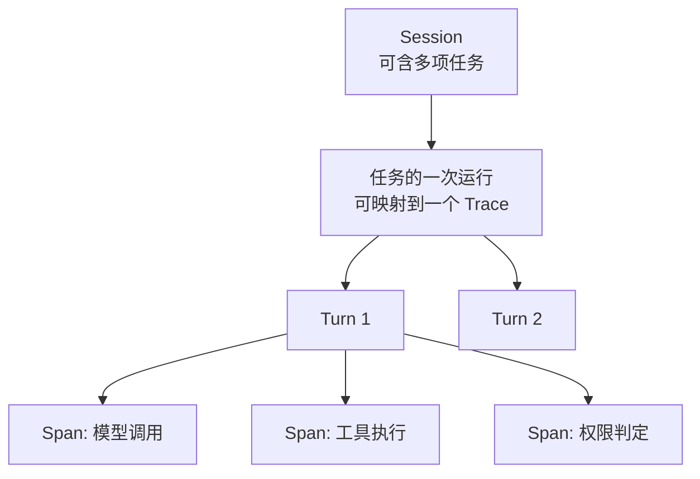

# 第二十三章：Tracing、评测、成本控制与 Coding Agent Harness 案例

## 23.1 最终答案相同，为什么还要记录执行过程？

因为同一个“已完成”，可能来自真实通过、重复重试后勉强成功，也可能只是模型误报。仅保存输入和答案，无法区分工具失败、权限拦截与模型决策错误。第十四章决定任务如何验收，本章让 Harness 记录调用、审批、恢复和费用，使结论能追溯到实际发生的操作。

## 23.2 Trace 的结构：Span、Session、Turn

可以按 Session、任务、Turn 组织业务记录，但不要把它们当作 OpenTelemetry 的固定层级。**Session** 是应用会话，可能包含多项任务；**Turn** 在本模块指一次模型决策与相应工具处理；**Trace** 用相关联的 **Span** 描述一次运行经过的操作，Span 有起止时间。模型调用、工具执行适合各建 Span，瞬时状态转移则可以记为 Span event，而不是每次变化都新建 Span。

这张图展示业务关联，不要求每个方框都对应一个 Span。一次长任务暂停后，恢复运行可以产生新 Trace，再用任务 ID、操作 ID 与 Span links 关联；无需让一个 Span 为等待审批持续开放几天。

## 23.3 OpenTelemetry GenAI 语义约定

[所引用版本的 OpenTelemetry GenAI 语义约定](https://github.com/open-telemetry/semantic-conventions-genai/blob/0c87594975195608dc91b3f702e250a7b240c151/docs/gen-ai/README.md)仍标记为 **Development**，不能笼统宣称字段已稳定。可复用其模型、Agent、工具与 MCP 字段，但应固定语义约定及 instrumentation 版本，并验证后端映射；自定义审批规则字段另设命名空间。

模型 Span 记录模型版本、Token 和延迟；工具 Span 记录工具身份、执行状态与耗时；审批 Span 关联规则及审批记录。内容采集应默认最小化，参数、结果、用户信息与密钥需要脱敏和访问控制；不要为“完整 Trace”记录隐藏思维链。

## 23.4 成本核算：计费单元与归属

一次 Agent 会话的成本由多个维度叠加：

$$
C_{session} = \sum_{turn} \left( c_{input} \cdot n_{input} + c_{output} \cdot n_{output} \right) + \sum_{tool} c_{tool} + c_{compute}
$$

这是简化核算式。实际应按缓存未命中输入、缓存读取/写入、输出及提供商收费项分别累计，并避免工具计算费与沙箱费重复计入。Subagent、Handoff、重试和失败尝试都计入根任务总成本，再按 Agent 或工具分摊；角色切换不会开启一份新的免费预算。

## 23.5 成本控制机制

Trace 和成本核算是"事后可见"，成本控制则要在运行时主动生效：

- **预算作为一等状态**：调用前预留预计上限，完成后按实际用量结算。多个并发任务不能只各自读取同一个余额；需原子扣减或预算分配，并给在途请求留出余量，否则事后检查仍会超支。
- **模型分级路由**：并非每一步都需要用最强的模型——简单的分类、格式化任务可以路由给更便宜的模型，只有需要复杂推理的步骤才调用旗舰模型，这与第十三章讨论的多 Agent 路由（13.18–13.24 节）在机制上是同一件事，只是路由目标从"能力"换成了"成本"。
- **工具调用去重与缓存**：只读不代表结果不变。只有时效允许时才缓存，并在键中包含租户、授权范围、规范化参数及数据版本；失效策略和敏感结果隔离不能省略。
- **提前终止低价值的探索路径**：结合第十二章的反思机制，当 Critic 判定某个方向大概率不会成功时提前止损，而不是耗尽预算后才发现路径错误。

## 23.6 与第十四章评测体系的衔接

第十四章 14.7 节 "在线评估与可观测性" 已列出线上必须落库的字段（任务结果、轨迹、耗时、成本等）；本章的 trace 数据正是这些字段的原始来源。评测体系消费 trace 数据的方式通常是：从 Session/Turn/Span 的完整记录中，提取任务成功率、轨迹合规性（第十四章 14.4.5 节 "Agentic trajectory"）、以及本章新增的成本效率指标（每单位任务成功消耗的 token 或美元），三者共同构成生产环境的核心仪表盘。评测关心"结果好不好"，本章关心"过程记没记全、成本控没控住"——两者共享同一份底层数据,却回答不同的问题。

## 23.7 案例研究：三类 Coding Agent Harness 的架构对比

将本模块第 16–22 章的抽象概念对照到三个真实存在的 Coding Agent Harness，能更直观地看到这些设计决策如何落地。

这里比较运行时与产品接口。具体怎样定位代码、选择编辑格式并确认修改有效，见[第二十四章：代码搜索、编辑与验证](../06-coding-agents/24-code-search-edit-verification.md)。

### 23.7.1 Claude Code / Claude Agent SDK

Claude Agent SDK 暴露 Claude Code 使用的循环、工具和上下文管理（[Agent loop](https://code.claude.com/docs/en/agent-sdk/agent-loop)）。Hooks 可插入审计与规则检查，Subagents 提供委派，Sessions 支持恢复与分叉。权限模式、审批回调和 Hook 的覆盖范围不同，不能把所有检查都只放进 `canUseTool`；会话恢复也不等于外部副作用自动幂等。

### 23.7.2 OpenAI Codex CLI / Agents SDK

OpenAI Agents SDK 用 `Runner` 调度模型、工具和 Handoff（[Running agents](https://openai.github.io/openai-agents-python/running_agents/)）。输入 Guardrail 默认与 Agent **并行**运行，触发拦截前模型可能已消耗 Token 或执行工具；只有配置阻塞模式才保证检查完成后再启动。输入 Guardrail 仅作用于链首，输出 Guardrail 作用于最终输出；逐工具调用的检查需要相应工具级机制（[Guardrails](https://openai.github.io/openai-agents-python/guardrails/)）。

[Codex CLI](https://github.com/openai/codex)是独立的编码 Agent 产品与代码库，不能因为都由 OpenAI 提供就断言它以 Agents SDK 为内核。二者可以集成、共享循环设计思路，但沙箱、审批、会话和工具行为需要分别核实。

### 23.7.3 GitHub Copilot Coding Agent

GitHub Copilot cloud agent（原 Coding Agent）的官方文档描述了 GitHub Actions 支持的临时开发环境，以及 Issue/PR、提交和会话日志等用户可见产物（见第 20 章）。这足以讨论部署与审计接口，但不足以推断其私有 checkpoint 存储或崩溃恢复算法。一次性环境也不自动证明缓存、凭据和外部资源都实现了租户隔离。

### 23.7.4 三者的共性与差异

这些系统都要处理“模型决策 → 工具执行 → 结果回写”，但部署形态不能替代权限分析。本地 CLI 可以在明确授权下自动执行，云端任务也可能等待审批；默认行为取决于产品、版本和配置。比较时逐项核对可见工具、授权顺序、沙箱资源、恢复接口与审计记录，不由“本地”或“云端”推断其安全保证。

## 23.8 常见错误

- **只记录任务的最终输入输出，不记录中间 Span。** 出现问题时无法定位是模型推理错误、工具执行失败还是权限拦截导致，第 23.6 节的评测体系也会因此失去轨迹数据。
- **成本核算只统计模型调用，忽略工具调用和计算资源开销。** 会显著低估真实成本，尤其是涉及沙箱执行（第 20 章）的场景。
- **把"记录了 trace"等同于"能追责到具体 Turn/Span"。** 没有第 23.2 节的层级结构和统一的调用 ID 关联，trace 数据难以下钻定位。
- **成本控制只做事后账单分析，不做运行时预算检查。** 应该像第 17 章 17.2 节那样把预算作为运行时状态，实时检查并触发降级，而不是等账单出来才发现超支。
- **模仿某个 Coding Agent Harness 的产品特性，却不理解其部署形态带来的约束。** 例如把云端一次性环境的"默认自动运行"策略直接照搬到长期存活的本地开发环境，会带来 20.8 节讨论过的不同风险敞口。

## 23.9 本章总结

Trace 需要关联运行、工具、审批和恢复，但内容采集不能越过隐私边界。GenAI 语义约定仍在开发中，版本与后端映射要一起管理。成本包括失败、重试和所有委派，硬预算需要并发预留而非仅事后统计。比较产品时应区分公开接口与实现推断，不能把 SDK、CLI 和云端服务视为同一个内核。

## 参考资料

- [OpenTelemetry: Generative AI Semantic Conventions](https://github.com/open-telemetry/semantic-conventions-genai)
- [OpenTelemetry: Traces](https://opentelemetry.io/docs/concepts/signals/traces/)：Span、Span event、上下文传播与 Span links。
- [Claude Agent SDK: How the agent loop works](https://code.claude.com/docs/en/agent-sdk/agent-loop)
- [OpenAI Agents SDK: Running agents](https://openai.github.io/openai-agents-python/running_agents/)
- [OpenAI Agents SDK: Guardrails](https://openai.github.io/openai-agents-python/guardrails/)
- [OpenAI Codex repository](https://github.com/openai/codex)
- [GitHub Docs: Configure the development environment for Copilot cloud agent](https://docs.github.com/en/copilot/how-tos/copilot-on-github/customize-copilot/customize-cloud-agent/customize-the-agent-environment)
- [Simon Willison: Designing agentic loops](https://simonwillison.net/2025/Sep/30/designing-agentic-loops/)
- [Anthropic: How we built our multi-agent research system](https://www.anthropic.com/engineering/multi-agent-research-system)

GenAI 语义约定固定在提交 `0c87594975195608dc91b3f702e250a7b240c151`，查阅于 2026-09-15；产品接口以本章所引官方文档为边界，不据此推断未公开的内部实现。
