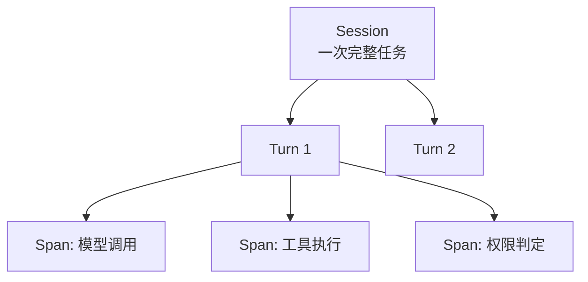

# 第二十三章：Tracing、评测、成本控制与 Coding Agent Harness 案例

## 23.1 本章边界：运行时可观测性，不是任务评测指标本身

第十四章讨论的是"如何评估 Agent 的任务完成质量"——用什么 benchmark、什么指标判定一次运行算不算成功。本章讨论的是更底层的问题：**harness 如何把每一次模型调用、工具执行、权限判定、中断恢复都记录下来**，使得第十四章的评测、生产环境的故障排查、以及本章新增的成本核算，都能建立在同一份可靠的运行时记录之上。没有这一层，评测只能看到"输入/输出"这一个黑盒切面,看不到过程中发生了什么。

## 23.2 Trace 的结构：Span、Session、Turn

可观测性数据通常按层级组织：一个 **Session**（一次完整的 Agent 会话）包含若干 **Turn**（第 17 章定义的一轮循环），每个 Turn 内部又包含若干 **Span**（一次模型调用、一次工具执行、一次权限判定各自对应一个 Span）。这个层级结构直接映射到第 17 章的状态机——状态机每发生一次状态转移，理论上都可以对应产生一个 Span，这也是为什么可观测性子系统被放在本模块而不是第十四章：它是运行时状态机的伴生产物，而不是独立的评测逻辑。

## 23.3 OpenTelemetry GenAI 语义约定

第十四章 14.7.4 节已经提到 OpenTelemetry 的 GenAI 语义约定作为追踪标准；本章补充这套约定与 harness 实现的对应关系。OpenTelemetry 把 GenAI 相关的 span、metric、event 语义约定统一维护在 [semantic-conventions-genai 仓库](https://github.com/open-telemetry/semantic-conventions-genai)，覆盖"GenAI 客户端、MCP（Model Context Protocol）以及特定厂商约定（OpenAI 等）"。对 harness 实现而言，这意味着 23.2 节的 Span 结构不需要从零设计字段——模型调用 Span 应记录模型名、输入/输出 token 数、延迟；工具执行 Span 应记录工具名、参数摘要、执行时长、成功/失败；权限判定 Span 应记录命中了哪条规则（第 20 章 20.2 节判定链的哪一步）。统一使用标准语义约定的价值在于：不同 harness 产生的 trace 可以被同一套下游可观测性平台（如 Grafana、Datadog、Langfuse 等）解析和对比。

## 23.4 成本核算：计费单元与归属

一次 Agent 会话的成本由多个维度叠加：

$$
C_{session} = \sum_{turn} \left( c_{input} \cdot n_{input} + c_{output} \cdot n_{output} \right) + \sum_{tool} c_{tool} + c_{compute}
$$

其中模型调用成本按输入/输出 token 数和对应单价计算（第十章 10.14 节讨论的 Prompt Caching 会显著降低命中缓存部分的 $c_{input}$），工具调用成本对应外部 API 调用费用或计算资源消耗，$c_{compute}$ 对应第 20 章讨论的沙箱执行环境本身的计算开销。成本归属需要能下钻到 Turn 甚至单次工具调用级别——这是第 17 章 17.6 节讨论的"子 Agent 消耗计入父状态机预算、Handoff 之后消耗计入新状态机"这条归属规则真正被需要的地方：没有精细的成本归属，就无法验证这条设计规则是否被正确实现。

## 23.5 成本控制机制

Trace 和成本核算是"事后可见"，成本控制则要在运行时主动生效：

- **预算作为一等状态**：第 17 章 17.2 节把 `budget` 列为状态机的核心字段之一，成本控制的本质就是让这个字段在运行时被持续检查，一旦逼近上限就触发降级（第 18 章 18.8 节的上下文压缩降级）或直接终止会话。
- **模型分级路由**：并非每一步都需要用最强的模型——简单的分类、格式化任务可以路由给更便宜的模型，只有需要复杂推理的步骤才调用旗舰模型，这与第十三章讨论的多 Agent 路由（13.18–13.24 节）在机制上是同一件事，只是路由目标从"能力"换成了"成本"。
- **工具调用去重与缓存**：对幂等的只读工具调用（第 21 章 21.6 节讨论的幂等概念的另一种应用）可以在 Turn 内或跨 Turn 缓存结果，避免重复调用产生重复费用。
- **提前终止低价值的探索路径**：结合第十二章的反思机制，当 Critic 判定某个方向大概率不会成功时提前止损，而不是耗尽预算后才发现路径错误。

## 23.6 与第十四章评测体系的衔接

第十四章 14.7 节 "在线评估与可观测性" 已列出线上必须落库的字段（任务结果、轨迹、耗时、成本等）；本章的 trace 数据正是这些字段的原始来源。评测体系消费 trace 数据的方式通常是：从 Session/Turn/Span 的完整记录中，提取任务成功率、轨迹合规性（第十四章 14.4.5 节 "Agentic trajectory"）、以及本章新增的成本效率指标（每单位任务成功消耗的 token 或美元），三者共同构成生产环境的核心仪表盘。评测关心"结果好不好"，本章关心"过程记没记全、成本控没控住"——两者共享同一份底层数据,却回答不同的问题。

## 23.7 案例研究：三类 Coding Agent Harness 的架构对比

将本模块第 16–22 章的抽象概念对照到三个真实存在的 Coding Agent Harness，能更直观地看到这些设计决策如何落地。

### 23.7.1 Claude Code / Claude Agent SDK

Claude Code 把"Agent Loop、工具、上下文管理"封装为可编程的 Agent SDK，核心循环是"接收 prompt → 模型评估并可能请求工具 → 执行工具 → 重复"([Claude Agent SDK: How the agent loop works](https://code.claude.com/docs/en/agent-sdk/agent-loop))。权限层是本模块讨论过的最完整的分级规则引擎实现（第 20 章 20.2 节的判定链）；Hooks 机制允许在生命周期关键点（工具调用前后）插入自定义逻辑，可以用来实现自定义的审计、审批或成本控制；Subagents 对应第 17 章 17.6 节的嵌套状态机；Sessions 支持恢复与分叉，对应第 21 章的持久化能力。

### 23.7.2 OpenAI Codex CLI / Agents SDK

OpenAI 的 Agents SDK 用 `Runner` 驱动同样结构的循环——调用模型、判断是否为最终输出、处理 handoff 或工具调用、达到 `max_turns` 时抛出显式异常（[OpenAI Agents SDK: Running agents](https://openai.github.io/openai-agents-python/running_agents/)）。它引入的 Guardrails 机制（第 19 章 19.5 节提到）把输入/输出/工具级别的规则检查作为独立于权限系统的另一层校验，体现"用便宜模型先做快速判断，避免昂贵模型无谓启动"的成本控制思路（[OpenAI Agents SDK: Guardrails](https://openai.github.io/openai-agents-python/guardrails/)），这与 23.5 节的模型分级路由是同一策略在不同粒度上的应用。Codex CLI 作为终端里的 coding agent 产品，是这套 Agents SDK 循环面向"直接在开发者终端执行命令"这一场景的具体化，同样需要面对第 20 章讨论的"YOLO 模式"风险与效率权衡([Simon Willison: Designing agentic loops](https://simonwillison.net/2025/Sep/30/designing-agentic-loops/))。

### 23.7.3 GitHub Copilot Coding Agent

与前两者"作为本地/进程内库运行"的形态不同，GitHub Copilot Coding Agent 把整个 harness 运行在云端的一次性 GitHub Actions 环境里，任务与具体的 Issue/PR 绑定，而不是与一个长期存活的本地进程绑定（第 20 章 20.8 节已详细讨论其沙箱与防火墙设计）。这个形态天然获得了 21 章讨论的"环境隔离即天然的多租户隔离"，也意味着它的 checkpoint/持久化机制必须与 GitHub 的 Issue/PR/commit 这些平台原语对齐——一次任务的"状态"很大程度上就体现为提交历史和 PR 上的评论,而不是一个独立的私有存储。

### 23.7.4 三者的共性与差异

三个系统在"循环怎么跑"这件事上高度收敛（都是"模型决策 → 工具执行 → 结果回写 → 重复"），差异主要体现在**部署形态**（本地库 vs 云端一次性环境）和**权限/审批模型的默认姿态**（本地工具默认更倾向频繁询问，云端一次性环境默认更倾向在预设的隔离边界内自动运行,减少对人类的实时打扰）。这印证了 16.6 节的结论：harness 对上层暴露的是能力开关，循环内核的设计原则是共通的工程约束，不因产品形态而改变。

## 23.8 常见错误

- **只记录任务的最终输入输出，不记录中间 Span。** 出现问题时无法定位是模型推理错误、工具执行失败还是权限拦截导致，第 23.6 节的评测体系也会因此失去轨迹数据。
- **成本核算只统计模型调用，忽略工具调用和计算资源开销。** 会显著低估真实成本，尤其是涉及沙箱执行（第 20 章）的场景。
- **把"记录了 trace"等同于"能追责到具体 Turn/Span"。** 没有第 23.2 节的层级结构和统一的调用 ID 关联，trace 数据难以下钻定位。
- **成本控制只做事后账单分析，不做运行时预算检查。** 应该像第 17 章 17.2 节那样把预算作为运行时状态，实时检查并触发降级，而不是等账单出来才发现超支。
- **模仿某个 Coding Agent Harness 的产品特性，却不理解其部署形态带来的约束。** 例如把云端一次性环境的"默认自动运行"策略直接照搬到长期存活的本地开发环境，会带来 20.8 节讨论过的不同风险敞口。

## 23.9 本章总结

Harness 的可观测性以 Session-Turn-Span 的层级结构组织，天然映射到第 17 章的状态机转移；OpenTelemetry 的 GenAI 语义约定为这套结构提供了跨系统可比的标准字段。成本核算需要覆盖模型调用、工具调用、计算资源三个维度，并能下钻到子 Agent/Handoff 级别；成本控制则要把预算作为运行时一等状态，结合模型分级路由、调用去重、提前终止等机制主动生效。Trace 数据是第十四章评测体系的原始来源，两者共享数据但回答不同问题。Claude Agent SDK、OpenAI Agents SDK/Codex CLI、GitHub Copilot Coding Agent 三个真实案例在循环内核上高度收敛，差异主要来自部署形态和默认审批姿态的产品选择，而不是底层工程原则的不同。

## 参考资料

- [OpenTelemetry: Generative AI Semantic Conventions](https://github.com/open-telemetry/semantic-conventions-genai)
- [Claude Agent SDK: How the agent loop works](https://code.claude.com/docs/en/agent-sdk/agent-loop)
- [OpenAI Agents SDK: Running agents](https://openai.github.io/openai-agents-python/running_agents/)
- [OpenAI Agents SDK: Guardrails](https://openai.github.io/openai-agents-python/guardrails/)
- [GitHub Docs: Configure the development environment for Copilot cloud agent](https://docs.github.com/en/copilot/how-tos/copilot-on-github/customize-copilot/customize-cloud-agent/customize-the-agent-environment)
- [Simon Willison: Designing agentic loops](https://simonwillison.net/2025/Sep/30/designing-agentic-loops/)
- [Anthropic: How we built our multi-agent research system](https://www.anthropic.com/engineering/multi-agent-research-system)
