# 第十章：Agent 记忆与上下文压缩

## 10.1 为什么需要记忆压缩

Agent 在长任务中会持续产生：

- 用户与模型消息；
- Tool Call 与 Tool Result；
- 计划和状态；
- 搜索文档；
- 代码、日志和表格；
- 中间结论；
- 错误与重试记录。

如果将所有内容不断追加到 Context，会导致：

- 超出模型 Context Window；
- 输入 Token 成本增加；
- Prefill 延迟上升；
- 关键信息被噪音稀释；
- 模型更难找到当前目标；
- 旧错误和无关信息持续影响后续决策。

记忆压缩不是单纯把文本变短，更重要的是：

> **在有限 Token Budget 内，尽可能保留完成当前任务所需的信息。**

写成一个简单目标函数，就是：

$$
J(C)=U(C)-\lambda L(C)
$$

并满足：

$$
L(C)\le B
$$

其中：

- `C` 是压缩后的 Context；
- `U(C)` 是保留信息对当前任务的效用；
- `L(C)` 是 Context 长度；
- `B` 是可用 Token Budget；
- `λ` 表示长度成本权重。

## 10.2 四类基础方法

四种常见方法解决的是不同问题：

| 方法 | 解决的问题 | 核心动作 | 是否有损 |
|---|---|---|---:|
| Sliding Window | 历史太长，保留哪一段 | 删除最早内容 | 是 |
| Summarization | 历史太长，如何提炼 | 用摘要替换原文 | 是 |
| Importance Filtering | 信息价值不同，保留什么 | 按任务价值选择 | 通常是 |
| Structured Extraction | 对话文本是否是最佳表示 | 转换为结构化状态 | 取决于 Schema |

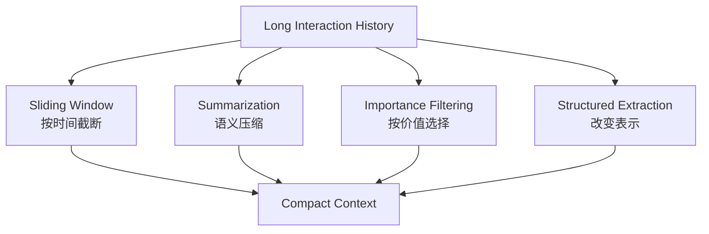

这四种方法通常组合使用，而不是互相替代。

## 10.3 Sliding Window：按时间截断

Sliding Window 只保留最近若干轮或若干 Token，删除更早的内容。


### 10.3.1 常见实现

#### 按消息轮数

只保留最近 `N` 轮对话。

优点：

- 实现简单；
- 速度快；
- 行为容易预测。

缺点：

- 不同消息长度差异很大；
- 不能精确控制 Token。

#### 按 Token 数

从最新消息向前装入，直到达到预算。

优点：

- 能控制模型输入大小；
- 更适合不同长度的消息。

缺点：

- 仍然只按时间，不考虑价值；
- 可能删除早期关键约束。

#### 按任务阶段

保留当前阶段的详细记录，将已完成阶段移出活跃窗口。

这种方式比简单按轮数截断更符合 Agent 任务结构。

### 10.3.2 不能被普通窗口淘汰的信息

以下内容通常需要 Pin：

- System Instructions；
- 用户当前目标；
- 安全和权限规则；
- 成功标准；
- 当前计划和状态；
- 未解决问题；
- 高风险操作约束。

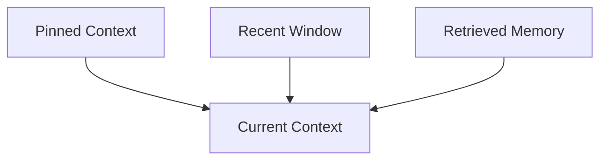

### 10.3.3 不要切断 Tool 交互

Tool Call 和对应 Tool Result 应视为一个逻辑单元。只保留调用、不保留结果，或只保留结果、不保留调用，都可能破坏上下文。

同样需要避免切断：

- 用户问题与 Agent 回答；
- 错误与对应修复；
- 计划步骤与执行结果；
- 引用与其支持的结论。

### 10.3.4 Sliding Window 的适用场景

- 最近内容明显比早期内容重要；
- 对话任务短；
- 可以从外部 State 恢复关键信息；
- 需要低成本、低延迟压缩。

它是截断策略，不是理解策略。

## 10.4 Summarization：用摘要替换历史

Summarization 在删除早期历史前，先提取重要信息形成更短表示。

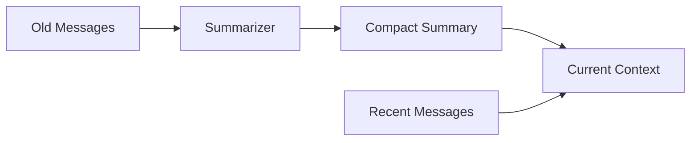

### 10.4.1 Rolling Summary

维护一个持续更新的摘要：

```text
new_summary = summarize(old_summary + newly_evicted_messages)
```

优点：

- 实现简单；
- 摘要长度稳定；
- 适合连续对话。

风险：

- 多次重写会产生 Summary Drift；
- 早期细节可能逐渐丢失；
- 模型生成的错误可能进入后续摘要。

### 10.4.2 Hierarchical Summary

先生成局部摘要，再合并成阶段或任务摘要：

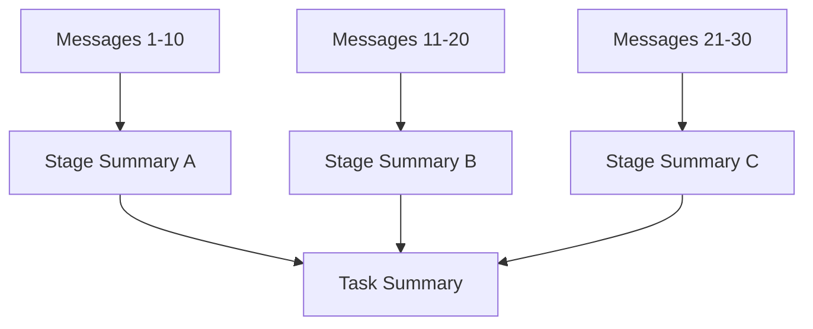

它比不断重写同一个摘要更容易：

- 保留来源；
- 定位丢失信息；
- 按阶段展开；
- 支持长周期任务。

### 10.4.3 Query-focused Summary

摘要只保留与当前任务或阶段相关的信息。

例如，Agent 从“资料收集”进入“报告撰写”阶段时，可以重点保留：

- 已验证事实；
- 来源；
- 比较结论；
- 未解决冲突。

不再保留每一次搜索尝试的详细过程。

### 10.4.4 Event Summary

按关键事件总结：

- 决策；
- Tool 成功或失败；
- 计划变化；
- 用户确认；
- 发现的新约束。

### 10.4.5 高质量摘要应保留什么

- 原始目标；
- 用户明确约束；
- 已完成和未完成步骤；
- 关键事实；
- 重要 Tool 结果；
- 决策及依据；
- 错误与恢复状态；
- 来源和 Artifact 引用。

### 10.4.6 Summary Drift

多轮摘要可能发生：

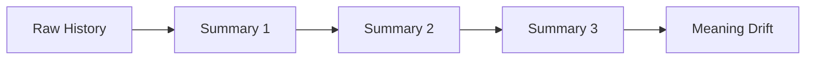

缓解方式：

- 保存原始历史或 Artifact；
- 摘要附带来源引用；
- 不重复总结稳定结构化字段；
- 周期性从原始数据重新生成摘要；
- 对目标、权限和数字使用结构化状态；
- 使用 Verifier 检查遗漏和矛盾。

## 10.5 Importance Filtering：按价值选择

时间顺序不代表信息价值。用户第一轮给出的安全约束，可能比最近十轮普通消息更重要。

Importance Filtering 根据当前任务选择应保留的内容。

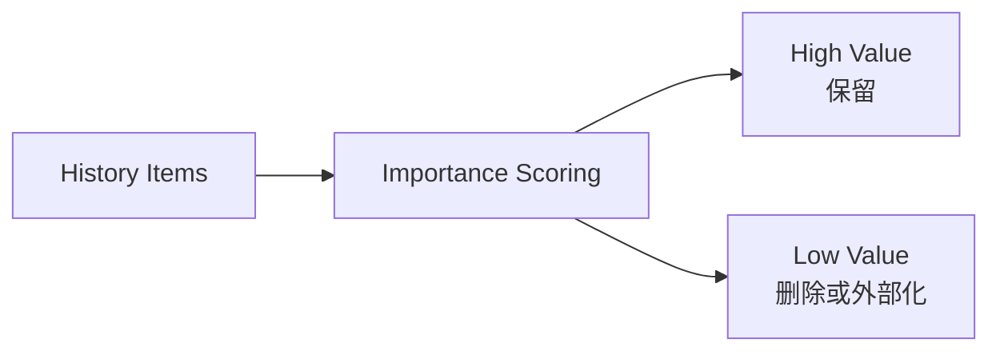

### 10.5.1 重要性信号

- 与当前目标的相关性；
- 是否为用户明确约束；
- 是否影响安全和权限；
- 是否是未解决问题；
- 是否被后续任务依赖；
- 来源可信度；
- 是否包含独特信息；
- 时间新鲜度；
- 是否能从外部系统重新获取。

可以用一个基础效用分数表示：

$$
U_i=
\alpha R_i
+
\beta I_i
+
\gamma D_i
+
\delta T_i
+
\epsilon N_i
-
\zeta C_i
$$

其中：

- `Rᵢ`：Goal Relevance；
- `Iᵢ`：Importance；
- `Dᵢ`：Dependency Value；
- `Tᵢ`：Trust；
- `Nᵢ`：Novelty；
- `Cᵢ`：Token Cost。

### 10.5.2 Hard Rules 与 Model Scoring

不应让模型独自决定所有信息的重要性。

#### Hard Rules

必须保留：

- System Instructions；
- 安全策略；
- 用户明确目标；
- 权限；
- 当前任务状态；
- 尚未解决的错误。

#### Model Scoring

可以用于：

- 判断历史事实与当前阶段的相关性；
- 选择代表性 Episode；
- 从重复 Tool 结果中提取重点。

### 10.5.3 Importance Filtering 的风险

- 模型错误删除真正重要的信息；
- 当前看似无关的信息之后可能变得重要；
- 重要性评分受当前 Prompt 偏置；
- 恶意内容可能伪装成高优先级指令。

因此，被过滤内容最好外部化保存，而不是立即永久删除。

## 10.6 Structured Extraction：改变信息表示

自然语言对话通常冗长、重复且难以精确更新。Structured Extraction 将历史转换为高密度状态。

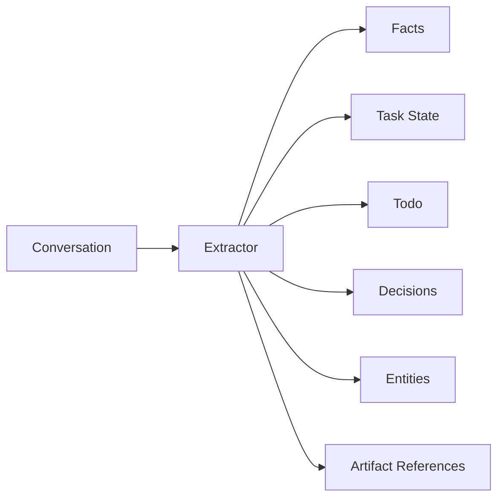

### 10.6.1 示例

原始对话：

```text
用户：不要创建 PR，直接把后续章节提交到 main。
Agent：明白，后续直接提交到 main。
```

结构化后：

```json
{
  "repository": "zongyangbigpolo/awesome-ai-roadmap",
  "publishing_policy": {
    "target_branch": "main",
    "create_pull_request": false
  },
  "source": "explicit_user_instruction"
}
```

结构化表示：

- Token 更少；
- 更容易精确更新；
- 更适合规则执行；
- 更容易检测冲突；
- 不依赖语义猜测。

### 10.6.2 适合抽取的内容

#### Task State

```json
{
  "goal": "完成 Agent 知识图谱",
  "current_chapter": 10,
  "status": "writing",
  "pending": [
    "validate formatting",
    "publish to main"
  ]
}
```

#### Decisions

```json
{
  "decision": "Use GitHub-Flavored Markdown",
  "reason": "GitHub and DeepWiki can render it directly",
  "status": "active"
}
```

#### Open Questions

```json
{
  "question": "Should the next chapter cover evaluation?",
  "owner": "user",
  "status": "open"
}
```

#### Entity Facts

```json
{
  "subject": "user",
  "predicate": "preferred_formula_format",
  "object": "GitHub-compatible LaTeX"
}
```

### 10.6.3 Structured Extraction 的风险

- Schema 设计遗漏信息；
- 模型抽取错误；
- 难以表达模糊和不确定内容；
- 结构化字段可能失去原始语境；
- Schema 版本变化需要迁移。

因此，应保留来源引用，并允许在需要时返回原文。

## 10.7 四种方法如何组合

工程上通常把这几种方法串起来用：

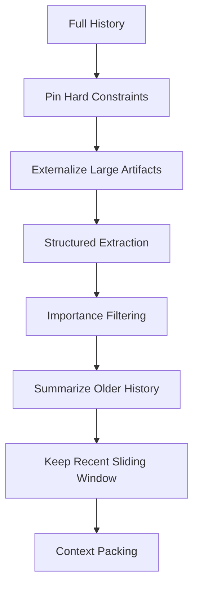

一种常见 Context 结构是：

```text
1. System and safety instructions
2. Current goal and acceptance criteria
3. Structured task state
4. Important long-term memories
5. Summary of earlier stages
6. Recent message window
7. Current Tool results
8. Output token reserve
```

各方法分工如下：

- Sliding Window 保留近期细节；
- Summary 保留早期整体语义；
- Importance Filtering 保留跨时间的关键内容；
- Structured Extraction 保留精确状态和事实；
- External Artifact 保存大体积原始数据。

## 10.8 额外方法：Deduplication

Agent 常产生大量重复内容：

- 多轮重复说明目标；
- 搜索结果重复引用同一网页；
- Tool 重试返回相同错误；
- 多个 Agent 生成相似结论。

Deduplication 可以：

- 使用内容哈希删除完全重复；
- 使用 Embedding 识别近似重复；
- 合并同一实体的相同事实；
- 将重复来源折叠为引用列表。

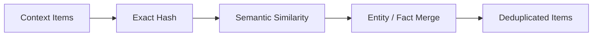

去重时应避免误删：

- 来自不同可信来源的相同结论；
- 看似相似但时间不同的事件；
- 数字不同的近似句子；
- 正向与否定表达。

## 10.9 额外方法：Externalization

Externalization 将大内容移出 Context，只保留摘要和引用。

适合：

- 长文档；
- 代码库；
- 日志；
- 搜索结果；
- 表格；
- 图片和多模态数据；
- 已完成阶段的详细轨迹。

```json
{
  "artifact_id": "tool-result-123",
  "uri": "artifact://tool-result-123.json",
  "summary": "包含 200 条搜索结果，已筛选 12 条高可信来源",
  "content_hash": "sha256:...",
  "schema": "search-results"
}
```

需要时通过 Tool 按片段重新读取。

这种方法不是删除信息，而是将“始终在 Context 中”改为“按需加载”。

## 10.10 额外方法：Hierarchical Memory

分层记忆同时保留不同粒度：

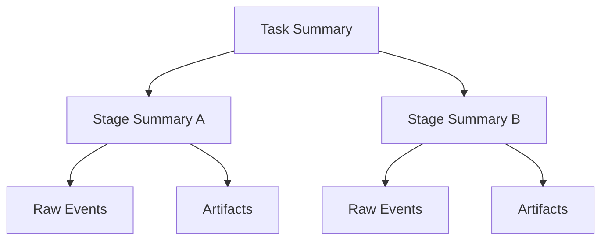

Agent 先读取 Task Summary；只有需要细节时，才展开 Stage Summary 或 Raw Event。

这是一种 Progressive Disclosure，可以显著降低无关上下文。

## 10.11 额外方法：Delta 与 State Compaction

对持续变化的状态，不需要每次保存完整副本。

例如计划更新：

```json
{
  "operation": "mark_completed",
  "task_id": "research-a",
  "timestamp": "2026-08-28T16:00:00Z"
}
```

系统可以：

- 用 Delta 记录变化；
- 周期性生成 Snapshot；
- 从 Snapshot + Delta 恢复当前状态。


这种方法主要减少状态存储和传输，不等同于自然语言摘要。

## 10.12 压缩触发时机

### 10.12.1 Token 阈值

当 Context 使用量接近预算时触发。

不应等到窗口完全耗尽，因为还需要为以下内容保留空间：

- 新 Tool Result；
- 模型输出；
- 错误恢复；
- 用户追加信息。

### 10.12.2 阶段切换

一个里程碑完成后：

- 生成阶段摘要；
- 提取结构化状态；
- 外部化 Artifact；
- 清理阶段内临时消息。

### 10.12.3 Tool Result 过大

大型 Tool 输出应立即外部化，而不是先塞入完整 Context 再压缩。

### 10.12.4 Checkpoint

任务暂停、转交 Agent 或持久化之前进行压缩和状态保存。

### 10.12.5 Context 质量下降

即使尚未接近长度上限，如果出现：

- 目标被遗忘；
- 重复动作；
- 无关历史持续干扰；
- Tool 选择变差；

也应重新构建 Context。

## 10.13 Token Budget 分配

总 Context Budget 不应全部用于历史：

$$
B_{total}=
B_{instruction}
+
B_{goal}
+
B_{state}
+
B_{memory}
+
B_{recent}
+
B_{tool}
+
B_{output}
$$

其中：

- `B_instruction`：系统、安全和工具说明；
- `B_goal`：目标与成功标准；
- `B_state`：结构化状态；
- `B_memory`：长期记忆；
- `B_recent`：最近消息；
- `B_tool`：当前 Tool 结果；
- `B_output`：模型输出预留。

预算应随任务阶段动态调整。例如：

- 搜索阶段给 Tool Result 更多空间；
- 写作阶段给 Evidence 和 Outline 更多空间；
- 调试阶段给错误日志和代码更多空间。

## 10.14 Prompt Caching 是什么

> Prompt Caching 处理的是跨请求的前缀计算复用；RAG 上下文增强中如何用它控制索引成本，见[RAG：语义被切断怎么办](../../rag/02-ingestion-indexing/05-semantic-truncation.md)。

Prompt Caching 缓存重复 Prompt 前缀的中间计算结果，使后续请求可以复用。

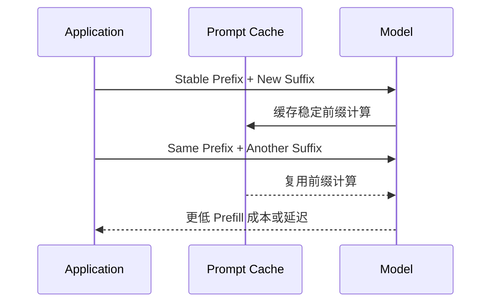

适合缓存：

- 长 System Prompt；
- Tool Definitions；
- 稳定项目说明；
- 大段重复文档；
- 多轮共享的固定前缀。

## 10.15 Prompt Caching 与记忆压缩的区别

| 维度 | Memory Compression | Prompt Caching |
|---|---|---|
| 优化层次 | 信息层 | 计算层 |
| 核心问题 | 带哪些信息进入 Context | 重复 Context 如何少算一次 |
| 是否减少 Context 长度 | 是 | 通常否 |
| 是否改变信息内容 | 可能改变或删除 | 不改变 |
| 是否释放 Context Window | 是 | 否 |
| 是否降低重复 Prefill 成本 | 间接 | 是 |
| 是否解决噪音问题 | 是 | 否 |

这里最容易被误解的是：

> **Prompt Caching 通常不会让 Context Window 变大，缓存 Token 仍属于模型输入上下文。**

即使缓存命中，模型仍然“看到”相同内容，只是服务端可能复用计算，从而降低成本或延迟。

## 10.16 Prompt Caching 与压缩如何配合

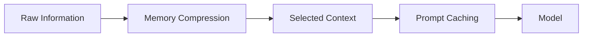

实践里通常先做两步：

1. 先决定哪些信息真正需要进入 Context；
2. 再对其中稳定、重复的前缀使用 Prompt Caching。

例如：

- System Instructions 和 Tool Definitions：适合缓存；
- 当前任务状态：需要压缩和动态更新；
- 旧对话：需要摘要或过滤；
- 大型 Artifact：需要外部化和按需检索。

## 10.17 Prompt Caching 的限制

- 通常要求前缀完全或高度一致；
- 缓存有生命周期；
- 不同模型或配置可能不能共享；
- 动态内容放在前缀中会降低命中率；
- 不能消除 Context 中的错误和噪音；
- 不能替代权限过滤；
- 不能替代长期记忆；
- 具体费用和缓存规则由模型服务商决定。

Prompt 设计时通常将稳定内容放在前面，动态内容放在后面，以提高缓存复用。

## 10.18 KV Cache 与 Prompt Caching

KV Cache 是 Transformer 推理中缓存 Attention Key/Value 状态的底层机制。

Prompt Caching 是模型服务对应用暴露的跨请求复用能力，底层可能利用 KV 或其他缓存实现。

| KV Cache | Prompt Caching |
|---|---|
| 模型推理内部机制 | 服务或 API 产品能力 |
| 常用于一次生成过程 | 通常跨请求复用前缀 |
| 开发者未必直接控制 | 开发者可以通过 Prompt 结构优化命中 |

两者都属于计算优化，不属于语义记忆压缩。

## 10.19 压缩质量怎么评估

### 10.19.1 Compression Ratio

$$
CR=1-\frac{L_{after}}{L_{before}}
$$

压缩比例高不代表质量高。如果关键约束被删除，再短也没有价值。

### 10.19.2 Constraint Retention

检查：

- 用户目标；
- 安全规则；
- 验收条件；
- 未解决问题；
- 关键数字和实体；

是否仍然保留。

### 10.19.3 State Accuracy

压缩后的状态是否准确反映：

- 已完成步骤；
- 当前步骤；
- 待执行步骤；
- 错误和重试；
- Artifact。

### 10.19.4 Task Success

比较压缩前后：

- 任务成功率；
- Tool 选择正确率；
- 重复调用；
- 幻觉率；
- 成本和延迟。

### 10.19.5 Recoverability

Agent 能否从压缩后的 Context 和外部 State：

- 恢复任务；
- 解释已完成内容；
- 找到原始证据；
- 继续下一步。

## 10.20 压缩测试方法

### 10.20.1 Needle Test

在长历史中放入关键约束，检查压缩后是否保留并正确使用。

### 10.20.2 Replay Test

从 Checkpoint 和压缩 Context 恢复 Agent，观察能否继续任务。

### 10.20.3 Differential Test

使用完整历史和压缩历史分别执行相同任务，比较结果差异。

### 10.20.4 Adversarial Test

测试：

- 早期安全约束；
- 后期冲突指令；
- 重复噪音；
- 恶意 Prompt Injection；
- 关键数字和否定关系。

### 10.20.5 Long-horizon Test

让 Agent 执行几十或上百步，检查：

- Summary Drift；
- 目标遗忘；
- 状态错乱；
- 重复动作；
- Artifact 丢失。

## 10.21 常见反模式

### 10.21.1 只保留最近 N 轮

可能删除最初目标和安全约束。

### 10.21.2 每轮都重写一个总摘要

容易产生累积失真。

### 10.21.3 让模型自由判断什么都可以删

缺少 Hard Rules 和结构化状态保护。

### 10.21.4 把代码和错误日志全部摘要

可能丢失精确行号、错误码和调用栈。应外部化并保留引用。

### 10.21.5 压缩后删除所有原始数据

导致无法审计、验证或重新生成摘要。

### 10.21.6 把 Prompt Caching 当作扩展窗口

缓存不减少输入长度，也不会消除信息噪音。

### 10.21.7 只追求最高 Compression Ratio

会鼓励系统删除真正有价值的信息。

### 10.21.8 摘要把「未验证的结论」写成「已确认的事实」

这是长周期 Agent 中危害最大、也最隐蔽的一种压缩失效。

典型场景：某个命令因超时或被中断而只输出了部分结果，摘要却把它记录为「已执行成功，结果为 X」。这条虚假的确定性会随摘要一路传播到后续所有轮次，而且因为它以「事实」形式出现，**后续不会有任何环节去重新验证它**。

缓解方式有三条：

1. 摘要中显式保留状态标记（`verified` / `unverified` / `failed`），而不是只记结论；
2. 保留工具调用的退出码与截断标记，不要在摘要阶段丢弃；
3. 对关键结论保留原始引用（日志位置、文件路径），使其可被重新核对。

### 10.21.9 只依赖上下文内的摘要链承载长期决策

多轮压缩会累积信息损耗，早期的关键决策与约束在若干轮压缩后可能彻底消失，形成难以追溯的「历史债」。

正确做法是把重要决策**同时写入外部文件或结构化状态**（即 10.9 节的 Externalization），让它不依赖摘要链的存续。压缩链负责「最近发生了什么」，外部文件负责「已经定下来的事」。

## 10.22 推荐的生产级压缩管道

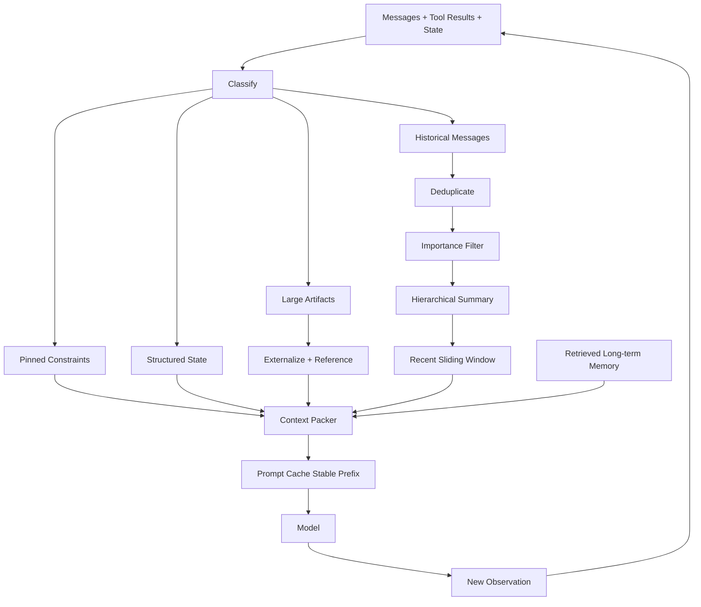

默认配置通常会从这套压缩组合起步：

1. 永久 Pin 系统、安全、目标和成功标准；
2. 将任务状态抽取为结构化数据；
3. 大型 Tool Result 立即外部化；
4. 对历史做去重和重要性过滤；
5. 已完成阶段使用分层摘要；
6. 保留最近交互窗口；
7. 长期记忆按当前任务检索；
8. 按 Token Budget 组装 Context；
9. 对稳定前缀使用 Prompt Caching；
10. 保留原始来源以支持恢复和审计。

## 10.23 方法选择表

| 问题 | 推荐方法 |
|---|---|
| 最近对话最重要 | Sliding Window |
| 需要保留早期整体语义 | Summarization |
| 关键内容分散在整个历史 | Importance Filtering |
| 需要精确状态和事实 | Structured Extraction |
| 存在大量重复信息 | Deduplication |
| Tool Result 或文档太大 | Externalization |
| 任务跨多个阶段 | Hierarchical Memory |
| 状态频繁变化 | Delta + Snapshot |
| 重复使用稳定 Prompt 前缀 | Prompt Caching |

## 10.24 本章总结

四种基础压缩方法解决不同维度：

1. **Sliding Window**：按时间截断历史；
2. **Summarization**：在截断前提炼语义；
3. **Importance Filtering**：打破时间顺序，按价值选择；
4. **Structured Extraction**：将对话转换为高密度状态。

现代系统通常还会结合：

- Deduplication；
- Artifact Externalization；
- Hierarchical Memory；
- Delta 与 Snapshot；
- Retrieval；
- Token Budget Packing。

Prompt Caching 与这些方法位于不同层次：

> **记忆压缩决定带什么信息，Prompt Caching 决定重复信息如何减少计算。**

两者互补，但 Prompt Caching 不会释放 Context Window，也不能替代摘要、过滤和结构化抽取。

落到实现上，通常会这样组合：

> **关键约束结构化并固定保留，大型信息外部化，旧历史分层摘要，近期细节使用窗口，长期知识按需检索，稳定前缀再使用缓存。**

## 参考资料

- [MemGPT: Towards LLMs as Operating Systems](https://arxiv.org/abs/2310.08560)
- [Anthropic: Effective context engineering for AI agents](https://www.anthropic.com/engineering/effective-context-engineering-for-ai-agents)
- [Chroma Research: Context Rot](https://research.trychroma.com/context-rot)
- [LangChain: Context Engineering for Agents](https://blog.langchain.com/context-engineering-for-agents/)
- [Anthropic Prompt Caching](https://docs.anthropic.com/en/docs/build-with-claude/prompt-caching)
- [OpenAI Prompt Caching](https://platform.openai.com/docs/guides/prompt-caching)
- [LangGraph Memory](https://docs.langchain.com/oss/python/langgraph/add-memory)
