# Chapter 10: Agent Memory and Context Compression

This chapter covers application-level context management. The JSON, times, quantities, and budgets are teaching examples, not production configurations or measured results.

## 10.1 Why Memory Compression Is Necessary

When context gets too long, can we simply summarize it and continue? Yes, but first distinguish two kinds of information: precise state cannot be maintained through free-form summaries, while historical narrative can be compressed as long as the underlying evidence remains accessible. For example, “Payment outcome unknown; do not retry” belongs in state and constraints. It must not become “There was a problem with the payment.”

During long tasks, an agent continually produces:

- User and model messages;
- Tool calls and tool results;
- Plans and state;
- Retrieved documents;
- Code, logs, and tables;
- Intermediate conclusions;
- Error and retry records.

Appending all of this to the context indefinitely can:

- Exceed the model's context window;
- Increase input token costs;
- Increase prefill overhead—the work of processing input before generation—although actual latency also depends on caching and the serving implementation;
- Bury important information in noise;
- Make the current goal harder for the model to identify;
- Allow old errors and irrelevant information to keep influencing later decisions.

Memory compression is not merely about shortening text. More importantly, it aims to:

> **Preserve as much of the information needed for the current task as possible within a limited token budget.**

A long window can hold more content, but it does not guarantee that every piece of evidence will be used correctly. Conversely, shorter context is not inherently more accurate. Removing necessary source text, multi-hop evidence, or counterexamples can reduce quality. Choose compression strength through controlled comparisons on the specific model and task, rather than assuming that “shorter is better.”

A simple objective is:

$$
J(C)=U(C)-\lambda L(C)
$$

Subject to:

$$
L(C)\le B
$$

Where:

- `C` is the compressed context;
- `U(C)` is the utility of the retained information for the current task;
- `L(C)` is the context length;
- `B` is the available token budget;
- `λ` weights the cost of length.

This illustrates a design objective; it is not an algorithm that directly computes an optimal summary. `U(C)` can usually only be approximated through downstream task performance. Authorization scope, required evidence, and message protocols should first be enforced as hard constraints: high utility cannot compensate for violating them.

## 10.2 Four Basic Methods

Four common methods address different problems:

| Method | Problem addressed | Main operation | Lossy? |
|---|---|---|---:|
| Sliding window | Which part of a long history to retain | Remove the oldest content | Yes |
| Summarization | How to distill a long history | Replace source text with a summary | Yes |
| Importance filtering | What to retain when information has unequal value | Select by task value | Usually |
| Structured extraction | Whether conversational text is the best representation | Convert it into structured state | Generally; except for complete, reversible representations |

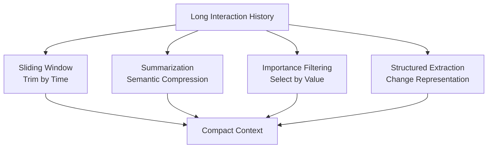

These methods are usually combined rather than treated as alternatives.

Externalization moves content out of the active context without necessarily reducing total storage. Removing something from the window is not the same as deleting it from a memory store. Application-level summaries, server-side compaction, and KV-cache quantization or eviction change text representations, service-managed context, and inference state, respectively. They should not all be treated as the same kind of “memory compression.”

## 10.3 Sliding Window: Trimming by Time

A sliding window keeps only the most recent turns or tokens in the active context and removes earlier content. A separate retention policy determines whether the persisted originals are deleted.

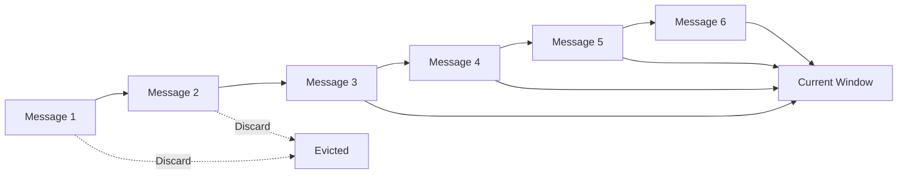

### 10.3.1 Common Implementations

#### By Conversation Turn Count

Keep only the most recent `N` turns.

Advantages:

- Simple to implement;
- Fast;
- Predictable behavior.

Disadvantages:

- Message lengths can vary greatly;
- Token usage cannot be controlled precisely.

#### By Token Count

Add messages from newest to oldest until the budget is reached.

Advantages:

- Controls model input size;
- Handles messages of varying lengths more effectively.

Disadvantages:

- Still selects by time rather than value;
- May remove important constraints stated early on.

#### By Task Stage

Keep detailed records of the current stage and move completed stages out of the active window.

When stage handoffs have clear boundaries, this makes it easier to preserve complete sequences of actions than trimming by turn count. However, a “completed stage” does not mean its evidence is no longer useful. Conclusions, failed approaches, and sources needed by the next stage must remain available or retrievable on demand.

### 10.3.2 Information That Ordinary Window Eviction Must Not Remove

The following usually needs to be pinned:

- System instructions;
- The user's current goal;
- Safety and authorization rules;
- Success criteria;
- The current plan and state;
- Unresolved issues;
- Constraints on high-risk operations.

Pin trusted content that is still valid, not historical text forever. If the user changes the goal or permission is revoked, update or remove the corresponding item. Authorization must always be enforced by the runtime, not merely by a sentence in the context. If the required items alone exceed the budget, split the task or stop the request rather than silently truncating them.

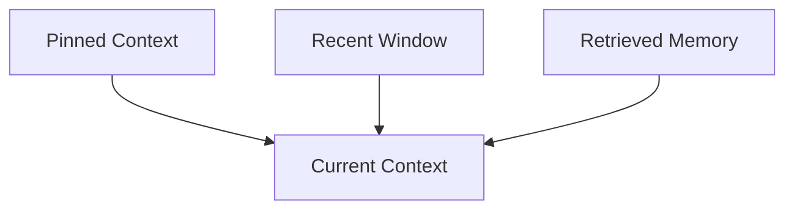

### 10.3.3 Do Not Break Tool Interactions

A tool call and its corresponding tool result should be treated as one logical unit. Keeping the call without its result, or the result without its call, can break the context.

It may also directly violate an API's message-format requirements. For parallel calls, check each call ID against its result. Do not fabricate successful results for unfinished calls. Some APIs also require particular continuation or reasoning items to be retained; follow their protocols. When trimming is necessary, remove completed interactions as a whole and preserve a summary or reference rather than leaving an orphaned tool result.

Similarly, avoid separating:

- A user question from the agent's answer;
- An error from its corresponding fix;
- A plan step from its execution result;
- A citation from the conclusion it supports.

### 10.3.4 When a Sliding Window Fits

- Recent content is clearly more important than earlier content;
- Conversations are short;
- Essential information can be recovered from external state;
- Compression must be inexpensive and low-latency.

It is a truncation strategy, not a comprehension strategy.

## 10.4 Summarization: Replacing History with a Summary

Before deleting earlier history, summarization extracts important information into a shorter representation.

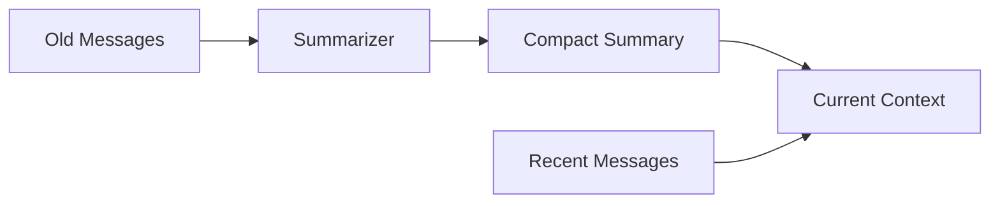

### 10.4.1 Rolling Summary

Maintain a continuously updated summary:

```text
new_summary = summarize(old_summary + newly_evicted_messages)
```

Advantages:

- Simple to implement;
- An output budget can constrain summary length;
- Well suited to ongoing conversations.

Risks:

- Repeated rewriting can cause summary drift;
- Early details may gradually disappear;
- Model-generated errors may enter later summaries.

For example, “The test timed out; payment outcome unknown; do not retry” might become “Payment failed; retry is allowed.” This loses uncertainty and reverses the operational constraint. Further summarization will not automatically recover either. The system must return to the original event or authoritative business state to check.

### 10.4.2 Hierarchical Summary

First generate local summaries, then combine them into stage or task summaries:

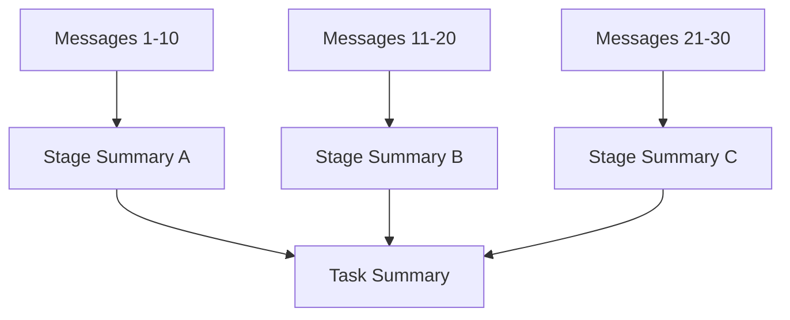

Compared with repeatedly rewriting one summary, this makes it easier to:

- Preserve sources;
- Locate missing information;
- Expand individual stages;
- Support long-running tasks.

### 10.4.3 Query-Focused Summary

Retain only information relevant to the current task or stage.

For example, when an agent moves from “gathering material” to “writing the report,” the summary can focus on:

- Verified facts;
- Sources;
- Comparative conclusions;
- Unresolved conflicts.

It no longer needs a detailed account of every search attempt.

However, retain brief notes on rejected paths and why they were rejected, so the next stage does not repeat failed searches. Reassess the summary when the task changes. A summary prepared for an earlier question is not a general-purpose knowledge index.

### 10.4.4 Event Summary

Summarize key events:

- Decisions;
- Tool successes or failures;
- Plan changes;
- User confirmations;
- Newly discovered constraints.

### 10.4.5 What a Good Summary Should Retain

- The original goal;
- Explicit user constraints;
- Completed and unfinished steps;
- Key facts;
- Important tool results;
- Decisions and their rationale;
- Errors and recovery status;
- Source and artifact references.

### 10.4.6 Summary Drift

Repeated summarization can lead to:

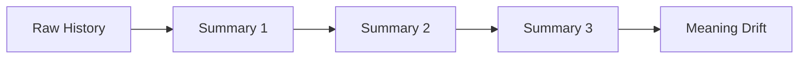

Mitigations:

- Preserve the original history or artifacts;
- Attach source references to summaries;
- Do not repeatedly summarize stable structured fields;
- Periodically regenerate summaries from original data;
- Use structured state for goals, permissions, and numbers;
- Use a verifier to check for omissions and contradictions.

A verifier can also miss errors, especially if it and the summarizer read only the same flawed summary. Compare summaries with original evidence, checking IDs, numbers, negation, time ranges, and status precisely. Retrieve the original text for missing items. References should also identify source events, versions, or content hashes: a URL alone cannot recover the evidence as it existed at the time if the page has since changed.

A summary is derived data. Its permissions generally must not allow a wider audience than the intersection of the read permissions on its included sources. Broadening its audience requires a separate sanitization and release review. When a source is withdrawn, deleted, or superseded, invalidate or rebuild summaries that depend on it rather than merely deleting vector records.

## 10.5 Importance Filtering: Selecting by Value

Chronological order does not determine information value. A safety constraint in the user's first turn may matter more than the last ten routine messages.

Importance filtering selects what to retain based on the current task.

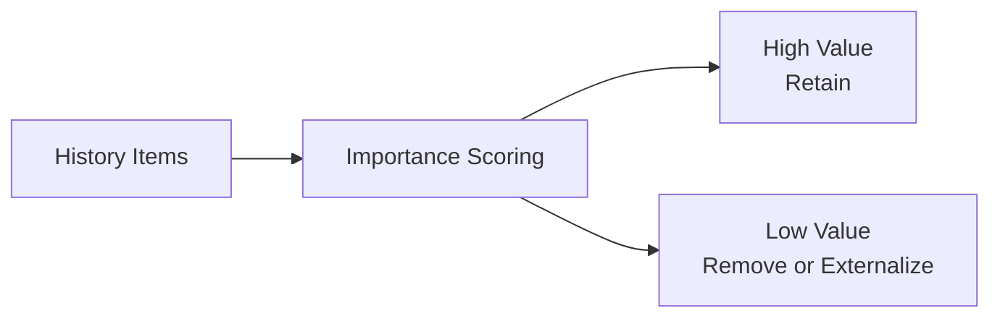

### 10.5.1 Importance Signals

- Relevance to the current goal;
- Whether it is an explicit user constraint;
- Whether it affects safety or authorization;
- Whether it concerns an unresolved issue;
- Whether later tasks depend on it;
- Source trustworthiness;
- Whether it contains unique information;
- Freshness;
- Whether it can be retrieved again from an external system.

A basic utility score can be expressed as:

$$
U_i=\alpha R_i+\beta I_i+\gamma D_i+\delta T_i+\epsilon N_i-\zeta C_i
$$

Where:

- `Rᵢ`: Goal relevance;
- `Iᵢ`: Importance;
- `Dᵢ`: Dependency value;
- `Tᵢ`: Trust;
- `Nᵢ`: Novelty;
- `Cᵢ`: Token cost.

These components need calibration on task samples. The formula does not imply that an accurate, ready-made “importance score” exists. The same information has different value for different questions: a summarized conclusion may suffice for an overview, while financial reconciliation may require the full ledger row and its units.

### 10.5.2 Hard Rules and Model Scoring

The model should not decide the importance of every item on its own.

#### Hard Rules

Always retain:

- System instructions;
- Safety policies;
- Explicit user goals;
- Permissions;
- Current task state;
- Unresolved errors.

#### Model Scoring

Can be used to:

- Assess the relevance of historical facts to the current stage;
- Select representative episodes;
- Extract key points from repetitive tool results.

### 10.5.3 Risks of Importance Filtering

- The model may remove genuinely important information;
- Information that seems irrelevant now may matter later;
- The current prompt may bias importance scores;
- Malicious content may masquerade as high-priority instructions.

Original material that still has a legitimate purpose can therefore be externalized under a retention policy for later retrieval. Sensitive or unauthorized content must not be retained indefinitely merely because it “might be useful later.”

## 10.6 Structured Extraction: Changing the Representation

Natural-language conversations are often verbose, repetitive, and difficult to update precisely. Structured extraction converts history into a compact state representation.

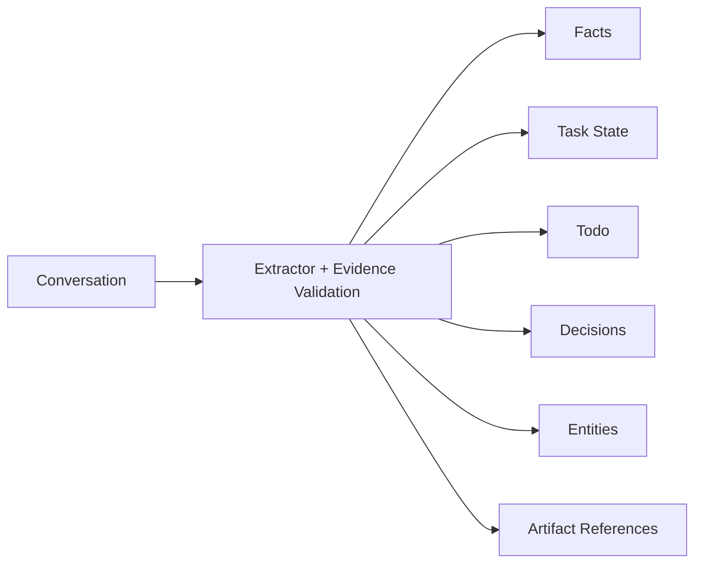

### 10.6.1 Example

Original conversation: the user says, “Do not create a PR; commit subsequent chapters directly to main.” The agent replies, “Understood; I will commit directly to main from now on.”

```text
用户：不要创建 PR，直接把后续章节提交到 main。
Agent：明白，后续直接提交到 main。
```

After structuring:

```json
{
  "subject": "user-42",
  "repository": "example/knowledge-base",
  "publishing_preference": {
    "target_branch": "main",
    "create_pull_request": false
  },
  "source": "explicit_user_instruction",
  "source_event_id": "event-example",
  "verification_status": "user_stated",
  "scope": "current_repository"
}
```

A structured representation:

- May reduce tokens for verbose, repetitive conversations, although converting a short sentence into JSON may make it longer;
- Is easier to update precisely;
- Is better suited to rule enforcement;
- Makes conflicts easier to detect;
- Can be queried by field after validation, without reinterpreting the entire conversation each time.

Extraction can still misread the source. “The user prefers direct commits” must not become permission to bypass branch protection. Only the data representation has changed here: nothing has been published, and the user's authority to publish has not been established.

### 10.6.2 Suitable Information to Extract

#### Task State

The example goal is to complete the agent knowledge graph.

```json
{
  "goal": "完成 Agent 知识图谱",
  "current_chapter": 10,
  "status": "writing",
  "pending": [
    "validate formatting",
    "publish to main"
  ]
}
```

#### Decisions

The reason given is that chapters need headings, lists, links, and code blocks.

```json
{
  "decision": "Use GitHub-Flavored Markdown",
  "reason": "章节需要标题、列表、链接和代码块",
  "status": "active"
}
```

#### Open Questions

```json
{
  "question": "Should the next chapter cover evaluation?",
  "owner": "user",
  "status": "open"
}
```

#### Entity Facts

```json
{
  "subject": "user",
  "predicate": "preferred_formula_format",
  "object": "GitHub-compatible LaTeX"
}
```

### 10.6.3 Risks of Structured Extraction

- The schema may omit information;
- The model may extract incorrectly;
- Ambiguity and uncertainty can be difficult to represent;
- Structured fields may lose their original context;
- Schema version changes require migration.

Retain source references so the system can return to the original text when necessary.

Schema validity proves only that fields have the right shape, not that their contents are true. Runtime state should be updated by the executor and confirmed tool results. A model may propose a patch, but it must not extract `completed` merely from “I am about to do this.” Ambiguous statements should retain `unknown`, their scope, and the original wording rather than being forced into definite facts.

## 10.7 Combining the Four Methods

In practice, these methods are often arranged in a pipeline:

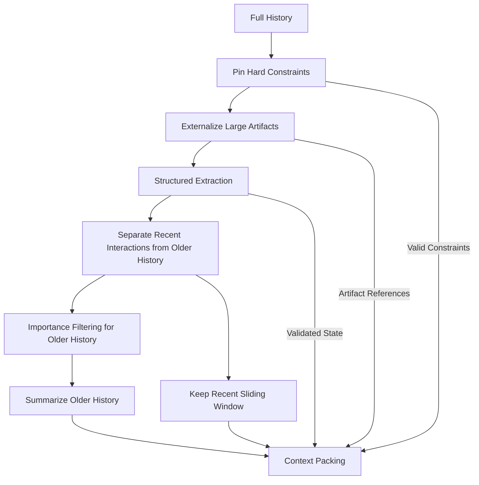

The parallel inputs in this diagram matter: current constraints, structured state, and artifact references enter context packing directly without first passing through the history summarizer. Historical summaries supply background; they must not be the only source for recovering precise state.

A common context structure is:

```text
1. System and safety instructions
2. Current goal and acceptance criteria
3. Structured task state
4. Important long-term memories
5. Summary of earlier stages
6. Recent message window
7. Current Tool results
```

The output budget is a request setting and a capacity reservation, not a passage to insert into the prompt. The numbering above illustrates organization, not the model's instruction hierarchy. Historical summaries and retrieved data do not gain system-instruction authority simply by appearing earlier.

The methods divide the work as follows:

- A sliding window preserves recent detail;
- Summaries preserve the overall meaning of earlier history;
- Importance filtering preserves key content across time;
- Structured extraction preserves precise state and facts;
- External artifacts preserve large volumes of raw data.

## 10.8 Additional Method: Deduplication

Agents often produce substantial repetition:

- Restating the goal across turns;
- Citing the same web page in multiple search results;
- Receiving the same error on tool retries;
- Producing similar conclusions across agents.

Deduplication can:

- Remove exact duplicates using content hashes;
- Identify near-duplicates using embeddings;
- Merge identical facts about the same entity;
- Collapse repeated sources into a reference list.

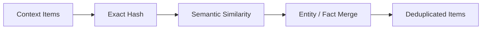

Avoid incorrectly removing:

- The same conclusion from different trustworthy sources;
- Similar-looking events that occurred at different times;
- Similar sentences containing different numbers;
- Positive and negated statements.

Repeated occurrences of the same error may indicate a persistent failure. Deduplication must not lose the occurrence count or time span. If several sources repeat the same conclusion by republishing one original, retain their provenance chain rather than counting them as independent corroboration.

## 10.9 Additional Method: Externalization

Externalization moves large content out of the context, keeping only summaries and references.

It is suitable for:

- Long documents;
- Codebases;
- Logs;
- Search results;
- Tables;
- Images and multimodal data;
- Detailed traces of completed stages.

The example summary describes 200 search results, from which 12 highly trustworthy sources have been selected.

```json
{
  "artifact_id": "tool-result-123",
  "uri": "artifact://tool-result-123.json",
  "summary": "包含 200 条搜索结果，已筛选 12 条高可信来源",
  "content_hash": "sha256:...",
  "schema": "search-results"
}
```

Use a tool to reread the relevant segments when needed.

Rather than deleting information, this changes access from “always in context” to “loaded on demand.”

This requires references that resolve, identify a version, and have not expired, plus a read tool available to the agent. A URI and hash do not contain the source text. Recovery fails if an object has been deleted, access revoked, a link expired, or retrieval failed. Segment reads should return position, range, and truncation status, with authorization enforced by the tool. Leaking a sensitive conclusion through a summary is still a leak; protecting only the original object is not enough.

## 10.10 Additional Method: Hierarchical Memory

Hierarchical memory retains multiple levels of detail:

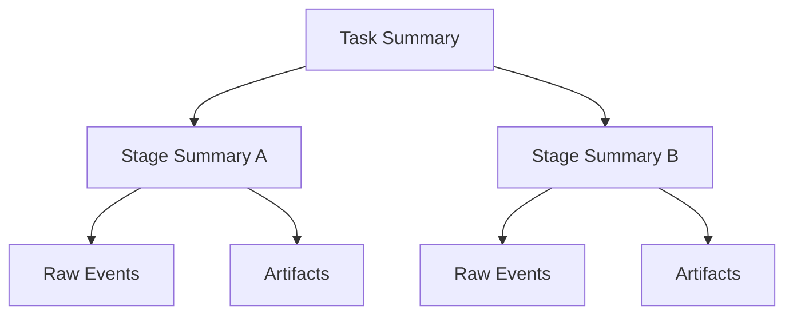

The agent first reads the task summary and expands a stage summary or raw event only when it needs details.

This is progressive disclosure. It may reduce irrelevant context, but it introduces additional retrieval rounds and a risk of omissions. If the overview leaves out a critical detail, the agent may never expand the correct branch. Preserve a path for directly retrieving the original material, and measure end-to-end latency.

## 10.11 Additional Method: Deltas and State Compaction

Continuously changing state does not require a complete copy to be saved on every update.

For example, a plan update:

```json
{
  "operation": "mark_completed",
  "task_id": "research-a",
  "timestamp": "2026-08-28T16:00:00Z"
}
```

The system can:

- Record changes as deltas;
- Periodically create snapshots;
- Recover current state from a snapshot plus deltas.


This mainly reduces state storage and transfer; it is not equivalent to natural-language summarization.

Recovery requires a defined event order, stable event IDs, state versions, and idempotent application rules. A snapshot must also agree with the log position through which events have been incorporated. Timestamps alone cannot establish the order of every concurrent event. Event replay must not re-execute side effects such as payments or emails. External effects that have already occurred need separate execution records and reconciliation.

## 10.12 When to Trigger Compression

### 10.12.1 Token Threshold

Trigger compression when context usage approaches the budget.

Do not wait until the window is completely full, because space must remain for:

- New tool results;
- Model output;
- Error recovery;
- Additional user information.

### 10.12.2 Stage Transition

After completing a milestone:

- Generate a stage summary;
- Extract structured state;
- Externalize artifacts;
- Remove temporary messages from that stage.

### 10.12.3 Oversized Tool Results

Externalize large tool outputs immediately instead of inserting them into the context in full and only then compressing them.

### 10.12.4 Checkpoint

When a task pauses or transfers to another agent, compressed handoff information can be generated. However, saving a checkpoint must not depend on successful LLM summarization. First persist precise state, event positions, and tool results reliably. Then generate replaceable summaries asynchronously, so a compression failure does not also destroy the recovery point.

### 10.12.5 Declining Context Quality

Even before approaching the length limit, rebuild context if you observe:

- Forgotten goals;
- Repeated actions;
- Persistent interference from irrelevant history;
- Deteriorating tool selection.

These are reasons to reconsider the assembled context.

They are only diagnostic signals: incorrect tools or an inaccurate plan can also cause them. Do not automatically blame excessive context length. If reconstruction fails, preserve the old state and the reason for failure. Fall back to selecting original material or executing in stages rather than continuing to act on an incomplete summary.

## 10.13 Allocating the Token Budget

History should not consume the entire context budget:

$$
B_{total}=
B_{instruction}
+B_{goal}
+B_{state}
+B_{memory}
+B_{recent}
+B_{tool}
+B_{output}
$$

Where:

- `B_instruction`: System, safety, and tool instructions;
- `B_goal`: Goals and success criteria;
- `B_state`: Structured state;
- `B_memory`: Long-term memory;
- `B_recent`: Recent messages;
- `B_tool`: Current tool results;
- `B_output`: Capacity reserved for model output.

This is an illustrative budget breakdown. First establish how the model API counts capacity, then allocate input, output, and safety margins. Some reasoning models count reasoning tokens toward the output allowance or a shared window. Tool schemas, image and audio representations, and message wrappers also consume capacity. Use the actual tokenizer or server-side counts; a character-based estimate is not a hard guarantee.

`B_total` is the allocated budget, not necessarily the model's advertised maximum window. Unallocated capacity covers counting errors and recovery headroom. If required content still does not fit after accounting for overhead such as tool schemas, execute in stages rather than compressing exact IDs or unresolved state just to meet the length limit.

When setting a compression trigger, reserve room for the largest acceptable tool result and the next output instead of applying a universal “compress at a certain percentage” rule. If tool results are unbounded, first cap, paginate, or externalize them so a single response cannot overflow the window.

Budgets should change with the task stage. For example:

- Allocate more space to tool results during search;
- Allocate more space to evidence and outlines during writing;
- Allocate more space to error logs and code during debugging.

## 10.14 What Is Prompt Caching?

> Prompt caching reuses prefix computation across requests. It does not directly cache embeddings or vector indexes. For its relationship to context enrichment during RAG ingestion, see [RAG: What to Do When Semantic Context Is Cut Off](../../rag/02-ingestion-indexing/05-semantic-truncation.md).

Prompt caching saves intermediate computation for repeated prompt prefixes so later requests can reuse it.

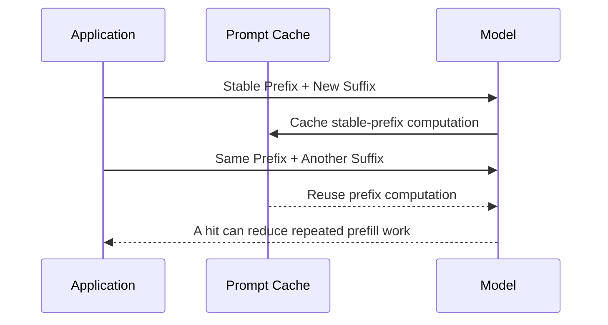

Good caching candidates include:

- Long system prompts;
- Tool definitions;
- Stable project descriptions;
- Large, repeated documents;
- Fixed prefixes shared across turns.

## 10.15 Prompt Caching Versus Memory Compression

| Dimension | Memory compression | Prompt caching |
|---|---|---|
| Optimization layer | Information | Computation |
| Core question | Which information belongs in the context? | How can repeated context avoid repeated computation? |
| Reduces context length? | That is the aim, but measure it; structured representations can be longer | No |
| Changes information content? | May change or remove it | No |
| Frees context-window capacity? | Only when it actually reduces input tokens | No |
| Reduces repeated prefill cost? | Possibly indirectly; include the cost of compression itself | A hit can reduce repeated computation; total charges depend on write and read rules |
| Addresses noise? | May reduce noise or mistakenly remove evidence | No |

The most common misunderstanding is:

> **Prompt caching generally does not enlarge the context window. Cached tokens still belong to the model's input context.**

Even with a cache hit, the model still “sees” the same content. The server may simply reuse computation to reduce cost or latency.

## 10.16 Combining Prompt Caching and Compression

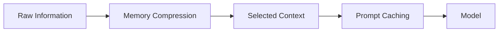

In practice, start with two steps:

1. Decide which information actually needs to enter the context;
2. Apply prompt caching to its stable, repeated prefixes.

For example:

- System instructions and tool definitions are good caching candidates;
- Current task state needs compression and dynamic updates;
- Old conversations need summarization or filtering;
- Large artifacts need externalization and on-demand retrieval.

Do not compare only “how much smaller this turn's input became.” Total cost may rise if summarization costs more than it saves on later calls, or if frequent summary rewrites invalidate stable prefixes. Measure the cost of one compression pass, then estimate how many remaining turns will reuse it. Near the end of a task, simple trimming is often a more useful baseline.

## 10.17 Limitations of Prompt Caching

- The prefix caching discussed here requires an exact match of the reusable prefix, not semantic similarity or “high consistency”;
- Cache entries have a lifetime;
- Different models or configurations may not share cache entries;
- Dynamic content in the prefix reduces hit rates;
- Caching does not remove errors or noise from context;
- It does not replace authorization filtering;
- It does not replace long-term memory;
- The model provider defines the actual pricing and caching rules.

Prompt designs usually place stable content first and dynamic content later to improve cache reuse.

The [official OpenAI documentation](https://developers.openai.com/api/docs/guides/prompt-caching) explains that the actual rendered prefix must match. Changes to the model, tool schemas, ordering, or relevant settings can change the reusable portion. Minimum cacheable lengths, breakpoint mechanisms, write charges, and retention periods vary by model and service version. Numbers for one model must not be generalized into universal rules.

Frequent rewrites of an early summary can invalidate the cache for later content, and compression calls themselves cost money. Compare total bills and time to first token, measuring cold-cache, warm-cache, and post-compression requests separately. Do not keep sending revoked permissions or expired sensitive data merely to preserve cache hits.

## 10.18 KV Cache and Prompt Caching

A KV cache is the underlying mechanism that caches attention key/value state during Transformer inference.

Prompt caching is the cross-request reuse capability a model service exposes to applications. Its implementation may use KV state or other caches.

| KV cache | Prompt caching |
|---|---|
| Internal model-inference mechanism | Service or API product capability |
| Commonly used within one generation | Usually reuses prefixes across requests |
| Developers may not control it directly | Developers can improve hit rates through prompt structure |

Both are computational optimizations, not semantic memory compression.

KV-cache quantization, eviction, and offloading are another set of inference-system techniques. They may affect accuracy, GPU memory use, and latency, but are not equivalent to producing an auditable summary. An application using only a hosted API should not assume that it can manipulate these underlying states.

### 10.18.1 Server-Side Compaction Is Not a Prompt Cache Either

[Compaction in OpenAI Responses](https://developers.openai.com/api/docs/guides/compaction) produces an opaque, encrypted compaction item for subsequent requests. This service capability reduces later context rather than merely reusing prefix computation. Nor should its internal representation be assumed to be a readable natural-language summary.

Distinguish two API paths:

- **Explicit calls to `/responses/compact`**: The submitted window must still fit within the chosen model's window. The response is a complete new compacted window. It may retain other messages in addition to the compaction item. Use the entire returned window as the basis for later requests, rather than extracting only the encrypted item and discarding the rest.
- **Server-side automatic compaction enabled in `/responses`**: The server triggers compaction at a configured threshold. Stateless input-array chaining and continuation through `previous_response_id` have different rules for passing history. Do not mix their manual-trimming logic.

Applications should not parse or rewrite the encrypted item. Consult the documentation for the relevant endpoint to check model support and server-side state-retention options. Neither path replaces the application's own task state, factual sources, authorization, or deletion management. Neither is a portable, cross-provider audit record.

## 10.19 Evaluating Compression Quality

### 10.19.1 Compression Ratio

$$
CR=1-\frac{L_{after}}{L_{before}}
$$

Here, `CR` is defined as the token reduction rate, with `L_before` required to be positive. If a summary or JSON representation is longer than the original, `CR` is negative and must not be reported as a saving. Other sources may define compression ratio as `L_before / L_after`; always state the definition used.

Use the same tokenizer and content boundaries for both counts. This metric describes only how much the current context shrank. Claims of end-to-end savings must also include summary generation, rereading externalized material, and additional model calls.

A high compression ratio does not imply high quality. If key constraints are lost, even a very short result has no value.

### 10.19.2 Constraint Retention

Check whether the compressed context still retains:

- User goals;
- Safety rules;
- Acceptance criteria;
- Unresolved issues;
- Key numbers and entities.

All of these need to survive compression.

### 10.19.3 State Accuracy

Does the compressed state accurately reflect:

- Completed steps;
- The current step;
- Pending steps;
- Errors and retries;
- Artifacts?

### 10.19.4 Task Success

Compare before and after compression:

- Task success rate;
- Correct tool-selection rate;
- Repeated calls;
- Hallucination rate;
- Cost and latency.

### 10.19.5 Recoverability

Can the agent use the compressed context and external state to:

- Resume the task;
- Explain what has been completed;
- Find original evidence;
- Continue to the next step?

## 10.20 Testing Compression

### 10.20.1 Needle Test

Place a key constraint in a long history and check whether it survives compression and is used correctly.

A single needle test does not establish long-range reasoning ability. Also cover multiple related pieces of evidence, distractors, temporal updates, negation, and cases with no answer.

### 10.20.2 Replay Test

Restore an agent from a checkpoint and compressed context, then observe whether it can continue the task.

Interrupt separately “before tool execution,” “after execution but before state is persisted,” and “during summary generation.” Assert that side effects are not repeated, unknown outcomes are not converted into successes, and artifacts with revoked access are not read. Recovery correctness must be checked against actual state, not just the response text.

### 10.20.3 Differential Test

Run the same task with full history and compressed history, then compare the results.

The full history must fit within the model, and any server-side truncation must be disclosed. It is a baseline, not ground truth. Add comparisons with no memory, a recent window, and directly supplied human-annotated evidence. Fix the model version and task distribution, run multiple trials, and report variation. In addition to final accuracy, measure constraint retention, evidence traceability, and degradation caused by compression.

### 10.20.4 Adversarial Test

Test:

- Early safety constraints;
- Later conflicting instructions;
- Repeated noise;
- Malicious prompt injection;
- Key numbers and negation relationships.

### 10.20.5 Long-Horizon Test

Have the agent execute dozens or hundreds of steps, checking for:

- Summary drift;
- Forgotten goals;
- Corrupted task state;
- Repeated actions;
- Lost artifacts.

The number of test steps should come from the distribution of business-task traces, not a universal reliability threshold. Record the cumulative number of compression passes and check whether older information disappears over successive rounds. Total cost should include summary generation, index writes, extra retrieval, and recovery calls.

For public datasets, consider [LoCoMo](https://github.com/snap-research/locomo) for event summarization and question answering, [LongMemEval](https://github.com/xiaowu0162/LongMemEval) for knowledge updates and abstention, and [LongMemEval-V2](https://github.com/xiaowu0162/LongMemEval-V2) for retrieving experience from trajectories. They do not directly validate your own checkpoints, ACLs, or side-effect recovery. Pin dataset versions and group statistics by conversation or trajectory rather than treating related questions as independent user samples.

## 10.21 Common Antipatterns

### 10.21.1 Keeping Only the Last N Turns

This may remove the initial goal and safety constraints.

### 10.21.2 Rewriting One Overall Summary Every Turn

This invites cumulative distortion.

### 10.21.3 Letting the Model Freely Decide That Anything Can Be Removed

This lacks hard rules and protection for structured state.

### 10.21.4 Summarizing All Code and Error Logs

This can lose exact line numbers, error codes, and stack traces. Externalize them and retain references instead.

### 10.21.5 Deleting All Original Data After Compression

If precise evidence is still needed later, retaining only a lossy summary makes auditing, verification, and regeneration impossible. That is not a reason to retain originals forever, however. Set retention periods according to legitimate purposes, delete originals and derived data when they expire, and make clear which recovery capabilities end with them.

### 10.21.6 Treating Prompt Caching as a Larger Window

Caching neither reduces input length nor removes information noise.

### 10.21.7 Pursuing Only the Highest Compression Ratio

This encourages the system to delete genuinely valuable information.

### 10.21.8 Turning “Unverified Conclusions” into “Confirmed Facts”

This failure can propagate easily in multi-turn tasks, especially when deciding the next action.

A typical case: a command times out or is interrupted after producing only partial output, but the summary records “Executed successfully; result is X.” Without independent verification later, this false certainty can spread into subsequent plans and operations.

Three mitigations are:

1. Retain execution status (`pending` / `succeeded` / `failed` / `unknown`) separately from conclusion-verification status (`verified` / `unverified`), rather than recording only the conclusion;
2. Preserve tool-call exit codes and truncation flags instead of dropping them during summarization;
3. Retain original references for important conclusions—log locations and file paths—so they can be checked again.

### 10.21.9 Relying Only on In-Context Summary Chains for Long-Term Decisions

Repeated compression accumulates information loss. Important early decisions and constraints may vanish completely after several passes, creating “historical debt” that is difficult to trace.

Also write important decisions to external files or structured state—the externalization described in Section 10.9—and retain their sources, versions, and scope. External storage does not mean the model can automatically read the information. A stable loading entry point and read-back validation are still required. When decisions change, invalidate old records as well rather than allowing an old file to remain an active constraint indefinitely.

## 10.22 A Recommended Production Compression Pipeline

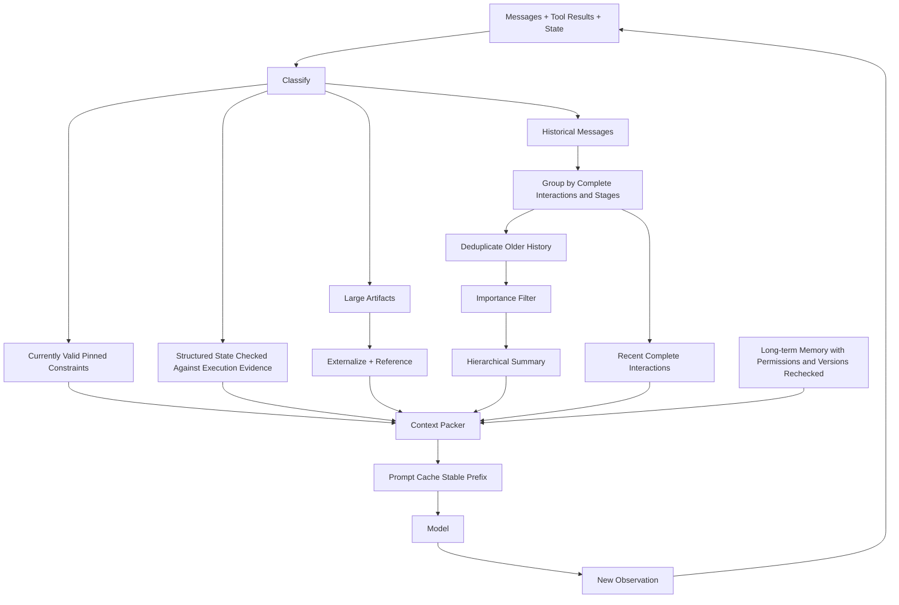

Choose combinations from the following according to the task. Short tasks do not necessarily need summaries or hierarchical storage:

1. Retain currently valid system instructions, safety rules, goals, and success criteria, updating them as permissions and goals change;
2. Extract task state into structured data and check it against execution evidence;
3. Externalize large tool results immediately;
4. Deduplicate history and apply importance filtering;
5. Use hierarchical summaries for completed stages;
6. Keep a recent interaction window;
7. Retrieve long-term memory for the current task;
8. Assemble context within the token budget;
9. Use prompt caching for stable prefixes;
10. Retain original sources within authorization and retention limits, and verify that references remain readable and recovery paths work.

## 10.23 Method Selection

| Problem | Recommended method |
|---|---|
| Recent conversation matters most | Sliding window |
| The overall meaning of earlier history must survive | Summarization |
| Key content is scattered throughout the history | Importance filtering |
| Precise state and facts are needed | Structured extraction |
| Information contains substantial repetition | Deduplication |
| Tool results or documents are too large | Externalization |
| A task spans multiple stages | Hierarchical memory |
| State changes frequently | Delta + snapshot |
| A stable prompt prefix is reused | Prompt caching |

## 10.24 Chapter Summary

The four basic compression methods address different dimensions:

1. **Sliding window**: Trim history by time;
2. **Summarization**: Distill meaning before trimming;
3. **Importance filtering**: Select by value rather than chronology;
4. **Structured extraction**: Extract candidate state and check the evidence. Schema validity guarantees neither factual correctness nor fewer tokens.

Modern systems often also combine:

- Deduplication;
- Artifact externalization;
- Hierarchical memory;
- Deltas and snapshots;
- Retrieval;
- Token-budget packing.

Prompt caching operates at a different layer:

> **Memory compression decides what information to carry; prompt caching decides how to reduce computation for repeated information.**

They complement each other, but prompt caching does not free context-window capacity or replace summarization, filtering, and structured extraction.

After compression, check the goal, unresolved state, key evidence, and readability of references at least once. If these cannot be recovered, return to original records or explicitly report insufficient information rather than treating a fluent summary as a complete history.

## References

- [MemGPT: Towards LLMs as Operating Systems](https://arxiv.org/abs/2310.08560)
- [Anthropic: Effective context engineering for AI agents](https://www.anthropic.com/engineering/effective-context-engineering-for-ai-agents)
- [Chroma Research: Context Rot](https://research.trychroma.com/context-rot)
- [LangChain: Context Engineering for Agents](https://blog.langchain.com/context-engineering-for-agents/)
- [Anthropic Prompt Caching](https://docs.anthropic.com/en/docs/build-with-claude/prompt-caching)
- [OpenAI Prompt Caching](https://developers.openai.com/api/docs/guides/prompt-caching)
- [OpenAI Compaction](https://developers.openai.com/api/docs/guides/compaction)
- [LangGraph Memory](https://docs.langchain.com/oss/python/langgraph/add-memory)
- [LoCoMo official release notes, snapshot 9228632](https://github.com/snap-research/locomo/blob/92286325a40764bee61f77824ddb95233b11c4d6/README.MD) (ACL 2024 release; this snapshot's `data/locomo10.zip` contains ten per-conversation JSON files)
- [LongMemEval official documentation, snapshot 9e0b455](https://github.com/xiaowu0162/LongMemEval/blob/9e0b455f4ef0e2ab8f2e582289761153549043fc/README.md) (distinguishes the original release from the September 2025 cleaned release)
- [LongMemEval-V2 official documentation, snapshot 2cc8c54](https://github.com/xiaowu0162/LongMemEval-V2/blob/2cc8c540bdb87fe6761629b585e727e1c4704520/README.md)

Source review recorded in the original manuscript: 2026-09-15. The OpenAI caching and compaction references are rolling Responses API documentation and do not promise identical pricing, thresholds, or history-passing rules across models or versions. The server-side APIs were not tested in that review. The Anthropic caching entry remains supplementary reading; it was not used to add conclusions about specific parameters.
