# Chapter 9: Single-Agent and Multi-Agent Systems

If one agent cannot keep up, should you split the work among several? Not necessarily. Adding agents makes sense only when the separated parts can progress independently and the gains from isolation, specialization, or parallelism outweigh handoff and verification costs. This chapter first defines independent decision-making, then examines how to divide work, coordinate it, and establish whether the split is worthwhile.

Here, the distinction between single-agent and multi-agent systems depends on whether execution units have their own local decision loops. Terminology varies across papers and frameworks. The competitor research, message fields, dates, and hypothetical numbers in this chapter are teaching examples, not the author's project experience.

## 9.1 What Is a Single-Agent System?

A single-agent system has one primary dynamic decision-maker. It can:

- Call multiple tools;
- Use long-term memory;
- Execute complex workflows;
- Use different models for different steps;
- Call multiple workers in parallel if those workers have no autonomous decision loops.

The defining question is not how many model calls occur, but:

> **Apart from the main agent, do the invoked execution units independently choose their next actions based on their own observations?**

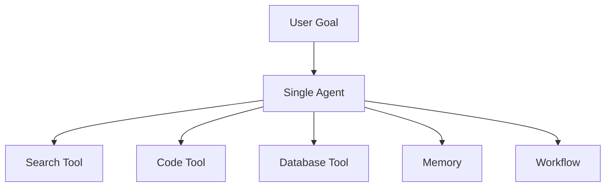

An agent using ten tools can still be a single-agent system.

However, “exposed through a tool interface” does not mean there is no agent inside. A search service that executes a supplied query or fixed process is an ordinary tool. If a model uses each round's results to decide what to search next and when to stop before returning an answer, it is a delegated subagent under this chapter's definition. The main agent can retain the global goal while the overall system is still multi-agent.

## 9.2 What Is a Multi-Agent System?

A multi-agent system contains several relatively independent agents. Each typically has its own:

- Role and goal;
- Context;
- State or memory;
- Tools and permissions;
- Decision loop;
- Input/output contract.

They collaborate toward an overall goal through messages, tasks, artifacts, or shared workspaces.

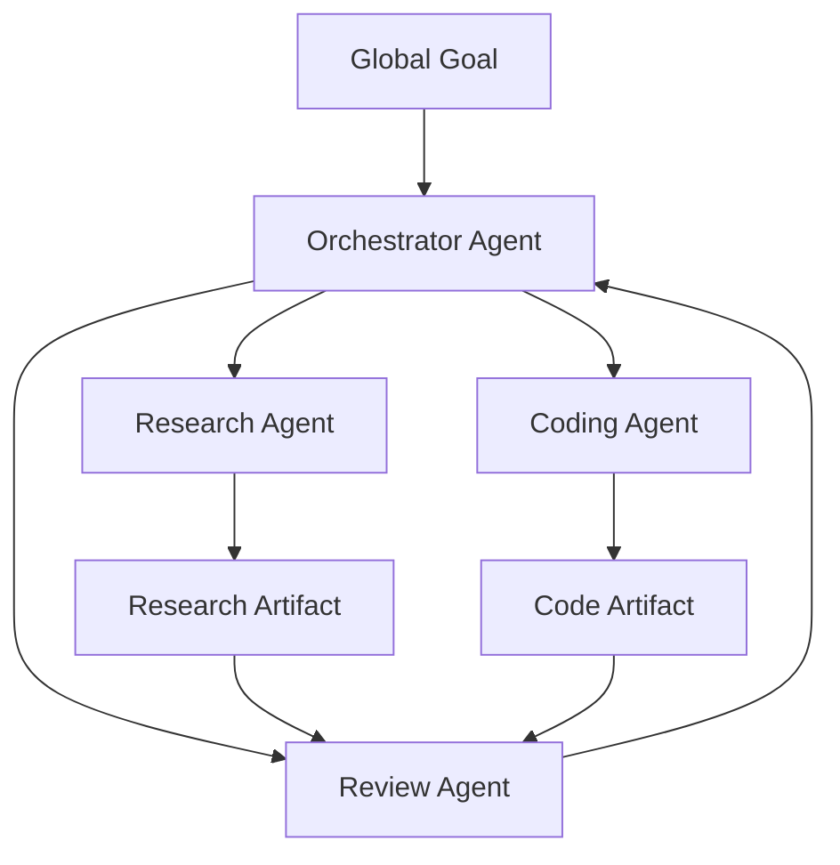

> **A multi-agent system is not simply “a few more model calls.” It coordinates agents with separate responsibilities and local decision-making authority.**

## 9.3 Multiple Role Prompts Do Not Make a Full Multi-Agent System

Under this chapter's local-decision-loop criterion, the following designs alone do not constitute a multi-agent system:

- One agent using “researcher” and “writer” prompts in sequence;
- A workflow making three stateless LLM calls in parallel;
- One model generating multiple candidates followed by voting;
- Multiple tools executing different functions.

These may be examples of:

- Role prompting;
- Parallel LLM calls;
- Ensembles;
- Workflows;
- Tool orchestration.

This chapter classifies a system as multi-agent only when multiple execution units each retain local state, choose subsequent actions from observations, and coordinate through explicit protocols. This definition helps discuss control and failure boundaries; it does not reject the broader use of “multi-agent” in other literature.

## 9.4 The Actual Limits of a Single Agent

Discussions of single-agent limitations often start with:

1. The context window;
2. The capabilities or expertise of a single decision-maker.

Both are real concerns, but they require a more precise interpretation.

### 9.4.1 The Context Window Limits an Individual Model Call

A multi-agent system does not change the underlying model's context window. Instead, it:

- Partitions task context;
- Gives each agent only local information;
- Exchanges results through summaries or artifacts.

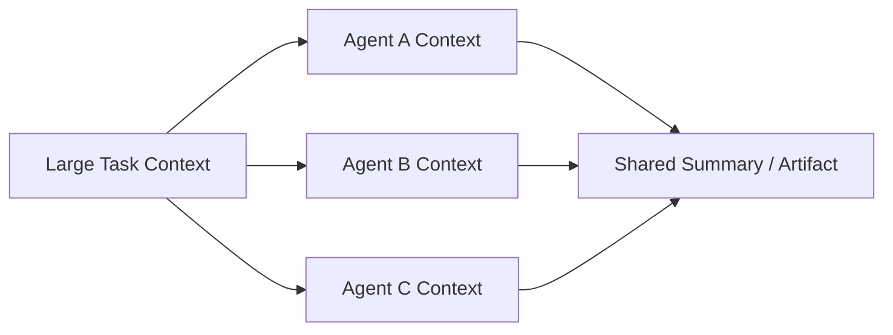

This can reduce the context burden on an individual agent, but introduces:

- Information loss at agent boundaries;
- Summary bias;
- Repeated retrieval;
- Cross-agent conflicts;
- Integration costs.

A single agent can also handle long tasks through context engineering, external state, artifacts, and hierarchical memory. The context window is therefore not a structural dead end that only a multi-agent system can overcome.

### 9.4.2 Assigning Roles Does Not Automatically Create Expertise

If multiple agents:

- Use the same model;
- Use similar prompts;
- Access the same data;
- Use the same tools;
- Lack independent evaluation criteria;

Then giving them different names may not meaningfully improve their expertise.

Real specialization comes from:

- Different system instructions;
- Domain-specific data;
- Different tools;
- Different models;
- Separate permissions;
- Dedicated output schemas;
- Role-specific evaluation sets;
- Clear, narrowly scoped task contracts.

> **A role name is not expertise. Specialized context, tools, data, and evaluation are what establish it.**

## 9.5 Why Use a Multi-Agent System?

The benefits generally fall into five areas.

### 9.5.1 Context Isolation

Each agent loads only the information it needs, reducing interference from irrelevant content.

For example:

- A research agent focuses on sources and facts;
- A coding agent focuses on code and tests;
- A review agent focuses on changes and acceptance criteria.

### 9.5.2 Specialization of Capabilities and Permissions

Different agents can use different:

- Models;
- Tools;
- Skills;
- Data sources;
- Permissions;
- Safety policies.

For example, a research agent may have read-only web access, while only a deployment agent can access the deployment system.

### 9.5.3 Parallel Execution

Agents without dependencies on each other can work simultaneously:

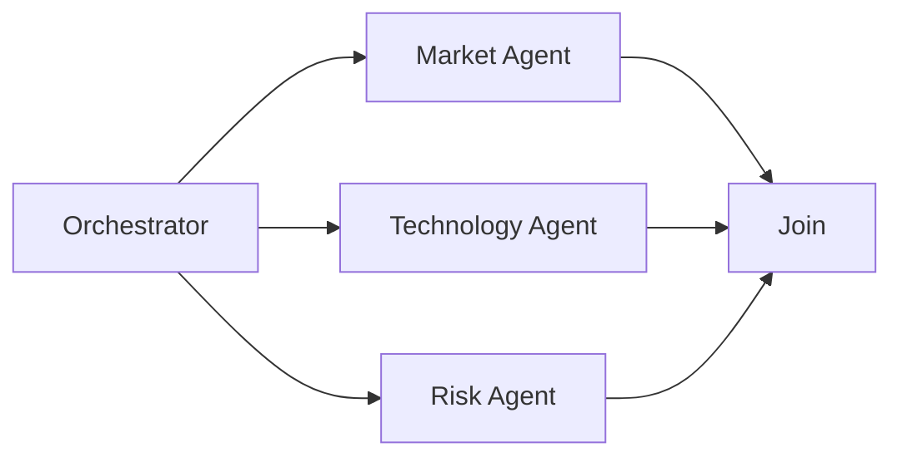

### 9.5.4 Fault Isolation

When a worker fails, the system can:

- Retry only that worker;
- Switch to a backup agent;
- Fall back to a simpler tool;
- Preserve the other agents' results.

This requires the runtime to isolate task state, resources, and side effects. Splitting prompts does not isolate process crashes, shared API rate limits, or credential leaks. Assigning two workers to modify the same shared file may actually expand the failure's impact.

### 9.5.5 Multiple Perspectives and Checks

Different agents can:

- Propose solutions independently;
- Critique one another's results;
- Check facts;
- Analyze risks under different assumptions.

However, agents that share a model may share its biases, so multiple perspectives cannot replace objective verification.

## 9.6 Multi-Agent Systems Are Not Necessarily More Capable

A multi-agent system adds:

- Communication costs;
- Token consumption;
- Scheduling complexity;
- Latency;
- State synchronization;
- Error-propagation paths;
- Permission management;
- Observability requirements.

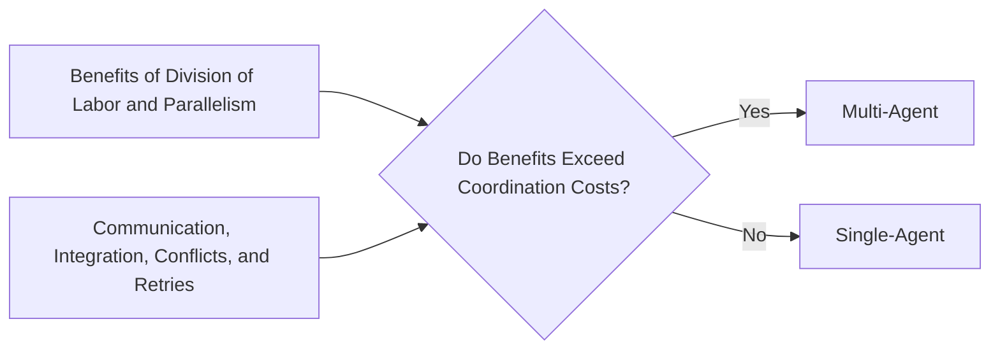

A complex task does not automatically call for a multi-agent system. If it cannot be separated cleanly, multiple agents may merely turn one difficult problem into several difficult coordination problems.

### 9.6.1 Different Task Assumptions in Two 2025 Engineering Articles

The following accounts describe engineering experience with particular systems. They are not theorems about all multi-agent systems, nor complete descriptions of either company's current product capabilities.

**Cognition's article** focuses mainly on long-running coding tasks. When agents work in parallel, A does not know what decisions B has made. Even if they share the initial requirements, conflicting implicit assumptions can emerge later. The author therefore recommends starting with a single-threaded agent that maintains continuous context, then compressing long trajectories. This warns about risks in tightly coupled tasks; it is not a security requirement to “copy every trace to every agent.” Share relevant decisions, interfaces, and evidence without propagating credentials or unrelated private context.

**Anthropic's research-system article** reports that a Claude Opus 4 lead agent with Sonnet 4 subagents outperformed a single Opus 4 system by 90.2% on its internal research evaluation. In its data, multi-agent systems consumed roughly 15 times as many tokens as ordinary chats, while single agents consumed roughly 4 times as many. The [original article](https://www.anthropic.com/engineering/multi-agent-research-system) does not provide all the details needed to reproduce the internal evaluation. The 90.2% figure does not mean a 90.2-percentage-point increase in accuracy, and 15 times is not a universal multiplier “relative to a single agent.” The model combination, additional reasoning budget, and task decomposition changed together, so the entire gain cannot be attributed to topology.

### 9.6.2 Understanding and Reconciling the Difference

The articles do not compare the same tasks under equal budgets. Task coupling and isolation boundaries explain part of the difference:

| Boundary design | Effect |
|---|---|
| Flat peer agents working in parallel, making their own decisions, and merging afterward | Coupled tasks are vulnerable to conflicting implicit assumptions; independent partitions with fixed interfaces can still work |
| Explicit role hierarchy, such as planner and executor | Can reduce context interference; executors still need relevant global constraints and a way to report errors in the plan |
| Isolated exploratory subtasks that return conclusions and evidence references | Keeps the main context concise; original artifacts must remain accessible when summaries omit details |

A more useful engineering criterion is:

> Agent count is not a measure of benefit. First ask whether isolation reduces context interference and whether specialization or parallelism produces verifiable gains. If agents keep exchanging large volumes of intermediate decisions after the split, reconsider the boundaries.

Research can run in parallel by independent source or topic, but reasoning across topics may not be separable. Coding tasks can also investigate unrelated modules in parallel, while changes to shared APIs and data models should begin with agreed interfaces. When parallelism is limited, consider a sequential workflow or single agent first. Add sequential role hierarchies only when context or permission isolation itself has value.

## 9.7 When a Single-Agent System Fits

- The task has relatively few steps;
- One context can hold the main information;
- Tools and permissions are relatively uniform;
- Subtasks are tightly coupled;
- There is no clear opportunity for parallelism;
- Fast iteration and simple maintenance matter;
- A single agent already meets the quality target.

### 9.7.1 Advantages

- Simple architecture;
- Simpler relationships between state writers, although external concurrency and side effects still need consistency controls;
- Shorter debugging paths;
- Lower token and communication costs;
- A simpler permission model;
- Easier reproduction of execution.

### 9.7.2 Limitations

- Long tasks can strain context capacity;
- One control loop may become a bottleneck;
- One loop still coordinates autonomous decisions, although deterministic workers and tools can run concurrently;
- Different permission scopes and specialized contexts can interfere with one another;
- A single-point failure may affect the whole task.

## 9.8 When a Multi-Agent System Fits

Any of the following benefits can justify considering a multi-agent system, but each still requires validation of separability, cost, and reliability. Heterogeneous expertise and parallelism need not both be present.

### 9.8.1 Tasks Can Be Clearly Separated

Subtasks have explicit inputs, outputs, and acceptance criteria.

### 9.8.2 There Is Genuine Heterogeneity in Expertise

Different subtasks require different:

- Data;
- Models;
- Tools;
- Skills;
- Permissions;
- Evaluation methods.

### 9.8.3 Useful Parallelism Exists

Multiple subtasks can run concurrently, and the gains exceed scheduling and integration costs.

### 9.8.4 Permission Isolation Is Needed

For example:

- A search agent has read-only web access;
- A coding agent can modify only its workspace;
- A deployment agent requires human approval;
- An audit agent can only read immutable logs.

### 9.8.5 Fault Isolation or Scaling Is Needed

Large numbers of similar tasks can be distributed to a worker pool, with independent retries and scaling.

Neither permission isolation nor worker pools are exclusive to multi-agent systems. If a deterministic workflow, separate service accounts, and an ordinary task queue meet the requirements, there is no need to add model-driven decision loops.

## 9.9 Selection Requires More Than Three Conditions

“Context is nearly full, specialized roles are needed, and parallel subtasks exist” is a useful initial screen, but also consider:

| Dimension | Key question |
|---|---|
| Separability | Can subtasks be separated through explicit interfaces? |
| Coupling | Do subtasks need to share implicit context frequently? |
| Verifiability | Can each agent's output be verified independently? |
| Coordination cost | Are communication and integration too expensive? |
| Risk | Do multiple agents expand permissions and the attack surface? |
| State consistency | Is strongly consistent shared state required? |
| Latency | Can the critical path actually be shortened? |
| Scale | Is independent scaling necessary? |

If subtasks are tightly coupled and continually exchange large amounts of context, a single agent or a shared-state workflow may be more suitable.

## 9.10 A Path from Simple to Complex

The following is a way to examine whether complexity is necessary, not a mandatory architectural progression. Fixed tasks can use a workflow directly without first implementing an unconstrained agent.

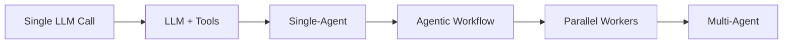

If the bottleneck is unclear, investigate in this order. If the process is already known to be fixed, start directly with a workflow:

1. Optimize a single call;
2. Add tools and retrieval;
3. Use a single agent;
4. Fix the main process in a workflow;
5. Parallelize independent tasks;
6. Introduce a multi-agent system only when independent decision-makers are needed.

## 9.11 Centralized Orchestrator-Workers

In a centralized architecture, the orchestrator coordinates:

- Understanding the global goal;
- Decomposing tasks;
- Selecting workers;
- Managing dependencies;
- Tracking state;
- Aggregating results;
- Handling failures and retries.

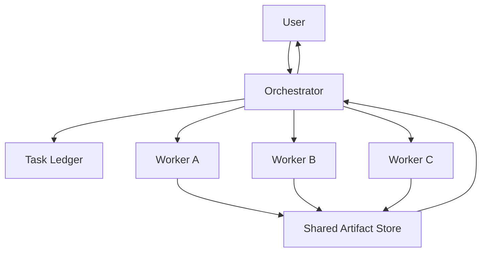

### 9.11.1 Advantages

- One consistent global goal;
- Clear scheduling paths;
- Easier tracing and auditing;
- Centralized permission and budget management;
- Easier failure localization;
- A good fit for DAG and critical-path scheduling.

### 9.11.2 Limitations

- The orchestrator can become a single-point bottleneck;
- An orchestrator error can affect all workers;
- Global state may become too large;
- Large volumes of worker messages increase coordination pressure;
- Central-node failures require recovery mechanisms.

### 9.11.3 Dividing Responsibilities Between Model and Scheduler

Centralization concerns logical control ownership. It does not require every function to live in one LLM call or process. The LLM can propose subtasks and dependencies; a deterministic scheduler validates the DAG, persists task claims, enforces authorization, and manages execution budgets. After a restart, the scheduler should recover from the ledger rather than asking the model again, “Where were we?”

One possible arrangement is:

- A workflow providing outermost control;
- One top-level orchestrator;
- Multiple domain-level sub-orchestrators;
- Leaf workers executing specific tasks.

## 9.12 Hierarchical Multi-Agent Systems

A hierarchy fits systems with many agents and clear domain boundaries.

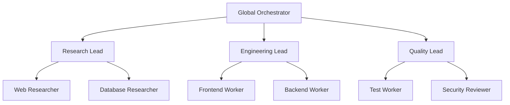

Advantages:

- The top-level agent need not manage every detail;
- Each domain maintains local context;
- Domains can scale independently;
- The structure suits the organization of large tasks.

Risks:

- Information can be distorted by multiple layers of summarization;
- Responsibility boundaries may be unclear;
- Errors can propagate through the hierarchy;
- Cross-domain coordination may slow down.

## 9.13 Pipeline Architecture

A pipeline has multiple agents process work in a fixed order:

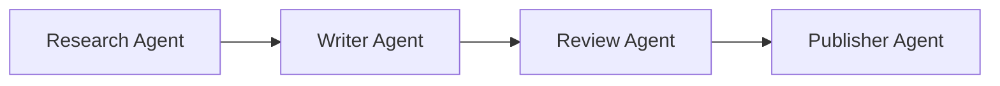

It is closer to a workflow:

- The developer defines the sequence;
- Each agent owns one stage;
- Agents usually cannot freely choose the next stage.

What is fixed is the routing **between stages**. Each stage may still contain an autonomous search, writing, or verification loop. If each stage is just one fixed LLM call, it is an ordinary LLM workflow. Naming its stages “agents” does not make it a multi-agent system.

It fits situations where:

- Stages are fixed;
- Inputs and outputs are clear;
- Each stage needs a separate specialized context.

The risk is that upstream errors propagate downstream, so each stage needs a validation gate and acceptance criteria.

## 9.14 Blackboard / Shared Workspace

Rather than sending all messages directly to one another, agents read and write a shared workspace:

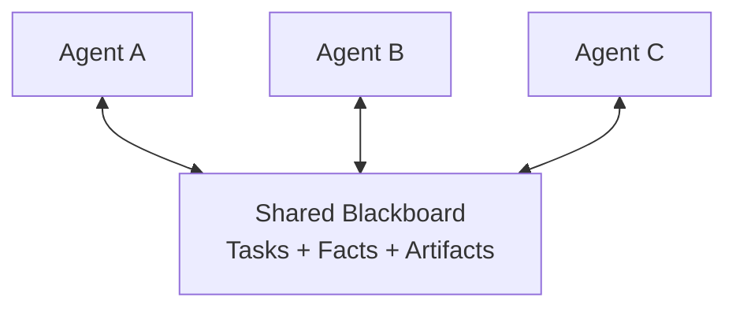

The workspace can contain:

- A task ledger;
- Artifacts;
- Verified facts;
- Unresolved issues;
- Task state;
- Versions and locks.

Advantages:

- Fewer point-to-point messages;
- Reusable results;
- Easier asynchronous collaboration;
- Agents can join or leave at any time.

Risks:

- Write conflicts;
- Stale state;
- Contamination of shared content;
- Overly broad permissions;
- Lack of a clear owner.

Versioning, leases, atomic updates, and provenance tracking are needed.

Distinguish two types of conflict. Two workers overwriting the same field is a storage-concurrency problem, handled through transactions, CAS—an atomic update conditional on a version comparison—or a single writer. Two reports reaching opposite conclusions about the same fact is a semantic conflict that requires checking sources, dates, and applicable conditions. Handling CAS failures correctly prevents lost updates; a retry must not simply force an overwrite. CAS also cannot establish a report's correctness, and agreement by most agents is no substitute for factual verification.

## 9.15 Peer-to-Peer Architecture

In a peer-to-peer architecture, agents can discover and contact one another directly:

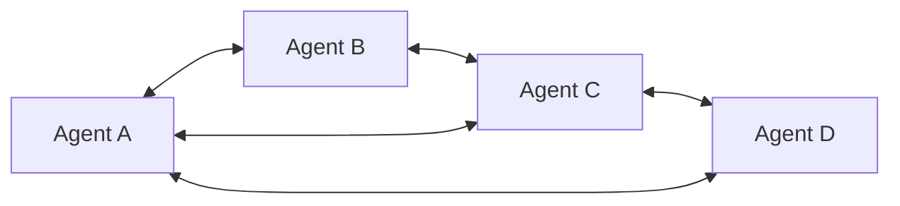

### 9.15.1 Advantages

- No single central scheduling bottleneck;
- Agents can form collaborations dynamically;
- Suitable for systems spanning distributed organizational boundaries;
- A local node failure need not stop the entire system;
- Applicable to negotiation, simulation, and open ecosystems.

### 9.15.2 Engineering Challenges

Decentralization does not inherently mean a lack of coordination, but coordination mechanisms must be explicitly designed:

- Who allocates tasks?
- How are duplicate task claims prevented?
- How are dependencies represented?
- How is loss of contact with an agent detected?
- How are dispatched tasks canceled?
- How are conflicting results handled?
- How is completion of the global task determined?
- Who has final decision-making authority?

Without these mechanisms, problems include:

- Duplicate work;
- Message storms;
- Incorrect ordering;
- Deadlock;
- Livelock;
- Tasks with no owner;
- Failures that are not propagated;
- Inconsistent global state.

### 9.15.3 Decentralization Can Be Used in Production

Peer-to-peer systems can be made production-ready through:

- A capability registry;
- Task leases;
- A distributed task ledger;
- Heartbeats and failure detectors;
- Idempotent messages;
- Atomic commits of task ownership and explicit conflict rules for business results;
- Trace correlation;
- Timeout and cancellation protocols;
- An owner for the final result.

The difficulty is the high cost of implementing these mechanisms. For agent systems within one team and one product, centralized or hierarchical orchestration is usually simpler.

Agent negotiation here is not strong consensus in the Raft/Paxos sense. The former discusses proposals and evidence; the latter ensures that storage replicas agree on log order and committed state under a specified failure model. If a replicated task ledger is needed, use a database or coordination service with the required guarantees rather than asking LLMs to vote for an owner. [Raft](https://raft.github.io/) tolerates a certain number of crash failures, but neither validates business facts nor provides Byzantine fault tolerance against malicious agent outputs.

## 9.16 Hybrid Topologies

Real systems often combine patterns:

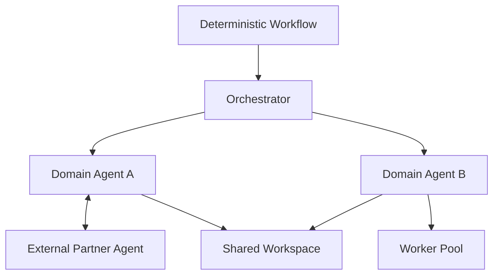

For example:

- An orchestrator manages internal tasks;
- A worker pool operates within one domain;
- Agents from different companies collaborate through A2A;
- A shared workspace aggregates results;
- Workflows and human approval still control high-risk actions.

## 9.17 How Agents Communicate

Free-form chat should not be the only protocol between agents.

The following examples show a request, a successful result, and a blocked result. The last two represent different execution outcomes; they do not require the same attempt to return both statuses in sequence.

### 9.17.1 Task Message

The request is to research competitor A's updates over the last six months, using at least two independent sources and including publication dates and links.

```json
{
  "task_id": "research-a",
  "attempt_id": "research-a-attempt-1",
  "input_version": 1,
  "goal": "调研竞品 A 最近六个月的更新",
  "inputs": {
    "published_from": "2026-02-28T00:00:00Z",
    "published_before": "2026-08-28T00:00:00Z"
  },
  "success_criteria": [
    "至少两个独立来源",
    "输出包含发布日期和链接"
  ],
  "deadline": "2026-08-28T09:00:00Z",
  "reply_to": "orchestrator-1"
}
```

### 9.17.2 Result Message

The result summary reports three major product updates.

```json
{
  "task_id": "research-a",
  "attempt_id": "research-a-attempt-1",
  "input_version": 1,
  "status": "completed",
  "artifact_uri": "artifact://research-a.json",
  "summary": "发现三个主要产品更新",
  "validation": {
    "source_count": 4,
    "independent_source_count": 2,
    "passed": true
  }
}
```

### 9.17.3 Error Message

The blocked result asks for an alternative data source or human input.

```json
{
  "task_id": "research-a",
  "attempt_id": "research-a-attempt-1",
  "input_version": 1,
  "status": "blocked",
  "error": {
    "code": "SOURCE_UNAVAILABLE",
    "retryable": true
  },
  "needs": "备用数据源或人工输入"
}
```

Structured messages support scheduling, retries, and monitoring.

These are application-defined examples, not standard A2A messages. The start and end dates fix the query range. `task_id` identifies the logical task, `attempt_id` distinguishes retries, and `input_version` prevents results for old requirements from entering a new task. On receiving a result, the runtime should check the current attempt and input version. Overwriting solely by `task_id` can admit results from an old, canceled execution.

`completed` means the executor reports completion; `validation.passed` is also only its claim. The accepting party still needs to read the artifact and check source independence and whether dates fall within the requested range. Four republished links may trace back to just one original source. The runtime should record final success after validation, not by copying the worker's self-assessment.

## 9.18 A2A and Agent Cards

A2A can help agents in different systems:

- Discover capabilities;
- Negotiate interaction modes;
- Send tasks and messages;
- Track task status;
- Exchange artifacts.

An Agent Card describes:

- Agent identity;
- Service endpoints;
- Supported capabilities and skills;
- Authentication requirements;
- Input and output modes.

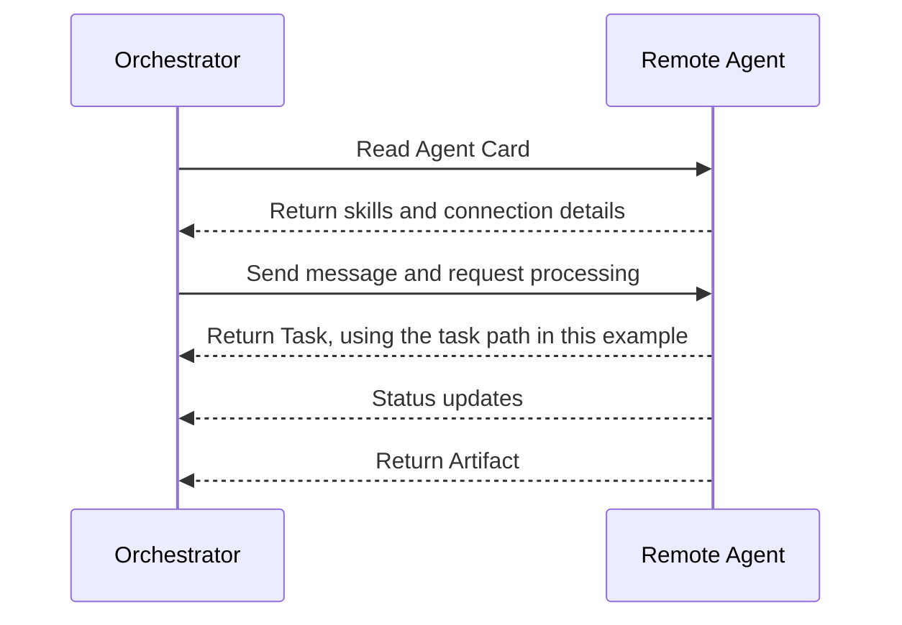

A2A standardizes communication; it does not automatically solve task decomposition, trust, fees, conflicts, or global scheduling. The diagram shows the path in which the server returns a Task and its status is then tracked. A simple request can instead return a Message directly; not every interaction must create a Task.

This section is pinned to [A2A v1.0.1](https://github.com/a2aproject/A2A/releases/tag/v1.0.1), whose wire-protocol version identifier is `1.0`. Integration requires choosing a binding supported by both parties: the concrete mapping onto JSON-RPC, HTTP/REST, or gRPC. Application-defined JSON is not automatically a standard message. An Agent Card declares capabilities; it is neither a capability evaluation nor an authorization credential. Cross-organization calls still need verified service identities and separate agreements on timeouts, fees, and result acceptance.

## 9.19 Designing Shared Memory

Agents should not share every message.

A layered design is recommended:

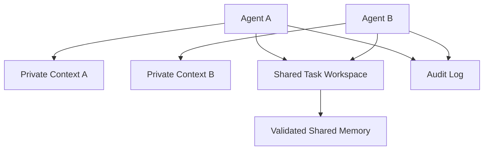

### 9.19.1 Private Context

Store local working notes and task state. Recovery needs available inputs, tool results, decision summaries, and checkpoints. It must not depend on hidden reasoning that the provider does not expose.

### 9.19.2 Shared Task Workspace

Store:

- Task status;
- Artifacts;
- Verified facts;
- Unresolved issues;
- Dependencies.

### 9.19.3 Validated Shared Memory

Store only verified information that can be reused across tasks.

### 9.19.4 Audit Log

Preserve message and action traces that cannot be arbitrarily modified.

## 9.20 Permissions and Security

Each agent should follow least privilege:

| Agent | Recommended permissions |
|---|---|
| Research agent | Read-only web and knowledge-base access |
| Coding agent | Workspace files and test commands |
| Review agent | Read-only code and diffs |
| Deployment agent | Approval-gated deployment permissions |
| Finance agent | Restricted business APIs and rigorous auditing |

Do not distribute the same credentials to every worker merely because the orchestrator has broad privileges.

The expanded attack surface includes:

- Malicious agent messages;
- Prompt injection spreading across agents;
- Shared-memory poisoning;
- Impersonation;
- Confused-deputy problems;
- Task delegation beyond the caller's authority;
- Sensitive artifact leaks.

Message authentication, authorization checks, provenance tracking, and trust boundaries are necessary.

## 9.21 Failure Propagation and Recovery

### 9.21.1 Centralized Architecture

The orchestrator can centrally handle:

- Timeouts;
- Loss of contact with workers;
- Retries;
- Worker replacement;
- Cancellation of downstream tasks;
- Returning partial results.

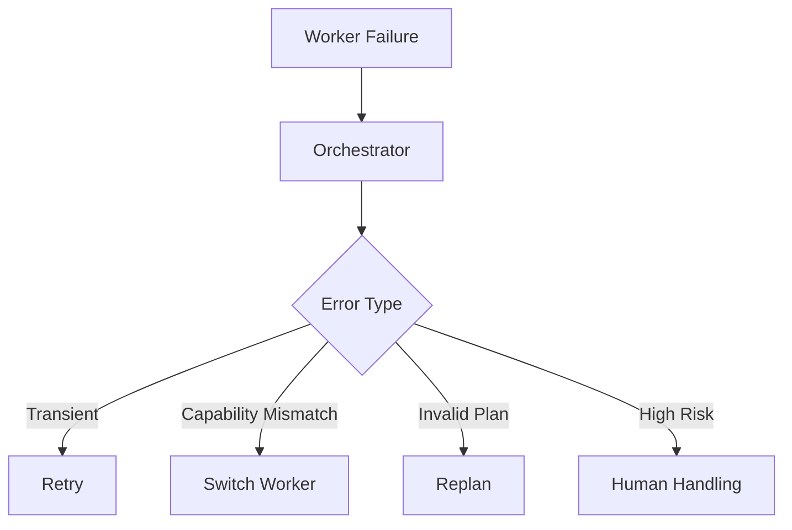

### 9.21.2 Decentralized Architecture

In a decentralized system, no node inherently owns failure handling. Assign explicit responsibility for:

- Failure detection;
- Task lease expiration;
- Deduplication of repeated execution;
- A leader or result owner;
- Eventual consistency;
- Message replay.

These mechanisms also apply to remote workers in centralized systems. In particular, “the lease expired” does not mean “the old worker stopped.” After a network partition, the previous executor may still be running. A task ledger can issue monotonically increasing fencing tokens, and the storage or business service receiving writes must reject older generations. Recording an expiry time only in the scheduler cannot stop the old process from continuing to write.

Side effects need separate handling. If an email was sent successfully but the result response was lost, retrying with another worker may send it again. Use the same idempotency key for the same logical operation across retries, or query the external state before deciding. Stopping the wait, requesting cancellation, confirming that execution stopped, and undoing an operation that already occurred are four different things.

## 9.22 How Errors Compound

Let `Sᵢ` mean that required step `i` succeeds. For a fixed sequence in which every step must succeed and there are no repair branches, the chain rule gives:

$$
P_{system}=P(S_1)\prod_{i=2}^{n}P(S_i\mid S_1,\ldots,S_{i-1})
$$

Only with the additional assumption of independence can the conditional probabilities be replaced by the marginal success rates `pᵢ`, giving `P_system = ∏pᵢ`. If `pᵢ` already means the pass rate “conditional on all previous steps succeeding,” the product does not require independence. However, isolated-test pass rates cannot substitute for those conditional rates.

For example, suppose five required steps are independent and each succeeds 95% of the time. The overall success rate is approximately:

$$
P_{system}\approx 0.95^5\approx 0.774
$$

The 95% is hypothetical, not measured. Real steps are usually correlated, and verification, redundancy, and repair change execution paths. This calculation therefore shows only that:

> Adding required sequential stages without compensating benefits introduces more opportunities for failure. It does not imply that adding independent verification or redundancy necessarily reduces success.

Verification, retries, and fewer unnecessary handoffs are therefore important.

## 9.23 Latency and Coordination Costs

Total multi-agent execution time is neither the sum of all worker times nor simply the time of the slowest worker.

For one parallel dispatch followed by aggregation, the following breakdown can be used. Count only time not overlapped by other work, without double-counting:

$$
T_{multi}=
T_{critical}
+T_{coord}
+T_{merge}
+T_{retry}
$$

Where:

- `T_critical`: Critical-path time counting only productive task execution;
- `T_coord`: Queueing, assignment, and communication outside that critical path that actually extend total duration;
- `T_merge`: Integration and conflict-resolution time not already included in the critical path;
- `T_retry`: Recovery time that does not overlap other tasks.

If coordination and integration costs exceed the gains from parallelism, the multi-agent system will be slower than a single agent.

More generally, represent scheduling, model calls, tool calls, validation, and retries as nodes in a trace, then measure the critical path of the complete execution graph. More workers do not guarantee a speedup: shared retrieval-API limits, tail-latency requests, and aggregation bottlenecks may cancel the gains. For implementing ready tasks, joins, and budgets, see [Chapter 13, §13.41: Recommended Production Architecture](13-multi-agent-coordination.md).

## 9.24 Designing the Orchestrator

A mature orchestrator is more than “an LLM sending messages to workers.” It also needs:

- A capability registry;
- Task decomposition;
- A dependency graph;
- A task ledger;
- A scheduler;
- A budget manager;
- An authorization gate;
- A result aggregator;
- A verifier;
- Failure recovery;
- Tracing.


The orchestrator's model-driven decisions must also be constrained by a deterministic runtime.

## 9.25 Designing Workers

A worker should have a narrow, explicit responsibility:

- Defined capabilities;
- An explicit input schema;
- An explicit output schema;
- Defined tools;
- Defined permissions;
- Explicit success criteria;
- Explicit timeouts and budgets;
- Defined error types.

Avoid:

- “You are an all-purpose research expert”;
- “Do your best to complete every task”;
- Unbounded access to all shared context;
- Returning only free-form text on failure.

## 9.26 Combining Results

Worker results may:

- Duplicate one another;
- Conflict;
- Use different formats;
- Cite different sources;
- Vary in quality.

The integration process should include:

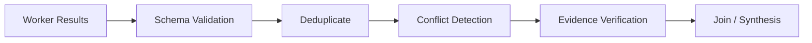

A writer agent should not silently choose between conflicting results. Instead:

- Flag the conflict;
- Compare source trustworthiness and dates;
- Request an independent verifier;
- Return the decision to the user if necessary.

## 9.27 Common Multi-Agent Failure Modes

### 9.27.1 Duplicate Work

Multiple agents research the same material at the same time.

Remedies:

- A task ledger;
- Unique task IDs;
- Task leases;
- Artifact discovery.

### 9.27.2 Missing Tasks

After decomposition, no agent owns a required dependency.

Remedies:

- DAG completeness checks;
- Mapping work to acceptance criteria;
- Detection of unassigned tasks.

### 9.27.3 Lost or Duplicate Messages

Remedies:

- Idempotent messages;
- Acknowledgments;
- Retries;
- Deduplication keys.

### 9.27.4 Lost Context

A handoff omits important background.

Remedies:

- Task contracts;
- Artifacts;
- Source references;
- Structured handoffs.

### 9.27.5 Agents Waiting for One Another

This creates deadlock.

Remedies:

- Dependency-cycle detection;
- Timeouts;
- Leases;
- Orchestrator arbitration.

### 9.27.6 Endless Discussion

Agents keep criticizing one another without taking action.

Remedies:

- A maximum number of rounds;
- A clear decision owner;
- Verification thresholds;
- Mandatory artifact submission.

### 9.27.7 Shared-Memory Contamination

One agent writes an incorrect fact that affects all agents.

Remedies:

- Provenance;
- Trust levels;
- Review of writes;
- Separation of validated memory from working notes.

## 9.28 Research-System Example

Goal:

> Investigate changes at three competitors over the last six months and produce a comparative report with sources.

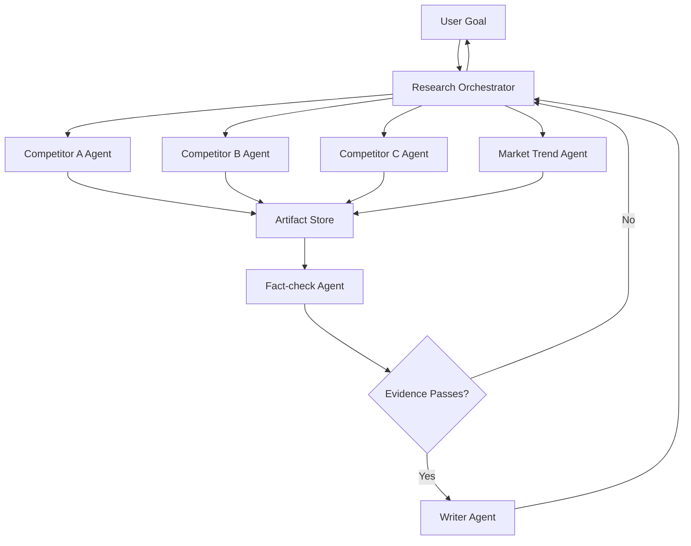

### 9.28.1 Why a Multi-Agent System Fits

- The three competitors can be researched independently;
- Each agent needs only local context;
- Research tasks can run in parallel;
- Fact-checking and writing have different responsibilities;
- Results can be combined through a common artifact schema.

### 9.28.2 What Should Not Be Left to Unconstrained Agents

- Authorization;
- Task budgets;
- Maximum concurrency;
- Citation schemas;
- Final publication;
- Sensitive-information filtering.

The runtime or workflow should control these.

For example, competitor A's research agent records dates by “when the feature became generally available,” while B's uses “when the blog post was published.” Both reports can be correctly formatted yet yield the wrong chronology when combined. Before dispatching work, the orchestrator should establish a common date definition and require a source and status for each update. If research reveals that a conclusion about A depends on B's product classification, share that interface agreement first. Do not let both agents guess independently and leave the writer to remove the contradiction.

When fact-checking identifies gaps, reopen only the affected research tasks rather than rerunning every source. However, the fallback loop in the diagram still needs attempt and budget limits. Once those limits are reached, deliver the verified portion and explicit gaps instead of looping indefinitely until the verification agent says “pass.”

## 9.29 Single-Agent and Multi-Agent Comparison

| Dimension | Single-agent | Multi-agent |
|---|---|---|
| Decision-makers | One | Several |
| Context | Organized by one decision-maker; can still be filtered by step | Usually partitioned and exchanged through protocols |
| State management | Relatively simple | Distributed or shared state |
| Specialization | Through tools, skills, and prompts | Can use separate models, tools, data, and permissions |
| Parallelism | Can call tools or deterministic workers in parallel | Can run multiple autonomous decision loops in parallel |
| Debugging | Shorter paths | Requires cross-agent traces |
| Cost | Usually less coordination overhead, but still needs measurement | Adds communication and scheduling overhead; smaller local models may also save costs |
| Errors | A single decision-maker's errors | Errors may propagate and compound across agents |
| Permissions | Can be restricted by tool and step | Cross-agent delegation and data propagation also need controls |
| Suitable scenarios | One loop meets the goal, or tasks are tightly coupled | Tasks are separable and isolation, heterogeneity, or parallelism produces a net benefit |

## 9.30 Selection Decision Tree

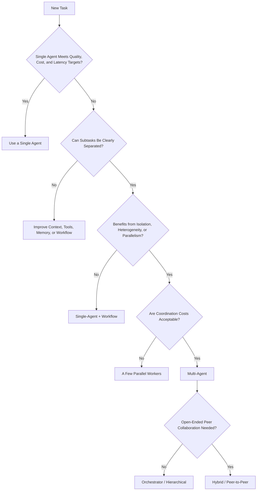

This tree starts from a measured single-agent baseline. It does not require rule-based or fixed-workflow tasks to adopt an agent first. Whichever branch is chosen, return to the same task set to measure quality, total cost, and latency. “Acceptable” in the diagram means business constraints, not a score the model assigns to itself.

## 9.31 Evaluating Whether Multiple Agents Are Worthwhile

First establish a baseline using the same tasks, tool permissions, and acceptance criteria. Then compare under two constraints: which system provides better quality at the same total budget, and which is cheaper and faster at the same quality target. Total budget includes the main agent, subagents, verification, failed attempts, tool fees, and retries—not just the final response. If the multi-agent system uses stronger models or more tokens, run separate ablations to avoid mistaking additional compute for collaboration benefits.

Stratify evaluation by task decomposability, dependency density, context length, and side-effect risk. Retain failed and timed-out samples, repeat the same tasks, and report variation or confidence intervals. Removing parallelism, role prompts, or independent context one at a time helps identify what actually contributes. [MAST](https://arxiv.org/abs/2503.13657) offers ways to analyze failures in task specification, cross-agent alignment, verification, and termination. Its taxonomy is useful for annotation, not a universal system success rate.

### 9.31.1 Quality

- Overall task success rate;
- Acceptance pass rate for each agent;
- Conflict and omission rates;
- Whether final results outperform the single-agent baseline.

### 9.31.2 Efficiency

- Total tokens and cost;
- Critical-path latency;
- Parallel efficiency;
- Share of coordination messages;
- Proportion of duplicate work.

A coordination-cost ratio can be defined as:

$$
R_{coord}=\frac{C_{coord}}{C_{total}}
$$

If much of the cost goes to agents talking to each other rather than completing the task, simplify the topology or interfaces.

### 9.31.3 Stability

- Recovery time after worker failure;
- Task omission rate;
- Deadlocks and loop counts;
- Whether retries remain local;
- State consistency.

Fault injection should cover a worker producing a side effect whose response is lost, a late executor with an old lease, duplicate messages, input-version changes, and orchestrator restarts. Verify not only that “an answer eventually appears,” but also that charges are not duplicated, stale artifacts are not accepted, and no further tasks are spawned after the budget is exhausted.

### 9.31.4 Security

- Whether least privilege is enforced;
- Whether data leaks across agents;
- Whether shared memory is contaminated;
- Whether high-risk operations receive approval.

## 9.32 Production Checklist

### 9.32.1 Selection

- Has a single-agent baseline been measured?
- Are there genuinely separable subtasks?
- Does specialization come from capability differences rather than role names?
- Do parallelism gains exceed coordination costs?

### 9.32.2 Topology

- Who owns the final goal?
- Who is the final decision owner?
- Is a single-level, hierarchical, or hybrid orchestrator needed?
- Why is peer-to-peer necessary?

### 9.32.3 Protocol

- Is there a task contract?
- Are results and errors structured?
- Are unique IDs, idempotency keys, and trace IDs used?
- Are timeouts, cancellation, and retries supported?

### 9.32.4 State

- Which state is private?
- Which artifacts are shared?
- Who can write to shared long-term memory?
- How are conflicts resolved?

### 9.32.5 Security

- Are each agent's permissions minimized?
- Can agent identities be verified?
- Are external agents across a separate trust boundary?
- Do high-risk tasks require human approval?

### 9.32.6 Evaluation

- Has quality, cost, and latency been compared with a single agent?
- Is coordination overhead measured?
- Have worker disconnections, duplicate messages, and conflicts been tested?
- Can the full execution trace be replayed?

## 9.33 Chapter Summary

Single-agent and multi-agent systems differ not merely in count, but in who holds the goal, state, and authority to choose the next action. A single-agent system has one decision-maker coordinating the whole task; a multi-agent system assigns local decisions to several roles.

A multi-agent system is worth introducing when boundaries can be defined and outputs can be accepted against criteria, with a measurable net benefit from at least one of context isolation, heterogeneous capabilities or permissions, and parallel exploration. These need not all hold at once: sequential expert handoffs may enforce permission boundaries, while parallel research using the same model may also be valuable.

Multiple agents do not solve several commonly overstated problems. They do not enlarge the underlying model's context window. Different role names do not automatically create expertise. Parallelization is not inherently faster or more reliable.

One path for investigating bottlenecks is:

> **Single-Agent → Agentic Workflow → Orchestrator-Workers → Hierarchical / Hybrid Multi-Agent**

Architectural complexity should be driven by bottlenecks exposed in evaluation. Leave strongly consistent task-ledger commits to storage systems. Resolve disagreements between agents through evidence, acceptance criteria, and clear responsibility. Neither can substitute for the other.

## References

- [Anthropic: Building Effective Agents](https://www.anthropic.com/engineering/building-effective-agents)
- [Anthropic: How we built our multi-agent research system](https://www.anthropic.com/engineering/multi-agent-research-system)
- [Cognition: Don't Build Multi-Agents](https://cognition.com/blog/dont-build-multi-agents)
- [Why Do Multi-Agent LLM Systems Fail? (MAST)](https://arxiv.org/abs/2503.13657)
- [Agent2Agent (A2A) v1.0.1 Specification](https://github.com/a2aproject/A2A/blob/v1.0.1/docs/specification.md)
- [Raft: Algorithm and papers maintained by the authors](https://raft.github.io/)
- [etcd v3.5: Revisions, conditional transactions, and leases](https://etcd.io/docs/v3.5/learning/api/)
- [Martin Kleppmann: How to do distributed locking (2016)](https://martin.kleppmann.com/2016/02/08/how-to-do-distributed-locking.html) (cited for its analysis of process pauses, leases, and fencing tokens, without generalizing its Redis-version conclusions to current products)
- [AutoGen: Enabling Next-Gen LLM Applications via Multi-Agent Conversation](https://arxiv.org/abs/2308.08155)
- [CAMEL: Communicative Agents for Mind Exploration of Large Language Model Society](https://arxiv.org/abs/2303.17760)

Source review recorded in the original manuscript: 2026-09-15. The Anthropic–Cognition comparison is limited to the 2025 systems and models described in those articles; their internal evaluations were not reproduced. A2A was checked against the v1.0.1 release tag, not the stale `Latest Released Version 1.0.0` wording at the top of the specification page.
