# 第九章：Single-Agent 与 Multi-Agent 系统

## 9.1 什么是 Single-Agent

Single-Agent 指系统中只有一个主要的动态决策主体。它可以：

- 调用多个 Tools；
- 使用长期记忆；
- 执行复杂 Workflow；
- 使用不同模型完成不同步骤；
- 并行调用多个只执行任务的 Worker。

判断是否为 Single-Agent 的关键，不是模型调用次数，而是：

> **是否只有一个 Agent 持有主要目标、状态和下一步决策权。**

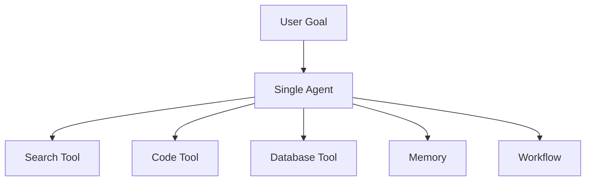

一个 Agent 使用十个 Tool，仍然可以是 Single-Agent。

## 9.2 什么是 Multi-Agent

Multi-Agent System 包含多个相对独立的 Agent。每个 Agent 通常具有自己的：

- 角色和目标；
- 上下文；
- 状态或记忆；
- Tools 与权限；
- 决策循环；
- 输入输出契约。

它们通过消息、任务、Artifact 或共享工作区协作完成整体目标。

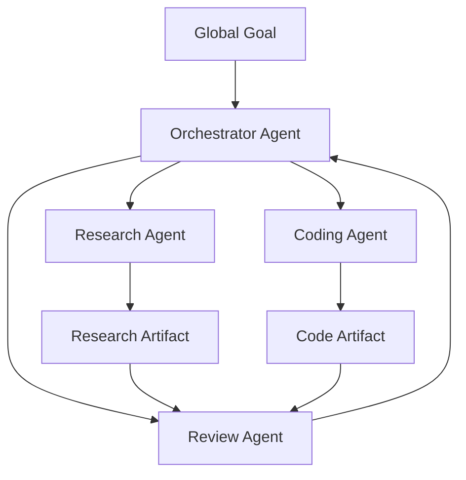

> **Multi-Agent 的本质不是“多调用几个模型”，而是多个具有独立职责和局部决策权的 Agent 进行协调。**

## 9.3 不要把多角色 Prompt 当成完整 Multi-Agent

以下系统不一定是真正的 Multi-Agent：

- 同一个 Agent 依次使用“研究员”“写作者”Prompt；
- 一个 Workflow 并行调用三次无状态 LLM；
- 同一个模型生成多个候选再投票；
- 多个 Tool 分别执行不同函数。

这些设计可能属于：

- Role Prompting；
- Parallel LLM Calls；
- Ensemble；
- Workflow；
- Tool Orchestration。

只有当多个执行单元具有相对独立的状态、目标或策略，并通过明确协议协调时，才更适合称为 Multi-Agent。

## 9.4 Single-Agent 的真实能力边界

用户的理解中提到两个限制：

1. Context Window；
2. 单点能力或专业度。

这两个问题确实存在，但需要更准确地理解。

### 9.4.1 Context Window 是单次模型调用的限制

Multi-Agent 不会改变底层模型的 Context Window。它做的是：

- 将任务上下文分区；
- 让每个 Agent 只处理局部信息；
- 通过摘要或 Artifact 交换结果。

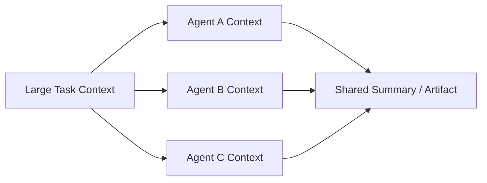

这种方式可以减少单个 Agent 的上下文压力，但会引入：

- 信息在 Agent 边界处丢失；
- 摘要偏差；
- 重复检索；
- 跨 Agent 冲突；
- 合并成本。

Single-Agent 也可以通过 Context Engineering、外部 State、Artifact 和分层记忆处理长任务。因此，Context Window 不是只能通过 Multi-Agent 解决的结构性死局。

### 9.4.2 分角色不等于自动变专业

如果多个 Agent：

- 使用同一个模型；
- 使用相似 Prompt；
- 访问相同数据；
- 使用相同 Tools；
- 没有独立评估标准；

那么仅仅给它们起不同名字，未必能显著提高专业度。

真正的专业化来自：

- 不同 System Instructions；
- 专门领域数据；
- 不同 Tools；
- 不同模型；
- 独立权限；
- 专门的输出 Schema；
- 针对角色的评估集；
- 清晰、窄范围的任务契约。

> **角色名不是专业能力，专用上下文、工具、数据和评估才是。**

## 9.5 为什么使用 Multi-Agent

Multi-Agent 的主要价值可以归纳为五类。

### 9.5.1 上下文隔离

不同 Agent 只加载自己需要的信息，减少无关内容干扰。

例如：

- Research Agent 只关注来源和事实；
- Coding Agent 只关注代码和测试；
- Review Agent 只关注变更和验收标准。

### 9.5.2 能力与权限专业化

不同 Agent 可以使用不同：

- 模型；
- Tools；
- Skills；
- 数据源；
- 权限；
- 安全策略。

例如，Research Agent 只能读取网络，Deployment Agent 才能访问部署系统。

### 9.5.3 并行执行

互不依赖的 Agent 可以同时工作：

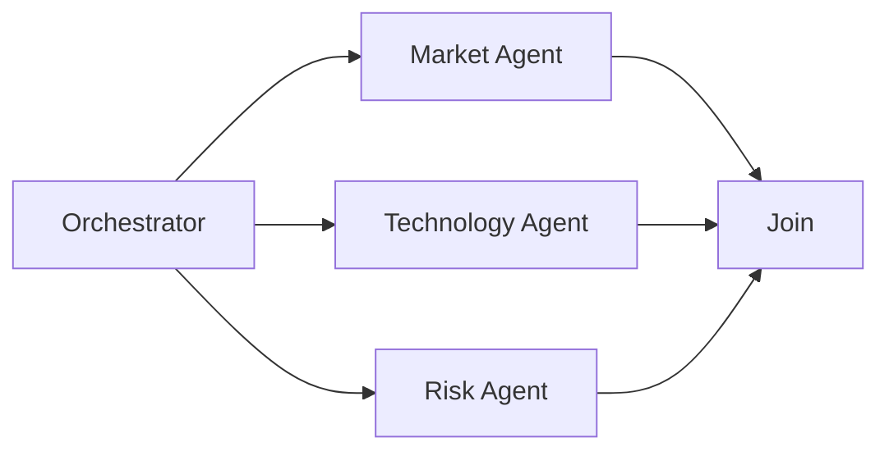

### 9.5.4 故障隔离

一个 Worker 失败时，可以：

- 只重试该 Worker；
- 切换备用 Agent；
- 降级为简单 Tool；
- 保留其他 Agent 的成果。

### 9.5.5 多视角与制衡

可以让不同 Agent：

- 独立提出方案；
- 批判其他 Agent 的结果；
- 进行事实核验；
- 使用不同假设分析风险。

但多个 Agent 共享相同模型时仍可能共享相同偏差，因此多视角不能替代客观验证。

## 9.6 Multi-Agent 不一定比 Single-Agent 更强

Multi-Agent 会增加：

- 通信成本；
- Token 消耗；
- 调度复杂度；
- 延迟；
- 状态同步；
- 错误传播路径；
- 权限管理；
- 可观测性要求。

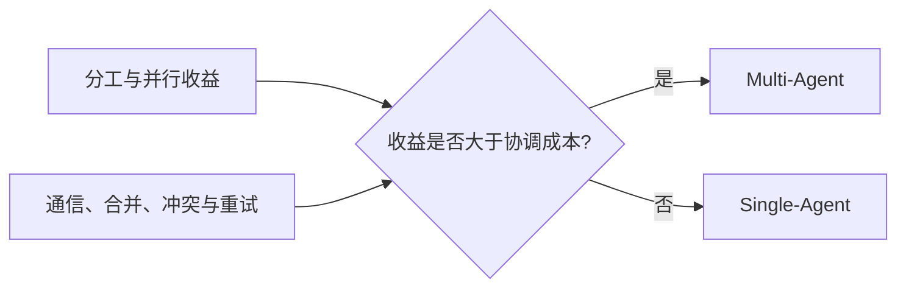

任务复杂并不自动意味着应该使用 Multi-Agent。若任务无法清晰拆分，多 Agent 可能只是把一个困难问题变成多个协调困难的问题。

### 9.6.1 业界的两种立场

这个问题在工程界存在过一场有价值的公开分歧，理解它比记住结论更重要。

**反对方（Cognition）**的核心论点是：多个 Agent 并行工作时，各自的上下文是割裂的，A 不知道 B 做了什么决定。而**每个动作都隐含了未被写出来的决策前提**，只传递「结果」而不传递「完整轨迹」，就会导致各分支基于互相冲突的隐含假设工作，最后合并时产生不一致。因此其主张是：优先做**单线程、上下文连续**的 Agent，必要时用压缩而不是拆分。

**支持方（Anthropic）**在其研究型 Agent 的实践中报告了显著收益：由一个主 Agent 带多个子 Agent 的架构，在内部研究评测上明显优于单 Agent。但同一篇文章也坦率指出两点代价——**Token 消耗约为普通对话的十几倍**，且**多数编码任务中可真正并行的子任务比研究任务少得多**。

### 9.6.2 分歧的实质与调和

两者其实并不矛盾，差别在于**隔离边界划在哪里**：

| 边界划法 | 效果 |
|---|---|
| 扁平对等的并行 Agent，各自决策、事后合并 | 上下文割裂，隐含假设冲突，容易失败 |
| 明确的角色分层（规划者 / 执行者），上下文按职责天然分离 | 规划者的上下文不被实现细节填满，执行者的上下文不被全局规划填满 |
| 探索型子任务隔离，只回传浓缩结论 | 主上下文保持干净，是 Multi-Agent 收益最稳的形态 |

可以归纳为一条可操作的判据：

> **Multi-Agent 的收益来自「上下文按职责隔离」，而不是来自「Agent 数量变多」。如果拆分之后各 Agent 仍然需要共享大量彼此的中间决策，说明这条边界划错了。**

另外值得注意的是，任务是否真的可并行差异很大：研究类任务天然可以按主题并行检索，而编码类任务的子任务之间往往存在强依赖，强行并行反而引入冲突与返工。**并行度低的任务，应该优先考虑「角色分层」而不是「同层并行」。**

## 9.7 Single-Agent 适合什么场景

- 任务步骤较少；
- 一个 Context 可以容纳主要信息；
- Tools 和权限相对统一；
- 子任务高度耦合；
- 没有明显并行机会；
- 需要快速迭代和简单维护；
- 单个 Agent 已能达到目标质量。

### 9.7.1 优势

- 架构简单；
- 状态一致；
- 调试路径短；
- Token 和通信成本较低；
- 权限模型简单；
- 更容易复现执行过程。

### 9.7.2 局限

- 长任务容易产生 Context 压力；
- 单个控制循环可能成为瓶颈；
- 难以同时处理大量独立子任务；
- 不同权限和专业上下文容易相互污染；
- 单点失败可能影响整个任务。

## 9.8 Multi-Agent 适合什么场景

Multi-Agent 通常需要同时满足一个或多个明确条件。

### 9.8.1 任务可清晰拆分

子任务拥有明确输入、输出和验收标准。

### 9.8.2 存在真实专业异构

不同子任务需要不同：

- 数据；
- 模型；
- Tools；
- Skills；
- 权限；
- 评估方式。

### 9.8.3 存在可利用的并行性

多个子任务可以并发执行，并且并行收益高于调度和合并成本。

### 9.8.4 需要权限隔离

例如：

- Search Agent 只有只读网络权限；
- Coding Agent 只能修改工作区；
- Deployment Agent 需要人工批准；
- Audit Agent 只能读取不可变日志。

### 9.8.5 需要故障隔离或规模扩展

大量同类任务可以分发给 Worker Pool，并独立重试和扩缩容。

## 9.9 选型不能只看三个条件

“Context 快撑爆、需要专业分工、存在并行子任务”是很好的初筛标准，但还需要考虑：

| 维度 | 关键问题 |
|---|---|
| Separability | 子任务能否通过明确接口分离？ |
| Coupling | 子任务是否需要频繁共享隐含上下文？ |
| Verifiability | 每个 Agent 的输出能否独立验证？ |
| Coordination Cost | 通信和合并是否过于昂贵？ |
| Risk | 多 Agent 是否扩大权限和攻击面？ |
| State Consistency | 是否需要强一致共享状态？ |
| Latency | 关键路径是否真的能缩短？ |
| Scale | 是否需要独立扩缩容？ |

如果子任务高度耦合、持续交换大量上下文，Single-Agent 或共享状态 Workflow 可能更合适。

## 9.10 从简单到复杂的升级路径

不应从单次 LLM 调用直接跳到 Multi-Agent。

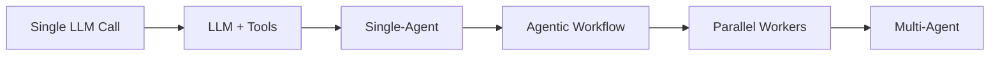

推荐顺序：

1. 先优化单次调用；
2. 增加 Tools 和检索；
3. 使用 Single-Agent；
4. 用 Workflow 固定主流程；
5. 将独立任务并行化；
6. 只有需要独立决策者时再引入 Multi-Agent。

## 9.11 中心化 Orchestrator-Workers

中心化架构由 Orchestrator 统一：

- 理解全局目标；
- 拆分任务；
- 选择 Worker；
- 管理依赖；
- 跟踪状态；
- 汇总结果；
- 处理失败和重试。

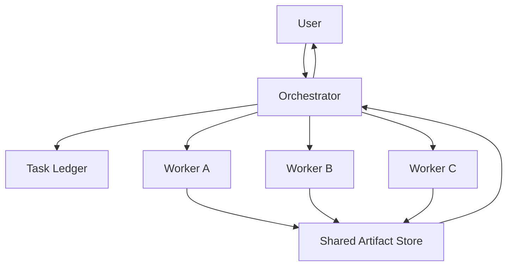

### 9.11.1 优势

- 全局目标统一；
- 调度链路清晰；
- 容易追踪和审计；
- 权限和预算集中管理；
- 失败容易定位；
- 适合 DAG 和关键路径调度。

### 9.11.2 局限

- Orchestrator 可能成为单点瓶颈；
- Orchestrator 错误会影响所有 Worker；
- 全局状态可能过大；
- 大量 Worker 消息增加协调压力；
- 中央节点故障需要恢复机制。

### 9.11.3 生产实践

生产系统通常偏好可控的中心化或分层编排，但“几乎全部使用单层 Orchestrator”仍然过于绝对。

常见实际形态是：

- Workflow 作为最外层控制；
- 一个顶层 Orchestrator；
- 多个领域子 Orchestrator；
- 叶子 Worker 执行具体任务。

## 9.12 分层 Multi-Agent

分层架构适合 Agent 数量较多、领域边界明确的系统。

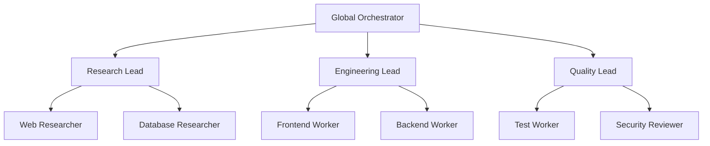

优势：

- 顶层 Agent 不需要管理所有细节；
- 每个领域维护局部 Context；
- 可以独立扩缩容；
- 适合大型任务组织。

风险：

- 信息经过多层摘要后失真；
- 责任边界不清；
- 错误可能沿层级传播；
- 跨领域协调变慢。

## 9.13 Pipeline 架构

Pipeline 让多个 Agent 按固定顺序处理：

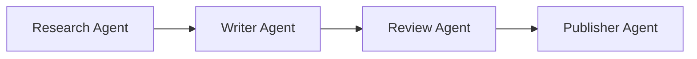

它更接近 Workflow：

- 顺序由开发者定义；
- 每个 Agent 只负责一个阶段；
- 下一步通常不由 Agent 自由选择。

适合：

- 阶段固定；
- 输入输出清晰；
- 每个阶段需要独立专业 Context。

风险是上游错误会传递到下游，因此每个阶段需要 Gate 和验收条件。

## 9.14 Blackboard / Shared Workspace

多个 Agent 不直接互相发送全部消息，而是读写共享工作区：

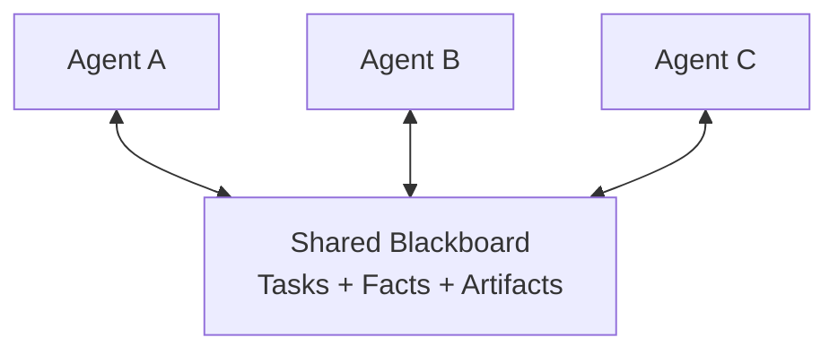

共享工作区可以包含：

- Task Ledger；
- Artifact；
- 已验证事实；
- 未解决问题；
- 任务状态；
- 版本和锁。

优势：

- 降低点对点消息数量；
- 结果可以复用；
- 容易异步协作；
- Agent 可以随时加入或退出。

风险：

- 写入冲突；
- 过期状态；
- 共享内容污染；
- 权限扩大；
- 缺乏明确负责人。

需要版本控制、租约、原子更新和来源追踪。

## 9.15 Peer-to-Peer 架构

Peer-to-Peer 中，Agent 可以直接发现并联系其他 Agent：

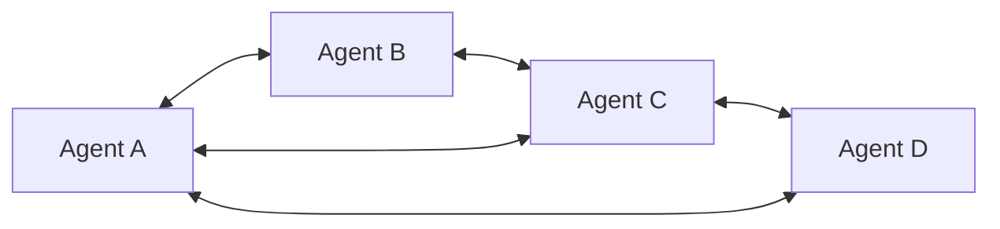

### 9.15.1 优势

- 没有单一中央调度瓶颈；
- Agent 可以动态建立协作；
- 适合组织边界分散的系统；
- 局部节点故障不一定导致全局停止；
- 可用于协商、模拟和开放生态。

### 9.15.2 工程难点

去中心化并非天然缺少协调，但协调机制必须显式设计：

- 谁负责分配任务？
- 如何避免重复领取？
- 如何表达任务依赖？
- 如何检测 Agent 失联？
- 如何取消已经分发的任务？
- 如何处理冲突结果？
- 如何判断全局任务完成？
- 谁拥有最终决策权？

如果没有这些机制，会出现：

- 重复工作；
- 消息风暴；
- 顺序错误；
- Deadlock；
- Livelock；
- 无人负责的任务；
- 失败无法传播；
- 全局状态不一致。

### 9.15.3 去中心化并非生产环境不可用

Peer-to-Peer 可以通过以下机制进入生产：

- Capability Registry；
- Task Lease；
- Distributed Task Ledger；
- Heartbeat 与 Failure Detector；
- 幂等消息；
- Consensus 或明确冲突规则；
- Trace Correlation；
- 超时和取消协议；
- 最终结果 Owner。

问题在于这些机制的实现成本很高。对单团队、单产品中的 Agent 系统，中心化或分层编排通常更简单。

## 9.16 混合拓扑

实际系统经常混合使用：

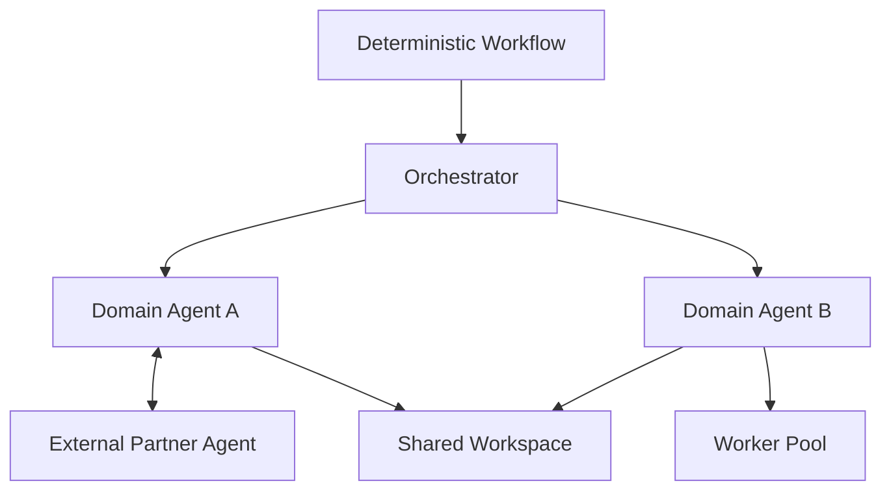

例如：

- 内部任务由 Orchestrator 管理；
- 同一领域内使用 Worker Pool；
- 跨公司 Agent 通过 A2A 协作；
- 结果通过 Shared Workspace 汇总；
- 高风险操作仍由 Workflow 和人工审批控制。

## 9.17 Multi-Agent 的通信方式

Agent 之间不应依赖自由文本聊天作为唯一协议。

### 9.17.1 Task Message

```json
{
  "task_id": "research-a",
  "goal": "调研竞品 A 最近六个月的更新",
  "inputs": {
    "time_range": "6 months"
  },
  "success_criteria": [
    "至少两个独立来源",
    "输出包含发布日期和链接"
  ],
  "deadline": "2026-08-28T09:00:00Z",
  "reply_to": "orchestrator-1"
}
```

### 9.17.2 Result Message

```json
{
  "task_id": "research-a",
  "status": "completed",
  "artifact_uri": "artifact://research-a.json",
  "summary": "发现三个主要产品更新",
  "validation": {
    "source_count": 4,
    "passed": true
  }
}
```

### 9.17.3 Error Message

```json
{
  "task_id": "research-a",
  "status": "blocked",
  "error": {
    "code": "SOURCE_UNAVAILABLE",
    "retryable": true
  },
  "needs": "备用数据源或人工输入"
}
```

结构化消息可以支持调度、重试和监控。

## 9.18 A2A 与 Agent Card

A2A 可以帮助不同系统中的 Agent：

- 发现能力；
- 协商交互方式；
- 发送任务和消息；
- 跟踪任务状态；
- 交换 Artifact。

Agent Card 描述：

- Agent 身份；
- 服务地址；
- 支持的能力和 Skills；
- 认证要求；
- 输入输出模式。

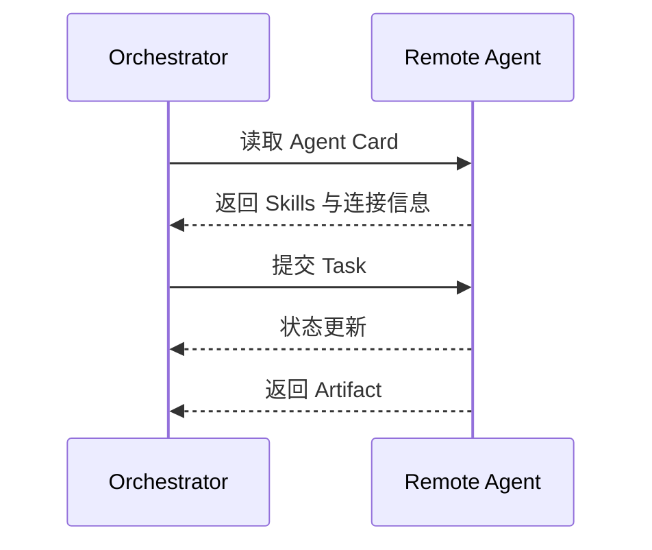

A2A 标准化通信，但不会自动解决任务分解、信任、费用、冲突和全局调度。

## 9.19 Shared Memory 设计

Multi-Agent 不应共享全部 Messages。

推荐分层：

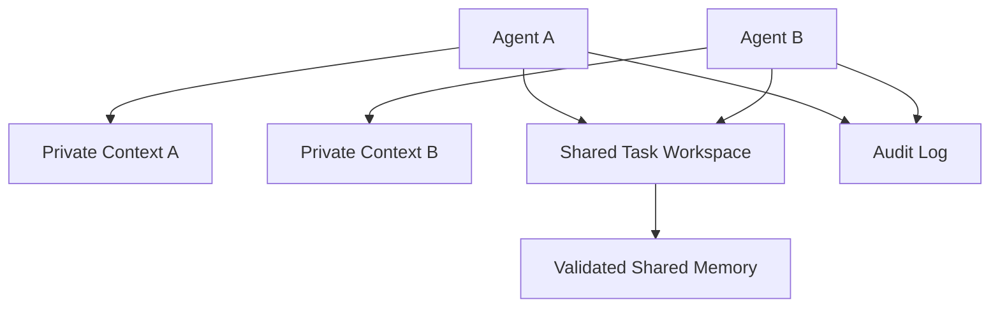

### 9.19.1 Private Context

保存 Agent 局部推理和任务状态。

### 9.19.2 Shared Task Workspace

保存：

- Task 状态；
- Artifact；
- 已验证事实；
- 未解决问题；
- 依赖关系。

### 9.19.3 Validated Shared Memory

只保存经过验证、可跨任务复用的信息。

### 9.19.4 Audit Log

保存不可随意修改的消息和操作轨迹。

## 9.20 权限与安全

每个 Agent 应遵循最小权限：

| Agent | 推荐权限 |
|---|---|
| Research Agent | 只读网络和知识库 |
| Coding Agent | 工作区文件和测试命令 |
| Review Agent | 只读代码与 Diff |
| Deployment Agent | 受审批的部署权限 |
| Finance Agent | 受限业务 API 和强审计 |

不要因为 Orchestrator 有高权限，就把相同凭据传给所有 Worker。

Multi-Agent 扩大的攻击面包括：

- 恶意 Agent 消息；
- Prompt Injection 跨 Agent 传播；
- Shared Memory Poisoning；
- 身份冒充；
- Confused Deputy；
- 越权任务委派；
- 敏感 Artifact 泄露。

需要消息认证、权限检查、来源追踪和信任边界。

## 9.21 失败传播与恢复

### 9.21.1 中心化架构

Orchestrator 可以统一处理：

- 超时；
- Worker 失联；
- 重试；
- 更换 Worker；
- 取消下游任务；
- 部分结果返回。

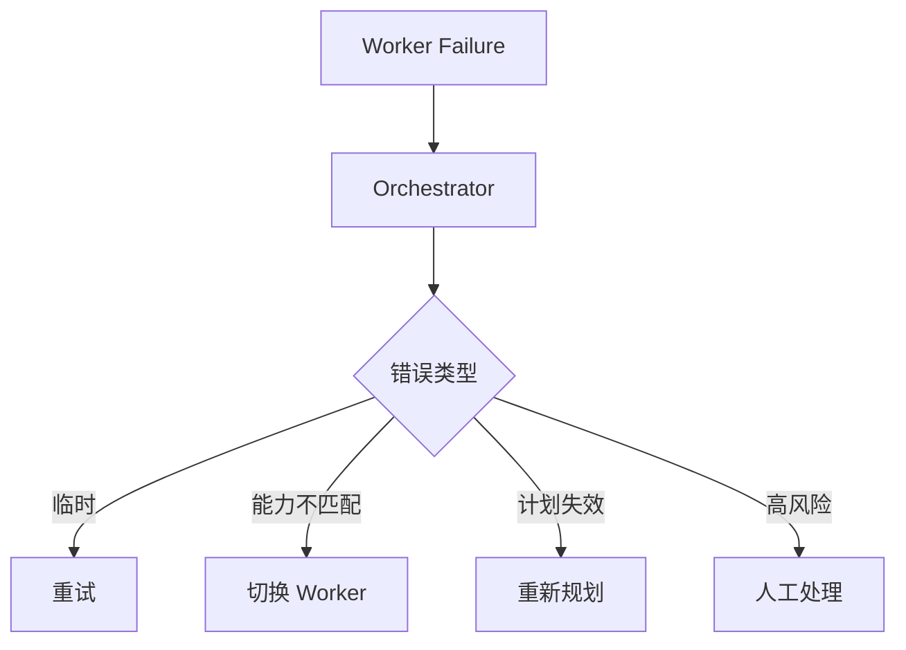

### 9.21.2 去中心化架构

需要额外设计：

- Failure Detector；
- Task Lease 过期；
- 重复执行去重；
- Leader 或 Result Owner；
- 最终一致性；
- 消息重放。

## 9.22 错误会如何复合

若一个顺序任务包含多个必须成功的 Agent 步骤，并暂时假设各步骤独立，则整体成功概率近似为：

$$
P_{system}\approx\prod_{i=1}^{n}p_i
$$

其中 `pᵢ` 是第 `i` 个步骤成功的概率。

例如，五个步骤各自成功率为 95%，整体成功率约为：

$$
P_{system}\approx 0.95^5\approx 77.4\%
$$

这个计算只是简化示例，实际步骤通常并不独立。但它说明：

> **增加 Agent 和交互次数会增加错误复合机会。**

因此需要验证、重试和减少不必要的交接。

## 9.23 延迟与协调成本

Multi-Agent 总时间不是所有 Worker 时间简单相加，也不等于最慢 Worker 时间。

可以抽象为：

$$
T_{multi}=
T_{critical}
+
T_{coord}
+
T_{merge}
+
T_{retry}
$$

其中：

- `T_critical`：任务 DAG 的关键路径时间；
- `T_coord`：分配和通信时间；
- `T_merge`：结果合并和冲突处理时间；
- `T_retry`：失败恢复时间。

如果协调和合并成本大于并行收益，Multi-Agent 会比 Single-Agent 更慢。

## 9.24 Orchestrator 的设计

一个成熟 Orchestrator 不只是“让 LLM 给 Worker 发消息”，还需要：

- Capability Registry；
- Task Decomposition；
- Dependency Graph；
- Task Ledger；
- Scheduler；
- Budget Manager；
- Permission Gate；
- Result Aggregator；
- Verifier；
- Failure Recovery；
- Trace。

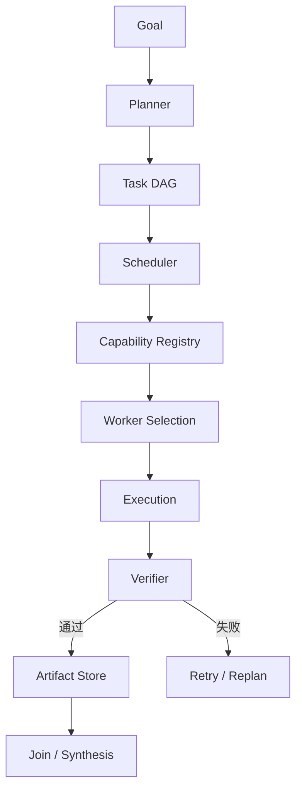

Orchestrator 的模型决策也应受到确定性 Runtime 的限制。

## 9.25 Worker 的设计

一个 Worker 应有窄而明确的职责：

- 明确 Capability；
- 明确输入 Schema；
- 明确输出 Schema；
- 明确 Tools；
- 明确权限；
- 明确成功标准；
- 明确超时和预算；
- 明确错误类型。

不推荐：

- “你是万能研究专家”；
- “尽力完成所有任务”；
- 无边界地访问所有共享上下文；
- 失败时只返回自由文本。

## 9.26 结果合并

多个 Worker 结果可能：

- 重复；
- 冲突；
- 使用不同格式；
- 引用不同来源；
- 质量不一致。

合并流程应包括：

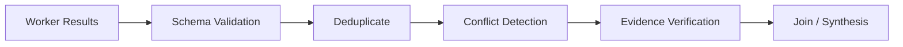

冲突不应由 Writer Agent 静默选择。应：

- 标记冲突；
- 比较来源可信度和时间；
- 请求独立 Verifier；
- 必要时返回给用户判断。

## 9.27 Multi-Agent 的常见失败模式

### 9.27.1 重复工作

多个 Agent 同时调研同一内容。

解决：

- Task Ledger；
- 唯一 Task ID；
- 任务租约；
- Artifact 发现。

### 9.27.2 任务遗漏

Orchestrator 拆分后没有 Agent 负责某个依赖。

解决：

- DAG 完整性检查；
- 验收条件映射；
- 未分配任务检测。

### 9.27.3 消息丢失或重复

解决：

- 幂等消息；
- Acknowledgement；
- Retry；
- 去重键。

### 9.27.4 Context 丢失

Agent 交接时遗漏关键背景。

解决：

- Task Contract；
- Artifact；
- 来源引用；
- 结构化 Handoff。

### 9.27.5 Agent 互相等待

形成 Deadlock。

解决：

- 依赖环检测；
- 超时；
- Lease；
- Orchestrator 仲裁。

### 9.27.6 无限讨论

Agent 不断互相批评但不执行。

解决：

- 最大回合数；
- 明确 Decision Owner；
- 验证阈值；
- 强制提交 Artifact。

### 9.27.7 Shared Memory 污染

一个 Agent 写入错误事实，影响所有 Agent。

解决：

- 来源；
- 信任等级；
- 写入审核；
- Validated Memory 与 Working Notes 分离。

## 9.28 研究系统示例

目标：

> 调研三家竞品最近半年的变化，并输出带来源的比较报告。

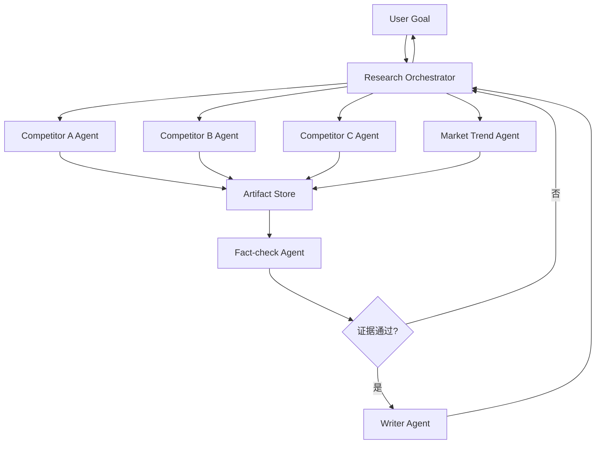

### 9.28.1 为什么适合 Multi-Agent

- 三家竞品可以独立调研；
- 每个 Agent 只需要局部 Context；
- 调研任务可以并行；
- Fact-check 与 Writer 具有不同职责；
- 结果可通过统一 Artifact Schema 合并。

### 9.28.2 哪些部分不应交给自由 Agent

- 权限控制；
- 任务预算；
- 最大并发；
- 引用 Schema；
- 最终发布；
- 敏感信息过滤。

这些应由 Runtime 或 Workflow 控制。

## 9.29 Single-Agent 与 Multi-Agent 对比

| 维度 | Single-Agent | Multi-Agent |
|---|---|---|
| 控制主体 | 一个 | 多个 |
| 上下文 | 统一 | 分区并通过协议交换 |
| 状态管理 | 相对简单 | 分布式或共享状态 |
| 专业化 | 通过 Tools、Skills 和 Prompt | 可通过独立模型、工具、数据和权限 |
| 并行性 | 有限但仍可并行调用 Tool | 更自然地并行执行子任务 |
| 调试 | 路径较短 | 需要跨 Agent Trace |
| 成本 | 较低 | 通信和重复调用成本高 |
| 错误 | 单点决策错误 | 可能跨 Agent 传播和复合 |
| 权限 | 一套主要权限 | 需要身份和最小权限隔离 |
| 适用场景 | 中等复杂度、高耦合任务 | 可分解、异构、可并行任务 |

## 9.30 选型决策树

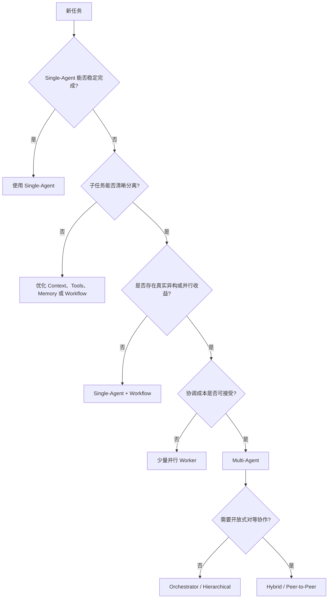

## 9.31 评估 Multi-Agent 是否值得

### 9.31.1 质量

- 整体任务成功率；
- 每个 Agent 的验收通过率；
- 冲突和遗漏比例；
- 最终结果是否优于 Single-Agent 基线。

### 9.31.2 效率

- 总 Token 和费用；
- 关键路径延迟；
- 并行效率；
- 协调消息占比；
- 重复工作比例。

可以定义协调成本占比：

$$
R_{coord}=\frac{C_{coord}}{C_{total}}
$$

如果大量成本用于 Agent 互相交流而不是完成任务，需要简化拓扑或接口。

### 9.31.3 稳定性

- Worker 失败恢复时间；
- Task 遗漏率；
- Deadlock 和循环次数；
- 重试是否局部化；
- 状态是否一致。

### 9.31.4 安全

- 是否遵循最小权限；
- 是否发生跨 Agent 数据泄露；
- Shared Memory 是否被污染；
- 高风险操作是否经过审批。

## 9.32 生产级检查表

### 9.32.1 选型

- Single-Agent 基线是否已测量？
- 是否存在真实可分解子任务？
- 专业化是否来自能力差异，而非角色名？
- 并行收益是否高于协调成本？

### 9.32.2 拓扑

- 谁拥有最终目标？
- 谁是最终 Decision Owner？
- 是否需要单层、分层或混合 Orchestrator？
- 为什么必须使用 Peer-to-Peer？

### 9.32.3 协议

- 是否有 Task Contract？
- 是否有结构化 Result 和 Error？
- 是否使用唯一 ID、幂等键和 Trace ID？
- 是否支持超时、取消和重试？

### 9.32.4 状态

- 哪些状态私有？
- 哪些 Artifact 共享？
- 谁能写入共享长期记忆？
- 冲突如何解决？

### 9.32.5 安全

- 每个 Agent 的权限是否最小化？
- Agent 身份是否可验证？
- 外部 Agent 是否处于独立信任边界？
- 高风险任务是否需要人工审批？

### 9.32.6 评估

- 是否与 Single-Agent 做质量、成本和延迟对比？
- 是否测量协调开销？
- 是否测试 Worker 失联、重复消息和冲突？
- 是否能够重放完整执行轨迹？

## 9.33 本章总结

Single-Agent 与 Multi-Agent 的区别不只是数量：

- Single-Agent 由一个主要决策主体管理目标和状态；
- Multi-Agent 由多个具有独立职责和局部决策权的 Agent 协作。

Multi-Agent 的真实价值来自：

1. 上下文隔离；
2. 能力和权限专业化；
3. 并行执行；
4. 故障隔离；
5. 多视角制衡。

但它不会：

- 扩大底层模型的 Context Window；
- 因为角色名不同就自动提升专业能力；
- 自动解决任务分解和验证；
- 免费获得并行加速；
- 消除模型错误。

生产系统通常优先选择：

> **Single-Agent → Agentic Workflow → Orchestrator-Workers → Hierarchical / Hybrid Multi-Agent**

只有在任务可分解、能力真实异构、并行收益明确且协调成本可接受时，Multi-Agent 才是合理升级。

## 参考资料

- [Anthropic: Building Effective Agents](https://www.anthropic.com/engineering/building-effective-agents)
- [Anthropic: How we built our multi-agent research system](https://www.anthropic.com/engineering/multi-agent-research-system)
- [Cognition: Don't Build Multi-Agents](https://cognition.ai/blog/dont-build-multi-agents)
- [Why Do Multi-Agent LLM Systems Fail? (MAST)](https://arxiv.org/abs/2503.13657)
- [Agent2Agent (A2A) Protocol](https://a2a-protocol.org/)
- [AutoGen: Enabling Next-Gen LLM Applications via Multi-Agent Conversation](https://arxiv.org/abs/2308.08155)
- [CAMEL: Communicative Agents for Mind Exploration of Large Language Model Society](https://arxiv.org/abs/2303.17760)
