# 第九章：Single-Agent 与 Multi-Agent 系统

一个 Agent 忙不过来，就应该拆成多个吗？不一定。只有拆出的部分可以独立推进，且隔离、专业化或并行的收益超过交接与验证成本，增加 Agent 才有意义。本章先明确什么算独立决策，再讨论如何拆、怎样协作以及怎样证明拆分值得。

这里按执行单元是否拥有局部决策循环区分单、多 Agent；不同论文和框架的命名并不完全一致。本章的竞品调研、消息字段、日期和假设数值为教学示例，不是作者项目经历。

## 9.1 什么是 Single-Agent

Single-Agent 指系统中只有一个主要的动态决策主体。它可以：

- 调用多个 Tools；
- 使用长期记忆；
- 执行复杂 Workflow；
- 使用不同模型完成不同步骤；
- 并行调用多个没有自主决策循环的 Worker。

判断是否为 Single-Agent 的关键，不是模型调用次数，而是：

> **除主 Agent 外，被调用的执行单元是否还会依据自己的观察，自主决定下一步动作。**

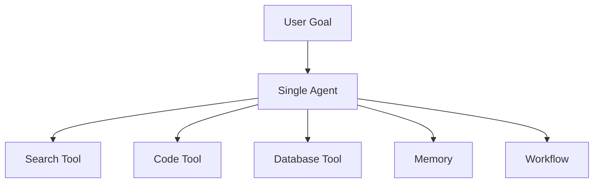

一个 Agent 使用十个 Tool，仍然可以是 Single-Agent。

但“以 Tool 接口暴露”不代表内部一定没有 Agent：若搜索服务只执行给定查询或固定流程，它是普通工具；若它由模型根据每轮结果决定继续搜什么、何时停止，再交付结果，按本章口径就是一个被委派的子 Agent。主 Agent 仍然持有全局目标，并不妨碍整体成为 Multi-Agent。

## 9.2 什么是 Multi-Agent

Multi-Agent System 包含多个相对独立的 Agent。每个 Agent 通常具有自己的：

- 角色和目标；
- 上下文；
- 状态或记忆；
- Tools 与权限；
- 决策循环；
- 输入输出契约。

它们通过消息、任务、Artifact 或共享工作区协作完成整体目标。

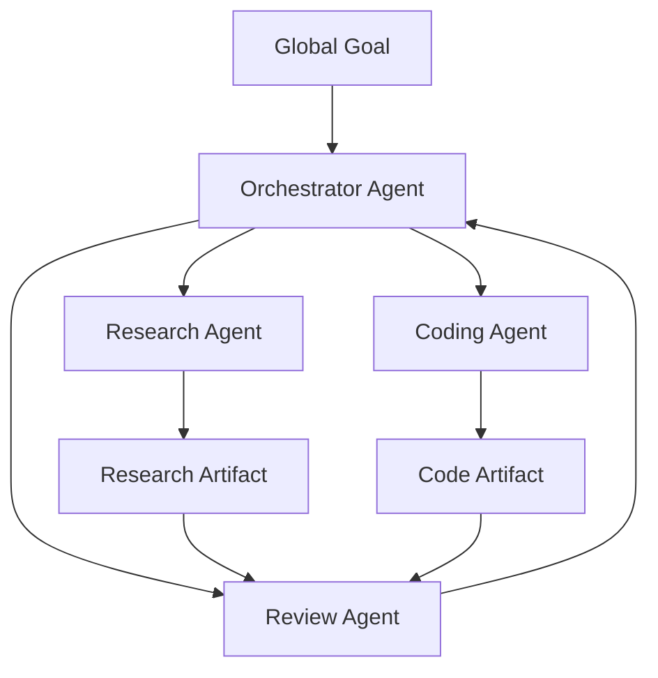

> **Multi-Agent 的本质不是“多调用几个模型”，而是多个具有独立职责和局部决策权的 Agent 进行协调。**

## 9.3 不要把多角色 Prompt 当成完整 Multi-Agent

按本章的局部决策循环判据，以下设计本身不足以构成 Multi-Agent：

- 同一个 Agent 依次使用“研究员”“写作者”Prompt；
- 一个 Workflow 并行调用三次无状态 LLM；
- 同一个模型生成多个候选再投票；
- 多个 Tool 分别执行不同函数。

这些设计可能属于：

- Role Prompting；
- Parallel LLM Calls；
- Ensemble；
- Workflow；
- Tool Orchestration。

只有当多个执行单元各自保有局部状态，并能根据观察决定后续动作，再通过明确协议协调时，本章才将其归为 Multi-Agent。这是为了讨论控制与失败边界，不是否认其他文献对“多 Agent”的较宽定义。

## 9.4 Single-Agent 的真实能力边界

讨论 Single-Agent 的限制时，常见的两个出发点是：

1. Context Window；
2. 单点能力或专业度。

这两个问题确实存在，但需要更准确地理解。

### 9.4.1 Context Window 是单次模型调用的限制

Multi-Agent 不会改变底层模型的 Context Window。它做的是：

- 将任务上下文分区；
- 让每个 Agent 只处理局部信息；
- 通过摘要或 Artifact 交换结果。

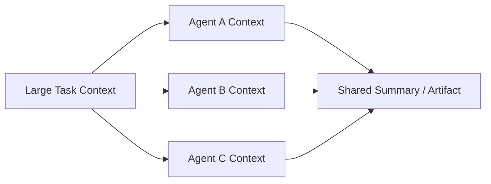

这种方式可以减少单个 Agent 的上下文压力，但会引入：

- 信息在 Agent 边界处丢失；
- 摘要偏差；
- 重复检索；
- 跨 Agent 冲突；
- 合并成本。

Single-Agent 也可以通过 Context Engineering、外部 State、Artifact 和分层记忆处理长任务。因此，Context Window 不是只能通过 Multi-Agent 解决的结构性死局。

### 9.4.2 分角色不等于自动变专业

如果多个 Agent：

- 使用同一个模型；
- 使用相似 Prompt；
- 访问相同数据；
- 使用相同 Tools；
- 没有独立评估标准；

那么仅仅给它们起不同名字，未必能显著提高专业度。

真正的专业化来自：

- 不同 System Instructions；
- 专门领域数据；
- 不同 Tools；
- 不同模型；
- 独立权限；
- 专门的输出 Schema；
- 针对角色的评估集；
- 清晰、窄范围的任务契约。

> **角色名不是专业能力，专用上下文、工具、数据和评估才是。**

## 9.5 为什么使用 Multi-Agent

Multi-Agent 的收益通常落在五个方面。

### 9.5.1 上下文隔离

不同 Agent 只加载自己需要的信息，减少无关内容干扰。

例如：

- Research Agent 只关注来源和事实；
- Coding Agent 只关注代码和测试；
- Review Agent 只关注变更和验收标准。

### 9.5.2 能力与权限专业化

不同 Agent 可以使用不同：

- 模型；
- Tools；
- Skills；
- 数据源；
- 权限；
- 安全策略。

例如，Research Agent 只能读取网络，Deployment Agent 才能访问部署系统。

### 9.5.3 并行执行

互不依赖的 Agent 可以同时工作：

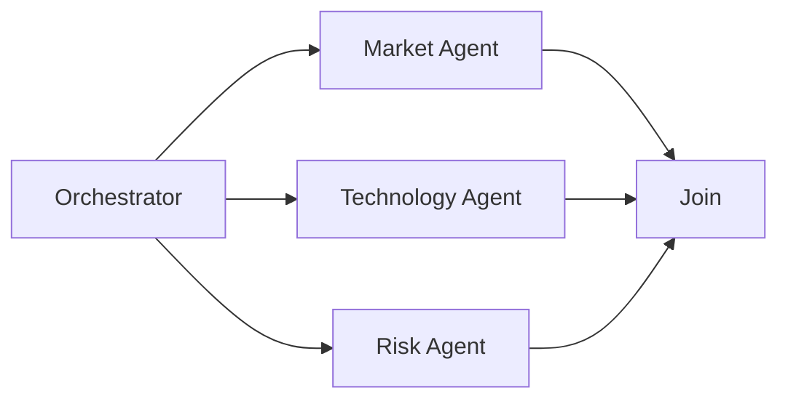

### 9.5.4 故障隔离

一个 Worker 失败时，可以：

- 只重试该 Worker；
- 切换备用 Agent；
- 降级为简单 Tool；
- 保留其他 Agent 的成果。

这要求 Runtime 已隔离任务状态、资源和副作用。只拆成多个 Prompt 不会隔离进程崩溃、共享 API 限流或凭据泄露；把同一共享文件交给两个 Worker 修改，反而会扩大故障范围。

### 9.5.5 多视角与制衡

可以让不同 Agent：

- 独立提出方案；
- 批判其他 Agent 的结果；
- 进行事实核验；
- 使用不同假设分析风险。

但多个 Agent 共享相同模型时仍可能共享相同偏差，因此多视角不能替代客观验证。

## 9.6 Multi-Agent 不一定比 Single-Agent 更强

Multi-Agent 会增加：

- 通信成本；
- Token 消耗；
- 调度复杂度；
- 延迟；
- 状态同步；
- 错误传播路径；
- 权限管理；
- 可观测性要求。

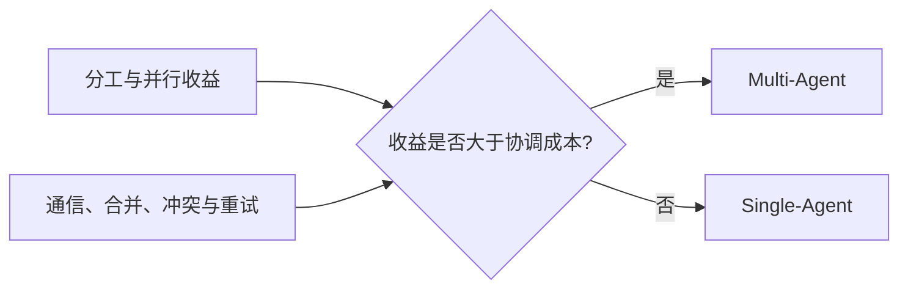

任务复杂并不自动意味着应该使用 Multi-Agent。若任务无法清晰拆分，多 Agent 可能只是把一个困难问题变成多个协调困难的问题。

### 9.6.1 两篇 2025 年工程文章的不同任务前提

以下是特定系统的工程经验，不是关于所有 Multi-Agent 系统的定理，也不能作为两家公司当前产品能力的完整描述。

**Cognition 的文章**以长时编码任务为主要例子：多个 Agent 并行工作时，A 不知道 B 做了什么决定；即使共享初始需求，后续仍可能产生冲突的隐含假设。因此作者建议优先使用单线程、上下文连续的 Agent，长轨迹再做压缩。这是对耦合任务的风险提醒，不是“所有轨迹必须复制给所有 Agent”的安全要求；应共享相关决策、接口和证据，避免传播凭据或无关私有上下文。

**Anthropic 的研究系统文章**报告：Claude Opus 4 主 Agent 加 Sonnet 4 子 Agent，在其内部研究评测上比单 Opus 4 系统表现高出 90.2%；其数据中，多 Agent 系统消耗的 Token 约为普通聊天的 15 倍，单 Agent 约为聊天的 4 倍。[原文](https://www.anthropic.com/engineering/multi-agent-research-system)没有给出足以复现这一内部评测的全部细节，90.2% 不能解释为准确率增加 90.2 个百分点，15 倍也不是“相对单 Agent”的通用倍率。模型组合、额外推理预算和任务分解一起改变，不能把收益全部归因于拓扑。

### 9.6.2 分歧的实质与调和

两篇文章并未做同任务、同预算的对照实验；任务耦合程度和隔离边界可以解释一部分差异：

| 边界划法 | 效果 |
|---|---|
| 扁平对等的并行 Agent，各自决策、事后合并 | 耦合任务容易发生隐含假设冲突；独立分片且接口固定时仍可有效 |
| 明确的角色分层（规划者 / 执行者） | 可减少上下文干扰；仍需向执行者传递相关全局约束，并允许上报计划错误 |
| 探索型子任务隔离，回传结论和证据引用 | 有利于保持主上下文简洁；摘要遗漏时必须能回查原始 Artifact |

工程上更实用的判断标准是：

> Agent 数量不是收益指标。先看隔离是否减少上下文干扰、是否存在可验证的专业化或并行收益；若拆分后持续交换大量中间决策，应重新检查边界。

研究任务可以按独立来源或主题并行，但跨主题推导未必可拆；编码任务也可以并行调查互不相关的模块，但共享 API 和数据模型的改动应先定接口。并行度低时，先考虑串行 Workflow 或单 Agent；只有上下文、权限隔离本身有价值时，才增加串行的角色分层。

## 9.7 Single-Agent 适合什么场景

- 任务步骤较少；
- 一个 Context 可以容纳主要信息；
- Tools 和权限相对统一；
- 子任务高度耦合；
- 没有明显并行机会；
- 需要快速迭代和简单维护；
- 单个 Agent 已能达到目标质量。

### 9.7.1 优势

- 架构简单；
- 状态写入关系较简单，但外部并发和副作用仍需一致性控制；
- 调试路径短；
- Token 和通信成本较低；
- 权限模型简单；
- 更容易复现执行过程。

### 9.7.2 局限

- 长任务容易产生 Context 压力；
- 单个控制循环可能成为瓶颈；
- 自主决策仍由一个循环统筹，但确定性 Worker 和工具可以并发；
- 不同权限和专业上下文容易相互污染；
- 单点失败可能影响整个任务。

## 9.8 Multi-Agent 适合什么场景

以下任一收益可以成为候选理由，但都还要通过可分离性、成本和可靠性验证，不要求专业异构与并行同时存在。

### 9.8.1 任务可清晰拆分

子任务拥有明确输入、输出和验收标准。

### 9.8.2 存在真实专业异构

不同子任务需要不同：

- 数据；
- 模型；
- Tools；
- Skills；
- 权限；
- 评估方式。

### 9.8.3 存在可利用的并行性

多个子任务可以并发执行，并且并行收益高于调度和合并成本。

### 9.8.4 需要权限隔离

例如：

- Search Agent 只有只读网络权限；
- Coding Agent 只能修改工作区；
- Deployment Agent 需要人工批准；
- Audit Agent 只能读取不可变日志。

### 9.8.5 需要故障隔离或规模扩展

大量同类任务可以分发给 Worker Pool，并独立重试和扩缩容。

权限隔离和 Worker Pool 都不专属于 Multi-Agent。若确定性 Workflow、独立服务账号和普通任务队列已经满足需求，不必为此增加模型决策循环。

## 9.9 选型不能只看三个条件

“Context 快撑爆、需要专业分工、存在并行子任务”是很好的初筛标准，但还需要考虑：

| 维度 | 关键问题 |
|---|---|
| Separability | 子任务能否通过明确接口分离？ |
| Coupling | 子任务是否需要频繁共享隐含上下文？ |
| Verifiability | 每个 Agent 的输出能否独立验证？ |
| Coordination Cost | 通信和合并是否过于昂贵？ |
| Risk | 多 Agent 是否扩大权限和攻击面？ |
| State Consistency | 是否需要强一致共享状态？ |
| Latency | 关键路径是否真的能缩短？ |
| Scale | 是否需要独立扩缩容？ |

如果子任务高度耦合、持续交换大量上下文，Single-Agent 或共享状态 Workflow 可能更合适。

## 9.10 从简单到复杂的升级路径

下面是一条排查复杂度的路径，不是必须逐级完成的架构演进。固定任务可以直接使用 Workflow，无须先实现自由 Agent。

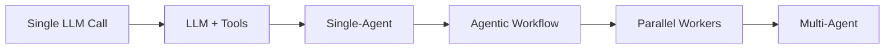

如果尚不清楚瓶颈在哪里，可以按以下顺序排查；已知流程固定时可直接采用 Workflow：

1. 先优化单次调用；
2. 增加 Tools 和检索；
3. 使用 Single-Agent；
4. 用 Workflow 固定主流程；
5. 将独立任务并行化；
6. 只有需要独立决策者时再引入 Multi-Agent。

## 9.11 中心化 Orchestrator-Workers

中心化架构由 Orchestrator 统一：

- 理解全局目标；
- 拆分任务；
- 选择 Worker；
- 管理依赖；
- 跟踪状态；
- 汇总结果；
- 处理失败和重试。

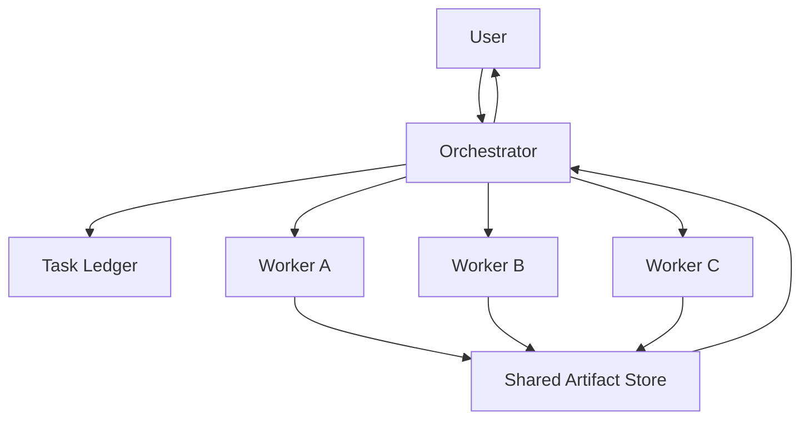

### 9.11.1 优势

- 全局目标统一；
- 调度链路清晰；
- 容易追踪和审计；
- 权限和预算集中管理；
- 失败容易定位；
- 适合 DAG 和关键路径调度。

### 9.11.2 局限

- Orchestrator 可能成为单点瓶颈；
- Orchestrator 错误会影响所有 Worker；
- 全局状态可能过大；
- 大量 Worker 消息增加协调压力；
- 中央节点故障需要恢复机制。

### 9.11.3 模型与调度器分工

中心化是逻辑上的控制归属，不要求所有功能放在一个 LLM 调用或单进程中。LLM 可以提出子任务和依赖；确定性调度器负责校验 DAG、持久化领取状态、授权和执行预算。调度器重启后应从账本恢复，而不是重新询问模型“刚才做到哪里”。

一种可选形态是：

- Workflow 作为最外层控制；
- 一个顶层 Orchestrator；
- 多个领域子 Orchestrator；
- 叶子 Worker 执行具体任务。

## 9.12 分层 Multi-Agent

分层架构适合 Agent 数量较多、领域边界明确的系统。

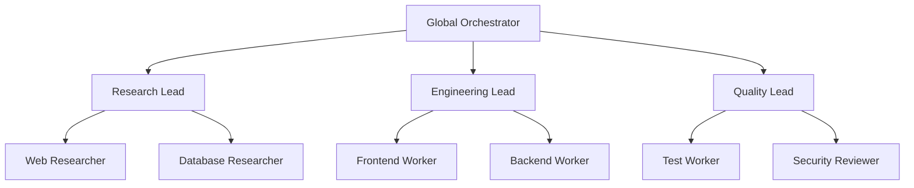

优势：

- 顶层 Agent 不需要管理所有细节；
- 每个领域维护局部 Context；
- 可以独立扩缩容；
- 适合大型任务组织。

风险：

- 信息经过多层摘要后失真；
- 责任边界不清；
- 错误可能沿层级传播；
- 跨领域协调变慢。

## 9.13 Pipeline 架构

Pipeline 让多个 Agent 按固定顺序处理：

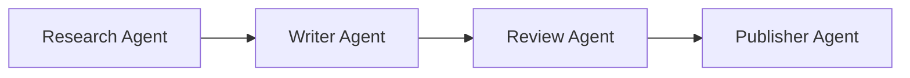

它更接近 Workflow：

- 顺序由开发者定义；
- 每个 Agent 只负责一个阶段；
- 下一步通常不由 Agent 自由选择。

这里固定的是**阶段之间**的路由，阶段内部仍可有自主搜索、写作或核验循环。如果每个阶段都只是一次固定 LLM 调用，那就是普通 LLM Workflow，不必因为阶段名里有 Agent 就归为多 Agent。

适合：

- 阶段固定；
- 输入输出清晰；
- 每个阶段需要独立专业 Context。

风险是上游错误会传递到下游，因此每个阶段需要 Gate 和验收条件。

## 9.14 Blackboard / Shared Workspace

多个 Agent 不直接互相发送全部消息，而是读写共享工作区：

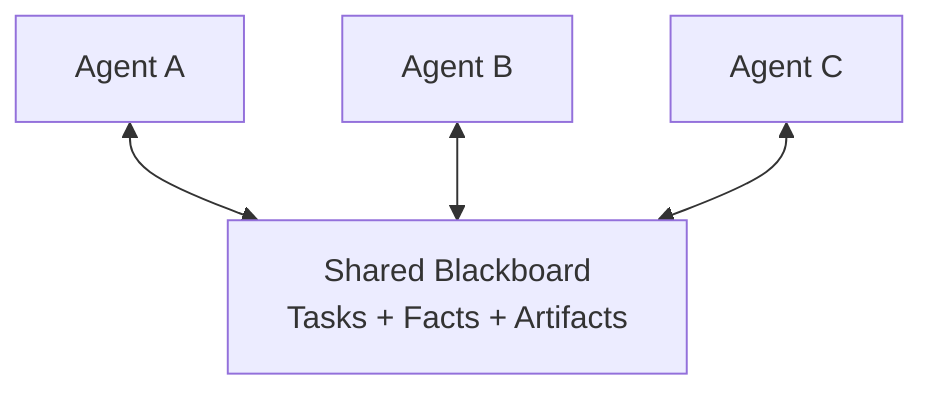

共享工作区可以包含：

- Task Ledger；
- Artifact；
- 已验证事实；
- 未解决问题；
- 任务状态；
- 版本和锁。

优势：

- 降低点对点消息数量；
- 结果可以复用；
- 容易异步协作；
- Agent 可以随时加入或退出。

风险：

- 写入冲突；
- 过期状态；
- 共享内容污染；
- 权限扩大；
- 缺乏明确负责人。

需要版本控制、租约、原子更新和来源追踪。

应区分两类冲突：两个 Worker 覆盖同一字段是存储并发问题，用事务、CAS（比较版本后原子更新）或单写者控制；两份报告对同一事实得出相反结论是语义冲突，需要查证来源、时间和适用条件。正确处理 CAS 失败才能避免丢失更新，不能重试时直接强制覆盖；它也不能证明报告正确，多数 Agent 同意更不能代替事实验证。

## 9.15 Peer-to-Peer 架构

Peer-to-Peer 中，Agent 可以直接发现并联系其他 Agent：

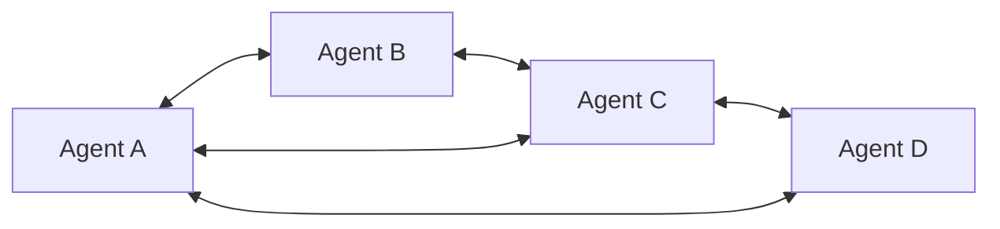

### 9.15.1 优势

- 没有单一中央调度瓶颈；
- Agent 可以动态建立协作；
- 适合组织边界分散的系统；
- 局部节点故障不一定导致全局停止；
- 可用于协商、模拟和开放生态。

### 9.15.2 工程难点

去中心化并非天然缺少协调，但协调机制必须显式设计：

- 谁负责分配任务？
- 如何避免重复领取？
- 如何表达任务依赖？
- 如何检测 Agent 失联？
- 如何取消已经分发的任务？
- 如何处理冲突结果？
- 如何判断全局任务完成？
- 谁拥有最终决策权？

如果没有这些机制，会出现：

- 重复工作；
- 消息风暴；
- 顺序错误；
- Deadlock；
- Livelock；
- 无人负责的任务；
- 失败无法传播；
- 全局状态不一致。

### 9.15.3 去中心化并非生产环境不可用

Peer-to-Peer 可以通过以下机制进入生产：

- Capability Registry；
- Task Lease；
- Distributed Task Ledger；
- Heartbeat 与 Failure Detector；
- 幂等消息；
- 任务归属的原子提交，以及业务结果的明确冲突规则；
- Trace Correlation；
- 超时和取消协议；
- 最终结果 Owner。

问题在于这些机制的实现成本很高。对单团队、单产品中的 Agent 系统，中心化或分层编排通常更简单。

这里的 Agent 协商不等于 Raft/Paxos 强共识。前者在讨论方案和证据；后者在给定故障模型下，使存储副本对日志顺序和已提交状态达成一致。需要多副本任务账本时，应使用有相应保证的数据库或协调服务，而不是让 LLM 投票选 Owner。[Raft](https://raft.github.io/)可容忍一定数量的崩溃故障，但不验证业务事实，也不提供针对恶意 Agent 输出的拜占庭容错。

## 9.16 混合拓扑

实际系统经常混合使用：

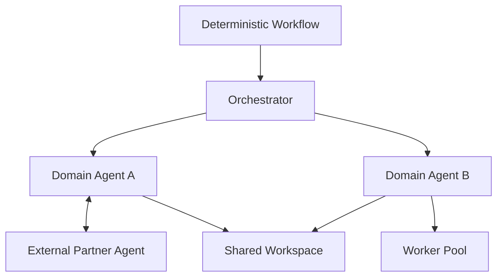

例如：

- 内部任务由 Orchestrator 管理；
- 同一领域内使用 Worker Pool；
- 跨公司 Agent 通过 A2A 协作；
- 结果通过 Shared Workspace 汇总；
- 高风险操作仍由 Workflow 和人工审批控制。

## 9.17 Multi-Agent 的通信方式

Agent 之间不应依赖自由文本聊天作为唯一协议。

下面分别给出请求、成功结果和阻塞结果的形状；后两者是不同执行结果的示例，不是要求同一次尝试依次返回两种状态。

### 9.17.1 Task Message

```json
{
  "task_id": "research-a",
  "attempt_id": "research-a-attempt-1",
  "input_version": 1,
  "goal": "调研竞品 A 最近六个月的更新",
  "inputs": {
    "published_from": "2026-02-28T00:00:00Z",
    "published_before": "2026-08-28T00:00:00Z"
  },
  "success_criteria": [
    "至少两个独立来源",
    "输出包含发布日期和链接"
  ],
  "deadline": "2026-08-28T09:00:00Z",
  "reply_to": "orchestrator-1"
}
```

### 9.17.2 Result Message

```json
{
  "task_id": "research-a",
  "attempt_id": "research-a-attempt-1",
  "input_version": 1,
  "status": "completed",
  "artifact_uri": "artifact://research-a.json",
  "summary": "发现三个主要产品更新",
  "validation": {
    "source_count": 4,
    "independent_source_count": 2,
    "passed": true
  }
}
```

### 9.17.3 Error Message

```json
{
  "task_id": "research-a",
  "attempt_id": "research-a-attempt-1",
  "input_version": 1,
  "status": "blocked",
  "error": {
    "code": "SOURCE_UNAVAILABLE",
    "retryable": true
  },
  "needs": "备用数据源或人工输入"
}
```

结构化消息可以支持调度、重试和监控。

以上是应用自定义示例，不是 A2A 的标准报文。起止日期固定查询范围，`task_id` 标识逻辑任务，`attempt_id` 区分重试，`input_version` 防止旧需求下的结果混入新任务。Runtime 接收结果时应核对当前尝试与输入版本；仅按 `task_id` 覆盖会接纳已经取消的旧执行结果。

`completed` 表示执行方报告完成，`validation.passed` 也只是其声明。验收者仍需读取 Artifact，核对来源是否独立、日期是否落在范围内；四个转载链接可能只有一个原始来源。最终成功应由 Runtime 在验证后记录，而不是直接复制 Worker 的自评。

## 9.18 A2A 与 Agent Card

A2A 可以帮助不同系统中的 Agent：

- 发现能力；
- 协商交互方式；
- 发送任务和消息；
- 跟踪任务状态；
- 交换 Artifact。

Agent Card 描述：

- Agent 身份；
- 服务地址；
- 支持的能力和 Skills；
- 认证要求；
- 输入输出模式。

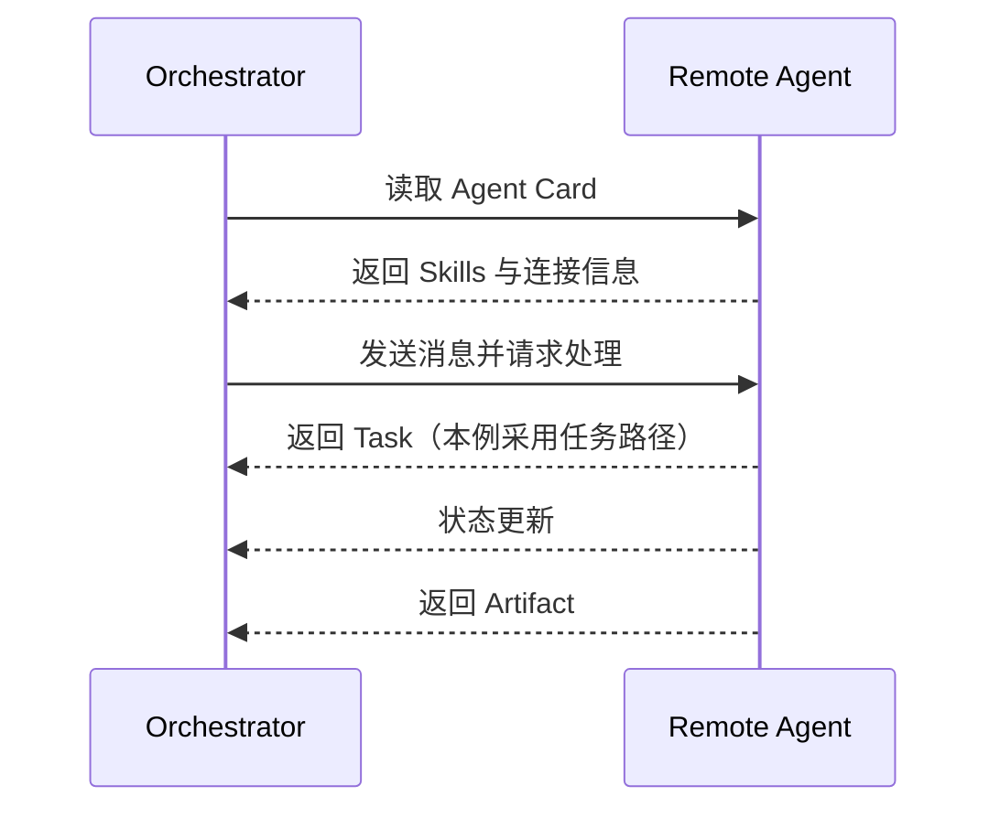

A2A 标准化通信，但不会自动解决任务分解、信任、费用、冲突和全局调度。图中展示的是服务端返回 Task 后跟踪状态的路径；简单请求也可以直接返回 Message，并非每次通信都必然创建 Task。

本节固定讨论 [A2A v1.0.1](https://github.com/a2aproject/A2A/releases/tag/v1.0.1)，对应线上协议版本标识 `1.0`。实际接入时要选择双方支持的 binding，即协议在 JSON-RPC、HTTP/REST 或 gRPC 上的具体映射，不能把应用自定义 JSON 直接当作标准报文。Agent Card 是能力声明，不是能力测评或授权凭据；跨组织调用仍需验证服务身份，并单独约定超时、费用和结果验收。

## 9.19 Shared Memory 设计

Multi-Agent 不应共享全部 Messages。

推荐分层：

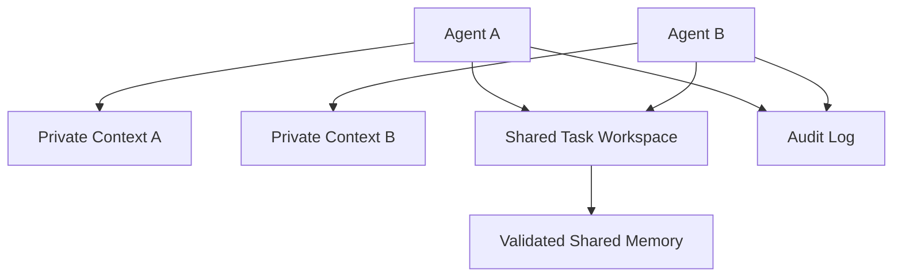

### 9.19.1 Private Context

保存局部工作笔记和任务状态。恢复所需的是可用的输入、工具结果、决策摘要和检查点，不应依赖供应商未暴露的隐藏推理。

### 9.19.2 Shared Task Workspace

保存：

- Task 状态；
- Artifact；
- 已验证事实；
- 未解决问题；
- 依赖关系。

### 9.19.3 Validated Shared Memory

只保存经过验证、可跨任务复用的信息。

### 9.19.4 Audit Log

保存不可随意修改的消息和操作轨迹。

## 9.20 权限与安全

每个 Agent 应遵循最小权限：

| Agent | 推荐权限 |
|---|---|
| Research Agent | 只读网络和知识库 |
| Coding Agent | 工作区文件和测试命令 |
| Review Agent | 只读代码与 Diff |
| Deployment Agent | 受审批的部署权限 |
| Finance Agent | 受限业务 API 和强审计 |

不要因为 Orchestrator 有高权限，就把相同凭据传给所有 Worker。

Multi-Agent 扩大的攻击面包括：

- 恶意 Agent 消息；
- Prompt Injection 跨 Agent 传播；
- Shared Memory Poisoning；
- 身份冒充；
- Confused Deputy；
- 越权任务委派；
- 敏感 Artifact 泄露。

需要消息认证、权限检查、来源追踪和信任边界。

## 9.21 失败传播与恢复

### 9.21.1 中心化架构

Orchestrator 可以统一处理：

- 超时；
- Worker 失联；
- 重试；
- 更换 Worker；
- 取消下游任务；
- 部分结果返回。

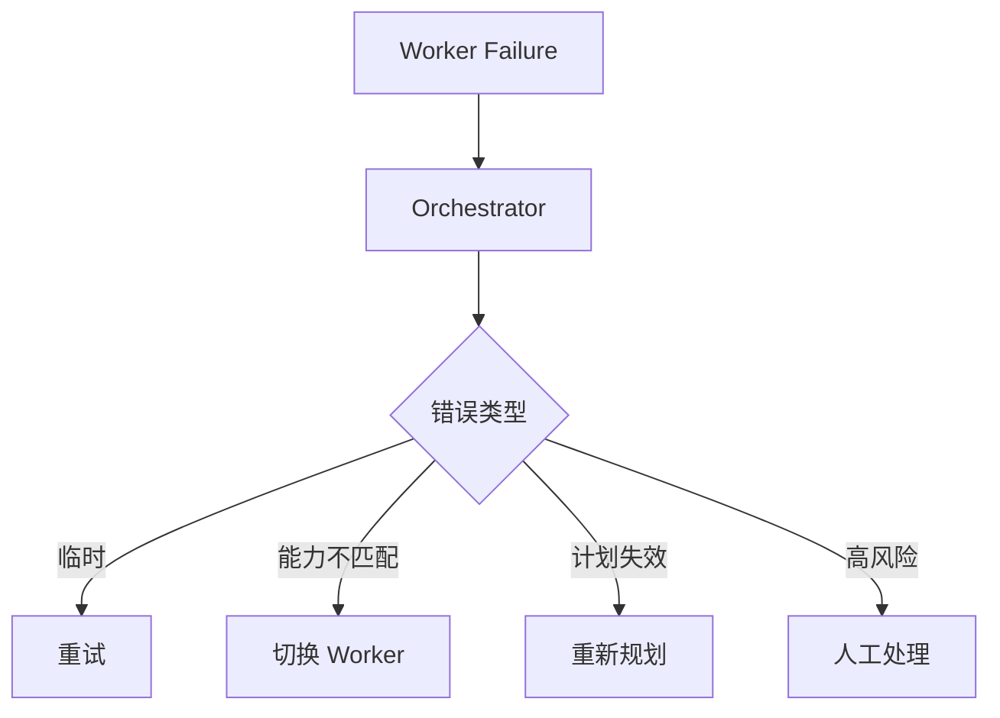

### 9.21.2 去中心化架构

去中心化时，没有一个天然的节点负责收拢失败，需要明确由谁落实：

- Failure Detector；
- Task Lease 过期；
- 重复执行去重；
- Leader 或 Result Owner；
- 最终一致性；
- 消息重放。

这些机制也适用于中心化系统的远程 Worker。尤其不能把“租约到期”理解成“旧 Worker 已停止”：网络分区后，旧执行者可能仍在工作。任务账本可签发递增的 fencing token（隔离令牌），由接收写入的存储或业务服务拒绝旧代次；只在调度器里记一个到期时间，挡不住旧进程继续写。

副作用还需单独处理。发信已成功但结果回包丢失时，换 Worker 重试可能再次发信；应让同一逻辑操作跨重试使用同一幂等键，或先查询外部状态再决定。停止等待、请求取消、确认停止以及撤销已发生的操作，是四件不同的事。

## 9.22 错误会如何复合

令 `Sᵢ` 表示第 `i` 个必需步骤成功。在固定顺序、所有步骤都必须成功且不含修复分支的模型中，链式法则给出：

$$
P_{system}=P(S_1)\prod_{i=2}^{n}P(S_i\mid S_1,\ldots,S_{i-1})
$$

若再假设步骤独立，才可把条件概率换成各步骤的边际成功率 `pᵢ`，得到 `P_system = ∏pᵢ`。若 `pᵢ` 本来就是“此前均成功条件下”的通过率，乘积不需要独立假设，但不能拿孤立测试通过率代替它。

例如，假设五个必需步骤相互独立且各自成功率为 95%，整体成功率约为：

$$
P_{system}\approx 0.95^5\approx 0.774
$$

95% 是假设值，不是实测数据。实际步骤通常相关，验证、冗余和修复也会改变路径。因此这个计算只说明：

> 在增加串行必需环节且没有补偿收益时，系统多了失败入口；不能由此推出增加独立核验或冗余一定降低成功率。

因此需要验证、重试和减少不必要的交接。

## 9.23 延迟与协调成本

Multi-Agent 总时间不是所有 Worker 时间简单相加，也不等于最慢 Worker 时间。

对于一次并行分发再汇总，可以做如下时间核算；各项只计未被其他工作覆盖的耗时，不能重复相加：

$$
T_{multi}=
T_{critical}
+T_{coord}
+T_{merge}
+T_{retry}
$$

其中：

- `T_critical`：只计有效任务执行的关键路径时间；
- `T_coord`：关键路径外、实际延长总时长的排队、分配和通信时间；
- `T_merge`：尚未计入关键路径的合并和冲突处理时间；
- `T_retry`：未与其他任务重叠的恢复时间。

如果协调和合并成本大于并行收益，Multi-Agent 会比 Single-Agent 更慢。

更一般地，应在 Trace 中把调度、模型调用、工具调用、验证和重试都作为节点，测量完整执行图的关键路径。Worker 数量增加不保证提速：共享检索 API 限流、慢尾请求和汇总瓶颈都可能抵消并行收益。关于就绪任务、Join 和预算的实现，见[第十三章 §13.41：推荐生产架构](13-multi-agent-coordination.zh.md)。

## 9.24 Orchestrator 的设计

一个成熟 Orchestrator 不只是“让 LLM 给 Worker 发消息”，还需要：

- Capability Registry；
- Task Decomposition；
- Dependency Graph；
- Task Ledger；
- Scheduler；
- Budget Manager；
- Permission Gate；
- Result Aggregator；
- Verifier；
- Failure Recovery；
- Trace。

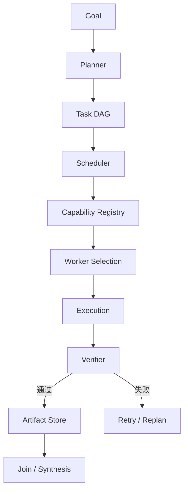

Orchestrator 的模型决策也应受到确定性 Runtime 的限制。

## 9.25 Worker 的设计

一个 Worker 应有窄而明确的职责：

- 明确 Capability；
- 明确输入 Schema；
- 明确输出 Schema；
- 明确 Tools；
- 明确权限；
- 明确成功标准；
- 明确超时和预算；
- 明确错误类型。

不推荐：

- “你是万能研究专家”；
- “尽力完成所有任务”；
- 无边界地访问所有共享上下文；
- 失败时只返回自由文本。

## 9.26 结果合并

多个 Worker 结果可能：

- 重复；
- 冲突；
- 使用不同格式；
- 引用不同来源；
- 质量不一致。

合并流程应包括：

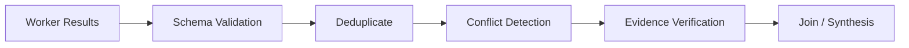

冲突不应由 Writer Agent 静默选择。应：

- 标记冲突；
- 比较来源可信度和时间；
- 请求独立 Verifier；
- 必要时返回给用户判断。

## 9.27 Multi-Agent 的常见失败模式

### 9.27.1 重复工作

多个 Agent 同时调研同一内容。

解决：

- Task Ledger；
- 唯一 Task ID；
- 任务租约；
- Artifact 发现。

### 9.27.2 任务遗漏

Orchestrator 拆分后没有 Agent 负责某个依赖。

解决：

- DAG 完整性检查；
- 验收条件映射；
- 未分配任务检测。

### 9.27.3 消息丢失或重复

解决：

- 幂等消息；
- Acknowledgement；
- Retry；
- 去重键。

### 9.27.4 Context 丢失

Agent 交接时遗漏关键背景。

解决：

- Task Contract；
- Artifact；
- 来源引用；
- 结构化 Handoff。

### 9.27.5 Agent 互相等待

形成 Deadlock。

解决：

- 依赖环检测；
- 超时；
- Lease；
- Orchestrator 仲裁。

### 9.27.6 无限讨论

Agent 不断互相批评但不执行。

解决：

- 最大回合数；
- 明确 Decision Owner；
- 验证阈值；
- 强制提交 Artifact。

### 9.27.7 Shared Memory 污染

一个 Agent 写入错误事实，影响所有 Agent。

解决：

- 来源；
- 信任等级；
- 写入审核；
- Validated Memory 与 Working Notes 分离。

## 9.28 研究系统示例

目标：

> 调研三家竞品最近半年的变化，并输出带来源的比较报告。

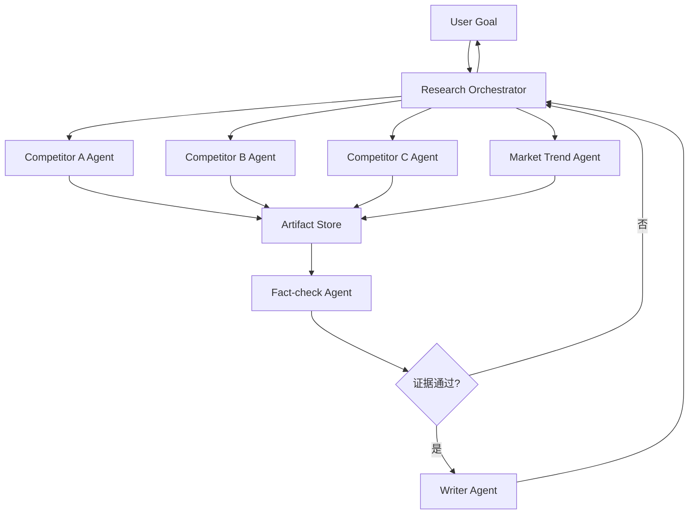

### 9.28.1 为什么适合 Multi-Agent

- 三家竞品可以独立调研；
- 每个 Agent 只需要局部 Context；
- 调研任务可以并行；
- Fact-check 与 Writer 具有不同职责；
- 结果可通过统一 Artifact Schema 合并。

### 9.28.2 哪些部分不应交给自由 Agent

- 权限控制；
- 任务预算；
- 最大并发；
- 引用 Schema；
- 最终发布；
- 敏感信息过滤。

这些应由 Runtime 或 Workflow 控制。

例如，A 的研究 Agent 按“功能正式可用日”记录时间，B 却按“博客发布日”记录；两份报告各自格式正确，合并后仍会得出错误的先后顺序。编排者应在分发前统一时间口径，并要求每条更新带来源和状态。若搜索中发现 A 的结论依赖 B 的产品分类，应先共享这一接口约定，而不是让两个 Agent 各自猜，再交给 Writer 消除矛盾。

Fact-check 返回缺口后，可以只重开受影响的研究任务，不必重跑所有来源；但图中的回退也要受最大尝试次数和预算限制。超过限制时交付已验证的部分与明确缺口，不能无限循环直到核验 Agent 说“通过”。

## 9.29 Single-Agent 与 Multi-Agent 对比

| 维度 | Single-Agent | Multi-Agent |
|---|---|---|
| 控制主体 | 一个 | 多个 |
| 上下文 | 由一个控制主体组织，也可按步骤过滤 | 通常分区并通过协议交换 |
| 状态管理 | 相对简单 | 分布式或共享状态 |
| 专业化 | 通过 Tools、Skills 和 Prompt | 可通过独立模型、工具、数据和权限 |
| 并行性 | 可并行调用 Tool 或确定性 Worker | 可并行运行多个自主决策循环 |
| 调试 | 路径较短 | 需要跨 Agent Trace |
| 成本 | 通常协调开销较少，仍需实测 | 多出通信与调度开销，也可能用局部小模型节省成本 |
| 错误 | 单点决策错误 | 可能跨 Agent 传播和复合 |
| 权限 | 可按工具和步骤限制权限 | 还需限制跨 Agent 委派与数据传播 |
| 适用场景 | 单循环能满足目标或任务高度耦合 | 可分解且隔离、异构或并行带来净收益 |

## 9.30 选型决策树

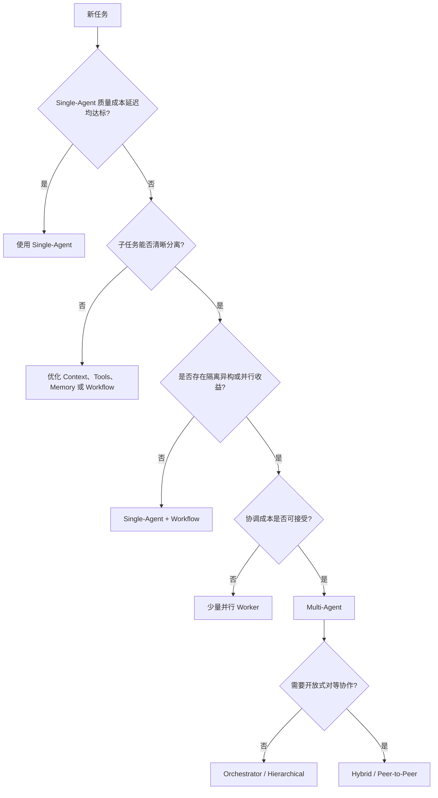

这棵树从已测量的 Single-Agent 基线开始排查，不要求纯规则或固定 Workflow 任务先上 Agent。无论走哪条分支，最后都要回到同一组任务上测质量、总成本和延迟；图里的“可接受”是业务约束，不是模型自行打分。

## 9.31 评估 Multi-Agent 是否值得

先建立相同任务、工具权限和验收标准的基线，再比较两种约束：同总预算下谁质量更高，以及同质量目标下谁更便宜、更快。总预算包含主 Agent、子 Agent、验证、失败尝试、工具费用和重试，不能只统计最终回复。若多 Agent 用了更强模型或更多 Token，应另做消融，避免把额外算力误写成协作收益。

按任务可分解性、依赖密度、上下文长度和副作用风险分层评测；保留失败与超时样本，对同一任务重复运行并报告波动或置信区间。单独去掉并行、角色 Prompt 或独立上下文，可以检验究竟是哪一项起作用。[MAST](https://arxiv.org/abs/2503.13657)提供了任务定义、跨 Agent 对齐、验证与终止等失败分析视角，其分类适合辅助标注，不是系统的通用成功率。

### 9.31.1 质量

- 整体任务成功率；
- 每个 Agent 的验收通过率；
- 冲突和遗漏比例；
- 最终结果是否优于 Single-Agent 基线。

### 9.31.2 效率

- 总 Token 和费用；
- 关键路径延迟；
- 并行效率；
- 协调消息占比；
- 重复工作比例。

可以定义协调成本占比：

$$
R_{coord}=\frac{C_{coord}}{C_{total}}
$$

如果大量成本用于 Agent 互相交流而不是完成任务，需要简化拓扑或接口。

### 9.31.3 稳定性

- Worker 失败恢复时间；
- Task 遗漏率；
- Deadlock 和循环次数；
- 重试是否局部化；
- 状态是否一致。

故障注入应覆盖：Worker 已产生副作用但回包丢失、旧租约执行者晚到、重复消息、输入版本变化，以及 Orchestrator 重启。验证的不仅是“最终有回答”，还包括没有重复扣款、没有接受旧 Artifact、没有超预算后继续派生任务。

### 9.31.4 安全

- 是否遵循最小权限；
- 是否发生跨 Agent 数据泄露；
- Shared Memory 是否被污染；
- 高风险操作是否经过审批。

## 9.32 生产级检查表

### 9.32.1 选型

- Single-Agent 基线是否已测量？
- 是否存在真实可分解子任务？
- 专业化是否来自能力差异，而非角色名？
- 并行收益是否高于协调成本？

### 9.32.2 拓扑

- 谁拥有最终目标？
- 谁是最终 Decision Owner？
- 是否需要单层、分层或混合 Orchestrator？
- 为什么必须使用 Peer-to-Peer？

### 9.32.3 协议

- 是否有 Task Contract？
- 是否有结构化 Result 和 Error？
- 是否使用唯一 ID、幂等键和 Trace ID？
- 是否支持超时、取消和重试？

### 9.32.4 状态

- 哪些状态私有？
- 哪些 Artifact 共享？
- 谁能写入共享长期记忆？
- 冲突如何解决？

### 9.32.5 安全

- 每个 Agent 的权限是否最小化？
- Agent 身份是否可验证？
- 外部 Agent 是否处于独立信任边界？
- 高风险任务是否需要人工审批？

### 9.32.6 评估

- 是否与 Single-Agent 做质量、成本和延迟对比？
- 是否测量协调开销？
- 是否测试 Worker 失联、重复消息和冲突？
- 是否能够重放完整执行轨迹？

## 9.33 本章总结

Single-Agent 与 Multi-Agent 的差别不只在数量，更在于谁持有目标、状态和下一步决策权。Single-Agent 由一个主体统筹全局；Multi-Agent 则把局部决策拆给多个角色。

Multi-Agent 值得引入的前提是边界可定义、输出可验收；上下文隔离、能力或权限异构、并行探索中至少一项带来可测量的净收益。它们不必同时成立：串行专家交接可能是为了权限边界，同模型的并行研究也可能有价值。

它也解决不了一些常被高估的问题：底层模型的 Context Window 不会因此变大，角色名不同也不会自动带来专业能力，并行化更不等于天然更快或更稳。

一条可用于排查瓶颈的路径是：

> **Single-Agent → Agentic Workflow → Orchestrator-Workers → Hierarchical / Hybrid Multi-Agent**

架构复杂度应由评测中暴露的瓶颈驱动。任务账本的强一致提交交给存储系统；Agent 间的意见分歧交给证据、验收和责任归属处理，两者不能互相替代。

## 参考资料

- [Anthropic: Building Effective Agents](https://www.anthropic.com/engineering/building-effective-agents)
- [Anthropic: How we built our multi-agent research system](https://www.anthropic.com/engineering/multi-agent-research-system)
- [Cognition: Don't Build Multi-Agents](https://cognition.com/blog/dont-build-multi-agents)
- [Why Do Multi-Agent LLM Systems Fail? (MAST)](https://arxiv.org/abs/2503.13657)
- [Agent2Agent (A2A) v1.0.1 Specification](https://github.com/a2aproject/A2A/blob/v1.0.1/docs/specification.md)
- [Raft：作者维护的算法与论文入口](https://raft.github.io/)
- [etcd v3.5：revision、条件事务与租约](https://etcd.io/docs/v3.5/learning/api/)
- [Martin Kleppmann：How to do distributed locking（2016）](https://martin.kleppmann.com/2016/02/08/how-to-do-distributed-locking.html)（引用进程暂停、租约与 fencing token 的分析，不将其 Redis 版本结论推广到当前产品）
- [AutoGen: Enabling Next-Gen LLM Applications via Multi-Agent Conversation](https://arxiv.org/abs/2308.08155)
- [CAMEL: Communicative Agents for Mind Exploration of Large Language Model Society](https://arxiv.org/abs/2303.17760)

资料核对：2026-09-15。Anthropic 与 Cognition 的对照限于文中所述的 2025 年系统和模型；未复现其内部评测。A2A 按 v1.0.1 发布标签核对，不以文档页顶部残留的 `Latest Released Version 1.0.0` 文案替代版本依据。
