# 第十三章：Multi-Agent 协作、路由与动态切换

## 13.1 问题的本质

多 Agent 分工只回答了：

> **谁擅长做什么？**

一个完整协作系统还必须回答：

1. 任务如何描述和分配？
2. Agent 之间如何传递结果？
3. 状态由谁维护？
4. 下一步由谁决定？
5. 控制权是否需要转移？
6. 失败、超时和循环如何处理？
7. 如何追踪整条执行链路？

这些问题可以分为四层：

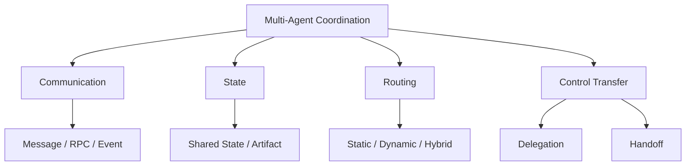

## 13.2 协作拓扑

可以将常见拓扑归纳为四类：

1. Pipeline；
2. Centralized Orchestrator；
3. Shared Workspace / Blackboard；
4. Peer-to-Peer / Negotiation。

真实系统经常混合使用。

## 13.3 Pipeline

Agent 按预定义顺序依次执行：

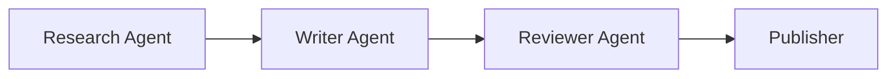

### 13.3.1 适用场景

- 阶段顺序稳定；
- 上下游接口明确；
- 每个阶段具有不同专业上下文；
- 需要清晰审计链路。

### 13.3.2 优势

- 控制流简单；
- 容易测试；
- 状态和责任清晰；
- 成本和延迟容易估算。

### 13.3.3 风险

- 上游错误传播；
- 中间 Agent 成为瓶颈；
- 早期 Agent 可能不知道下游真正需要什么；
- 固定流程难以处理例外。

每个阶段应输出结构化 Artifact，并设置 Gate。

## 13.4 Centralized Orchestrator

Orchestrator 负责：

- 理解全局目标；
- 拆分任务；
- 选择 Worker；
- 管理依赖；
- 跟踪状态；
- 收集和验证结果；
- 重试或重新规划。

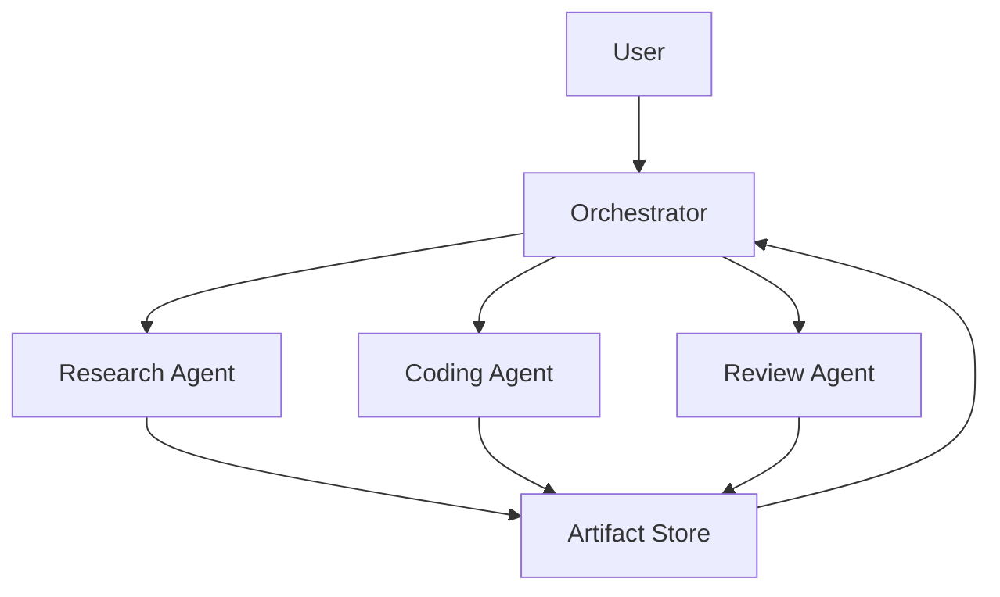

对单团队生产系统，中心化模式通常是比较稳妥的默认选项，因为：

- 全局目标集中；
- 路由可追踪；
- 权限容易统一控制；
- 失败路径容易定位；
- 可以集中管理预算和并发。

但 Orchestrator 也可能成为：

- 单点故障；
- 调度瓶颈；
- 大 Context 聚集点；
- 全局错误来源。

大型系统常采用分层 Orchestrator，而不是一个 Agent 管理所有 Worker。

## 13.5 Shared Workspace / Blackboard

多个 Agent 通过共享工作区交换 Task、事实和 Artifact。

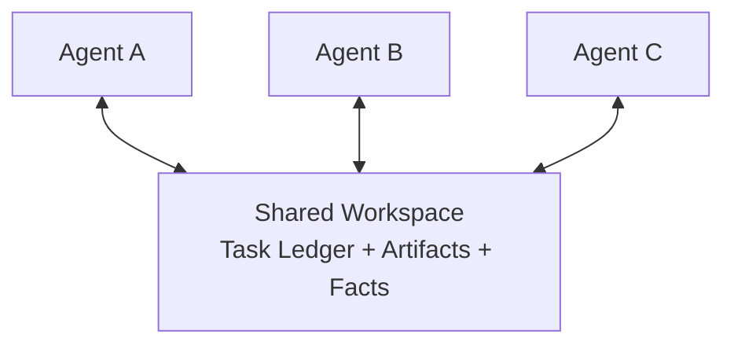

优势：

- Agent 不需要互相传递完整对话；
- 结果可被多个 Agent 复用；
- 支持异步协作；
- 新 Agent 可以读取当前状态后加入。

风险：

- 并发写冲突；
- 过期状态；
- 未验证信息污染全局；
- 责任边界模糊；
- 权限范围过大。

共享工作区需要 Schema、版本、所有权和写入规则。

## 13.6 Peer-to-Peer / Negotiation

Agent 之间直接通信、协商或委派：

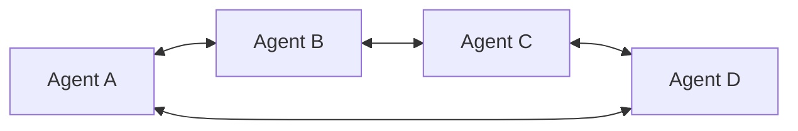

适合：

- 跨组织 Agent；
- 开放生态；
- 模拟与博弈；
- 没有统一中央控制方；
- 局部自治比全局一致更重要。

它不是天然不可用于生产，但必须解决：

- Agent Discovery；
- 身份和信任；
- 任务所有权；
- 重复领取；
- 故障检测；
- 消息幂等；
- 冲突；
- 全局完成判定；
- 费用和权限。

对单团队应用而言，这些分布式协调成本往往高于中心化模式。

## 13.7 通信方式不是只有两种

“消息传递”和“共享状态”是两个重要思路，但消息传递本身包含多种模式：

| 方式 | 特点 | 适用场景 |
|---|---|---|
| Request / Response | 调用方等待结果 | 短任务、强依赖 |
| Queue | Worker 从队列领取任务 | 异步任务、削峰 |
| Pub/Sub | 发布者不指定具体订阅者 | 事件广播、解耦 |
| Event Stream | 保存有序事件 | 状态重建、审计 |
| Shared State | 多节点读写状态 | 图工作流、紧密协作 |
| Artifact Store | 通过 URI 交换大结果 | 文档、代码、数据集 |

生产系统常同时使用：

> **消息触发执行 + State 保存事实 + Artifact 传递大结果。**

## 13.8 Request / Response

调用 Agent 明确知道目标 Agent，并同步等待结果。

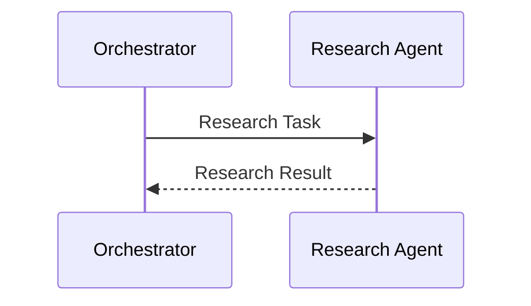

优势：

- 实现简单；
- 错误可直接返回；
- 适合短任务。

限制：

- 调用方被阻塞；
- 长任务容易超时；
- 强耦合；
- 不适合断线恢复。

## 13.9 Queue

Producer 将 Task 放入队列，Worker 竞争消费。

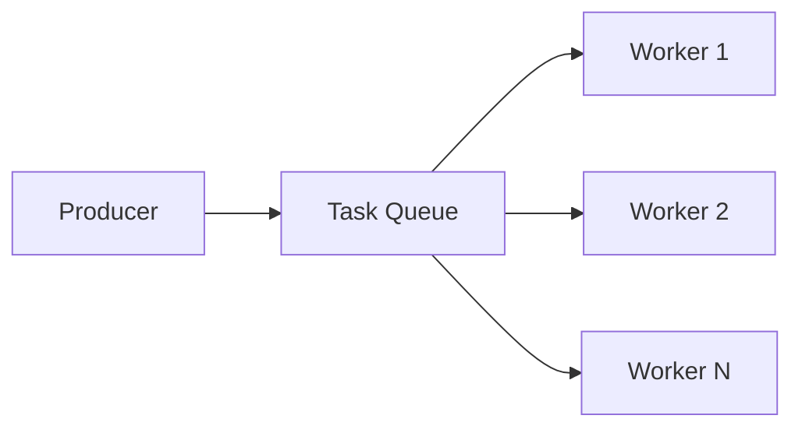

适合：

- 后台任务；
- Worker Pool；
- 弹性扩缩容；
- 重试；
- 流量削峰。

需要考虑：

- At-least-once Delivery；
- Idempotency；
- Visibility Timeout；
- Dead-letter Queue；
- Retry Backoff；
- Task Lease。

分布式系统中很难依赖“绝对只执行一次”，更常见做法是至少一次投递配合幂等执行。

## 13.10 Pub/Sub

Publisher 将事件发送到 Topic，不需要知道具体订阅者：

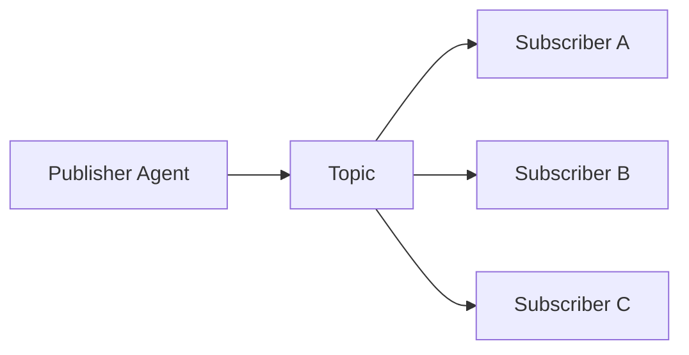

“发送方不需要知道谁在等待结果”准确描述的是 Pub/Sub，而不是所有消息传递。

适合：

- 多个 Agent 对同一事件做不同处理；
- 审计、通知和监控；
- 松耦合扩展。

风险：

- 消费顺序；
- 重复事件；
- Schema 演进；
- 难以知道所有下游是否完成。

## 13.11 Event Stream

Event Stream 保存任务发生的有序事件：

```json
{
  "event_id": "evt-1004",
  "event_type": "agent.task.completed",
  "task_id": "task-42",
  "agent_id": "research-agent",
  "sequence": 17,
  "artifact_uri": "artifact://research-result.json",
  "timestamp": "2026-08-28T09:00:00Z"
}
```

优势：

- 可审计；
- 可回放；
- 可以从事件重建状态；
- 便于多个消费者独立处理。

需要：

- Event Schema；
- 顺序键；
- 幂等消费；
- 保留策略；
- 版本兼容。

## 13.12 Artifact Store

Agent 不应通过消息传递大型完整内容。

推荐消息只包含：

- 摘要；
- Schema；
- URI；
- Hash；
- 来源；
- 权限。

```json
{
  "artifact_id": "report-draft-2",
  "uri": "artifact://report-draft-2.md",
  "schema": "research-report",
  "content_hash": "sha256:...",
  "summary": "包含三家竞品的产品、定价与风险对比"
}
```

接收 Agent 按需读取，避免：

- 消息体过大；
- Context 重复；
- 多次序列化；
- 内容版本不一致。

## 13.13 共享状态如何分层

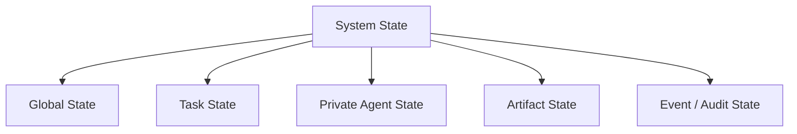

### 13.13.1 Global State

所有相关 Agent 可以读取：

- 用户原始目标；
- 全局约束；
- 总体进度；
- 预算；
- 最终输出引用。

### 13.13.2 Task State

某个子任务需要：

- 状态；
- 输入；
- 依赖；
- Owner；
- Deadline；
- Result；
- Error。

### 13.13.3 Private Agent State

只供单个 Agent 使用：

- 局部 Working Memory；
- 临时候选；
- 未验证笔记；
- 局部工具状态。

私有状态不应默认暴露给其他 Agent。

### 13.13.4 Artifact State

保存大体积、可版本化的产出引用。

### 13.13.5 Audit State

保存不可随意修改的消息、路由和操作记录。

## 13.14 状态写入不能简单概括为“只追加”

Append-only 适合：

- Event Log；
- 审计记录；
- 消息历史；
- 不可变 Artifact 版本。

但以下状态需要更新：

- 当前 Owner；
- 任务状态；
- 剩余预算；
- 当前计划版本；
- Lease；
- 最新有效结果。

更准确的策略是：

| 数据 | 推荐更新方式 |
|---|---|
| Event / Audit | Append-only |
| Current Status | 受版本控制地覆盖 |
| Messages | Reducer 追加、替换或删除 |
| Set / Tags | Union Reducer |
| Counter | Atomic Increment |
| Artifact | 新版本 + 不可变引用 |
| Task Owner | Compare-and-Swap / Lease |

## 13.15 LangGraph State 的准确理解

LangGraph 以 Graph、Node、Edge 和 State 构建工作流：

- Node 接收当前 State；
- Node 返回部分 State Update；
- 每个 State Channel 使用 Reducer 合并更新；
- Edge 决定下一个 Node；
- Checkpointer 可以持久化状态。

LangGraph 并不是所有字段都“只追加”：

- 没有自定义 Reducer 时，默认更新通常覆盖旧值；
- 列表可以使用 Append Reducer；
- 可以定义自定义 Reducer；
- 某些场景可以显式 Overwrite。

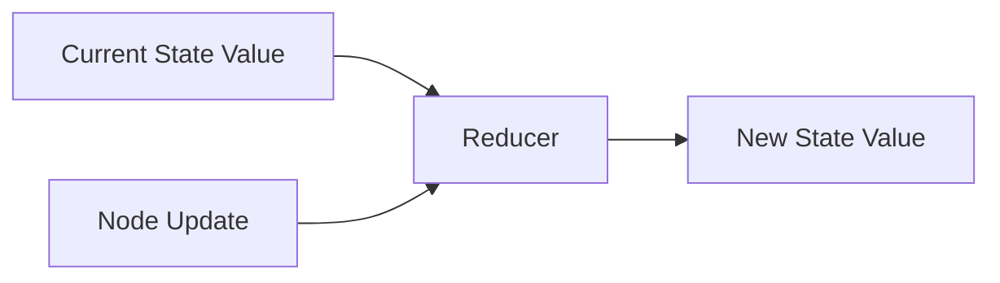

因此，必须为每个字段明确设计合并语义。

## 13.16 并发写入

多个 Agent 并行更新同一状态时，需要处理：

- Lost Update；
- Dirty Read；
- Write Conflict；
- Ordering；
- Duplicate Delivery。

### 13.16.1 字段所有权

给每个字段明确唯一写入者：

```text
research_result  -> Research Agent
code_artifact    -> Coding Agent
review_status    -> Review Agent
global_status    -> Orchestrator
```

这是最简单的冲突预防方式。

### 13.16.2 Optimistic Concurrency

写入时携带版本：

```json
{
  "task_id": "task-42",
  "expected_version": 7,
  "update": {
    "status": "completed"
  }
}
```

版本不匹配则拒绝，并要求重新读取状态。

### 13.16.3 Reducer

对于可合并数据，定义确定性 Reducer：

- List Append；
- Set Union；
- Max Timestamp；
- Highest-confidence Value；
- Domain-specific Merge。

### 13.16.4 Lease

一个 Agent 在有限时间内拥有 Task：

```json
{
  "owner": "agent-a",
  "lease_expires_at": "2026-08-28T09:05:00Z"
}
```

Agent 失联后 Lease 过期，任务可以重新分配。

## 13.17 错误必须成为一等状态

错误不能只写进日志或被静默吞掉。

```json
{
  "task_id": "research-a",
  "status": "blocked",
  "error": {
    "code": "RATE_LIMITED",
    "message": "Search API rate limit exceeded",
    "retryable": true,
    "retry_after_seconds": 30,
    "source": "search-tool"
  }
}
```

Orchestrator 可以据此：

- 延迟重试；
- 切换 Tool；
- 切换 Agent；
- 跳过可选任务；
- 重规划；
- 终止；
- 请求人工处理。

## 13.18 Routing 是什么

Routing 决定：

> **当前状态下，应该由哪个 Agent 或节点处理下一步。**

Routing 不一定意味着控制权永久转移，也可能只是委派一个子任务。

常见策略：

1. Static Rule；
2. State-machine / Graph Edge；
3. Capability-based；
4. Score-based；
5. LLM-based；
6. Learned Router；
7. Hybrid。

## 13.19 Static Routing

使用规则、状态机或固定 Edge：

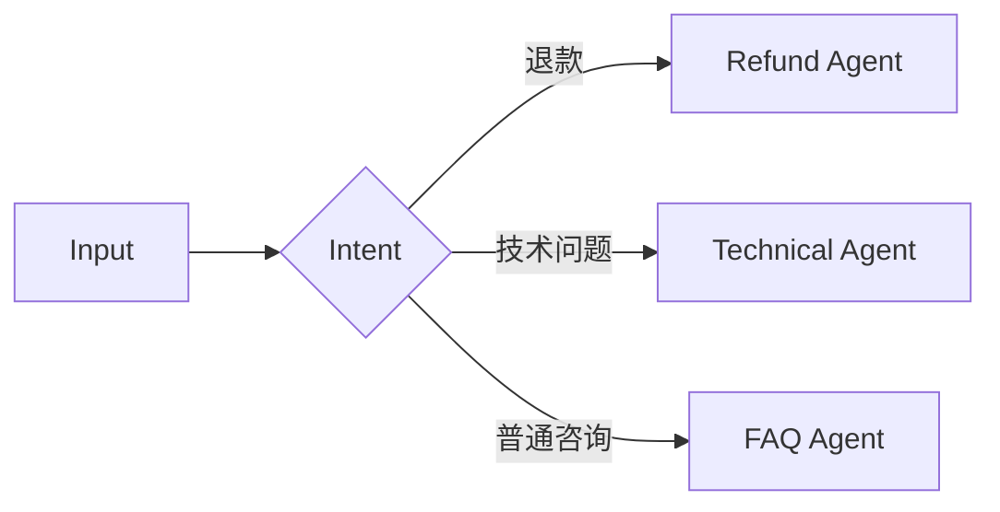

优势：

- 可预测；
- 延迟低；
- 易测试；
- 适合安全和合规；
- 不需要额外模型调用。

限制：

- 只能处理已定义路径；
- 规则增加后难以维护；
- 模糊输入容易落入错误分支。

## 13.20 Capability-based Routing

Router 根据 Agent Capability 选择目标。

Capability Registry 可以记录：

```json
{
  "agent_id": "research-agent",
  "capabilities": [
    "web_search",
    "source_validation",
    "competitor_research"
  ],
  "input_schema": "research-task",
  "output_schema": "research-artifact",
  "permissions": [
    "public-web-read"
  ],
  "status": "available"
}
```

选择时还需考虑：

- 当前可用性；
- 权限；
- 成本；
- 延迟；
- 历史成功率；
- 数据位置；
- 风险。

## 13.21 Score-based Routing

可以为每个候选 Agent 计算分数：

$$
Score(a)=\alpha C_a+\beta Q_a+\gamma A_a-\delta L_a-\epsilon K_a-\zeta R_a
$$

其中：

- `Cₐ`：Capability Match；
- `Qₐ`：历史质量；
- `Aₐ`：Availability；
- `Lₐ`：Latency；
- `Kₐ`：Cost；
- `Rₐ`：Risk。

评分可以由规则、统计模型或 LLM 辅助生成。

## 13.22 LLM-based Dynamic Routing

LLM 根据：

- 当前目标；
- 已完成工作；
- 当前状态；
- 候选 Agent；
- 能力描述；
- 权限和预算；

返回目标 Agent。

```json
{
  "target_agent": "review-agent",
  "reason": "代码已经生成，但尚未通过独立审查",
  "handoff_type": "delegation",
  "confidence": 0.91,
  "payload": {
    "artifact_uri": "artifact://patch.diff"
  }
}
```

### 13.22.1 优势

- 能处理模糊意图；
- 可以综合多个信号；
- 能覆盖部分未显式编码的组合情况。

### 13.22.2 局限

- 可能路由错误；
- 输出具有概率性；
- 增加 Token 和延迟；
- 可能选择越权 Agent；
- 候选过多时判断质量下降。

### 13.22.3 不一定额外增加一次模型调用

如果 Orchestrator 当前模型调用本来就需要决定下一动作，可以让它同时返回 Route。

只有把路由做成独立 LLM 节点时，才一定新增调用。

## 13.23 Dynamic Routing 必须受约束

动态不等于允许模型选择任意 Agent。

Runtime 应：

- 只暴露允许的候选；
- 检查输入输出 Schema；
- 校验权限；
- 检查目标 Agent 可用性；
- 设置最大切换次数；
- 提供安全 Fallback；
- 记录路由原因和 Trace。

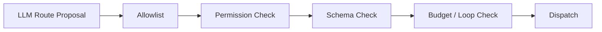

## 13.24 Hybrid Routing

Hybrid Routing 将确定性控制与模型判断组合：

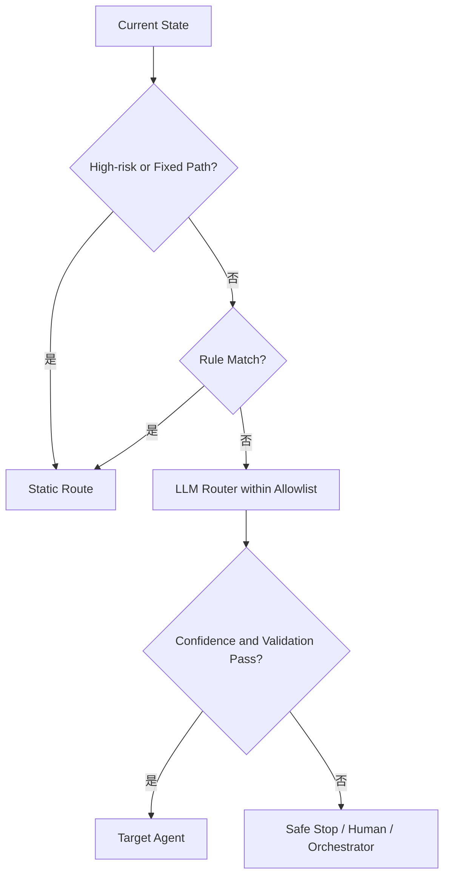

需要修正一个常见说法：

> 不是“静态负责保底，动态负责兜底所有异常”。

高风险异常的最终兜底应该是：

- 安全停止；
- 人工处理；
- 确定性 Fallback；

而不是无条件交给 LLM。

## 13.25 Delegation 与 Handoff

这两个概念都能让另一个 Agent 工作，但控制权不同。

### 13.25.1 Delegation

当前 Agent 保留控制权，将一个子任务交给 Worker：

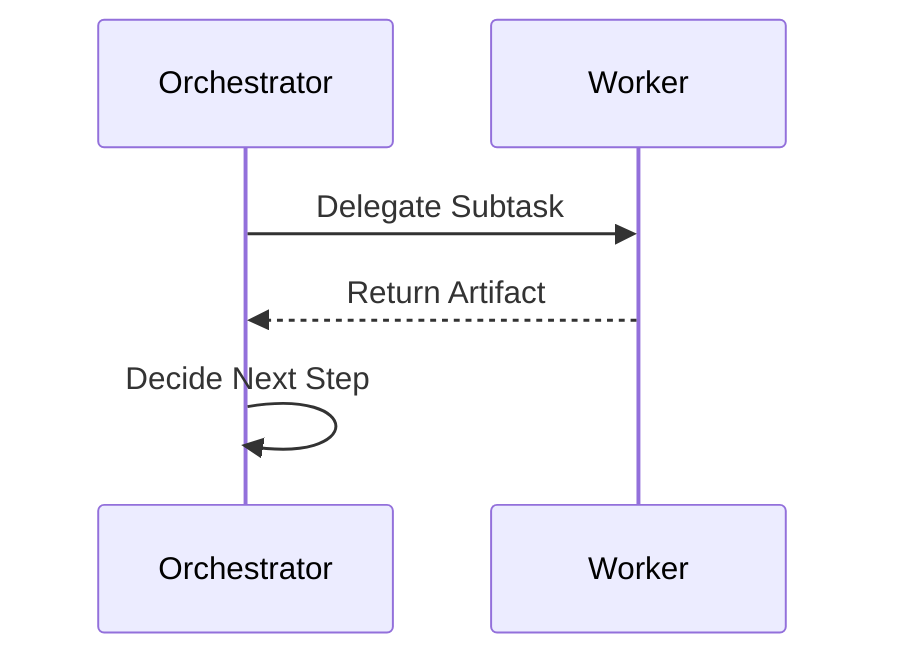

适合：

- Orchestrator 需要保持全局视角；
- 子任务边界明确；
- 多个 Worker 并行；
- 结果需要统一合并。

### 13.25.2 Handoff

当前 Agent 将后续对话或任务控制权转给另一个 Agent：

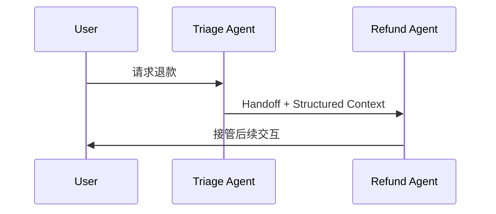

适合：

- 接收 Agent 应直接面向用户；
- 专业 Agent 需要持续控制后续回合；
- 任务边界稳定；
- 不需要原 Agent 汇总结果。

### 13.25.3 对比

| Delegation | Handoff |
|---|---|
| 调用方保留控制权 | 控制权转移 |
| Worker 返回结果给调用方 | 接收 Agent 继续处理 |
| 适合子任务 | 适合职责切换 |
| 常用于 Orchestrator-Workers | 常用于客服分流 |

## 13.26 OpenAI Swarm 与 Agents SDK

Swarm 是 OpenAI 早期用于展示 Handoff 的教育性、实验性框架。

当前应以 OpenAI Agents SDK 作为工程参考。Agents SDK 是 Swarm 的 production-ready upgrade，并支持：

- Agents；
- Agents as Tools；
- Handoffs；
- Guardrails；
- Sessions；
- Human-in-the-loop；
- Tracing。

在 Agents SDK 中，Handoff 通常作为一种 Tool 暴露给模型，例如：

```text
transfer_to_refund_agent
```

模型选择该 Tool 后，Runtime 将控制权转给对应 Agent。

## 13.27 Handoff Contract

一个可靠 Handoff 不应只传一句“交给你了”。

```json
{
  "handoff_id": "handoff-42",
  "from_agent": "triage-agent",
  "to_agent": "refund-agent",
  "task_id": "task-100",
  "reason": "用户报告重复扣款",
  "goal": "确认订单并处理退款",
  "context_summary": "用户已完成身份验证",
  "artifacts": [
    "artifact://order-details.json"
  ],
  "constraints": [
    "退款前必须再次确认金额"
  ],
  "deadline": "2026-08-28T10:00:00Z",
  "return_policy": "do_not_return"
}
```

至少包含：

- 来源和目标 Agent；
- Goal；
- Reason；
- 已完成内容；
- 未完成内容；
- 必需 Artifact；
- 约束；
- 权限；
- Deadline；
- 返回或终止策略。

## 13.28 Handoff Context Filtering

接收 Agent 不应默认看到全部历史。

可以传递：

- 结构化摘要；
- 当前目标；
- 已验证事实；
- 必要 Artifact；
- 用户明确约束；
- 相关最近消息。

不应默认传递：

- 其他 Agent 的私有 Scratchpad；
- 无关 Tool Result；
- 敏感凭据；
- 未验证推测；
- 完整隐藏推理。

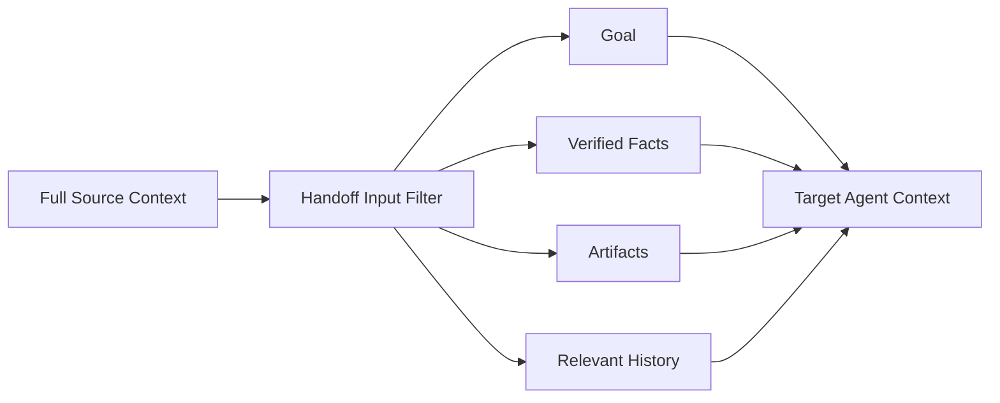

## 13.29 Handoff 循环

简单记录“访问过哪个 Agent”可以发现部分循环，但也可能误伤合法返回。

更稳健的检测信号：

- 总 Handoff 次数；
- 同一 Agent 访问次数；
- 相同 Task State Hash 重复出现；
- 相同 Agent Pair 反复切换；
- 多轮没有新 Artifact；
- Goal Progress 没有变化。

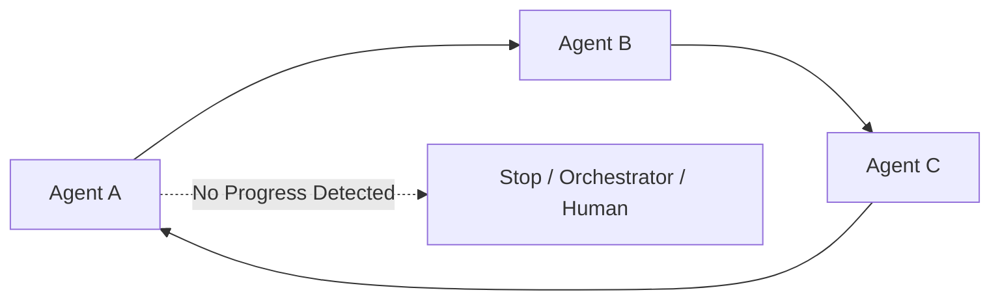

允许合理的回访，但要求：

- 状态已经变化；
- 有新的 Artifact；
- 有明确返回原因；
- 不超过预算。

## 13.30 Routing Fallback

Router 无法可靠选择时，应返回：

```json
{
  "route_status": "UNRESOLVED",
  "reason": "两个 Agent 的能力都不足以处理法律判断",
  "recommended_action": "human_review"
}
```

不要：

- 随机选择 Agent；
- 静默落到权限最高的 Agent；
- 无限重试 Router；
- 把未知任务交给万能 Agent。

## 13.31 Agent Discovery

动态系统需要 Capability Registry：

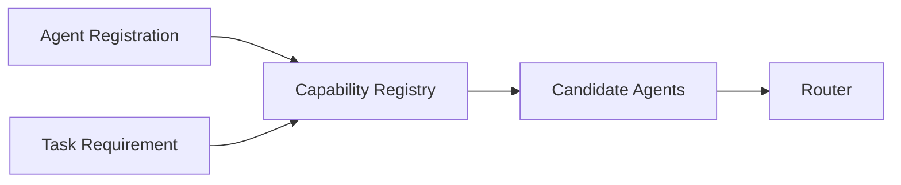

Registry 应记录：

- Agent ID；
- Skills；
- Input / Output Schema；
- Endpoint；
- Authentication；
- Availability；
- Cost；
- Latency；
- Version；
- Trust Level。

A2A Agent Card 可以承担跨系统能力描述，但系统内部仍可能需要运行时 Registry。

## 13.32 A2A 的作用

A2A 为独立 Agent 系统提供：

- Agent Card；
- Task；
- Message；
- Artifact；
- Streaming；
- Push Notification；
- Task Lifecycle；
- 多种协议绑定。

它允许 Agent 在不了解彼此内部 Memory、Tools 和实现细节的情况下协作。

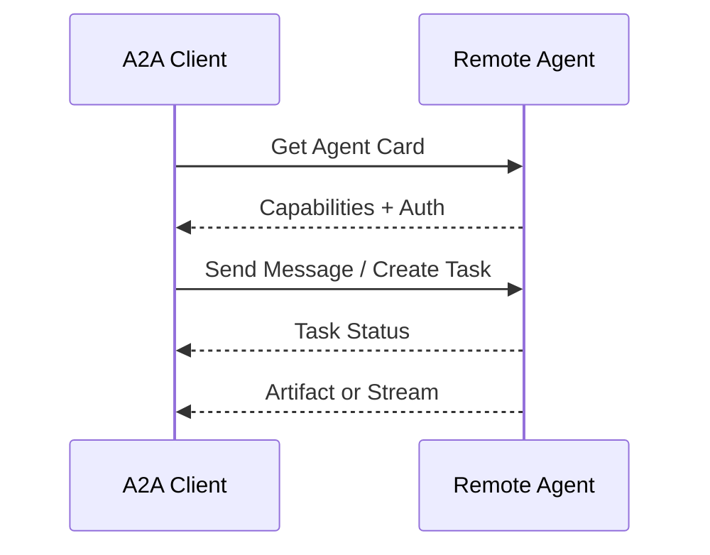

A2A 解决互操作协议，不替代：

- Orchestrator；
- Task Decomposition；
- Router；
- 权限策略；
- 费用结算；
- 结果验证。

A2A 的 binding、Agent Card 与 Task 状态机详见 [Tools：A2A 协议](../../tools/04-agent-communication/11-a2a-protocol.md)；跨组织身份、回调 SSRF、token audience 和 Card 信任边界详见 [Tool Protocol 安全](../../tools/02-mcp/15-tool-protocol-security.md)。

## 13.33 Agent 协作消息 Schema

推荐消息字段：

```json
{
  "message_id": "msg-900",
  "schema_version": "1.0",
  "task_id": "task-42",
  "correlation_id": "run-101",
  "causation_id": "msg-899",
  "sender": "orchestrator",
  "recipient": "research-agent",
  "message_type": "task.request",
  "idempotency_key": "task-42-research-v1",
  "deadline": "2026-08-28T09:10:00Z",
  "trace_id": "trace-77",
  "payload": {
    "goal": "调研竞品 A",
    "artifact_schema": "competitor-research"
  }
}
```

字段作用：

- `message_id`：唯一消息；
- `task_id`：归属任务；
- `correlation_id`：关联一次完整运行；
- `causation_id`：追踪因果链；
- `idempotency_key`：防重复副作用；
- `deadline`：防止过期任务继续执行；
- `trace_id`：可观测性。

## 13.34 取消传播

用户取消全局任务时，需要取消：

- 正在执行的 Worker；
- 队列中的 Task；
- 外部 Tool；
- 后续依赖；
- 尚未完成的 Handoff。

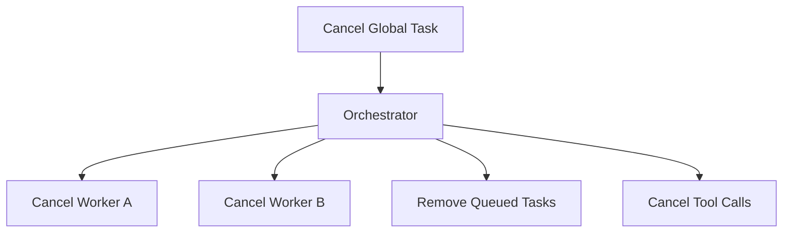

Agent 和 Tool 必须支持 Cancellation Token 或任务状态检查。

## 13.35 超时与重试

### 13.35.1 Timeout

区分：

- 单次 Tool Timeout；
- Agent Step Timeout；
- Task Timeout；
- 全局 Run Timeout。

### 13.35.2 Retry

只对可重试错误执行，并采用：

- Exponential Backoff；
- Jitter；
- 最大次数；
- 幂等键。

### 13.35.3 Fallback

可以：

- 切换 Agent；
- 切换 Tool；
- 降级模型；
- 返回部分结果；
- 请求人工处理。

## 13.36 可观测性

Multi-Agent 必须记录：

- 谁创建了 Task；
- 谁路由给谁；
- 为什么选择该 Agent；
- 传递了哪些 Context 和 Artifact；
- 每个 Agent 做了什么；
- 哪个步骤失败；
- Token、费用和延迟；
- Handoff 次数；
- 最终结果来源。

```mermaid
flowchart LR
    O[Orchestrator] -.Trace.-> OBS[Observability]
    A1[Agent A] -.Trace.-> OBS
    A2[Agent B] -.Trace.-> OBS
    Q[Queue / State] -.Metrics.-> OBS
    T[Tools] -.Logs.-> OBS
```

建议统一：

- Trace ID；
- Span；
- Task ID；
- Agent ID；
- Artifact ID；
- Route Decision；
- Error Code。

## 13.37 安全

动态切换会扩大权限边界。

必须检查：

- 来源 Agent 是否有权委派；
- 目标 Agent 是否有权处理数据；
- Handoff Payload 是否包含敏感信息；
- 目标 Agent 是否被允许调用高风险 Tool；
- 外部 Agent 身份是否可信；
- 消息是否被篡改或重放。

### 13.37.1 Confused Deputy

低权限 Agent 可能诱导高权限 Agent 代替它执行敏感操作。

防护：

- 每次 Tool Call 重新授权；
- 不继承来源 Agent 的隐含权限；
- 记录原始用户身份和意图；
- 高风险操作重新确认；
- Handoff 不自动升级权限。

## 13.38 客服系统示例

```mermaid
flowchart TB
    U[User Request] --> T[Triage Workflow]
    T --> R{Static Rules}

    R -->|订单查询| O[Order Agent]
    R -->|退款| F[Refund Agent]
    R -->|技术问题| X[Technical Agent]
    R -->|无法识别| L[LLM Router]

    L --> C{Validated Route}
    C -->|通过| TARGET[Allowed Agent]
    C -->|低置信度| H[Human Support]

    F --> APPROVE{Refund Approval}
    APPROVE -->|批准| TOOL[Refund Tool]
    APPROVE -->|拒绝| H
```

设计要点：

- 常见意图使用静态路由；
- 模糊意图在 Allowlist 内动态路由；
- 退款 Handoff 传递订单 Artifact；
- Refund Agent 不继承无限权限；
- 执行退款前需要审批；
- 未识别请求安全转人工。

## 13.39 代码协作示例

```mermaid
flowchart TB
    G[User Goal] --> O[Coding Orchestrator]
    O --> E[Explore Agent]
    E --> A[Architecture Artifact]
    A --> O
    O --> C[Coding Agent]
    C --> D[Patch Artifact]
    D --> R[Review Agent]
    R --> V{Pass?}
    V -->|否| C
    V -->|是| O
    O --> G
```

推荐：

- Explore Agent 只读；
- Coding Agent 可修改工作区；
- Review Agent 只读 Diff；
- Orchestrator 保留最终控制；
- Patch 和报告使用 Artifact；
- Review Finding 使用结构化 Schema；
- 最大修订次数由 Runtime 控制。

## 13.40 选型表

| 场景 | 推荐机制 |
|---|---|
| 固定顺序处理 | Pipeline |
| 复杂任务统一调度 | Orchestrator |
| 多 Worker 并发 | Queue + Task Ledger |
| 多消费者响应事件 | Pub/Sub |
| 多 Agent 复用结果 | Shared Workspace + Artifact |
| 跨组织 Agent 互操作 | A2A |
| 专业 Agent 接管用户会话 | Handoff |
| Worker 完成子任务后返回 | Delegation |
| 高风险或稳定主流程 | Static Routing |
| 模糊、开放式低风险分流 | Constrained LLM Routing |
| 大量 Agent | Hierarchical Orchestrator |

## 13.41 推荐生产架构

```mermaid
flowchart TB
    INPUT[User / Event] --> WF[Deterministic Workflow]
    WF --> ROUTER[Hybrid Router]

    ROUTER --> REG[Capability Registry]
    REG --> POLICY[Permission + Risk Policy]
    POLICY --> LEDGER[Task Ledger]

    LEDGER --> QUEUE[Task Queue]
    QUEUE --> A1[Agent A]
    QUEUE --> A2[Agent B]
    QUEUE --> AN[Agent N]

    A1 --> ART[Artifact Store]
    A2 --> ART
    AN --> ART

    A1 --> EVENTS[Event Stream]
    A2 --> EVENTS
    AN --> EVENTS

    EVENTS --> STATE[Materialized State]
    STATE --> ROUTER
    ART --> VERIFY[Verifier]
    VERIFY --> JOIN[Result Aggregator]
    JOIN --> WF

    ROUTER -->|Handoff| SPECIAL[Specialist Agent]
    ROUTER -->|Low Confidence| HUMAN[Human Review]

    WF -.Trace.-> OBS[Observability]
    ROUTER -.Route Decisions.-> OBS
    A1 -.Spans.-> OBS
    A2 -.Spans.-> OBS
    AN -.Spans.-> OBS
```

核心原则：

1. 确定性 Workflow 控制高层边界；
2. Hybrid Router 在 Allowlist 内选择 Agent；
3. Task Ledger 是任务状态真相源；
4. Queue 负责异步分发；
5. Artifact Store 传递大结果；
6. Event Stream 保留审计和状态变化；
7. Verifier 检查输出；
8. Handoff 只用于真正需要转移控制权的场景；
9. 低置信度和高风险请求安全停止或转人工。

## 13.42 设计检查表

### 13.42.1 协作拓扑

- 为什么选择 Pipeline、Orchestrator、Blackboard 或 P2P？
- 是否存在不必要的 Agent？
- 谁拥有全局目标和最终决策权？

### 13.42.2 通信

- 使用 Request/Response、Queue、Pub/Sub 还是 Event Stream？
- 消息是否有 Schema 和版本？
- 是否支持幂等、重试和取消？
- 大结果是否使用 Artifact？

### 13.42.3 状态

- Global、Task、Private State 是否分开？
- 每个字段由谁写？
- Reducer 是覆盖、追加还是自定义合并？
- 并发冲突如何检测？

### 13.42.4 Routing

- 静态规则能覆盖哪些路径？
- LLM Router 的候选是否受 Allowlist 限制？
- 权限、成本和可用性是否参与选择？
- 低置信度如何安全退出？

### 13.42.5 Handoff

- 是否真的需要转移控制权，还是 Delegation 足够？
- Handoff Contract 是否完整？
- 是否过滤无关或敏感 Context？
- 如何检测循环和无进展？

### 13.42.6 Reliability

- Agent 超时后谁接管？
- Task Lease 如何过期？
- Error 是否进入状态？
- 是否支持局部重试和重新规划？

### 13.42.7 Security

- Handoff 是否导致权限升级？
- 外部 Agent 是否经过认证？
- Shared State 是否存在跨租户泄露？
- 高风险操作是否重新授权？

### 13.42.8 Observability

- 是否有统一 Trace ID？
- 能否还原每次 Route 和 Handoff？
- 能否统计 Agent 成功率、成本和延迟？
- 能否定位循环、重复工作和消息丢失？

## 13.43 常见反模式

### 13.43.1 所有 Agent 共享完整对话

造成 Context 污染、隐私扩大和 Token 浪费。

### 13.43.2 所有 State 字段都追加

当前状态、Owner 和预算无法正确更新。

### 13.43.3 所有 State 字段都覆盖

并发结果和历史事件会丢失。

### 13.43.4 Message Passing 等同 Pub/Sub

忽略了 Request/Response、Queue 和 Event Stream 的不同语义。

### 13.43.5 LLM Router 可以选择任意 Agent

容易越权、误路由和形成循环。

### 13.43.6 动态路由作为所有异常的最终兜底

高风险未知情况应安全停止或转人工。

### 13.43.7 Handoff 与 Delegation 混为一谈

导致控制权不清和结果无人汇总。

### 13.43.8 只记录经过的 Agent 名称防循环

无法区分合法回访与无进展循环。

### 13.43.9 错误只写日志

Router 和 Orchestrator 无法根据失败状态决策。

### 13.43.10 大结果通过消息反复复制

造成传输和 Context 成本，应改用 Artifact。

## 13.44 本章总结

Multi-Agent 协作要把通信、状态、路由、控制权转移、可靠性、安全和可观测性一起设计清楚，少掉任何一项，系统一放大就容易出问题。

单团队生产环境里，更常见的组合是：

> **Workflow 控制高层边界，Orchestrator 管理任务，Hybrid Router 选择 Worker，消息触发执行，State 记录事实，Artifact 传递结果，Verifier 检查质量。**

Handoff 适合让专业 Agent 直接接住后续交互；Delegation 更像把一段子任务外包出去，结果再交回原调用方。动态路由也别放得太开，候选集、权限、预算和退出条件都要先收紧；真正拿不准或已经碰到高风险时，直接安全停止或转人工更稳妥。

## 参考资料

- [LangGraph Graph API](https://docs.langchain.com/oss/python/langgraph/graph-api)
- [OpenAI Agents SDK](https://openai.github.io/openai-agents-python/)
- [OpenAI Agents SDK: Handoffs](https://openai.github.io/openai-agents-python/handoffs/)
- [A2A Protocol Specification](https://a2a-protocol.org/latest/specification/)
- [Anthropic: Building Effective Agents](https://www.anthropic.com/engineering/building-effective-agents)
