# Chapter 13: Multi-Agent Coordination, Routing, and Dynamic Switching

Once a task is assigned to multiple agents, the hardest question is often not whether each can do its part, but how their results fit together and who decides what happens when something goes wrong. This chapter starts with coordination topologies, then works through messages, shared state, routing, and control transfer.

Unless a framework or protocol is explicitly identified, the JSON blocks illustrate application-level contracts; their field names, quantities, and dates are not standards requirements. Any discussion of coordination needs to distinguish what the model proposes, what the runtime enforces, and what the storage system guarantees.

## 13.1 The Core Problem

Dividing work among agents answers only:

> **Who is good at what?**

A complete coordination system must also answer:

1. How are tasks described and assigned?
2. How do agents pass results to one another?
3. Who maintains state?
4. Who decides the next step?
5. Does control need to transfer?
6. How are failures, timeouts, and loops handled?
7. How is the entire execution chain traced?

These questions fall into four layers:

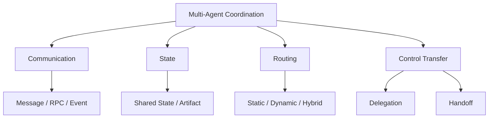

## 13.2 Coordination Topologies

Common topologies fall into four categories:

1. Pipeline;
2. Centralized orchestrator;
3. Shared workspace / blackboard;
4. Peer-to-peer / negotiation.

Real systems often combine them.

## 13.3 Pipeline

Agents execute in a predefined sequence:

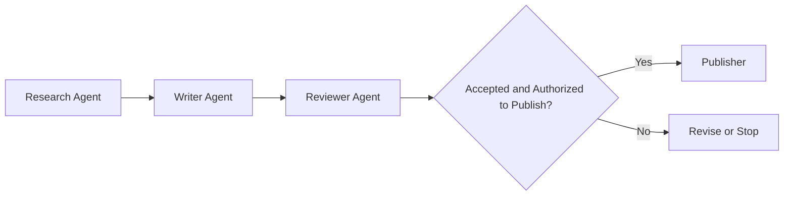

### 13.3.1 When to Use It

- The order of stages is stable.
- Interfaces between stages are well defined.
- Each stage needs a different specialist context.
- A clear audit trail is required.

### 13.3.2 Advantages

- Simple control flow;
- Easy testing;
- Clear state and responsibility;
- Costs and latency that are easy to estimate.

### 13.3.3 Risks

- Upstream errors propagate.
- An intermediate agent becomes a bottleneck.
- Earlier agents may not know what downstream stages actually need.
- A fixed process struggles with exceptions.

Each stage should produce a structured artifact and have a validation gate.

## 13.4 Centralized Orchestrator

The orchestrator is responsible for:

- Understanding the overall goal;
- Decomposing tasks;
- Selecting workers;
- Managing dependencies;
- Tracking state;
- Collecting and validating results;
- Retrying or replanning.

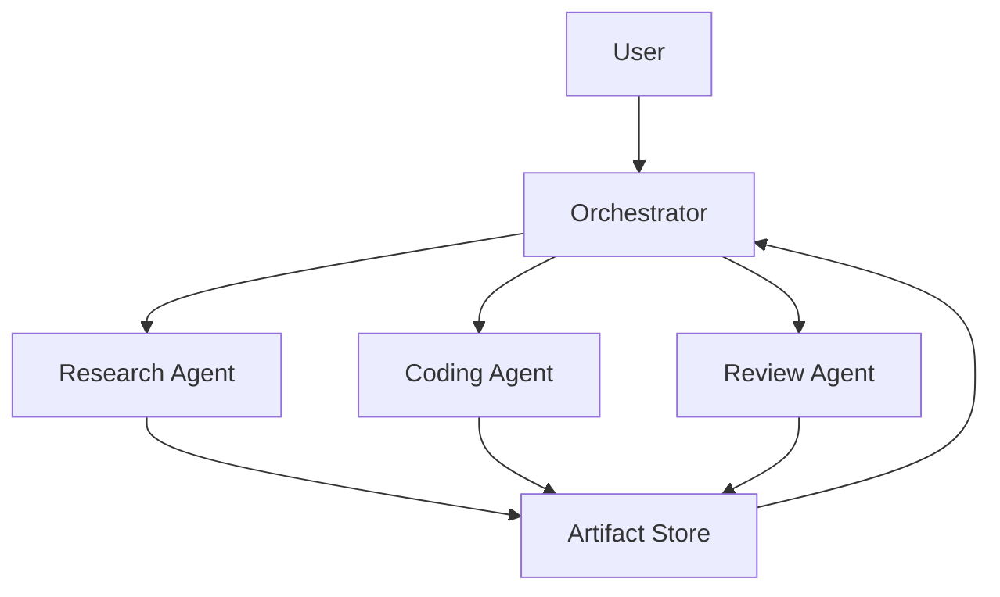

For a production system owned by a single team, centralized coordination is usually a reasonable default because:

- The overall goal is managed in one place.
- Routing is traceable.
- Permissions are easier to control consistently.
- Failure paths are easier to locate.
- Budgets and concurrency can be managed centrally.

However, the orchestrator can also become:

- A single point of failure;
- A scheduling bottleneck;
- A concentration point for large contexts;
- A source of system-wide errors.

Hierarchical orchestrators are an option when top-level context or scheduling becomes a bottleneck. Each extra layer, however, adds another handoff and another round of information compression; system size alone should not decide the choice. A logically single scheduling authority can be implemented as a recoverable service. It need not depend on one unrecoverable model session.

## 13.5 Shared Workspace / Blackboard

Multiple agents exchange tasks, facts, and artifacts through a shared workspace.

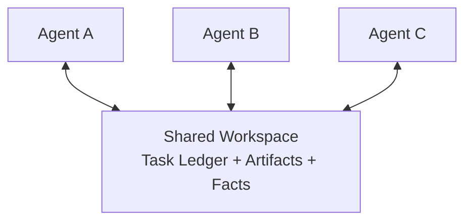

Advantages:

- Agents do not need to pass entire conversations to one another.
- Multiple agents can reuse the same results.
- Asynchronous coordination is supported.
- New agents can join after reading the current state.

Risks:

- Concurrent write conflicts;
- Stale state;
- Unverified information contaminating shared knowledge;
- Unclear responsibility;
- Overly broad permissions.

A shared workspace needs schemas, versions, ownership, and write rules.

## 13.6 Peer-to-Peer / Negotiation

Agents communicate, negotiate, or delegate directly:

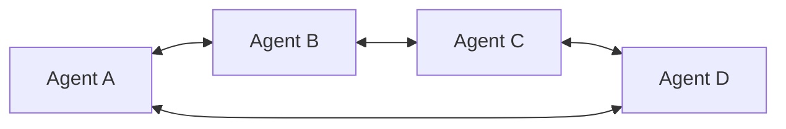

Suitable for:

- Agents spanning organizations;
- Open ecosystems;
- Simulations and games;
- Systems without a single central controller;
- Cases where local autonomy matters more than global consistency.

This topology is not inherently unsuitable for production, but it must address:

- Agent discovery;
- Identity and trust;
- Task ownership;
- Duplicate task claims;
- Failure detection;
- Idempotent message handling;
- Conflicts;
- Determining global completion;
- Costs and permissions.

For an application owned by one team, these distributed coordination costs often exceed those of a centralized design.

## 13.7 Communication Has More Than Two Forms

Message passing and shared state are two important approaches, but message passing itself includes several patterns:

| Approach | Characteristics | Suitable uses |
|---|---|---|
| Request / Response | The caller waits for a result | Short tasks, strong dependencies |
| Queue | Workers claim tasks from a queue | Asynchronous tasks, smoothing traffic spikes |
| Pub/Sub | The publisher does not name individual subscribers | Event broadcasting, decoupling |
| Event Stream | Ordered events are retained within an agreed partition or key scope | State reconstruction, auditing |
| Shared State | Multiple nodes read and write state | Graph workflows, close coordination |
| Artifact Store | Large results are exchanged through URIs | Documents, code, datasets |

Production systems often combine:

> **Messages trigger execution; state stores task status and candidate facts with provenance; artifacts carry large results.**

## 13.8 Request / Response

The caller knows the target service and correlates requests with responses. Waiting can use synchronous blocking or asynchronous I/O. Request/response does not necessarily mean blocking a thread.

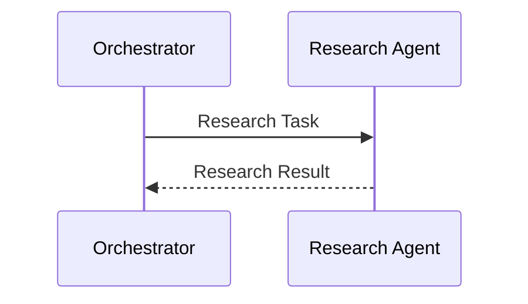

Advantages:

- Simple implementation;
- Errors can be returned directly;
- Well suited to short tasks.

Limitations:

- Downstream dependencies still have to wait if they need the return value.
- Long tasks are prone to timeouts.
- Components are tightly coupled.
- Recovery after disconnection requires durable task IDs, a query interface, and retry semantics. A single RPC is not enough.

## 13.9 Queue

A producer puts tasks into a queue, and workers compete to consume them.

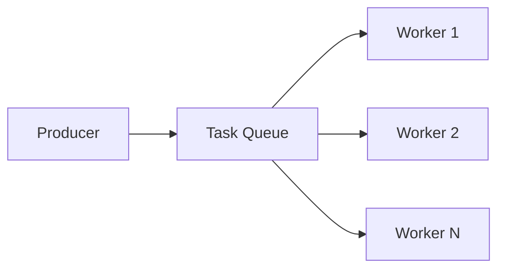

Suitable for:

- Background tasks;
- Worker pools;
- Elastic scaling;
- Retries;
- Smoothing traffic spikes.

Consider:

- At-least-once delivery;
- Idempotency;
- Visibility timeouts;
- Dead-letter queues;
- Retry backoff;
- Task leases.

It is difficult to rely on an absolute promise of exactly-once execution in distributed systems. At-least-once delivery combined with idempotent execution is more common.

For example, [SQS Standard queues](https://docs.aws.amazon.com/AWSSimpleQueueService/latest/SQSDeveloperGuide/standard-queues-at-least-once-delivery.html) explicitly allow duplicate delivery. Acknowledgments, message deduplication, and external side effects belong to different layers: if a worker successfully issues a refund and crashes before acknowledging the message, redelivery may issue the refund again. Use a stable business-operation ID with a refund API that supports idempotency, record the receipt, and query the outcome before retrying after a timeout. Even a queue that provides exactly-once processing within its own boundary does not automatically extend that guarantee to external side effects.

## 13.10 Pub/Sub

A publisher sends events to a topic without needing to know the individual subscribers:

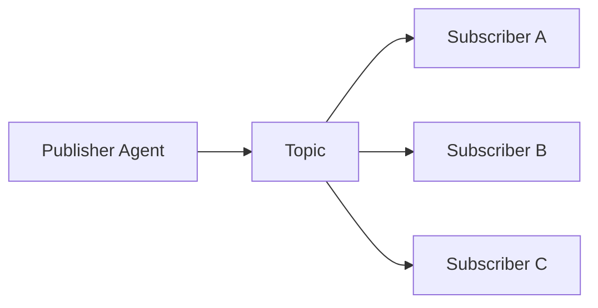

“The sender does not need to know who is waiting for the result” accurately describes pub/sub, not all message passing.

Suitable for:

- Multiple agents handling the same event in different ways;
- Auditing, notifications, and monitoring;
- Loosely coupled extensions.

Risks:

- Consumption order;
- Duplicate events;
- Schema evolution;
- Difficulty determining whether all downstream consumers have finished.

## 13.11 Event Stream

An event stream retains events within a defined ordering scope. Multiple partitions do not automatically produce a global total order, and producer timestamps do not establish commit order:

```json
{
  "event_id": "evt-1004",
  "event_type": "agent.task.completed",
  "task_id": "task-42",
  "agent_id": "research-agent",
  "sequence": 17,
  "artifact_uri": "artifact://research-result.json",
  "timestamp": "2026-08-28T09:00:00Z"
}
```

Advantages:

- Auditable;
- Replayable;
- State can be reconstructed from events;
- Multiple consumers can process events independently.

Requirements:

- Event schemas;
- Ordering keys;
- Idempotent consumption;
- Retention policies;
- Version compatibility.

State reconstruction should fold recorded events into state, not resend emails, repeat payments, or call the model again. Consumers should save their processing positions and place state updates and deduplication records within the same transaction boundary. Snapshots or archives must cover events outside the retention window. Missing events or external reads that cannot be replayed undermine the claim of replayability.

## 13.12 Artifact Store

Agents should not send large bodies of content in full through messages.

Prefer messages containing only:

- A summary;
- A schema;
- A URI;
- A hash;
- Provenance;
- Permissions.

```json
{
  "artifact_id": "report-draft-2",
  "uri": "artifact://report-draft-2.md",
  "schema": "research-report",
  "content_hash": "sha256:...",
  "summary": "包含三家竞品的产品、定价与风险对比"
}
```

The example's Chinese `summary` means “Contains a comparison of products, pricing, and risks for three competitors.”

The receiving agent reads the artifact as needed, avoiding:

- Oversized message bodies;
- Duplicated context;
- Repeated serialization;
- Inconsistent content versions.

The URI must identify a retrievable, immutable version. A `latest` pointer can cause workers to read different content. A hash only verifies that the bytes have not changed; it does not prove that the source is trustworthy or the conclusion correct. Reads must also check the tenant, authorization, schema, and input version. Receiving a URI does not make instructions inside its content trustworthy.

## 13.13 Layers of Shared State

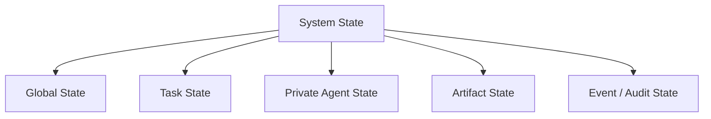

### 13.13.1 Global State

Expose global state according to task relevance and permissions, rather than unconditionally to every agent:

- The user's original goal;
- Global constraints;
- Overall progress;
- Budget;
- References to final outputs.

### 13.13.2 Task State

A subtask needs:

- Status;
- Inputs;
- Dependencies;
- Owner;
- Deadline;
- Result;
- Error.

### 13.13.3 Private Agent State

For use by a single agent:

- Local working memory;
- Temporary candidates;
- Unverified notes;
- Local tool state.

Private state should not be exposed to other agents by default.

### 13.13.4 Artifact State

Stores references to large, versionable outputs.

### 13.13.5 Audit State

Stores message, routing, and operation records that cannot be arbitrarily modified.

## 13.14 State Writes Are Not Simply Append-Only

Append-only storage is suitable for:

- Event logs;
- Audit records;
- Message history;
- Immutable artifact versions.

However, the following state needs updates:

- Current owner;
- Task status;
- Remaining budget;
- Current plan version;
- Lease;
- Latest valid result.

A more precise policy is:

| Data | Recommended update mechanism |
|---|---|
| Event / Audit | Append-only |
| Current Status | Version-checked overwrite |
| Messages | Reducer that appends, replaces, or deletes |
| Set / Tags | Union Reducer |
| Counter | Atomic increment; deduplicate repeated events separately |
| Artifact | New version + immutable reference |
| Task Owner | Compare-and-Swap / Lease |

## 13.15 Understanding LangGraph State Precisely

LangGraph builds workflows from graphs, nodes, edges, and state:

- A node receives the current state.
- A node returns a partial state update.
- Each state channel uses a reducer to combine updates.
- Edges determine the next node.
- A checkpointer can persist state.

Not every LangGraph field is append-only:

- Without a custom reducer, a single update overwrites the old value by default.
- Lists can use an append reducer.
- Custom reducers can be defined.
- Some cases allow an explicit overwrite.

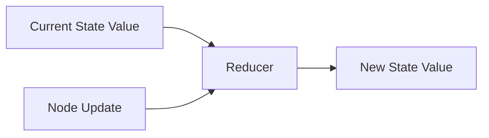

The merge semantics of each field therefore need an explicit design.

When multiple nodes in the same super-step concurrently write to a field with no merge semantics, LangGraph raises [`INVALID_CONCURRENT_GRAPH_UPDATE`](https://docs.langchain.com/oss/python/langgraph/errors/INVALID_CONCURRENT_GRAPH_UPDATE). It does not let the last node to finish overwrite the others. Merging lists with `operator.add` handles concurrent appends but does not automatically deduplicate them. By contrast, `add_messages` supports additions and replacements by message ID, as well as a deletion mechanism; it is not ordinary list concatenation.

A reducer is a state-merge function in the graph runtime, not a cross-process database transaction or a distributed lock. A checkpointer's thread-scoped recovery does not automatically resolve competition for business resources across runs, either. An in-memory checkpointer cannot recover after process exit. “Private state” describes how data is organized, not a guarantee of access control or log redaction. Streaming output, traces, and storage permissions need separate review.

## 13.16 Concurrent Writes

When multiple agents update the same state in parallel, the system must handle:

- Lost updates;
- Dirty reads;
- Write conflicts;
- Ordering;
- Duplicate delivery.

### 13.16.1 Field Ownership

Assign an explicit, single writer to each field:

```text
research_result  -> Research Agent
code_artifact    -> Coding Agent
review_status    -> Review Agent
global_status    -> Orchestrator
```

This is a relatively simple way to prevent conflicts, but the storage layer must enforce ownership. There can still be multiple actual writers if a role has several replicas or an old worker keeps running after a timeout.

### 13.16.2 Optimistic Concurrency

Include a version with each write:

```json
{
  "task_id": "task-42",
  "expected_version": 7,
  "update": {
    "status": "completed"
  }
}
```

At commit time, the storage system must atomically compare the current and expected versions and apply the update. Comparing on the client and sending a separate write is not enough. After a version mismatch, reread the state and reassess the business preconditions; do not simply replace `expected_version` with the new value and retry blindly.

For example, if two workers simultaneously try to move a task from `running` to `completed`, the server must also validate the current `attempt_id`, owner, plan version, lease, and legality of the state transition. A late success message must not mark a canceled or reassigned task as completed.

### 13.16.3 Reducer

For mergeable data, first establish whether events can arrive out of order or be duplicated, then choose a rule:

| Rule | What it addresses | Limitations |
|---|---|---|
| List Append | Retains multiple results | Order affects output; duplicate delivery causes duplicate appends |
| Set Union / Merge by stable ID | Collects and deduplicates results in an order-independent way | Different content under the same ID should raise a conflict, not silently overwrite |
| Last Write Wins | Retains one value using explicit version and tie-breaking rules | Can lose business information; local timestamps are affected by clock skew |
| Domain-specific Merge | For example, retains candidate facts from different sources | Whether the facts are compatible still requires domain validation |

Merging across replicas in arbitrary order often requires associativity and commutativity. Tolerating duplicates also requires idempotency, or deduplication before merging. A deterministic function is not necessarily a CRDT and does not automatically have these properties. Selecting the value with the highest model-reported confidence is unreliable: different models' scores may not be calibrated, and certainly cannot resolve authorization or financial conflicts.

### 13.16.4 Lease

An agent owns a task for a limited time:

```json
{
  "owner": "agent-a",
  "attempt_id": "attempt-3",
  "fencing_token": 19,
  "lease_expires_at": "2026-08-28T09:05:00Z"
}
```

If the agent becomes unreachable and its lease expires, the task can be reassigned.

Lease expiry does not mean the old process has stopped. A paused worker may resume and write again. Each claim should generate a monotonically increasing fencing token, and the storage system or side-effect gateway receiving writes must atomically reject stale tokens. Putting a token in the prompt alone enforces nothing. If an external API does not support fencing, serialize operations through a gateway you control, or use business-level idempotency and reconciliation; do not claim that all late side effects have been eliminated.

A receiver that remembers only the highest token it has seen must first see a newer token before it can reject the old holder. That is not the same as immediately prohibiting writes when a lease expires. If immediate prohibition is required, commits must atomically validate the current lease or owner, as in [transactional protection with etcd Lock](https://etcd.io/docs/v3.6/dev-guide/api_concurrency_reference_v3/). Side effects in other systems remain outside that transaction's guarantee.

### 13.16.5 Which Layers Need Strong Consistency?

| State | Required guarantee |
|---|---|
| Task claims, budget reservations, a unique final commit | Atomic check-and-update in the authoritative ledger; cross-field invariants require transactions |
| Committed artifacts | Immutable versions; check input and plan versions when reading results |
| Search candidates, working notes, progress projections | Some staleness is tolerable, but versions and sources must be recorded |
| Contradictory business conclusions | Retain evidence and let rules or the owner adjudicate; database consistency is not factual correctness |

“Three agents agree that a refund should be issued” is an application-level opinion, not Raft/Paxos consensus. Raft makes replicas agree on log order; it does not determine whether a refund complies with policy. Nor can Raft's crash-fault assumptions simply be applied to defend against untrustworthy agents. Strong consensus, linearizability, and transaction isolation are related but distinct concepts. Design against the actual guarantees of the underlying API.

For example, [etcd's API guarantees](https://etcd.io/docs/v3.6/learning/api_guarantees/) distinguish default linearizability for KV operations from potentially delayed Watch delivery. Receiving a Watch event does not mean reading the globally latest state at that moment. Budget deductions must not rely on a potentially stale progress dashboard. If a majority is unavailable, commits that depend on consensus may stop making progress. Read-only exploration can continue, but irreversible operations must not bypass the ledger.

## 13.17 Errors Must Be First-Class State

Errors must not be confined to logs or silently swallowed.

```json
{
  "task_id": "research-a",
  "status": "blocked",
  "error": {
    "code": "RATE_LIMITED",
    "message": "Search API rate limit exceeded",
    "retryable": true,
    "retry_after_seconds": 30,
    "source": "search-tool"
  }
}
```

The orchestrator can use this information to:

- Retry after a delay;
- Switch tools;
- Switch agents;
- Skip optional tasks;
- Replan;
- Terminate;
- Request human intervention.

## 13.18 What Is Routing?

Routing decides:

> **Which agent or node should handle the next step, given the current state.**

Routing need not mean a permanent transfer of control; it may simply delegate a subtask.

Common strategies:

1. Static rules;
2. State-machine transitions / graph edges;
3. Capability-based routing;
4. Score-based routing;
5. LLM-based routing;
6. Learned routers;
7. Hybrid routing.

## 13.19 Static Routing

Use rules, a state machine, or fixed edges:

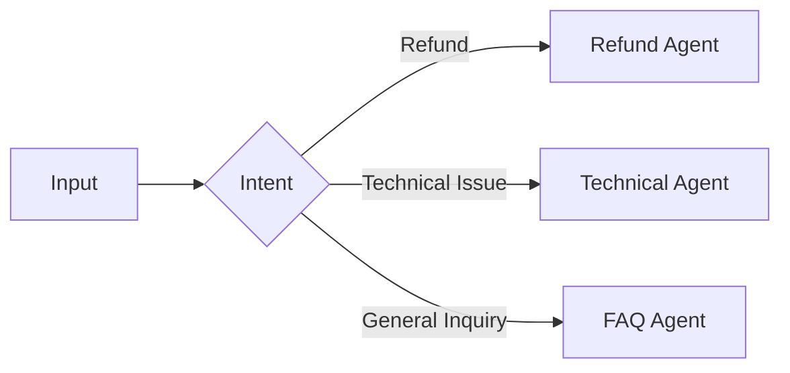

Advantages:

- Predictable;
- Low latency;
- Easy to test;
- Well suited to security and compliance requirements;
- No extra model call required.

Limitations:

- Only predefined paths are handled.
- Rules become harder to maintain as their number grows.
- Ambiguous input can easily take the wrong branch.

## 13.20 Capability-based Routing

The router selects a target based on agent capabilities.

A capability registry can record:

```json
{
  "agent_id": "research-agent",
  "capabilities": [
    "web_search",
    "source_validation",
    "competitor_research"
  ],
  "input_schema": "research-task",
  "output_schema": "research-artifact",
  "permissions": [
    "public-web-read"
  ],
  "status": "available"
}
```

Selection must also consider:

- Current availability;
- Permissions;
- Cost;
- Latency;
- Historical success rate;
- Data location;
- Risk.

## 13.21 Score-based Routing

A score can be calculated for each candidate agent:

$$
Score(a)=\alpha C_a+\beta Q_a+\gamma A_a-\delta L_a-\epsilon K_a-\zeta R_a
$$

Where:

- `Cₐ`: capability match;
- `Qₐ`: historical quality;
- `Aₐ`: availability;
- `Lₐ`: latency;
- `Kₐ`: cost;
- `Rₐ`: risk.

Rules, statistical models, or an LLM can help generate scores.

This is an illustrative candidate-ranking function, not a guarantee that optimization is correct. Apply hard filters for permissions, data residency, protocol versions, and available budget first. A high quality score must not offset unauthorized access. Normalize the remaining metrics, estimate them by task category, and consider sample size and confidence intervals. Historical success rates are affected by routing selection bias: an agent that only receives easy tasks should not automatically rank first.

## 13.22 LLM-based Dynamic Routing

The LLM considers:

- The current goal;
- Completed work;
- Current state;
- Candidate agents;
- Capability descriptions;
- Permissions and budget;

and returns a proposed target agent.

```json
{
  "target_agent": "review-agent",
  "reason": "代码已经生成，但尚未通过独立审查",
  "handoff_type": "delegation",
  "confidence": 0.91,
  "payload": {
    "artifact_uri": "artifact://patch.diff"
  }
}
```

The example's Chinese `reason` means “The code has been generated but has not yet passed independent review.”

### 13.22.1 Advantages

- Handles ambiguous intent;
- Combines multiple signals;
- Covers some combinations that have not been explicitly encoded.

### 13.22.2 Limitations

- May route incorrectly;
- Produces probabilistic output;
- Adds tokens and latency;
- May select an unauthorized agent;
- Makes poorer decisions when there are too many candidates.

The example's `confidence: 0.91` is self-reported by the model, not a calibrated 91% probability of success. Calibrate thresholds on an independently labeled routing evaluation set. Without calibration, treat confidence as a supporting signal and decide whether to dispatch through executable checks and rejection policies.

### 13.22.3 Routing Does Not Always Require an Extra Model Call

If the orchestrator's current model call already needs to choose the next action, it can return a route at the same time.

A separate LLM routing node on every execution path will usually add a call. Designs that use rule matches, caching, or batching need separate accounting. Even when routing is folded into an existing call, candidate descriptions, structured output, and subsequent retries still have costs.

## 13.23 Dynamic Routing Must Be Constrained

Dynamic routing does not mean allowing the model to choose any agent.

The runtime should:

- Expose only allowed candidates;
- Check input and output schemas;
- Validate permissions;
- Check target-agent availability;
- Limit the number of switches;
- Provide a safe fallback;
- Record routing reasons and traces.

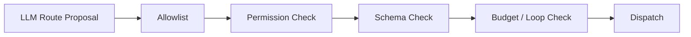

## 13.24 Hybrid Routing

Hybrid routing combines deterministic control with model judgment:

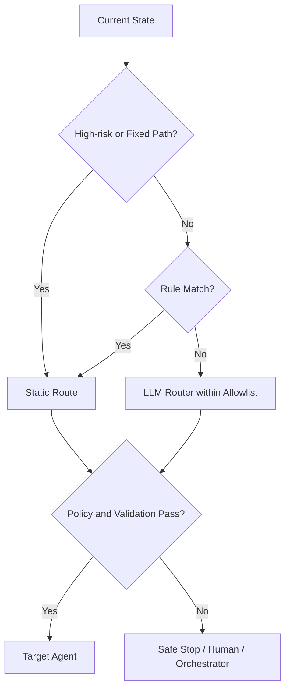

Static routes must also pass authorization, parameter, and budget checks. A predefined path does not mean that the current request has permission to execute.

One common claim needs correcting:

> It is not “static routing provides the baseline, while dynamic routing handles every exception.”

The last resort for high-risk exceptions should be:

- A safe stop;
- Human intervention;
- A deterministic fallback;

not an unconditional transfer to an LLM.

## 13.25 Delegation and Handoff

Both mechanisms let another agent do work, but they differ in who retains control.

### 13.25.1 Delegation

The current agent retains control and assigns a subtask to a worker:

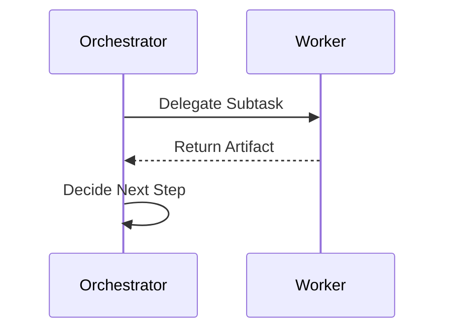

Suitable when:

- The orchestrator needs to maintain an overall view.
- Subtask boundaries are clear.
- Multiple workers run in parallel.
- Results need to be merged centrally.

### 13.25.2 Handoff

The current agent transfers control of the subsequent conversation or task to another agent:

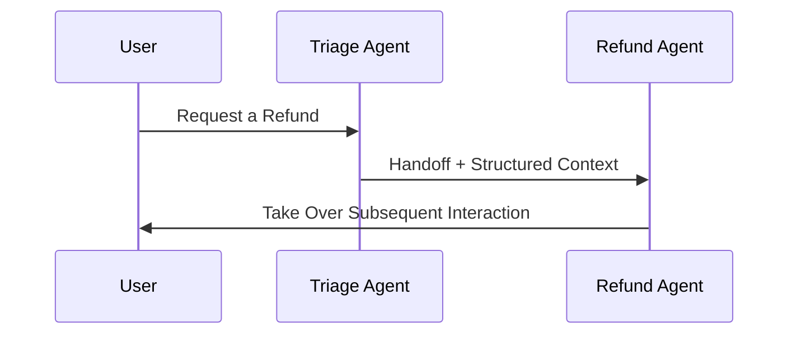

Suitable when:

- The receiving agent should interact directly with the user.
- A specialist needs to retain control over subsequent turns.
- Task boundaries are stable.
- The original agent does not need to aggregate results.

### 13.25.3 Comparison

The engineering distinction here is who decides the next step after the call finishes. SDK documentation may also use “delegation” broadly to include handoffs; follow the actual control flow. An in-process handoff transfers execution within the runner. A cross-service handoff also requires a durable acknowledgment of receipt and an ownership change. Sending a network message alone does not establish that control has transferred successfully.

| Delegation | Handoff |
|---|---|
| The caller retains control | Control transfers |
| The worker returns its result to the caller | The receiving agent continues processing |
| Suitable for subtasks | Suitable for switching responsibility |
| Common in orchestrator-workers designs | Common in customer-support triage |

## 13.26 OpenAI Swarm and the Agents SDK

Swarm was an early educational and experimental OpenAI framework demonstrating handoffs.

For this approach, OpenAI officially recommends migrating from Swarm to the Agents SDK, which it describes as a production-ready upgrade. The SDK supports:

- Agents;
- Agents as tools;
- Handoffs;
- Guardrails;
- Sessions;
- Human-in-the-loop;
- Tracing.

In the Agents SDK, a handoff is typically exposed to the model as a tool, for example:

```text
transfer_to_refund_agent
```

After the model selects that tool, the runtime transfers control to the corresponding agent.

These framework features do not mean that all authorization and recovery are handled by default. According to the [Handoffs documentation](https://openai.github.io/openai-agents-python/handoffs/), `input_type` defines model-generated handoff arguments. It neither replaces the receiving agent's entire input nor serves as an identity credential. When authorization depends on those arguments, check them before any side effects. `Agent.as_tool()` is better suited to returning a result to the original caller; a handoff lets the receiving agent take over subsequent execution. Confirm exact parameters and guardrail coverage against the SDK version pinned for deployment.

## 13.27 Handoff Contract

A reliable handoff needs more than “Over to you.”

```json
{
  "handoff_id": "handoff-42",
  "from_agent": "triage-agent",
  "to_agent": "refund-agent",
  "task_id": "task-100",
  "reason": "用户报告重复扣款",
  "goal": "确认订单并处理退款",
  "context_summary": "用户已完成身份验证",
  "artifacts": [
    "artifact://order-details.json"
  ],
  "constraints": [
    "退款前必须再次确认金额"
  ],
  "deadline": "2026-08-28T10:00:00Z",
  "return_policy": "do_not_return"
}
```

The Chinese example values say that the user reported a duplicate charge, the goal is to confirm the order and process a refund, and the context summary says the user has completed authentication. The constraint requires confirming the amount again before issuing the refund.

A handoff should include at least:

- Source and target agents;
- Goal;
- Reason;
- Completed work;
- Outstanding work;
- Required artifacts;
- Constraints;
- Permissions;
- Deadline;
- Return or termination policy.

“The user has completed authentication” is a natural-language summary, not a trusted identity. The receiving agent should obtain the user identity, tenant, authorization scope, authentication validity period, and approval receipt from a trusted runtime, then recheck order ownership. Fields such as `return_policy` are application conventions; putting them in JSON does not make the SDK enforce them.

## 13.28 Handoff Context Filtering

A secure design should pass only necessary history. By default, however, an OpenAI Agents SDK handoff exposes the previous conversation to the recipient, so mechanisms such as `input_filter` must be configured explicitly. This is the distinction between a recommended policy and a framework default.

It is reasonable to pass:

- A structured summary;
- The current goal;
- Verified facts;
- Necessary artifacts;
- Explicit user constraints;
- Relevant recent messages.

Do not pass these by default:

- Another agent's private scratchpad;
- Irrelevant tool results;
- Sensitive credentials;
- Unverified speculation;
- Full hidden reasoning.

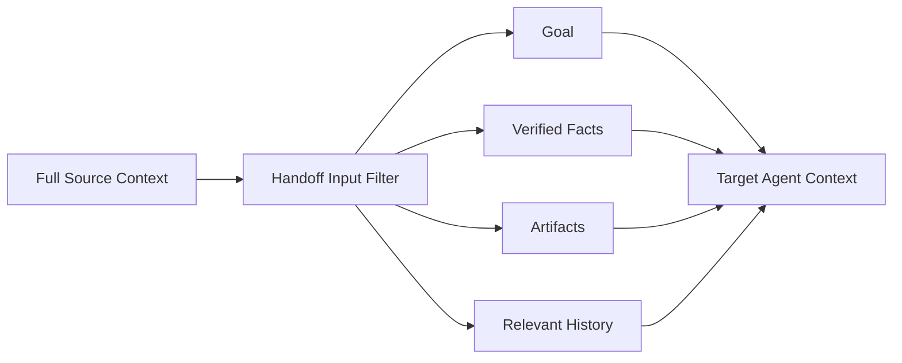

## 13.29 Handoff Loops

Recording which agents have been visited can detect some loops, but may also reject legitimate returns.

More robust detection signals include:

- Total handoff count;
- Visits to the same agent;
- Repeated occurrence of the same task-state hash;
- Repeated switching between the same agent pair;
- Multiple rounds with no new artifact;
- No change in progress toward the goal.

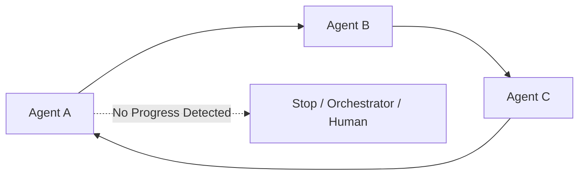

Allow reasonable revisits, but require:

- A change in state;
- New artifacts;
- An explicit reason for returning;
- Remaining within budget.

Ignore irrelevant state changes such as timestamps and token counts when detecting loops. Otherwise, a different hash on every round can conceal a loop. A new file alone is not proof of progress, either. Tie progress to unmet acceptance criteria, and have the runtime impose limits on revisions, depth, and total calls.

## 13.30 Routing Fallback

When the router cannot choose reliably, it should return:

```json
{
  "route_status": "UNRESOLVED",
  "reason": "两个 Agent 的能力都不足以处理法律判断",
  "recommended_action": "human_review"
}
```

The Chinese `reason` means “Neither agent has the capability to make the required legal judgment.”

Do not:

- Pick an agent at random;
- Silently default to the agent with the highest privileges;
- Retry the router indefinitely;
- Send an unknown task to an all-purpose agent.

## 13.31 Agent Discovery

A dynamic system needs a capability registry:

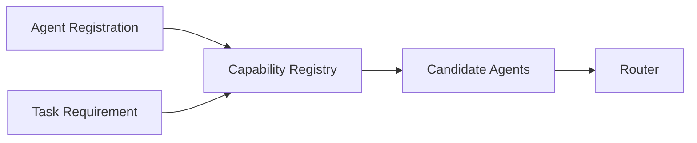

The registry should record:

- Agent ID;
- Skills;
- Input / output schema;
- Endpoint;
- Authentication;
- Availability;
- Cost;
- Latency;
- Version;
- Trust level.

An A2A Agent Card can describe capabilities across systems, but an internal runtime registry may still be needed.

## 13.32 The Role of A2A

A2A provides independent agent systems with:

- Agent Cards;
- Tasks;
- Messages;
- Artifacts;
- Streaming;
- Push notifications;
- A task lifecycle;
- Multiple protocol bindings.

It lets agents collaborate without knowing one another's internal memory, tools, or implementation details.

For example, in the [specification at the v1.0.1 release tag](https://github.com/a2aproject/A2A/blob/v1.0.1/docs/specification.md), the wire protocol version is `1.0`, separate from the specification's patch number, the SDK version, and the agent software version. Pin the protocol binding when integrating; do not mix in older fields or RPC names. Features such as streaming and push notifications also require checking declared capabilities. Sending a message can return a task or a direct message response; not every call creates a task.

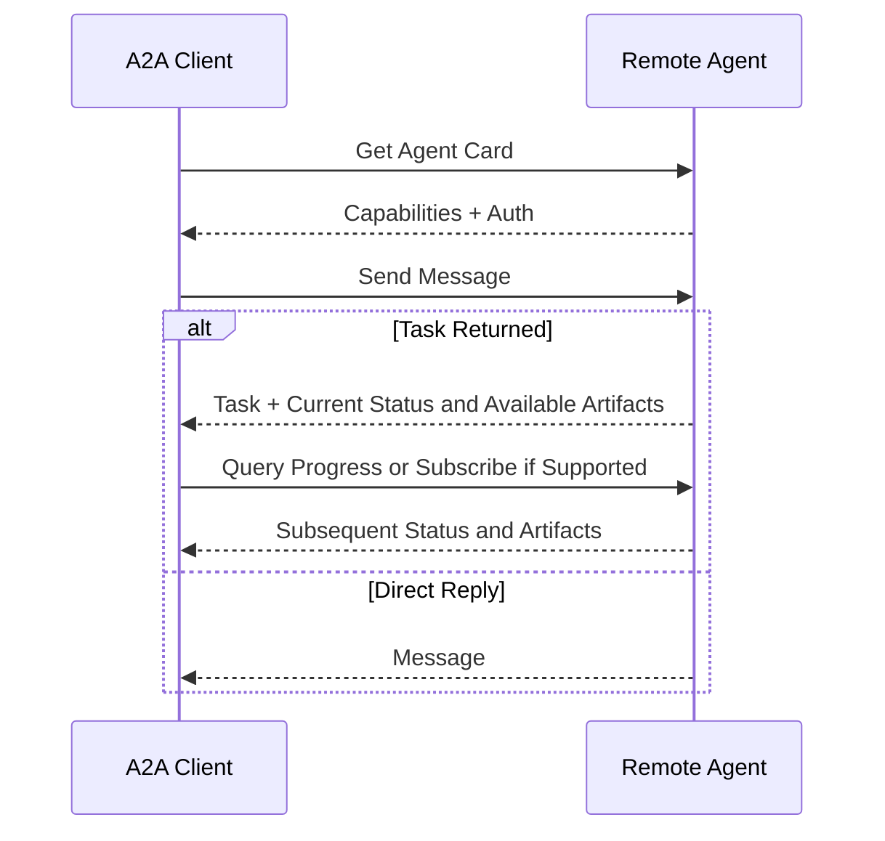

A2A supplies an interoperability protocol. It does not replace:

- An orchestrator;
- Task decomposition;
- A router;
- Authorization policies;
- Cost settlement;
- Result validation.

For A2A bindings, Agent Cards, and the task state machine, see [Tools: The A2A Protocol](../../tools/04-agent-communication/11-a2a-protocol.md). For cross-organization identity, callback SSRF, token audience, and Card trust boundaries, see [Tool Protocol Security](../../tools/02-mcp/15-tool-protocol-security.md).

## 13.33 A Message Schema for Agent Coordination

Recommended message fields:

```json
{
  "message_id": "msg-900",
  "schema_version": "1.0",
  "task_id": "task-42",
  "correlation_id": "run-101",
  "causation_id": "msg-899",
  "sender": "orchestrator",
  "recipient": "research-agent",
  "message_type": "task.request",
  "idempotency_key": "task-42-research-v1",
  "deadline": "2026-08-28T09:10:00Z",
  "trace_id": "trace-77",
  "payload": {
    "goal": "调研竞品 A",
    "artifact_schema": "competitor-research"
  }
}
```

The example's Chinese `goal` means “Research competitor A.”

What the fields do:

- `message_id`: uniquely identifies the message;
- `task_id`: identifies the task it belongs to;
- `correlation_id`: correlates an entire run;
- `causation_id`: tracks the causal chain;
- `idempotency_key`: the receiver stores, checks, and deduplicates it by business operation; the field alone prevents nothing;
- `deadline`: the runtime checks it before dispatch, retry, and commit; it cannot automatically stop remote side effects;
- `trace_id`: supports observability.

Keep the idempotency key stable when redelivering the same business operation; do not generate a new key on every retry. Use a separate `attempt_id` for a new execution attempt and include the input version. Reject different parameters supplied under the same idempotency key. At a minimum, deduplication must distinguish tenants and operation types, and retention must cover the window in which messages may be replayed.

## 13.34 Cancellation Propagation

When the user cancels the overall task, cancellation needs to reach:

- Running workers;
- Queued tasks;
- External tools;
- Downstream dependencies;
- Incomplete handoffs.

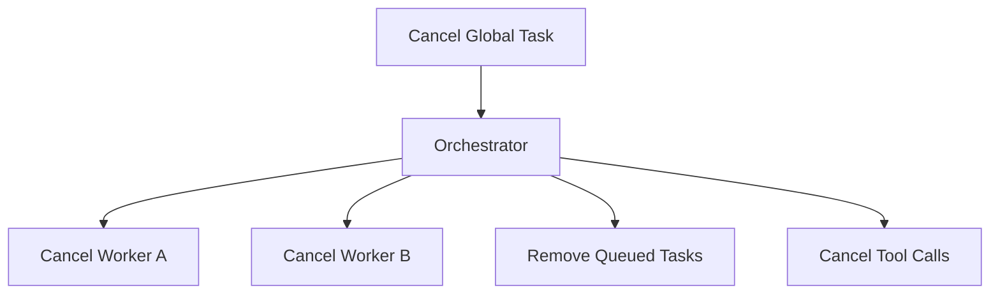

Implement cancellation tokens or task-status checks for agents and tools under your control. External services may not support cancellation, and even when they do, it may be too late to prevent side effects that have already occurred. First persist the cancellation intent in the authoritative ledger, then stop new dispatches and propagate it to executors. Even if queued messages cannot be removed, workers should check task status when claiming them. Retain late results only for auditing; they must not advance downstream work.

Cancellation is not rollback. A sent email cannot be “unexecuted,” and a completed payment may need a separate refund process. Compensating operations also need authorization, idempotency, and failure records. Record “cancellation requested,” “stop confirmed,” and “side effects awaiting reconciliation” separately. Do not hide unknown outcomes behind a single `cancelled` status.

## 13.35 Timeouts and Retries

### 13.35.1 Timeout

Distinguish:

- Timeout for a single tool call;
- Agent-step timeout;
- Task timeout;
- Overall run timeout.

A subtask's deadline must not exceed the parent's remaining time, and should leave room for aggregation or a safe exit. A client timeout only means the result did not arrive in time; it does not prove that the server failed to complete the operation.

### 13.35.2 Retry

Retry only retryable errors, using:

- Exponential backoff;
- Jitter;
- A maximum attempt count;
- Idempotency keys.

Let one layer coordinate retries so the SDK, worker, and orchestrator do not amplify load by retrying simultaneously. Retries also consume budget and concurrency slots. A 429 response or transient service error can be retried after the delay indicated by the service. Schema errors, permission denials, and deterministic test failures call for fixing the cause or replanning, not repeating the same call unchanged.

### 13.35.3 Fallback

Possible fallbacks include:

- Switching agents;
- Switching tools;
- Falling back to a less capable model;
- Returning partial results;
- Requesting human intervention.

## 13.36 Observability

A multi-agent system must record:

- Who created the task;
- Who routed work to whom;
- Why that agent was selected;
- Which context and artifacts were passed;
- What each agent did;
- Which step failed;
- Tokens, costs, and latency;
- Handoff count;
- Where the final result came from.

```mermaid
flowchart LR
    O[Orchestrator] -.Trace.-> OBS[Observability]
    A1[Agent A] -.Trace.-> OBS
    A2[Agent B] -.Trace.-> OBS
    Q[Queue / State] -.Metrics.-> OBS
    T[Tools] -.Logs.-> OBS
```

Standardize:

- Trace IDs;
- Spans;
- Task IDs;
- Agent IDs;
- Artifact IDs;
- Route decisions;
- Error codes.

Retain input versions, model and tool versions, important scheduling decisions, validation receipts, and budget-reservation records so planning, execution, and acceptance errors can be distinguished. Redact traces and restrict access; recording hidden reasoning is not required. Replaying recorded tool results helps diagnose scheduling problems. Calling a model or external API again may produce different results, so it cannot support a promise of byte-for-byte reproducibility.

## 13.37 Security

Dynamic switching extends authorization boundaries.

Check:

- Whether the source agent is allowed to delegate;
- Whether the target agent is allowed to process the data;
- Whether the handoff payload contains sensitive information;
- Whether the target agent is allowed to call high-risk tools;
- Whether the external agent's identity is trustworthy;
- Whether messages have been tampered with or replayed.

### 13.37.1 Confused Deputy

A low-privilege agent may induce a higher-privilege agent to perform sensitive operations on its behalf.

Defenses:

- Reauthorize every tool call;
- Do not inherit implicit permissions from the source agent;
- Record the original user's identity and intent;
- Reconfirm high-risk operations;
- Do not let handoffs automatically elevate privileges.

## 13.38 Customer-Support Example

```mermaid
flowchart TB
    U[User Request] --> T[Triage Workflow]
    T --> R{Static Rules}

    R -->|Order Inquiry| O[Order Agent]
    R -->|Refund| F[Refund Agent]
    R -->|Technical Issue| X[Technical Agent]
    R -->|Unrecognized| L[LLM Router]

    L --> C{Validated Route}
    C -->|Pass| TARGET[Allowed Agent]
    C -->|Fail or Uncertain| H[Human Support]

    F --> APPROVE{Refund Approval}
    APPROVE -->|Approved| TOOL[Refund Tool]
    APPROVE -->|Rejected| H
```

Design points:

- Use static routes for common intents.
- Route ambiguous intents dynamically within an allowlist.
- Pass the order artifact in a refund handoff.
- Do not give the refund agent unrestricted inherited permissions.
- Require approval before executing a refund.
- Safely escalate unrecognized requests to a person.

## 13.39 Collaborative Coding Example

```mermaid
flowchart TB
    G[User Goal] --> O[Coding Orchestrator]
    O --> E[Explore Agent]
    E --> A[Architecture Artifact]
    A --> C[Coding Agent]
    C --> D[Patch Artifact]
    D --> TEST{Required Tests Pass?}
    TEST -->|No - Return Failure Evidence| C
    TEST -->|Yes| R[Review Agent]
    R --> V{Pass?}
    V -->|No - Return Valid Findings| C
    V -->|Yes| ACCEPT[Final Acceptance by Orchestrator]
    ACCEPT --> DONE[Deliver Results]
```

The diagram explores interfaces and dependencies before generating a patch. Testing and review each have a failure path. The orchestrator manages the whole process: a successful review leads to final acceptance, not back to the user goal for another round of exploration. If the process exceeds its budget, lacks permissions, or cannot fix a problem, it stops and reports unfinished work.

Recommendations:

- Give the explore agent read-only access.
- Allow the coding agent to modify the workspace.
- Give the review agent read-only access to the diff and relevant context, tests, and dependencies.
- Keep final control with the orchestrator.
- Use artifacts for patches and reports.
- Use a structured schema for review findings.
- Have the runtime enforce the maximum revision count.

When extending this design to parallel coding workers, first fix the interfaces and base commit, then give each worker an isolated workspace. Deliver patches with their base SHA, and let one integrator run tests on an integration branch. A lack of textual conflicts does not imply semantic compatibility: two modules may pass their own tests while using different units or error conventions. Repeated problems of this kind indicate that task boundaries need to change.

## 13.40 Selection Guide

| Scenario | Recommended mechanism |
|---|---|
| Processing in a fixed sequence | Pipeline |
| Central scheduling for complex tasks | Orchestrator |
| Concurrent workers | Queue + Task Ledger |
| Multiple consumers responding to events | Pub/Sub |
| Multiple agents reusing results | Shared Workspace + Artifact |
| Cross-organization agent interoperability | A2A |
| A specialist taking over the user conversation | Handoff |
| A worker returning after completing a subtask | Delegation |
| High-risk or stable main paths | Static Routing |
| Ambiguous, open-ended, low-risk triage | Constrained LLM Routing |
| Top-level scheduling or context becoming a bottleneck | Evaluate hierarchical orchestrators |

## 13.41 A Recommended Production Architecture

```mermaid
flowchart TB
    INPUT[User / Event] --> WF[Deterministic Workflow]
    WF --> ROUTER[Hybrid Router]

    ROUTER --> REG[Capability Registry]
    REG --> POLICY[Permission + Risk Policy]
    POLICY --> LEDGER[Task Ledger]

    LEDGER --> QUEUE[Task Queue]
    QUEUE --> A1[Agent A]
    QUEUE --> A2[Agent B]
    QUEUE --> AN[Agent N]

    A1 --> ART[Artifact Store]
    A2 --> ART
    AN --> ART

    A1 --> EVENTS[Event Stream]
    A2 --> EVENTS
    AN --> EVENTS

    EVENTS --> STATE[Materialized State]
    STATE -.Progress hints.-> ROUTER
    ART --> VERIFY[Verifier]
    VERIFY -->|Accepted| JOIN[Result Aggregator]
    VERIFY -->|Failed or Insufficient Evidence| WF
    JOIN --> WF

    LEDGER -->|Authorized Handoff| SPECIAL[Specialist Agent]
    ROUTER -->|Unresolved or Invalid Route| HUMAN[Human Review]

    WF -.Trace.-> OBS[Observability]
    ROUTER -.Route Decisions.-> OBS
    A1 -.Spans.-> OBS
    A2 -.Spans.-> OBS
    AN -.Spans.-> OBS
```

Core principles:

1. A deterministic workflow controls high-level boundaries.
2. A hybrid router selects agents within an allowlist.
3. The task ledger is the source of truth for task state.
4. A queue handles asynchronous dispatch.
5. An artifact store carries large results.
6. An event stream retains audit records and state changes.
7. A verifier checks outputs.
8. Handoffs are used only where control genuinely needs to transfer.
9. Requests that cannot be routed reliably or fail risk checks stop safely or go to a person.

This is a functional decomposition, not a requirement to deploy every component as a separate service. In particular, asynchronous `Materialized State` must not authorize task claims, budget use, or commits; those checks belong in the authoritative task ledger. If the ledger is the source of truth, write the state change and the pending event in the same transaction using a [transactional outbox](https://docs.aws.amazon.com/prescriptive-guidance/latest/cloud-design-patterns/transactional-outbox.html), then deliver the event asynchronously. Otherwise, a crash after committing state but before sending the notification can leave work undispatched. Event sourcing makes a different choice of source of truth; two independently mutable copies cannot both be authoritative.

### 13.41.1 Parallel Scheduling and Joins

After the model proposes a DAG, the scheduler checks that dependencies exist, the graph is acyclic, and output contracts are compatible. A node enters the ready set only after its required predecessors pass acceptance checks. Then atomically claim the lease and reserve budget before dispatching. Do not make the model call first and discover afterward that no budget was available.

Concurrency limits must cover runs, tenants, model endpoints, and external tools. Limiting the number of workers does not limit parallel calls inside each worker. When many tasks are ready, balance critical-path priority with fairness so one large task does not monopolize resources. Queues provide backpressure, but queueing time still counts toward end-to-end latency.

Define join semantics before execution:

- **All-required**: Wait for all required results and validate each one. If optional tasks fail, partial results may be returned with the gaps stated.
- **First-valid**: Suitable for interchangeable candidates. Accept the first result that passes independent validation, not the first to return text; cancel remaining work and account for its cost.
- **K-of-N**: Suitable for tasks that explicitly allow redundancy. Reaching a numerical threshold does not establish factual correctness: results from the same model or source may be highly correlated. It is certainly not a storage-system quorum commit.

After a worker reports `completed`, its result should first enter a pending-validation state. A run succeeds only when evidence covers every required acceptance criterion for the current plan version, no unresolved side effect can change the conclusion, and the final commit succeeds. A temporarily empty queue does not establish completion if any branch waits forever, keeps creating tasks in a loop, or silently omits dependencies.

### 13.41.2 Budget Reservation and Failure Recovery

Workers must not each read the shared balance independently and conclude that money remains. Maintain settled costs, in-flight reservations, and limits in the ledger, for example:

$$
C_{spent}+C_{reserved}\le B_{run}
$$

This is a scheduling invariant, not a mathematical guarantee about unknown external bills. Reservations should cover the controllable maximum token count, tool-call count, and provider billing constraints. Without a hard upper bound, a system cannot promise never to overspend; it needs conservative headroom, provider limits, and a policy for overruns.

Atomically increase the reservation at dispatch, then atomically settle costs and release the difference after receiving trustworthy usage data. If it is unclear whether a charge occurred, keep the reservation until a query or reconciliation resolves it. Parent tasks should retain budget for aggregation and required validation; child agents may not expand their subtree budgets themselves. Limits on total calls, recursion depth, retries, and deadlines prevent a system from overspending globally while every agent stays within its local budget.

During recovery, use persisted run IDs, task IDs, attempts, and input versions to identify completed work. Check leases, receipts, and budgets before reassigning unreachable tasks. Do not implement recovery by rerunning the entire model-generated plan, which may repeat side effects that have already occurred.

### 13.41.3 Evaluate Coordination, Not Just Answers

Beyond [Chapter 9, §9.31: Evaluating Whether Multi-Agent Is Worthwhile](09-single-vs-multi-agent.md), test misrouting and the appropriateness of refusals, handoff constraint-retention rates, required-dependency coverage, rejection of stale results, retry amplification, duplicate side effects, and budget overruns. Report quality, costs, and end-to-end latency including its tail together, rather than only the average duration of successful cases.

Validate invariants using fixed failure sequences: a crash after claiming work; a successful external operation whose receipt is lost; an old worker returning after reassignment; simultaneous cancellation and completion; or failed notification delivery after a ledger commit. Record whether the system stops safely, preserves partial work, or retries correctly. Track “side effects cannot be confirmed” separately, rather than counting it as successful recovery.

## 13.42 Design Checklist

### 13.42.1 Coordination Topology

- Why choose a pipeline, orchestrator, blackboard, or P2P design?
- Are any agents unnecessary?
- Who owns the overall goal and final decision authority?

### 13.42.2 Communication

- Does the system use request/response, queues, pub/sub, or event streams?
- Do messages have schemas and versions?
- Are idempotency, retries, and cancellation supported?
- Are artifacts used for large results?

### 13.42.3 State

- Are global, task, and private state separated?
- Who writes each field?
- Do reducers overwrite, append, or perform custom merges?
- How are concurrent conflicts detected?

### 13.42.4 Routing

- Which paths do static rules cover?
- Are the LLM router's candidates constrained by an allowlist?
- Do permissions, costs, and availability influence selection?
- How does the system exit safely when confidence is low?

### 13.42.5 Handoff

- Does control really need to transfer, or would delegation suffice?
- Is the handoff contract complete?
- Is irrelevant or sensitive context filtered?
- How are loops and lack of progress detected?

### 13.42.6 Reliability

- Who takes over after an agent times out?
- How does a task lease expire?
- Are errors represented in state?
- Are local retries and replanning supported?

### 13.42.7 Security

- Can handoffs elevate privileges?
- Are external agents authenticated?
- Can shared state leak across tenants?
- Are high-risk operations reauthorized?

### 13.42.8 Observability

- Is there a shared trace ID?
- Can every route decision and handoff be reconstructed?
- Can agent success rates, costs, and latency be measured?
- Can loops, duplicated work, and lost messages be located?

## 13.43 Common Anti-Patterns

### 13.43.1 Sharing the Entire Conversation with Every Agent

This contaminates context, broadens exposure of private information, and wastes tokens.

### 13.43.2 Appending to Every State Field

Current status, ownership, and budgets cannot be updated correctly.

### 13.43.3 Overwriting Every State Field

Concurrent results and historical events are lost.

### 13.43.4 Equating Message Passing with Pub/Sub

This ignores the different semantics of request/response, queues, and event streams.

### 13.43.5 Letting an LLM Router Choose Any Agent

This makes unauthorized access, misrouting, and loops more likely.

### 13.43.6 Using Dynamic Routing as the Last Resort for Every Exception

Unknown high-risk situations should stop safely or be escalated to a person.

### 13.43.7 Conflating Handoff and Delegation

Control becomes unclear, and no one is responsible for aggregating results.

### 13.43.8 Preventing Loops Only by Recording Visited Agent Names

This cannot distinguish legitimate revisits from loops that make no progress.

### 13.43.9 Recording Errors Only in Logs

The router and orchestrator cannot use failure state to make decisions.

### 13.43.10 Repeatedly Copying Large Results Through Messages

This increases transport and context costs. Use artifacts instead.

## 13.44 Chapter Summary

Multi-agent coordination needs a coherent design for communication, state, routing, control transfer, reliability, security, and observability. Missing any one of these makes problems likely as the system scales.

For a single-team system that needs asynchronous multi-agent coordination, choose the necessary parts of this combination:

> **A workflow controls high-level boundaries; an orchestrator manages tasks; a hybrid router selects workers; messages trigger execution; state records task status; artifacts carry results; a verifier checks quality.**

A handoff lets a specialist take over subsequent interaction; delegation returns a subtask's result to the original caller. Dynamic routing needs constraints on candidates, permissions, budgets, and exit conditions. Model-reported confidence cannot replace authorization or acceptance. Ledger consensus determines how state is committed; evidence validation determines whether a business conclusion is trustworthy. Neither asynchronous progress projections nor the opinions of a majority of agents can replace these two layers of assurance.

## References

The Chinese source checked framework behavior against official documentation accessible on 2026-09-15; the English review rechecked the relevant documentation on 2026-09-20. Deployment still requires a pinned SDK version. The A2A [v1.0.1 release](https://github.com/a2aproject/A2A/releases/tag/v1.0.1) was published on 2026-05-28, although the specification page at that tag still labels v1.0.0 as the latest release. This chapter identifies the specification by its release tag, not by the page's “latest” notice.

Live framework documentation and the LangGraph source checked during translation are not snapshots of a deployed SDK. Raft's replicated-log and non-Byzantine failure assumptions were checked against the authors' overview and Ongaro's thesis source, not the linked paper PDF. Anthropic's article now notes that its tooling discussion dates from December 2024; it is used here for architectural patterns, not current interface guarantees.

- [LangGraph Graph API](https://docs.langchain.com/oss/python/langgraph/graph-api)
- [LangGraph: Concurrent State Update Error](https://docs.langchain.com/oss/python/langgraph/errors/INVALID_CONCURRENT_GRAPH_UPDATE)
- [LangGraph Persistence](https://docs.langchain.com/oss/python/langgraph/persistence)
- [OpenAI Agents SDK](https://openai.github.io/openai-agents-python/)
- [OpenAI Swarm: Official Guidance on Migrating to the Agents SDK](https://github.com/openai/swarm)
- [OpenAI Agents SDK: Handoffs](https://openai.github.io/openai-agents-python/handoffs/)
- [A2A v1.0.1 Protocol Specification](https://github.com/a2aproject/A2A/blob/v1.0.1/docs/specification.md)
- [Amazon SQS: At-Least-Once Delivery](https://docs.aws.amazon.com/AWSSimpleQueueService/latest/SQSDeveloperGuide/standard-queues-at-least-once-delivery.html)
- [etcd v3.6: API Consistency and Lease Guarantees](https://etcd.io/docs/v3.6/learning/api_guarantees/)
- [etcd v3.6: Lock and Transactional Protection](https://etcd.io/docs/v3.6/dev-guide/api_concurrency_reference_v3/)
- [AWS: Transactional Outbox](https://docs.aws.amazon.com/prescriptive-guidance/latest/cloud-design-patterns/transactional-outbox.html)
- [Raft: Authors' Algorithm and Paper Resources](https://raft.github.io/)
- [Anthropic: Building Effective Agents](https://www.anthropic.com/engineering/building-effective-agents)
- [LangGraph: `add_messages` Implementation](https://raw.githubusercontent.com/langchain-ai/langgraph/main/libs/langgraph/langgraph/graph/message.py)
- [OpenAI Agents SDK: Manager and Handoff Patterns](https://openai.github.io/openai-agents-python/agents/)
- [Diego Ongaro's Thesis: Replicated State Machines and Failure Assumptions](https://raw.githubusercontent.com/ongardie/dissertation/master/motivation/problem.tex)
